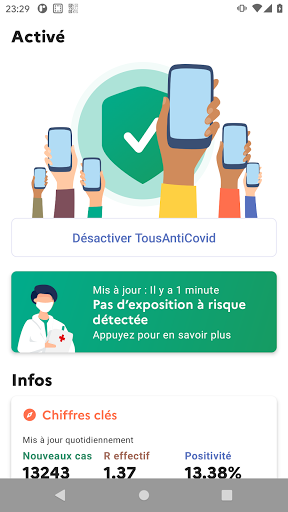
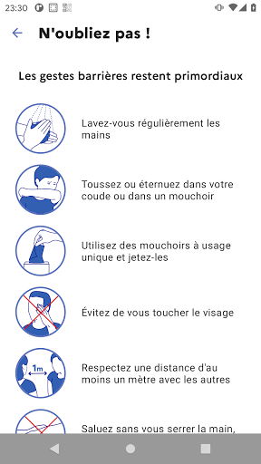
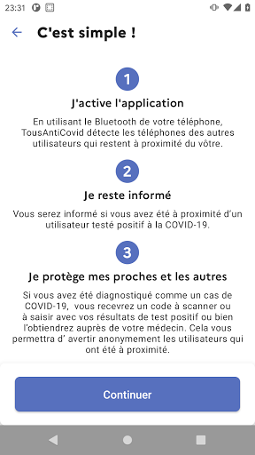

# TousAntiCovid
App version ``2.1.8``

Analyzed with [covid-apps-observer](http://github.com/covid-apps-observer) project, version ``0.1``

## App overview
| | |
|-------------------------|-------------------------| 
| **Name**&nbsp;&nbsp;&nbsp;&nbsp;&nbsp;&nbsp;&nbsp;&nbsp;&nbsp;&nbsp;&nbsp;&nbsp;&nbsp;&nbsp;&nbsp;&nbsp;&nbsp;&nbsp;&nbsp;&nbsp;&nbsp;&nbsp;&nbsp;&nbsp;&nbsp;&nbsp;&nbsp;&nbsp;&nbsp;&nbsp;&nbsp;&nbsp;&nbsp;&nbsp;&nbsp;&nbsp;&nbsp;&nbsp;&nbsp;&nbsp;  | TousAntiCovid |
| **Unique identifier** | fr.gouv.android.stopcovid |
| **Link to Google Play** | [https://play.google.com/store/apps/details?id=fr.gouv.android.stopcovid](https://play.google.com/store/apps/details?id=fr.gouv.android.stopcovid) |
| **Summary**  | Protégeons nos proches, protégeons-nous et protégeons les autres |
| **Privacy policy** | [https://bonjour.stopcovid.gouv.fr/privacy.html](https://bonjour.stopcovid.gouv.fr/privacy.html) |
| **Latest version** | 2.1.8 |
| **Last update** | 2020-11-25 18:19:32 |
| **Recent changes** | Attestations de sortie,  liens utiles, partage d&#39;infos et chiffres clés, et autres améliorations. |
| **Installs**  | 5 000 000+ |
| **Category** | Médecine |
| **First release** | 29 mai 2020 |
| **Size**  | 22M |
| **Supported Android version**  | 5.0 ou version ultérieure |

### Description
> L'application TousAntiCovid est destinée au territoire français.
 Vous pouvez désormais créer et sauvegarder vos attestations de déplacement dérogatoire directement dans l'application.
 Protégeons nos proches, protégeons-nous et protégeons les autres. 
 TousAntiCovid, c’est simple :
 # J'active l'application
 En utilisant le Bluetooth de votre téléphone, TousAntiCovid détecte les téléphones des autres utilisateurs qui restent à proximité du vôtre.
 # Je reste informé
 Vous serez informé si vous avez été à proximité d’un utilisateur testé positif à la COVID-19. Vous serez informés des derniers chiffres et de l’actualité sur l’épidémie. Vous aurez accès aux conseils personnalisés de Mes Conseils Covid.
 # Je protège mes proches et les autres
 Si vous devez vous faire tester, vous pourrez trouver le laboratoire le plus proche. Si vous êtes diagnostiqué comme un cas de COVID-19, votre laboratoire ou votre médecin vous donneront un code à scanner ou à saisir pour avertir anonymement les utilisateurs que vous avez rencontrés.
 # Mes données sont protégées
 L’application n’utilise à aucun moment la localisation des personnes, et il est impossible de connaître l’identité des utilisateurs.
 Cette application a été réalisée par l'équipe TousAntiCovid, sous la supervision du Ministère des Solidarités et de la Santé et du Secrétariat d'Etat chargé du Numérique.

### User interface
The developers of the app provide the following screenshots in the Google play store.
| | | |
|:-------------------------:|:-------------------------:|:-------------------------:|
 |   |   |   | 
 |   |   |   | 

## Development team
In the following we report the main information provided by the development team in the Google play store.

| | |
|-------------------------|-------------------------|
| **Developer**  | Gouvernement |
| **Website**  | [https://bonjour.tousanticovid.gouv.fr](https://bonjour.tousanticovid.gouv.fr) |
| **Email** | contact@tousanticovid.gouv.fr |
| **Physical address**  | [20 avenue de Ségur 75007 Paris](https://www.google.com/maps/search/20%20avenue%20de%20Ségur%2075007%20Paris) (Google Maps) |
| **Other developed apps**  | [https://play.google.com/store/apps/developer?id=Gouvernement](https://play.google.com/store/apps/developer?id=Gouvernement) |

## Android support

| | |
|-------------------------|-------------------------|
| **Declared target Android version**  | - |
| **Effective target Android version**  | - |
| **Minimum supported Android version**  | Lollipop, version 5.0 (API level 21) |
| **Maximum target Android version**  | - |

The larger the difference between the minimum and maximum supported Android versions, the better. A larger difference means a wider audience. For example, old phones have a very low Android version, so a high minimum supported Android version means that the app cannot be used by users with old phones, thus leading to accessibility problems. 

## Requested permissions

In the following we report the complete list of the permissions requested by the app. 

| **Permission** | **Protection level** | **Description** | 
|-------------------------|-------------------------|-------------------------|
 **android.permission ACCESS_COARSE_LOCATION** | :warning:**Dangerous** | Allows an app to access approximate location. 
 **android.permission ACCESS_FINE_LOCATION** | :warning:**Dangerous** | Allows an app to access precise location. 
 **android.permission ACCESS_NETWORK_STATE** | Normal | Allows applications to access information about networks. 
 **android.permission BLUETOOTH** | Normal | Allows applications to connect to paired bluetooth devices. 
 **android.permission BLUETOOTH_ADMIN** | Normal | Allows applications to discover and pair bluetooth devices. 
 **android.permission CAMERA** | :warning:**Dangerous** | Required to be able to access the camera device. 
 **android.permission FOREGROUND_SERVICE** | Normal | Allows a regular application to use Service.startForeground. 
 **android.permission INTERNET** | Normal | Allows applications to open network sockets. 
 **android.permission RECEIVE_BOOT_COMPLETED** | Normal | Allows an application to receive the Intent.ACTION_BOOT_COMPLETED that is broadcast after the system finishes booting. 
 **android.permission REQUEST_IGNORE_BATTERY_OPTIMIZATIONS** | Normal | Permission an application must hold in order to use Settings.ACTION_REQUEST_IGNORE_BATTERY_OPTIMIZATIONS. 
 **android.permission WAKE_LOCK** | Normal | Allows using PowerManager WakeLocks to keep processor from sleeping or screen from dimming. 

## Mentioned servers

| **Server** | **Registrant** | **Registrant country** | **Creation date** | 
|-------------------------|-------------------------|-------------------------|-------------------------|
 | google.com | Google LLC | :us: US | 1997-09-15 04:00:00 |
 | stopcovid.gouv.fr | Etat francais represente par le Ministere des Solidarites et de la Sante | - | 2020-04-15 12:02:42 |

## Security analysis 

Below we report the main security warnings raised by our execution of the [Androwarn](https://github.com/maaaaz/androwarn) security analysis tool.

**Connection interfaces exfiltration**
> - This application reads details about the currently active data network 
> - This application tries to find out if the currently active data network is metered 

**Telephony services abuse**
> - This application makes phone calls 

**Suspicious connection establishment**
> - This application opens a Socket and connects it to the remote address '; port is out of range' on the 'N/A' port  
> - This application opens a Socket and connects it to the remote address 'Lcom/android/tools/r8/GeneratedOutlineSupport;->outline19(Ljava/lang/String;)Ljava/lang/StringBuilder;' on the 'N/A' port  
> - This application opens a Socket and connects it to the remote address 'Ljava/net/Proxy;->type()Ljava/net/Proxy$Type;' on the 'N/A' port  
> - This application opens a Socket and connects it to the remote address 'timeout' on the 'N/A' port  

## User ratings and reviews

Below we provide information about how end users are reacting to the app in terms of ratings and reviews in the Google Play store.

### Ratings

The TousAntiCovid app has been installed by more than **5000000** times. At this time, **28662** rated the app and its average score is **3.5180075**. Below we show the distribution of the ratings across the usual star-based rating of Google Play

:star::star::star::star::star:: 12851

:star::star::star::star:: 4659

:star::star::star:: 2373

:star::star:: 2045

:star:: 6734

### Reviews 

#### 5-star reviews

> T8 y  :date: __2020-12-13 19:41:32__

> Excellente application.  :date: __2020-12-13 16:33:21__

> Pas encore testé ! !.  :date: __2020-12-13 15:52:58__

> Intéressant je suis satisfait !!  :date: __2020-12-13 15:17:22__

> Tres facile d'emploi, mis à jour régulièrement, les attestations sont très faciles à créer  :date: __2020-12-13 13:34:49__

> Très pratique  :date: __2020-12-13 12:45:56__

> C 😎 cool  :date: __2020-12-13 12:09:40__

> Si vous voulez un jour vous débarrasser du virus, protéger votre entourage et déconfiner une fois pour toute, utilisez tous l'application  :date: __2020-12-13 11:10:29__

> Tres bien pour les attestations Bientot je desinstale car elle ne sert a rien  :date: __2020-12-13 10:22:58__

> Vraiment une très grosse surprise. Ça fait quelques mois que je l'avais mais je ne l'utilisais pas vraiment. Mais là, je me suis rendu compte que l'application est très belle et ergonomique. Je viens aussi de voir qu'il est extrêmement facile de générer une attention dérogatoire de déplacements. Comparé au générateur sur internet, je n'ai plus besoin de m'encombrer avec les téléchargements de pdf. Bravo  :date: __2020-12-12 19:35:10__

#### 4-star reviews

> Le nouveau nom est ridicule, je préférais StopCovid, mais la nouvelle version est plus enrichie et interactif.  :date: __2020-12-13 10:13:38__

> Ça fait très bien le boulot.  :date: __2020-12-13 07:19:30__

> Impossible à activer sur redmi note 5  :date: __2020-12-12 23:16:16__

> Ok  :date: __2020-12-12 19:13:25__

> Apparemment très bon outil. Il reste donc à le diffuser le plus largement possible.  :date: __2020-12-12 18:41:04__

> Se deconnecte souvent . Échec du scanning Bluetooth Il faut couper puis remettre le blue toorh et ça repart pas tres table tout ca  :date: __2020-12-12 18:07:27__

> Je recommande cette appli ... Faut la télécharger...  :date: __2020-12-12 15:30:40__

> OK...  :date: __2020-12-11 18:37:05__

> U u  :date: __2020-12-11 16:38:37__

> Pratique, c'est une bonne idée..Ph  :date: __2020-12-11 10:31:55__

#### 3-star reviews

> les chiffres clés ne sont pas dans la totalité mise à jour régulièrement Comment pouvez vous inciter au chargement pas sérieux 😱  :date: __2020-12-13 18:01:58__

> Les infos enregistrées ont tendance à disparaître au moment de faire l'attestation  :date: __2020-12-13 17:39:28__

> Dommage qu'on ne puisse pas signalé qu'on a potentiellement le covid, parce que souvent les gens ne font pas le test par peur d'avoir une baisse de salaire en allant pas au travail Il faut obligatoirement un code délivré par son médecin  :date: __2020-12-13 17:36:22__

> Il est fort dommage que les chiffres soient actualisés avec autant de décalage : le lendemain de leur publication aux informations. Et toujours pas de mise à jour des données en temps réel : par exemple au 13/12/2020 à 14:05, les chiffres sont ceux de l'avant veille. À quoi bon avoir une appli qui fonctionne qu'a moitié autant regarder les infos sur la TV ou bien une recherche rapide sur le Web....  :date: __2020-12-13 14:07:10__

> Ma lubillule  :date: __2020-12-13 13:29:29__

> Pratique pour faire rapidement l'attestation, mais depuis la mise à jour de mon Redmi 8pro, impossible de se connecter. Je peux toujours faire les attestations, c'est déjà ça  :date: __2020-12-13 13:05:00__

> Cette appli fournit des informations intéressantes. Dommage que la mise à jour des données ne soit pas régulière et quotidienne. Aujourd'hui le 13 décembre, nous avons toujours les données du 11/12. Autre faille : elle puise trop sur la batterie  :date: __2020-12-13 11:10:28__

> C'est bien  :date: __2020-12-13 09:06:04__

> L'application part d'une bonne idée mais elle ne parle pas à tout le monde : la génération de l'attestation prend plus de temps à faire sur l'application que via le site du gouvernement et le bouton "générer" n'est pas assez visible. Il vaudrait mieux le mettre en plus gros  :date: __2020-12-13 07:53:46__

> L'application est pas mal au premier abord. Seul gros problème j'ai utilisé l'application pour ma sorti aujourd'hui, je suis parti envie 30 min pour faire des course et en rentrant j'avais perdu 30%de batterie alors que je n'avais pas du tout utilisé mon téléphone... Application à utiliser pour les sortis, oui, mais pas question de la faire fonctionner non stop.  :date: __2020-12-13 00:47:04__

#### 2-star reviews

> Ne fonctionnait pas jusqu'au 28/11/2020. Le 13/12/2020 encore hors services On est pas prêt de gagner la guerre...  :date: __2020-12-13 19:28:59__

> Je suis obligée régulièrement de désinstaller puis réinstaller l'application car elle refuse tout simplement de s'activer! Pas sûre que mes donnés de localisation restent dans ce cas de figure. heureusement que j'ai de la patience et que j'estime que cette application peut aider dans le combat contre la covid19, je pense que beaucoup doivent abandonner. Précision mon téléphone n'a qu'un an et demi donc pas si veux que ça! Xiamo redmi note 5.  :date: __2020-12-13 17:29:47__

> L'application affiche 101 patients en réa (taux d'occupation supposé 56.1%) pour le département du Cher le 13.12.20 alors qu'il n'y a que 12 lits... Cherchez l'erreur  :date: __2020-12-13 15:57:49__

> Bof plante souvent. Pas très utile. Je ne vois pas bien comment ça peut être efficace car après tout une personne qui sait qu elle est malade est censé rester chez elle. Je la garde juste pour les attestations pré remplies.  :date: __2020-12-13 12:50:25__

> L'idée est bonne, mais j'ai du la réinstaller plusieurs fois, ça plante trop souvent ☹️!  :date: __2020-12-13 12:39:33__

> Consomme trop de batterie malheureusement  :date: __2020-12-12 23:08:25__

> Se deconnecte sans arrêt, obligé de desinstaller et réinstaller sans cesse.. Facile à utiliser lorsqu'elle fonctionne  :date: __2020-12-12 17:53:57__

> On ne sait même pas si l application est active... Les chiffres décontamination n'ont jamais changé ?  :date: __2020-12-12 17:33:48__

> La version actuelle se desactive tout le temps ! Avant, l'appli fonctionnait en arrière plan ; depuis quelques temps, l'application se desactive en quelques heures, il faut manuellement la réactiver à tout bout de champ. Elle est donc devenue inutile (à part pour les attestations)  :date: __2020-12-12 17:15:51__

> S'arrête systématiquement il faut a chaque fois désinstaller et tout recommencer à par cela Bravo  :date: __2020-12-12 14:35:32__

#### 1-star reviews

> Ça sent le Big brother. Ça demande beaucoup trop d'autorisation  :date: __2020-12-13 18:17:24__

> Déconnexion intempestive du Bluetooth tous les 1/4h...  :date: __2020-12-13 18:11:15__

> Incompatible avec l'Europe C'est malheureux de dépenser autant de millions pour une application incompatible avec les autres en Europe et aussi dangereuse pour la sécurité de notre smartphone. Personnellement je l'ai pas installée, je ne veux être hacké.  :date: __2020-12-13 17:40:17__

> Bien  :date: __2020-12-13 16:31:01__

> se désactive au bout d'une minute.donc quand je sors, ça ne me sert à rien. Impossible de savoir,si j'aie croisé un cas contacte.jaimerai résoudre ce problème, meme sije ne sort pas beaucoup je suis a risque, jaie 74ans.  :date: __2020-12-13 16:28:31__

> Nul  :date: __2020-12-13 15:34:31__

> Ne reste pas connecté sur mon téléphone toute les fois il saute  :date: __2020-12-13 15:19:27__

> Bluetooth disfonctionnel, énergivore... Le générateur d'attestation est bof car on ne peut choisir qu'un seul motif... Aussitôt téléchargée, aussitôt desinstallée  :date: __2020-12-13 13:15:14__

> Impossible de l' ouvrir  :date: __2020-12-13 12:41:03__

> L'application c'est désactivé , impossible de pouvoir se reconnecter  :date: __2020-12-13 12:05:37__

