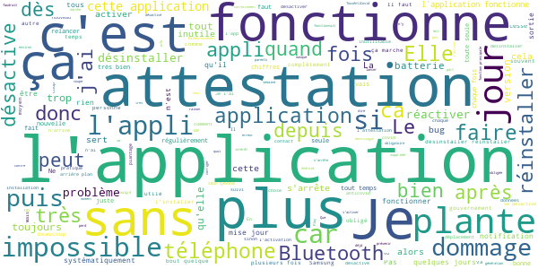
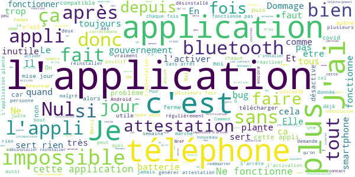

# TousAntiCovid
App version ``2.1.8``

Analyzed with [covid-apps-observer](http://github.com/covid-apps-observer) project, version ``0.1``

## App overview
| | |
|-------------------------|-------------------------| 
| **Name**&nbsp;&nbsp;&nbsp;&nbsp;&nbsp;&nbsp;&nbsp;&nbsp;&nbsp;&nbsp;&nbsp;&nbsp;&nbsp;&nbsp;&nbsp;&nbsp;&nbsp;&nbsp;&nbsp;&nbsp;&nbsp;&nbsp;&nbsp;&nbsp;&nbsp;&nbsp;&nbsp;&nbsp;&nbsp;&nbsp;&nbsp;&nbsp;&nbsp;&nbsp;&nbsp;&nbsp;&nbsp;&nbsp;&nbsp;&nbsp;  | TousAntiCovid |
| **Unique identifier** | fr.gouv.android.stopcovid |
| **Link to Google Play** | [https://play.google.com/store/apps/details?id=fr.gouv.android.stopcovid](https://play.google.com/store/apps/details?id=fr.gouv.android.stopcovid) |
| **Summary**  | Protégeons nos proches, protégeons-nous et protégeons les autres |
| **Privacy policy** | [https://bonjour.stopcovid.gouv.fr/privacy.html](https://bonjour.stopcovid.gouv.fr/privacy.html) |
| **Latest version** | 2.1.8 |
| **Last update** | 2020-11-25 18:19:32 |
| **Recent changes** | Attestations de sortie,  liens utiles, partage d&#39;infos et chiffres clés, et autres améliorations. |
| **Installs**  | 5 000 000+ |
| **Category** | Médecine |
| **First release** | 29 mai 2020 |
| **Size**  | 22M |
| **Supported Android version**  | 5.0 ou version ultérieure |

### Description
> L'application TousAntiCovid est destinée au territoire français.
 Vous pouvez désormais créer et sauvegarder vos attestations de déplacement dérogatoire directement dans l'application.
 Protégeons nos proches, protégeons-nous et protégeons les autres. 
 TousAntiCovid, c’est simple :
 # J'active l'application
 En utilisant le Bluetooth de votre téléphone, TousAntiCovid détecte les téléphones des autres utilisateurs qui restent à proximité du vôtre.
 # Je reste informé
 Vous serez informé si vous avez été à proximité d’un utilisateur testé positif à la COVID-19. Vous serez informés des derniers chiffres et de l’actualité sur l’épidémie. Vous aurez accès aux conseils personnalisés de Mes Conseils Covid.
 # Je protège mes proches et les autres
 Si vous devez vous faire tester, vous pourrez trouver le laboratoire le plus proche. Si vous êtes diagnostiqué comme un cas de COVID-19, votre laboratoire ou votre médecin vous donneront un code à scanner ou à saisir pour avertir anonymement les utilisateurs que vous avez rencontrés.
 # Mes données sont protégées
 L’application n’utilise à aucun moment la localisation des personnes, et il est impossible de connaître l’identité des utilisateurs.
 Cette application a été réalisée par l'équipe TousAntiCovid, sous la supervision du Ministère des Solidarités et de la Santé et du Secrétariat d'Etat chargé du Numérique.

### User interface
The developers of the app provide the following screenshots in the Google play store.
| | | |
|:-------------------------:|:-------------------------:|:-------------------------:|
 |   |   |   | 
 |   |   |   | 

## Development team
In the following we report the main information provided by the development team in the Google play store.

| | |
|-------------------------|-------------------------|
| **Developer**  | Gouvernement |
| **Website**  | [https://bonjour.tousanticovid.gouv.fr](https://bonjour.tousanticovid.gouv.fr) |
| **Email** | contact@tousanticovid.gouv.fr |
| **Physical address**  | [20 avenue de Ségur 75007 Paris](https://www.google.com/maps/search/20%20avenue%20de%20Ségur%2075007%20Paris) (Google Maps) |
| **Other developed apps**  | [https://play.google.com/store/apps/developer?id=Gouvernement](https://play.google.com/store/apps/developer?id=Gouvernement) |

## Android support

| | |
|-------------------------|-------------------------|
| **Declared target Android version**  | - |
| **Effective target Android version**  | - |
| **Minimum supported Android version**  | Lollipop, version 5.0 (API level 21) |
| **Maximum target Android version**  | - |

The larger the difference between the minimum and maximum supported Android versions, the better. A larger difference means a wider audience. For example, old phones have a very low Android version, so a high minimum supported Android version means that the app cannot be used by users with old phones, thus leading to accessibility problems. 

## Requested permissions

In the following we report the complete list of the permissions requested by the app. 

| **Permission** | **Protection level** | **Description** | 
|-------------------------|-------------------------|-------------------------|
 **android.permission ACCESS_COARSE_LOCATION** | :warning:**Dangerous** | Allows an app to access approximate location. 
 **android.permission ACCESS_FINE_LOCATION** | :warning:**Dangerous** | Allows an app to access precise location. 
 **android.permission ACCESS_NETWORK_STATE** | Normal | Allows applications to access information about networks. 
 **android.permission BLUETOOTH** | Normal | Allows applications to connect to paired bluetooth devices. 
 **android.permission BLUETOOTH_ADMIN** | Normal | Allows applications to discover and pair bluetooth devices. 
 **android.permission CAMERA** | :warning:**Dangerous** | Required to be able to access the camera device. 
 **android.permission FOREGROUND_SERVICE** | Normal | Allows a regular application to use Service.startForeground. 
 **android.permission INTERNET** | Normal | Allows applications to open network sockets. 
 **android.permission RECEIVE_BOOT_COMPLETED** | Normal | Allows an application to receive the Intent.ACTION_BOOT_COMPLETED that is broadcast after the system finishes booting. 
 **android.permission REQUEST_IGNORE_BATTERY_OPTIMIZATIONS** | Normal | Permission an application must hold in order to use Settings.ACTION_REQUEST_IGNORE_BATTERY_OPTIMIZATIONS. 
 **android.permission WAKE_LOCK** | Normal | Allows using PowerManager WakeLocks to keep processor from sleeping or screen from dimming. 

## Mentioned servers

| **Server** | **Registrant** | **Registrant country** | **Creation date** | 
|-------------------------|-------------------------|-------------------------|-------------------------|
 | google.com | Google LLC | :us: US | 1997-09-15 04:00:00 |
 | stopcovid.gouv.fr | Etat francais represente par le Ministere des Solidarites et de la Sante | - | 2020-04-15 12:02:42 |

## Security analysis 

Below we report the main security warnings raised by our execution of the [Androwarn](https://github.com/maaaaz/androwarn) security analysis tool.

**Connection interfaces exfiltration**
> - This application reads details about the currently active data network 
> - This application tries to find out if the currently active data network is metered 

**Telephony services abuse**
> - This application makes phone calls 

**Suspicious connection establishment**
> - This application opens a Socket and connects it to the remote address '; port is out of range' on the 'N/A' port  
> - This application opens a Socket and connects it to the remote address 'Lcom/android/tools/r8/GeneratedOutlineSupport;->outline19(Ljava/lang/String;)Ljava/lang/StringBuilder;' on the 'N/A' port  
> - This application opens a Socket and connects it to the remote address 'Ljava/net/Proxy;->type()Ljava/net/Proxy$Type;' on the 'N/A' port  
> - This application opens a Socket and connects it to the remote address 'timeout' on the 'N/A' port  

## User ratings and reviews

Below we provide information about how end users are reacting to the app in terms of ratings and reviews in the Google Play store.

### Ratings

The TousAntiCovid app has been installed by more than **5000000** times. At this time, **28662** rated the app and its average score is **3.5180075**. Below we show the distribution of the ratings across the usual star-based rating of Google Play

:star::star::star::star::star:: 12851

:star::star::star::star:: 4659

:star::star::star:: 2373

:star::star:: 2045

:star:: 6734

### Reviews 

#### 5-star reviews

> Si on gagne on sera les meilleurs mais si on perd aux moins on se sera battu vaillamment  :date: __2020-12-05 16:52:06__

> excellente initiative.  :date: __2020-12-05 16:00:48__

> Application à avoir en ce moment  :date: __2020-12-05 15:23:48__

> Intuitif informatif  :date: __2020-12-05 10:49:40__

> Facile d'utilisation  :date: __2020-12-05 09:54:20__

> Pour être solidaire  :date: __2020-12-05 09:45:46__

> Bonjour et bravo très très bonne application. Michel  :date: __2020-12-05 04:35:51__

> J'aime cette application car elle nous protège un peut plus à chaque installation donc installer la  :date: __2020-12-04 23:14:59__

> GENIAL!!!  :date: __2020-12-04 21:56:12__

> Super extray  :date: __2020-12-04 21:56:13__

#### 4-star reviews

> Il faudrait que l attestation de trouve en haut de la page  :date: __2020-12-05 13:03:33__

> N9e marche pas toujours ou c est moi qui comprend rien  :date: __2020-12-05 12:30:25__

> Consomme beaucoup de batterie  :date: __2020-12-05 12:22:50__

> Très bonne application facile à utiliser mais use beaucoup de batterie.  :date: __2020-12-05 11:05:36__

> Je voudrais signaler un problème : quand on reallume le smartphone après l'avoir éteint, la notification "tousanticovid est activé" est encore présente alors que l'application est désactivée  :date: __2020-12-05 10:29:54__

> Pratique pour les attestations  :date: __2020-12-04 19:14:40__

> Je fais bien attention le masque lorsque je suis avec des personnes hors-famille proche masqué lorsque je vais à mes activités et que le lieu le nécessite  :date: __2020-12-04 09:48:39__

> Pratique mais j ai téléchargé l'application il y a presque un mois et depuis quelques jours, elle ne fonctionne plus et se ferme.  :date: __2020-12-04 07:48:56__

> L'application plante sans cesse, je dois des installer et ré installer très souvent  :date: __2020-12-03 23:42:10__

> Tres bien  :date: __2020-12-03 20:48:46__

#### 3-star reviews

> Pratique à utiliser même si ça me gêne d'activer la géo-localisation et le Bluetooth pour être utile. Permet par contre de rédiger rapidement les attestations.  :date: __2020-12-05 15:59:58__

> L'application se désactive parfois toute seule, alors qu'elle s'exécute en arrière plan et que le Bluetooth est activé (sans interruption)  :date: __2020-12-05 14:15:33__

> Je démarre aujourd'hui grâce à mon petit fils je pourrais en dire plus un peu plus tard  :date: __2020-12-05 13:06:25__

> Impossible de l'activer  :date: __2020-12-05 12:38:01__

> Plantage régulier lors des MAJ on doit alors réinstaller l'application. Ceci n'est pas neutre sur l'enregistrement des données qui est nécessaire au tracing. Dommage... Sinon elle est fluide est claire.  :date: __2020-12-05 11:28:13__

> J'étais contente de l'application jusqu'au 2/12 env. mais depuis 3 ou 4 jours, l'appli envoie des notifications (sonores) intempestives "TousAntiCovid a besoin de vous" alors que je l'ai bien activé + permis les notifications !! La seule solution que j'ai trouvée, parce que c'est pénible, est de désactiver les notifications : si l'appli a besoin de nous, il faut commencer par ne pas déranger toutes les 30mn les personnes consciencieuses qui l'utilisent !!  :date: __2020-12-05 11:00:21__

> Obligé de le désinstaller et le réinstaller pour faire marcher l'application après 5 jours de fonctionnement (sur OnePlus 5T) Edit: 5-12-2020 toujours les mêmes problèmes  :date: __2020-12-05 10:57:00__

> Il y aurait un virus : je désinstalle. On recevrait de Faux sms qui nous mènerait à infester tel et ordi.  :date: __2020-12-05 09:47:54__

> L'appli ne se lance plus lorsque je passe le téléphone en mode avion. Assez pénible cette fragilité. Obligé de desinstaller puis réinstaller 4 fois déjà.  :date: __2020-12-05 08:45:01__

> Que de bogues Mise à jour tous les 5 jours  :date: __2020-12-04 23:45:15__

#### 2-star reviews

> Se désactive sans raison et impossible de la réactiver. Seule solution , la désinstaller puis la réinstaller a nouveau. Ceci arrive après chaque mise à jour. Je vais finir par l'abandonner après le15 décembre ....  :date: __2020-12-05 17:10:14__

> Impossible d'utiliser mon enceinte ou mon casque en bluetooth à cause de l'application  :date: __2020-12-05 16:20:45__

> L'appli marche à l'installation mais s'arrête systématiquement dès la mise en route avec le blue tooth dès la 2ème utilisation, obligation de desinstaller et réinstaller. Du coup elle ne me sert que pour les attestations...  :date: __2020-12-05 11:30:10__

> Malheureusement d'aucun intérêt pour moi vu que je suis confiné et personne dans mon entourage n'a téléchargé cette application.... Je l'ai gardé à peine 1 semaine...  :date: __2020-12-05 11:24:41__

> Vraiment pas top ! Bouffe la batterie en continu mais je m'y attendais. Le vrai problème c'est qu'à chaque fois qu'elle aurait pu être utile (lors de déplacements pro), l'appli était plantée et il fallait la relancer à mon arrivée à destination. Bref elle m'annonce 0 cas contact mais je n'y crois pas vu qu'elle se désactivé toute seule continuellement. Je la garde pour les attestations, le reste est inutile  :date: __2020-12-04 22:25:32__

> je n'arrive pas à activer l'application depuis qq jours alors qu'avant cela fonctionnait très bien..  :date: __2020-12-04 22:18:47__

> L'application est pas mal pour ce renseigner où se faire dépisté, nous montrer les chiffres lié au covid et faire une attestation mais depuis quelques jours impossible d'activé le tracing, l'appli plante. J'espère qu'il y aura une MAJ qui va corriger ça.  :date: __2020-12-04 20:19:16__

> L'application cesse de fonctionner au bout de quelques jours sans explication.j'en suis à mon 5 eme téléchargement..... fatiguant !...  :date: __2020-12-04 19:40:25__

> Hormis les attestations qui sont pratiques sinon je trouve inutile et trop enrgivore au niveau batterie avec le Bluetooth  :date: __2020-12-04 17:37:37__

> Ça va mais c'est pas super et je vois pas trop à quoi ça sert mais bon même si c'est limite ça va  :date: __2020-12-04 17:34:04__

#### 1-star reviews

> Meilleur appli la blague.  :date: __2020-12-05 16:59:05__

> Sa désactive toute seule.impossible à réactiver et l'application plante quand on veut la réactiver! Sert juste à remplir l'attestation  :date: __2020-12-05 16:35:34__

> Cela ne marche pas  :date: __2020-12-05 16:00:29__

> Je ne peux pas me servir de l'application elle se désactive toute seule ! Je l'ai désinstallé parce qu'inutile  :date: __2020-12-05 15:21:23__

> Mise à jour date impossible pour attestation sortie  :date: __2020-12-05 14:21:21__

> Codée avec le postérieur.  :date: __2020-12-05 14:12:36__

> Cette application marche 2 jours puis impossible de la réactiver. Je dois la desinstaller et la réinstaller tous les 2 jours...  :date: __2020-12-05 13:56:38__

> L appli se désactive sans arret.  :date: __2020-12-05 13:25:41__

> Service médiocre  :date: __2020-12-05 13:00:02__

> Ça bousille beaucoup de batterie il faut que je charge mon portable 2 à 3 fois par jour  :date: __2020-12-05 12:47:35__

