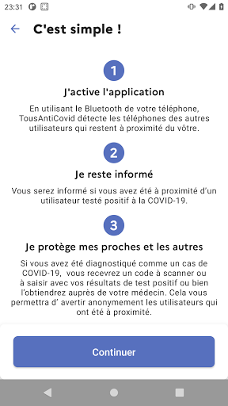

# TousAntiCovid
App version ``2.2.0``

Analyzed with [covid-apps-observer](http://github.com/covid-apps-observer) project, version ``0.1``

## App overview
| | |
|-------------------------|-------------------------| 
| **Name**&nbsp;&nbsp;&nbsp;&nbsp;&nbsp;&nbsp;&nbsp;&nbsp;&nbsp;&nbsp;&nbsp;&nbsp;&nbsp;&nbsp;&nbsp;&nbsp;&nbsp;&nbsp;&nbsp;&nbsp;&nbsp;&nbsp;&nbsp;&nbsp;&nbsp;&nbsp;&nbsp;&nbsp;&nbsp;&nbsp;&nbsp;&nbsp;&nbsp;&nbsp;&nbsp;&nbsp;&nbsp;&nbsp;&nbsp;&nbsp;  | TousAntiCovid |
| **Unique identifier** | fr.gouv.android.stopcovid |
| **Link to Google Play** | [https://play.google.com/store/apps/details?id=fr.gouv.android.stopcovid](https://play.google.com/store/apps/details?id=fr.gouv.android.stopcovid) |
| **Summary**  | Participez à la lutte contre l’épidémie en réduisant les risques de transmission |
| **Privacy policy** | [https://bonjour.stopcovid.gouv.fr/privacy.html](https://bonjour.stopcovid.gouv.fr/privacy.html) |
| **Latest version** | 2.2.0 |
| **Last update** | 2020-12-16 13:36:49 |
| **Recent changes** | Nouveau module pour définir la durée d&#39;isolement, attestations de couvre-feu, liens utiles, partage d&#39;infos et chiffres clés, et autres améliorations. |
| **Installs**  | 5 000 000+ |
| **Category** | Médecine |
| **First release** | 29 mai 2020 |
| **Size**  | 23M |
| **Supported Android version**  | 5.0 ou version ultérieure |

### Description
> L'application TousAntiCovid est destinée au territoire français.
 Vous pouvez désormais créer et sauvegarder vos attestations de déplacement dérogatoire directement dans l'application.
 Protégeons nos proches, protégeons-nous et protégeons les autres. 
 TousAntiCovid, c’est simple :
 # J'active l'application
 En utilisant le Bluetooth de votre téléphone, TousAntiCovid détecte les téléphones des autres utilisateurs qui restent à proximité du vôtre.
 # Je reste informé
 Vous serez informé si vous avez été à proximité d’un utilisateur testé positif à la COVID-19. Vous serez informés des derniers chiffres et de l’actualité sur l’épidémie. Vous aurez accès aux conseils personnalisés de Mes Conseils Covid.
 # Je protège mes proches et les autres
 Si vous devez vous faire tester, vous pourrez trouver le laboratoire le plus proche. Si vous êtes diagnostiqué comme un cas de COVID-19, votre laboratoire ou votre médecin vous donneront un code à scanner ou à saisir pour avertir anonymement les utilisateurs que vous avez rencontrés.
 # Mes données sont protégées
 L’application n’utilise à aucun moment la localisation des personnes, et il est impossible de connaître l’identité des utilisateurs.
 Cette application a été réalisée par l'équipe TousAntiCovid, sous la supervision du Ministère des Solidarités et de la Santé et du Secrétariat d'Etat chargé du Numérique.

### User interface
The developers of the app provide the following screenshots in the Google play store.
| | | |
|:-------------------------:|:-------------------------:|:-------------------------:|
 |   |   |   | 
 |   |   |   | 

## Development team
In the following we report the main information provided by the development team in the Google play store.

| | |
|-------------------------|-------------------------|
| **Developer**  | Gouvernement |
| **Website**  | [https://bonjour.tousanticovid.gouv.fr](https://bonjour.tousanticovid.gouv.fr) |
| **Email** | contact@tousanticovid.gouv.fr |
| **Physical address**  | [20 avenue de Ségur 75007 Paris](https://www.google.com/maps/search/20%20avenue%20de%20Ségur%2075007%20Paris) (Google Maps) |
| **Other developed apps**  | [https://play.google.com/store/apps/developer?id=Gouvernement](https://play.google.com/store/apps/developer?id=Gouvernement) |

## Android support

| | |
|-------------------------|-------------------------|
| **Declared target Android version**  | - |
| **Effective target Android version**  | - |
| **Minimum supported Android version**  | Lollipop, version 5.0 (API level 21) |
| **Maximum target Android version**  | - |

The larger the difference between the minimum and maximum supported Android versions, the better. A larger difference means a wider audience. For example, old phones have a very low Android version, so a high minimum supported Android version means that the app cannot be used by users with old phones, thus leading to accessibility problems. 

## Requested permissions

In the following we report the complete list of the permissions requested by the app. 

| **Permission** | **Protection level** | **Description** | 
|-------------------------|-------------------------|-------------------------|
 **android.permission ACCESS_COARSE_LOCATION** | :warning:**Dangerous** | Allows an app to access approximate location. 
 **android.permission ACCESS_FINE_LOCATION** | :warning:**Dangerous** | Allows an app to access precise location. 
 **android.permission ACCESS_NETWORK_STATE** | Normal | Allows applications to access information about networks. 
 **android.permission BLUETOOTH** | Normal | Allows applications to connect to paired bluetooth devices. 
 **android.permission BLUETOOTH_ADMIN** | Normal | Allows applications to discover and pair bluetooth devices. 
 **android.permission CAMERA** | :warning:**Dangerous** | Required to be able to access the camera device. 
 **android.permission FOREGROUND_SERVICE** | Normal | Allows a regular application to use Service.startForeground. 
 **android.permission INTERNET** | Normal | Allows applications to open network sockets. 
 **android.permission RECEIVE_BOOT_COMPLETED** | Normal | Allows an application to receive the Intent.ACTION_BOOT_COMPLETED that is broadcast after the system finishes booting. 
 **android.permission REQUEST_IGNORE_BATTERY_OPTIMIZATIONS** | Normal | Permission an application must hold in order to use Settings.ACTION_REQUEST_IGNORE_BATTERY_OPTIMIZATIONS. 
 **android.permission WAKE_LOCK** | Normal | Allows using PowerManager WakeLocks to keep processor from sleeping or screen from dimming. 

## Mentioned servers

| **Server** | **Registrant** | **Registrant country** | **Creation date** | 
|-------------------------|-------------------------|-------------------------|-------------------------|
 | google.com | Google LLC | :us: US | 1997-09-15 04:00:00 |
 | stopcovid.gouv.fr | Etat francais represente par le Ministere des Solidarites et de la Sante | - | 2020-04-15 12:02:42 |
 | tac.gouv.fr | Etat francais represente par le Ministere des Solidarites et de la Sante | - | 2020-11-24 09:54:22 |
 | tousanticovid.gouv.fr | Etat francais represente par le Ministere des Solidarites et de la Sante | - | 2020-10-19 09:30:28 |

## Security analysis 

Below we report the main security warnings raised by our execution of the [Androwarn](https://github.com/maaaaz/androwarn) security analysis tool.

**Connection interfaces exfiltration**
> - This application reads details about the currently active data network 
> - This application tries to find out if the currently active data network is metered 

**Telephony services abuse**
> - This application makes phone calls 

**Suspicious connection establishment**
> - This application opens a Socket and connects it to the remote address '; port is out of range' on the 'N/A' port  
> - This application opens a Socket and connects it to the remote address 'Lcom/android/tools/r8/GeneratedOutlineSupport;->outline19(Ljava/lang/String;)Ljava/lang/StringBuilder;' on the 'N/A' port  
> - This application opens a Socket and connects it to the remote address 'Ljava/net/Proxy;->type()Ljava/net/Proxy$Type;' on the 'N/A' port  
> - This application opens a Socket and connects it to the remote address 'timeout' on the 'N/A' port  

## User ratings and reviews

Below we provide information about how end users are reacting to the app in terms of ratings and reviews in the Google Play store.

### Ratings

The TousAntiCovid app has been installed by more than **5000000** times. At this time, **32116** rated the app and its average score is **3.6056383**. Below we show the distribution of the ratings across the usual star-based rating of Google Play

:star::star::star::star::star:: 14924

:star::star::star::star:: 5273

:star::star::star:: 2945

:star::star:: 2278

:star:: 6696

### Reviews 

#### 5-star reviews

> Très utile  :date: __2020-12-20 19:21:06__

> super 🎃  :date: __2020-12-20 19:18:49__

> Je protège les autres en me protégeant  :date: __2020-12-20 19:16:30__

> Il faut penser à ouvrir / utiliser l appli à chaque fois que je sors de mon domicile. Protégeons nous ! Bonne fin d année à tous !  :date: __2020-12-20 19:15:27__

> Utile et convivial  :date: __2020-12-20 19:01:33__

> Tout les français devraient en tant que citoyen l installer ! Ce qui éviterait une troisième puis une quatrième voire cinquième vague ! Soyez efficaces et serieux tout en protégeant vos proches.  :date: __2020-12-20 19:01:21__

> Pas de changement sur la conso batterie, simple a utiliser et pratique. Peu de dev arrive a ce niveau de fonctionnement, h24 sans crash sur plusieurs mois...  :date: __2020-12-20 18:50:11__

> Très pratique...  :date: __2020-12-20 18:47:48__

> Positif pour moi et mes parents  :date: __2020-12-20 18:37:58__

> Très pratique pour les attestations, le suivi des chiffres et autres recommandations.  :date: __2020-12-20 18:21:15__

#### 4-star reviews

> Bien, simple et rapide, des informations sur les chiffres COVID 19... je recommande !  :date: __2020-12-20 19:01:37__

> Je pense que l'application est bien pour l'info pour attestation si il y a eux contact avec covid19  :date: __2020-12-20 18:47:45__

> Facile à utiliser et très pratique  :date: __2020-12-20 17:22:59__

> Fonctionne mieux qu'avant et on y trouve maintenant des renseignements utiles. Pratique pour générer les attestations.  :date: __2020-12-20 17:18:24__

> Très bonne application  :date: __2020-12-20 14:22:58__

> Très bien,préventif Mais use trop de batterie  :date: __2020-12-20 14:19:19__

> Pour l'instant ( 2 jours ) ça a l'air bien fait, peut-être que les chiffres pourraient être actualisés plus souvent  :date: __2020-12-20 14:10:40__

> 😁  :date: __2020-12-20 13:35:47__

> J'ai eu le covid et quand j'ai voulu me déclarer il fallait un code, le secrétariat du médecin, la pharmacie, l 'infirmier, le laboratoire qui a traité mon analyse ,l'ARS personne n'a été capable de me donner le code  :date: __2020-12-20 13:08:17__

> Très utile d'avoir les sources officielles . Merci  :date: __2020-12-20 12:54:39__

#### 3-star reviews

> Trop de retard dans la mise à jour des informations  :date: __2020-12-20 17:04:42__

> Pratique pour faire une attestation et, ce dire qu aujourd'hui,on y a encore échappé...mais pour combien de temps avec le nouveau "variant"  :date: __2020-12-20 16:31:58__

> 1ère version appli non professionnelle bien améliorée ensuite mais encore bien plus à faire pour la rendre attractive : ex statistiques perso (je sais avec la CNIL, bien-pensance etc... pas facile), historiques et analyses data, comparaison avec étranger, conformité avec recos OMS, infos méthodes calcul data ?!... Attestations très fonctionnelles mais là aussi retard au démarrage...  :date: __2020-12-20 15:58:31__

> Pour les attestations c est top ! Pas contre pour les chiffres pas sûr que ce soit très fiable ! Pas de nouveaux cas dans ma région depuis que je l ai installé, alors que c'est pas le cas !!!!  :date: __2020-12-20 13:55:18__

> Plante toutes les 48h obligé de la réinstaller.  :date: __2020-12-20 12:03:07__

> Ww;;;&8446_''85ans dynamique  :date: __2020-12-20 11:27:02__

> Je trouve dommage que les chiffres affichés datent souvent de la veille ou de l avant veille alors que les infos diffusent les chiffres du jour.  :date: __2020-12-20 10:43:48__

> Pas fiable, chez moi elle ne démarre plus.  :date: __2020-12-20 10:24:34__

> données très anciennes pas de réactivité, programme gouvernement comme notre PM  :date: __2020-12-20 09:19:12__

> Pas assez charger par la population française.donc non sécuritaire. Publicité et incitations plus fequentes à effectuer.  :date: __2020-12-20 08:46:17__

#### 2-star reviews

> L'application est pas mal pour ce renseigner où se faire dépisté, nous montrer les chiffres lié au covid et faire une attestation mais depuis quelques jours impossible d'activé le tracing, l'appli plante. J'espère qu'il y aura une MAJ qui va corriger ça.  :date: __2020-12-20 17:47:32__

> De ed,  :date: __2020-12-20 16:25:44__

> Manque le jour de l'exposition  :date: __2020-12-20 16:04:07__

> Les chiffres ne sont pas mis à jour régulièrement  :date: __2020-12-20 14:06:14__

> J'avais les problèmes de plantage après 2-3 démarrages avant. Depuis la dernière mise à jour, quand je veux activer, j'ai "Cannot provide crypto-id. No EphemeralBluetoothIdentifier found". Smartphone: Moto G5 plus (XT1685), android 8.1.0. Je me dis que tous les pays auraient dû essayer de développer une app commune pour avoir une meilleure couverture de tests.  :date: __2020-12-20 13:03:58__

> Nul  :date: __2020-12-20 12:19:07__

> Application testée dans une grande surface ou il y avait beaucoup de monde. Même avec le bluetooth activé, l'application se désactivait au bout de 2-3min avec un message d'erreur. A corriger ... Pour les attestations, et les informations sur le nombre de contaminations journalières, parfait 👍  :date: __2020-12-20 11:07:14__

> C'est de la m..... les chiffres sont jamais à jours... a part pour l'attestation c'est pour cela que je met 2 étoiles, le rapport de contact arrive bien trop tard, bref je vire cette m.... de mon téléphone  :date: __2020-12-20 10:50:23__

> L'application plante régulièrement  :date: __2020-12-20 10:36:06__

> Mis a jour des cas de covid pas mis à jour rapidement  :date: __2020-12-20 08:36:50__

#### 1-star reviews

> En France on est pas capable de mettre à jour les données au jour le jour. Ah l''administration !!! Sinon ce serait une bonne application  :date: __2020-12-20 19:11:02__

> Mauvaise actualisation des données  :date: __2020-12-20 16:20:01__

> Je n ai jamais pu déclarer lorsque j'ai ete positif car il faut mettre un code que personne ne connait (laboratoire, pharmacie et medecin).  :date: __2020-12-20 16:17:24__

> J'ai installé cette application, elle fonctionnait bien puis depuis 4,5 jours, elle bug. Pourtant, je l'ai désinstaller et réinstaller plusieurs fois mais elle ne fonctionne plus.yy  :date: __2020-12-20 15:18:55__

> Tout le temps obligé de la relancer. Le problème n'existait pas sur la précédente. Une réponse des développeurs svp ?  :date: __2020-12-20 14:16:10__

> Fonctionnement à revoir, obligé de redémarrer le téléphone trop souvent pour faire fonctionner l'application où de la désinstaller et réinstaller. 🤔😱  :date: __2020-12-20 13:25:28__

> Faut toujours réactivé l'application ! Les chiffres ne changent pas.. Pas sûr de l'efficacité de cette application  :date: __2020-12-20 10:53:52__

> Le logiciel TousAnticovid part d'une bonne idée. Il y a cependant de nombreux points à améliorer : 1- pour les paramètres affichés, le nombre de morts/24h n'est pas indiqué. Pourquoi? C'est pour ne pas faire peur? D'entrée, c'est déplaisant. 2- Lamise à jour n'est pas faite tous les jours - Elle semble touristique. Soyez sérieux si vous voulez que les français le soient. 3- les paramètres doivent être mieux expliqués, juste dessous les chiffres clés. Un peu de pédagogie svp. Au boulot  :date: __2020-12-20 07:56:02__

> Cela fait déjà 5 fois que je la réinstalle car elle bug au bout de quelques jours. Toujours pas de correctif apporté malgré tous nos retours.  :date: __2020-12-20 07:04:20__

> Ne fonctionne toujours pas. 6 millions d'euros pour ça, c'est beau...  :date: __2020-12-20 06:20:52__

