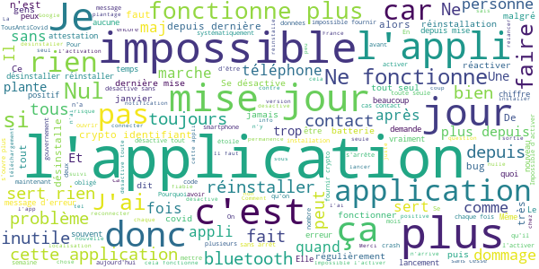

# TousAntiCovid
App version ``2.2.2``

Analyzed with [covid-apps-observer](http://github.com/covid-apps-observer) project, version ``0.1``

## App overview
| | |
|-------------------------|-------------------------| 
| **Name**&nbsp;&nbsp;&nbsp;&nbsp;&nbsp;&nbsp;&nbsp;&nbsp;&nbsp;&nbsp;&nbsp;&nbsp;&nbsp;&nbsp;&nbsp;&nbsp;&nbsp;&nbsp;&nbsp;&nbsp;&nbsp;&nbsp;&nbsp;&nbsp;&nbsp;&nbsp;&nbsp;&nbsp;&nbsp;&nbsp;&nbsp;&nbsp;&nbsp;&nbsp;&nbsp;&nbsp;&nbsp;&nbsp;&nbsp;&nbsp;  | TousAntiCovid |
| **Unique identifier** | fr.gouv.android.stopcovid |
| **Link to Google Play** | [https://play.google.com/store/apps/details?id=fr.gouv.android.stopcovid](https://play.google.com/store/apps/details?id=fr.gouv.android.stopcovid) |
| **Summary**  | Participez à la lutte contre l’épidémie en réduisant les risques de transmission |
| **Privacy policy** | [https://bonjour.stopcovid.gouv.fr/privacy.html](https://bonjour.stopcovid.gouv.fr/privacy.html) |
| **Latest version** | 2.2.2 |
| **Last update** | 2021-01-18 17:22:52 |
| **Recent changes** | Nouveaux modules vaccination et isolement, attestations de sortie, liens utiles, partage d&#39;infos et chiffres clés, et autres améliorations. |
| **Installs**  | 5 000 000+ |
| **Category** | Médecine |
| **First release** | 29 mai 2020 |
| **Size**  | 23M |
| **Supported Android version**  | 5.0 ou version ultérieure |

### Description
> L'application TousAntiCovid est destinée au territoire français.
 Vous pouvez désormais créer et sauvegarder vos attestations de déplacement dérogatoire directement dans l'application.
 Protégeons nos proches, protégeons-nous et protégeons les autres. 
 TousAntiCovid, c’est simple :
 # J'active l'application
 En utilisant le Bluetooth de votre téléphone, TousAntiCovid détecte les téléphones des autres utilisateurs qui restent à proximité du vôtre.
 # Je reste informé
 Vous serez informé si vous avez été à proximité d’un utilisateur testé positif à la COVID-19. Vous serez informés des derniers chiffres et de l’actualité sur l’épidémie. Vous aurez accès aux conseils personnalisés de Mes Conseils Covid.
 # Je protège mes proches et les autres
 Si vous devez vous faire tester, vous pourrez trouver le laboratoire le plus proche. Si vous êtes diagnostiqué comme un cas de COVID-19, votre laboratoire ou votre médecin vous donneront un code à scanner ou à saisir pour avertir anonymement les utilisateurs que vous avez rencontrés.
 # Mes données sont protégées
 L’application n’utilise à aucun moment la localisation des personnes, et il est impossible de connaître l’identité des utilisateurs.
 Cette application a été réalisée par l'équipe TousAntiCovid, sous la supervision du Ministère des Solidarités et de la Santé et du Secrétariat d'Etat chargé du Numérique.

### User interface
The developers of the app provide the following screenshots in the Google play store.
| | | |
|:-------------------------:|:-------------------------:|:-------------------------:|
 |   |   |   | 
 |   |   |   | 

## Development team
In the following we report the main information provided by the development team in the Google play store.

| | |
|-------------------------|-------------------------|
| **Developer**  | Gouvernement |
| **Website**  | [https://bonjour.tousanticovid.gouv.fr](https://bonjour.tousanticovid.gouv.fr) |
| **Email** | contact@tousanticovid.gouv.fr |
| **Physical address**  | [20 avenue de Ségur 75007 Paris](https://www.google.com/maps/search/20%20avenue%20de%20Ségur%2075007%20Paris) (Google Maps) |
| **Other developed apps**  | [https://play.google.com/store/apps/developer?id=Gouvernement](https://play.google.com/store/apps/developer?id=Gouvernement) |

## Android support

| | |
|-------------------------|-------------------------|
| **Declared target Android version**  | - |
| **Effective target Android version**  | - |
| **Minimum supported Android version**  | Lollipop, version 5.0 (API level 21) |
| **Maximum target Android version**  | - |

The larger the difference between the minimum and maximum supported Android versions, the better. A larger difference means a wider audience. For example, old phones have a very low Android version, so a high minimum supported Android version means that the app cannot be used by users with old phones, thus leading to accessibility problems. 

## Requested permissions

In the following we report the complete list of the permissions requested by the app. 

| **Permission** | **Protection level** | **Description** | 
|-------------------------|-------------------------|-------------------------|
 **android.permission ACCESS_COARSE_LOCATION** | :warning:**Dangerous** | Allows an app to access approximate location. 
 **android.permission ACCESS_FINE_LOCATION** | :warning:**Dangerous** | Allows an app to access precise location. 
 **android.permission ACCESS_NETWORK_STATE** | Normal | Allows applications to access information about networks. 
 **android.permission BLUETOOTH** | Normal | Allows applications to connect to paired bluetooth devices. 
 **android.permission BLUETOOTH_ADMIN** | Normal | Allows applications to discover and pair bluetooth devices. 
 **android.permission CAMERA** | :warning:**Dangerous** | Required to be able to access the camera device. 
 **android.permission FOREGROUND_SERVICE** | Normal | Allows a regular application to use Service.startForeground. 
 **android.permission INTERNET** | Normal | Allows applications to open network sockets. 
 **android.permission RECEIVE_BOOT_COMPLETED** | Normal | Allows an application to receive the Intent.ACTION_BOOT_COMPLETED that is broadcast after the system finishes booting. 
 **android.permission REQUEST_IGNORE_BATTERY_OPTIMIZATIONS** | Normal | Permission an application must hold in order to use Settings.ACTION_REQUEST_IGNORE_BATTERY_OPTIMIZATIONS. 
 **android.permission WAKE_LOCK** | Normal | Allows using PowerManager WakeLocks to keep processor from sleeping or screen from dimming. 

## Mentioned servers

| **Server** | **Registrant** | **Registrant country** | **Creation date** | 
|-------------------------|-------------------------|-------------------------|-------------------------|
 | google.com | Google LLC | :us: US | 1997-09-15 04:00:00 |
 | stopcovid.gouv.fr | Etat francais represente par le Ministere des Solidarites et de la Sante | - | 2020-04-15 12:02:42 |
 | tac.gouv.fr | Etat francais represente par le Ministere des Solidarites et de la Sante | - | 2020-11-24 09:54:22 |
 | tousanticovid.gouv.fr | Etat francais represente par le Ministere des Solidarites et de la Sante | - | 2020-10-19 09:30:28 |

## Security analysis 

Below we report the main security warnings raised by our execution of the [Androwarn](https://github.com/maaaaz/androwarn) security analysis tool.

**Connection interfaces exfiltration**
> - This application reads details about the currently active data network 
> - This application tries to find out if the currently active data network is metered 

**Telephony services abuse**
> - This application makes phone calls 

**Suspicious connection establishment**
> - This application opens a Socket and connects it to the remote address '; port is out of range' on the 'N/A' port  
> - This application opens a Socket and connects it to the remote address 'Lcom/android/tools/r8/GeneratedOutlineSupport;->outline19(Ljava/lang/String;)Ljava/lang/StringBuilder;' on the 'N/A' port  
> - This application opens a Socket and connects it to the remote address 'Ljava/net/Proxy;->type()Ljava/net/Proxy$Type;' on the 'N/A' port  
> - This application opens a Socket and connects it to the remote address 'timeout' on the 'N/A' port  

## User ratings and reviews

Below we provide information about how end users are reacting to the app in terms of ratings and reviews in the Google Play store.

### Ratings

The TousAntiCovid app has been installed by more than **5000000** times. At this time, **36457** rated the app and its average score is **3.7333698**. Below we show the distribution of the ratings across the usual star-based rating of Google Play

:star::star::star::star::star:: 18225

:star::star::star::star:: 6377

:star::star::star:: 2704

:star::star:: 2215

:star:: 6936

### Reviews 

#### 5-star reviews

> Avec c'est mieux sans c est la loose  :date: __2021-01-29 21:40:42__

> Jusqu' ici tout va bien  :date: __2021-01-29 18:25:41__

> De très bonnes informations, Claires et précises  :date: __2021-01-29 17:47:45__

> De supers informations merci et pour les attestations de sortie c'est parfait !  :date: __2021-01-29 17:21:02__

> Utile  :date: __2021-01-29 17:11:50__

> Super applis  :date: __2021-01-29 15:15:36__

> Super  :date: __2021-01-29 14:26:05__

> 19covid enlever masque nez france Allier Vichy  :date: __2021-01-29 14:15:00__

> Novembre 2020 Très bien, mais cette application se désactive toute seule, je suis obligée de désinstaler et réinstaller sans cesse, finalement je renonce, dommage !!! Où alors expliquez-moi la raison... Janvier 2021. Amélioration ! TousAntiCovid se désactive moins souvent. J'apprécie !!!  :date: __2021-01-29 13:22:55__

> Liens dans rubrique mon département ne fonctionnent pas.  :date: __2021-01-29 06:55:25__

#### 4-star reviews

> Je consulte quotidiennement cette application sans problème particulier.  :date: __2021-01-29 21:30:51__

> Je salue les efforts donner Pour améliorer cette application  :date: __2021-01-29 14:54:25__

> Avec la nouvelle version Android il faut systématiquement redonner l'autorisation de fonctionner en arrière plan...puis l'activer à chaque fois... Android a sa part de responsabilité, et vis à vis de la crise sanitaire son soutien devrait être entier dans le monde pour le fonctionnement de ses applications...  :date: __2021-01-29 13:45:31__

> M a prévenu de cas dans la rue donc efficace  :date: __2021-01-29 09:37:44__

> Merci d'avoir ajouté les chiffres concernant les vaccinations 🤩. Je n'ai noté aucun impact négatif sur la consommation de batterie sur mon smartphone 👍🔋. La visualisation sous forme de graphique apporterait un réel plus pour se rendre compte de l'évolution de ces chiffres. Dommage de ne pas s'être appuyé sur les API développée spécifiquement par Google et Apple, l'application aurait beaucoup mieux fonctionné (ils connaissent leurs OS) et du coup aurait été beaucoup plus adoptée  :date: __2021-01-28 23:11:40__

> Fais le job. Bonne idée les chiffres quotidiens. Pratique aussi l'attestation depuis l'application.  :date: __2021-01-28 20:59:44__

> Je suis satisfaite de cette application. Dommage que tout les français ne l'ont pas téléchargée.  :date: __2021-01-28 17:48:02__

> Je n'arrive à activer l'application. Je possède un téléphone Sony avec Android 10. Lorsque je clique sur Activer, l'application charge. Me présente une photo 1 fois sur 5. Mais je n'arrive pas à valider ce que je vois. J'ai essayé en WiFi ou en 4g. Sans succès. Est ce un problème du téléphone ou de l'application ? Merci. ÉDIT : Le problème est résolu depuis  :date: __2021-01-28 11:31:16__

> Depuis la dernière mise à jour, ne voulant plus se connecter je l'ai desinstallé et réinstaller.  :date: __2021-01-28 10:59:37__

> C'est bizarre : lorsque l'application est activée, le mot " DÉSACTIVÉ " reste inscrit en haut et en grand. Ce qui vous faites DOUTER...  :date: __2021-01-28 10:47:24__

#### 3-star reviews

> Jusque là ravie sauf que depuis 2 mois, je suis obligée de désinstaller puis réinstaller pour que l'appli s'active. Ça devient énervant !!  :date: __2021-01-29 06:37:04__

> IL manque une attestation pour faire les courses  :date: __2021-01-28 17:37:41__

> Pourquoi se désactive-t-elle ??? Régulièrement, et évidemment après avoir dû passer du temps en public, je constate que l'application s'est désactivée : vraiment pénible.... (Huawei P20 pro)  :date: __2021-01-28 13:54:41__

> Je l'ai installé pour soutenir malgré que je refuse le vaccin. Mais l'appli ne me demande pas si je suis vacciné, positif ou négatif, voilà.  :date: __2021-01-28 13:48:40__

> L application déconnecte mon bluetooth et le reconnecte toute seule ...mon casque audio est impacté. Ca le faisait déjà avant pour ça que j avais désinstallé tous antcovid  :date: __2021-01-28 08:28:15__

> Wwx Few, q xd 4DW 😍🧔Aq😜🧔  :date: __2021-01-27 16:00:38__

> Quel est l'intérêt de ne pas mettre à jour les chiffres au jour le jour ? Le R a plus d'une semaine de retard ... à part pour les attestations, l'application a une utilité limitée.  :date: __2021-01-27 13:12:32__

> Je trouve l'appli très insistante : je mets le mode avion la nuit, ça râle que le Bluetooth est désactivé... De plus, même quand tout est actif, y compris l'appli, ça sonne sans qu'on ne sache trop pourquoi, laissant croire qu'on a reçu un message...  :date: __2021-01-27 12:56:25__

> Bonne application dans l'ensemble. Le gros bémol c'est qu'elle vide la batterie du téléphone.  :date: __2021-01-27 12:41:09__

> De gros progrès depuis la première version et une vraie politique de communication, enfin. Générer une attestation prends 10 secondes une fois les renseignements personnels renseignés et elle est toujours à jour. Par contre, dès que le bluetooth est désactivé (batterie faible par exemple), impossible de réactiviter l'appli. Il faut supprimer les données pour que ça fonctionne à nouveau. Quid des contacts si on les supprime ? A régler d'urgence.  :date: __2021-01-27 08:44:33__

#### 2-star reviews

> Ne fonctionne pas correctement obligée de désinstaller l'application et de réinstaller car je ne pouvais plus utiliser l'appli  :date: __2021-01-29 21:24:57__

> C'est la 3ème fois que je la desinstalle et la réinstalle en 4 jours. Elle se desactive régulièrement..Le 20/11,ca a été mieux pendant quelques jours et depuus hier, c'est la 2e fois que je desinstalle/réinstalle.. 29/01 encore desinstallé hier et aujourd. Problème de Bluetooth. J'ai même dû éteindre mon téléphone. Est ce que ca compte dans le nombre de personnes qui ont installé l'appli???  :date: __2021-01-29 20:50:45__

> Depuis la dernière mise a jour l appli c est déconnecter et depuis je ne peut plus la remettre en service  :date: __2021-01-29 20:23:44__

> Pourquoi n'y a-t-il pas le nombre de décès Sinai que les pourcentages de personnes infectés, décèdés ... etc. Et pourquoi il est si difficile de savoir EN TEMPS RÉEL si on a été exposé au virus?  :date: __2021-01-29 14:35:27__

> Se desactive tout seul au bout de quelques minutes. Donc impossible de faire confiance si on passe à côté de cas avérés.  :date: __2021-01-29 12:21:05__

> Buggs récurrents application qui se bloque pas de reconnaissance de bluetooth. Vraiment on ne sait pas faire des applications qui marchent sans problèmes. Je vais la désinstaller 😡😷  :date: __2021-01-29 12:00:38__

> Bon si tout le monde l avait installé  :date: __2021-01-29 10:27:33__

> Bonjour C'est par rapport à l'heure  :date: __2021-01-29 09:48:07__

> Obligé de la désinstaller pour la réinstaller quant elle se désactive. Bug sur one + T5 régulièrement  :date: __2021-01-29 08:55:15__

> Impossible de l'activer. Je l'utilise uniquement pour générer l'attestation.  :date: __2021-01-29 08:30:31__

#### 1-star reviews

> calamiteuse  :date: __2021-01-29 14:51:33__

> Plusieur chose laFrance ayant décidé 2 faire cavalier seul ou presque il on totalement ignorer les avertissement de ios et Google si vous n'utiliser pas nos api dédier à cela votre appli marchera très mal ou pas du tou ou toute bugger El n 'est pas compatible avec celle d autr pays européen qui eu on utilisé les api mis à dispositions d dev.L'équipe qui développe l'appli et qui ne suit aucune consigne d dev ios et Android.Si aucun Bluetooth n es proche celui du tel se met en veille cose no api  :date: __2021-01-29 13:59:39__

> Une application qui pourrait être top si elle était au point! Elle se désactive sans cesse et pour que cela soit utile il faut rester 15 minutes à 1 mètre d'une personne et qui doit avoir bien sûr l'application activée ! 🤔Désolé je désinstalle ça n'a aucun intérêt!  :date: __2021-01-29 13:24:52__

> L'appli recherche des appareils Bluetooth en arrière plan en permanence d'où la consommation énorme d'énergie Je ne passe pas mon temps à côté d'un point de charge !  :date: __2021-01-29 11:36:51__

> Les chiffres remontent à 3 jours ! Alors si j'ai croisé quelqu'un de positif hier, je ne serai avertie que 3 jours après ? Pas très sérieux tout ça ! 🤔  :date: __2021-01-29 10:07:21__

> Ne fonctionne pas sur les Wiko !  :date: __2021-01-29 09:33:21__

> C'est nul  :date: __2021-01-29 01:00:56__

> Application impossible à ouvrir après téléchargement donc inutilisable.  :date: __2021-01-28 19:48:46__

> Point 1: j'utilise mon tel pour tout, télé, Banque, paiement etc, etc Point 2:j'autorise effectivement le fonctionnement de l'appli en arrière plan et le Bluetooth est activé également Problème : l'appli se désactive systématiquement dès qu'on en utilise une autre, plein écran ou pas.. Elle ne sert à rien si dans un magasin, elle se désactive si j'utilise : la calculatrice, l'appli pour mes cartes de fidélité, le NFC pour payer, YouTube dans le bus etc etc Problème à régler dans l'urgence...  :date: __2021-01-28 19:10:19__

> Nulle cette application se désactive tout le temps et impossible de la remettre en route  :date: __2021-01-28 15:16:26__

