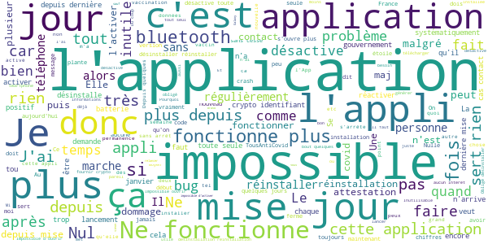

# TousAntiCovid
App version ``2.2.3``

Analyzed with [covid-apps-observer](http://github.com/covid-apps-observer) project, version ``0.1``

## App overview
| | |
|-------------------------|-------------------------| 
| **Name**&nbsp;&nbsp;&nbsp;&nbsp;&nbsp;&nbsp;&nbsp;&nbsp;&nbsp;&nbsp;&nbsp;&nbsp;&nbsp;&nbsp;&nbsp;&nbsp;&nbsp;&nbsp;&nbsp;&nbsp;&nbsp;&nbsp;&nbsp;&nbsp;&nbsp;&nbsp;&nbsp;&nbsp;&nbsp;&nbsp;&nbsp;&nbsp;&nbsp;&nbsp;&nbsp;&nbsp;&nbsp;&nbsp;&nbsp;&nbsp;  | TousAntiCovid |
| **Unique identifier** | fr.gouv.android.stopcovid |
| **Link to Google Play** | [https://play.google.com/store/apps/details?id=fr.gouv.android.stopcovid](https://play.google.com/store/apps/details?id=fr.gouv.android.stopcovid) |
| **Summary**  | Participez à la lutte contre l’épidémie en réduisant les risques de transmission |
| **Privacy policy** | [https://bonjour.stopcovid.gouv.fr/privacy.html](https://bonjour.stopcovid.gouv.fr/privacy.html) |
| **Latest version** | 2.2.3 |
| **Last update** | 2021-01-25 17:23:47 |
| **Recent changes** | Vous pouvez désormais visualiser l&#39;évolution des chiffres clés, sous forme de graphes ! Et aussi, nouveaux modules vaccination et isolement, attestations de sortie, liens utiles, partage d&#39;infos et chiffres clés, et autres améliorations. |
| **Installs**  | 5 000 000+ |
| **Category** | Médecine |
| **First release** | 29 mai 2020 |
| **Size**  | 23M |
| **Supported Android version**  | 5.0 ou version ultérieure |

### Description
> L'application TousAntiCovid est destinée au territoire français.
 Vous pouvez désormais créer et sauvegarder vos attestations de déplacement dérogatoire directement dans l'application.
 Protégeons nos proches, protégeons-nous et protégeons les autres. 
 TousAntiCovid, c’est simple :
 # J'active l'application
 En utilisant le Bluetooth de votre téléphone, TousAntiCovid détecte les téléphones des autres utilisateurs qui restent à proximité du vôtre.
 # Je reste informé
 Vous serez informé si vous avez été à proximité d’un utilisateur testé positif à la COVID-19. Vous serez informés des derniers chiffres et de l’actualité sur l’épidémie. Vous aurez accès aux conseils personnalisés de Mes Conseils Covid.
 # Je protège mes proches et les autres
 Si vous devez vous faire tester, vous pourrez trouver le laboratoire le plus proche. Si vous êtes diagnostiqué comme un cas de COVID-19, votre laboratoire ou votre médecin vous donneront un code à scanner ou à saisir pour avertir anonymement les utilisateurs que vous avez rencontrés.
 # Mes données sont protégées
 L’application n’utilise à aucun moment la localisation des personnes, et il est impossible de connaître l’identité des utilisateurs.
 Cette application a été réalisée par l'équipe TousAntiCovid, sous la supervision du Ministère des Solidarités et de la Santé et du Secrétariat d'Etat chargé du Numérique.

### User interface
The developers of the app provide the following screenshots in the Google play store.
| | | |
|:-------------------------:|:-------------------------:|:-------------------------:|
 |   |   |   | 
 |   |   |   | 

## Development team
In the following we report the main information provided by the development team in the Google play store.

| | |
|-------------------------|-------------------------|
| **Developer**  | Gouvernement |
| **Website**  | [https://bonjour.tousanticovid.gouv.fr](https://bonjour.tousanticovid.gouv.fr) |
| **Email** | contact@tousanticovid.gouv.fr |
| **Physical address**  | [20 avenue de Ségur 75007 Paris](https://www.google.com/maps/search/20%20avenue%20de%20Ségur%2075007%20Paris) (Google Maps) |
| **Other developed apps**  | [https://play.google.com/store/apps/developer?id=Gouvernement](https://play.google.com/store/apps/developer?id=Gouvernement) |

## Android support

| | |
|-------------------------|-------------------------|
| **Declared target Android version**  | - |
| **Effective target Android version**  | - |
| **Minimum supported Android version**  | Lollipop, version 5.0 (API level 21) |
| **Maximum target Android version**  | - |

The larger the difference between the minimum and maximum supported Android versions, the better. A larger difference means a wider audience. For example, old phones have a very low Android version, so a high minimum supported Android version means that the app cannot be used by users with old phones, thus leading to accessibility problems. 

## Requested permissions

In the following we report the complete list of the permissions requested by the app. 

| **Permission** | **Protection level** | **Description** | 
|-------------------------|-------------------------|-------------------------|
 **android.permission ACCESS_COARSE_LOCATION** | :warning:**Dangerous** | Allows an app to access approximate location. 
 **android.permission ACCESS_FINE_LOCATION** | :warning:**Dangerous** | Allows an app to access precise location. 
 **android.permission ACCESS_NETWORK_STATE** | Normal | Allows applications to access information about networks. 
 **android.permission BLUETOOTH** | Normal | Allows applications to connect to paired bluetooth devices. 
 **android.permission BLUETOOTH_ADMIN** | Normal | Allows applications to discover and pair bluetooth devices. 
 **android.permission CAMERA** | :warning:**Dangerous** | Required to be able to access the camera device. 
 **android.permission FOREGROUND_SERVICE** | Normal | Allows a regular application to use Service.startForeground. 
 **android.permission INTERNET** | Normal | Allows applications to open network sockets. 
 **android.permission RECEIVE_BOOT_COMPLETED** | Normal | Allows an application to receive the Intent.ACTION_BOOT_COMPLETED that is broadcast after the system finishes booting. 
 **android.permission REQUEST_IGNORE_BATTERY_OPTIMIZATIONS** | Normal | Permission an application must hold in order to use Settings.ACTION_REQUEST_IGNORE_BATTERY_OPTIMIZATIONS. 
 **android.permission WAKE_LOCK** | Normal | Allows using PowerManager WakeLocks to keep processor from sleeping or screen from dimming. 

## Mentioned servers

| **Server** | **Registrant** | **Registrant country** | **Creation date** | 
|-------------------------|-------------------------|-------------------------|-------------------------|
 | google.com | Google LLC | :us: US | 1997-09-15 04:00:00 |
 | stopcovid.gouv.fr | Etat francais represente par le Ministere des Solidarites et de la Sante | - | 2020-04-15 12:02:42 |
 | tac.gouv.fr | Etat francais represente par le Ministere des Solidarites et de la Sante | - | 2020-11-24 09:54:22 |
 | tousanticovid.gouv.fr | Etat francais represente par le Ministere des Solidarites et de la Sante | - | 2020-10-19 09:30:28 |

## Security analysis 

Below we report the main security warnings raised by our execution of the [Androwarn](https://github.com/maaaaz/androwarn) security analysis tool.

**Connection interfaces exfiltration**
> - This application reads details about the currently active data network 
> - This application tries to find out if the currently active data network is metered 

**Telephony services abuse**
> - This application makes phone calls 

**Suspicious connection establishment**
> - This application opens a Socket and connects it to the remote address '; port is out of range' on the 'N/A' port  
> - This application opens a Socket and connects it to the remote address 'Lcom/android/tools/r8/GeneratedOutlineSupport;->outline19(Ljava/lang/String;)Ljava/lang/StringBuilder;' on the 'N/A' port  
> - This application opens a Socket and connects it to the remote address 'Ljava/net/Proxy;->type()Ljava/net/Proxy$Type;' on the 'N/A' port  
> - This application opens a Socket and connects it to the remote address 'timeout' on the 'N/A' port  

## User ratings and reviews

Below we provide information about how end users are reacting to the app in terms of ratings and reviews in the Google Play store.

### Ratings

The TousAntiCovid app has been installed by more than **5000000** times. At this time, **37641** rated the app and its average score is **3.6841965**. Below we show the distribution of the ratings across the usual star-based rating of Google Play

:star::star::star::star::star:: 18227

:star::star::star::star:: 6408

:star::star::star:: 3119

:star::star:: 2669

:star:: 7218

### Reviews 

#### 5-star reviews

> 😍  :date: __2021-02-06 18:13:56__

> Très bien  :date: __2021-02-06 17:49:47__

> Parfait  :date: __2021-02-06 17:07:00__

> Très bonne application j'ai même pas attraper le Corona virus en 1 ans.  :date: __2021-02-06 15:28:44__

> Trop cool ce covid 😃  :date: __2021-02-06 14:48:43__

> Bon suivi ! Rassurant ! Y'en a marre des médias TV, Radio  :date: __2021-02-06 14:26:48__

> Très positif  :date: __2021-02-06 12:58:42__

> Ok  :date: __2021-02-06 11:27:46__

> En colère France 18h00 et enlever masque France brûle actualités 📰📰😠🤬🤬😠📰🇫🇷🇫🇷🇫🇷🇪🇺🇪🇺🇪🇺🇪🇺🔥😡📰🤬🤬🤬😠📰🔥🇫🇷🇫🇷🇪🇺🇪🇺😡📰🤬🤬📰🔥🇫🇷🇪🇺🇪🇺🇪🇺🇪🇺  :date: __2021-02-06 05:54:40__

> Bien plus pratique que par papier  :date: __2021-02-05 21:43:10__

#### 4-star reviews

> Domage pas de résultats pour la Manche  :date: __2021-02-06 19:21:03__

> Pratique en particulier pour être à jour de la version de l'attestation de déplacement et 20 secondes pour la générer. Dommage qu'il n'y ait pas une synthèse des dernières déclarations gouvernementales. En particulier en lien avec l'éducation nationale.  :date: __2021-02-06 14:18:30__

> C est très utile..bonne continuation  :date: __2021-02-06 11:02:59__

> Si vous avez été déclaré "cas contact" par l'application elle vous demandera de vous isoler 7 jours et de faire un test PCR. C'est à vous de faire la démarche auprès de votre médecin si vous désirez un arrêt de travail pour vous isoler suite à cette notification.  :date: __2021-02-06 09:35:20__

> Très bien, mais il y a environ une semaine, l'application a disparue de mon écran d'accueil ( et du tiroir d'application ), et je ne peux y accéder que par play store... Puisque que je n'ai pas de 2g,3g,4g,5g... , Je ne peux l'utiliser que chez moi où aux endroits au wifi gratuit. Le problème, c'est pour les attestations : je peux les faire chez moi, pas de problème, c'est normal. Mais j'ai peur que si je me fasse contrôler, je ne puisse pas la montrer. Ce serai dommage d'avoir une amende...😓  :date: __2021-02-05 16:46:45__

> Nécessaire !!  :date: __2021-02-05 16:37:17__

> Suis en dialyse comme patiente donc.....Ça y est j ai eu mon premier vaccin tout va bien...  :date: __2021-02-05 09:29:15__

> Le plus avoir des infos au jour le jour  :date: __2021-02-05 07:48:02__

> C'est plus intéressant avec les courbes  :date: __2021-02-05 07:11:31__

> Fait probablement le job. Très satisfaisants les graphes d'évolution des chiffres clés 👍  :date: __2021-02-04 22:26:20__

#### 3-star reviews

> Application en anglais, c'est un comble je n'ai donc pas cherché plus loin était donner que l'appli ne m'est que peut utile  :date: __2021-02-06 18:43:23__

> Où se faire dépister ?  :date: __2021-02-06 13:17:24__

> C est pas très pratique.  :date: __2021-02-06 11:09:48__

> La mise a jour des données est de plus en plus rare et aléatoire... dommage.  :date: __2021-02-05 16:51:40__

> Comme beaucoup, j'ai eu en octobre/novembre des problèmes de plantages systématiques à l'activation après quelques jours de fonctionnement correct, nécessitant desinstallation/réinstallation ou suppression des données. Plus de problème maintenant depuis plusieurs semaines et plusieurs mises à jour. Pouf, cassé à nouveau 02/21.  :date: __2021-02-05 11:40:09__

> Se desactive souvent  :date: __2021-02-04 18:56:59__

> Elle ne reste pas activée sur mon téléphone. De ce fait est inutile  :date: __2021-02-04 18:19:38__

> Sw  :date: __2021-02-04 14:49:47__

> L appli se désinstalle toute seule depuis qq jours..il faudrait passer son temps à vérifier et la réouvrir sans arrêt, son utilité est perdue .reste les infos...  :date: __2021-02-03 23:34:50__

> Les chiffres veulent rien dire. Mettez des graphiques.  :date: __2021-02-03 22:29:27__

#### 2-star reviews

> Deux fois déjà qu'il n'arrive pas à s'activer et que malgré le redémarrage du téléphone, je dois réinstaller l'application  :date: __2021-02-06 17:37:15__

> Toujours des problèmes de crypto identifiant qui empêchent l'appli de s'activer. Obligé de réinstaller a chaque fois  :date: __2021-02-06 10:42:07__

> Deux questions sur le Covid... Les porteurs du virus doivent attendre 3 mois pour se faire vacciner. Y a-t-il un risque à le faire si on est malade ? Les futurs vaccinés sont-ils testés avant l'injection ?  :date: __2021-02-06 10:12:35__

> Je n arrive pas a l ouvrir elle a très bien marché et depuis peu plus rien.  :date: __2021-02-05 23:02:54__

> Pour l'instant m'a été complètement inutile ! Lorsque j'ai voulu préciser que j'avais été en contact avec une petite fille malade, diagnostiquée et symptomatique, impossible ! Alors quel est le but ?  :date: __2021-02-05 21:28:07__

> Impossible d'avoir le crypto machin, obligé de désinstaller et réinstaller régulièrement  :date: __2021-02-05 15:58:26__

> Aucune valeur ajoutée  :date: __2021-02-05 07:41:22__

> L'application ne se met pas à jour quotidiennement pas terrible l'application  :date: __2021-02-05 05:52:43__

> Toujours pas les chiffres de ce jour, il est 21h50. Heureusement qu'il y a les chaînes infos. Soyez réactifs. Il  :date: __2021-02-04 21:52:46__

> Je vais suivre la recommandation du spot télé : on voudrait tous s'en débarrasser et bien je m'en débarrasse. Quand on voit le faible nombre de cas évités par rapport aux cas avérés avec 12 millions de téléchargements ça me paraît dérisoire. Je suis en télétravail à 100% et j'ai un problème d'espace sur mon portable et une conso batterie élevée. La CNIL elle-même s'interroge sur son efficacité sanitaire qui n'a pas été démontrée malgré son questionnement.  :date: __2021-02-04 13:23:41__

#### 1-star reviews

> Application régulièrement désactivée, je suis obligé de la désinstaller pour la réactivitée.  :date: __2021-02-06 17:54:39__

> Il se déconnecte dans les grandes surfaces, donc il est inutile sauf en exterieur  :date: __2021-02-06 16:13:47__

> Activation impossible depuis deux jours déjà. Application instable avec les Crosscall Action ... Impossible a relancer  :date: __2021-02-06 14:12:12__

> application tres utile pendant les périodes où les attestations sont nécessaires, sinon l'intérêt est plutot limité...  :date: __2021-02-06 12:56:54__

> Il faut a chaque fois que je recharge l'application.😡😡😡  :date: __2021-02-06 12:02:39__

> Elle a fonctionné.... puis plante...  :date: __2021-02-06 10:26:05__

> Application qui utilise et historise vos données personnelles  :date: __2021-02-06 08:09:38__

> C'est un stagiaire qui gère l'appli je crois  :date: __2021-02-05 20:22:11__

> Besoin de redémarrer le tel pour que l'App fonctionne. Les développeurs n'ont pas pris en compte les modèles de tel un peu vieux, d'autres applications (suisse par ex) fonctionnent sur le même principe et sur plus d'appareils.  :date: __2021-02-05 20:18:00__

> Ne sert que pour générer des attestations de sortie. Sinon le bluetooth pompe la batterie.  :date: __2021-02-05 18:53:43__

