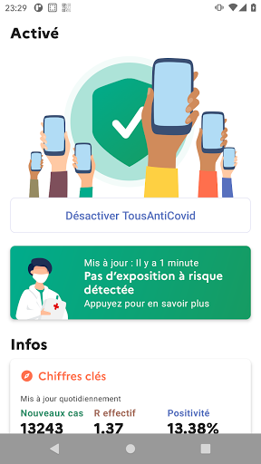

# TousAntiCovid
App version ``2.2.5``

Analyzed with [covid-apps-observer](http://github.com/covid-apps-observer) project, version ``0.1``

## App overview
| | |
|-------------------------|-------------------------| 
| **Name**&nbsp;&nbsp;&nbsp;&nbsp;&nbsp;&nbsp;&nbsp;&nbsp;&nbsp;&nbsp;&nbsp;&nbsp;&nbsp;&nbsp;&nbsp;&nbsp;&nbsp;&nbsp;&nbsp;&nbsp;&nbsp;&nbsp;&nbsp;&nbsp;&nbsp;&nbsp;&nbsp;&nbsp;&nbsp;&nbsp;&nbsp;&nbsp;&nbsp;&nbsp;&nbsp;&nbsp;&nbsp;&nbsp;&nbsp;&nbsp;  | TousAntiCovid |
| **Unique identifier** | fr.gouv.android.stopcovid |
| **Link to Google Play** | [https://play.google.com/store/apps/details?id=fr.gouv.android.stopcovid](https://play.google.com/store/apps/details?id=fr.gouv.android.stopcovid) |
| **Summary**  | Participez à la lutte contre l’épidémie en réduisant les risques de transmission |
| **Privacy policy** | [https://bonjour.tousanticovid.gouv.fr/privacy.html](https://bonjour.tousanticovid.gouv.fr/privacy.html) |
| **Latest version** | 2.2.5 |
| **Last update** | 2021-02-08 21:58:05 |
| **Recent changes** | Vous pouvez désormais visualiser l&#39;évolution des chiffres clés, sous forme de graphes ! Et aussi, nouveaux modules vaccination et isolement, attestations de sortie, liens utiles, partage d&#39;infos et chiffres clés, et autres améliorations. |
| **Installs**  | 5 000 000+ |
| **Category** | Médecine |
| **First release** | 29 mai 2020 |
| **Size**  | 23M |
| **Supported Android version**  | 5.0 ou version ultérieure |

### Description
> L'application TousAntiCovid est destinée au territoire français.
 Vous pouvez désormais créer et sauvegarder vos attestations de déplacement dérogatoire directement dans l'application.
 Protégeons nos proches, protégeons-nous et protégeons les autres. 
 TousAntiCovid, c’est simple :
 # J'active l'application
 En utilisant le Bluetooth de votre téléphone, TousAntiCovid détecte les téléphones des autres utilisateurs qui restent à proximité du vôtre.
 # Je reste informé
 Vous serez informé si vous avez été à proximité d’un utilisateur testé positif à la COVID-19. Vous serez informés des derniers chiffres et de l’actualité sur l’épidémie. Vous aurez accès aux conseils personnalisés de Mes Conseils Covid.
 # Je protège mes proches et les autres
 Si vous devez vous faire tester, vous pourrez trouver le laboratoire le plus proche. Si vous êtes diagnostiqué comme un cas de COVID-19, votre laboratoire ou votre médecin vous donneront un code à scanner ou à saisir pour avertir anonymement les utilisateurs que vous avez rencontrés.
 # Mes données sont protégées
 L’application n’utilise à aucun moment la localisation des personnes, et il est impossible de connaître l’identité des utilisateurs.
 Cette application a été réalisée par l'équipe TousAntiCovid, sous la supervision du Ministère des Solidarités et de la Santé et du Secrétariat d'Etat chargé du Numérique.

### User interface
The developers of the app provide the following screenshots in the Google play store.
| | | |
|:-------------------------:|:-------------------------:|:-------------------------:|
 |   |   |   | 
 |   |   |   | 

## Development team
In the following we report the main information provided by the development team in the Google play store.

| | |
|-------------------------|-------------------------|
| **Developer**  | Gouvernement |
| **Website**  | [https://bonjour.tousanticovid.gouv.fr](https://bonjour.tousanticovid.gouv.fr) |
| **Email** | contact@tousanticovid.gouv.fr |
| **Physical address**  | [20 avenue de Ségur 75007 Paris](https://www.google.com/maps/search/20%20avenue%20de%20Ségur%2075007%20Paris) (Google Maps) |
| **Other developed apps**  | [https://play.google.com/store/apps/developer?id=Gouvernement](https://play.google.com/store/apps/developer?id=Gouvernement) |

## Android support

| | |
|-------------------------|-------------------------|
| **Declared target Android version**  | - |
| **Effective target Android version**  | - |
| **Minimum supported Android version**  | Lollipop, version 5.0 (API level 21) |
| **Maximum target Android version**  | - |

The larger the difference between the minimum and maximum supported Android versions, the better. A larger difference means a wider audience. For example, old phones have a very low Android version, so a high minimum supported Android version means that the app cannot be used by users with old phones, thus leading to accessibility problems. 

## Requested permissions

In the following we report the complete list of the permissions requested by the app. 

| **Permission** | **Protection level** | **Description** | 
|-------------------------|-------------------------|-------------------------|
 **android.permission ACCESS_COARSE_LOCATION** | :warning:**Dangerous** | Allows an app to access approximate location. 
 **android.permission ACCESS_FINE_LOCATION** | :warning:**Dangerous** | Allows an app to access precise location. 
 **android.permission ACCESS_NETWORK_STATE** | Normal | Allows applications to access information about networks. 
 **android.permission BLUETOOTH** | Normal | Allows applications to connect to paired bluetooth devices. 
 **android.permission BLUETOOTH_ADMIN** | Normal | Allows applications to discover and pair bluetooth devices. 
 **android.permission CAMERA** | :warning:**Dangerous** | Required to be able to access the camera device. 
 **android.permission FOREGROUND_SERVICE** | Normal | Allows a regular application to use Service.startForeground. 
 **android.permission INTERNET** | Normal | Allows applications to open network sockets. 
 **android.permission RECEIVE_BOOT_COMPLETED** | Normal | Allows an application to receive the Intent.ACTION_BOOT_COMPLETED that is broadcast after the system finishes booting. 
 **android.permission REQUEST_IGNORE_BATTERY_OPTIMIZATIONS** | Normal | Permission an application must hold in order to use Settings.ACTION_REQUEST_IGNORE_BATTERY_OPTIMIZATIONS. 
 **android.permission WAKE_LOCK** | Normal | Allows using PowerManager WakeLocks to keep processor from sleeping or screen from dimming. 

## Mentioned servers

| **Server** | **Registrant** | **Registrant country** | **Creation date** | 
|-------------------------|-------------------------|-------------------------|-------------------------|
 | google.com | Google LLC | :us: US | 1997-09-15 04:00:00 |
 | stopcovid.gouv.fr | Etat francais represente par le Ministere des Solidarites et de la Sante | - | 2020-04-15 12:02:42 |
 | tac.gouv.fr | Etat francais represente par le Ministere des Solidarites et de la Sante | - | 2020-11-24 09:54:22 |
 | tousanticovid.gouv.fr | Etat francais represente par le Ministere des Solidarites et de la Sante | - | 2020-10-19 09:30:28 |

## Security analysis 

Below we report the main security warnings raised by our execution of the [Androwarn](https://github.com/maaaaz/androwarn) security analysis tool.

**Connection interfaces exfiltration**
> - This application reads details about the currently active data network 
> - This application tries to find out if the currently active data network is metered 

**Telephony services abuse**
> - This application makes phone calls 

**Suspicious connection establishment**
> - This application opens a Socket and connects it to the remote address '; port is out of range' on the 'N/A' port  
> - This application opens a Socket and connects it to the remote address 'Lcom/android/tools/r8/GeneratedOutlineSupport;->outline19(Ljava/lang/String;)Ljava/lang/StringBuilder;' on the 'N/A' port  
> - This application opens a Socket and connects it to the remote address 'Ljava/net/Proxy;->type()Ljava/net/Proxy$Type;' on the 'N/A' port  
> - This application opens a Socket and connects it to the remote address 'timeout' on the 'N/A' port  

## User ratings and reviews

Below we provide information about how end users are reacting to the app in terms of ratings and reviews in the Google Play store.

### Ratings

The TousAntiCovid app has been installed by more than **5000000** times. At this time, **38063** rated the app and its average score is **3.6927316**. Below we show the distribution of the ratings across the usual star-based rating of Google Play

:star::star::star::star::star:: 18378

:star::star::star::star:: 6592

:star::star::star:: 3226

:star::star:: 2756

:star:: 7111

### Reviews 

#### 5-star reviews

> Simple _efficase _nickel  :date: __2021-02-13 19:56:44__

> J'apprécie ses données  :date: __2021-02-13 18:42:11__

> Bonne applications  :date: __2021-02-13 18:10:51__

> Cc  :date: __2021-02-13 17:58:47__

> Utile, simple et efficace  :date: __2021-02-13 08:14:21__

> Utile si la majorité s'en servent pour le bien de tous. Sinon ne sert qu'aux attestations.  :date: __2021-02-13 07:28:18__

> Expert à son efficacité  :date: __2021-02-13 06:58:58__

> Tres pratique  :date: __2021-02-12 19:02:04__

> Tellement dommage que les Français soient si réfractaires au traçage anonyme, ça aurait évité d'utiliser une application qui mange la batterie à cause du bluetooth. Mais soyons honnêtes, elle marche bien cette app. Et elle présente des informations claires. Elle permet de faire une déclaration de cas ou une attestation de déplacement. Arrêtons de toujours vouloir tout casser. Cette app fait très bien son boulot.  :date: __2021-02-12 18:34:59__

> Excellent  :date: __2021-02-12 15:16:33__

#### 4-star reviews

> L'application ne fonctionne plus ! "Erreur inconnue "  :date: __2021-02-13 19:55:24__

> Vivement qu'on n'utilise plus cette appli ! Le pire c'est que c'est l'une des rares application du service public qui fonctionne correctement, la seule donc. La Poste, Pôle emploi, Ma Préfecture (du Val d'Oise MDR), France Télévisions, EDF sont à l'image de l'État : à l'image d'un pays sous-développé.  :date: __2021-02-13 18:09:09__

> Pas encore teste  :date: __2021-02-13 17:22:39__

> Bonne application dans l'ensemble. Rapide et efficace. Quelques petits bugs. Manque d'informations plus précises et plus en direct. Utilisation depuis longtemps étant partiellement satisfait. Merci aux développeurs.  :date: __2021-02-13 13:18:16__

> Nettement mieux que la première version. Mais même problème que beaucoup de personnes : obligée de désinstaller et réinstaller pour que ça remarche. Les statistiques de chargement de cette application doivent être fausses du coup !!! C'est dommage.  :date: __2021-02-13 08:44:31__

> il y a l'essentiel  :date: __2021-02-12 23:34:39__

> Inutile. J'ai eu le covid. Impossible de me déclarer sur l'application car il faut y saisir un code. Ni mon labo, ni mon médecin, ni la secsoc n'ont été en mesure de me donner ce numéro. Impossible donc d'activer LA fonctionnalité principale de l'application.  :date: __2021-02-12 22:31:39__

> Ça marche très bien.. , .,.  :date: __2021-02-12 20:34:56__

> Aucune expérience pour le moment  :date: __2021-02-12 18:09:13__

> Je la regarde tout les jours  :date: __2021-02-12 11:44:55__

#### 3-star reviews

> Bugs réguliers nécessitant la réinstallation de l'appli.  :date: __2021-02-13 17:37:35__

> L'application bug sur mon Galaxy s10. Je ne peux plus l'activer  :date: __2021-02-13 14:27:36__

> Depuis son lancement et son utilisation quotidienne ds ts les déplacements, ZERO SIGNALEMENT, ds la région Grd Est. Application qui n sert que pr les attestations et les courbes du covid autrement=0. Cordialement AB  :date: __2021-02-13 11:45:20__

> J'apprécie le côté informatif de l'application et la facilité pour générer mes attestations de sortie. Un gros plus avec l'évolution des informations locales. Dommage, je suis régulièrement obligée de réinstaller l'application car parfois je ne peux plus l'activer et c'est vraiment pénible !  :date: __2021-02-13 08:45:05__

> Fonctionnait bien, mais message d'erreur aujourd'hui : trop de gens qui ont installé l'application? On espère vite une amélioration  :date: __2021-02-12 19:30:10__

> L'application fonctionne plutôt bien, par contre, sur le fond de son utilité, à regarder les chiffres, on a l'impression que les gens qui téléchargent L'application n'attrapent pas la covid... en France, plus de 3 millions de cas, presque 13 millions de téléchargements et 136000 personnes se sont déclarées... faites les calculs, c'en est presque amusant, presque 5 % de la population a eu le covid, et à peine plus de 1% des utilisateurs de l'application sont positifs ou se déclarent...  :date: __2021-02-12 11:27:38__

> Arrêté pas de planter. Ne veux pas se connecter car ne trouve pas le Bluetooth qui est toujours activé...  :date: __2021-02-12 10:10:47__

> Le problème principal est, comme pour sa soit disant prédécesseure (en réalité la même app sous un autre nom), qu'il faut s'en occuper. On ne peut pas l'installer et l'oublier. Et c'est comme par hasard toujours pile quand on vient de passer du temps un peu exposé qu'on découvre le message "anticovid a besoin de vous"  :date: __2021-02-12 02:12:38__

> Impossible de trouver un centre de vaccination.  :date: __2021-02-11 19:58:49__

> Plusieurs fois je suis obligé de la réinstaller pour pouvoir l'activer sinon elle reste bloquée même en relançant mon téléphone. Pas pratique !!  :date: __2021-02-11 18:47:28__

#### 2-star reviews

> C'est quand même la seule appli pour laquelle tu es obligé de redémarrer ton téléphone le lendemain de la mise à jour effectuée. Je comprends pas et si tu fais pas attention au message, elle ne fait plus ce pourquoi elle est destinée : prévenir et alerter. Bref à revoir.  :date: __2021-02-13 18:06:04__

> Gros bug... Si je passe en mode avion (la nuit par exemple), l'appli va se mettre à m'alerter en vibrant. Ça m'a réveillé deux soirs de suite...  :date: __2021-02-13 18:01:55__

> J'aimerais bien pouvoir utiliser cette appli mais elle ne fonctionne pas sur mon LG V30. J'ai un message d'erreur "impossible de fournir le crypto identifiant" à chaque fois que j'essaie de l'activiter. Je m'en sers juste pour générer les attestations du coup mais la fonction première n'est pas délivrée.  :date: __2021-02-13 11:54:05__

> En quelques mots "pas assez fiable". S'il y a des trucs sympas comme la generation d'attestation, les chiffres y compris de la région la fiabilité de la fonction principale est insuffisante pour servir à quelque chose. Je ne compte plus les fois où l'appli ne repart pas après un passage en mode avion ou les quelques fois où il faut réinstaller car le crypo-identifiant est perdu. Rien d'insurmontable mais entre le temps où le problème se produit et celui où il est résolu l'appli ne sert à rien  :date: __2021-02-13 09:10:15__

> Jusqu'a ce jour aucun problème sauf qu'il n'est plus possible de se connecter  :date: __2021-02-12 11:44:51__

> Consommation importante de batterie. Les chiffres sont bizarre et se mettent à jour de façon aléatoire, un lien pourrais suffir pour aller sur le site du gouvernement cela consommerait moins de batterie et n'aurais à ce mettre à jour que très peu souvent, cette application est bien pour la crise sanitaire mais 1 personne sur 7 c'est trop peu  :date: __2021-02-12 06:39:32__

> Mise à jour des données pas assez temps réel  :date: __2021-02-10 17:53:47__

> Je télécharge sur un autre mobile pour voir si l'appli fonctionne mieux car elle se désactive très souvent alors que ma localisation et blutooph sont tjrs actifs. Je suis pas la seule ds ce cas de figure. Peu mieux faire !  :date: __2021-02-10 12:36:34__

> message : vous avez été exposé au moins à une personne... on ne sait pas quand !! ce serait bien de afficher la date de l'exposition....  :date: __2021-02-10 12:13:25__

> Il ne s'active plus  :date: __2021-02-10 10:51:59__

#### 1-star reviews

> L application Covid a été installée sur nos téléphone à notre insue par la mise à jour automatique. Cette notification à pour but de contrôler tes données et autres infos te concernant par rapport au COVID19 Tu Peux vérifier 1 Va dans les PARAMETRES du téléphone 2 Clic GOOGLE Puis tu verras " Notifications d'exposition au COVID19" déjà installé dans ton téléphone 3: En Haut a droite il y a 3 petit points , clique dessus puis utilisations et diagnostics désactive le. Partage autour de toi  :date: __2021-02-13 19:23:03__

> J'ai déjà installé tous antiCovid 3 fois. Ca bloque tout le temps je suis à chaque fois dans l'obligation de le supprimer poir le réinstaller... Je vais le faire encorz aujourd'hui il est bloqué depuiq le 27 janvier 2021😠😠😠  :date: __2021-02-13 18:27:20__

> L'application se coupe seule. Souvent au moment où elle serait le plus utile...  :date: __2021-02-13 17:10:40__

> Sa prend de la place poir rien ru tecois rien  :date: __2021-02-13 16:56:04__

> Aussi inutile que le ministre de la santé.  :date: __2021-02-13 09:52:42__

> Pendant 1 à 2 semaines, ça tourne bien, sans trop consommer de batterie. Et puis un beau matin impossible d'envoyer les crypto-machin-choses. Le redémarrage de l'appareil n'y fait rien. ll faut effacer les données et se ré-inscrire pour que ça remarche, et donc j'imagine qu'on perd tout son historique de contacts. Désinstallation.  :date: __2021-02-13 07:55:35__

> Mon fils est positif depuis 4 jours. Il s'est déclaré sur l'appli et visiblement, vivant sous la même toit, je ne suis pas alerté...  :date: __2021-02-12 21:11:19__

> Nul ca bouffe beaucoup de bâtrie. BOOM. DU COUP MOI PRTITE DE 9ANS PAS LE TEMPS DE JOUER A DES JEU LA BÀTRIE EST BOUFFER  :date: __2021-02-12 19:17:20__

> Impossible à charger  :date: __2021-02-12 17:38:42__

> Se met en veille seule  :date: __2021-02-12 15:41:00__

