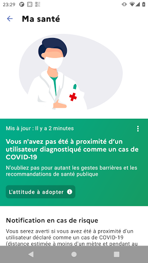

# TousAntiCovid
App version ``2.2.7``

Analyzed with [covid-apps-observer](http://github.com/covid-apps-observer) project, version ``0.1``

## App overview
| | |
|-------------------------|-------------------------| 
| **Name**&nbsp;&nbsp;&nbsp;&nbsp;&nbsp;&nbsp;&nbsp;&nbsp;&nbsp;&nbsp;&nbsp;&nbsp;&nbsp;&nbsp;&nbsp;&nbsp;&nbsp;&nbsp;&nbsp;&nbsp;&nbsp;&nbsp;&nbsp;&nbsp;&nbsp;&nbsp;&nbsp;&nbsp;&nbsp;&nbsp;&nbsp;&nbsp;&nbsp;&nbsp;&nbsp;&nbsp;&nbsp;&nbsp;&nbsp;&nbsp;  | TousAntiCovid |
| **Unique identifier** | fr.gouv.android.stopcovid |
| **Link to Google Play** | [https://play.google.com/store/apps/details?id=fr.gouv.android.stopcovid](https://play.google.com/store/apps/details?id=fr.gouv.android.stopcovid) |
| **Summary**  | Participez à la lutte contre l’épidémie en réduisant les risques de transmission |
| **Privacy policy** | [https://bonjour.tousanticovid.gouv.fr/privacy.html](https://bonjour.tousanticovid.gouv.fr/privacy.html) |
| **Latest version** | 2.2.7 |
| **Last update** | 2021-02-23 13:57:51 |
| **Recent changes** | Vous pouvez désormais visualiser l&#39;évolution des chiffres clés, sous forme de graphes ! Et aussi, nouveaux modules vaccination et isolement, attestations de sortie, liens utiles, partage d&#39;infos et chiffres clés, et autres améliorations. |
| **Installs**  | 5 000 000+ |
| **Category** | Médecine |
| **First release** | 29 mai 2020 |
| **Size**  | 23M |
| **Supported Android version**  | 5.0 ou version ultérieure |

### Description
> L'application TousAntiCovid est destinée au territoire français.
 Vous pouvez désormais créer et sauvegarder vos attestations de déplacement dérogatoire directement dans l'application.
 Protégeons nos proches, protégeons-nous et protégeons les autres. 
 TousAntiCovid, c’est simple :
 # J'active l'application
 En utilisant le Bluetooth de votre téléphone, TousAntiCovid détecte les téléphones des autres utilisateurs qui restent à proximité du vôtre.
 # Je reste informé
 Vous serez informé si vous avez été à proximité d’un utilisateur testé positif à la COVID-19. Vous serez informés des derniers chiffres et de l’actualité sur l’épidémie. Vous aurez accès aux conseils personnalisés de Mes Conseils Covid.
 # Je protège mes proches et les autres
 Si vous devez vous faire tester, vous pourrez trouver le laboratoire le plus proche. Si vous êtes diagnostiqué comme un cas de COVID-19, votre laboratoire ou votre médecin vous donneront un code à scanner ou à saisir pour avertir anonymement les utilisateurs que vous avez rencontrés.
 # Mes données sont protégées
 L’application n’utilise à aucun moment la localisation des personnes, et il est impossible de connaître l’identité des utilisateurs.
 Cette application a été réalisée par l'équipe TousAntiCovid, sous la supervision du Ministère des Solidarités et de la Santé et du Secrétariat d'Etat chargé du Numérique.

### User interface
The developers of the app provide the following screenshots in the Google play store.
| | | |
|:-------------------------:|:-------------------------:|:-------------------------:|
 |   |   |   | 
 |   |   |   | 

## Development team
In the following we report the main information provided by the development team in the Google play store.

| | |
|-------------------------|-------------------------|
| **Developer**  | Gouvernement |
| **Website**  | [https://bonjour.tousanticovid.gouv.fr](https://bonjour.tousanticovid.gouv.fr) |
| **Email** | contact@tousanticovid.gouv.fr |
| **Physical address**  | [20 avenue de Ségur 75007 Paris](https://www.google.com/maps/search/20%20avenue%20de%20Ségur%2075007%20Paris) (Google Maps) |
| **Other developed apps**  | [https://play.google.com/store/apps/developer?id=Gouvernement](https://play.google.com/store/apps/developer?id=Gouvernement) |

## Android support

| | |
|-------------------------|-------------------------|
| **Declared target Android version**  | - |
| **Effective target Android version**  | - |
| **Minimum supported Android version**  | Lollipop, version 5.0 (API level 21) |
| **Maximum target Android version**  | - |

The larger the difference between the minimum and maximum supported Android versions, the better. A larger difference means a wider audience. For example, old phones have a very low Android version, so a high minimum supported Android version means that the app cannot be used by users with old phones, thus leading to accessibility problems. 

## Requested permissions

In the following we report the complete list of the permissions requested by the app. 

| **Permission** | **Protection level** | **Description** | 
|-------------------------|-------------------------|-------------------------|
 **android.permission ACCESS_COARSE_LOCATION** | :warning:**Dangerous** | Allows an app to access approximate location. 
 **android.permission ACCESS_FINE_LOCATION** | :warning:**Dangerous** | Allows an app to access precise location. 
 **android.permission ACCESS_NETWORK_STATE** | Normal | Allows applications to access information about networks. 
 **android.permission BLUETOOTH** | Normal | Allows applications to connect to paired bluetooth devices. 
 **android.permission BLUETOOTH_ADMIN** | Normal | Allows applications to discover and pair bluetooth devices. 
 **android.permission CAMERA** | :warning:**Dangerous** | Required to be able to access the camera device. 
 **android.permission FOREGROUND_SERVICE** | Normal | Allows a regular application to use Service.startForeground. 
 **android.permission INTERNET** | Normal | Allows applications to open network sockets. 
 **android.permission RECEIVE_BOOT_COMPLETED** | Normal | Allows an application to receive the Intent.ACTION_BOOT_COMPLETED that is broadcast after the system finishes booting. 
 **android.permission REQUEST_IGNORE_BATTERY_OPTIMIZATIONS** | Normal | Permission an application must hold in order to use Settings.ACTION_REQUEST_IGNORE_BATTERY_OPTIMIZATIONS. 
 **android.permission WAKE_LOCK** | Normal | Allows using PowerManager WakeLocks to keep processor from sleeping or screen from dimming. 

## Mentioned servers

| **Server** | **Registrant** | **Registrant country** | **Creation date** | 
|-------------------------|-------------------------|-------------------------|-------------------------|
 | google.com | Google LLC | :us: US | 1997-09-15 04:00:00 |
 | stopcovid.gouv.fr | Etat francais represente par le Ministere des Solidarites et de la Sante | - | 2020-04-15 12:02:42 |
 | tac.gouv.fr | Etat francais represente par le Ministere des Solidarites et de la Sante | - | 2020-11-24 09:54:22 |
 | tousanticovid.gouv.fr | Etat francais represente par le Ministere des Solidarites et de la Sante | - | 2020-10-19 09:30:28 |

## Security analysis 

Below we report the main security warnings raised by our execution of the [Androwarn](https://github.com/maaaaz/androwarn) security analysis tool.

**Connection interfaces exfiltration**
> - This application reads details about the currently active data network 
> - This application tries to find out if the currently active data network is metered 

**Telephony services abuse**
> - This application makes phone calls 

**Suspicious connection establishment**
> - This application opens a Socket and connects it to the remote address '; port is out of range' on the 'N/A' port  
> - This application opens a Socket and connects it to the remote address 'Lcom/android/tools/r8/GeneratedOutlineSupport;->outline19(Ljava/lang/String;)Ljava/lang/StringBuilder;' on the 'N/A' port  
> - This application opens a Socket and connects it to the remote address 'Ljava/net/Proxy;->type()Ljava/net/Proxy$Type;' on the 'N/A' port  
> - This application opens a Socket and connects it to the remote address 'timeout' on the 'N/A' port  

## User ratings and reviews

Below we provide information about how end users are reacting to the app in terms of ratings and reviews in the Google Play store.

### Ratings

The TousAntiCovid app has been installed by more than **5000000** times. At this time, **44529** rated the app and its average score is **4.2072954**. Below we show the distribution of the ratings across the usual star-based rating of Google Play

:star::star::star::star::star:: 26058

:star::star::star::star:: 9934

:star::star::star:: 3615

:star::star:: 1555

:star:: 3367

### Reviews 

#### 5-star reviews

> Pas eu besoin de consulter.  :date: __2021-03-06 12:29:46__

> Parfait  :date: __2021-03-06 11:43:06__

> Les chiffres de la vaccination  :date: __2021-03-06 09:42:23__

> Pratique pour les attestations  :date: __2021-03-06 08:33:45__

> Avons nous bien le choix  :date: __2021-03-06 07:13:39__

> Très efficaces  :date: __2021-03-06 06:07:12__

> Information active  :date: __2021-03-06 00:52:22__

> Simple et utile  :date: __2021-03-05 23:15:25__

> Parfait  :date: __2021-03-05 22:54:33__

> Don t smoke dont drink alcool  :date: __2021-03-05 21:14:00__

#### 4-star reviews

> Application complète seul bémol quand je reçois une notification d'alerte que j'ai était en présence d'un cas contact ni l'heure ni le lieu ni la date ne figurent sur l'alerte.  :date: __2021-03-06 12:00:08__

> La mise à jour ne peut pas se charger. ! Lorsque on la déclenche elle se met en attente sans fin !  :date: __2021-03-06 11:56:48__

> Il devrait être possible de signaler que l'on a été vacciné. Mes 2 injections dès le début de l'opération de vaccination pour les plus âgés, sans aucune réaction, too cool !  :date: __2021-03-06 11:35:57__

> Très utile pour alerter en cas de contact ; information intéressante mais il manque notamment un historique des données pour voir les tendances.  :date: __2021-03-06 11:16:37__

> Je l'utilise régulièrement. Aucun problème jusqu'à jeudi. J'ai reçu une alerte me disant cas contact à risque détecté ! J'ai fais un test PCR qui est négatif. Cette notification, je la reçois plusieurs fois par jour sans arriver à l'arrêter. J'ai dû desinstaller et réinstaller l'appli. Sinon bonne application mais encore peu de personnes l'utilisant.  :date: __2021-03-06 09:54:38__

> Parlé des lieux où ns devrions se faire vacciner par département et quand ?  :date: __2021-03-06 09:29:19__

> Bonne  :date: __2021-03-05 15:43:22__

> Ne veux plus s'activer deviens donc inutile  :date: __2021-03-05 09:37:25__

> Obligation de le réinstaller à chaque mise à jour. Dommage. Parfait sinon  :date: __2021-03-05 09:01:45__

> Facile à utiliser  :date: __2021-03-04 23:37:51__

#### 3-star reviews

> Est ce que sa marche vraiment  :date: __2021-03-06 13:28:27__

> Je pa besoin  :date: __2021-03-06 10:56:10__

> Dommage qu'on ne puisse pas prendre de Rdv ...  :date: __2021-03-05 20:35:43__

> Pas suffisamment utilisé.  :date: __2021-03-05 18:21:41__

> Pourquoi les centres ferme les week-ends et certains à 17h alors que le gouvernement dit sur tout les plateaux télé qui tout en œuvre pour vacciner un maximum de patients.  :date: __2021-03-05 08:57:49__

> I Az  :date: __2021-03-05 06:46:12__

> J'ai essayé à pen  :date: __2021-03-04 21:48:16__

> Aucuns plantages ni aucuns problèmes ! L'application fonctionne parfaitement ! Ne vide pas la batterie non plus. Mais à part donner les chiffres des contaminations et faire les attestations, c'est tout. Depuis la naissance de cette application, je n'ai eu aucune alerte de cas contacts positifs, alors qu'il y en a des centaines voir plus. La population ne joue pas le jeu. Manque total de sérieux des gens. L'explosions des contaminations en est la preuve.  :date: __2021-03-04 20:49:49__

> Très bien...  :date: __2021-03-04 11:11:15__

> Aucune  :date: __2021-03-03 17:59:57__

#### 2-star reviews

> Difficile de se connecter  :date: __2021-03-06 13:07:40__

> Bonne idée mais indicateurs pas à jour! Les taux d'incidence et nb R sont systématiquement plus âgés que les délais annoncés. Indicateurs en décalage par rapport aux infos. Dommage ! Et le service client ne veut pas le comprendre... C'est pourtant une donnée cruciale  :date: __2021-03-06 10:48:49__

> Bonne idée mais impossible de se déclarer malade et donc contagieux quand on a fait un test antigenique, seul le PCRle permet . on peur se déclarer sur Ameli mais pas sur l appli . Un comble !  :date: __2021-03-04 22:23:53__

> Garder le bluetooth ouvert peut permettre a des personnes mal intentionnées de recuperer nos données. Ce n est pas une bonne idee d avoir choisi cette technique. Et la impossible de la mettre a jour et donc de l utiliser. Ca buggue tout le temps. Message. Il y a une erreur de notre côté. C est pas le covid qu onrisque avec cette appli mais une grosse crise de nerfs. Jamais rencontré tant de soucis pour une appli !!!  :date: __2021-03-04 20:04:23__

> Trop peu de gens ont cette appli! N'  :date: __2021-03-04 14:04:43__

> Trop de bugs, il faut réinstaller l'application trop souvent  :date: __2021-03-04 12:29:09__

> Il est bizarre de ne recevoir aucune explication.sur le mode operatoire de l application Et surtout de ne pas pouvoir a partir d elle , prendre directement rv pour une vaccination.Covid ! Quel eparpillement :)  :date: __2021-03-04 10:44:39__

> Impossible de télécharger la nouvelle version  :date: __2021-03-04 10:32:25__

> acceptable  :date: __2021-03-03 21:41:10__

> L application ne fonctionne que quand nous le ouvrons avec PlayStore  :date: __2021-03-03 10:48:12__

#### 1-star reviews

> Pas au point pour les centres de vaccination....  :date: __2021-03-06 13:46:30__

> Je n'arrive pas à charger la nouvelle version, donc je laisse tomber !  :date: __2021-03-06 10:13:34__

> Ne veut pas s'ouvrir sur mon wiko. Il faut l'activer 20 fois pour qu'elle s'ouvre  :date: __2021-03-06 09:57:10__

> Application presque en permanence hs  :date: __2021-03-06 09:49:08__

> Ne donne pas d'alerte Je me suis déclarée positive, mon conjoint n'a pas reçu d'alerte, ce qui me semblait être l'objectif principal de cette application. C'est très décevant et inquiétant  :date: __2021-03-06 09:29:05__

> Aucun résultats.  :date: __2021-03-06 07:40:49__

> Depuis aujourd'hui Impossible de se connecter à L'application, il y a toujours un message d'erreur suivi d'un message qui demande de se connecter mais sans succès et cela tourne en boucle  :date: __2021-03-06 01:54:47__

> Aucun intérêt  :date: __2021-03-05 20:25:37__

> Se deconecte constamment. Donc nul.  :date: __2021-03-05 18:24:18__

> Cette application ne sert à rien niveau alerte des cas contact, il y une semaine on me notifie que je suis cas contact, qu'il faut que je me fasse tester et m'isole pendant 5 jours, la secu me le confirme, du coup je me met en arrêt et aujourd'hui j'ai appris que celui ci a été refusé, j'ai perdu une semaine de boulot pour rien.  :date: __2021-03-05 17:41:02__

