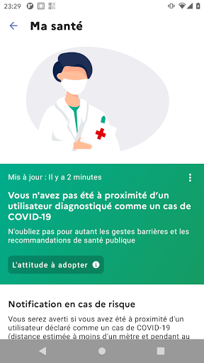

# TousAntiCovid
App version ``2.3.1``

Analyzed with [covid-apps-observer](http://github.com/covid-apps-observer) project, version ``0.1``

## App overview
| | |
|-------------------------|-------------------------| 
| **Name**&nbsp;&nbsp;&nbsp;&nbsp;&nbsp;&nbsp;&nbsp;&nbsp;&nbsp;&nbsp;&nbsp;&nbsp;&nbsp;&nbsp;&nbsp;&nbsp;&nbsp;&nbsp;&nbsp;&nbsp;&nbsp;&nbsp;&nbsp;&nbsp;&nbsp;&nbsp;&nbsp;&nbsp;&nbsp;&nbsp;&nbsp;&nbsp;&nbsp;&nbsp;&nbsp;&nbsp;&nbsp;&nbsp;&nbsp;&nbsp;  | TousAntiCovid |
| **Unique identifier** | fr.gouv.android.stopcovid |
| **Link to Google Play** | [https://play.google.com/store/apps/details?id=fr.gouv.android.stopcovid](https://play.google.com/store/apps/details?id=fr.gouv.android.stopcovid) |
| **Summary**  | Participez à la lutte contre l’épidémie en réduisant les risques de transmission |
| **Privacy policy** | [https://bonjour.tousanticovid.gouv.fr/privacy.html](https://bonjour.tousanticovid.gouv.fr/privacy.html) |
| **Latest version** | 2.3.1 |
| **Last update** | 2021-03-10 08:13:19 |
| **Recent changes** | Vous pouvez désormais visualiser l&#39;évolution des chiffres clés, sous forme de graphes ! Et aussi, nouveaux modules vaccination et isolement, attestations de sortie, liens utiles, partage d&#39;infos et chiffres clés, et autres améliorations. |
| **Installs**  | 5 000 000+ |
| **Category** | Médecine |
| **First release** | 29 mai 2020 |
| **Size**  | 24M |
| **Supported Android version**  | 5.0 ou version ultérieure |

### Description
> L'application TousAntiCovid est destinée au territoire français.
 Vous pouvez désormais créer et sauvegarder vos attestations de déplacement dérogatoire directement dans l'application.
 Protégeons nos proches, protégeons-nous et protégeons les autres. 
 TousAntiCovid, c’est simple :
 # J'active l'application
 En utilisant le Bluetooth de votre téléphone, TousAntiCovid détecte les téléphones des autres utilisateurs qui restent à proximité du vôtre.
 # Je reste informé
 Vous serez informé si vous avez été à proximité d’un utilisateur testé positif à la COVID-19. Vous serez informés des derniers chiffres et de l’actualité sur l’épidémie. Vous aurez accès aux conseils personnalisés de Mes Conseils Covid.
 # Je protège mes proches et les autres
 Si vous devez vous faire tester, vous pourrez trouver le laboratoire le plus proche. Si vous êtes diagnostiqué comme un cas de COVID-19, votre laboratoire ou votre médecin vous donneront un code à scanner ou à saisir pour avertir anonymement les utilisateurs que vous avez rencontrés.
 # Mes données sont protégées
 L’application n’utilise à aucun moment la localisation des personnes, et il est impossible de connaître l’identité des utilisateurs.
 Cette application a été réalisée par l'équipe TousAntiCovid, sous la supervision du Ministère des Solidarités et de la Santé et du Secrétariat d'Etat chargé du Numérique.

### User interface
The developers of the app provide the following screenshots in the Google play store.
| | | |
|:-------------------------:|:-------------------------:|:-------------------------:|
 |   |   |   | 
 |   |   |   | 

## Development team
In the following we report the main information provided by the development team in the Google play store.

| | |
|-------------------------|-------------------------|
| **Developer**  | Gouvernement |
| **Website**  | [https://bonjour.tousanticovid.gouv.fr](https://bonjour.tousanticovid.gouv.fr) |
| **Email** | contact@tousanticovid.gouv.fr |
| **Physical address**  | [20 avenue de Ségur 75007 Paris](https://www.google.com/maps/search/20%20avenue%20de%20Ségur%2075007%20Paris) (Google Maps) |
| **Other developed apps**  | [https://play.google.com/store/apps/developer?id=Gouvernement](https://play.google.com/store/apps/developer?id=Gouvernement) |

## Android support

| | |
|-------------------------|-------------------------|
| **Declared target Android version**  | - |
| **Effective target Android version**  | - |
| **Minimum supported Android version**  | Lollipop, version 5.0 (API level 21) |
| **Maximum target Android version**  | - |

The larger the difference between the minimum and maximum supported Android versions, the better. A larger difference means a wider audience. For example, old phones have a very low Android version, so a high minimum supported Android version means that the app cannot be used by users with old phones, thus leading to accessibility problems. 

## Requested permissions

In the following we report the complete list of the permissions requested by the app. 

| **Permission** | **Protection level** | **Description** | 
|-------------------------|-------------------------|-------------------------|
 **android.permission ACCESS_COARSE_LOCATION** | :warning:**Dangerous** | Allows an app to access approximate location. 
 **android.permission ACCESS_FINE_LOCATION** | :warning:**Dangerous** | Allows an app to access precise location. 
 **android.permission ACCESS_NETWORK_STATE** | Normal | Allows applications to access information about networks. 
 **android.permission BLUETOOTH** | Normal | Allows applications to connect to paired bluetooth devices. 
 **android.permission BLUETOOTH_ADMIN** | Normal | Allows applications to discover and pair bluetooth devices. 
 **android.permission CAMERA** | :warning:**Dangerous** | Required to be able to access the camera device. 
 **android.permission FOREGROUND_SERVICE** | Normal | Allows a regular application to use Service.startForeground. 
 **android.permission INTERNET** | Normal | Allows applications to open network sockets. 
 **android.permission RECEIVE_BOOT_COMPLETED** | Normal | Allows an application to receive the Intent.ACTION_BOOT_COMPLETED that is broadcast after the system finishes booting. 
 **android.permission REQUEST_IGNORE_BATTERY_OPTIMIZATIONS** | Normal | Permission an application must hold in order to use Settings.ACTION_REQUEST_IGNORE_BATTERY_OPTIMIZATIONS. 
 **android.permission WAKE_LOCK** | Normal | Allows using PowerManager WakeLocks to keep processor from sleeping or screen from dimming. 

## Mentioned servers

| **Server** | **Registrant** | **Registrant country** | **Creation date** | 
|-------------------------|-------------------------|-------------------------|-------------------------|
 | google.com | Google LLC | :us: US | 1997-09-15 04:00:00 |
 | stopcovid.gouv.fr | Etat francais represente par le Ministere des Solidarites et de la Sante | - | 2020-04-15 12:02:42 |
 | tac.gouv.fr | Etat francais represente par le Ministere des Solidarites et de la Sante | - | 2020-11-24 09:54:22 |
 | tousanticovid.gouv.fr | Etat francais represente par le Ministere des Solidarites et de la Sante | - | 2020-10-19 09:30:28 |

## Security analysis 

Below we report the main security warnings raised by our execution of the [Androwarn](https://github.com/maaaaz/androwarn) security analysis tool.

**Connection interfaces exfiltration**
> - This application reads details about the currently active data network 
> - This application tries to find out if the currently active data network is metered 

**Telephony services abuse**
> - This application makes phone calls 

**Suspicious connection establishment**
> - This application opens a Socket and connects it to the remote address '; port is out of range' on the 'N/A' port  
> - This application opens a Socket and connects it to the remote address 'Lcom/android/tools/r8/GeneratedOutlineSupport;->outline19(Ljava/lang/String;)Ljava/lang/StringBuilder;' on the 'N/A' port  
> - This application opens a Socket and connects it to the remote address 'Ljava/net/Proxy;->type()Ljava/net/Proxy$Type;' on the 'N/A' port  
> - This application opens a Socket and connects it to the remote address 'timeout' on the 'N/A' port  

## User ratings and reviews

Below we provide information about how end users are reacting to the app in terms of ratings and reviews in the Google Play store.

### Ratings

The TousAntiCovid app has been installed by more than **5000000** times. At this time, **46361** rated the app and its average score is **4.0542965**. Below we show the distribution of the ratings across the usual star-based rating of Google Play

:star::star::star::star::star:: 25877

:star::star::star::star:: 9603

:star::star::star:: 3706

:star::star:: 1873

:star:: 5302

### Reviews 

#### 5-star reviews

> Tres burn felicitation  :date: __2021-03-21 14:19:55__

> Superbe j'adore cette appli  :date: __2021-03-21 11:26:20__

> Simple  :date: __2021-03-21 11:13:36__

> Très bien  :date: __2021-03-21 10:32:43__

> Lolo  :date: __2021-03-21 10:32:05__

> il manque de statistiques c'est mieux d'avoir le risque en temps réel il doit nous alerter soit avec vibrations soit par une alarme il ne servent qu'à faire l attestation rien de plus  :date: __2021-03-21 10:03:29__

> Vive Macron. Merci Manu!  :date: __2021-03-21 08:54:12__

> Pour des sortie  :date: __2021-03-21 08:02:41__

> Excellente. Application très pratique  :date: __2021-03-21 05:59:26__

> Aucun problèmes . Bien utile  :date: __2021-03-20 23:21:31__

#### 4-star reviews

> Facile à utiliser et non intrusive  :date: __2021-03-21 11:38:23__

> Dommage que la mise à jour d'exposition soit des délais trop long.  :date: __2021-03-21 10:15:10__

> Manque de clarter  :date: __2021-03-21 08:18:00__

> Ça ne fonctionne pas du tout c est dingue d être incapable de créer une application et encore plus fou de demander aux citoyens de la télécharger sans vérifier que cela fonctionne...on se demande du coup si cela a réellement un intérêt !!!  :date: __2021-03-20 21:55:31__

> Pas adapté à la version de mes téléphones et tablettes  :date: __2021-03-20 19:04:59__

> Les attestations de sortie pour les zones confinés n'ont pas été mises à jour . Dommage car super pratique l'attestation sur TousAntiCovid !  :date: __2021-03-20 18:47:44__

> Bien  :date: __2021-03-20 15:20:30__

> Cool  :date: __2021-03-20 14:51:56__

> Je galère un peu, pas évident  :date: __2021-03-20 14:28:53__

> Il faudrait rapidement mettre à jour l'appli pour prendre en compte le 3eme confinement 😒. Il est inutile d'afficher les motifs 9 à 13 en dehors des weekends. Merci d'avoir ajouté les graph 🤩. Je mets donc 5 étoiles 😘. Petite suggestion : placer une petite flèche vers le haut ⬆️ ou bas ⬇️ devant les chiffres pour montrer d'un coup d'œil la tendance. Je n'ai noté aucun impact négatif sur la consommation de batterie sur mon smartphone 👍🔋.  :date: __2021-03-20 13:30:06__

#### 3-star reviews

> Je n'ai pas les mêmes chiffres que d'autres personnes ayant l'application alors que nous vivons tous dans le même département.  :date: __2021-03-21 14:33:12__

> Attestation pas mise à jour en temps réel  :date: __2021-03-21 13:54:25__

> Je viens juste,telegarger l'application.  :date: __2021-03-21 11:51:33__

> Les nouvelles attestations de sortie ne sont toujours pas disponibles depuis l'annonce du 18 mars 2021, cela fait 3 jours maintenant  :date: __2021-03-21 11:42:27__

> Quand sera mise à jour l'application suite aux mesures gouvernementales entrées en vigueur le 20 mars 2021 ?  :date: __2021-03-21 11:07:27__

> J'ai un Samsung galaxy A3 2016 réf SM-A310F. L'application indique que le smartphone n'est pas intégralement compatible avec le Bluetooth low energy, alors que l'application BLE checker me donne un résultat positif et que l'application fonctionne correctement sur un smartphone identique que possède ma femme. Le problème est résolu lors de l'avant dernière mise à jour Par contre je ne comprends pas qu'on soit obligé d'aller sur le site du gouvernement pour les attestations de journée,  :date: __2021-03-21 10:32:22__

> Impossible de charger les motifs de déplacement pour les déplacements en journée de 6h à 19h. Ils restent sur ceux du couvre-feu.  :date: __2021-03-21 10:30:20__

> La dernière attestation dérogatoire du 20 mars 2021 n est pas disponible sur T.A.C.  :date: __2021-03-21 09:07:56__

> La mise à jour  :date: __2021-03-21 08:35:38__

> Attestation pas à jour  :date: __2021-03-21 04:56:29__

#### 2-star reviews

> Il n à pas la nouvelle attestation c'est comme exagéré ça fait 3 jours que les annonces ont été faites ça devrait être déjà à jour  :date: __2021-03-21 15:09:08__

> L'attestation n'est pas à jour  :date: __2021-03-21 14:45:38__

> C tu yyy  :date: __2021-03-21 10:48:05__

> La batterie de mon téléphone baisse très vite et je ne peux plus utiliser le bluetooth lorsque l'application est activée. Elle me sert uniquement pour les attestations ce qui est quand même dommage.  :date: __2021-03-21 10:31:40__

> L'application ne fonctionne plus pour les attestations , même en passant par le touche site Web avec apres 19h jusqu'à 6h mais impossible de 6h à 19h j'espère que cela va vite être réglé. Sinon très bonne application  :date: __2021-03-21 08:25:55__

> Impossible de télécharger la nouvelle attestation ! Je suis dans un département "confiné" et je n'ai pas d'imprimante. Une MAJ s'impose ! 🤬  :date: __2021-03-20 22:20:48__

> Mises à jours non automatiques  :date: __2021-03-20 21:28:47__

> Chaque mise à jour efface les données personnelles. Il y a très souvent des mises à jour sauf lorsqu'elles seraient nécessaires, comme aujourd'hui 20 mars 2021 puisque l'attestation n'est pas nécessaire entre 6h et 19h en Ile-de-France et la carte d'identité suffit pour prouver que l'on reste dans un rayon de 10 km autour de son domicile !! Je ne félicite ni notre gouvernement ni nos administrations sur la gestion de cette pandémie et la mise à disposition de l'appli Tous Anticovid. Amateurs !😱  :date: __2021-03-20 20:24:32__

> Les mises à jour ne sont pas au point!  :date: __2021-03-20 18:14:47__

> L' attestation n' a pas été mise à jour suite au confinement de toutes les régions  :date: __2021-03-20 16:56:15__

#### 1-star reviews

> N a jamais pu l installer encore quelque chose d inutile comme les attestations lamentable  :date: __2021-03-21 15:33:16__

> Pas efficace, j'ai été testée positive le 19 mars, j'ai rentré le code pour me signaler dans l'après midi même, et nous sommes le 21, et mon mari qui vit avec moi n'a toujours pas eu d'alerte, ca lui dit toujours "pas de contact a risque détecté..." lorsqu'il ouvre l'appli ! Alors qu'il est cas contact et isolé avec moi...  :date: __2021-03-21 15:16:29__

> Et si l'application permettait d'être plus claire que le discours fumeux du premier ministre il y aurait du progrès... même pas à jour Di 21 mars pour le confinement de Mars c'est pénible et trop bureaucratique avec je m'en foutisme gouvernemental ! Vive la bidulocratie républicaine... Vive la Castexo Bordellie tatillonne Après la Merdouille Philipienne d'avant ! Vive les en marche la Bureaucratie le fameux parti au Pouvoir !  :date: __2021-03-21 13:13:55__

> Positif, je me suis signalé il y a 2 jours, et alors que toute ma famille utilise l'application, personne n'a pourtant été prévenu qu'il était cas contact. Pourquoi nous faire utiliser une application qui ne remplie pas son rôle ?  :date: __2021-03-21 13:11:32__

> Nécessite toujours d'etre réinstallée après chaque mise à jour (pour gonfler les chiffres de téléchargements ?). A cet instant ne propose toujours pas les attestations à jour liées au confinement. Enfin, le plus important, ne m'a jamais informé d'un contact depuis qu'elle existe, je suis... Médecin généraliste et reçoit des patients Covid+ tous les jours. Comme quoi personne ne l'utilise !  :date: __2021-03-21 13:07:37__

> Ne fonctionne pas depuis novembre elle est quasiment toujours désactivée alors que tous les paramètres et autorisations sont OK. Je viens de passer 3 semaines en milieu hospitalier dans différents services elle n'a pas fonctionné, du coup je ne sais pas si j'ai été en contact avec des personnes positives. Son seul intérêt c'est de délivrer les autorisations rapidement lors du confinement donc rarement pour moi. Bref beaucoup de pubs, de bruits pour une application HS.  :date: __2021-03-21 12:52:40__

> Informations contradictoire peut pas mettre moins  :date: __2021-03-21 11:48:48__

> Ne fonctionne plus depuis la dernière mise à jour  :date: __2021-03-21 11:16:07__

> Lent...  :date: __2021-03-21 10:31:17__

> La liste des dérogations de sorties n'est pas à jour. De plus le site web pour les attestations est défaillant. Impossible de cliquer sur "Journée 6h-19h"... En gros impossible de faire une attestation potable  :date: __2021-03-21 10:01:09__

