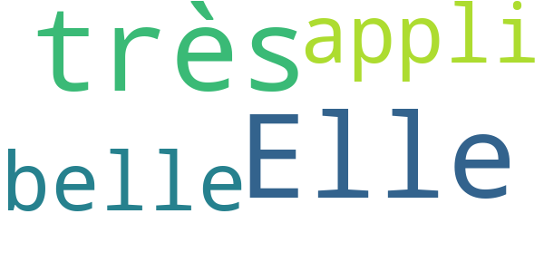
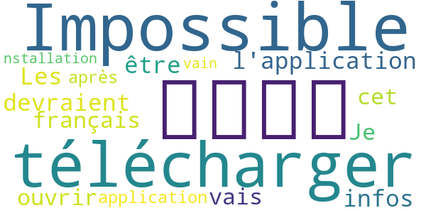

# WHO Info
App version ``2.3.4``

Analyzed with [covid-apps-observer](http://github.com/covid-apps-observer) project, version ``0.1``

## App overview
| | |
|-------------------------|-------------------------| 
| **Name**&nbsp;&nbsp;&nbsp;&nbsp;&nbsp;&nbsp;&nbsp;&nbsp;&nbsp;&nbsp;&nbsp;&nbsp;&nbsp;&nbsp;&nbsp;&nbsp;&nbsp;&nbsp;&nbsp;&nbsp;&nbsp;&nbsp;&nbsp;&nbsp;&nbsp;&nbsp;&nbsp;&nbsp;&nbsp;&nbsp;&nbsp;&nbsp;&nbsp;&nbsp;&nbsp;&nbsp;&nbsp;&nbsp;&nbsp;&nbsp;  | WHO Info |
| **Unique identifier** | org.who.infoapp |
| **Link to Google Play** | [https://play.google.com/store/apps/details?id=org.who.infoapp](https://play.google.com/store/apps/details?id=org.who.infoapp) |
| **Summary**  | L&#39;application d&#39;information officielle de l&#39;Organisation mondiale de la santé. |
| **Privacy policy** | [https://www.who.int/about/who-we-are/privacy-policy](https://www.who.int/about/who-we-are/privacy-policy) |
| **Latest version** | 2.3.4 |
| **Last update** | 2020-08-18 14:00:11 |
| **Recent changes** | This release addresses an issue related to case numbers reported to WHO. |
| **Installs**  | 100 000+ |
| **Category** | Actualités et magazines |
| **First release** | 13 avr. 2020 |
| **Size**  | 8,9M |
| **Supported Android version**  | 4.2 ou version ultérieure |

### Description
> Have the latest health information at your fingertips with the official World Health Organization Information App. This app displays the latest news, events, features and breaking updates on outbreaks. 
  
 WHO works worldwide to promote health, keep the world safe, and serve the vulnerable. 
 Our goal is to ensure that a billion more people have universal health coverage, to protect a billion more people from health emergencies, and provide a further billion people with better health and well-being.

### User interface
The developers of the app provide the following screenshots in the Google play store.
| | | |
|:-------------------------:|:-------------------------:|:-------------------------:|
 |   |   |   | 
 |   |   |   | 
 |   |   |   | 
 |   |   |   | 
 |   |   |   | 
 |   |   |   | 
 |   |   |   | 
 |   |   |   | 

## Development team
In the following we report the main information provided by the development team in the Google play store.

| | |
|-------------------------|-------------------------|
| **Developer**  | World Health Organization |
| **Website**  | [https://www.who.int/](https://www.who.int/) |
| **Email** | dcx@who.int |
| **Physical address**  | [Avenu Appia 20 1211 Geneva Switzerland](https://www.google.com/maps/search/Avenu%20Appia%2020%201211%20Geneva%20Switzerland) (Google Maps) |
| **Other developed apps**  | [https://play.google.com/store/apps/developer?id=World+Health+Organization](https://play.google.com/store/apps/developer?id=World+Health+Organization) |

## Android support

| | |
|-------------------------|-------------------------|
| **Declared target Android version**  | - |
| **Effective target Android version**  | - |
| **Minimum supported Android version**  | Jelly Bean, version 4.2.x (API level 17) |
| **Maximum target Android version**  | - |

The larger the difference between the minimum and maximum supported Android versions, the better. A larger difference means a wider audience. For example, old phones have a very low Android version, so a high minimum supported Android version means that the app cannot be used by users with old phones, thus leading to accessibility problems. 

## Requested permissions

In the following we report the complete list of the permissions requested by the app. 

| **Permission** | **Protection level** | **Description** | 
|-------------------------|-------------------------|-------------------------|
 **android.permission ACCESS_NETWORK_STATE** | Normal | Allows applications to access information about networks. 
 **android.permission INTERNET** | Normal | Allows applications to open network sockets. 
 **android.permission READ_CALENDAR** | :warning:**Dangerous** | Allows an application to read the user's calendar data. 
 **android.permission READ_EXTERNAL_STORAGE** | :warning:**Dangerous** | Allows an application to read from external storage. 
 **android.permission WAKE_LOCK** | Normal | Allows using PowerManager WakeLocks to keep processor from sleeping or screen from dimming. 
 **android.permission WRITE_CALENDAR** | :warning:**Dangerous** | Allows an application to write the user's calendar data. 
 **android.permission WRITE_EXTERNAL_STORAGE** | :warning:**Dangerous** | Allows an application to write to external storage. 
 **com.google.android.c2dm.permission RECEIVE** | - | - 
 **com.google.android.finsky.permission BIND_GET_INSTALL_REFERRER_SERVICE** | - | - 

## Mentioned servers

| **Server** | **Registrant** | **Registrant country** | **Creation date** | 
|-------------------------|-------------------------|-------------------------|-------------------------|
 | googlesyndication.com | Google LLC | :us: US | 2003-01-21 06:17:24 |
 | google.com | Google LLC | :us: US | 1997-09-15 04:00:00 |
 | app-measurement.com | Google LLC | :us: US | 2015-06-19 20:13:31 |
 | googleapis.com | Google LLC | :us: US | 2005-01-25 17:52:26 |
 | googleadservices.com | Google LLC | :us: US | 2003-06-19 16:34:53 |

## Security analysis 

Below we report the main security warnings raised by our execution of the [Androwarn](https://github.com/maaaaz/androwarn) security analysis tool.

**Connection interfaces exfiltration**
> - This application reads details about the currently active data network 
> - This application tries to find out if the currently active data network is metered 

**Suspicious connection establishment**
> - This application opens a Socket and connects it to the remote address 'Lfi/iki/elonen/NanoHTTPD$ResponseException;' on the 'N/A' port  
> - This application opens a Socket and connects it to the remote address 'NanoHttpd Shutdown' on the 'N/A' port  

**Code execution**
> - This application loads a native library: 'NativeScript' 
> - This application executes a UNIX command containing this argument: '2' 

## User ratings and reviews

Below we provide information about how end users are reacting to the app in terms of ratings and reviews in the Google Play store.

### Ratings

The WHO Info app has been installed by more than **100000** times. At this time, **863** rated the app and its average score is **3.69**. Below we show the distribution of the ratings across the usual star-based rating of Google Play

:star::star::star::star::star:: 500

:star::star::star::star:: 34

:star::star::star:: 103

:star::star:: 8

:star:: 215

### Reviews 

#### 5-star reviews

> Rien à dire très super  :date: __2020-08-28 23:34:43__

> Bonne application donne des informations sur covid 19  :date: __2020-07-23 20:58:40__

> L'application est cool mais il faudra faire pour le français  :date: __2020-07-10 00:12:24__

> bien  :date: __2020-07-07 05:20:29__

> تلفازبيدونيقتيطاع  :date: __2020-06-24 12:05:48__

> ممتاز  :date: __2020-06-17 14:06:27__

> J'aime  :date: __2020-06-14 12:30:05__

> Oui elle peut elle fornit également des actualités  :date: __2020-06-13 12:20:30__

> Bien  :date: __2020-06-13 09:33:22__

> Tem  :date: __2020-06-03 21:34:49__

#### 4-star reviews

> Pas mal votre idée  :date: __2020-08-11 14:31:55__

> Bonne application pour les infos, pour ceux qui se plaignent pour la langue vous pouvez modifier dans le profil, l'icône "personne " en bas à droite en fonction de votre version vous choisissez votre langage, par défaut le contenu l'application est en anglais.  :date: __2020-07-13 14:39:13__

#### 3-star reviews

> Elle est une très belle appli  :date: __2020-05-17 05:36:47__

#### 2-star reviews

> ركنا  :date: __2020-06-14 04:12:29__

> Impossible de télécharger l'application  :date: __2020-06-08 19:28:39__

> Les infos devraient être en français  :date: __2020-04-19 19:07:09__

> Je vais ouvrir cet application,après son i nstallation en vain...  :date: __2020-04-17 23:24:24__

#### 1-star reviews

> Pas de version en français.  :date: __2020-07-21 12:19:38__

> Une application pour des francophones DOIT être en français ! Merci  :date: __2020-06-20 13:12:11__

> Nul👎 ou est le français il faudrait peut-être écrire en français😔 pour qu'on puisse comprendre ce qui est écrit ça devient pénible car à chaque fois c'est le même problème 👎😔😔  :date: __2020-06-02 14:38:38__

> L'application autorisée par le dictateur mondial Google.  :date: __2020-05-27 07:43:39__

> Nul 👎👎👎👎  :date: __2020-05-25 20:34:13__

> Ca sevrai etre en francais  :date: __2020-05-01 21:04:21__

