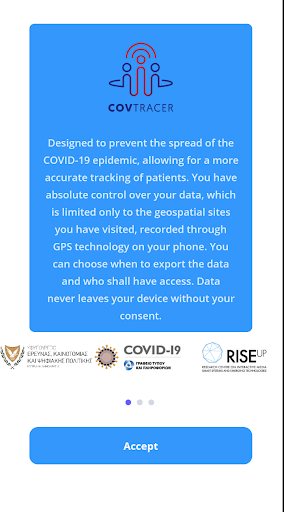
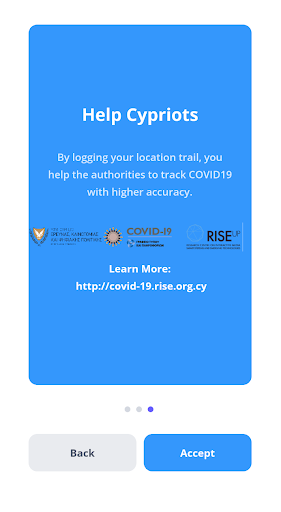
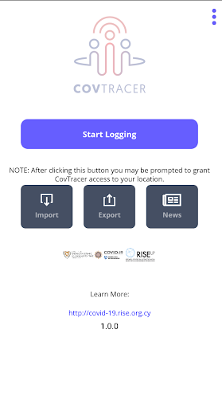
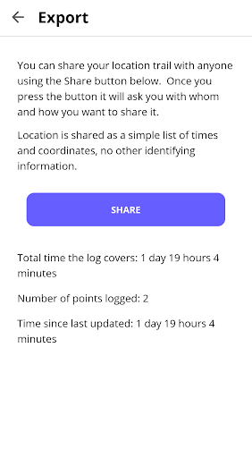
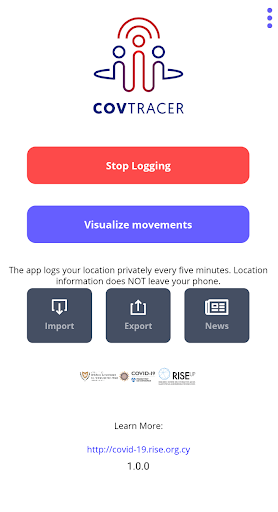
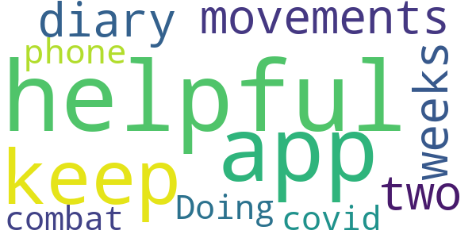
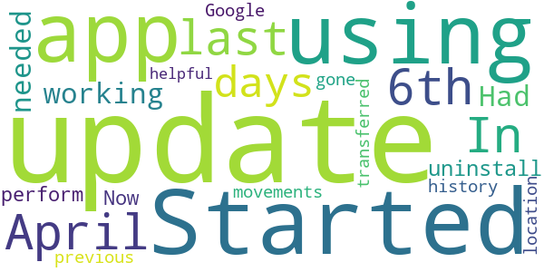

# CovTracer
App version ``2.0.2``

Analyzed with [covid-apps-observer](http://github.com/covid-apps-observer) project, version ``0.1``

## App overview
| | |
|-------------------------|-------------------------| 
| **Name**&nbsp;&nbsp;&nbsp;&nbsp;&nbsp;&nbsp;&nbsp;&nbsp;&nbsp;&nbsp;&nbsp;&nbsp;&nbsp;&nbsp;&nbsp;&nbsp;&nbsp;&nbsp;&nbsp;&nbsp;&nbsp;&nbsp;&nbsp;&nbsp;&nbsp;&nbsp;&nbsp;&nbsp;&nbsp;&nbsp;&nbsp;&nbsp;&nbsp;&nbsp;&nbsp;&nbsp;&nbsp;&nbsp;&nbsp;&nbsp;  | CovTracer |
| **Unique identifier** | edu.rise.ihnilatis |
| **Link to Google Play** | [https://play.google.com/store/apps/details?id=edu.rise.ihnilatis](https://play.google.com/store/apps/details?id=edu.rise.ihnilatis) |
| **Summary**  | Location tracking to avoid spread of coronavirus |
| **Privacy policy** | [http://covid-19.rise.org.cy/en/privacy/](http://covid-19.rise.org.cy/en/privacy/) |
| **Latest version** | 2.0.2 |
| **Last update** | 2020-06-11 08:15:33 |
| **Recent changes** | - User has full control over data management and sharing |
| **Installs**  | 1,000+ |
| **Category** | Health & Fitness |
| **First release** | Mar 24, 2020 |
| **Size**  | 28M |
| **Supported Android version**  | 5.0 and up |

### Description
> Halting the COVID19 epidemic requires rapid identification of the contacts wth whom the infected individuals had contact with, within the previous days and weeks. This allows decontamination of locations the infected individual has visited, plus informing and/or communicating with perhaps infected individuals. With almost half of the world’s population carrying a device capable of GPS tracking, location trails – timestamped logs of an individual’s location – can be created. By checking the user’s location trails, one can identify other citizens who have been in close proximity to the diagnosed carrier and, if the exposed users take appropriate action, reduce the spread of the infectious disease. The first version of the mobile app targets mainly employees and workers who need to work outside and cannot stay at home. This includes policemen, doctors and nurses, firemen, people working in important utilities (electricity, water, internet, etc.). It also targets people who need to leave home to go to supermarket or pharmacy. For the rest of Cyprus population, we strongly advice them to stay at home in order to stop the spreading of the epidemics. CovTracer app is based on the MIT project safepaths.

### User interface
The developers of the app provide the following screenshots in the Google play store.
| | | |
|:-------------------------:|:-------------------------:|:-------------------------:|
 |   |   |   | 
 |   |  

## Development team
In the following we report the main information provided by the development team in the Google play store.

| | |
|-------------------------|-------------------------|
| **Developer**  | RISE Research Centre of Excellence |
| **Website**  | [http://covid-19.rise.org.cy/](http://covid-19.rise.org.cy/) |
| **Email** | info@rise.org.cy |
| **Physical address**  | [RISE Research Centre of Excellence. Tryfon Building, Eleftheria Square, Konstantinou Palaiologou 1, Nicosia 1011 CYPRUS](https://www.google.com/maps/search/RISE%20Research%20Centre%20of%20Excellence.%20Tryfon%20Building,%20Eleftheria%20Square,%20Konstantinou%20Palaiologou%201,%20Nicosia%201011%20CYPRUS) (Google Maps) |
| **Other developed apps**  | [https://play.google.com/store/apps/developer?id=RISE+Research+Centre+of+Excellence](https://play.google.com/store/apps/developer?id=RISE+Research+Centre+of+Excellence) |

## Android support

| | |
|-------------------------|-------------------------|
| **Declared target Android version**  | Pie, version 9 (API level 28) |
| **Effective target Android version**  | Pie, version 9 (API level 28) |
| **Minimum supported Android version**  | Lollipop, version 5.0 (API level 21) |
| **Maximum target Android version**  | - |

The larger the difference between the minimum and maximum supported Android versions, the better. A larger difference means a wider audience. For example, old phones have a very low Android version, so a high minimum supported Android version means that the app cannot be used by users with old phones, thus leading to accessibility problems. 

## Requested permissions

In the following we report the complete list of the permissions requested by the app. 

| **Permission** | **Protection level** | **Description** | 
|-------------------------|-------------------------|-------------------------|
 **android.hardware location** | - | - 
 **android.permission ACCESS_BACKGROUND_LOCATION** | :warning:**Dangerous** | Allows an app to access location in the background. 
 **android.permission ACCESS_COARSE_LOCATION** | :warning:**Dangerous** | Allows an app to access approximate location. 
 **android.permission ACCESS_FINE_LOCATION** | :warning:**Dangerous** | Allows an app to access precise location. 
 **android.permission ACCESS_LOCATION_EXTRA_COMMANDS** | Normal | Allows an application to access extra location provider commands. 
 **android.permission ACCESS_NETWORK_STATE** | Normal | Allows applications to access information about networks. 
 **android.permission ACCESS_WIFI_STATE** | Normal | Allows applications to access information about Wi-Fi networks. 
 **android.permission AUTHENTICATE_ACCOUNTS** | - | - 
 **android.permission BLUETOOTH** | Normal | Allows applications to connect to paired bluetooth devices. 
 **android.permission BLUETOOTH_ADMIN** | Normal | Allows applications to discover and pair bluetooth devices. 
 **android.permission FOREGROUND_SERVICE** | Normal | Allows a regular application to use Service.startForeground. 
 **android.permission INTERNET** | Normal | Allows applications to open network sockets. 
 **android.permission READ_APP_BADGE** | - | - 
 **android.permission READ_SYNC_SETTINGS** | Normal | Allows applications to read the sync settings. 
 **android.permission RECEIVE_BOOT_COMPLETED** | Normal | Allows an application to receive the Intent.ACTION_BOOT_COMPLETED that is broadcast after the system finishes booting. 
 **android.permission WAKE_LOCK** | Normal | Allows using PowerManager WakeLocks to keep processor from sleeping or screen from dimming. 
 **android.permission WRITE_EXTERNAL_STORAGE** | :warning:**Dangerous** | Allows an application to write to external storage. 
 **android.permission WRITE_SYNC_SETTINGS** | Normal | Allows applications to write the sync settings. 
 **com.anddoes.launcher.permission UPDATE_COUNT** | - | - 
 **com.android.vending CHECK_LICENSE** | - | - 
 **com.google.android.c2dm.permission RECEIVE** | - | - 
 **com.google.android.finsky.permission BIND_GET_INSTALL_REFERRER_SERVICE** | - | - 
 **com.google.android.gms.permission ACTIVITY_RECOGNITION** | - | - 
 **com.htc.launcher.permission READ_SETTINGS** | - | - 
 **com.htc.launcher.permission UPDATE_SHORTCUT** | - | - 
 **com.huawei.android.launcher.permission CHANGE_BADGE** | - | - 
 **com.huawei.android.launcher.permission READ_SETTINGS** | - | - 
 **com.huawei.android.launcher.permission WRITE_SETTINGS** | - | - 
 **com.majeur.launcher.permission UPDATE_BADGE** | - | - 
 **com.oppo.launcher.permission READ_SETTINGS** | - | - 
 **com.oppo.launcher.permission WRITE_SETTINGS** | - | - 
 **com.sec.android.provider.badge.permission READ** | - | - 
 **com.sec.android.provider.badge.permission WRITE** | - | - 
 **com.sonyericsson.home.permission BROADCAST_BADGE** | - | - 
 **com.sonymobile.home.permission PROVIDER_INSERT_BADGE** | - | - 
 **edu.rise.ihnilatis.permission C2D_MESSAGE** | - | - 
 **me.everything.badger.permission BADGE_COUNT_READ** | - | - 
 **me.everything.badger.permission BADGE_COUNT_WRITE** | - | - 

## Mentioned servers

| **Server** | **Registrant** | **Registrant country** | **Creation date** | 
|-------------------------|-------------------------|-------------------------|-------------------------|
 | android.com | Google LLC | :us: US | 1997-06-23 04:00:00 |
 | googlesyndication.com | Google LLC | :us: US | 2003-01-21 06:17:24 |
 | google.com | Google LLC | :us: US | 1997-09-15 04:00:00 |
 | xml.org | OASIS Open | :us: US | 1997-02-03 05:00:00 |
 | facebook.com | Facebook, Inc. | :us: US | 1997-03-29 05:00:00 |
 | pinterest.com | DNStination Inc. | :us: US | 2009-11-26 19:21:23 |
 | twitter.com | Twitter, Inc. | :us: US | 2000-01-21 16:28:17 |
 | googleapis.com | Google LLC | :us: US | 2005-01-25 17:52:26 |

## Security analysis 

Below we report the main security warnings raised by our execution of the [Androwarn](https://github.com/maaaaz/androwarn) security analysis tool.

**Telephony identifiers leakage**
> - This application reads the numeric name (MCC+MNC) of current registered operator 
> - This application reads the operator name 
> - This application reads the phone number string for line 1, for example, the MSISDN for a GSM phone 

**Location lookup**
> - This application reads location information from all available providers (WiFi, GPS etc.) 

**Connection interfaces exfiltration**
> - This application reads details about the currently active data network 
> - This application tries to find out if the currently active data network is metered 

**Suspicious connection establishment**
> - This application opens a Socket and connects it to the remote address '' on the 'N/A' port  
> - This application opens a Socket and connects it to the remote address 'Ljava/lang/StringBuilder;->toString()Ljava/lang/String;' on the ': connect, resolve' port  
> - This application opens a Socket and connects it to the remote address 'Ljava/lang/StringBuilder;->toString()Ljava/lang/String;' on the 'N/A' port  
> - This application opens a Socket and connects it to the remote address 'Ljava/net/Proxy;->type()Ljava/net/Proxy$Type;' on the 'N/A' port  
> - This application opens a Socket and connects it to the remote address 'timeout' on the 'N/A' port  

**Pim data leakage**
> - This application accesses the downloads folder 
> - This application accesses data stored in the clipboard 

**Code execution**
> - This application loads a native library 
> - This application executes a UNIX command 

## User ratings and reviews

Below we provide information about how end users are reacting to the app in terms of ratings and reviews in the Google Play store.

### Ratings

The CovTracer app has been installed by more than **1000** times. At this time, **16** rated the app and its average score is **4.3125**. Below we show the distribution of the ratings across the usual star-based rating of Google Play

:star::star::star::star::star:: 12

:star::star::star::star:: 1

:star::star::star:: 1

:star::star:: 0

:star:: 2

### Reviews 

#### 5-star reviews

> A helpful app to keep a diary of movements for two weeks on my phone. Doing all we can to combat covid-19.  :date: __2020-04-15 16:47:14__

#### 4-star reviews

No recent reviews available with 4 stars.

#### 3-star reviews

No recent reviews available with 3 stars.

#### 2-star reviews

No recent reviews available with 2 stars.

#### 1-star reviews

> Started using app on April 6th. In the last few days was not working and an update was needed. Had to uninstall to perform the update. Now all my previous movements are gone and location history from Google cannot be transferred. Not helpful.  :date: __2020-04-28 07:12:53__

