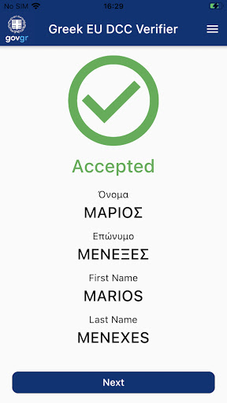
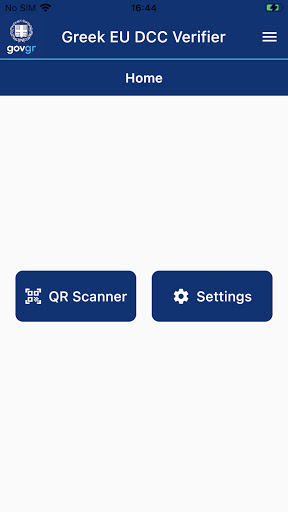
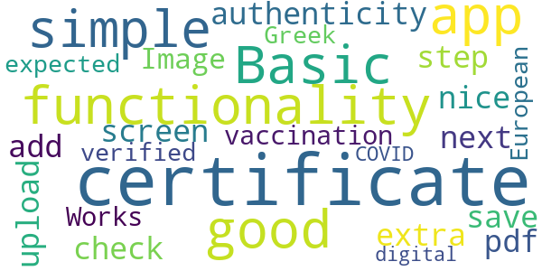
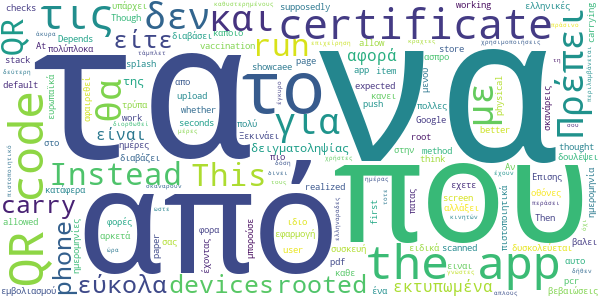
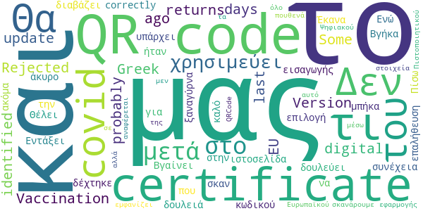
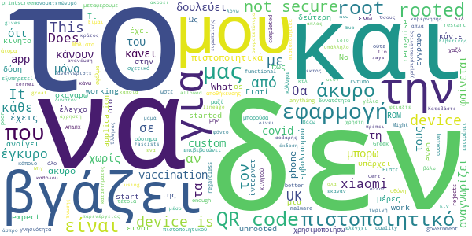

# Covid Free GR
App version ``1.8.7``

Analyzed with [covid-apps-observer](http://github.com/covid-apps-observer) project, version ``0.1``

## App overview
| | |
|-------------------------|-------------------------| 
| **Name**&nbsp;&nbsp;&nbsp;&nbsp;&nbsp;&nbsp;&nbsp;&nbsp;&nbsp;&nbsp;&nbsp;&nbsp;&nbsp;&nbsp;&nbsp;&nbsp;&nbsp;&nbsp;&nbsp;&nbsp;&nbsp;&nbsp;&nbsp;&nbsp;&nbsp;&nbsp;&nbsp;&nbsp;&nbsp;&nbsp;&nbsp;&nbsp;&nbsp;&nbsp;&nbsp;&nbsp;&nbsp;&nbsp;&nbsp;&nbsp;  | Covid Free GR |
| **Unique identifier** | gr.gov.dcc.mini |
| **Link to Google Play** | [https://play.google.com/store/apps/details?id=gr.gov.dcc.mini](https://play.google.com/store/apps/details?id=gr.gov.dcc.mini) |
| **Summary**  | The official Greek application for the verification of European digital COVID |
| **Privacy policy** | [https://www.gov.gr/info/politiki-aporritou](https://www.gov.gr/info/politiki-aporritou) |
| **Latest version** | 1.8.7 |
| **Last update** | 2021-07-15 16:11:49 |
| **Recent changes** | Bug fixes and performance improvements |
| **Installs**  | 100,000+ |
| **Category** | Health & Fitness |
| **First release** | Jun 27, 2021 |
| **Size**  | 7.3M |
| **Supported Android version**  | 4.4W and up |

### Description
> You are using the official Greek application for the verification of European digital COVID certificates which is available through the official account of the Hellenic Republic.

### User interface
The developers of the app provide the following screenshots in the Google play store.
| | | |
|:-------------------------:|:-------------------------:|:-------------------------:|
 |   |   |   | 
 |  

## Development team
In the following we report the main information provided by the development team in the Google play store.

| | |
|-------------------------|-------------------------|
| **Developer**  | Hellenic Republic |
| **Website**  | [https://eudcc.gov.gr](https://eudcc.gov.gr) |
| **Email** | govgr@mindigital.gr |
| **Physical address**  | [11 Fragoudi st 10163 Kallithea Athens, Greece](https://www.google.com/maps/search/11%20Fragoudi%20st%2010163%20Kallithea%20Athens,%20Greece) (Google Maps) |
| **Other developed apps**  | [https://play.google.com/store/apps/developer?id=Hellenic+Republic](https://play.google.com/store/apps/developer?id=Hellenic+Republic) |

## Android support

| | |
|-------------------------|-------------------------|
| **Declared target Android version**  | - |
| **Effective target Android version**  | - |
| **Minimum supported Android version**  | KitKat W, version 4.4W - 4.4.4W (API level 20) |
| **Maximum target Android version**  | - |

The larger the difference between the minimum and maximum supported Android versions, the better. A larger difference means a wider audience. For example, old phones have a very low Android version, so a high minimum supported Android version means that the app cannot be used by users with old phones, thus leading to accessibility problems. 

## Requested permissions

In the following we report the complete list of the permissions requested by the app. 

| **Permission** | **Protection level** | **Description** | 
|-------------------------|-------------------------|-------------------------|
 **android.permission ACCESS_NETWORK_STATE** | Normal | Allows applications to access information about networks. 
 **android.permission CAMERA** | :warning:**Dangerous** | Required to be able to access the camera device. 
 **android.permission INTERNET** | Normal | Allows applications to open network sockets. 

## Mentioned servers

| **Server** | **Registrant** | **Registrant country** | **Creation date** | 
|-------------------------|-------------------------|-------------------------|-------------------------|
-

## Security analysis 

Below we report the main security warnings raised by our execution of the [Androwarn](https://github.com/maaaaz/androwarn) security analysis tool.

**Pim data leakage**
> - This application accesses data stored in the clipboard 

**Code execution**
> - This application loads a native library: 'flutter' 
> - This application loads a native library: 'tool-checker' 
> - This application executes a UNIX command 
> - This application executes a UNIX command containing this argument: 'getprop' 
> - This application executes a UNIX command containing this argument: 'mount' 

## User ratings and reviews

Below we provide information about how end users are reacting to the app in terms of ratings and reviews in the Google Play store.

### Ratings

The Covid Free GR app has been installed by more than **100000** times. At this time, **620** rated the app and its average score is **2.730435**. Below we show the distribution of the ratings across the usual star-based rating of Google Play

:star::star::star::star::star:: 200

:star::star::star::star:: 54

:star::star::star:: 48

:star::star:: 16

:star:: 302

### Reviews 

#### 5-star reviews

> I didn't have any significant issues using this app. Keep up the good job. It is helpful.  :date: __2021-07-21 10:37:11__

> Scans and reports. As advertised and expected.  :date: __2021-07-20 18:50:47__

> Works perfect  :date: __2021-07-20 08:39:04__

> Simple and easy to use!  :date: __2021-07-18 12:45:52__

> Όσοι έχουν βάλει αρνητική κριτική μάλλον δεν έχουν καταλάβει τον σκοπό και την χρησιμότητα της εφαρμογής. Θα μπορούσε βέβαια να αναφέρεται ο λόγος σε περίπτωση άκυρου.  :date: __2021-07-17 13:32:37__

> It's good that it doesn't works on rooted phones because it would be possible to have fake certifications  :date: __2021-07-16 18:50:42__

> Cool. It successfully verifies vaccine certifications from EU States.  :date: __2021-07-15 08:55:53__

> Για τα rooted κινητα update to magisk se 22.1 χρησημοποιειτε magisk hide , κανετε repackage σε αλλο ονομα απο Magisk Manager κριβεται το root απο την εφαρμογή και δουλευει πενα.  :date: __2021-07-14 10:07:20__

> Λειτουργεί όπως πρέπει  :date: __2021-07-14 09:43:13__

> Λειτουργική 100% και πολύ χρήσιμη!!  :date: __2021-07-14 08:32:30__

#### 4-star reviews

> Basic functionality for the app and it's good for a simple authenticity check. As a next step, would be nice to add an extra screen to upload and save (as pdf? Image?) ours vaccination certificate.  :date: __2021-07-16 20:16:13__

> Works as expected, verified both European and Greek digital COVID certificates.  :date: __2021-07-13 13:32:03__

#### 3-star reviews

> This app should supposedly showcaee whether the app user has a pcr or a vaccination certificate. Instead it checks a qr.  :date: __2021-07-18 17:45:10__

> You can get the app to run on rooted devices if you just Google for 5 seconds. (Depends on root method) At first I thought this would allow me to store my own certificate so I wouldn't have to carry a physical certificate with me but it doesn't work like that. Then I realized I can just carry a pdf on my phone. The app is working as expected. Though I think rooted devices should be allowed to run the app by default.  :date: __2021-07-18 17:40:18__

> Would be better if you could upload your QR code to the app so that it can be scanned from your phone instead of carrying a paper certificate  :date: __2021-07-18 08:47:41__

> Τα QR code από τις ελληνικές βεβαιώσεις εμβολιασμού τα διαβάζει πολύ εύκολα, είτε εκτυπωμένα είτε από τις οθόνες. Τα ευρωπαϊκά πιστοποιητικά που τα QR codes είναι πιο πολύπλοκα, δυσκολεύεται αρκετά, ειδικά εκτυπωμένα δεν κατάφερα να τα διαβάσει.  :date: __2021-07-13 16:14:52__

> Ξεκινάει η εφαρμογή και δεν εχετε βαλει καποιο splash screen για αυτο ειναι ασπρο. Επισης απο το μενου καθε φορα που πατας το ιδιο item σας κανει push στο page stack πολλες φορές  :date: __2021-07-13 14:51:33__

> Θα μπορούσε να δουλέψει εύκολα. Πρέπει να αφαιρεθεί η "τρύπα" που υπάρχει με τις ημερομηνίες. Αν σκανάρεις ένα QR code, έχοντας αλλάξει ημερομηνία (+14 ημέρες) στην συσκευή που θα το χρησιμοποιήσεις, τότε σου δίνει "πράσινο"  :date: __2021-07-13 14:01:21__

> Δεν αφορά απλούς χρήστες κινητών τάμπλετ, αφορά τις επιχείρηση που θα σκαναρουν το QR code από το πιστοποιητικό  :date: __2021-07-13 13:59:00__

> Για τους καθυστερημένους, κραχτες, δήθεν γνώστες ελληναραδες, με με τα άκυρα QR... Πρέπει να έχουν περάσει 14 μέρες από τη δεύτερη δόση για να είναι έγκυρο...  :date: __2021-07-13 13:29:21__

> Πρέπει να διορθωθεί ώστε να περιλαμβάνεται και η ώρα δειγματοληψίας και όχι από 00:01 της ημέρας της δειγματοληψίας.  :date: __2021-07-13 12:44:27__

#### 2-star reviews

> Version 1.8.4+35 returns "Rejected" to my Greek Vaccination Certificate and the EU digital covid certificate. Some days ago (probably before the last update) both certificates were identified correctly.  :date: __2021-07-20 18:25:50__

> Δεν διαβάζει το qr code. Βγαίνει συνέχεια άκυρο. Ενώ στην ιστοσελίδα δουλεύει. Θα ήταν καλό να υπάρχει και η επιλογή εισαγωγής του κωδικού για την επαλήθευση.  :date: __2021-07-14 12:01:15__

> Εντάξει. Έκανα σκαν το QR code και το δέχτηκε και μετά ξαναγύρνα στο QR code!! Βγήκα, μπήκα.. Πίσω στο QR code! Θέλει δουλειά ακόμα..  :date: __2021-07-13 17:04:05__

> Και που το σκανάρουμε το QRCode του Ευρωπαϊκού Ψηφιακού Πιστοποιητικού CoViD-19 μέσω της εφαρμογής, τι μας χρησιμεύει;! Μας εμφανίζει μεν τα στοιχεία μας αλλά μετά τι;! Δεν μας αναφέρεται πουθενά σε τι θα μας χρησιμεύει όλο αυτό.  :date: __2021-07-13 09:29:45__

#### 1-star reviews

> Not functional enough. Might even be malware.  :date: __2021-07-23 20:18:53__

> Ότι πιο χαζό υπάρχει  :date: __2021-07-23 15:14:19__

> Είστε για γέλια, σε unrooted xiaomi συσκευή να βγάζει σφάλμα.. doesn't work on xiaomi devices, regardless if rooted or not.. poor quality, I wouldn't expect anything better from the Greek "government"..  :date: __2021-07-22 13:12:57__

> Not working ...i have completed the vaccination but this app rejects ...  :date: __2021-07-22 01:28:53__

> Δεν δουλεύει, βγάζει το πιστοποιητικό μου άκυρο κ κόλλησε Κ όλο το σύστημα του κινητού μου και Δεν μπορούσα ούτε restart να κάνω!!  :date: __2021-07-21 09:05:37__

> Η εφαρμογή το μόνο που κάνει είναι να επιβεβαιώνει την γνησιότητα του πιστοποιητικού. Δεν υπάρχει δυνατότητα αποθήκευσης του QR code, ώστε να μην μεταφέρουμε μαζί μας το έντυπο. Ως τέτοια εξυπηρετεί μόνο άτομα που κάνουν κάποιο σχετικό έλεγχο. Μάλιστα τους επιτρέπει να κάνουν printscreen την οθόνη με το ονοματεπώνυμό μας. ΑΠΔΠΧ ακούει; Η τωρινή έκδοση είναι απλά άχρηστη για τον μέσο χρήστη. Κατεβάστε την εφαρμογή της Ελβετικής κυβέρνησης COVID Cert χρησιμοποιώντας το Ευρ. Πιστοποιητικό.  :date: __2021-07-20 13:52:18__

> Γιατί πρέπει να φαίνεται το ονοματεπώνυμο μου στον κάθε υπάλληλο κάθε καταστήματος;  :date: __2021-07-19 21:42:00__

> Βάζω 1 γιατί δεν μπορώ να βάλω 0. Η εφαρμογή ελέγχει αν ένα πιστοποιητικό εμβολιασμού είναι έγκυρο. Όσους από μας δεν μας έκαναν τη δεύτερη δόση λόγω σοβαρής παρενέργειας, το πιστοποιητικό που το ίδιο το κράτος μας δίνει μας το βγάζει άκυρο.  :date: __2021-07-19 21:06:19__

> Είμαι Έλληνας από μαμά Κιν χωρίς root custom ROM kernel κτλ και δεν ανοίγει η εφαρμογή καθόλου , απλός άσπρο φόντο φτιάξτε το , αν είναι δυνατόν δλδ.  :date: __2021-07-17 13:38:38__

> It says my device is not secure, and it doesn't start.  :date: __2021-07-17 08:50:28__

