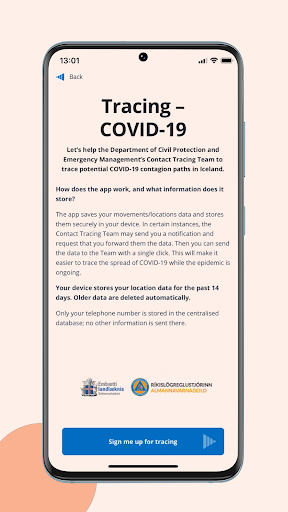
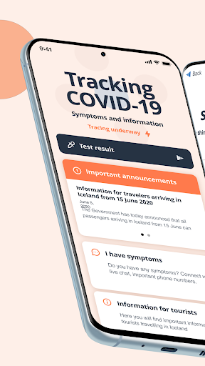
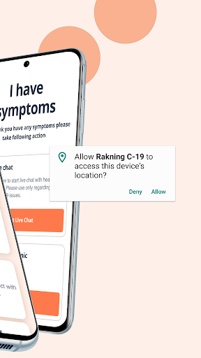
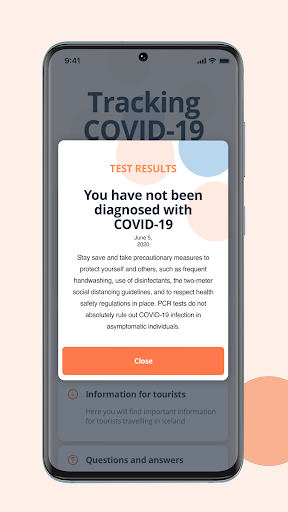

# Rakning C-19
App version ``2.1.2``

Analyzed with [covid-apps-observer](http://github.com/covid-apps-observer) project, version ``0.1``

## App overview
| | |
|-------------------------|-------------------------| 
| **Name**&nbsp;&nbsp;&nbsp;&nbsp;&nbsp;&nbsp;&nbsp;&nbsp;&nbsp;&nbsp;&nbsp;&nbsp;&nbsp;&nbsp;&nbsp;&nbsp;&nbsp;&nbsp;&nbsp;&nbsp;&nbsp;&nbsp;&nbsp;&nbsp;&nbsp;&nbsp;&nbsp;&nbsp;&nbsp;&nbsp;&nbsp;&nbsp;&nbsp;&nbsp;&nbsp;&nbsp;&nbsp;&nbsp;&nbsp;&nbsp;  | Rakning C-19 |
| **Unique identifier** | is.landlaeknir.rakning |
| **Link to Google Play** | [https://play.google.com/store/apps/details?id=is.landlaeknir.rakning](https://play.google.com/store/apps/details?id=is.landlaeknir.rakning) |
| **Summary**  | Official Government app from  to help mitigate the Covid-19 pandemic in Iceland. |
| **Privacy policy** | [https://www.covid.is/app/privacystatement](https://www.covid.is/app/privacystatement) |
| **Latest version** | 2.1.2 |
| **Last update** | 2020-07-19 16:04:36 |
| **Recent changes** | Version 2.1.2 |
| **Installs**  | 50.000+ |
| **Category** | Lífsstíll |
| **First release** | 31. mar. 2020 |
| **Size**  | 28M |
| **Supported Android version**  | 5.0 og nýrra |

### Description
> Official app from the Icelandic Government to help mitigate the Covid-19 pandemic in Iceland
 The app collects the GPS location of the phone and stores locally on the device. If the phone owner is diagnosed with the Covid-19 disease he is asked by the Directorate of Health to share the location data for contact tracing in order to identify individuals that might need to go into quarantine.

### User interface
The developers of the app provide the following screenshots in the Google play store.
| | | |
|:-------------------------:|:-------------------------:|:-------------------------:|
 |   |   |   | 
 |   |  

## Development team
In the following we report the main information provided by the development team in the Google play store.

| | |
|-------------------------|-------------------------|
| **Developer**  | Embætti landlæknis |
| **Website**  | [http://covid.is](http://covid.is) |
| **Email** | olafurkr@landlaeknir.is |
| **Physical address**  | [Katrínartún 2, 105 Reykjavík Iceland](https://www.google.com/maps/search/Katrínartún%202,%20105%20Reykjavík%20Iceland) (Google Maps) |
| **Other developed apps**  | [https://play.google.com/store/apps/developer?id=9072923057432209139](https://play.google.com/store/apps/developer?id=9072923057432209139) |

## Android support

| | |
|-------------------------|-------------------------|
| **Declared target Android version**  | Pie, version 9 (API level 28) |
| **Effective target Android version**  | Pie, version 9 (API level 28) |
| **Minimum supported Android version**  | Lollipop, version 5.0 (API level 21) |
| **Maximum target Android version**  | - |

The larger the difference between the minimum and maximum supported Android versions, the better. A larger difference means a wider audience. For example, old phones have a very low Android version, so a high minimum supported Android version means that the app cannot be used by users with old phones, thus leading to accessibility problems. 

## Requested permissions

In the following we report the complete list of the permissions requested by the app. 

| **Permission** | **Protection level** | **Description** | 
|-------------------------|-------------------------|-------------------------|
 **android.hardware location** | - | - 
 **android.permission ACCESS_COARSE_LOCATION** | :warning:**Dangerous** | Allows an app to access approximate location. 
 **android.permission ACCESS_FINE_LOCATION** | :warning:**Dangerous** | Allows an app to access precise location. 
 **android.permission ACCESS_LOCATION_EXTRA_COMMANDS** | Normal | Allows an application to access extra location provider commands. 
 **android.permission ACCESS_NETWORK_STATE** | Normal | Allows applications to access information about networks. 
 **android.permission AUTHENTICATE_ACCOUNTS** | - | - 
 **android.permission FOREGROUND_SERVICE** | Normal | Allows a regular application to use Service.startForeground. 
 **android.permission INTERNET** | Normal | Allows applications to open network sockets. 
 **android.permission READ_EXTERNAL_STORAGE** | :warning:**Dangerous** | Allows an application to read from external storage. 
 **android.permission READ_SYNC_SETTINGS** | Normal | Allows applications to read the sync settings. 
 **android.permission RECEIVE_BOOT_COMPLETED** | Normal | Allows an application to receive the Intent.ACTION_BOOT_COMPLETED that is broadcast after the system finishes booting. 
 **android.permission STORAGE** | - | - 
 **android.permission WAKE_LOCK** | Normal | Allows using PowerManager WakeLocks to keep processor from sleeping or screen from dimming. 
 **android.permission WRITE_EXTERNAL_STORAGE** | :warning:**Dangerous** | Allows an application to write to external storage. 
 **android.permission WRITE_SYNC_SETTINGS** | Normal | Allows applications to write the sync settings. 
 **com.google.android.c2dm.permission RECEIVE** | - | - 
 **com.google.android.finsky.permission BIND_GET_INSTALL_REFERRER_SERVICE** | - | - 
 **com.google.android.gms.permission ACTIVITY_RECOGNITION** | - | - 
 **com.google.android.providers.gsf.permission READ_GSERVICES** | - | - 

## Mentioned servers

| **Server** | **Registrant** | **Registrant country** | **Creation date** | 
|-------------------------|-------------------------|-------------------------|-------------------------|
 | bugsnag.com | Bugsnag Inc. | GB | 2011-08-18 03:26:10 |
 | android.com | Google LLC | :us: US | 1997-06-23 04:00:00 |
 | googlesyndication.com | Google LLC | :us: US | 2003-01-21 06:17:24 |
 | google.com | Google LLC | :us: US | 1997-09-15 04:00:00 |
 | app-measurement.com | Google LLC | :us: US | 2015-06-19 20:13:31 |
 | xml.org | OASIS Open | :us: US | 1997-02-03 05:00:00 |
 | github.com | GitHub, Inc. | :us: US | 2007-10-09 18:20:50 |
 | microsoft.com | Microsoft Corporation | :us: US | 1991-05-02 04:00:00 |
 | googleapis.com | Google LLC | :us: US | 2005-01-25 17:52:26 |
 | googleadservices.com | Google LLC | :us: US | 2003-06-19 16:34:53 |
 | expo.io | See PrivacyGuardian.org | :us: US | 2011-05-01 21:26:50 |

## Security analysis 

Below we report the main security warnings raised by our execution of the [Androwarn](https://github.com/maaaaz/androwarn) security analysis tool.

**Telephony identifiers leakage**
> - This application reads the ISO country code equivalent of the current registered operator's MCC (Mobile Country Code) 
> - This application reads the numeric name (MCC+MNC) of current registered operator 
> - This application reads the operator name 

**Connection interfaces exfiltration**
> - This application reads details about the currently active data network 
> - This application tries to find out if the currently active data network is metered 

**Suspicious connection establishment**
> - This application opens a Socket and connects it to the remote address '' on the 'N/A' port  
> - This application opens a Socket and connects it to the remote address 'Ljava/lang/StringBuilder;->toString()Ljava/lang/String;' on the ': connect, resolve' port  
> - This application opens a Socket and connects it to the remote address 'Ljava/lang/StringBuilder;->toString()Ljava/lang/String;' on the 'N/A' port  
> - This application opens a Socket and connects it to the remote address 'Ljava/net/Proxy;->type()Ljava/net/Proxy$Type;' on the 'N/A' port  
> - This application opens a Socket and connects it to the remote address 'timeout' on the 'N/A' port  

**Pim data leakage**
> - This application accesses data stored in the clipboard 

**Code execution**
> - This application loads a native library 
> - This application loads a native library: 'bugsnag-ndk' 
> - This application loads a native library: 'bugsnag-plugin-android-anr' 
> - This application executes a UNIX command 

## User ratings and reviews

Below we provide information about how end users are reacting to the app in terms of ratings and reviews in the Google Play store.

### Ratings

The Rakning C-19 app has been installed by more than **50000** times. At this time, **299** rated the app and its average score is **3.29**. Below we show the distribution of the ratings across the usual star-based rating of Google Play

:star::star::star::star::star:: 128

:star::star::star::star:: 35

:star::star::star:: 14

:star::star:: 32

:star:: 86

### Reviews 

#### 5-star reviews

> Mjög gott, virkar vel hjá mér.  :date: __2020-10-07 14:50:55__

> Hvernig veit ég að raknigar foritið hjá mér sé opið  :date: __2020-08-30 18:45:51__

> Snilldin ein  :date: __2020-08-11 00:57:52__

> Eg vil að þið getið rakið hvar eg var ef eg skyldi veikjast  :date: __2020-08-08 22:22:05__

> Mér finnst það frábært að fá að vita og fylgjast með a fundum i sjónvarpinu  :date: __2020-08-06 15:47:59__

> Veitir öryggi  :date: __2020-07-10 03:16:57__

> Bara snilld.  :date: __2020-05-21 00:56:16__

> Allir ættu að vera með þetta forrit!  :date: __2020-04-20 08:13:49__

> Flott  :date: __2020-04-12 13:00:44__

> Flott app en rafhlaðan er alltaf tóm út af þessu appi.  :date: __2020-04-10 12:27:11__

#### 4-star reviews

> Frábært app  :date: __2020-09-21 23:33:22__

> Finst mer vera örugari  :date: __2020-08-08 15:15:17__

> Rafhlaðan klárast frekar hratt, en tilgangurinn göfugur.  :date: __2020-08-01 01:06:30__

> Traust og öruggt  :date: __2020-04-08 14:39:08__

> Hvar sé ég minn punkt? annars ok!  :date: __2020-04-04 00:45:28__

#### 3-star reviews

> Fínt á höfuðborgarsvæðinu ef þú ert á ferðinni  :date: __2020-10-21 20:15:10__

> Það er eiginlega alveg ferlega erfitt að hafa appið í símanum því það tekur svo mikið batterí!! Flott konsept samt  :date: __2020-05-27 22:05:52__

> Nær ekki að rekjast  :date: __2020-04-09 01:37:23__

> Mikilvægt app en ég horfi á batteríið tæmast. Er ekki hægt að gera eitthvað í því?  :date: __2020-04-07 16:21:05__

> Fæ ekki upp umhverfi til að setja inn símanr. mitt.  :date: __2020-04-03 13:34:09__

#### 2-star reviews

> Ég er að lenda í því að tilkynning sem á alltaf að vera opin. Lokist og ég þarf að fara inn i forritið til að opna aftur. Veit um engan annan sem er að lenda i því sama  :date: __2020-08-09 13:34:28__

> Frýs, þungt á batterí.  :date: __2020-07-23 01:13:21__

> Forritið étur batteríið hjá mér frá klukkan 7 til 18 hefur forritið verið 30% af allri batterís notkuni símanum.  :date: __2020-04-07 20:15:26__

> Mikilvægt app, og vel hannað með tilliti til persónuverndar. En djöfull hvað það tæmir rafhlöðuna hratt! Það er samt mikilvægt app, og mikilvægt er að hvetja aðra til að nota það (við þurfum meirihlutann að nota það til að hafa áhrif)... en það VERÐUR að laga það. Annars fer fólk að yfirgefa það.  :date: __2020-04-04 13:07:02__

> Rafhlaðan klárast hratt  :date: __2020-04-03 16:34:07__

#### 1-star reviews

> Tilkynning sem á alltaf að vera, hverfur. Er appið samt að rekja eða er þetta bara frat?  :date: __2020-10-24 12:16:13__

> Óánægður með þetta app er með nýjan síma með nýrri rafhlöðu og þurfti að hlaða sjaldan þar sem hann er nýr, svo sótti ég apppið og rafhlaðan bara lekur liggurvið, get jafnvel horft á prósentin hverfa. Þetta þarf að laga ef að eg á að vera með þetta app.  :date: __2020-10-18 13:16:17__

> Það er lítið gagn af þessu nauðsynlega appi ef það er engan veginn hægt treysta því að það sé virkt 24/7... dettur út á 2-3 daga fresti og þarf því að ræsa það endurtekið þess vegna!!  :date: __2020-10-04 00:56:15__

> Væri frábært ef þetta myndi virka. Dettur út á sirka tveggja daga fresti. Þarf alltaf að vera að ræsa það aftur :(  :date: __2020-10-03 22:55:24__

> Þetta frýs í hvívetna, ekki hægt að opna. Þegar þú nærð aftur í appið getur þú opnað það einu sinni en ekki ýtt á spjall eða neitt?? Hver er tilgangurinn með þessu appi ef fólk getur ekki nýtt sér það?  :date: __2020-08-03 12:17:21__

> Ég fékk tilkynningu frá þeim og appið opnast ekki??? Sama þótt ég setji það aftur upp eða endurræsi símann! Algert rusl þetta app  :date: __2020-08-01 10:59:19__

> Búin ađ eyđa deginum ađ sækja appiđ, enn aftur ekki hægt taka 2  :date: __2020-04-10 00:54:04__

> Er með Samsung s10 og kemst ekki inn í þetta fæ ekki sms með kóðanum  :date: __2020-04-06 15:33:44__

> Gekk vel að ná í þetta app  :date: __2020-04-05 19:26:40__

> Get ekki gert neitt er með S10 og bara siða a 3 tungumalum frosin  :date: __2020-04-05 00:56:48__

