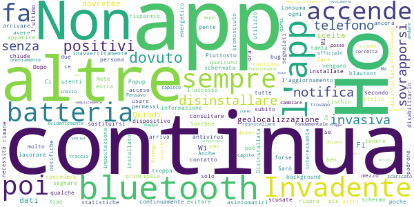
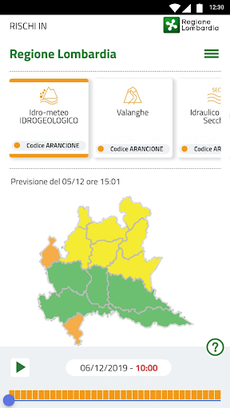
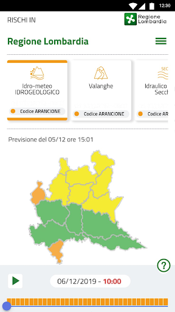
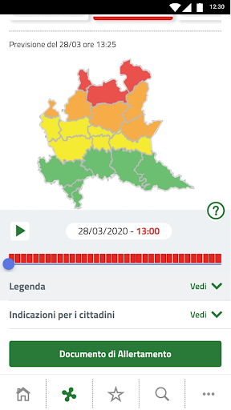
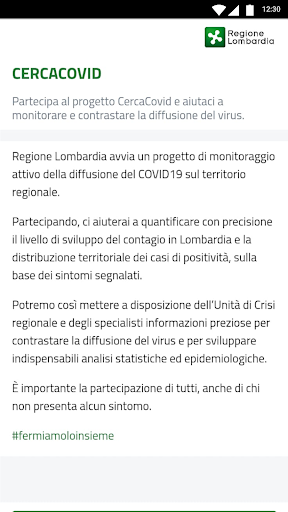
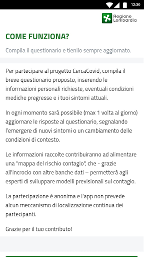
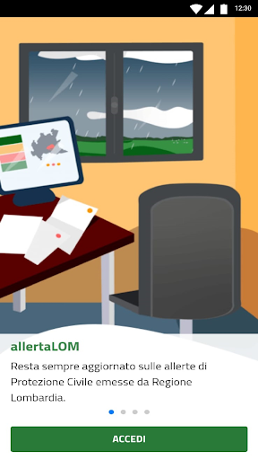
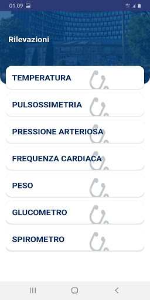

# COVID-related Android apps in Italy

Author: `Ivano Malavolta` (ivanomalavolta@gmail.com)

Created at: `2020/5/9`

Report generated by the [covid-apps-observer](http://github.com/covid-apps-observer) project, version 0.1

# Table of contents 

- [Background](#background)
    * [Data sources and analyses](#data-sources-and-analyses)
        * [App metadata](#app-metadata)
        * [Requested permissions](#requested-permissions)
        * [Mentioned servers](#mentioned_servers)
        * [Security analysis](#security_analysis)
        * [User ratings and reviews](#user-ratings-and-reviews)
    * [Disclaimer](#disclaimer)
- [SM_Covid19](#sm_covid19)
- [allertaLOM](#allertalom)
- [LAZIOdrCovid](#laziodrcovid)
- [Sicilia Si Cura](#sicilia-si-cura)
- [Covid-19](#covid-19)
- [WHO Info](#who-info)
- [OpenWHO: Knowledge for Health Emergencies](#openwho-knowledge-for-health-emergencies)

- [Credits](#credits)

# How to read this report

This report has been generated by the [covid-apps-observer](http://github.com/covid-apps-observer) project. The project automatically analyzes the apps by extracting information which is already publicly available either on the web or in the apps binary files. 

Our analysis covers the following apps:
| | |
|-------------------------|-------------------------| 
|  | SM_Covid19
|  | allertaLOM
|  | LAZIOdrCovid
|  | Sicilia Si Cura
|  | Covid-19
|  | WHO Info
|  | OpenWHO: Knowledge for Health Emergencies

The details of our analysis are presented in the remainder of this report.

For independent verification, the raw data and the source code of the project is publicly available in its GitHub repository [http://github.com/covid-apps-observer](http://github.com/covid-apps-observer) and its source code has been thoroughly commented in order to provide all the details about how the information provided in this report has been extracted. 

Any feedback, questions, and improvements about the project are very welcome, feel free to create an issue or pull request directly in its GitHub repository: [http://github.com/covid-apps-observer](http://github.com/covid-apps-observer).

## Data sources and analyses

The analysis of each app is structured around five main dimensions: 
* App metadata  
* Requested permissions
* Mentioned servers
* Androwarn analysis
* User ratings and reviews

In the following we describe the data sources and analysis performed for each dimension.

### App metadata

App metadata includes an overview of the main information about the app (for example, its name, releases, privacy policy, etc.), contact information of the development team, and the various Android versions supported by the app. This information is extracted from two main data sources:
* _Google Play store_: we automatically mined the web page of the Google Play store showing the basic information about the app and we parsed it in order to extract information about the app and development team 
* _Android Manifest file_: in our analysis we decompiled the binary file of the app (it is similar to a Zip archive but it contains the code of the app instead of normal files) and we extracted information about the supported Android versions, as it has been listed by its development team.

The extracted app metadata feeds the _App overview_, _Development team_, and _Android support_ sections of this report.
We make use of the [google-play-scraper](https://github.com/JoMingyu/google-play-scraper) tool for extracting the raw data related to this dimension of the project.

### Requested permissions

The Android operating system has a permission model which allows users to grant access to potentially privacy-related information. Every Android app has to explictly declare the permissions it needs to properly function in the Android Manifest file.  

In this report we also show the protection level of each permission, which is a key information for understanding how the requested permissions related to the user's privacy. We carefully analyzed the [official Android documentation (v. 29)](https://developer.android.com/reference/android/Manifest.permission), and it resulted that a permission requested by an Android app can belong to the following protection levels:
* **Dangerous**: higher-risk permissions that would give a requesting app access to private user data or control over the device that can negatively impact the user. Because this type of permission introduces potential risk, the system usually does not automatically grant it to the requesting app. For example, any dangerous permissions requested by an app may be displayed to the user and require confirmation before proceeding.
* **Normal**: this is the default and most common level in Android; normal permissions are lower-risk and give access to isolated app-level features, with minimal risk to other apps, the system, or the user. 
* **Signature**: permissions granted only if the requesting app is signed with the same certificate as the app that declared the permission
* **Appop**: old permission level, a reminiscence of the App Ops tool that Google introduced in Android 4.3.
* **Development**: optional permissions which can be granted to development-oriented apps.
* **Privileged**: permissions who give higher power to mobile apps w.r.t. other apps, such as binding to incoming calls, interacting via bluetooth with other devices without user interaction, etc.
* **Preinstalled**: reserved only for preinstalled apps
* **Installer**: allow the holder to start the permission usage screen for an app
* **RetailDemo**: permissions related to devices used in demonstrations in shops.
* **Pre23**: permissions automatically granted to apps targeting devices running pre-6.0 Android.
* **Upcoming**: permissions which will be released in the next version of the Android platform. 
* **Deprecated**: permissions belonging to old releases of the Android platform, they should not be used by developers since they will not be supported in the near future.
* **Not for use by third-party applications**: permissions which can be requested only by apps developed by Google.
* **Undefined**: this protection level is not documented by Google.

The permissions dimension of this project is based on the [Androguard](https://github.com/androguard/androguard) static analysis tool.

### Mentioned servers

We decompiled each app in order to look for all possible mentions of remote URLs. The mentioned URLs can refer to remote servers the the app is using for either sending or receiving information, web addresses for directing the user to an information website, and so on. 

:warning: It is important to note that this analysis is not meant to be complete and it is very prone to obfuscation. The servers reported here are simply _mentioned_ somewhere in the code of the app and are meant to just give an indication about the "hooks" of the app towards external resources. For example, for an Android app it is normal to contact Google services in order to send/receive push notifications, or to contact the servers of analytics services for having real-time diagnostics about crashes of the app or bugs.

This part of the analysis is based on the [Androguard](https://github.com/androguard/androguard) static analysis tool for identfying the raw URLs mentioned in the app; then, the information about each mentioned server is collected by performing a _whois_ lookup on the first-level domain present in the URL.

### Security analysis

This dimension is based on the [Androwarn](https://github.com/maaaaz/androwarn) structural and data flow analysis of Android bytecode. Androwarn is developed by the University of Lyon/INSA (France) and it has been used in several academic studies. According to its documentation, Androwarn targets the following categories of potential security issues:
* **Telephony identifiers exfiltration**: IMEI, IMSI, MCC, MNC, LAC, CID, operator's name, etc.
* **Device settings exfiltration**: software version, usage statistics, system settings, logs, etc.
* **Geolocation information leakage**: GPS/WiFi geolocation, etc.
* **Connection interfaces information exfiltration**: WiFi credentials, Bluetooth MAC adress, etc.
* **Telephony services abuse**: premium SMS sending, phone call composition, etc.
* **Audio/video flow interception**: call recording, video capture, etc.
* **Remote connection establishment**: socket open call, Bluetooth pairing, APN settings edit, etc.
* **PIM data leakage**: contacts, calendar, SMS, mails, clipboard, etc.
* **External memory operations**: file access on SD card, etc.
* **PIM data modification**: add/delete contacts, calendar events, etc.
* **Arbitrary code execution**: native code using JNI, UNIX command, privilege escalation, etc.
* **Denial of Service**: event notification deactivation, file deletion, process killing, virtual keyboard disable, terminal shutdown/reboot, etc.

Note: We do not consider this data point in the current version of our analyzers since it is too verbose for our purposes.

:warning: It is important to note that Androwarn is a static analysis tool, and as such it performs a variety of heuristics and approximations in its analyses. Said that, the results shown in this report are meant to provide an indication of _potential_ security issues and should be by no means treated as complete and correct.   

### User ratings and reviews

For this dimension we turn again to the web interface of the Google Play store. Firstly, we automatically mine summary statistics about user ratings from the web page of the app under analysis; then, we automatically download the newest 1000 reviews of the app under analysis. For each level of rating (5 stars, 4 stars, , etc., 1 star) we show:
- a word cloud presenting the main terms used by end users in their reviews in the Google Play store
- the last 10 reviews provided by app users in the Google Play store. 

This purposefully simple analysis is meant to help both future users and the development team of the app in understanding what are the main positive and negative points of the app under analysis.

We make use of the [google-play-scraper](https://github.com/JoMingyu/google-play-scraper) tool for extracting the raw data related to this dimension of the project.

## Disclaimer 

This report has been produced independently of any parties and its only objective is to help anybody in better understanding how COVID-related apps work in practice (and compare to each other). The results of this report are limited to the specific version of the software used for running the analyses and on the various heuristics implemented in there. In other words, the results of the analyzers may differ depending on the time and modalities in which they are executed. We do not guarantee that the results of the analyses and the corresponding contents of this report are fully complete or correct. The analysis software is licensed under the [MIT License](https://github.com/iivanoo/covid-apps-observer/blob/master/LICENSE).

# SM_Covid19
App version ``3.5``

Analyzed with [covid-apps-observer](http://github.com/covid-apps-observer) project, version ``0.1``

## App overview
| | |
|-------------------------|-------------------------| 
| **Name**&nbsp;&nbsp;&nbsp;&nbsp;&nbsp;&nbsp;&nbsp;&nbsp;&nbsp;&nbsp;&nbsp;&nbsp;&nbsp;&nbsp;&nbsp;&nbsp;&nbsp;&nbsp;&nbsp;&nbsp;&nbsp;&nbsp;&nbsp;&nbsp;&nbsp;&nbsp;&nbsp;&nbsp;&nbsp;&nbsp;&nbsp;&nbsp;&nbsp;&nbsp;&nbsp;&nbsp;&nbsp;&nbsp;&nbsp;&nbsp;  | SM_Covid19 |
| **Unique identifier** | it.softmining.projects.covid19.savelifestyle |
| **Link to Google Play** | [https://play.google.com/store/apps/details?id=it.softmining.projects.covid19.savelifestyle](https://play.google.com/store/apps/details?id=it.softmining.projects.covid19.savelifestyle) |
| **Summary**  | Community di contact tracing volontario per la sfida al Covid19. |
| **Privacy policy** | [https://www.softmining.it/index.php/sm-covid19-app/](https://www.softmining.it/index.php/sm-covid19-app/) |
| **Latest version** | 3.5 |
| **Last update** | 2020-05-07 20:02:18 |
| **Recent changes** | Grazie a tutti coloro che ci stanno aiutando nel test di questa app! Abbiamo aggiunto il supporto alla whitelist e risolto il problema relativo al lampeggiamento dello schermo. Sono stati migliorati gli algoritmi di gestione del consumo energetico. |
| **Installs**  | 10.000+ |
| **Category** | Salute e fitness |
| **First release** | 12 apr 2020 |
| **Size**  | 4,4M |
| **Supported Android version**  | 5.0 e versioni successive |

### Description
> Questa App è stata sviluppata e viene costantemente aggiornata con l'obiettivo di valutare (attraverso la definizione di modelli statistici e matematici) il rischio di trasmissione (e il comportamento epidemico) del virus attraverso il monitoraggio:
 - del numero dei contatti
 - della durata dei contatti;
 - della distanza presente tra i contatti rilevati rispetto alla durata del contatto.
 Sm-Covid-19 non acquisisce dati personali ne dati sanitari: Ti preghiamo di visualizzare il video introduttivo per avere maggiori dettagli sullo scopo e sul funzionamento di questa App. 
 Se desideri maggiori dettagli tecnici sul funzionamento di Sm-Covid-19 puoi visitare questo link: https://www.smcovid19.org/recover/
 Sm-Covid-19 non acquisisce dati sensibili dell’utente (ne ha bisogno di tali dati per funzionare), salvo nel momento in cui sia l'utente stesso a decidere di utilizzare il modulo di segnalazione per comunicare il suo sospetto di essere infetto. Il modulo di auto-segnalazione non sarà attivo durante la fase di Beta Testing.
 Durante la fase di Beta Testing esteso, in concomitanza con l'avvio della fase 2, ci occorrerà un gran numero di utenti attivi, per poter migliorare i modelli di stima del contagio: Al momento siamo una piccola community di 30.000 volontari, ma per poter eseguire calcoli statistici precisi ti chiediamo di aiutarci a diffondere l'App tra tutti i tuoi contatti, sopratutto quelli con i quali presumibilmente potresti entrare in contatto durante la fase 2.
 Ci teniamo a ricordarti che SOLO le autorità sanitarie possono indicare la positività di un soggetto. I valori di rischio indicati in Sm-Covid-19 NON possono essere considerate diagnosi di positività o negatività al Covid-19: Lo scopo di questa APP è di generare modelli rappresentativi del contagio (modelli matematici) e statistiche accurate.
 L’utente non viene geo-localizzato, né viene reso riconoscibile, salvo nel caso in cui esso stesso decida di condividere di suo spontanea volontà i dati GPS attraverso il menù Impostazioni -> Abilita condivisione dati GPS.  
 I dati GPS verranno registrati SOLO quando verranno rilevati dei contatti. Se nessun utente viene rilevato nei dintorni, nessun dato viene acquisito. È possibile disabilitare in qualsiasi momento l'acquisizione dei dati GPS. 
 Le informazioni acquisite (solo numero, tipo di contatto, distanza e dati GPS se abilitati) saranno condivise con le sole autorità sanitarie. Il codice sorgente sarà condiviso con le autorità competenti e sarà reso disponibile a fine emergenza.
 Sm-Covid-19 è stata sviluppata e viene manutenuta senza fini economici né di acquisizione di dati sensibili. 
 Sm-Covid-19 non può essere considerata sostitutiva di una diagnosi medica.

### User interface
The developers of the app provide the following screenshots in the Google play store.
| | | |
|:-------------------------:|:-------------------------:|:-------------------------:|
 |   |   |   | 
 |   |  

## Development team
In the following we report the main information provided by the development team in the Google play store.

| | |
|-------------------------|-------------------------|
| **Developer**  | Softmining Srl |
| **Website**  | [https://www.smcovid19.org/](https://www.smcovid19.org/) |
| **Email** | smcovid19@softmining.it |
| **Physical address**  | [Via Tenente Corrado 22 - 83100 Avellino - Italia](https://www.google.com/maps/search/Via%20Tenente%20Corrado%2022%20-%2083100%20Avellino%20-%20Italia) (Google Maps) |
| **Other developed apps**  | [https://play.google.com/store/apps/developer?id=Softmining+Srl](https://play.google.com/store/apps/developer?id=Softmining+Srl) |

## Android support

| | |
|-------------------------|-------------------------|
| **Declared target Android version**  | Android10, version 10 (API level 29) |
| **Effective target Android version**  | Android10, version 10 (API level 29) |
| **Minimum supported Android version**  | Lollipop, version 5.0 (API level 21) |
| **Maximum target Android version**  | - |

The larger the difference between the minimum and maximum supported Android versions, the better. A larger difference means a wider audience. For example, old phones have a very low Android version, so a high minimum supported Android version means that the app cannot be used by users with old phones, thus leading to accessibility problems. 

## Requested permissions

In the following we report the complete list of the permissions requested by the app. 

| **Permission** | **Protection level** | **Description** | 
|-------------------------|-------------------------|-------------------------|
 **android.permission ACCESS_BACKGROUND_LOCATION** | :warning:**Dangerous** | Allows an app to access location in the background. 
 **android.permission ACCESS_COARSE_LOCATION** | :warning:**Dangerous** | Allows an app to access approximate location. 
 **android.permission ACCESS_FINE_LOCATION** | :warning:**Dangerous** | Allows an app to access precise location. 
 **android.permission ACCESS_NETWORK_STATE** | Normal | Allows applications to access information about networks. 
 **android.permission BLUETOOTH** | Normal | Allows applications to connect to paired bluetooth devices. 
 **android.permission BLUETOOTH_ADMIN** | Normal | Allows applications to discover and pair bluetooth devices. 
 **android.permission FOREGROUND_SERVICE** | Normal | Allows a regular application to use Service.startForeground. 
 **android.permission INTERNET** | Normal | Allows applications to open network sockets. 
 **android.permission READ_APP_BADGE** | - | - 
 **android.permission READ_EXTERNAL_STORAGE** | :warning:**Dangerous** | Allows an application to read from external storage. 
 **android.permission RECEIVE_BOOT_COMPLETED** | Normal | Allows an application to receive the Intent.ACTION_BOOT_COMPLETED that is broadcast after the system finishes booting. 
 **android.permission REQUEST_IGNORE_BATTERY_OPTIMIZATIONS** | Normal | Permission an application must hold in order to use Settings.ACTION_REQUEST_IGNORE_BATTERY_OPTIMIZATIONS. 
 **android.permission SYSTEM_ALERT_WINDOW** | Signature - preinstalled - appop - pre23 - development | Allows an app to create windows using the type WindowManager.LayoutParams.TYPE_APPLICATION_OVERLAY, shown on top of all other apps. 
 **android.permission USE_FULL_SCREEN_INTENT** | Normal | Required for apps targeting Build.VERSION_CODES.Q that want to use notification full screen intents. 
 **android.permission VIBRATE** | Normal | Allows access to the vibrator. 
 **android.permission WAKE_LOCK** | Normal | Allows using PowerManager WakeLocks to keep processor from sleeping or screen from dimming. 
 **android.permission WRITE_EXTERNAL_STORAGE** | :warning:**Dangerous** | Allows an application to write to external storage. 
 **com.anddoes.launcher.permission UPDATE_COUNT** | - | - 
 **com.google.android.c2dm.permission RECEIVE** | - | - 
 **com.google.android.finsky.permission BIND_GET_INSTALL_REFERRER_SERVICE** | - | - 
 **com.htc.launcher.permission READ_SETTINGS** | - | - 
 **com.htc.launcher.permission UPDATE_SHORTCUT** | - | - 
 **com.huawei.android.launcher.permission CHANGE_BADGE** | - | - 
 **com.huawei.android.launcher.permission READ_SETTINGS** | - | - 
 **com.huawei.android.launcher.permission WRITE_SETTINGS** | - | - 
 **com.huawei.permission.external_app_settings USE_COMPONENT** | - | - 
 **com.majeur.launcher.permission UPDATE_BADGE** | - | - 
 **com.oppo.launcher.permission READ_SETTINGS** | - | - 
 **com.oppo.launcher.permission WRITE_SETTINGS** | - | - 
 **com.sec.android.provider.badge.permission READ** | - | - 
 **com.sec.android.provider.badge.permission WRITE** | - | - 
 **com.sonyericsson.home.permission BROADCAST_BADGE** | - | - 
 **com.sonymobile.home.permission PROVIDER_INSERT_BADGE** | - | - 
 **it.softmining.projects.covid19.savelifestyle.permission C2D_MESSAGE** | - | - 
 **me.everything.badger.permission BADGE_COUNT_READ** | - | - 
 **me.everything.badger.permission BADGE_COUNT_WRITE** | - | - 
 **oppo.permission OPPO_COMPONENT_SAFE** | - | - 

## Mentioned servers

| **Server** | **Registrant** | **Registrant country** | **Creation date** | 
|-------------------------|-------------------------|-------------------------|-------------------------|
 | googlesyndication.com | Google LLC | :us: US | 2003-01-21 06:17:24 |
 | google.com | Google LLC | :us: US | 1997-09-15 04:00:00 |
 | googleadservices.com | Google LLC | :us: US | 2003-06-19 16:34:53 |
 | app-measurement.com | Google LLC | :us: US | 2015-06-19 20:13:31 |
 | onesignal.com | Domains By Proxy, LLC | :us: US | 2011-09-10 18:40:52 |
 | githubusercontent.com | GitHub, Inc. | :us: US | 2014-02-06 21:17:00 |
 | softmining.it | SOFTMINING S.R.L. | :it: IT | 2017-10-16 19:27:28 |
 | salute.gov.it | - | - | - |
 | smcovid19.org | Data Protected | :canada: CA | 2020-03-31 21:30:24 |
 | governo.it | Presidenza del Consiglio dei Ministri | :it: IT | 2000-01-24 00:00:00 |
 | amazonaws.com | Amazon.com, Inc. | :us: US | 2005-08-18 02:10:45 |
 | crashlytics.com | Google LLC | :us: US | 2011-01-21 15:30:40 |

## Security analysis 

Below we report the main security warnings raised by our execution of the [Androwarn](https://github.com/maaaaz/androwarn) security analysis tool.

**Telephony identifiers leakage**
> - This application reads the numeric name (MCC+MNC) of current registered operator 
> - This application reads the operator name 

**Connection interfaces exfiltration**
> - This application reads details about the currently active data network 

**Telephony services abuse**
> - This application makes phone calls 

**Suspicious connection establishment**
> - This application opens a Socket and connects it to the remote address 'Ld/a/a/a/a;->a(Ljava/lang/String;)Ljava/lang/StringBuilder;' on the 'N/A' port  
> - This application opens a Socket and connects it to the remote address 'Ljava/net/Proxy;->type()Ljava/net/Proxy$Type;' on the 'N/A' port  
> - This application opens a Socket and connects it to the remote address 'hostname == null ' on the 'N/A' port  
> - This application opens a Socket and connects it to the remote address 'timeout' on the 'N/A' port  

**Code execution**
> - This application executes a UNIX command containing this argument: 'Ljava/lang/StringBuilder;->toString()Ljava/lang/String;' 

## User ratings and reviews

Below we provide information about how end users are reacting to the app in terms of ratings and reviews in the Google Play store.

### Ratings

The SM_Covid19 app has been installed by more than **10000** times. At this time, **392** rated the app and its average score is **4.06**. Below we show the distribution of the ratings across the usual star-based rating of Google Play

:star::star::star::star::star:: 246

:star::star::star::star:: 47

:star::star::star:: 23

:star::star:: 23

:star:: 50

### Reviews 

#### 5-star reviews

> E utilissima ma e una rete su territorio nazionale e come scopre i casi infetti nel caso non abbiano questa app?  :date: __2020-05-09 03:41:27__

> App e staff dalle grandi potenzialità senza fini di dubbia trasparenza.  :date: __2020-05-08 20:36:28__

> È utile  :date: __2020-05-08 08:48:08__

> Disoccupato  :date: __2020-05-08 00:06:03__

> Bella idea👍  :date: __2020-05-07 18:27:28__

> Ottima  :date: __2020-05-07 15:39:09__

> Maruggio  :date: __2020-05-07 14:32:26__

> Io lo mandata a un po di amici miei. Con la speranza che la istallano anche loro. Come o fatto io. ho letto ottimi recenzioni su questa app. E devo dire che fuoniona bene x che lo opena vusto e spiega tutto nei dettagli. Bene questo e il mio voto. Ciao a tutti e Buona serata.  :date: __2020-05-05 18:33:04__

> Penso sia utile forse io non sono molto capace ad usarla ma mi auguro che faccia ugualmente la sua funzione  :date: __2020-05-05 16:48:18__

> Ottima contro il virus se la installi guarisci  :date: __2020-05-05 14:26:52__

#### 4-star reviews

> La parte sulle statistiche va rivista, quelli che chiamate "positivi totali" sono gli attuali, quelli che chiamate "positivi nuovi" è l'incremento giornaliero sui casi totali, quelli che chiamate "variazione totale" è invece la variazione giornaliera sugli attuali. Aggiungo 2 stelle dopo gli aggiornamenti, stanno sicuramente lavorando, a questo punto mi auguro che abbia una buona diffusione visto che dell'app immuni non se ne parla neanche più (altro che pronta per l'inizio della Fase 2!).  :date: __2020-05-08 20:19:46__

> Faccio l'antennista e mi darebbe più sicurezza sapere che tutti usano una app. come questa  :date: __2020-05-05 08:50:51__

> Sarebbe importante, al fine di capire quanto utile sia l'uso di questa app, avere anche una traccia anonima di quanti altri utenti con la stessa app abbiamo incontrato.  :date: __2020-05-04 13:47:20__

> Nn male Abruzzo si scrive con una sola b 🤔🤔 Da sviluppare la mappa interarttiva in maniera da visualizzare in tempo reale sulla mappa tutti i Bt positivi rossi negativi verdi sarebbe buono di turra europa da poter gestire in un unica app anche gli italiani che andranno all estero e gli stranieri Buono l idea del qr code per entrare nei locali Manxa la parte di autocertificazione online  :date: __2020-04-29 18:18:29__

> Spero possa essere utile a qualcuno....  :date: __2020-04-28 19:19:40__

> L'ho disattivata perché il governo ha indicato un'altra app la trovo utilissima e interattiva, un consiglio andrebbe modificata allertando quando due o più persone si avvicinano a meno di un metro sarebbe utilissima per bloccare coloro i quali sono superficiali, ma soprattutto gli imbecilli  :date: __2020-04-28 00:26:49__

> App ben fatta, consuma ancora troppa batteria  :date: __2020-04-26 19:20:27__

> Interessante, soprattutto ora che disattivando il Bt magari dentro casa, non si è più avvisati costantemente di riattivarlo. Ovviamente un'app che dovrebbero scaricare tutti. A tal proposito sarebbe interessante sapere dall'app il numero di device attivi nella propria città o provincia, in modo da poterne valutare la reale efficacia. Inoltre vorrei sapere a cosa serve la modalità all'aperto. Grazie  :date: __2020-04-26 14:21:08__

> Good  :date: __2020-04-25 13:43:36__

> Ok  :date: __2020-04-25 13:22:48__

#### 3-star reviews

> Non lo so ancora lo scaricato poi vedro se funziona  :date: __2020-05-08 11:04:12__

> è il primo maggio....dove è la versione senza beta test, cioè operativa?! senza la possibilità di segnalarsi che senso ha l app?  :date: __2020-05-01 14:50:45__

> Mi sento più protetta  :date: __2020-04-30 19:36:47__

> Ho dovuto disinstallarla perché mi consumava moltissimo la batteria. Attendo che sia migliorato questo aspetto per installarla di nuovo. Penso possa essere utile se diffusa capillarmente...  :date: __2020-04-25 20:18:11__

> Non posso dare un voto perchè la ho scaricata da qualche ora e fatto una gran fatica ad avvisarla. Ancora adesso continua ogni pochi minuti a chiedere autorizzazione ad avvio automatico ed attività in background. Concesse più volte. In particolare per le attività in background non è capace di raggiungere automaticamente le impostazioni. Però sembra sia tutto in funzione boh .. In ogni caso sto utilizzando uno Xiaomi MI9SE. Saluti  :date: __2020-04-25 17:06:39__

> Dopo l aggiornamento, il telefono ogni tanto si illumina e poi si rispegne  :date: __2020-04-25 13:51:37__

> Da perfezionare. Il bluetooth salta continuamente e a volte sovrasta le altre app. A cosa serva poi se non si sa se si ha il virus o no, resta un mistero  :date: __2020-04-24 14:45:48__

> Discreta  :date: __2020-04-24 10:59:25__

> Appena scaricata. C'è l'icona badge che segnala "1", cosa mi sono perso?  :date: __2020-04-23 20:04:11__

> L'ho scaricata ieri e non so se è una mia impressione ma mi sembra che la betteria del telefono si scarichi molti più in fretta.  :date: __2020-04-22 11:55:02__

#### 2-star reviews

> Invadente e vengono segnalati bug da antivirus disintallata  :date: __2020-05-05 11:23:25__

> Consuma troppa batteria. Sarebbe interessante avere qualche informazione in più da consultare, se si entra in contatto con qualcuno, statistiche di utilizzo degli altri utenti etc... Ho uno Xiao Mi Note 10  :date: __2020-05-04 15:13:22__

> Ci sono sempre gli asintomatici, poi scusate se una persona non accende il blautoot come fa a segnare i positivi??  :date: __2020-04-30 05:35:49__

> Ho dovuto disinstallare perché molto invasiva, continua a dare notifiche e a sovrapporsi alle altre app.  :date: __2020-04-28 18:56:54__

> A me ogni 7 secondo mi fa arrivare lo schermo ...continuamente ...  :date: __2020-04-25 14:22:54__

> Dopo l'aggiornamento il telefono si accende di continuo. Anche in mezzo a tanta gente il rischio rimane sempre 0 (forse ce ne sono ancora poche installate?)  :date: __2020-04-24 21:00:58__

> Per ora due stelle. Piuttosto invadente, è una notifica continua! Se si chiude arriva subito una notifica e si riapre. Non può lavorare in background come tutte le altre senza sostituirsi alla schermata principale? E usare solo la geolocalizzazione senza dover tenere acceso anche il bluetooth, sia per il risparmio energetico della batteria sia per evitare inavvertitamente di concedere l'accesso al telefono ad un dispositivo sconosciuto?  :date: __2020-04-22 00:12:01__

> Popup impostazione bluetooth che continua ad apparire.Sarò ben padrone di disabilitarlo se ne ho necessitá. Disinstallata  :date: __2020-04-21 15:45:26__

> Ho installato. Poi nei permessi, l'ultimo, evidentemente la scelta non era corretta. Ma per cambiare scelta ho dovuto disinstallare l'app e reinstallare. Non un buon inizio...  :date: __2020-04-21 14:32:57__

> Io ho scaricato l'app ma onestamente non mi è chiaro come dovrebbe funzionare. Quindi ho disinstallato. Pensavo posse darmi traccia delle zone dove si trovano positivi e quindi dove non andare  :date: __2020-04-16 10:31:02__

#### 1-star reviews

> Manca tipologia di utente soccoritore  :date: __2020-05-09 15:39:05__

> poco efficace  :date: __2020-05-08 09:14:11__

> Non serve a nulla, e solo un beta test  :date: __2020-05-07 10:36:20__

> Cancellata. Serve solo a sapere la mia posizione  :date: __2020-05-05 13:57:16__

> Scarica subito la batteria e se non hai fatto il tampone è inutile. 1 stella e non ho fatto il download  :date: __2020-05-04 13:43:55__

> NON FATEVI TRACCIARE DA QUESTA APP. È TUTTA UNA GROSSA PRESA IN GIRO, NON CASCATECI! ATTENTI ITALIANI!  :date: __2020-05-02 22:38:22__

> Io lo scaricata ma nn ho capito come funziona.  :date: __2020-05-01 22:46:10__

> - (1). Come per le versioni beta precedenti, permane la richiesta di permessi non necessari, quali accesso a fotocamera e NFC. Peraltro con autorizzazione NFC, questo viene "spammato abbestia"... \*\*EDIT : NFC spamming Fixed in build 2.5 #13 - Permessi camera e NFC ancora presenti causa mantenimento codice barcode scanner journeyapps - EDIT2 : permesso NFC rimosso in build 3.1 #16 - EDIT3 : rimossi (finalmente) codice Journeyapps barcode scanner & permesso fotocamera in build 3.2 #18. In tale build sono stati però aggiunti nuovi permessi lettura&scrittura External Storage...\*\* . - (2). Presenti ancora problemi di riattivazione indesiderata in foreground con situazioni successive di crash / app, che non risponde correttamente/prontamente, tentando di rimetterla in background. . \*\*EDIT : Partially fixed in build 2.5 #13 = cambiata gestione in background & OK supporto notifica persistente / ancora sporadiche riattivazioni indesiderate in foreground - EDIT2 : fixed in build 3.1 #16\*\* . - (3). Errata gestione di richiesta opt-in per l'utilizzo dei servizi di localizzazione, dato che non si attiva quando l'utente effettivamente flagga/autorizza geolocalizzazione e GPS, ma anche per il solo BT peer contact-tracing \*\*EDIT2 : cambiata gestione trasmissione coordinate GPS ad API OpenSignal ed Istanza Firebase in build 3.1 #16\*\*. . - (4). Ci sono precise linee guida - a seguito dell'emergenza - che regolano la pubblicazione sul Play Store di app a tema COVID, che prevedono autorizzazione ufficiale esplicita da parte di Autorità Governative e/o Enti operanti in ambito sanitario. Non si ravvisano esplicitamente tali elementi necessari in relazione alle info di pubblicazione per quest'applicazione. . - Per tali motivi si è proceduto ad inoltrare apposito report per app inappropriata al supporto sviluppatori Google Play, onde effettuare le verifiche preposte. - \*\*EDIT : Inoltrata segnalazione 15/04 a MID (Ministero per l'Innovazione tecnologica e la Digitalizzazione), onde consentire le relative verifiche, anche a seguito delle ufficializzazioni 16/04 in merito all'app nazionale di contact-tracing\*\*.  :date: __2020-04-29 21:42:55__

> Pessima rallenta il telefono s9+. È impossibile scaricare o ascoltare musica ininterrotta e qualsiasi altra operazione sembra impossibile. Disinstallata subito il telefono è tornato come prima. Servono stelle in negativo  :date: __2020-04-28 14:06:24__

> Ma a che serve? Non e attivo nulla, non c'è una mappa, se utilizzo deliveroo faccio prima. Ma come funziona perfettamente??? Da le statistiche e basta ..  :date: __2020-04-24 17:49:26__

# allertaLOM
App version ``1.6.0``

Analyzed with [covid-apps-observer](http://github.com/covid-apps-observer) project, version ``0.1``

## App overview
| | |
|-------------------------|-------------------------| 
| **Name**&nbsp;&nbsp;&nbsp;&nbsp;&nbsp;&nbsp;&nbsp;&nbsp;&nbsp;&nbsp;&nbsp;&nbsp;&nbsp;&nbsp;&nbsp;&nbsp;&nbsp;&nbsp;&nbsp;&nbsp;&nbsp;&nbsp;&nbsp;&nbsp;&nbsp;&nbsp;&nbsp;&nbsp;&nbsp;&nbsp;&nbsp;&nbsp;&nbsp;&nbsp;&nbsp;&nbsp;&nbsp;&nbsp;&nbsp;&nbsp;  | allertaLOM |
| **Unique identifier** | it.lispa.sire.app.mobile.allertalom |
| **Link to Google Play** | [https://play.google.com/store/apps/details?id=it.lispa.sire.app.mobile.allertalom](https://play.google.com/store/apps/details?id=it.lispa.sire.app.mobile.allertalom) |
| **Summary**  | L’app della Protezione Civile di Regione Lombardia che allerta in tempo reale |
| **Privacy policy** | [http://www.allertalom.regione.lombardia.it/privacyapp](http://www.allertalom.regione.lombardia.it/privacyapp) |
| **Latest version** | 1.6.0 |
| **Last update** | 2020-04-20 15:21:27 |
| **Recent changes** | Nuova funzionalità emergenza Coronavirus - aprile 2020 Possibilità di partecipare al progetto di monitoraggio attivo della diffusione del COVID-19 in Lombardia. |
| **Installs**  | 500.000+ |
| **Category** | Meteo |
| **First release** | 11 dic 2019 |
| **Size**  | 9,7M |
| **Supported Android version**  | 5.0 e versioni successive |

### Description
> allertaLOM è l’App di Regione Lombardia che permette di ricevere le allerte di Protezione Civile emesse dal Centro Funzionale Monitoraggio Rischi naturali di Regione Lombardia, in previsione di eventi naturali con possibili danni sul territorio.
 allertaLOM, in occasione dell’emergenza Coronavirus in Lombardia, si è evoluta in uno strumento di partecipazione attiva della cittadinanza al monitoraggio della diffusione del virus e in un canale di informazioni aggiornate sulle disposizioni regionali in materia, attraverso due nuove funzionalità:
 •	CercaCovid – la partecipazione al sondaggio CercaCovid permette a Regione Lombardia di quantificare il livello di diffusione del contagio e la distribuzione territoriale della positività, sulla base dei sintomi segnalati dagli utenti. I dati raccolti servono per analisi statistiche ed epidemiologiche, fondamentali per aiutare le autorità sanitarie a definire modelli e strategie di contrasto al Coronavirus. Il questionario è volontario, completamente anonimo, non prevede alcuna geolocalizzazione e non sostituisce una valutazione medica delle proprie condizioni. Partecipare è importante, anche in assenza di sintomi: più dati si ricevono, più il quadro della situazione è preciso. 
 •	Notifiche sull’emergenza Coronavirus in Lombardia - sono state attivate notifiche push con il link alla pagina del portale istituzionale che contiene gli aggiornamenti sul tema. Le notifiche possono essere disattivate dall'utente nell'apposita sezione. 
 Scarica l’App per:
 •	partecipare al monitoraggio attivo della diffusione del Coronavirus;
 •	ricevere informazioni aggiornate sulle azioni intraprese da Regione Lombardia per l’emergenza Coronavirus 
 •	personalizzare la ricezione delle notifiche sulle ultime disposizioni regionali riguardanti l’emergenza Coronavirus
 •	restare sempre aggiornato sulle allerte di Protezione Civile in Lombardia;
 •	monitorare la situazione di allerta sui Comuni preferiti oppure su tutta la regione;
 •	seguire l’evoluzione su mappa dei li-velli di allerta nell’arco di 36 ore;
 •	personalizzare la ricezione delle notifiche su tutti i rischi naturali oppure sui singoli rischi;
 •	ricevere notifiche all’emissione di allerte nei Comuni preferiti sui rischi prescelti;
 •	scaricare e consultare i documenti di allerta
 Come funziona l’allertamento di Protezione civile in Regione Lombardia
 •	Le allerte riguardano i rischi naturali prevedibili (idrogeologico, idraulico, temporali forti, vento forte, neve, valanghe e incendi boschivi) e presentano livelli crescenti di criticità (codice verde, giallo, arancione, rosso) a seconda della gravità ed estensione dei fenomeni. I documenti di allerta sono destinati al sistema locale di Protezione Civile e forniscono indicazioni per attivare le misure di contrasto previste nei Piani Comunali di Protezione Civile. Per i cittadini, le allerte sono uno strumento per sapere quando adottare le misure di auto-protezione, seguendo le indicazioni dell’Autorità locale di Protezione Civile. Per maggiori informazioni, consultare la pagina sulle allerte sul Portale di Regione Lombardia.

### User interface
The developers of the app provide the following screenshots in the Google play store.
| | | |
|:-------------------------:|:-------------------------:|:-------------------------:|
 |   |   |   | 
 |   |   |   | 
 |   |   |   | 
 |   |   |   | 
 |   |   |   | 
 |   |   |   | 

## Development team
In the following we report the main information provided by the development team in the Google play store.

| | |
|-------------------------|-------------------------|
| **Developer**  | Regione Lombardia |
| **Website**  | [http://www.allertalom.regione.lombardia.it](http://www.allertalom.regione.lombardia.it) |
| **Email** | info.allertalom@ariaspa.it |
| **Physical address**  | - |
| **Other developed apps**  | [https://play.google.com/store/apps/developer?id=Regione+Lombardia](https://play.google.com/store/apps/developer?id=Regione+Lombardia) |

## Android support

| | |
|-------------------------|-------------------------|
| **Declared target Android version**  | Pie, version 9 (API level 28) |
| **Effective target Android version**  | Pie, version 9 (API level 28) |
| **Minimum supported Android version**  | Lollipop, version 5.0 (API level 21) |
| **Maximum target Android version**  | - |

The larger the difference between the minimum and maximum supported Android versions, the better. A larger difference means a wider audience. For example, old phones have a very low Android version, so a high minimum supported Android version means that the app cannot be used by users with old phones, thus leading to accessibility problems. 

## Requested permissions

In the following we report the complete list of the permissions requested by the app. 

| **Permission** | **Protection level** | **Description** | 
|-------------------------|-------------------------|-------------------------|
 **android.permission ACCESS_NETWORK_STATE** | Normal | Allows applications to access information about networks. 
 **android.permission CALL_PHONE** | :warning:**Dangerous** | Allows an application to initiate a phone call without going through the Dialer user interface for the user to confirm the call. 
 **android.permission GET_ACCOUNTS** | :warning:**Dangerous** | Allows access to the list of accounts in the Accounts Service. 
 **android.permission INTERNET** | Normal | Allows applications to open network sockets. 
 **android.permission READ_EXTERNAL_STORAGE** | :warning:**Dangerous** | Allows an application to read from external storage. 
 **android.permission WAKE_LOCK** | Normal | Allows using PowerManager WakeLocks to keep processor from sleeping or screen from dimming. 
 **android.permission WRITE_EXTERNAL_STORAGE** | :warning:**Dangerous** | Allows an application to write to external storage. 
 **com.google.android.c2dm.permission RECEIVE** | - | - 
 **it.lispa.sire.app.mobile.allertalom.permission C2D_MESSAGE** | - | - 

## Mentioned servers

| **Server** | **Registrant** | **Registrant country** | **Creation date** | 
|-------------------------|-------------------------|-------------------------|-------------------------|
 | googlesyndication.com | Google LLC | :us: US | 2003-01-21 06:17:24 |
 | google.com | Google LLC | :us: US | 1997-09-15 04:00:00 |
 | app-measurement.com | Google LLC | :us: US | 2015-06-19 20:13:31 |
 | gstatic.com | Google LLC | :us: US | 2008-02-11 15:31:25 |
 | whatsapp.com | Whatsapp Inc. | :us: US | 2008-09-04 12:39:12 |

## Security analysis 

Below we report the main security warnings raised by our execution of the [Androwarn](https://github.com/maaaaz/androwarn) security analysis tool.

**Telephony identifiers leakage**
> - This application reads the device phone type value 

**Connection interfaces exfiltration**
> - This application reads details about the currently active data network 
> - This application tries to find out if the currently active data network is metered 

**Telephony services abuse**
> - This application makes phone calls 

**Suspicious connection establishment**
> - This application opens a Socket and connects it to the remote address '' on the 'N/A' port  
> - This application opens a Socket and connects it to the remote address 'Ljava/lang/StringBuilder;->toString()Ljava/lang/String;' on the ': connect, resolve' port  
> - This application opens a Socket and connects it to the remote address 'Ljava/lang/StringBuilder;->toString()Ljava/lang/String;' on the 'N/A' port  
> - This application opens a Socket and connects it to the remote address 'Ljava/net/Proxy;->type()Ljava/net/Proxy$Type;' on the 'N/A' port  
> - This application opens a Socket and connects it to the remote address 'timeout' on the 'N/A' port  

**Code execution**
> - This application loads a native library: 'sqlc-native-driver' 
> - This application loads a native library: 'tool-checker' 
> - This application executes a UNIX command 
> - This application executes a UNIX command containing this argument: 'getprop' 
> - This application executes a UNIX command containing this argument: 'mount' 

## User ratings and reviews

Below we provide information about how end users are reacting to the app in terms of ratings and reviews in the Google Play store.

### Ratings

The allertaLOM app has been installed by more than **500000** times. At this time, **3266** rated the app and its average score is **3.236923**. Below we show the distribution of the ratings across the usual star-based rating of Google Play

:star::star::star::star::star:: 1055

:star::star::star::star:: 633

:star::star::star:: 432

:star::star:: 321

:star:: 824

### Reviews 

#### 5-star reviews

> App ben fatta..un unico appunto, manca la Casellina del "sierologico" che in molti stiamo facendo. Io ho dato ok al tampone ma è mezza verità. Buon lavoro e grazie.  :date: __2020-05-09 07:49:11__

> 5 stelle sulla fiducia  :date: __2020-05-08 21:19:23__

> Adesso ci riprovo  :date: __2020-05-08 18:02:04__

> Perfetto  :date: __2020-05-08 15:30:18__

> App molto utile , scoperta solo adesso purtroppo dato che dà informazioni utili.una richiesta : la compilazione giornaliera del questionario x il covid19 precompila alcuni campi con i valori del giorno prima altri invece vanno reinseriti ogni volta ( tipo città e cap dove si abita e si lavora ) . Potreste riportare e valori del giorno precedente , almeno x quello che ne n riguarda la salute? Grazie in anticipo Update : 5 🌟  :date: __2020-05-08 10:55:52__

> Regione Lombardia,grazie per la risposta,  :date: __2020-05-07 17:22:18__

> Ottima  :date: __2020-05-06 17:36:41__

> Molto utile  :date: __2020-05-06 16:13:49__

> Dopo l’aggiornamento funziona benissimo.  :date: __2020-05-06 12:25:53__

> Edit: come segnalato, con la nuova versione il problema dei dati da ricompilare è stato risolto, ora la compilazione del questionario è più veloce. Tutto il resto continua a funzionare bene  :date: __2020-05-06 11:55:15__

#### 4-star reviews

> Grazie per la Vostra risposta. Quand'è così ho modificato la mia recensione. Trovo importante avere la possibilità di visualizzare l'evoluzione del virus. Grazie  :date: __2020-05-09 12:45:04__

> Decisamente meglio con gli ultimi aggiornamenti ma... Come si fa a modificare l'età di "me stesso"? Magari cambierà poco ai fini statistici, ma è anche l'unica prova del compleanno trascorso... E per fortuna! Edit post risposta: fatto! E grazie mille per gli auguri!  :date: __2020-05-08 11:02:53__

> Ogni giorno continua a chiedere i soliti dati capisco la salute ma il resto è dalla chiusura che più che casa lavoro non faccio mi sono stancato disinstallato.  :date: __2020-05-08 09:46:43__

> Ora va meglio grazie  :date: __2020-05-07 18:50:15__

> Grazie per la cortese risposta e per l'aggiornamento che ora mantiene alcune infornazioni, sarebbe utile,per poter individuare le zone di proprio interesse che sulla cartina della regione venissero inseriti i capoluoghi di prov. o i codice-zona, o che selezionando una zona si attivi uno zoom. Grazie  :date: __2020-05-07 17:44:10__

> Buono  :date: __2020-05-07 15:16:53__

> La ho reinstallata da più di una settimana sta funzionando. Ok.  :date: __2020-05-06 17:52:14__

> Mi e' servita e mi serve ora ,per gestire le mie esigenze pratiche.  :date: __2020-05-06 09:29:49__

> ok, risolto il problema, mi ha permesso di inviaee ilquestionario compilato  :date: __2020-05-05 20:47:09__

> Dopo aver fatto l'aggiornamento è tutto a posto, Ricerca Covid compare nella home Page e si può fare il questionario ogni giorno, aggiungendo anche i familiari.  :date: __2020-05-03 18:49:09__

#### 3-star reviews

> Risolto i problemi di caricamento  :date: __2020-05-08 09:38:45__

> App che uso pressoché regolarmente da circa un mese, da quando ne sono venuto a conoscenza. Il questionario a mio avviso ha qualche lacuna: secondo me andrebbero distinti i sintomi del raffreddore allergico da quello comune. Anche per la domanda sui dolori muscolari, l'attività fisica intensa o il lavoro possono esserne una causa. In tal caso, come rispondere?  :date: __2020-05-08 08:30:37__

> Ripetitivo  :date: __2020-05-08 00:51:45__

> All'inizio funzionava. Ora quasi sempre non si apre e va in errore  :date: __2020-05-07 20:31:38__

> Migliorata, ma ancora lentissima.  :date: __2020-05-07 10:07:15__

> Bisogna introdurre i dati inutilmente tutti i giorni. Mettete un "bottone" per confermare i dati precedenti se nulla è cambiato. Qualche miglioria è stata apportata ma bisogna comunque riconfermare uno ad uno i dati sanitari.  :date: __2020-05-05 14:24:59__

> Io sono residente in Lombardia ma domiciliata in Veneto, ha senso inserire i miei dati in questo caso?  :date: __2020-05-04 18:45:53__

> Sarebbe interessante sapere per paese quanti hanno compilato il questionario e quanti sono a rischio....  :date: __2020-05-03 06:57:12__

> X me e' utile ma molto riduttiva in quanto si richiede se negli ultimi 15 giorni si sono avuti determinati sintomi ma non da la possibilita' di specificare se si hanno variazioni nel frattempo  :date: __2020-05-01 13:33:34__

> Oggi funziona poco gli altri giorni era efficace  :date: __2020-05-01 13:03:27__

#### 2-star reviews

> La versione aggiornata funziona. Chiedo se i dati sono salvati o se è necessario compilare ex novo il format.  :date: __2020-05-05 12:51:18__

> Continua a partire come fosse la prima volta, chiedendo di impostare le preferenze, la mia ubicazione ed il tipo di allerta cui sono interessato. Questo me ne rende l'utilizzo impossibile. 4/5/20, provata ieri, stesso risultato, non salva le personalizzazioni. Android 7.0  :date: __2020-05-04 09:28:08__

> Non si capisce niente  :date: __2020-05-04 08:34:33__

> Non carica se vuoi aggiornare il tuo stato di single e rimane bloccata App  :date: __2020-05-03 12:58:36__

> Utile e comoda se funzionasse regolarmente  :date: __2020-05-01 20:53:38__

> Sto provando a compilare dal pomeriggio ed ora è notte. Non riesco ancora , quando chiedo di accedere mi esce solo una pagina bianca . Mi permetto una osservazione. Alla domanda sulle eventuali malattie croniche dovrebbe esserci la voce" altro". Sarebbe più completo  :date: __2020-05-01 02:08:27__

> Due stelle di incoraggiamento. Da un Organismo in primo piano mi aspettavo qualcosa di fatto meglio. Arrivano notifiche e poi apri non trovi nulla o si blocca. Interazione e grafica basica e non proprio immediatamente comprensibile. Qualcosa di più moderno nn sarebbe stato male. Comunque persisto e vediamo come va.  :date: __2020-04-30 23:38:19__

> Quando arriva un avviso apro l'app ma si blocca su una schermata bianca. Devo per forza chiuderla.  :date: __2020-04-30 23:35:57__

> Non si capisce lo scopo, scarsa utilita'.  :date: __2020-04-30 19:06:54__

> Avrebbe avuto più senso ideare una applicazione con domande risalenti al mese di febbraio, così da avere un quadro della patologia passata ed in atto. In tal modo, sarebbe stato possibile seguire l'evoluzione dei sintomi di tutta quella parte di popolazione che non si è potuta sottoporre al tampone.  :date: __2020-04-29 20:26:01__

#### 1-star reviews

> Quanti pecoroni ha scaricare un App,bene,bene,fate...svegliatevi piuttosto, ancora l'avete capito che è stato tutto studiato a tavolino,compreso app????? X tenervi tutti sotto controllo, moritorarvi è farvi ammalare,trà vaccini avvelenati,virus creati,modificati x ammazzarci,è nn solo...NWO...umanità gregge bravi scaricate...fatevi vaccinare,microchip, economia e lavoro a collasso,tutto studiato...voi dormite pecore ubbidienti...ma attenzione ai lupi,vorrei dire queste fecce del NWO.  :date: __2020-05-08 20:25:04__

> Questa applicazione si chiama Allerta LOM , ma sul covid non fornisce nessuna allerta. Nella sezione Covid, fa domande sullo stato di salute ma poi non fornisce nessuna indicazione specifica sullo stato di rischio regionale o comunale riguardante l'epidemia, nemmeno quanti contagiati o morti ci sono stati nella regione, provincia o comune. La regione fa' il monitoraggio, ma poi non dice niente sui risultati alla gente. Capisco la fretta iniziale ma dopo un mese occorreva fare di più.  :date: __2020-05-08 08:14:20__

> Dovreste aggiungere la possibilita di inserire congiunti morti con sintomi e senza che sia stato effettuato nessun tampone  :date: __2020-05-07 20:46:11__

> Ma possibile che nessuno si rende conto che questa app non funziona la provo da almeno tre settimane ricevo le notifiche apro l'app ma non arrivo mai a leggere la notifica continua a chiedermi di compilare il form covid, l'avrò compilato almeno 20 volte.  :date: __2020-05-07 20:42:49__

> Pessima disinstallo!  :date: __2020-05-07 20:35:56__

> Dopo settimane che compilo regolarmente il questionario per il Coronavirus, oggi l'app non si apre più in nessun modo.  :date: __2020-05-07 18:35:16__

> 👂👀👂 🏟️🏟️🏟️🏟️🏟️🏟️🏟️🎙️🎷🎶📢🚩🚩👅  :date: __2020-05-07 13:04:39__

> A che serve.....  :date: __2020-05-07 02:52:36__

> Anche con questa nuova versione non vengono salvate le scelte iniziali e i dati compilati e ogni volta bisogna reinserire tutto. Troppo complicato fare un app che funzioni? --- 6/5/2020 La versione 1.6.0 continua a non salvare l'accettazione dei termini di servizio e tutte le scelte successive. Huawei P8 lite, Android 6. Ogni volta che si lancia bisogna rieseguire tutta la procedura.  :date: __2020-05-06 21:14:46__

> Installata, provata. Risultato: non serve a nulla, perché non é legata alla singola persona, quindi non rileva la posizione geografica, e richiede l'aggiornamento quotidiano anche se non ci sono variazioni di salute. Quando uscirá la famosa app Immuni?  :date: __2020-05-06 20:10:24__

# LAZIOdrCovid
App version ``1.0.15``

Analyzed with [covid-apps-observer](http://github.com/covid-apps-observer) project, version ``0.1``

## App overview
| | |
|-------------------------|-------------------------| 
| **Name**&nbsp;&nbsp;&nbsp;&nbsp;&nbsp;&nbsp;&nbsp;&nbsp;&nbsp;&nbsp;&nbsp;&nbsp;&nbsp;&nbsp;&nbsp;&nbsp;&nbsp;&nbsp;&nbsp;&nbsp;&nbsp;&nbsp;&nbsp;&nbsp;&nbsp;&nbsp;&nbsp;&nbsp;&nbsp;&nbsp;&nbsp;&nbsp;&nbsp;&nbsp;&nbsp;&nbsp;&nbsp;&nbsp;&nbsp;&nbsp;  | LAZIOdrCovid |
| **Unique identifier** | com.intellicare.covid |
| **Link to Google Play** | [https://play.google.com/store/apps/details?id=com.intellicare.covid](https://play.google.com/store/apps/details?id=com.intellicare.covid) |
| **Summary**  | Piattaforma di telesorveglianza sanitaria dei pazienti con rischio COVID-19. |
| **Privacy policy** | [https://www.salutelazio.it/documents/10182/59078875/PoliticaPrivacy+LazioDoctor.pdf/2707a744-fe9d-92c9-abb8-c2e749ce82a1](https://www.salutelazio.it/documents/10182/59078875/PoliticaPrivacy+LazioDoctor.pdf/2707a744-fe9d-92c9-abb8-c2e749ce82a1) |
| **Latest version** | 1.0.15 |
| **Last update** | 2020-05-09 13:15:10 |
| **Recent changes** | Aggiorniamo l&#39;app regolarmente per renderla sempre migliore. Scarica la versione più recente per avere tutte le funzioni, i miglioramenti delle prestazioni e la risoluzione di problemi tecnici disponibili. |
| **Installs**  | 50.000+ |
| **Category** | Medicina |
| **First release** | 16 mar 2020 |
| **Size**  | 33M |
| **Supported Android version**  | 6.0 e versioni successive |

### Description
> La Regione Lazio offre la piattaforma Lazio Doctor per consultare informazioni utili legati all’emergenza COVID-19 e per connettere i pazienti con operatori sanitari e numero verde 800118800. Attraverso l’applicazione mobile scaricata sul telefono è possibile entrare in contatto con il proprio medico di base in modalità virtuale, ovunque, inviando in qualsiasi momento, le richieste di cui si ha bisogno. L’applicazione prevede comunicazioni testo-audio bidirezionali sicure tramite smartphone tra il cittadino ed il proprio medico. La videochiamata viene attivata, se necessario, dal medico per approfondire il quadro clinico del paziente.
 La Regione Lazio ha voluto rendere disponibile, ai pro¬pri cittadini, una corsia veloce ed affidabile per la fruizione dei servizi sanitari efficace soprattutto nei momenti di emergenza e in sicurezza. L’applicazione è scaricabile gratuitamente su App Store (iPhone) e Play Store (telefoni Android) su smar¬tphone. La modalità di accesso è immediata. Basta poi seguire i semplici passaggi per accedere ai servizi disponibili.

### User interface
The developers of the app provide the following screenshots in the Google play store.
| | | |
|:-------------------------:|:-------------------------:|:-------------------------:|
 |   |   |   | 
 |   |   |   | 

## Development team
In the following we report the main information provided by the development team in the Google play store.

| | |
|-------------------------|-------------------------|
| **Developer**  | LAZIOcrea S.p.A. |
| **Website**  | - |
| **Email** | mobile@laziocrea.it |
| **Physical address**  | - |
| **Other developed apps**  | [https://play.google.com/store/apps/developer?id=LAZIOcrea+S.p.A.](https://play.google.com/store/apps/developer?id=LAZIOcrea+S.p.A.) |

## Android support

| | |
|-------------------------|-------------------------|
| **Declared target Android version**  | Android10, version 10 (API level 29) |
| **Effective target Android version**  | Android10, version 10 (API level 29) |
| **Minimum supported Android version**  | Marshmallow, version 6.0 (API level 23) |
| **Maximum target Android version**  | - |

The larger the difference between the minimum and maximum supported Android versions, the better. A larger difference means a wider audience. For example, old phones have a very low Android version, so a high minimum supported Android version means that the app cannot be used by users with old phones, thus leading to accessibility problems. 

## Requested permissions

In the following we report the complete list of the permissions requested by the app. 

| **Permission** | **Protection level** | **Description** | 
|-------------------------|-------------------------|-------------------------|
 **android.permission ACCESS_NETWORK_STATE** | Normal | Allows applications to access information about networks. 
 **android.permission CAMERA** | :warning:**Dangerous** | Required to be able to access the camera device. 
 **android.permission FLASHLIGHT** | - | - 
 **android.permission INTERNET** | Normal | Allows applications to open network sockets. 
 **android.permission MODIFY_AUDIO_SETTINGS** | Normal | Allows an application to modify global audio settings. 
 **android.permission READ_EXTERNAL_STORAGE** | :warning:**Dangerous** | Allows an application to read from external storage. 
 **android.permission RECEIVE_BOOT_COMPLETED** | Normal | Allows an application to receive the Intent.ACTION_BOOT_COMPLETED that is broadcast after the system finishes booting. 
 **android.permission RECORD_AUDIO** | :warning:**Dangerous** | Allows an application to record audio. 
 **android.permission USE_FULL_SCREEN_INTENT** | Normal | Required for apps targeting Build.VERSION_CODES.Q that want to use notification full screen intents. 
 **android.permission VIBRATE** | Normal | Allows access to the vibrator. 
 **android.permission WAKE_LOCK** | Normal | Allows using PowerManager WakeLocks to keep processor from sleeping or screen from dimming. 
 **android.permission WRITE_EXTERNAL_STORAGE** | :warning:**Dangerous** | Allows an application to write to external storage. 
 **android.webkit PermissionRequest** | - | - 
 **com.google.android.c2dm.permission RECEIVE** | - | - 
 **com.google.android.finsky.permission BIND_GET_INSTALL_REFERRER_SERVICE** | - | - 

## Mentioned servers

| **Server** | **Registrant** | **Registrant country** | **Creation date** | 
|-------------------------|-------------------------|-------------------------|-------------------------|
 | googlesyndication.com | Google LLC | :us: US | 2003-01-21 06:17:24 |
 | google.com | Google LLC | :us: US | 1997-09-15 04:00:00 |
 | app-measurement.com | Google LLC | :us: US | 2015-06-19 20:13:31 |
 | googleadservices.com | Google LLC | :us: US | 2003-06-19 16:34:53 |
 | color.org | International Color Consortium | :us: US | 1995-12-12 05:00:00 |
 | regione.lazio.it | Regione Lazio | :it: IT | 1996-12-17 00:00:00 |

## Security analysis 

Below we report the main security warnings raised by our execution of the [Androwarn](https://github.com/maaaaz/androwarn) security analysis tool.

**Connection interfaces exfiltration**
> - This application reads details about the currently active data network 
> - This application tries to find out if the currently active data network is metered 

**Telephony services abuse**
> - This application makes phone calls 

**Suspicious connection establishment**
> - This application opens a Socket and connects it to the remote address 'Lc/a/a/a/a;->a(Ljava/lang/String;)Ljava/lang/StringBuilder;' on the 'N/A' port  
> - This application opens a Socket and connects it to the remote address 'Ljava/net/Proxy;->type()Ljava/net/Proxy$Type;' on the 'N/A' port  
> - This application opens a Socket and connects it to the remote address 'hostname == null ' on the 'N/A' port  
> - This application opens a Socket and connects it to the remote address 'timeout' on the 'N/A' port  

**Code execution**
> - This application loads a native library: 'jingle_peerconnection_so' 

## User ratings and reviews

Below we provide information about how end users are reacting to the app in terms of ratings and reviews in the Google Play store.

### Ratings

The LAZIOdrCovid app has been installed by more than **50000** times. At this time, **584** rated the app and its average score is **3.19**. Below we show the distribution of the ratings across the usual star-based rating of Google Play

:star::star::star::star::star:: 233

:star::star::star::star:: 58

:star::star::star:: 58

:star::star:: 52

:star:: 181

### Reviews 

#### 5-star reviews

> Dopo la segnalazione hanno aggionato l'app e ora funziona  :date: __2020-05-02 10:25:12__

> L'unica cosa che contesto nuovamente (lo feci già all'inizio ad un operatore) è che molte risposte non possono essere complete ed esplicitative perché il questionario non ti dà la possibilità di ampliare le risposte in maniera adeguata. Il SI e il NO non credo siano sufficienti a capire le singole situazioni.  :date: __2020-04-25 10:35:51__

> Non ho più il sms che mi avete mandato  :date: __2020-04-17 19:05:50__

> Perché non mi fa installare questa applicazione anche sul mio tablet e non accede e non mi fa registrare?Grazie Attendo una risposta gradita  :date: __2020-04-17 01:18:30__

> Ottima  :date: __2020-04-15 14:34:24__

> Dopo aver fatto il backup dello smartphone ed averlo resettato e quindi ricaricato il backup, una volta reinstallata l'applicazione, questa ora funziona benissimo.  :date: __2020-04-15 13:47:11__

> Messaggio arrivato.. Vediamo la funzionalità  :date: __2020-04-14 11:30:20__

> Utilissima applicazione  :date: __2020-04-14 10:55:52__

> Non riesco ad inserire i parametri della frequenza cardiaca Ottima app grazie  :date: __2020-04-14 09:06:46__

> Sapere situazione covid nella zona, Non ce la casella paziente e patologie  :date: __2020-04-13 21:27:42__

#### 4-star reviews

> Funziona, per quelle che sono le sue funzioni base. Sarebbe il caso che fosse collegata con la propria cartella che si trova online accessibile con CNS in modo che possano essere sincronizzati i parametri.  :date: __2020-05-08 18:46:04__

> Un buon progetto e decisamente un buon inizio, spero che per il futuro non si abbandonerà questo progetto ma che si possa ampliare per utilizzarlo aggiornando funzionalità.  :date: __2020-04-14 12:22:09__

> Si potrebbe integrare la movimentazione per eventuale sorveglianza per la fase due  :date: __2020-04-14 11:24:04__

> Ottima  :date: __2020-04-13 13:24:49__

> Buona applicazione utile e ben strutturata Ma nel mio caso è da qualche giorno ( 2 ) che non riesco a trasmettere i dati e si chiude. Provato a disinstallare e istallare sempre uguale.  :date: __2020-04-11 11:00:48__

> App decisamente utile ma dopo l'ultimo aggiornamento aveva cominciato a dare problemi. Ora funziona correttamente. Grazie.  :date: __2020-04-08 15:44:14__

> Update 6/4/2020: Scaricata nuova versione, confermo la risoluzione delle problematiche. Grazie  :date: __2020-04-07 11:08:15__

> Positiva  :date: __2020-04-03 14:28:41__

> Aiuta a capirsi meglio quanta criticità hai in relazione al virus. Al momento non ho capito come poter cambiare medico curante... Dato che il medico inserito è in pensione dal 1 aprile e dovrei inserire nuovo medico scelto o dovrebbe proporlo in automatico  :date: __2020-04-03 12:21:47__

> Se ci sono pediatri, come mai non è possibile registrare i minorenni?  :date: __2020-04-02 11:33:55__

#### 3-star reviews

> Ok ma il fatto che nella scheda "contatta il tuo medico" non compaia piú in nome del mio medico cosa significa? é voluto?  :date: __2020-04-30 12:58:44__

> A volte non consente inserimento dati  :date: __2020-04-27 07:41:30__

> Non mo permette di cambiare il recapito telefonico: come debbo fare?  :date: __2020-04-25 17:53:57__

> Continuo ad aver il solito problema, dopo un po' di tempo al tentativo di accesso mi dice sessione scaduta. Sono costretto a ripetere la procedura di accesso con invio SMS.  :date: __2020-04-23 18:51:09__

> Dall'ultimo aggiornamento. Tutto ok  :date: __2020-04-20 19:58:07__

> Aggiornamento 18 aprile: finalmente risolti diversi problemi. L'app adesso sembra funzionare decentemente, anche se il questionario di autovalutazione rimane un po' macchinoso e una volta inviato non si sa né quando né se arriva una risposta  :date: __2020-04-18 16:28:14__

> Si blocca spesso  :date: __2020-04-12 10:26:43__

> Una volta compilato il test di auto valutazione viene inviato ma non dà responsi, nemmeno preliminari  :date: __2020-04-12 00:45:55__

> Va sempre in crash quando si tenta di immettere i valori della frequenza cardiaca.  :date: __2020-04-11 23:55:45__

> L'applicazione è ok funziona bene ma perché non estenderla anche ai malati sommersi cioè quelli che hanno tutti i sintomi tranne problemi respiratori e che non sono stati nella zona rossa e non sanno se sono stati in contatto con positivi visto che ci sono tanti asintomatici?...forse perché siamo molti? Per questo vi do 3 stelle.  :date: __2020-04-02 12:31:07__

#### 2-star reviews

> Non aggiunge né leva nulla alle altre mille sul corona virus  :date: __2020-05-04 12:03:16__

> come faccio a vedere il nome del medico? e per contattare la pediatra dei bambini? grazie  :date: __2020-04-26 12:12:58__

> Dal 7 al 22 aprile ha funzionato (lenta ad aprirsi e a cambiare quadro) Ora devo ricensirmi ad ogni accesso. Non era un prb risolto? Samsung a50  :date: __2020-04-23 18:36:57__

> Se funzionasse, l'idea non sarebbe male ma giusto per tenere un archivio di valori da presentare al medico. Invece dopo l'ultimo aggiornamento non vengono più registrati valori del pulsossimetro e frequenza cardiaca. Non si capisce neanche cosa voglia dire valore MED nella registrazione della pressione arteriosa.  :date: __2020-04-10 11:19:25__

> Si blocca spesso ed a volte bisogna ricominciare dall'inizio. Secondo me non e' affidabile  :date: __2020-04-09 15:07:46__

> Mah.... Passi che ho dovuto installarla die volte perché la prima non si apriva, passi pure che ogni tanto si perde i dati e devi reinserirli, ma il fatto che dall'altra parte il medico non ti caga proprio rende l'applicazione piuttosto inutile.  :date: __2020-04-08 13:53:33__

> Fa molto schifo!  :date: __2020-04-06 13:42:42__

> Appena istallata funzionava che era una meraviglia. Dopo aggiornamento è la quinta volta che mi fa riattivare e confermare l'account. Sarebbe opportuno che sistemiate la cosa  :date: __2020-04-06 00:54:59__

> Dall'ultimo aggiornamento ogni volta devo rifare l'accesso e dare l'autorizzazione. In più registra ogni misurazione due volte.  :date: __2020-04-05 22:56:57__

> La versione del 02/04/2020 . Appare sempre sessione scaduta e bisogna reinserire i dati e riattivarla... Credo sia una enorme stupidaggine dover inserire tutti i giorni i miei dati personali e riattivare. La versione precedente non era così, e sicuramente era molto meglio.  :date: __2020-04-05 05:06:01__

#### 1-star reviews

> Appena installata mi chiede di effettuare l'aggiornamento peccato che su play store non c'è alcun aggiornamento... In tal modo non la posso aprire. Disinstallata.  :date: __2020-05-09 14:34:20__

> Appena aggiornata non si apre dice di installare la versione recente ma l ho appena installata!  :date: __2020-05-09 14:28:28__

> Mi arriva un messaggio che dice che sono registrata con altro numero, ma io ho sempre e soltanto avuto un unico numero di telefono che il sistema non, riconosce come il mio.  :date: __2020-05-06 14:25:24__

> Il mio medico non è in chat e non risponde.  :date: __2020-05-06 08:14:45__

> Perché per aprire la app devo dare il consenso all'accesso ai file multimediali, foto e altro del mio dispositivo? Credo che tale consenso debba essere richiesto solo se necessario e in prossimità di tali azione da parte dell'utente (immagino che la app dia la possibilità di caricare foto e audio e altro in caso). Disinstallata.  :date: __2020-05-06 07:43:03__

> Da 1 mese e mezzo cerco di installarla e non c'è verso che funzioni. Mi fa inserire i miei dati,mi avverte di aver inviato un SMS al mio numero e di cliccare sul link. SMS mai arrivato. Inoltre sull'app accessibile da PC, riservata ai medici manca la colonna dei tamponi.  :date: __2020-04-30 15:14:08__

> Fate prima a morire perchè ogni volta che provate ad aprirla dovete reinserire tutti i dati compreso il codice fiscale e non credo che con la febbre a 40 ho tempo ne voglia ne lucidità per farlo. Ma del resto nel Lazio non abbiamo neanche le mascherine (regolarmente pagate con i soldi pubblici) quindi una App che non serve a niente è il male minore. La elimino.  :date: __2020-04-30 06:09:44__

> Fa poco, e quel poco lo fa male. Ho dovuto registrarmi varie volte, tanto per dirne una. Poi visto che non serve a nulla ho rinunciato.  :date: __2020-04-26 17:35:23__

> Manda in crash il telefono  :date: __2020-04-24 20:49:09__

> Inseriti tutti campi richiesti, dato il consenso, mi arriva la mail per l'attivazione, clicco sul link, mi dice che l'account è attivo, rientro nell'app e si ricomincia da capo come se fosse la prima volta, avrò attivato almeno una decina di volte l'account ma al primo accesso è come se fosse la prima volta. Disinstallata. AGGIORNAMENTO: dopo l'aggiornamento di oggi l'app ha ripreso a non funzionare.  :date: __2020-04-24 11:06:47__

# Sicilia Si Cura
App version ``4.0``

Analyzed with [covid-apps-observer](http://github.com/covid-apps-observer) project, version ``0.1``

## App overview
| | |
|-------------------------|-------------------------| 
| **Name**&nbsp;&nbsp;&nbsp;&nbsp;&nbsp;&nbsp;&nbsp;&nbsp;&nbsp;&nbsp;&nbsp;&nbsp;&nbsp;&nbsp;&nbsp;&nbsp;&nbsp;&nbsp;&nbsp;&nbsp;&nbsp;&nbsp;&nbsp;&nbsp;&nbsp;&nbsp;&nbsp;&nbsp;&nbsp;&nbsp;&nbsp;&nbsp;&nbsp;&nbsp;&nbsp;&nbsp;&nbsp;&nbsp;&nbsp;&nbsp;  | Sicilia Si Cura |
| **Unique identifier** | com.siciliasicura.app |
| **Link to Google Play** | [https://play.google.com/store/apps/details?id=com.siciliasicura.app](https://play.google.com/store/apps/details?id=com.siciliasicura.app) |
| **Summary**  | App per valutazione epidemiologica avanzamento del contagio Covid-19 in Sicilia |
| **Privacy policy** | [https://siciliasicura.costruiresalute.it/welcome](https://siciliasicura.costruiresalute.it/welcome) |
| **Latest version** | 4.0 |
| **Last update** | 2020-04-28 13:14:44 |
| **Recent changes** | Effettuato aggiornamento di bug fix che in rari casi poteva causare il crash dell&#39;app. |
| **Installs**  | 1.000+ |
| **Category** | Salute e fitness |
| **First release** | 27 mar 2020 |
| **Size**  | 5,5M |
| **Supported Android version**  | 5.0 e versioni successive |

### Description
> La gestione della pandemia COVID-19, caratterizzata da una alta trasmissibilità del virus e da una contagiosità elevata anche durante il periodo asintomatico, richiede misure di isolamento sociale e di monitoraggio attivo delle condizioni di salute dei cittadini. 
 La Regione Siciliana ha avviato, dal 1 Marzo 2020, una procedura di registrazione per chi è entrato nel territorio regionale, indipendentemente dalla zona di provenienza e dal mezzo di trasporto attraverso il sito http://www.siciliacoronavirus.it, che è la modalità da utilizzare per poter ricevere le proprie credenziali per utilizzare l'APP Sicilia Si Cura.
 Tale procedura è stato un primo passo verso il monitoraggio attivo di uno dei principali veicoli di ingresso del virus: i contagiati asintomatici che inconsapevolmente agiscono da moltiplicatori di esposizione al rischio da COVID-19.
 Il passo successivo è quello di offrire uno strumento che consenta, volontariamente, l'invio periodico delle condizioni di salute delle persone registrate, consentendo l'incrocio dei dati sintomatologici da parte del Sistema Sanitario Regionale.
 Il Servizio "Sicilia Si Cura" ha l'obiettivo di creare un flusso continuo e trasparente di informazioni tra coloro che sono arrivati in Sicilia dopo il 1 Marzo 2020 e il Sistema di Gestione dell'Emergenza.
 Le informazioni riguardano le condizioni di salute, l'insorgenza di sintomi del COVID-19, l'eventuale esposizione a persone contagiate e l'indirizzo presso il quale si sta rimanendo in isolamento.
 La finalità è chiara: mantenere sotto controllo le condizioni di salute di chi è arrivato in Sicilia per identificare rapidamente l'insorgere di eventuali sintomi, intervenire celermente per la cura e mitigare i rischi di contagio per la popolazione.
 Nel rispetto della Privacy del cittadino, "Sicilia Si Cura" non esegue un monitoraggio attivo, in tempo reale, della posizione del suo utilizzatore, ma costituisce uno strumento per la condivisione volontaria delle proprie condizioni di salute su base bi-giornaliera. L'inserimento dell'indirizzo attuale è, volontario a cura dell'utente: l'APP verifica soltanto che l'indirizzo sia nell'ambito di un Comune della Regione Siciliana.
 Successivamente, nel momento dell'aggiornamento delle condizioni viene inviata la localizzazione dell'utente, al fine di confermare la sua presenza in un Comune della Regione Siciliana.
 Il Sistema di Gestione dell'Emergenza avrà la possibilità di accedere alle informazioni ricavate dall'APP per meglio gestire la curva epidemiologica in Sicilia.

### User interface
The developers of the app provide the following screenshots in the Google play store.
| | | |
|:-------------------------:|:-------------------------:|:-------------------------:|
 |   |   |   | 
 |  

## Development team
In the following we report the main information provided by the development team in the Google play store.

| | |
|-------------------------|-------------------------|
| **Developer**  | IES Solutions |
| **Website**  | [http://www.siciliacoronavirus.it](http://www.siciliacoronavirus.it) |
| **Email** | info@costruiresalute.it |
| **Physical address**  | - |
| **Other developed apps**  | [https://play.google.com/store/apps/developer?id=IES+Solutions](https://play.google.com/store/apps/developer?id=IES+Solutions) |

## Android support

| | |
|-------------------------|-------------------------|
| **Declared target Android version**  | Android10, version 10 (API level 29) |
| **Effective target Android version**  | Android10, version 10 (API level 29) |
| **Minimum supported Android version**  | Lollipop, version 5.0 (API level 21) |
| **Maximum target Android version**  | - |

The larger the difference between the minimum and maximum supported Android versions, the better. A larger difference means a wider audience. For example, old phones have a very low Android version, so a high minimum supported Android version means that the app cannot be used by users with old phones, thus leading to accessibility problems. 

## Requested permissions

In the following we report the complete list of the permissions requested by the app. 

| **Permission** | **Protection level** | **Description** | 
|-------------------------|-------------------------|-------------------------|
 **android.permission ACCESS_COARSE_LOCATION** | :warning:**Dangerous** | Allows an app to access approximate location. 
 **android.permission ACCESS_FINE_LOCATION** | :warning:**Dangerous** | Allows an app to access precise location. 
 **android.permission ACCESS_NETWORK_STATE** | Normal | Allows applications to access information about networks. 
 **android.permission INTERNET** | Normal | Allows applications to open network sockets. 
 **android.permission READ_EXTERNAL_STORAGE** | :warning:**Dangerous** | Allows an application to read from external storage. 
 **android.permission WAKE_LOCK** | Normal | Allows using PowerManager WakeLocks to keep processor from sleeping or screen from dimming. 
 **android.permission WRITE_EXTERNAL_STORAGE** | :warning:**Dangerous** | Allows an application to write to external storage. 
 **com.google.android.c2dm.permission RECEIVE** | - | - 

## Mentioned servers

| **Server** | **Registrant** | **Registrant country** | **Creation date** | 
|-------------------------|-------------------------|-------------------------|-------------------------|
 | google.com | Google LLC | :us: US | 1997-09-15 04:00:00 |
 | gstatic.com | Google LLC | :us: US | 2008-02-11 15:31:25 |
 | googleapis.com | Google LLC | :us: US | 2005-01-25 17:52:26 |

## Security analysis 

Below we report the main security warnings raised by our execution of the [Androwarn](https://github.com/maaaaz/androwarn) security analysis tool.

**Connection interfaces exfiltration**
> - This application reads details about the currently active data network 
> - This application tries to find out if the currently active data network is metered 

**Pim data leakage**
> - This application accesses the downloads folder 
> - This application accesses data stored in the clipboard 

**Code execution**
> - This application loads a native library: 'sqlc-native-driver' 

## User ratings and reviews

Below we provide information about how end users are reacting to the app in terms of ratings and reviews in the Google Play store.

### Ratings

The Sicilia Si Cura app has been installed by more than **1000** times. At this time, **42** rated the app and its average score is **3.3809524**. Below we show the distribution of the ratings across the usual star-based rating of Google Play

:star::star::star::star::star:: 22

:star::star::star::star:: 2

:star::star::star:: 3

:star::star:: 0

:star:: 15

### Reviews 

#### 5-star reviews

> App utile e facile  :date: __2020-04-29 14:12:38__

> App fantastica, semplice da utilizzare e veramente molto utile  :date: __2020-04-26 00:17:04__

> Applicazione molto utile  :date: __2020-04-25 19:51:32__

> Applicazione semplice e veramente molto utile  :date: __2020-04-25 19:43:44__

> App. Facile da usare e molto utile  :date: __2020-04-25 19:43:10__

> App intelligente facile da utilizzare e molto utile  :date: __2020-04-25 18:52:13__

> Fantastica! Facile da utilizzare, ottima idea!  :date: __2020-04-24 20:42:19__

> Contrariamente a quanto alcuni dicono l'app é ben fatta. Alcune capre non leggono e si lamentano inutilmente.  :date: __2020-04-23 18:41:50__

> App molto utile, specialmente per chi ha il virus e si trova in isolamento domiciliare.  :date: __2020-04-22 10:34:23__

> Semplice da usare ed utile  :date: __2020-04-21 16:00:54__

#### 4-star reviews

> Si blocca spesso e riprende a funzionare dopo aver riavviato lo smartphone, anche quando ricevo notifica per aggiornare il mio stato di salute, clicco su come stai e si blocca, bisogna sempre riavviare lo smartphone, non so se è un problema della app o del device... Grazie  :date: __2020-05-06 05:47:22__

#### 3-star reviews

> Non c'è il tasto per uscire dall'app senza effettuare la disconessione account. Per il resto, app semplice , utile e carina  :date: __2020-05-09 10:57:43__

> Sarebbe comoda l'aggiunta di un reminder giornaliero che ricordi di aggiornare lo stato di salute e non solo quello delle passate 6 ore  :date: __2020-05-01 03:57:37__

> Ma di preciso a cosa serve questa app  :date: __2020-04-30 18:44:40__

> Disinstallata inutilizzabile. Troppo complicato avere le credenziali per utilizzare questa app. speriamo nei nuovi aggiornamenti. Grazie  :date: __2020-04-23 18:02:08__

#### 2-star reviews

> Al momento di registrarmi,mi chiede l'indirizzo in cui risiedo,mi fa attivare la geolocalizzazione per poi non farmi continuare con la registrazione in quanto mi dice che la posizione dell'utente non coincide con l'indirizzo selezionato. Aiutatemi!!!  :date: __2020-05-05 17:35:06__

#### 1-star reviews

> L'app è instabile, la geolocalizzazione sballata, impossibile disinstallarla...ASSURDO!  :date: __2020-05-03 09:22:12__

> Come altri commenti... Mi chiede sempre l' indirizzo e non mi fa continuare  :date: __2020-05-02 23:37:36__

> Volevo provare ad usarla ma non c'è modo di effettuare la registrazione sul sito siciliasicura e non è spiegato da nessuna parte  :date: __2020-04-30 21:42:22__

> Mi sono iscritto il 26. 04 compilando tutto per quarantena ma l'App mi dice che sono sempre al 1 giorno?  :date: __2020-04-28 10:34:17__

> Una volta installata ed effettuato il login più di una volta e in diverse ore del giorno, mi dice sempre di inserire un indirizzo e che già c'è un indirizzo registrato. Inserisco nuovamente l'imdirizzo dove mi trovo e l'app rimane bloccata lì. È inutilizzabile  :date: __2020-04-23 08:51:15__

> Strano approccio. Dopo installata chiede il consenso quindi "Surname e Password". Ma dice che la password perverrà via mail. Quale mail? Non è prevista registrazione né richiesta di email! Pertanto non consente l'avvio. COMINCIAMO BENE.  :date: __2020-04-22 09:02:25__

> Bisogna spiegare meglio che non tutti possono usare la app (non permette registrarsi) In realtà può usare soltanto chi ha ricevuto login e password prima (dove e come nessuno sa).  :date: __2020-04-21 07:11:08__

> Una gran presa x i fondelli..... Da 1 settimana aspetto le credenziali x l'accesso  :date: __2020-04-20 20:54:09__

> Che minchiata la può scaricare solo chi riceve l'email  :date: __2020-04-20 19:57:53__

> Fatti le pippe e meglio forse se sei capace  :date: __2020-04-20 09:46:36__

# Covid-19
App version ``1.0.4``

Analyzed with [covid-apps-observer](http://github.com/covid-apps-observer) project, version ``0.1``

## App overview
| | |
|-------------------------|-------------------------| 
| **Name**&nbsp;&nbsp;&nbsp;&nbsp;&nbsp;&nbsp;&nbsp;&nbsp;&nbsp;&nbsp;&nbsp;&nbsp;&nbsp;&nbsp;&nbsp;&nbsp;&nbsp;&nbsp;&nbsp;&nbsp;&nbsp;&nbsp;&nbsp;&nbsp;&nbsp;&nbsp;&nbsp;&nbsp;&nbsp;&nbsp;&nbsp;&nbsp;&nbsp;&nbsp;&nbsp;&nbsp;&nbsp;&nbsp;&nbsp;&nbsp;  | Covid-19 |
| **Unique identifier** | it.adl.aslroma3.covid19.app |
| **Link to Google Play** | [https://play.google.com/store/apps/details?id=it.adl.aslroma3.covid19.app](https://play.google.com/store/apps/details?id=it.adl.aslroma3.covid19.app) |
| **Summary**  | App per l&#39;acquisizione e il monitoraggio parametri vitali - Covid-19. |
| **Privacy policy** | [https://www.adilife.net/en/policy-gdpr-app](https://www.adilife.net/en/policy-gdpr-app) |
| **Latest version** | 1.0.4 |
| **Last update** | 2020-03-11 14:58:32 |
| **Recent changes** | Aggiornata icona dell&#39;App. |
| **Installs**  | 10.000+ |
| **Category** | Salute e fitness |
| **First release** | 2 mar 2020 |
| **Size**  | 4,3M |
| **Supported Android version**  | 5.0 e versioni successive |

### Description
> COVID-19 è la nuova App di “Connected Health” idonea per il self measurement, la prevenzione e il monitoraggio dei parametri fisiologici, o ancora per l’assistenza remota di pazienti contaggiati da COVID-19.
 Per accedere al servizio è sufficiente ricevere un account dalla struttura medica di riferimento per l’avvio della sorveglianza durante tutto il periodo di isolamento forzato.
 COVID-19 coniuga insieme la più moderna tecnologia medica di monitoraggio parametri vitali con la comunicazione in tempo reale via messaging, chat, video e audio per coloro che sono in isolamento fiduciario o pazienti in sorveglianza attiva.
 L’App COVID-19 è parte integrante della piattaforma di Connected Health ADiLife e permette ad un utente di effettuare il self assessment delle capacità fisiologiche quotidiana, o ancora di monitorare parametri come temperatura, frequenza cardiaca, saturazione d'ossigeno, pressione arteriosa da dispositivi medicali wearable Bluetooth certificati.
 È quindi possibile monitorare in maniera semplice e intuitiva i più diversi parametri vitali, che verranno selezionati dall’utente, caregiver/operatore secondo le proprie esigenze. 
 L'App consente inoltre di inviare un questionario alla centrale operativa per comunicare lo stato attuale dei sintomi.
 L’App COVID-19 comunica con una centrale operativa da cui, nella stessa semplice modalità potranno essere fissati i limiti e le soglie parametriche che daranno origine, 
 nel caso di superamento, a messaggi, segnalazioni, alerts spediti ad operatori o utenti selezionabili, così come saranno opzionabili le modalità con cui comunicare con il care giver/utente (social network, SMS, mail …).
 Tutti i dati saranno disponibili con il trend storico e accessibili dall’App o dal portale ADiLife con il proprio account di utente. I dispositivi disponibili per le misurazioni sono termometri no contact, pulsossimetri, misuratori pressione arteriosa, elettrocardiografi.
 L'utente può visualizzare le soglie impostate dalla struttura di riferimento, i promemoria e il trend delle proprie misurazioni nel tempo.
 L'App permette, inoltre, di richiedere un consulto medico in videocomunicazione grazie alla piattaforma di video comunicazione WebRTC integrata. Cliccando sull’apposita icona si entra in video chat con l’operatore di turno, attraverso l’analisi dei propri sintomi 
 l’operatore sarà in grado di suggerire il medico con cui conferire e mettere in contatto per un ulteriore approfondimento e visita in video comunicazione dal proprio smartphone.
 Per maggiori informazioni a riguardo https://www.adilife.net/covid-19.
 ADiLife è la salute a portata di tasca.

### User interface
The developers of the app provide the following screenshots in the Google play store.
| | | |
|:-------------------------:|:-------------------------:|:-------------------------:|
 |   |   |   | 
 |   |   |   | 
 |   |   |   | 
 |   |   |   | 
 |   |   |   | 
 |   |   |   | 
 |   |   |   | 
 |   |   |   | 

## Development team
In the following we report the main information provided by the development team in the Google play store.

| | |
|-------------------------|-------------------------|
| **Developer**  | ADiLife Srl |
| **Website**  | [https://www.adilife.net](https://www.adilife.net) |
| **Email** | info@adilife.net |
| **Physical address**  | [Via Mosca 52 00142 Rome Italy](https://www.google.com/maps/search/Via%20Mosca%2052%2000142%20Rome%20Italy) (Google Maps) |
| **Other developed apps**  | [https://play.google.com/store/apps/developer?id=ADiLife+Srl](https://play.google.com/store/apps/developer?id=ADiLife+Srl) |

## Android support

| | |
|-------------------------|-------------------------|
| **Declared target Android version**  | Android10, version 10 (API level 29) |
| **Effective target Android version**  | Android10, version 10 (API level 29) |
| **Minimum supported Android version**  | Lollipop, version 5.0 (API level 21) |
| **Maximum target Android version**  | - |

The larger the difference between the minimum and maximum supported Android versions, the better. A larger difference means a wider audience. For example, old phones have a very low Android version, so a high minimum supported Android version means that the app cannot be used by users with old phones, thus leading to accessibility problems. 

## Requested permissions

In the following we report the complete list of the permissions requested by the app. 

| **Permission** | **Protection level** | **Description** | 
|-------------------------|-------------------------|-------------------------|
 **android.permission ACCESS_COARSE_LOCATION** | :warning:**Dangerous** | Allows an app to access approximate location. 
 **android.permission ACCESS_FINE_LOCATION** | :warning:**Dangerous** | Allows an app to access precise location. 
 **android.permission ACCESS_NETWORK_STATE** | Normal | Allows applications to access information about networks. 
 **android.permission BLUETOOTH** | Normal | Allows applications to connect to paired bluetooth devices. 
 **android.permission BLUETOOTH_ADMIN** | Normal | Allows applications to discover and pair bluetooth devices. 
 **android.permission FOREGROUND_SERVICE** | Normal | Allows a regular application to use Service.startForeground. 
 **android.permission INTERNET** | Normal | Allows applications to open network sockets. 
 **android.permission WAKE_LOCK** | Normal | Allows using PowerManager WakeLocks to keep processor from sleeping or screen from dimming. 

## Mentioned servers

| **Server** | **Registrant** | **Registrant country** | **Creation date** | 
|-------------------------|-------------------------|-------------------------|-------------------------|
 | xyz-life.com | - | - | 2014-09-29 01:53:30 |
 | adilife.net | REDACTED FOR PRIVACY | :it: IT | 2017-04-06 09:06:30 |

## Security analysis 

Below we report the main security warnings raised by our execution of the [Androwarn](https://github.com/maaaaz/androwarn) security analysis tool.

**Telephony identifiers leakage**
> - This application reads the phone's current state 

**Connection interfaces exfiltration**
> - This application reads details about the currently active data network 
> - This application tries to find out if the currently active data network is metered 

**Telephony services abuse**
> - This application makes phone calls 

**Pim data leakage**
> - This application accesses the SMS list 

## User ratings and reviews

Below we provide information about how end users are reacting to the app in terms of ratings and reviews in the Google Play store.

### Ratings

The Covid-19 app has been installed by more than **10000** times. At this time, **134** rated the app and its average score is **3.04**. Below we show the distribution of the ratings across the usual star-based rating of Google Play

:star::star::star::star::star:: 56

:star::star::star::star:: 13

:star::star::star:: 2

:star::star:: 2

:star:: 58

### Reviews 

#### 5-star reviews

> Ok  :date: __2020-05-08 07:14:05__

> App. Fantastica, e necessaria. Bravi 👏👏👏 Noto che cè troppa ignoranza. Dovrebbero leggere le modalità, prima di commentare.  :date: __2020-05-01 16:35:43__

> Ottima app per la prevenzione sanitaria nostra e altruistica .  :date: __2020-04-30 15:38:06__

> ciao é un'app utile, ah ok ora ho capito grazie 👌  :date: __2020-04-21 18:08:58__

> Buon  :date: __2020-04-18 19:45:08__

> E' valida anche per l' area di Rieti e provincia?  :date: __2020-04-06 14:01:21__

> Questa è davvero necessariamente importante per tutti  :date: __2020-04-02 17:35:22__

> etuttu ok-pontuale rapido alla consegna  :date: __2020-04-01 19:33:31__

> Non mi fa proseguire! Non capisco che tipo di password occorra...  :date: __2020-04-01 09:43:42__

> Non riesco a registrarmi  :date: __2020-03-31 22:27:18__

#### 4-star reviews

> Lo avevo scaricato ma non mi accetta l'imeil e non so come entrarci!  :date: __2020-05-01 19:29:55__

> Buono..  :date: __2020-04-17 20:26:24__

> Anche a me dice credenziali errate, in entrambe le modalita'. Ma che cavolo di email e password devo metterci??? Vi do 4 stelle di incoraggiamento sperando che risolvete grazie. Edit ah ookk bastava legger sotto... Mi sono accorto solo ora.  :date: __2020-04-06 16:00:11__

> Ok 😂😂🔚🔚🔚🔚⌛  :date: __2020-03-30 06:20:22__

> VALIDA BRAVI.  :date: __2020-03-26 14:39:15__

#### 3-star reviews

> se mi fa entrare o mi posso registrare allora merita5 stelle 👍  :date: __2020-04-03 23:59:46__

> Ma è valido solo per Roma?  :date: __2020-04-02 17:32:38__

#### 2-star reviews

> Inutile  :date: __2020-03-29 08:51:38__

> Fa SCHIFO!!! Non serve a nulla. Non rileva ID né Passwd...  :date: __2020-03-25 11:46:24__

#### 1-star reviews

> Magari scrivetelo che è per Roma o Lazio... Così uno evita di installare App a capocchia e inutilmente  :date: __2020-05-06 01:39:14__

> Malware e Spyware  :date: __2020-05-05 13:49:42__

> C è si ignoranza È DEDICATA SOLO A CHI POSITIVO CAPRE !  :date: __2020-05-04 11:25:06__

> All'inizio sembrava un gioco divertente, simile a plauge inc in cui c'è un virus che deve sterminare il mondo, poi è iniziato anche nella vita reale ed è diventato un po' noioso, soprattutto perché bisogna stare a casa per giocare ed è obbligatorio giocare  :date: __2020-05-04 10:55:31__

> Non funziona  :date: __2020-04-27 20:19:51__

> Ho installato questa app però non funziona, quando metto la mia email e la password mi dice sempre dati errati...potete fare qualcosa? Se lo fate metto altre stelline  :date: __2020-04-25 00:22:26__

> Dice errato  :date: __2020-04-24 23:09:25__

> Sempre complicato, cancello.  :date: __2020-04-20 21:22:42__

> Non riesco ad entrare  :date: __2020-04-20 13:12:47__

> Ho installato l'ap ma non sono riuscita ad entrare mi dice che le mie credenziali sono errate  :date: __2020-04-20 00:18:51__

# WHO Info
App version ``2.1.0``

Analyzed with [covid-apps-observer](http://github.com/covid-apps-observer) project, version ``0.1``

## App overview
| | |
|-------------------------|-------------------------| 
| **Name**&nbsp;&nbsp;&nbsp;&nbsp;&nbsp;&nbsp;&nbsp;&nbsp;&nbsp;&nbsp;&nbsp;&nbsp;&nbsp;&nbsp;&nbsp;&nbsp;&nbsp;&nbsp;&nbsp;&nbsp;&nbsp;&nbsp;&nbsp;&nbsp;&nbsp;&nbsp;&nbsp;&nbsp;&nbsp;&nbsp;&nbsp;&nbsp;&nbsp;&nbsp;&nbsp;&nbsp;&nbsp;&nbsp;&nbsp;&nbsp;  | WHO Info |
| **Unique identifier** | org.who.infoapp |
| **Link to Google Play** | [https://play.google.com/store/apps/details?id=org.who.infoapp](https://play.google.com/store/apps/details?id=org.who.infoapp) |
| **Summary**  | L&#39;App ufficiale di informazione dell&#39;Organizzazione mondiale della sanità. |
| **Privacy policy** | [https://www.who.int/about/who-we-are/privacy-policy](https://www.who.int/about/who-we-are/privacy-policy) |
| **Latest version** | 2.1.0 |
| **Last update** | 2020-05-08 13:17:43 |
| **Recent changes** | This release resolves some minor fixes and introduces the latest case numbers reported to WHO. |
| **Installs**  | 100.000+ |
| **Category** | Notizie e riviste |
| **First release** | 13 apr 2020 |
| **Size**  | 8,2M |
| **Supported Android version**  | 4.2 e versioni successive |

### Description
> Have the latest health information at your fingertips with the official World Health Organization Information App. This app displays the latest news, events, features and breaking updates on outbreaks. 
  
 WHO works worldwide to promote health, keep the world safe, and serve the vulnerable. 
 Our goal is to ensure that a billion more people have universal health coverage, to protect a billion more people from health emergencies, and provide a further billion people with better health and well-being.

### User interface
The developers of the app provide the following screenshots in the Google play store.
| | | |
|:-------------------------:|:-------------------------:|:-------------------------:|
 |   |   |   | 
 |   |   |   | 
 |   |   |   | 
 |   |   |   | 
 |   |   |   | 
 |   |   |   | 

## Development team
In the following we report the main information provided by the development team in the Google play store.

| | |
|-------------------------|-------------------------|
| **Developer**  | World Health Organization |
| **Website**  | [https://www.who.int/](https://www.who.int/) |
| **Email** | dcx@who.int |
| **Physical address**  | [Avenu Appia 20 1211 Geneva Switzerland](https://www.google.com/maps/search/Avenu%20Appia%2020%201211%20Geneva%20Switzerland) (Google Maps) |
| **Other developed apps**  | [https://play.google.com/store/apps/developer?id=World+Health+Organization](https://play.google.com/store/apps/developer?id=World+Health+Organization) |

## Android support

| | |
|-------------------------|-------------------------|
| **Declared target Android version**  | Android10, version 10 (API level 29) |
| **Effective target Android version**  | Android10, version 10 (API level 29) |
| **Minimum supported Android version**  | Jelly Bean, version 4.2.x (API level 17) |
| **Maximum target Android version**  | - |

The larger the difference between the minimum and maximum supported Android versions, the better. A larger difference means a wider audience. For example, old phones have a very low Android version, so a high minimum supported Android version means that the app cannot be used by users with old phones, thus leading to accessibility problems. 

## Requested permissions

In the following we report the complete list of the permissions requested by the app. 

| **Permission** | **Protection level** | **Description** | 
|-------------------------|-------------------------|-------------------------|
 **android.permission INTERNET** | Normal | Allows applications to open network sockets. 
 **android.permission READ_EXTERNAL_STORAGE** | :warning:**Dangerous** | Allows an application to read from external storage. 
 **android.permission WRITE_EXTERNAL_STORAGE** | :warning:**Dangerous** | Allows an application to write to external storage. 

## Mentioned servers

| **Server** | **Registrant** | **Registrant country** | **Creation date** | 
|-------------------------|-------------------------|-------------------------|-------------------------|
-

## Security analysis 

Below we report the main security warnings raised by our execution of the [Androwarn](https://github.com/maaaaz/androwarn) security analysis tool.

**Connection interfaces exfiltration**
> - This application reads details about the currently active data network 
> - This application tries to find out if the currently active data network is metered 

**Suspicious connection establishment**
> - This application opens a Socket and connects it to the remote address 'Lfi/iki/elonen/NanoHTTPD$ResponseException;' on the 'N/A' port  
> - This application opens a Socket and connects it to the remote address 'NanoHttpd Shutdown' on the 'N/A' port  

**Code execution**
> - This application loads a native library: 'NativeScript' 
> - This application executes a UNIX command containing this argument: '2' 

## User ratings and reviews

Below we provide information about how end users are reacting to the app in terms of ratings and reviews in the Google Play store.

### Ratings

The WHO Info app has been installed by more than **100000** times. At this time, **303** rated the app and its average score is **3.64**. Below we show the distribution of the ratings across the usual star-based rating of Google Play

:star::star::star::star::star:: 169

:star::star::star::star:: 30

:star::star::star:: 6

:star::star:: 18

:star:: 78

### Reviews 

#### 5-star reviews

> Molto utile per me che viaggio molto.  :date: __2020-04-24 06:42:36__

> Per me questa ap é molto utile in questo momento difficile ma noi siamo molto forti e vinceremo però per ora restamo a casa  :date: __2020-04-22 14:59:40__

> Lo provò se va benne  :date: __2020-04-22 10:50:07__

#### 4-star reviews

> per chi non sa leggere l'inglese basta che tenga premuto il testo lo evidenzi e lo traduca  :date: __2020-04-26 21:44:50__

#### 3-star reviews

No recent reviews available with 3 stars.

#### 2-star reviews

No recent reviews available with 2 stars.

#### 1-star reviews

> Io non conosco l'inglese non si potrebbe averla in italiano visto che siamo in Italia ?  :date: __2020-04-24 23:15:26__

> Non funziona  :date: __2020-04-19 18:22:27__

# OpenWHO: Knowledge for Health Emergencies
App version ``3.3``

Analyzed with [covid-apps-observer](http://github.com/covid-apps-observer) project, version ``0.1``

## App overview
| | |
|-------------------------|-------------------------| 
| **Name**&nbsp;&nbsp;&nbsp;&nbsp;&nbsp;&nbsp;&nbsp;&nbsp;&nbsp;&nbsp;&nbsp;&nbsp;&nbsp;&nbsp;&nbsp;&nbsp;&nbsp;&nbsp;&nbsp;&nbsp;&nbsp;&nbsp;&nbsp;&nbsp;&nbsp;&nbsp;&nbsp;&nbsp;&nbsp;&nbsp;&nbsp;&nbsp;&nbsp;&nbsp;&nbsp;&nbsp;&nbsp;&nbsp;&nbsp;&nbsp;  | OpenWHO: Knowledge for Health Emergencies |
| **Unique identifier** | de.xikolo.openwho |
| **Link to Google Play** | [https://play.google.com/store/apps/details?id=de.xikolo.openwho](https://play.google.com/store/apps/details?id=de.xikolo.openwho) |
| **Summary**  | Conoscenza salvavita per i soccorritori in prima linea nelle emergenze sanitarie. |
| **Privacy policy** | [https://openwho.org/pages/privacy](https://openwho.org/pages/privacy) |
| **Latest version** | 3.3 |
| **Last update** | 2020-05-05 16:17:12 |
| **Recent changes** | - Redesign of some UI elements - Bug fixes and performance improvements |
| **Installs**  | 1.000.000+ |
| **Category** | Istruzione |
| **First release** | 17 mag 2017 |
| **Size**  | 36M |
| **Supported Android version**  | 5.0 e versioni successive |

### Description
> OpenWHO is the World Health Organization's (WHO) interactive knowledge-transfer platform offering online courses to improve the response to health emergencies. OpenWHO enables the Organization and its key partners to transfer life-saving knowledge to large numbers of frontline responders.
 With OpenWHO, you have the flexibility to learn at your convenience. Watch the short video lectures and test your knowledge with self-tests when and where you like. The course forum and the collaboration space allow you to get in touch with other participants and experts around the world.
  
 Designed primarily for health care workers, frontline responders, and decision-makers, the app is also a source of information for those affected by disease outbreaks and health emergencies, or for those with a general interest in WHO's work in health emergencies.
  
 It features 6 channels:
 - The <b>Outbreak</b> channel addresses the management of infectious diseases and provides life-saving, scientific information.
 - The <b>Ready for Response</b> channel helps prepare personnel who are training for deployment to work in disease outbreaks and health emergencies.
 - The <b>Get Social</b> channel focuses on social science-based interventions and helps to communicate with affected communities.
 - The <b>Preparing for Pandemics</b> channel brings together courses on various aspects of preparedness, including surveillance, public health measures and risk communication during a pandemic.
 - The <b>COVID-19</b> channel provides learning resources in WHO's 6 official languages (Arabic, Chinese, English, French, Russian and Spanish) for health professionals, decision-makers and the public for the outbreak of coronavirus disease (COVID-19).
 - The <b>COVID-19 National Languages</b> channel provides the same learning resources as the COVID-19 channel but in national languages, such as Indonesian, Japanese and Portuguese. 
  
 OpenWHO courses are available in many languages, including WHO's 6 official languages. 
  
 Download the app now, and join the OpenWHO community.
 This app is developed in cooperation between the Hasso Plattner Institute and the WHO. The learning content is provided exclusively by the WHO.

### User interface
The developers of the app provide the following screenshots in the Google play store.
| | | |
|:-------------------------:|:-------------------------:|:-------------------------:|
 |   |   |   | 
 |   |   |   | 

## Development team
In the following we report the main information provided by the development team in the Google play store.

| | |
|-------------------------|-------------------------|
| **Developer**  | HPI Knowledge Engineering Team |
| **Website**  | [https://openwho.org/](https://openwho.org/) |
| **Email** | openwho-support@hpi.de |
| **Physical address**  | [Prof.-Dr.-Helmert-Str.2-3 14482 Potsdam](https://www.google.com/maps/search/Prof.-Dr.-Helmert-Str.2-3%2014482%20Potsdam) (Google Maps) |
| **Other developed apps**  | [https://play.google.com/store/apps/developer?id=7185448023325736337](https://play.google.com/store/apps/developer?id=7185448023325736337) |

## Android support

| | |
|-------------------------|-------------------------|
| **Declared target Android version**  | Android10, version 10 (API level 29) |
| **Effective target Android version**  | Android10, version 10 (API level 29) |
| **Minimum supported Android version**  | Lollipop, version 5.0 (API level 21) |
| **Maximum target Android version**  | - |

The larger the difference between the minimum and maximum supported Android versions, the better. A larger difference means a wider audience. For example, old phones have a very low Android version, so a high minimum supported Android version means that the app cannot be used by users with old phones, thus leading to accessibility problems. 

## Requested permissions

In the following we report the complete list of the permissions requested by the app. 

| **Permission** | **Protection level** | **Description** | 
|-------------------------|-------------------------|-------------------------|
 **android.permission ACCESS_NETWORK_STATE** | Normal | Allows applications to access information about networks. 
 **android.permission ACCESS_WIFI_STATE** | Normal | Allows applications to access information about Wi-Fi networks. 
 **android.permission FOREGROUND_SERVICE** | Normal | Allows a regular application to use Service.startForeground. 
 **android.permission INTERNET** | Normal | Allows applications to open network sockets. 
 **android.permission READ_EXTERNAL_STORAGE** | :warning:**Dangerous** | Allows an application to read from external storage. 
 **android.permission RECEIVE_BOOT_COMPLETED** | Normal | Allows an application to receive the Intent.ACTION_BOOT_COMPLETED that is broadcast after the system finishes booting. 
 **android.permission WAKE_LOCK** | Normal | Allows using PowerManager WakeLocks to keep processor from sleeping or screen from dimming. 
 **android.permission WRITE_EXTERNAL_STORAGE** | :warning:**Dangerous** | Allows an application to write to external storage. 
 **com.google.android.c2dm.permission RECEIVE** | - | - 
 **com.google.android.finsky.permission BIND_GET_INSTALL_REFERRER_SERVICE** | - | - 

## Mentioned servers

| **Server** | **Registrant** | **Registrant country** | **Creation date** | 
|-------------------------|-------------------------|-------------------------|-------------------------|
 | googlesyndication.com | Google LLC | :us: US | 2003-01-21 06:17:24 |
 | google.com | Google LLC | :us: US | 1997-09-15 04:00:00 |
 | app-measurement.com | Google LLC | :us: US | 2015-06-19 20:13:31 |
 | apple.com | Apple Inc. | :us: US | 1987-02-19 05:00:00 |
 | aomedia.org | Contact Privacy Inc. Customer 1243324949 | :canada: CA | 2015-08-24 14:07:31 |
 | dashif.org | VTM Group | :us: US | 2012-04-27 13:02:46 |
 | w3.org | W3C | :us: US | 1994-07-06 04:00:00 |
 | googleapis.com | Google LLC | :us: US | 2005-01-25 17:52:26 |
 | googleadservices.com | Google LLC | :us: US | 2003-06-19 16:34:53 |
 | psdev.de | - | - | - |
 | xmlpull.org | WhoisGuard, Inc. | PA | 2001-11-26 20:33:08 |
 | someurl.com | WhoisGuard, Inc. | PA | 2000-02-08 15:50:35 |
 | crashlytics.com | Google LLC | :us: US | 2011-01-21 15:30:40 |
 | apache.org | The Apache Software Foundation | :us: US | 1995-04-11 04:00:00 |
 | opensource.org | Open Source Initiative | :us: US | 1998-02-11 05:00:00 |
 | creativecommons.org | Creative Commons Corporation | :canada: CA | 2001-01-15 16:51:44 |
 | eclipse.org | Eclipse.org Foundation, Inc. | :canada: CA | 1997-04-14 04:00:00 |
 | gnu.org | Free Software Foundation | :us: US | 1995-11-24 05:00:00 |
 | mozilla.org | Mozilla Corporation | :us: US | 1998-01-24 05:00:00 |

## Security analysis 

Below we report the main security warnings raised by our execution of the [Androwarn](https://github.com/maaaaz/androwarn) security analysis tool.

**Telephony identifiers leakage**
> - This application reads the ISO country code equivalent of the current registered operator's MCC (Mobile Country Code) 

**Connection interfaces exfiltration**
> - This application reads details about the currently active data network 
> - This application tries to find out if the currently active data network is metered 

**Suspicious connection establishment**
> - This application opens a Socket and connects it to the remote address ' returned no addresses for  ; port is out of range' on the 'N/A' port  
> - This application opens a Socket and connects it to the remote address '' on the 'N/A' port  
> - This application opens a Socket and connects it to the remote address 'Ljava/lang/StringBuilder;->toString()Ljava/lang/String;' on the 'N/A' port  
> - This application opens a Socket and connects it to the remote address 'Ljava/net/Proxy;->type()Ljava/net/Proxy$Type;' on the 'N/A' port  
> - This application opens a Socket and connects it to the remote address 'timeout' on the 'N/A' port  

**Code execution**
> - This application loads a native library 
> - This application loads a native library: 'bypass' 
> - This application loads a native library: 'jniPdfium' 
> - This application loads a native library: 'modft2' 
> - This application loads a native library: 'modpdfium' 
> - This application loads a native library: 'modpng' 

## User ratings and reviews

Below we provide information about how end users are reacting to the app in terms of ratings and reviews in the Google Play store.

### Ratings

The OpenWHO: Knowledge for Health Emergencies app has been installed by more than **1000000** times. At this time, **2389** rated the app and its average score is **4.2584743**. Below we show the distribution of the ratings across the usual star-based rating of Google Play

:star::star::star::star::star:: 1609

:star::star::star::star:: 303

:star::star::star:: 192

:star::star:: 50

:star:: 232

### Reviews 

#### 5-star reviews

> Useful and well-structured  :date: __2020-04-23 13:33:22__

> Ottimo e significativo per la vita.  :date: __2020-04-17 06:44:32__

#### 4-star reviews

No recent reviews available with 4 stars.

#### 3-star reviews

No recent reviews available with 3 stars.

#### 2-star reviews

No recent reviews available with 2 stars.

#### 1-star reviews

> Non c'è in italiano  :date: __2020-04-14 23:32:56__

# Credits

This project makes use of the following main third-party projects:
* Androguard: [https://github.com/androguard/androguard](https://github.com/androguard/androguard)
* Androwarn: [https://github.com/maaaaz/androwarn](https://github.com/maaaaz/androwarn)
* google_play_scraper: [https://github.com/JoMingyu/google-play-scraper](https://github.com/JoMingyu/google-play-scraper)
* whois: [https://github.com/DannyCork/python-whois](https://github.com/DannyCork/python-whois)
* BeautifulSoup: [https://www.crummy.com/software/BeautifulSoup](https://www.crummy.com/software/BeautifulSoup)

Other open-source projects used in this project include: 

- androguard==3.3.5
- appnope==0.1.0
- asn1crypto==1.3.0
- backcall==0.1.0
- beautifulsoup4==4.9.0
- bs4==0.0.1
- certifi==2020.4.5.1
- cffi==1.14.0
- chardet==3.0.4
- click==7.1.2
- colorama==0.4.3
- cryptography==2.9.2
- cycler==0.10.0
- decorator==4.4.2
- future==0.18.2
- google-play-scraper==0.0.2.3
- idna==2.9
- ipython==7.13.0
- ipython-genutils==0.2.0
- jedi==0.17.0
- Jinja2==2.11.2
- joblib==0.14.1
- kiwisolver==1.2.0
- lxml==4.5.0
- MarkupSafe==1.1.1
- matplotlib==3.2.1
- networkx==2.4
- nltk==3.5
- numpy==1.18.3
- parso==0.7.0
- pexpect==4.8.0
- pickleshare==0.7.5
- Pillow==7.1.2
- play-scraper==0.6.0
- prompt-toolkit==3.0.5
- ptyprocess==0.6.0
- pycountry==19.8.18
- pycparser==2.20
- pydot==1.4.1
- Pygments==2.6.1
- pyOpenSSL==19.1.0
- pyparsing==2.4.7
- python-dateutil==2.8.1
- regex==2020.4.4
- requests==2.23.0
- requests-futures==1.0.0
- six==1.14.0
- soupsieve==2.0
- tld==0.12.1
- tqdm==4.45.0
- traitlets==4.3.3
- urllib3==1.25.9
- wcwidth==0.1.9
- wordcloud==1.7.0

