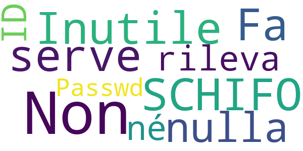

# COVID-related Android apps in Italy

Author: `Ivano Malavolta` (ivanomalavolta@gmail.com)

Created at: `2020/6/14`

Report generated by the [covid-apps-observer](http://github.com/covid-apps-observer) project, version 0.1

# Table of contents 

- [Background](#background)
    * [Data sources and analyses](#data-sources-and-analyses)
        * [App metadata](#app-metadata)
        * [Requested permissions](#requested-permissions)
        * [Mentioned servers](#mentioned_servers)
        * [Security analysis](#security_analysis)
        * [User ratings and reviews](#user-ratings-and-reviews)
    * [Disclaimer](#disclaimer)
- [SM_Covid19](#sm_covid19)
- [allertaLOM](#allertalom)
- [LAZIOdrCovid](#laziodrcovid)
- [Sicilia Si Cura](#sicilia-si-cura)
- [Covid-19](#covid-19)
- [WHO Info](#who-info)
- [OpenWHO: Knowledge for Health Emergencies](#openwho-knowledge-for-health-emergencies)
- [Immuni](#immuni)
- [Sardegna Sicura](#sardegna-sicura)

- [Credits](#credits)

# How to read this report

This report has been generated by the [covid-apps-observer](http://github.com/covid-apps-observer) project. The project automatically analyzes the apps by extracting information which is already publicly available either on the web or in the apps binary files. 

Our analysis covers the following apps:
| | |
|-------------------------|-------------------------| 
|  | SM_Covid19
|  | allertaLOM
|  | LAZIOdrCovid
|  | Sicilia Si Cura
|  | Covid-19
|  | WHO Info
|  | OpenWHO: Knowledge for Health Emergencies
|  | Immuni
|  | Sardegna Sicura

The details of our analysis are presented in the remainder of this report.

For independent verification, the raw data and the source code of the project is publicly available in its GitHub repository [http://github.com/covid-apps-observer](http://github.com/covid-apps-observer) and its source code has been thoroughly commented in order to provide all the details about how the information provided in this report has been extracted. 

Any feedback, questions, and improvements about the project are very welcome, feel free to create an issue or pull request directly in its GitHub repository: [http://github.com/covid-apps-observer](http://github.com/covid-apps-observer).

## Data sources and analyses

The analysis of each app is structured around five main dimensions: 
* App metadata  
* Requested permissions
* Mentioned servers
* Androwarn analysis
* User ratings and reviews

In the following we describe the data sources and analysis performed for each dimension.

### App metadata

App metadata includes an overview of the main information about the app (for example, its name, releases, privacy policy, etc.), contact information of the development team, and the various Android versions supported by the app. This information is extracted from two main data sources:
* _Google Play store_: we automatically mined the web page of the Google Play store showing the basic information about the app and we parsed it in order to extract information about the app and development team 
* _Android Manifest file_: in our analysis we decompiled the binary file of the app (it is similar to a Zip archive but it contains the code of the app instead of normal files) and we extracted information about the supported Android versions, as it has been listed by its development team.

The extracted app metadata feeds the _App overview_, _Development team_, and _Android support_ sections of this report.
We make use of the [google-play-scraper](https://github.com/JoMingyu/google-play-scraper) tool for extracting the raw data related to this dimension of the project.

### Requested permissions

The Android operating system has a permission model which allows users to grant access to potentially privacy-related information. Every Android app has to explictly declare the permissions it needs to properly function in the Android Manifest file.  

In this report we also show the protection level of each permission, which is a key information for understanding how the requested permissions related to the user's privacy. We carefully analyzed the [official Android documentation (v. 29)](https://developer.android.com/reference/android/Manifest.permission), and it resulted that a permission requested by an Android app can belong to the following protection levels:
* **Dangerous**: higher-risk permissions that would give a requesting app access to private user data or control over the device that can negatively impact the user. Because this type of permission introduces potential risk, the system usually does not automatically grant it to the requesting app. For example, any dangerous permissions requested by an app may be displayed to the user and require confirmation before proceeding.
* **Normal**: this is the default and most common level in Android; normal permissions are lower-risk and give access to isolated app-level features, with minimal risk to other apps, the system, or the user. 
* **Signature**: permissions granted only if the requesting app is signed with the same certificate as the app that declared the permission
* **Appop**: old permission level, a reminiscence of the App Ops tool that Google introduced in Android 4.3.
* **Development**: optional permissions which can be granted to development-oriented apps.
* **Privileged**: permissions who give higher power to mobile apps w.r.t. other apps, such as binding to incoming calls, interacting via bluetooth with other devices without user interaction, etc.
* **Preinstalled**: reserved only for preinstalled apps
* **Installer**: allow the holder to start the permission usage screen for an app
* **RetailDemo**: permissions related to devices used in demonstrations in shops.
* **Pre23**: permissions automatically granted to apps targeting devices running pre-6.0 Android.
* **Upcoming**: permissions which will be released in the next version of the Android platform. 
* **Deprecated**: permissions belonging to old releases of the Android platform, they should not be used by developers since they will not be supported in the near future.
* **Not for use by third-party applications**: permissions which can be requested only by apps developed by Google.
* **Undefined**: this protection level is not documented by Google.

The permissions dimension of this project is based on the [Androguard](https://github.com/androguard/androguard) static analysis tool.

### Mentioned servers

We decompiled each app in order to look for all possible mentions of remote URLs. The mentioned URLs can refer to remote servers the the app is using for either sending or receiving information, web addresses for directing the user to an information website, and so on. 

:warning: It is important to note that this analysis is not meant to be complete and it is very prone to obfuscation. The servers reported here are simply _mentioned_ somewhere in the code of the app and are meant to just give an indication about the "hooks" of the app towards external resources. For example, for an Android app it is normal to contact Google services in order to send/receive push notifications, or to contact the servers of analytics services for having real-time diagnostics about crashes of the app or bugs.

This part of the analysis is based on the [Androguard](https://github.com/androguard/androguard) static analysis tool for identfying the raw URLs mentioned in the app; then, the information about each mentioned server is collected by performing a _whois_ lookup on the first-level domain present in the URL.

### Security analysis

This dimension is based on the [Androwarn](https://github.com/maaaaz/androwarn) structural and data flow analysis of Android bytecode. Androwarn is developed by the University of Lyon/INSA (France) and it has been used in several academic studies. According to its documentation, Androwarn targets the following categories of potential security issues:
* **Telephony identifiers exfiltration**: IMEI, IMSI, MCC, MNC, LAC, CID, operator's name, etc.
* **Device settings exfiltration**: software version, usage statistics, system settings, logs, etc.
* **Geolocation information leakage**: GPS/WiFi geolocation, etc.
* **Connection interfaces information exfiltration**: WiFi credentials, Bluetooth MAC adress, etc.
* **Telephony services abuse**: premium SMS sending, phone call composition, etc.
* **Audio/video flow interception**: call recording, video capture, etc.
* **Remote connection establishment**: socket open call, Bluetooth pairing, APN settings edit, etc.
* **PIM data leakage**: contacts, calendar, SMS, mails, clipboard, etc.
* **External memory operations**: file access on SD card, etc.
* **PIM data modification**: add/delete contacts, calendar events, etc.
* **Arbitrary code execution**: native code using JNI, UNIX command, privilege escalation, etc.
* **Denial of Service**: event notification deactivation, file deletion, process killing, virtual keyboard disable, terminal shutdown/reboot, etc.

Note: We do not consider this data point in the current version of our analyzers since it is too verbose for our purposes.

:warning: It is important to note that Androwarn is a static analysis tool, and as such it performs a variety of heuristics and approximations in its analyses. Said that, the results shown in this report are meant to provide an indication of _potential_ security issues and should be by no means treated as complete and correct.   

### User ratings and reviews

For this dimension we turn again to the web interface of the Google Play store. Firstly, we automatically mine summary statistics about user ratings from the web page of the app under analysis; then, we automatically download the newest 1000 reviews of the app under analysis. For each level of rating (5 stars, 4 stars, , etc., 1 star) we show:
- a word cloud presenting the main terms used by end users in their reviews in the Google Play store
- the last 10 reviews provided by app users in the Google Play store. 

This purposefully simple analysis is meant to help both future users and the development team of the app in understanding what are the main positive and negative points of the app under analysis.

We make use of the [google-play-scraper](https://github.com/JoMingyu/google-play-scraper) tool for extracting the raw data related to this dimension of the project.

## Disclaimer 

This report has been produced independently of any parties and its only objective is to help anybody in better understanding how COVID-related apps work in practice (and compare to each other). The results of this report are limited to the specific version of the software used for running the analyses and on the various heuristics implemented in there. In other words, the results of the analyzers may differ depending on the time and modalities in which they are executed. We do not guarantee that the results of the analyses and the corresponding contents of this report are fully complete or correct. The analysis software is licensed under the [MIT License](https://github.com/iivanoo/covid-apps-observer/blob/master/LICENSE).

# SM_Covid19
App version ``3.9``

Analyzed with [covid-apps-observer](http://github.com/covid-apps-observer) project, version ``0.1``

## App overview
| | |
|-------------------------|-------------------------| 
| **Name**&nbsp;&nbsp;&nbsp;&nbsp;&nbsp;&nbsp;&nbsp;&nbsp;&nbsp;&nbsp;&nbsp;&nbsp;&nbsp;&nbsp;&nbsp;&nbsp;&nbsp;&nbsp;&nbsp;&nbsp;&nbsp;&nbsp;&nbsp;&nbsp;&nbsp;&nbsp;&nbsp;&nbsp;&nbsp;&nbsp;&nbsp;&nbsp;&nbsp;&nbsp;&nbsp;&nbsp;&nbsp;&nbsp;&nbsp;&nbsp;  | SM_Covid19 |
| **Unique identifier** | it.softmining.projects.covid19.savelifestyle |
| **Link to Google Play** | [https://play.google.com/store/apps/details?id=it.softmining.projects.covid19.savelifestyle](https://play.google.com/store/apps/details?id=it.softmining.projects.covid19.savelifestyle) |
| **Summary**  | Community di Contact Tracing volontario per la sfida al Covid19. |
| **Privacy policy** | [https://www.softmining.it/index.php/sm-covid19-app/](https://www.softmining.it/index.php/sm-covid19-app/) |
| **Latest version** | 3.9 |
| **Last update** | 2020-06-06 12:40:12 |
| **Recent changes** | Abbiamo aggiunto (in versione sperimentale) la funzione Anti assembramento configurabile dal menù &quot;Personalizza l&#39;app&quot;. L&#39;app vi avviserà se rileverà più di N (decidete voi quanti) contati ravvicinati (tra 60cm e 1.20m). Aiutateci a testare la funzione inviandoci eventuali problemi a smcovid19@softmining.it Nella prossima release aggiungeremo i grafici e la possibilità di analizzare analiticamente l&#39;indice dei contatti.  Abbiamo risolto alcuni problemi sulla generazione delle notifiche. |
| **Installs**  | 50.000+ |
| **Category** | Salute e fitness |
| **First release** | 12 apr 2020 |
| **Size**  | 4,9M |
| **Supported Android version**  | 5.0 e versioni successive |

### Description
> Sm-Covid-19 ti permette di tenere sotto controllo il tuo "Indice dei Contatti", ovvero una stima numerica con valori da 0 a 100 che cresce e decresce a seconda del numero (e del tipo) di contatti rilevati nelle ultime 24 ore. Il calcolo dell'indice avviene ogni ora.  Il valore "Indice dei Contatti" è una stima che può aiutarti a capire se durante la fase 2 stai avendo troppi contatti. 
 Questa App è stata sviluppata e viene costantemente aggiornata con l'obiettivo di valutare (attraverso la definizione di modelli statistici e matematici) il rischio di trasmissione (e il comportamento epidemico) del virus attraverso il monitoraggio:
 - del numero dei contatti
 - della durata dei contatti;
 - della distanza presente tra i contatti rilevati rispetto alla durata del contatto.
 Sm-Covid-19 è in grado di rilevare l'App Immuni in modo da aumentare la precisione dei modelli matematici.
 Sm-Covid-19 non acquisisce dati personali ne dati sanitari: Ti preghiamo di visualizzare il video introduttivo per avere maggiori dettagli sullo scopo e sul funzionamento di questa App. 
 Se desideri maggiori dettagli tecnici sul funzionamento di Sm-Covid-19 puoi visitare questo link: https://www.smcovid19.org/recover/
 Sm-Covid-19 non acquisisce dati sensibili dell’utente (ne ha bisogno di tali dati per funzionare).
 Il modulo di auto-segnalazione è stato rimosso in quanto la funzionalità non sarà gestita da Sm-Covid-19.
 Durante la fase 2, cercheremo di acquisire un gran numero di utenti attivi, per poter migliorare i modelli di stima del contagio: Al momento siamo una piccola community di 40.000 volontari, ma per poter eseguire calcoli statistici precisi ti chiediamo di aiutarci a diffondere l'App tra tutti i tuoi contatti, sopratutto quelli con i quali presumibilmente potresti entrare in contatto durante la fase 2.
 Ci teniamo a ricordarti che SOLO le autorità sanitarie possono indicare la positività di un soggetto. Poiché IMMUNI sarà l'app ufficiale di contact tracing Italiana, abbiamo rimosso il modello di calcolo dell'"Indice di Rischio". L'APP mostrerà solo un Indice di Contatto che aumenterà e diminuirà in base al numero di contatti efficaci rilevati. 
 I valori indicati in Sm-Covid-19 NON possono essere considerate diagnosi di positività o negatività al Covid-19: Lo scopo di questa APP è di generare modelli rappresentativi del contagio (modelli matematici) e statistiche accurate.
 L’utente non viene geo-localizzato, né viene reso riconoscibile, salvo nel caso in cui esso stesso decida di condividere di suo spontanea volontà i dati GPS attraverso il menù Impostazioni -> Abilita condivisione dati GPS.  
 I dati GPS verranno registrati SOLO quando verranno rilevati dei contatti. Se nessun utente viene rilevato nei dintorni, nessun dato viene acquisito. È possibile disabilitare in qualsiasi momento l'acquisizione dei dati GPS. 
 Le informazioni acquisite (solo numero, tipo di contatto, distanza e dati GPS se abilitati) saranno condivise con la comunità scientifica e sotto forma di open-data. I dati sono anonimi, tuttavia applichiamo tecniche di shuffle e cifratura degli ID random acquisiti prima di pubblicare open-data.
 Sm-Covid-19 è stata sviluppata e viene manutenuta senza fini economici né di acquisizione di dati sensibili. 
 Sm-Covid-19 non può essere considerata sostitutiva di una diagnosi medica.

### User interface
The developers of the app provide the following screenshots in the Google play store.
| | | |
|:-------------------------:|:-------------------------:|:-------------------------:|
 |   |   |   | 
 |   |  

## Development team
In the following we report the main information provided by the development team in the Google play store.

| | |
|-------------------------|-------------------------|
| **Developer**  | Softmining Srl |
| **Website**  | [https://www.smcovid19.org/](https://www.smcovid19.org/) |
| **Email** | smcovid19@softmining.it |
| **Physical address**  | [Via Tenente Corrado 22 - 83100 Avellino - Italia](https://www.google.com/maps/search/Via%20Tenente%20Corrado%2022%20-%2083100%20Avellino%20-%20Italia) (Google Maps) |
| **Other developed apps**  | [https://play.google.com/store/apps/developer?id=Softmining+Srl](https://play.google.com/store/apps/developer?id=Softmining+Srl) |

## Android support

| | |
|-------------------------|-------------------------|
| **Declared target Android version**  | Android10, version 10 (API level 29) |
| **Effective target Android version**  | Android10, version 10 (API level 29) |
| **Minimum supported Android version**  | Lollipop, version 5.0 (API level 21) |
| **Maximum target Android version**  | - |

The larger the difference between the minimum and maximum supported Android versions, the better. A larger difference means a wider audience. For example, old phones have a very low Android version, so a high minimum supported Android version means that the app cannot be used by users with old phones, thus leading to accessibility problems. 

## Requested permissions

In the following we report the complete list of the permissions requested by the app. 

| **Permission** | **Protection level** | **Description** | 
|-------------------------|-------------------------|-------------------------|
 **android.permission ACCESS_BACKGROUND_LOCATION** | :warning:**Dangerous** | Allows an app to access location in the background. 
 **android.permission ACCESS_COARSE_LOCATION** | :warning:**Dangerous** | Allows an app to access approximate location. 
 **android.permission ACCESS_FINE_LOCATION** | :warning:**Dangerous** | Allows an app to access precise location. 
 **android.permission ACCESS_NETWORK_STATE** | Normal | Allows applications to access information about networks. 
 **android.permission BLUETOOTH** | Normal | Allows applications to connect to paired bluetooth devices. 
 **android.permission BLUETOOTH_ADMIN** | Normal | Allows applications to discover and pair bluetooth devices. 
 **android.permission FOREGROUND_SERVICE** | Normal | Allows a regular application to use Service.startForeground. 
 **android.permission INTERNET** | Normal | Allows applications to open network sockets. 
 **android.permission READ_APP_BADGE** | - | - 
 **android.permission READ_EXTERNAL_STORAGE** | :warning:**Dangerous** | Allows an application to read from external storage. 
 **android.permission RECEIVE_BOOT_COMPLETED** | Normal | Allows an application to receive the Intent.ACTION_BOOT_COMPLETED that is broadcast after the system finishes booting. 
 **android.permission REQUEST_IGNORE_BATTERY_OPTIMIZATIONS** | Normal | Permission an application must hold in order to use Settings.ACTION_REQUEST_IGNORE_BATTERY_OPTIMIZATIONS. 
 **android.permission SYSTEM_ALERT_WINDOW** | Signature - preinstalled - appop - pre23 - development | Allows an app to create windows using the type WindowManager.LayoutParams.TYPE_APPLICATION_OVERLAY, shown on top of all other apps. 
 **android.permission USE_FULL_SCREEN_INTENT** | Normal | Required for apps targeting Build.VERSION_CODES.Q that want to use notification full screen intents. 
 **android.permission VIBRATE** | Normal | Allows access to the vibrator. 
 **android.permission WAKE_LOCK** | Normal | Allows using PowerManager WakeLocks to keep processor from sleeping or screen from dimming. 
 **android.permission WRITE_EXTERNAL_STORAGE** | :warning:**Dangerous** | Allows an application to write to external storage. 
 **com.anddoes.launcher.permission UPDATE_COUNT** | - | - 
 **com.google.android.c2dm.permission RECEIVE** | - | - 
 **com.google.android.finsky.permission BIND_GET_INSTALL_REFERRER_SERVICE** | - | - 
 **com.htc.launcher.permission READ_SETTINGS** | - | - 
 **com.htc.launcher.permission UPDATE_SHORTCUT** | - | - 
 **com.huawei.android.launcher.permission CHANGE_BADGE** | - | - 
 **com.huawei.android.launcher.permission READ_SETTINGS** | - | - 
 **com.huawei.android.launcher.permission WRITE_SETTINGS** | - | - 
 **com.huawei.permission.external_app_settings USE_COMPONENT** | - | - 
 **com.majeur.launcher.permission UPDATE_BADGE** | - | - 
 **com.oppo.launcher.permission READ_SETTINGS** | - | - 
 **com.oppo.launcher.permission WRITE_SETTINGS** | - | - 
 **com.sec.android.provider.badge.permission READ** | - | - 
 **com.sec.android.provider.badge.permission WRITE** | - | - 
 **com.sonyericsson.home.permission BROADCAST_BADGE** | - | - 
 **com.sonymobile.home.permission PROVIDER_INSERT_BADGE** | - | - 
 **it.softmining.projects.covid19.savelifestyle.permission C2D_MESSAGE** | - | - 
 **me.everything.badger.permission BADGE_COUNT_READ** | - | - 
 **me.everything.badger.permission BADGE_COUNT_WRITE** | - | - 
 **oppo.permission OPPO_COMPONENT_SAFE** | - | - 

## Mentioned servers

| **Server** | **Registrant** | **Registrant country** | **Creation date** | 
|-------------------------|-------------------------|-------------------------|-------------------------|
 | googlesyndication.com | Google LLC | :us: US | 2003-01-21 06:17:24 |
 | google.com | Google LLC | :us: US | 1997-09-15 04:00:00 |
 | app-measurement.com | Google LLC | :us: US | 2015-06-19 20:13:31 |
 | googleadservices.com | Google LLC | :us: US | 2003-06-19 16:34:53 |
 | onesignal.com | Domains By Proxy, LLC | :us: US | 2011-09-10 18:40:52 |
 | githubusercontent.com | GitHub, Inc. | :us: US | 2014-02-06 21:17:00 |
 | softmining.it | SOFTMINING S.R.L. | :it: IT | 2017-10-16 19:27:28 |
 | smcovid19.org | Data Protected | :canada: CA | 2020-03-31 21:30:24 |
 | governo.it | Presidenza del Consiglio dei Ministri | :it: IT | 2000-01-24 00:00:00 |
 | amazonaws.com | Amazon.com, Inc. | :us: US | 2005-08-18 02:10:45 |
 | crashlytics.com | Google LLC | :us: US | 2011-01-21 15:30:40 |

## Security analysis 

Below we report the main security warnings raised by our execution of the [Androwarn](https://github.com/maaaaz/androwarn) security analysis tool.

**Telephony identifiers leakage**
> - This application reads the numeric name (MCC+MNC) of current registered operator 
> - This application reads the operator name 

**Connection interfaces exfiltration**
> - This application reads details about the currently active data network 

**Telephony services abuse**
> - This application makes phone calls 

**Suspicious connection establishment**
> - This application opens a Socket and connects it to the remote address 'Ld/a/a/a/a;->a(Ljava/lang/String;)Ljava/lang/StringBuilder;' on the 'N/A' port  
> - This application opens a Socket and connects it to the remote address 'Ljava/net/Proxy;->type()Ljava/net/Proxy$Type;' on the 'N/A' port  
> - This application opens a Socket and connects it to the remote address 'hostname == null ' on the 'N/A' port  
> - This application opens a Socket and connects it to the remote address 'timeout' on the 'N/A' port  

**Code execution**
> - This application executes a UNIX command containing this argument: 'Ljava/lang/StringBuilder;->toString()Ljava/lang/String;' 

## User ratings and reviews

Below we provide information about how end users are reacting to the app in terms of ratings and reviews in the Google Play store.

### Ratings

The SM_Covid19 app has been installed by more than **50000** times. At this time, **614** rated the app and its average score is **3.95**. Below we show the distribution of the ratings across the usual star-based rating of Google Play

:star::star::star::star::star:: 313

:star::star::star::star:: 141

:star::star::star:: 55

:star::star:: 24

:star:: 79

### Reviews 

#### 5-star reviews

> Ok  :date: __2020-06-14 18:34:04__

> Molto buona  :date: __2020-06-13 00:50:56__

> Buona giornata 😎. Va bene. Funziona bene  :date: __2020-06-12 15:56:36__

> Se funziona sarebbe eccezionale  :date: __2020-06-11 18:10:06__

> Ho da poco installato l'app e devo dire che non è male per niente anzi ha una schermata davvero carina e semplice da usare.  :date: __2020-06-10 11:45:26__

> Spero che serva, ma serve anche per quelli che non hanno contratto il Covid 19, siccome da 1 al 15 agosto 2020 dovrei recarmi ad Porto San Maurizio in provincia di Imperia Liguria Italia Italie Italy. Oltre ad installare questa applicazione si dobbiamo fare i 3 tamponi e eseguire l'autocertificazione quella per l'uscita dal Piemonte ovvero dal capoluogo Torino TO alla Liguria, Porto San Maurizio, in provincia di Imperia IM, siccome dovremmo convivere insieme in un alloggio bilocale. Luisa  :date: __2020-06-08 14:22:11__

> Molto utile  :date: __2020-06-07 20:15:19__

> Ok  :date: __2020-06-07 15:58:14__

> Ottima app  :date: __2020-06-07 12:54:34__

> Oggi disinstallo l'app dopo 2 mesi di utilizzo perché ho installato ieri Immuni. Lo Stato d'altronde ha sviluppato internamente l'app ufficiale e ha deciso di non utilizzare la vostra. Non trovo utilità ad utilizzare la vostra app in quanto priva del rapporto ufficiale con le istituzioni. Ho contribuito con i miei dati al test di Sm_covid19 e mi auguro la softmining possa trovare vantaggio di questo e nel futuro sviluppare altre app utili. Ciao e buon lavoro  :date: __2020-06-07 12:35:51__

#### 4-star reviews

> Non sono riuscito a capire quando il n.aumenta cosa devo fare?  :date: __2020-06-12 16:01:33__

> Ancora presto  :date: __2020-06-11 18:49:30__

> Meglio di immuni, che non è nemmeno compatibile con il mio telefono, questa invece è molto semplice come app e molto più completa (ho scaricato l'app immuni con un altro telefono)  :date: __2020-06-08 08:24:29__

> Avendo scaricato e poi disinstallato subito Immuni, sembra che questa app sia di gran lunga migliore. Ma vedremo, io lavorando in strada, a Milano, tra la gente, per acquedotto, sono più a rischio di tanti altri. Mi frega poco della privacy,anche perché siamo già ultracontrollati anche senza app,se mi sarà utile la tengo altrimenti disinstallo. PERCHÉ PER APPLE NN C'È APP? . 👍  :date: __2020-06-07 20:14:41__

> Funzione antiassembramento non molto precisa. App molto valida.  :date: __2020-06-07 08:14:30__

> Ma é l app originale del Ministero?  :date: __2020-06-03 22:26:35__

> Ottima idea  :date: __2020-06-03 20:57:54__

> Non capisco l'utilità della stellina accanto alla regione, a che cosa serve se non ti mette la regione in alto e non ne puoi mettere più di due? Comunque applicazione valida, quando risolverete metterò 5 stelle.  :date: __2020-06-03 20:48:38__

> Ok  :date: __2020-06-03 20:43:20__

> buono  :date: __2020-06-03 20:41:13__

#### 3-star reviews

> e una beta comunque  :date: __2020-06-04 11:07:17__

> Appena istallata nessun problema .  :date: __2020-06-04 07:07:56__

> Do 3 stelle, è da renderlo più chiaro... Quando accendo l app mi dice tieni sotto controllo il tuo indice dei contatti, e poi ti dice"tutto bene" non capisco questa cosa, se c'è un positivo in zona? Io posso esserlo o no? Un po di domande mi sono posto  :date: __2020-06-03 22:21:45__

> Sono un Tsrm sarebbe bello inserire anche profili sanitari non citati dai media...  :date: __2020-06-01 20:22:02__

> Affidabile al50%  :date: __2020-05-22 11:17:59__

> Come faccio a mettere come lingua l'italiano? Nelle impostazioni c'è scritto italiano ma invece nella app compare l'arabo  :date: __2020-05-20 10:31:01__

> è il primo maggio....dove è la versione senza beta test, cioè operativa?! senza la possibilità di segnalarsi che senso ha l app?  :date: __2020-05-01 14:50:45__

> Mi sento più protetta  :date: __2020-04-30 19:36:47__

> Ho dovuto disinstallarla perché mi consumava moltissimo la batteria. Attendo che sia migliorato questo aspetto per installarla di nuovo. Penso possa essere utile se diffusa capillarmente...  :date: __2020-04-25 20:18:11__

> Non posso dare un voto perchè la ho scaricata da qualche ora e fatto una gran fatica ad avvisarla. Ancora adesso continua ogni pochi minuti a chiedere autorizzazione ad avvio automatico ed attività in background. Concesse più volte. In particolare per le attività in background non è capace di raggiungere automaticamente le impostazioni. Però sembra sia tutto in funzione boh .. In ogni caso sto utilizzando uno Xiaomi MI9SE. Saluti  :date: __2020-04-25 17:06:39__

#### 2-star reviews

> Mi sembra una stronzata come app come fa a sapere se uno è veramente positivo o negativo senza tampone? Poi se l tocca un altro il cell cambia o no? Sec me na cavolata l altra volta m diceva che ero poco rischioso ora mi dice tutto bene mha  :date: __2020-06-08 13:48:07__

> Non è chiaro il significato dell'indice (e le varie soglie), né sono indicate le procedure da fare in caso indicasse una situazione di potenziale pericolo. Inoltre è molto fastidioso il continuo vibrare delle notifiche push che arrivano più o meno ogni ora, inclusa la notte. Vibrazione che a quanto pare è impossibile disabilitare.  :date: __2020-06-08 11:13:44__

> Non sicura  :date: __2020-06-06 19:22:21__

> la volevo scaricare ma non mi fa andare avanti,boh...  :date: __2020-06-01 20:40:14__

> Ti divora la batteria , Non posso tenere un app che in tre ore sei 13 % energia, scusate anche se togli il Bluetooth e sempre in eseguzione , non voglio dire che non è buona come app ma rimani senza batteria in poche ore se il cellulare a qualche anno la batteria ti saluta  :date: __2020-06-01 17:41:33__

> Durante l'installazione viene chiesto di abilitare 3 funzioni (bluetooth, avvio automatico etc.) ma appena ne seleziono una, passa alla schermata successiva e non da la possibilità di abilitare le altre 2. Inoltre, se entro nelle Impostazioni e spunto "Permetti l'uso del GPS", quando esco e rientro lo trovo ancora non spuntato.  :date: __2020-06-01 10:55:24__

> Per ora due stelle. Piuttosto invadente, è una notifica continua! Se si chiude arriva subito una notifica e si riapre. Non può lavorare in background come tutte le altre senza sostituirsi alla schermata principale? E usare solo la geolocalizzazione senza dover tenere acceso anche il bluetooth, sia per il risparmio energetico della batteria sia per evitare inavvertitamente di concedere l'accesso al telefono ad un dispositivo sconosciuto? Aggiornamento: Ok per le notifiche, non ci sono più ma KO per la whitelist perché non può e non deve prosciugare la batteria.  :date: __2020-05-21 09:34:47__

> Disinstalla quasi subito, mi appare in modo quasi continuo la notifica da parte di questa app di un consumo eccessivo della batteria.  :date: __2020-05-16 16:25:43__

> Invadente e vengono segnalati bug da antivirus disintallata  :date: __2020-05-05 11:23:25__

> Consuma troppa batteria. Sarebbe interessante avere qualche informazione in più da consultare, se si entra in contatto con qualcuno, statistiche di utilizzo degli altri utenti etc... Ho uno Xiao Mi Note 10  :date: __2020-05-04 15:13:22__

#### 1-star reviews

> Non buona come app.  :date: __2020-06-10 19:39:46__

> Non la scaricate e un virus  :date: __2020-06-09 09:17:18__

> Non è possibile una notifica ogni 30 secondi  :date: __2020-06-08 16:29:53__

> Non so neanche se è utile!  :date: __2020-06-08 13:10:50__

> Mi spiace ma l'ho disitallata. L'ho avuta per qualche giorno e ieri sono stata a casa da sola dalle 13:00 fino a questa mattina DA SOLA e mi ha segnalato se non ricordo male un incremento di 3.0 quando invece ANDANDO a fare commissioni mi segnalava 0.93. Non l'ho trovata attendibile. Mi spiace.  :date: __2020-06-07 09:22:29__

> - (1). Come per le versioni beta precedenti, permane la richiesta di permessi non necessari, quali accesso a fotocamera e NFC. Peraltro con autorizzazione NFC, questo viene "spammato abbestia"... \*\*EDIT : NFC spamming Fixed in build 2.5 #13 - Permessi camera e NFC ancora presenti causa mantenimento codice barcode scanner journeyapps - EDIT2 : permesso NFC rimosso in build 3.1 #16 - EDIT3 : rimossi (finalmente) codice Journeyapps barcode scanner & permesso fotocamera in build 3.2 #18. In tale build sono stati però aggiunti nuovi permessi lettura&scrittura External Storage...\*\* . - (2). Presenti ancora problemi di riattivazione indesiderata in foreground con situazioni successive di crash / app, che non risponde correttamente/prontamente, tentando di rimetterla in background. . \*\*EDIT : Partially fixed in build 2.5 #13 = cambiata gestione in background & OK supporto notifica persistente / ancora sporadiche riattivazioni indesiderate in foreground - EDIT2 : fixed in build 3.1 #16\*\* . - (3). Errata gestione di richiesta opt-in per l'utilizzo dei servizi di localizzazione, dato che non si attiva quando l'utente effettivamente flagga/autorizza geolocalizzazione e GPS, ma anche per il solo BT peer contact-tracing \*\*EDIT2 : cambiata gestione trasmissione coordinate GPS ad API OpenSignal ed Istanza Firebase in build 3.1 #16\*\*. . - (4). Ci sono precise linee guida - a seguito dell'emergenza - che regolano la pubblicazione sul Play Store di app a tema COVID, che prevedono autorizzazione ufficiale esplicita da parte di Autorità Governative e/o Enti operanti in ambito sanitario. Non si ravvisano esplicitamente tali elementi necessari in relazione alle info di pubblicazione per quest'applicazione. . - Per tali motivi si è proceduto ad inoltrare apposito report per app inappropriata al supporto sviluppatori Google Play, onde effettuare le verifiche preposte. - \*\*EDIT : Inoltrata segnalazione 15/04 a MID (Ministero per l'Innovazione tecnologica e la Digitalizzazione), onde consentire le relative verifiche, anche a seguito delle ufficializzazioni 16/04 in merito all'app nazionale di contact-tracing\*\* - \*\*EDIT-2 : il rilevamento di Immuni, qualora installata & effettivamente attiva, introdotto nella build 3.8 #24 funziona cosmeticamente (ved. cambio riquadro nella UI), ma non introduce nuove reali funzionalità per l'utente & comporta un peggioramento del risk-score dell'app. \*\*EDIT-3 : Tutte le app BT proximity tracing con protezioni per esecuzione in foreground e background evidenziano un risk-score di base superiore. Nel caso specifico di SM_COVID19 risulta più alto rispetto alla media di altre app BT proximity-tracing analizzate in ambito EEA/Single-Market, a causa della combinazione di extra-perms + tecniche di offuscamento del codice (che si applica al 70% dei metodi richiamati dall'app) & evasion/antidebugging + impostazioni listener/receiver (a partire da build 3.4 #20 n.d.r.). In merito a ultima reply dev, si ringrazia per la disponibilità. Visto che tali non sono comunque info riservate / soggette a NDA, riterrei opportuna anche la loro pubblicazione da parte vostra in scheda app e/o sito web, in analogia a quanto fatto per le altre app autorizzate in pannello nazionale covid & associate a publisher privati / non-istituzionali.  :date: __2020-06-05 15:01:14__

> Invadente. Vuole accedere alle mie app personali per funzionare sconsigliato.  :date: __2020-06-05 14:35:10__

> Nn riesco a comilare sembra bloccata  :date: __2020-06-04 13:13:53__

> Inutile  :date: __2020-06-04 12:30:10__

> Non è quella ufficiale del Governo!!  :date: __2020-06-04 07:07:20__

# allertaLOM
App version ``1.7.0``

Analyzed with [covid-apps-observer](http://github.com/covid-apps-observer) project, version ``0.1``

## App overview
| | |
|-------------------------|-------------------------| 
| **Name**&nbsp;&nbsp;&nbsp;&nbsp;&nbsp;&nbsp;&nbsp;&nbsp;&nbsp;&nbsp;&nbsp;&nbsp;&nbsp;&nbsp;&nbsp;&nbsp;&nbsp;&nbsp;&nbsp;&nbsp;&nbsp;&nbsp;&nbsp;&nbsp;&nbsp;&nbsp;&nbsp;&nbsp;&nbsp;&nbsp;&nbsp;&nbsp;&nbsp;&nbsp;&nbsp;&nbsp;&nbsp;&nbsp;&nbsp;&nbsp;  | allertaLOM |
| **Unique identifier** | it.lispa.sire.app.mobile.allertalom |
| **Link to Google Play** | [https://play.google.com/store/apps/details?id=it.lispa.sire.app.mobile.allertalom](https://play.google.com/store/apps/details?id=it.lispa.sire.app.mobile.allertalom) |
| **Summary**  | L’app della Protezione Civile di Regione Lombardia che allerta in tempo reale |
| **Privacy policy** | [http://www.allertalom.regione.lombardia.it/privacyapp](http://www.allertalom.regione.lombardia.it/privacyapp) |
| **Latest version** | 1.7.0 |
| **Last update** | 2020-06-03 16:56:13 |
| **Recent changes** | Grazie di essere un utente allertaLOM.  Aggiorniamo regolarmente la nostra app per risolvere bug e fornire informazioni utili all&#39;utenza. |
| **Installs**  | 500.000+ |
| **Category** | Meteo |
| **First release** | 11 dic 2019 |
| **Size**  | 9,5M |
| **Supported Android version**  | 5.0 e versioni successive |

### Description
> allertaLOM è l’App di Regione Lombardia che permette di ricevere le allerte di Protezione Civile emesse dal Centro Funzionale Monitoraggio Rischi naturali di Regione Lombardia, in previsione di eventi naturali con possibili danni sul territorio.
 allertaLOM, in occasione dell’emergenza Coronavirus in Lombardia, si è evoluta in uno strumento di partecipazione attiva della cittadinanza al monitoraggio della diffusione del virus e in un canale di informazioni aggiornate sulle disposizioni regionali in materia, attraverso due nuove funzionalità:
 •	CercaCovid – la partecipazione al sondaggio CercaCovid permette a Regione Lombardia di quantificare il livello di diffusione del contagio e la distribuzione territoriale della positività, sulla base dei sintomi segnalati dagli utenti. I dati raccolti servono per analisi statistiche ed epidemiologiche, fondamentali per aiutare le autorità sanitarie a definire modelli e strategie di contrasto al Coronavirus. Il questionario è volontario, completamente anonimo, non prevede alcuna geolocalizzazione e non sostituisce una valutazione medica delle proprie condizioni. Partecipare è importante, anche in assenza di sintomi: più dati si ricevono, più il quadro della situazione è preciso. 
 •	Notifiche sull’emergenza Coronavirus in Lombardia - sono state attivate notifiche push con il link alla pagina del portale istituzionale che contiene gli aggiornamenti sul tema. Le notifiche possono essere disattivate dall'utente nell'apposita sezione. 
 Scarica l’App per:
 •	partecipare al monitoraggio attivo della diffusione del Coronavirus;
 •	ricevere informazioni aggiornate sulle azioni intraprese da Regione Lombardia per l’emergenza Coronavirus 
 •	personalizzare la ricezione delle notifiche sulle ultime disposizioni regionali riguardanti l’emergenza Coronavirus
 •	restare sempre aggiornato sulle allerte di Protezione Civile in Lombardia;
 •	monitorare la situazione di allerta sui Comuni preferiti oppure su tutta la regione;
 •	seguire l’evoluzione su mappa dei li-velli di allerta nell’arco di 36 ore;
 •	personalizzare la ricezione delle notifiche su tutti i rischi naturali oppure sui singoli rischi;
 •	ricevere notifiche all’emissione di allerte nei Comuni preferiti sui rischi prescelti;
 •	scaricare e consultare i documenti di allerta
 Come funziona l’allertamento di Protezione civile in Regione Lombardia
 •	Le allerte riguardano i rischi naturali prevedibili (idrogeologico, idraulico, temporali forti, vento forte, neve, valanghe e incendi boschivi) e presentano livelli crescenti di criticità (codice verde, giallo, arancione, rosso) a seconda della gravità ed estensione dei fenomeni. I documenti di allerta sono destinati al sistema locale di Protezione Civile e forniscono indicazioni per attivare le misure di contrasto previste nei Piani Comunali di Protezione Civile. Per i cittadini, le allerte sono uno strumento per sapere quando adottare le misure di auto-protezione, seguendo le indicazioni dell’Autorità locale di Protezione Civile. Per maggiori informazioni, consultare la pagina sulle allerte sul Portale di Regione Lombardia.

### User interface
The developers of the app provide the following screenshots in the Google play store.
| | | |
|:-------------------------:|:-------------------------:|:-------------------------:|
 |   |   |   | 
 |   |   |   | 
 |   |   |   | 
 |   |   |   | 
 |   |   |   | 
 |   |   |   | 
 |   |   |   | 

## Development team
In the following we report the main information provided by the development team in the Google play store.

| | |
|-------------------------|-------------------------|
| **Developer**  | Regione Lombardia |
| **Website**  | [http://www.allertalom.regione.lombardia.it](http://www.allertalom.regione.lombardia.it) |
| **Email** | info.allertalom@ariaspa.it |
| **Physical address**  | [Piazza Città di Lombardia 1 - 20124 Milano (Italia)](https://www.google.com/maps/search/Piazza%20Città%20di%20Lombardia%201%20-%2020124%20Milano%20(Italia)) (Google Maps) |
| **Other developed apps**  | [https://play.google.com/store/apps/developer?id=Regione+Lombardia](https://play.google.com/store/apps/developer?id=Regione+Lombardia) |

## Android support

| | |
|-------------------------|-------------------------|
| **Declared target Android version**  | Pie, version 9 (API level 28) |
| **Effective target Android version**  | Pie, version 9 (API level 28) |
| **Minimum supported Android version**  | Lollipop, version 5.0 (API level 21) |
| **Maximum target Android version**  | - |

The larger the difference between the minimum and maximum supported Android versions, the better. A larger difference means a wider audience. For example, old phones have a very low Android version, so a high minimum supported Android version means that the app cannot be used by users with old phones, thus leading to accessibility problems. 

## Requested permissions

In the following we report the complete list of the permissions requested by the app. 

| **Permission** | **Protection level** | **Description** | 
|-------------------------|-------------------------|-------------------------|
 **android.permission ACCESS_NETWORK_STATE** | Normal | Allows applications to access information about networks. 
 **android.permission CALL_PHONE** | :warning:**Dangerous** | Allows an application to initiate a phone call without going through the Dialer user interface for the user to confirm the call. 
 **android.permission GET_ACCOUNTS** | :warning:**Dangerous** | Allows access to the list of accounts in the Accounts Service. 
 **android.permission INTERNET** | Normal | Allows applications to open network sockets. 
 **android.permission READ_EXTERNAL_STORAGE** | :warning:**Dangerous** | Allows an application to read from external storage. 
 **android.permission WAKE_LOCK** | Normal | Allows using PowerManager WakeLocks to keep processor from sleeping or screen from dimming. 
 **android.permission WRITE_EXTERNAL_STORAGE** | :warning:**Dangerous** | Allows an application to write to external storage. 
 **com.google.android.c2dm.permission RECEIVE** | - | - 
 **it.lispa.sire.app.mobile.allertalom.permission C2D_MESSAGE** | - | - 

## Mentioned servers

| **Server** | **Registrant** | **Registrant country** | **Creation date** | 
|-------------------------|-------------------------|-------------------------|-------------------------|
 | googlesyndication.com | Google LLC | :us: US | 2003-01-21 06:17:24 |
 | google.com | Google LLC | :us: US | 1997-09-15 04:00:00 |
 | app-measurement.com | Google LLC | :us: US | 2015-06-19 20:13:31 |
 | gstatic.com | Google LLC | :us: US | 2008-02-11 15:31:25 |
 | whatsapp.com | Whatsapp Inc. | :us: US | 2008-09-04 12:39:12 |

## Security analysis 

Below we report the main security warnings raised by our execution of the [Androwarn](https://github.com/maaaaz/androwarn) security analysis tool.

**Telephony identifiers leakage**
> - This application reads the device phone type value 

**Connection interfaces exfiltration**
> - This application reads details about the currently active data network 
> - This application tries to find out if the currently active data network is metered 

**Telephony services abuse**
> - This application makes phone calls 

**Suspicious connection establishment**
> - This application opens a Socket and connects it to the remote address '' on the 'N/A' port  
> - This application opens a Socket and connects it to the remote address 'Ljava/lang/StringBuilder;->toString()Ljava/lang/String;' on the ': connect, resolve' port  
> - This application opens a Socket and connects it to the remote address 'Ljava/lang/StringBuilder;->toString()Ljava/lang/String;' on the 'N/A' port  
> - This application opens a Socket and connects it to the remote address 'Ljava/net/Proxy;->type()Ljava/net/Proxy$Type;' on the 'N/A' port  
> - This application opens a Socket and connects it to the remote address 'timeout' on the 'N/A' port  

**Code execution**
> - This application loads a native library: 'sqlc-native-driver' 
> - This application loads a native library: 'tool-checker' 
> - This application executes a UNIX command 
> - This application executes a UNIX command containing this argument: 'getprop' 
> - This application executes a UNIX command containing this argument: 'mount' 

## User ratings and reviews

Below we provide information about how end users are reacting to the app in terms of ratings and reviews in the Google Play store.

### Ratings

The allertaLOM app has been installed by more than **500000** times. At this time, **3568** rated the app and its average score is **3.3971832**. Below we show the distribution of the ratings across the usual star-based rating of Google Play

:star::star::star::star::star:: 1356

:star::star::star::star:: 643

:star::star::star:: 502

:star::star:: 190

:star:: 874

### Reviews 

#### 5-star reviews

> Eccezionale, con questo Coronavirus che ha fatto milioni di morti nel mondo  :date: __2020-06-14 13:17:04__

> Bv  :date: __2020-06-12 02:57:47__

> oggi la situazione almeno per le persone che mi stanno attorno sembra notevolmente migliorata Mia moglie ogni tanto ha il naso che gli cola ma subito dopo passa tutto..Io ogni tanto ho qualche fastidio alla laringe ma sono mesi che non peggiora anzi sembra migliorare I miei figli e i miei quattro nipoti non hanno alcun sintomo che possa collegarsi al Covid.19 Anche nel mio condominio non ci sono casi o sintomi da come posso accertarmi io!!!Quindi speriamo BENE  :date: __2020-06-11 17:48:14__

> Ottima  :date: __2020-06-11 11:09:16__

> Ottima APP  :date: __2020-06-09 20:28:32__

> Funziona bene anche x covid  :date: __2020-06-07 12:06:07__

> Io la trovo molto utile. Compilarlo non mi costa niente e spero che serva  :date: __2020-06-06 14:06:41__

> Ottima app..volevo aggiornare l età ma non è possibile!!!  :date: __2020-06-06 12:28:53__

> Ottima app  :date: __2020-06-05 14:24:54__

> Ok  :date: __2020-06-01 18:45:06__

#### 4-star reviews

> Convinto della bontà del sito  :date: __2020-06-12 22:46:58__

> Secondo me sarebbe ancora più utile se le domande non si riferissero solo ai precedenti 15 giorni allargando il periodo temporale a tutto il 2020 lasciando un campo libero per aggiungere delle note oppure chiedendo la data in cui sono iniziati e finiti determinati sintomi o contatti con persone e luoghi infetti. dopo l'aggiornamento giugno 2020 la finestra di pop-up finale dopo la compilazione non viene visualizzata correttamente  :date: __2020-06-07 18:54:52__

> Grazie per la risposta che non ha chiarito il problema. non sono risposte inesatte ma nemmeno precise. Es. Se la mia temperatura è 36,3 devo scegliere se segnare 36 o 36,5. Per questo ho detto che le risposte non sono precise. Lo stesso per le altre domande categoriche e sempre le stesse. So benissimo che se ho un malessere nuovo devo rivolgermi al mio medico. Leggendo anche altre recensioni le osservazioni sono più o meno le stesse e non si comprende quale utilità abbia questa ricerca.  :date: __2020-06-06 09:52:05__

> Facile da utilizzare. Molto migliorata con gli ultimi aggiornamenti. Unico difetto non è possibile aggiornare l'età. Inserita la prima volta non è possibile modificarla al compimento degli anni  :date: __2020-06-05 13:11:25__

> Edito: da 1 a 4. Grazie per la risposta e l'aggiornamento! Pesissima, se si lavora come pendolari fuori dalla Lombardia il censimento covid non può essere fatto  :date: __2020-05-31 14:09:20__

> L'ho installata per avere informazioni sul coronavirus nella mia zona e per partecipare al monitoraggio. Però non fornisce le informazioni che avrei voluto avere (casi e decessi per comune, allerte in caso di aumento dei casi anomalo nelle vicinanze). I problemi tecnici sono stati risolti.  :date: __2020-05-29 16:07:38__

> belke playlist e relax  :date: __2020-05-27 22:37:28__

> Veloce e facile da usare, una volta capito il meccanismo...  :date: __2020-05-27 17:21:10__

> Mi piace  :date: __2020-05-18 17:50:44__

> Ottima  :date: __2020-05-18 12:07:43__

#### 3-star reviews

> Scaricata ma non riesco a ricevere nessuna notifica di allerta inoltre ogni volta che si chiude l'applicazione spariscono dai preferiti i comuni precedentemente memorizzati. Le notifiche sono tutte attive, occorre tenere sempre acceso il GPS ? grazie  :date: __2020-06-11 15:25:30__

> L'app è ben fatta, solo a volte non arrivano le notifiche ma gli SMS. Inoltre, come si fa a cambiare i numeri associati all allerta meteo? Non vedo nessun menù a disposizione. Grazie  :date: __2020-06-09 07:43:19__

> Per la parte covid, con Android mi è impossibile compilarla nè per me, nè per la mia famiglia. Ritengo sia un baco. Ci ho riprovato e funziona.  :date: __2020-06-08 16:11:32__

> Lasciando perdere per un attimo l'aggiunta della sezione covid, poco integrata e sviluppata, per quanto riguarda le allerte sarebbe bene un maggiore sviluppo. Ad esempio vorrei poter vedere nelle notifiche il colore e la descrizione delle allerte emesse Se si potesse sarebbe bello addirittura poter selezionare una provincia preferita per le allerte  :date: __2020-06-08 13:26:21__

> Boh info perlopiu' inutili ed esageratamente allarmistiche  :date: __2020-06-06 07:58:56__

> App utile e promettente, ma con problemi. Non visualizzo la mappa delle allerte, solo la lista delle zone. Per sapere dove sono le allerte le devo aprire una ad una e farle scorrere. A mio avviso, notifiche e informazioni dovrebbero essere in-app non esterne.  :date: __2020-06-03 18:53:11__

> Le domande dovrebbero essere rivolte allo stato quotidiano dell'individuo, tenere memoria per 15 giorni un eventuale sintomo scoraggia la compilazione.  :date: __2020-06-02 20:34:09__

> Da qualche settimana che uso l app ...nel frattempo è cambiata la mia età anagrafica....Non si riesce a modificare!!!!  :date: __2020-05-28 15:50:44__

> Sarebbe importante implementare le domande ed inserire se è stato fatto il test sierologico. Grazie  :date: __2020-05-25 18:08:10__

> Per le allerte meteo mi serve poco. Per il covid mi aspettavo di vedere in cambio della collaborazione una mappa o qualcosa di utile. Ho apprezzato che adesso memorizza i dati che non cambiano, come CAP di casa e ufficio.  :date: __2020-05-24 16:57:53__

#### 2-star reviews

> Funziona una volta si e 5 no  :date: __2020-06-14 15:57:48__

> perche modificare in peggio la parte covid?? uso questa app da circa tre mesi direi esclusivamente per la parte covid la prima versione poteva essere migliorata e la seconda l'ha sicuramente molto più fruibile e rapida la compilazione l'ultimo aggiornamento di qualche giorno fa ha spostato la compilazione a sinistra. dato che la maggior parte delle persone é destrorsa e usa il pollice, cio ha reso l'applicazione non ergonomica. l'ho trovato stupido  :date: __2020-06-07 10:13:33__

> Sinceramente non capisco a cosa serve compilare il test...  :date: __2020-06-07 00:35:39__

> Ogni volta che arriva una notifica e fai per aprirla, non si carica mai, ma va in crash.  :date: __2020-06-03 18:40:59__

> Ho smesso di trasmettere i dati perché dopo un mese di utilizzo mi sfugge l'utilità di questa app specificatamente la parte riguardante allerta covid  :date: __2020-06-03 14:39:24__

> Non permette di visualizzare le notifiche di allerta rischio idrogeologico..  :date: __2020-06-02 12:26:06__

> Sarebbe interessante che i risultati dell'analisi dei questionari covid compilati fossero condivisi con la cittadinanza, magari in un'apposita sezione dell'app o sul sito di Regione Lombardia.  :date: __2020-05-28 10:27:40__

> Avrei voluto usare cercacovid in quanto lavoro in Lombardia, ma essendo residente in Piemonte è impossibile registrarsi  :date: __2020-05-21 15:59:47__

> purtroppo app inutilizzabile su dispositivi con root. Speriamo che venga permesso il suo utilizzo al più presto e a tutti  :date: __2020-05-17 22:20:32__

> App molto macchinosa, tanti bug e crash, notifiche abbastanza insulse e tracciamento delle infezioni pressoché inutile: è necessario compilare un questionario molto lungo e dispersivo (chiede costantemente età, ed altre generalità ad ogni utilizzo) da compilare ogni giorno per garantire l'efficienza  :date: __2020-05-17 17:41:08__

#### 1-star reviews

> Modifico ad oggi la mia recensione definita in precedenza terribile. Ora è diventata ULTRACTERRIBILE e ancora non funziona. Peccato che pure la mail che mi avete inserito per contattarvi se persiste il disguido non è nemmeno valida, e torna indietro come indirizzo sconosciuto. Certo che se le app per il Covid in Lombardia funzionano così stiamo a posto.  :date: __2020-06-11 13:03:21__

> Dopo aggiornamento non funziona più. Accetti tutto, ma quando arrivi a cerca covid non fa compilare dati per "me stesso"  :date: __2020-06-10 20:52:11__

> Questa app non ti da la possibilitá di raccontare quello che ti ha successo veramente...mio marito a marzo era con la febbre e di sei fratelli 4 con febbre, io con la congiuntivite e reffredore, mio dottore portato con la ambulanza (guarita grazie a Dio) mio vicino di casa morto con el covit, in mio paese di solo 3 mila anime a Marzo 22 persone sono morte, solo sentivamo le campane dei morti e ambulanze...si parla sempre delle ultime due settimane e quello di prima?  :date: __2020-06-10 18:34:16__

> Ogni volta che si avvia è come fosse la prima volta,richiede permessi e preferenze. Ma possibile che non si possa fare di meglio nel 2020 in Lombardia?Assurdo.  :date: __2020-06-10 14:07:35__

> E niente, ogni volta bisogna reinserire la gran parte dei dati. Tenerli memorizzati e modificare solo quelli che eventualmente cambiano è così complicato? Disinstallata, molto meglio la professionalità di Immuni.  :date: __2020-06-09 21:16:56__

> Si blocca sempre. Pessima.  :date: __2020-06-07 14:31:56__

> Ogni volta bisogna accettare e inserire da capo età e sesso. Ora non entra più col mio profilo. Ricevi le notifiche dell'allerta ma non le posso leggere. Disinstallata.  :date: __2020-06-07 13:51:06__

> 06.06.20 pessimo aggiornamento. Mi obbliga a compilare la parte del covid, ok peccato che non da possibilità di proseguire compilando il questionario solo per me stesso. Inoltre mai riuscito a salvare gli avvisi che mi interessano. Un consiglio sviluppate app più semplici, sono un addetto ai lavori dovrebbe esser di aiuto invece fa dannare ad ogni accesso.  :date: __2020-06-06 17:52:51__

> Un disastro ad ogni avvio richiede la compilazione del questionario covid  :date: __2020-06-06 13:39:13__

> La peggior app in circolazione! Si blocca sempre, è incomprensibile ma soprattutto inutile. Vorrei dare meno di una stella ma non posso  :date: __2020-06-05 21:16:48__

# LAZIOdrCovid
App version ``1.0.15``

Analyzed with [covid-apps-observer](http://github.com/covid-apps-observer) project, version ``0.1``

## App overview
| | |
|-------------------------|-------------------------| 
| **Name**&nbsp;&nbsp;&nbsp;&nbsp;&nbsp;&nbsp;&nbsp;&nbsp;&nbsp;&nbsp;&nbsp;&nbsp;&nbsp;&nbsp;&nbsp;&nbsp;&nbsp;&nbsp;&nbsp;&nbsp;&nbsp;&nbsp;&nbsp;&nbsp;&nbsp;&nbsp;&nbsp;&nbsp;&nbsp;&nbsp;&nbsp;&nbsp;&nbsp;&nbsp;&nbsp;&nbsp;&nbsp;&nbsp;&nbsp;&nbsp;  | LAZIOdrCovid |
| **Unique identifier** | com.intellicare.covid |
| **Link to Google Play** | [https://play.google.com/store/apps/details?id=com.intellicare.covid](https://play.google.com/store/apps/details?id=com.intellicare.covid) |
| **Summary**  | Piattaforma di telesorveglianza sanitaria dei pazienti con rischio COVID-19. |
| **Privacy policy** | [https://www.salutelazio.it/documents/10182/59078875/PoliticaPrivacy+LazioDoctor.pdf/2707a744-fe9d-92c9-abb8-c2e749ce82a1](https://www.salutelazio.it/documents/10182/59078875/PoliticaPrivacy+LazioDoctor.pdf/2707a744-fe9d-92c9-abb8-c2e749ce82a1) |
| **Latest version** | 1.0.15 |
| **Last update** | 2020-05-09 13:15:10 |
| **Recent changes** | Aggiorniamo l&#39;app regolarmente per renderla sempre migliore. Scarica la versione più recente per avere tutte le funzioni, i miglioramenti delle prestazioni e la risoluzione di problemi tecnici disponibili. |
| **Installs**  | 50.000+ |
| **Category** | Medicina |
| **First release** | 16 mar 2020 |
| **Size**  | 33M |
| **Supported Android version**  | 6.0 e versioni successive |

### Description
> La Regione Lazio offre la piattaforma Lazio Doctor per consultare informazioni utili legati all’emergenza COVID-19 e per connettere i pazienti con operatori sanitari e numero verde 800118800. Attraverso l’applicazione mobile scaricata sul telefono è possibile entrare in contatto con il proprio medico di base in modalità virtuale, ovunque, inviando in qualsiasi momento, le richieste di cui si ha bisogno. L’applicazione prevede comunicazioni testo-audio bidirezionali sicure tramite smartphone tra il cittadino ed il proprio medico. La videochiamata viene attivata, se necessario, dal medico per approfondire il quadro clinico del paziente.
 La Regione Lazio ha voluto rendere disponibile, ai pro¬pri cittadini, una corsia veloce ed affidabile per la fruizione dei servizi sanitari efficace soprattutto nei momenti di emergenza e in sicurezza. L’applicazione è scaricabile gratuitamente su App Store (iPhone) e Play Store (telefoni Android) su smar¬tphone. La modalità di accesso è immediata. Basta poi seguire i semplici passaggi per accedere ai servizi disponibili.

### User interface
The developers of the app provide the following screenshots in the Google play store.
| | | |
|:-------------------------:|:-------------------------:|:-------------------------:|
 |   |   |   | 
 |   |   |   | 

## Development team
In the following we report the main information provided by the development team in the Google play store.

| | |
|-------------------------|-------------------------|
| **Developer**  | LAZIOcrea S.p.A. |
| **Website**  | - |
| **Email** | mobile@laziocrea.it |
| **Physical address**  | - |
| **Other developed apps**  | [https://play.google.com/store/apps/developer?id=LAZIOcrea+S.p.A.](https://play.google.com/store/apps/developer?id=LAZIOcrea+S.p.A.) |

## Android support

| | |
|-------------------------|-------------------------|
| **Declared target Android version**  | Android10, version 10 (API level 29) |
| **Effective target Android version**  | Android10, version 10 (API level 29) |
| **Minimum supported Android version**  | Marshmallow, version 6.0 (API level 23) |
| **Maximum target Android version**  | - |

The larger the difference between the minimum and maximum supported Android versions, the better. A larger difference means a wider audience. For example, old phones have a very low Android version, so a high minimum supported Android version means that the app cannot be used by users with old phones, thus leading to accessibility problems. 

## Requested permissions

In the following we report the complete list of the permissions requested by the app. 

| **Permission** | **Protection level** | **Description** | 
|-------------------------|-------------------------|-------------------------|
 **android.permission ACCESS_NETWORK_STATE** | Normal | Allows applications to access information about networks. 
 **android.permission CAMERA** | :warning:**Dangerous** | Required to be able to access the camera device. 
 **android.permission FLASHLIGHT** | - | - 
 **android.permission INTERNET** | Normal | Allows applications to open network sockets. 
 **android.permission MODIFY_AUDIO_SETTINGS** | Normal | Allows an application to modify global audio settings. 
 **android.permission READ_EXTERNAL_STORAGE** | :warning:**Dangerous** | Allows an application to read from external storage. 
 **android.permission RECEIVE_BOOT_COMPLETED** | Normal | Allows an application to receive the Intent.ACTION_BOOT_COMPLETED that is broadcast after the system finishes booting. 
 **android.permission RECORD_AUDIO** | :warning:**Dangerous** | Allows an application to record audio. 
 **android.permission USE_FULL_SCREEN_INTENT** | Normal | Required for apps targeting Build.VERSION_CODES.Q that want to use notification full screen intents. 
 **android.permission VIBRATE** | Normal | Allows access to the vibrator. 
 **android.permission WAKE_LOCK** | Normal | Allows using PowerManager WakeLocks to keep processor from sleeping or screen from dimming. 
 **android.permission WRITE_EXTERNAL_STORAGE** | :warning:**Dangerous** | Allows an application to write to external storage. 
 **android.webkit PermissionRequest** | - | - 
 **com.google.android.c2dm.permission RECEIVE** | - | - 
 **com.google.android.finsky.permission BIND_GET_INSTALL_REFERRER_SERVICE** | - | - 

## Mentioned servers

| **Server** | **Registrant** | **Registrant country** | **Creation date** | 
|-------------------------|-------------------------|-------------------------|-------------------------|
 | googlesyndication.com | Google LLC | :us: US | 2003-01-21 06:17:24 |
 | google.com | Google LLC | :us: US | 1997-09-15 04:00:00 |
 | app-measurement.com | Google LLC | :us: US | 2015-06-19 20:13:31 |
 | googleadservices.com | Google LLC | :us: US | 2003-06-19 16:34:53 |
 | color.org | International Color Consortium | :us: US | 1995-12-12 05:00:00 |
 | regione.lazio.it | Regione Lazio | :it: IT | 1996-12-17 00:00:00 |

## Security analysis 

Below we report the main security warnings raised by our execution of the [Androwarn](https://github.com/maaaaz/androwarn) security analysis tool.

**Connection interfaces exfiltration**
> - This application reads details about the currently active data network 
> - This application tries to find out if the currently active data network is metered 

**Telephony services abuse**
> - This application makes phone calls 

**Suspicious connection establishment**
> - This application opens a Socket and connects it to the remote address 'Lc/a/a/a/a;->a(Ljava/lang/String;)Ljava/lang/StringBuilder;' on the 'N/A' port  
> - This application opens a Socket and connects it to the remote address 'Ljava/net/Proxy;->type()Ljava/net/Proxy$Type;' on the 'N/A' port  
> - This application opens a Socket and connects it to the remote address 'hostname == null ' on the 'N/A' port  
> - This application opens a Socket and connects it to the remote address 'timeout' on the 'N/A' port  

**Code execution**
> - This application loads a native library: 'jingle_peerconnection_so' 

## User ratings and reviews

Below we provide information about how end users are reacting to the app in terms of ratings and reviews in the Google Play store.

### Ratings

The LAZIOdrCovid app has been installed by more than **50000** times. At this time, **584** rated the app and its average score is **3.19**. Below we show the distribution of the ratings across the usual star-based rating of Google Play

:star::star::star::star::star:: 233

:star::star::star::star:: 58

:star::star::star:: 58

:star::star:: 52

:star:: 181

### Reviews 

#### 5-star reviews

> Ottimo  :date: __2020-05-11 12:02:38__

> Dopo la segnalazione hanno aggionato l'app e ora funziona  :date: __2020-05-02 10:25:12__

> L'unica cosa che contesto nuovamente (lo feci già all'inizio ad un operatore) è che molte risposte non possono essere complete ed esplicitative perché il questionario non ti dà la possibilità di ampliare le risposte in maniera adeguata. Il SI e il NO non credo siano sufficienti a capire le singole situazioni.  :date: __2020-04-25 10:35:51__

> Non ho più il sms che mi avete mandato  :date: __2020-04-17 19:05:50__

> Perché non mi fa installare questa applicazione anche sul mio tablet e non accede e non mi fa registrare?Grazie Attendo una risposta gradita  :date: __2020-04-17 01:18:30__

> Ottima  :date: __2020-04-15 14:34:24__

> Dopo aver fatto il backup dello smartphone ed averlo resettato e quindi ricaricato il backup, una volta reinstallata l'applicazione, questa ora funziona benissimo.  :date: __2020-04-15 13:47:11__

> Messaggio arrivato.. Vediamo la funzionalità  :date: __2020-04-14 11:30:20__

> Utilissima applicazione  :date: __2020-04-14 10:55:52__

> Non riesco ad inserire i parametri della frequenza cardiaca Ottima app grazie  :date: __2020-04-14 09:06:46__

#### 4-star reviews

> Salve, vorrei farvi notare che quando si compila l'autovalutazione, alla domanda: hai frequentato nelle ultime 2 settimane strutture sanitarie ? Io rispondo NO e al termine dei quesiti andando ad aprire il documento word con le mie risposte risulta SI per gli ospedali anche se la mia risposta, come già ho detto, sia stata No! Ho provato 2 volte per sicurezza, ma il risultato è lo stesso.  :date: __2020-05-28 05:22:18__

> Funziona, per quelle che sono le sue funzioni base. Sarebbe il caso che fosse collegata con la propria cartella che si trova online accessibile con CNS in modo che possano essere sincronizzati i parametri.  :date: __2020-05-08 18:46:04__

> Un buon progetto e decisamente un buon inizio, spero che per il futuro non si abbandonerà questo progetto ma che si possa ampliare per utilizzarlo aggiornando funzionalità.  :date: __2020-04-14 12:22:09__

> Si potrebbe integrare la movimentazione per eventuale sorveglianza per la fase due  :date: __2020-04-14 11:24:04__

> Ottima  :date: __2020-04-13 13:24:49__

> Buona applicazione utile e ben strutturata Ma nel mio caso è da qualche giorno ( 2 ) che non riesco a trasmettere i dati e si chiude. Provato a disinstallare e istallare sempre uguale.  :date: __2020-04-11 11:00:48__

> App decisamente utile ma dopo l'ultimo aggiornamento aveva cominciato a dare problemi. Ora funziona correttamente. Grazie.  :date: __2020-04-08 15:44:14__

> Update 6/4/2020: Scaricata nuova versione, confermo la risoluzione delle problematiche. Grazie  :date: __2020-04-07 11:08:15__

> Positiva  :date: __2020-04-03 14:28:41__

> Aiuta a capirsi meglio quanta criticità hai in relazione al virus. Al momento non ho capito come poter cambiare medico curante... Dato che il medico inserito è in pensione dal 1 aprile e dovrei inserire nuovo medico scelto o dovrebbe proporlo in automatico  :date: __2020-04-03 12:21:47__

#### 3-star reviews

> Correggo la sottostante recensione, credo sia stato un malfunzionamento temporaneo, mi ha dato la possibilità di accedere e funziona. "Pessimo funzionamento. Avevo già installato l'applicazione ed avevo anche inserito i miei dati, ad un certo punto all'accesso (fase invio SMS di verifica) usciva un messaggio di errore che diceva che mi ero registrato con un altro numero (impossibile) e quindi non mi ha più consentito l'accesso. Sarebbe utile se funzionasse!!!"  :date: __2020-05-13 18:20:22__

> Un po' complicato  :date: __2020-05-10 17:47:50__

> Ok ma il fatto che nella scheda "contatta il tuo medico" non compaia piú in nome del mio medico cosa significa? é voluto?  :date: __2020-04-30 12:58:44__

> A volte non consente inserimento dati  :date: __2020-04-27 07:41:30__

> Non mo permette di cambiare il recapito telefonico: come debbo fare?  :date: __2020-04-25 17:53:57__

> Continuo ad aver il solito problema, dopo un po' di tempo al tentativo di accesso mi dice sessione scaduta. Sono costretto a ripetere la procedura di accesso con invio SMS.  :date: __2020-04-23 18:51:09__

> Dall'ultimo aggiornamento. Tutto ok  :date: __2020-04-20 19:58:07__

> Aggiornamento 18 aprile: finalmente risolti diversi problemi. L'app adesso sembra funzionare decentemente, anche se il questionario di autovalutazione rimane un po' macchinoso e una volta inviato non si sa né quando né se arriva una risposta  :date: __2020-04-18 16:28:14__

> Si blocca spesso  :date: __2020-04-12 10:26:43__

> Una volta compilato il test di auto valutazione viene inviato ma non dà responsi, nemmeno preliminari  :date: __2020-04-12 00:45:55__

#### 2-star reviews

> Io vorrei sapere solo se altri hanno un problema di covid io sono un paziente sano e vorrei solo prevenire il contagio  :date: __2020-05-26 18:40:05__

> L'ho appena installata memorizzando i miei dati ma cliccando sul link del SMS mi dà errore. Per ora ho solo perso tempo.  :date: __2020-05-23 16:19:44__

> Non si riesce ad aprire perché indica numero telefonico. Mentre quello indicato è assolutamente corretto  :date: __2020-05-14 19:28:38__

> Non aggiunge né leva nulla alle altre mille sul corona virus  :date: __2020-05-04 12:03:16__

> come faccio a vedere il nome del medico? e per contattare la pediatra dei bambini? grazie  :date: __2020-04-26 12:12:58__

> Dal 7 al 22 aprile ha funzionato (lenta ad aprirsi e a cambiare quadro) Ora devo ricensirmi ad ogni accesso. Non era un prb risolto? Samsung a50  :date: __2020-04-23 18:36:57__

> Se funzionasse, l'idea non sarebbe male ma giusto per tenere un archivio di valori da presentare al medico. Invece dopo l'ultimo aggiornamento non vengono più registrati valori del pulsossimetro e frequenza cardiaca. Non si capisce neanche cosa voglia dire valore MED nella registrazione della pressione arteriosa.  :date: __2020-04-10 11:19:25__

> Si blocca spesso ed a volte bisogna ricominciare dall'inizio. Secondo me non e' affidabile  :date: __2020-04-09 15:07:46__

> Mah.... Passi che ho dovuto installarla die volte perché la prima non si apriva, passi pure che ogni tanto si perde i dati e devi reinserirli, ma il fatto che dall'altra parte il medico non ti caga proprio rende l'applicazione piuttosto inutile.  :date: __2020-04-08 13:53:33__

> Fa molto schifo!  :date: __2020-04-06 13:42:42__

#### 1-star reviews

> Qualcuno ha detto ai mmg che esiste questa applicazione e la relativa chat? Applicazione totalmente inutile.  :date: __2020-06-11 08:39:29__

> Istallata ma ho dovuto disinstallare perché mi ha infettato il telefono con il covid20  :date: __2020-06-08 01:38:27__

> L'app non si riesce a scaricare il mio medico non risponde al telefono il numero verde della regione e' una voce registrata. Se in un momento di lucida e onesta autovalutazione decideste di cambiare mestiere provate a cercarlo in un ambito dove si fanno pochi danni. Tipo ippica ad esempio  :date: __2020-06-04 17:33:23__

> Appena installata mi chiede di effettuare l'aggiornamento peccato che su play store non c'è alcun aggiornamento... In tal modo non la posso aprire. Disinstallata.  :date: __2020-05-09 14:34:20__

> Appena aggiornata non si apre dice di installare la versione recente ma l ho appena installata!  :date: __2020-05-09 14:28:28__

> Mi arriva un messaggio che dice che sono registrata con altro numero, ma io ho sempre e soltanto avuto un unico numero di telefono che il sistema non, riconosce come il mio.  :date: __2020-05-06 14:25:24__

> Perché per aprire la app devo dare il consenso all'accesso ai file multimediali, foto e altro del mio dispositivo? Credo che tale consenso debba essere richiesto solo se necessario e in prossimità di tali azione da parte dell'utente (immagino che la app dia la possibilità di caricare foto e audio e altro in caso). Disinstallata.  :date: __2020-05-06 07:43:03__

> Da 1 mese e mezzo cerco di installarla e non c'è verso che funzioni. Mi fa inserire i miei dati,mi avverte di aver inviato un SMS al mio numero e di cliccare sul link. SMS mai arrivato. Inoltre sull'app accessibile da PC, riservata ai medici manca la colonna dei tamponi.  :date: __2020-04-30 15:14:08__

> Fate prima a morire perchè ogni volta che provate ad aprirla dovete reinserire tutti i dati compreso il codice fiscale e non credo che con la febbre a 40 ho tempo ne voglia ne lucidità per farlo. Ma del resto nel Lazio non abbiamo neanche le mascherine (regolarmente pagate con i soldi pubblici) quindi una App che non serve a niente è il male minore. La elimino.  :date: __2020-04-30 06:09:44__

> Fa poco, e quel poco lo fa male. Ho dovuto registrarmi varie volte, tanto per dirne una. Poi visto che non serve a nulla ho rinunciato.  :date: __2020-04-26 17:35:23__

# Sicilia Si Cura
App version ``5.0``

Analyzed with [covid-apps-observer](http://github.com/covid-apps-observer) project, version ``0.1``

## App overview
| | |
|-------------------------|-------------------------| 
| **Name**&nbsp;&nbsp;&nbsp;&nbsp;&nbsp;&nbsp;&nbsp;&nbsp;&nbsp;&nbsp;&nbsp;&nbsp;&nbsp;&nbsp;&nbsp;&nbsp;&nbsp;&nbsp;&nbsp;&nbsp;&nbsp;&nbsp;&nbsp;&nbsp;&nbsp;&nbsp;&nbsp;&nbsp;&nbsp;&nbsp;&nbsp;&nbsp;&nbsp;&nbsp;&nbsp;&nbsp;&nbsp;&nbsp;&nbsp;&nbsp;  | Sicilia Si Cura |
| **Unique identifier** | com.siciliasicura.app |
| **Link to Google Play** | [https://play.google.com/store/apps/details?id=com.siciliasicura.app](https://play.google.com/store/apps/details?id=com.siciliasicura.app) |
| **Summary**  | App per valutazione epidemiologica avanzamento del contagio Covid-19 in Sicilia |
| **Privacy policy** | [https://siciliasicura.costruiresalute.it/welcome](https://siciliasicura.costruiresalute.it/welcome) |
| **Latest version** | 5.0 |
| **Last update** | 2020-06-05 19:56:51 |
| **Recent changes** | L&#39;aggiornamento consente di effettuare il check-in con il Servizio Sanitario Regionale |
| **Installs**  | 10.000+ |
| **Category** | Salute e fitness |
| **First release** | 27 mar 2020 |
| **Size**  | 7,3M |
| **Supported Android version**  | 5.0 e versioni successive |

### Description
> La gestione della pandemia COVID-19, caratterizzata da una alta trasmissibilità del virus e da una contagiosità elevata anche durante il periodo asintomatico, richiede misure di isolamento sociale e di monitoraggio attivo delle condizioni di salute dei cittadini. 
 La Regione Siciliana ha avviato, dal 1 Marzo 2020, una procedura di registrazione per chi è entrato nel territorio regionale, indipendentemente dalla zona di provenienza e dal mezzo di trasporto attraverso il sito http://www.siciliacoronavirus.it, che è la modalità da utilizzare per poter ricevere le proprie credenziali per utilizzare l'APP Sicilia Si Cura.
 Tale procedura è stato un primo passo verso il monitoraggio attivo di uno dei principali veicoli di ingresso del virus: i contagiati asintomatici che inconsapevolmente agiscono da moltiplicatori di esposizione al rischio da COVID-19.
 Il passo successivo è quello di offrire uno strumento che consenta, volontariamente, l'invio periodico delle condizioni di salute delle persone registrate, consentendo l'incrocio dei dati sintomatologici da parte del Sistema Sanitario Regionale.
 Il Servizio "Sicilia Si Cura" ha l'obiettivo di creare un flusso continuo e trasparente di informazioni tra coloro che sono arrivati in Sicilia dopo il 1 Marzo 2020 e il Sistema di Gestione dell'Emergenza.
 Le informazioni riguardano le condizioni di salute, l'insorgenza di sintomi del COVID-19, l'eventuale esposizione a persone contagiate e l'indirizzo presso il quale si sta rimanendo in isolamento.
 La finalità è chiara: mantenere sotto controllo le condizioni di salute di chi è arrivato in Sicilia per identificare rapidamente l'insorgere di eventuali sintomi, intervenire celermente per la cura e mitigare i rischi di contagio per la popolazione.
 Nel rispetto della Privacy del cittadino, "Sicilia Si Cura" non esegue un monitoraggio attivo, in tempo reale, della posizione del suo utilizzatore, ma costituisce uno strumento per la condivisione volontaria delle proprie condizioni di salute su base bi-giornaliera. L'inserimento dell'indirizzo attuale è, volontario a cura dell'utente: l'APP verifica soltanto che l'indirizzo sia nell'ambito di un Comune della Regione Siciliana.
 Successivamente, nel momento dell'aggiornamento delle condizioni viene inviata la localizzazione dell'utente, al fine di confermare la sua presenza in un Comune della Regione Siciliana.
 Il Sistema di Gestione dell'Emergenza avrà la possibilità di accedere alle informazioni ricavate dall'APP per meglio gestire la curva epidemiologica in Sicilia.

### User interface
The developers of the app provide the following screenshots in the Google play store.
| | | |
|:-------------------------:|:-------------------------:|:-------------------------:|
 |   |   |   | 
 |   |  

## Development team
In the following we report the main information provided by the development team in the Google play store.

| | |
|-------------------------|-------------------------|
| **Developer**  | IES Solutions |
| **Website**  | [http://www.siciliacoronavirus.it](http://www.siciliacoronavirus.it) |
| **Email** | info@costruiresalute.it |
| **Physical address**  | - |
| **Other developed apps**  | [https://play.google.com/store/apps/developer?id=IES+Solutions](https://play.google.com/store/apps/developer?id=IES+Solutions) |

## Android support

| | |
|-------------------------|-------------------------|
| **Declared target Android version**  | Android10, version 10 (API level 29) |
| **Effective target Android version**  | Android10, version 10 (API level 29) |
| **Minimum supported Android version**  | Lollipop, version 5.0 (API level 21) |
| **Maximum target Android version**  | - |

The larger the difference between the minimum and maximum supported Android versions, the better. A larger difference means a wider audience. For example, old phones have a very low Android version, so a high minimum supported Android version means that the app cannot be used by users with old phones, thus leading to accessibility problems. 

## Requested permissions

In the following we report the complete list of the permissions requested by the app. 

| **Permission** | **Protection level** | **Description** | 
|-------------------------|-------------------------|-------------------------|
 **android.permission ACCESS_COARSE_LOCATION** | :warning:**Dangerous** | Allows an app to access approximate location. 
 **android.permission ACCESS_FINE_LOCATION** | :warning:**Dangerous** | Allows an app to access precise location. 
 **android.permission ACCESS_NETWORK_STATE** | Normal | Allows applications to access information about networks. 
 **android.permission INTERNET** | Normal | Allows applications to open network sockets. 
 **android.permission READ_EXTERNAL_STORAGE** | :warning:**Dangerous** | Allows an application to read from external storage. 
 **android.permission WAKE_LOCK** | Normal | Allows using PowerManager WakeLocks to keep processor from sleeping or screen from dimming. 
 **android.permission WRITE_EXTERNAL_STORAGE** | :warning:**Dangerous** | Allows an application to write to external storage. 
 **com.google.android.c2dm.permission RECEIVE** | - | - 

## Mentioned servers

| **Server** | **Registrant** | **Registrant country** | **Creation date** | 
|-------------------------|-------------------------|-------------------------|-------------------------|
 | google.com | Google LLC | :us: US | 1997-09-15 04:00:00 |
 | gstatic.com | Google LLC | :us: US | 2008-02-11 15:31:25 |
 | googleapis.com | Google LLC | :us: US | 2005-01-25 17:52:26 |

## Security analysis 

Below we report the main security warnings raised by our execution of the [Androwarn](https://github.com/maaaaz/androwarn) security analysis tool.

**Connection interfaces exfiltration**
> - This application reads details about the currently active data network 
> - This application tries to find out if the currently active data network is metered 

**Pim data leakage**
> - This application accesses the downloads folder 
> - This application accesses data stored in the clipboard 

**Code execution**
> - This application loads a native library: 'sqlc-native-driver' 

## User ratings and reviews

Below we provide information about how end users are reacting to the app in terms of ratings and reviews in the Google Play store.

### Ratings

The Sicilia Si Cura app has been installed by more than **10000** times. At this time, **66** rated the app and its average score is **3.0757575**. Below we show the distribution of the ratings across the usual star-based rating of Google Play

:star::star::star::star::star:: 26

:star::star::star::star:: 5

:star::star::star:: 6

:star::star:: 6

:star:: 23

### Reviews 

#### 5-star reviews

> Funzionale. Mi piace.  :date: __2020-06-07 15:36:48__

> App utile! :-)  :date: __2020-06-06 17:23:59__

> Ottima per i siciliani che ci stanno da quando sono nati ad oggi 2020 e per chi arriva dall'altra parte del nord, sud, ovest ed est.  :date: __2020-06-06 10:43:15__

> Per attivare l'applicazione bisogna essere presenti nel luogo di residenza indicato al momento della registrazione. Non è possibile effettuare l'accesso prima della partenza  :date: __2020-05-29 11:08:55__

> App utile e facile  :date: __2020-04-29 14:12:38__

> App fantastica, semplice da utilizzare e veramente molto utile  :date: __2020-04-26 00:17:04__

> Applicazione molto utile  :date: __2020-04-25 19:51:32__

> Applicazione semplice e veramente molto utile  :date: __2020-04-25 19:43:44__

> App. Facile da usare e molto utile  :date: __2020-04-25 19:43:10__

> App intelligente facile da utilizzare e molto utile  :date: __2020-04-25 18:52:13__

#### 4-star reviews

> Strano approccio. Dopo installata chiede il consenso quindi "Surname e Password". Ma dice che la password perverrà via mail. Quale mail? Non è prevista registrazione né richiesta di email! Pertanto non consente l'avvio. Grazie per la cortese risposta. Rivaluto a 4 stelle.  :date: __2020-06-01 23:06:10__

> app funzionale, consiglierei l'aggiunta di una notifica durate le prime ore del mattino.  :date: __2020-05-16 03:55:51__

> Si blocca spesso e riprende a funzionare dopo aver riavviato lo smartphone, anche quando ricevo notifica per aggiornare il mio stato di salute, clicco su come stai e si blocca, bisogna sempre riavviare lo smartphone, non so se è un problema della app o del device... Grazie  :date: __2020-05-06 05:47:22__

#### 3-star reviews

> Salve, sarebbe utile poter inserire un eventuale test/tampone effettuato (data,esito, sede...) per completare il patrimonio informativo  :date: __2020-06-14 13:11:31__

> Provo a registrarmi e la mia mail risulta già presente, ma io non ho mai scaricato né app e nulla, cosa debbo fare?  :date: __2020-06-11 18:19:53__

> È legalmente obbligatoria per entrare in Sicilia? Grazie  :date: __2020-06-10 17:44:39__

> Salve, potreste dirmi come registrare i figli minorenni?  :date: __2020-06-10 14:19:32__

> Da siciliano che torna nella propria terra per le vacanze...sono d'accordo nell'utilizzo di questa applicazione. Non risulta chiaro se i minori debbano essere registrati...e comunque non è possibile effettuare più registrazioni con la stessa e-mail. Bisognerebbe fare più chiarezza.  :date: __2020-06-07 20:38:11__

> Una volta arrivato in Sicilia, indicata la mia posizione che corrisponde all'indirizzo indicato in fase di registrazione, se volessi spostarmi in un'altra località (San Vito Lo Capo) in un villaggio turistico, posso spostarmi o devo rimanere nel luogo di Palermo?  :date: __2020-06-02 19:35:59__

> Sarebbe comoda l'aggiunta di un reminder giornaliero che ricordi di aggiornare lo stato di salute e non solo quello delle passate 6 ore  :date: __2020-05-01 03:57:37__

> Ma di preciso a cosa serve questa app  :date: __2020-04-30 18:44:40__

> Disinstallata inutilizzabile. Troppo complicato avere le credenziali per utilizzare questa app. speriamo nei nuovi aggiornamenti. Grazie  :date: __2020-04-23 18:02:08__

#### 2-star reviews

> Scusate ma come si fa ad impostare le date,c è da sclerare,devo essere in sicilia nei primi di luglio e non riesco a registrarmi,impostare le date,di nascita,di partenza non si capisce,fate qualcosa  :date: __2020-06-13 21:00:06__

> Nn riesco ad effettuare la registrazione, né dall'APP, tantomenovia web...scade in continuazione il time della verifica captcha...  :date: __2020-06-10 16:14:27__

> L'applicazione è tutta in italiano, solo dopo si può scegliere la lingua di preferenza, molto dopo. Un turista che arriva dall'estero e non conosce l'italiano, come dovrebbe fare? Ai gestori di strutture ricettive si dice di dire scaricare l'app, di controllare che l'ospite l'abbia scaricata, ma gli ospiti che non parlano italiano stanno riscontrando un sacco di difficoltà, non comprendendo neanche il consenso ai dati personali.... sistematela subito!!!  :date: __2020-06-07 23:36:49__

> Non riesco ad iscrivermi al sito o per lo meno non trovo da dove registrarmi  :date: __2020-06-03 10:43:25__

> Io devo rientrare in Sicilia e al momento della registrazione mi dice che la mia posizione non è nel territorio regionale. Ma io per rientrare in Sicilia devo per forza registrarmi? come faccio se non mi fa registrare? Non capisco, se qualcuno può rispondere grazie.  :date: __2020-05-12 12:12:40__

> Devo tornare a casa tra qualche giorno e come indicato mi sono registrata al sito indicando il luogo di partenza e di arrivo. Ora ho scaricato l'app, ho ricevuto l'email e la password ma non riesco ad accedere perché mi chiede la geolocalizzazione. Mi spiegate cosa devo fare? Che senso ha impedire l'accesso perché sono fuori dal comune? l'ho scaricata apposta perché sono fuori e devo rientrare.  :date: __2020-05-11 17:56:46__

> Al momento di registrarmi,mi chiede l'indirizzo in cui risiedo,mi fa attivare la geolocalizzazione per poi non farmi continuare con la registrazione in quanto mi dice che la posizione dell'utente non coincide con l'indirizzo selezionato. Aiutatemi!!!  :date: __2020-05-05 17:35:06__

#### 1-star reviews

> Applicazione x ora totalmente inefficente. Dopo la registrazione non riconosce ne username ne password. Non esegue il reset della password . Neanche dopo il vostro intervento tramite helpdesk con reset password. Una nuova registrazione inefficente perché sei già registrato con i tuoi dati. Uno che viene in vacanza in Sicilia non può stare in balia giorni dietro applicazioni o call center. Predisponete anche un cartaceo forse risolviamo.  :date: __2020-06-13 11:44:20__

> Ma le persone anziane che vogliono tornare nel loro paese di nascita e non hanno internet come fanno a registrarsi ????  :date: __2020-06-13 00:06:52__

> Tutto quello che non è stato concesso all'app Immuni trova spazio nell'utilizzo di questa app. Grazie Musumeci per rispettare i siciliani che si trovano al nord a causa della classe dirigente siciliana.  :date: __2020-06-12 14:06:53__

> Non capisco dove registrare i miei figli che viaggiano con me. L'app non consente di registrarli ne' sul mio profilo ne nuovo con la mia stessa mail. Inoltre al numero verde dopo un'ora di attesa non risponde nessuno. Cosa intendete x segnalazione dei figli? Sull app non fa fare nulla. E per gli spostamenti dall'indirizzo originale bisogna segnalarlo? Cosa vuol dire fare una segnalazione x i figli? Spiegate? Non date risposte tutte uguali. Dove devo segnalarli? Sull'app non mi da altre possibi  :date: __2020-06-10 15:46:56__

> Buongiorno, Ieri ho scaricato l'app ma non riesco a registrarmi perché non mi fa inviare i dati da me compilati Ho già mandato una mail di richiesta di password e login ma nessuna risposta  :date: __2020-06-09 06:44:59__

> Geolocalizzazione totalmente a caso, connesso alla stessa rete wi-fi da quando sono tornato ma ricevo il messaggio:"non sei stato localizzato ai confini di operatività...". Ora non posso più utilizzare l'app in pratica perché non riconosce più la posizione che aveva trovato in principio  :date: __2020-05-31 19:42:14__

> Applicazione insulsa Tutto ciò che fa é chiedere all'utente se presenta sintomi, se ha frequentato persone negli ultimi 15 giorni, e nel processo manda la localizzazione della sola posizione del telefono al momento dell'invio Ho letto il breve manuale nella sua interezza prima di scrivere una recensione Non é nemmeno utile a scopo sondaggistico Avrebbero potuto inserire una cosa semplicissima come un conto alla rovescia dei giorni di quarantena per chi ne é obbligato ma no, neppure questo  :date: __2020-05-25 20:28:22__

> Ma come si spiega che ha due giorni che non riesco ad aggiornare lo stato di salute? Mi fa mettere le credenziali e mi dice Accesso Negato. Cmq sto bene.  :date: __2020-05-23 14:30:01__

> Neanche si può installare. Sono due giorni che cerco di installare questa schifezza  :date: __2020-05-22 22:43:02__

> Dopo essermi registrato mi dice accesso negato cosa devo fare?  :date: __2020-05-21 18:03:56__

# Covid-19
App version ``1.0.4``

Analyzed with [covid-apps-observer](http://github.com/covid-apps-observer) project, version ``0.1``

## App overview
| | |
|-------------------------|-------------------------| 
| **Name**&nbsp;&nbsp;&nbsp;&nbsp;&nbsp;&nbsp;&nbsp;&nbsp;&nbsp;&nbsp;&nbsp;&nbsp;&nbsp;&nbsp;&nbsp;&nbsp;&nbsp;&nbsp;&nbsp;&nbsp;&nbsp;&nbsp;&nbsp;&nbsp;&nbsp;&nbsp;&nbsp;&nbsp;&nbsp;&nbsp;&nbsp;&nbsp;&nbsp;&nbsp;&nbsp;&nbsp;&nbsp;&nbsp;&nbsp;&nbsp;  | Covid-19 |
| **Unique identifier** | it.adl.aslroma3.covid19.app |
| **Link to Google Play** | [https://play.google.com/store/apps/details?id=it.adl.aslroma3.covid19.app](https://play.google.com/store/apps/details?id=it.adl.aslroma3.covid19.app) |
| **Summary**  | App per l&#39;acquisizione e il monitoraggio parametri vitali - Covid-19. |
| **Privacy policy** | [https://www.adilife.net/en/policy-gdpr-app](https://www.adilife.net/en/policy-gdpr-app) |
| **Latest version** | 1.0.4 |
| **Last update** | 2020-03-11 14:58:32 |
| **Recent changes** | Aggiornata icona dell&#39;App. |
| **Installs**  | 10.000+ |
| **Category** | Salute e fitness |
| **First release** | 2 mar 2020 |
| **Size**  | 4,3M |
| **Supported Android version**  | 5.0 e versioni successive |

### Description
> COVID-19 è la nuova App di “Connected Health” idonea per il self measurement, la prevenzione e il monitoraggio dei parametri fisiologici, o ancora per l’assistenza remota di pazienti contaggiati da COVID-19.
 Per accedere al servizio è sufficiente ricevere un account dalla struttura medica di riferimento per l’avvio della sorveglianza durante tutto il periodo di isolamento forzato.
 COVID-19 coniuga insieme la più moderna tecnologia medica di monitoraggio parametri vitali con la comunicazione in tempo reale via messaging, chat, video e audio per coloro che sono in isolamento fiduciario o pazienti in sorveglianza attiva.
 L’App COVID-19 è parte integrante della piattaforma di Connected Health ADiLife e permette ad un utente di effettuare il self assessment delle capacità fisiologiche quotidiana, o ancora di monitorare parametri come temperatura, frequenza cardiaca, saturazione d'ossigeno, pressione arteriosa da dispositivi medicali wearable Bluetooth certificati.
 È quindi possibile monitorare in maniera semplice e intuitiva i più diversi parametri vitali, che verranno selezionati dall’utente, caregiver/operatore secondo le proprie esigenze. 
 L'App consente inoltre di inviare un questionario alla centrale operativa per comunicare lo stato attuale dei sintomi.
 L’App COVID-19 comunica con una centrale operativa da cui, nella stessa semplice modalità potranno essere fissati i limiti e le soglie parametriche che daranno origine, 
 nel caso di superamento, a messaggi, segnalazioni, alerts spediti ad operatori o utenti selezionabili, così come saranno opzionabili le modalità con cui comunicare con il care giver/utente (social network, SMS, mail …).
 Tutti i dati saranno disponibili con il trend storico e accessibili dall’App o dal portale ADiLife con il proprio account di utente. I dispositivi disponibili per le misurazioni sono termometri no contact, pulsossimetri, misuratori pressione arteriosa, elettrocardiografi.
 L'utente può visualizzare le soglie impostate dalla struttura di riferimento, i promemoria e il trend delle proprie misurazioni nel tempo.
 L'App permette, inoltre, di richiedere un consulto medico in videocomunicazione grazie alla piattaforma di video comunicazione WebRTC integrata. Cliccando sull’apposita icona si entra in video chat con l’operatore di turno, attraverso l’analisi dei propri sintomi 
 l’operatore sarà in grado di suggerire il medico con cui conferire e mettere in contatto per un ulteriore approfondimento e visita in video comunicazione dal proprio smartphone.
 Per maggiori informazioni a riguardo https://www.adilife.net/covid-19.
 ADiLife è la salute a portata di tasca.

### User interface
The developers of the app provide the following screenshots in the Google play store.
| | | |
|:-------------------------:|:-------------------------:|:-------------------------:|
 |   |   |   | 
 |   |   |   | 
 |   |   |   | 
 |   |   |   | 
 |   |   |   | 
 |   |   |   | 
 |   |   |   | 
 |   |   |   | 

## Development team
In the following we report the main information provided by the development team in the Google play store.

| | |
|-------------------------|-------------------------|
| **Developer**  | ADiLife Srl |
| **Website**  | [https://www.adilife.net](https://www.adilife.net) |
| **Email** | info@adilife.net |
| **Physical address**  | [Via Mosca 52 00142 Rome Italy](https://www.google.com/maps/search/Via%20Mosca%2052%2000142%20Rome%20Italy) (Google Maps) |
| **Other developed apps**  | [https://play.google.com/store/apps/developer?id=ADiLife+Srl](https://play.google.com/store/apps/developer?id=ADiLife+Srl) |

## Android support

| | |
|-------------------------|-------------------------|
| **Declared target Android version**  | Android10, version 10 (API level 29) |
| **Effective target Android version**  | Android10, version 10 (API level 29) |
| **Minimum supported Android version**  | Lollipop, version 5.0 (API level 21) |
| **Maximum target Android version**  | - |

The larger the difference between the minimum and maximum supported Android versions, the better. A larger difference means a wider audience. For example, old phones have a very low Android version, so a high minimum supported Android version means that the app cannot be used by users with old phones, thus leading to accessibility problems. 

## Requested permissions

In the following we report the complete list of the permissions requested by the app. 

| **Permission** | **Protection level** | **Description** | 
|-------------------------|-------------------------|-------------------------|
 **android.permission ACCESS_COARSE_LOCATION** | :warning:**Dangerous** | Allows an app to access approximate location. 
 **android.permission ACCESS_FINE_LOCATION** | :warning:**Dangerous** | Allows an app to access precise location. 
 **android.permission ACCESS_NETWORK_STATE** | Normal | Allows applications to access information about networks. 
 **android.permission BLUETOOTH** | Normal | Allows applications to connect to paired bluetooth devices. 
 **android.permission BLUETOOTH_ADMIN** | Normal | Allows applications to discover and pair bluetooth devices. 
 **android.permission FOREGROUND_SERVICE** | Normal | Allows a regular application to use Service.startForeground. 
 **android.permission INTERNET** | Normal | Allows applications to open network sockets. 
 **android.permission WAKE_LOCK** | Normal | Allows using PowerManager WakeLocks to keep processor from sleeping or screen from dimming. 

## Mentioned servers

| **Server** | **Registrant** | **Registrant country** | **Creation date** | 
|-------------------------|-------------------------|-------------------------|-------------------------|
 | xyz-life.com | - | - | 2014-09-29 01:53:30 |
 | adilife.net | REDACTED FOR PRIVACY | :it: IT | 2017-04-06 09:06:30 |

## Security analysis 

Below we report the main security warnings raised by our execution of the [Androwarn](https://github.com/maaaaz/androwarn) security analysis tool.

**Telephony identifiers leakage**
> - This application reads the phone's current state 

**Connection interfaces exfiltration**
> - This application reads details about the currently active data network 
> - This application tries to find out if the currently active data network is metered 

**Telephony services abuse**
> - This application makes phone calls 

**Pim data leakage**
> - This application accesses the SMS list 

## User ratings and reviews

Below we provide information about how end users are reacting to the app in terms of ratings and reviews in the Google Play store.

### Ratings

The Covid-19 app has been installed by more than **10000** times. At this time, **134** rated the app and its average score is **3.04**. Below we show the distribution of the ratings across the usual star-based rating of Google Play

:star::star::star::star::star:: 56

:star::star::star::star:: 13

:star::star::star:: 2

:star::star:: 2

:star:: 58

### Reviews 

#### 5-star reviews

> Spero che serva, ma serve anche per quelli che non hanno contratto il Covid 19, siccome da 1 al 15 agosto 2020 dovrei recarmi ad Porto San Maurizio in provincia di Imperia Liguria Italia Italie Italy. Oltre ad installare questa applicazione si dobbiamo fare i 3 tamponi e eseguire l'autocertificazione quella per l'uscita dal Piemonte ovvero dal capoluogo Torino TO alla Liguria, Porto San Maurizio, in provincia di Imperia IM, siccome dovremmo convivere insieme in un alloggio bilocale. Luisa  :date: __2020-06-08 16:16:05__

> Ottima  :date: __2020-06-08 09:27:16__

> Ottimo  :date: __2020-05-16 00:56:55__

> E importante.Ne va della nostra salute, della famiglia, quella altrui.Ottimo se siamo attenti.Il panico non serve..Basta essere coscienti ,e responsabili.Solo cosi' ritorneremo liberi da questo mostro.  :date: __2020-05-15 13:41:47__

> Ok  :date: __2020-05-08 07:14:05__

> App. Fantastica, e necessaria. Bravi 👏👏👏 Noto che cè troppa ignoranza. Dovrebbero leggere le modalità, prima di commentare.  :date: __2020-05-01 16:35:43__

> Ottima app per la prevenzione sanitaria nostra e altruistica .  :date: __2020-04-30 15:38:06__

> ciao é un'app utile, ah ok ora ho capito grazie 👌  :date: __2020-04-21 18:08:58__

> Buon  :date: __2020-04-18 19:45:08__

> E' valida anche per l' area di Rieti e provincia?  :date: __2020-04-06 14:01:21__

#### 4-star reviews

> Si può individuare qualcuno con il coronaviru  :date: __2020-06-08 14:07:56__

> Interessante  :date: __2020-05-14 18:21:52__

> Lo avevo scaricato ma non mi accetta l'imeil e non so come entrarci!  :date: __2020-05-01 19:29:55__

> Buono..  :date: __2020-04-17 20:26:24__

> Anche a me dice credenziali errate, in entrambe le modalita'. Ma che cavolo di email e password devo metterci??? Vi do 4 stelle di incoraggiamento sperando che risolvete grazie. Edit ah ookk bastava legger sotto... Mi sono accorto solo ora.  :date: __2020-04-06 16:00:11__

> Ok 😂😂🔚🔚🔚🔚⌛  :date: __2020-03-30 06:20:22__

> VALIDA BRAVI.  :date: __2020-03-26 14:39:15__

#### 3-star reviews

> Voglio più informazioni  :date: __2020-05-14 07:56:09__

> se mi fa entrare o mi posso registrare allora merita5 stelle 👍  :date: __2020-04-03 23:59:46__

> Ma è valido solo per Roma?  :date: __2020-04-02 17:32:38__

#### 2-star reviews

> Inutile  :date: __2020-03-29 08:51:38__

> Fa SCHIFO!!! Non serve a nulla. Non rileva ID né Passwd...  :date: __2020-03-25 11:46:24__

#### 1-star reviews

> Non riuscivo ad accedere da migliorare  :date: __2020-06-07 13:56:29__

> Bleee  :date: __2020-05-28 13:15:44__

> Troppe omissioni  :date: __2020-05-25 16:30:20__

> Magari scrivetelo che è per Roma o Lazio... Così uno evita di installare App a capocchia e inutilmente  :date: __2020-05-06 01:39:14__

> Malware e Spyware  :date: __2020-05-05 13:49:42__

> C è si ignoranza È DEDICATA SOLO A CHI POSITIVO CAPRE !  :date: __2020-05-04 11:25:06__

> All'inizio sembrava un gioco divertente, simile a plauge inc in cui c'è un virus che deve sterminare il mondo, poi è iniziato anche nella vita reale ed è diventato un po' noioso, soprattutto perché bisogna stare a casa per giocare ed è obbligatorio giocare  :date: __2020-05-04 10:55:31__

> Non funziona  :date: __2020-04-27 20:19:51__

> Ho installato questa app però non funziona, quando metto la mia email e la password mi dice sempre dati errati...potete fare qualcosa? Se lo fate metto altre stelline  :date: __2020-04-25 00:22:26__

> Dice errato  :date: __2020-04-24 23:09:25__

# WHO Info
App version ``2.1.2``

Analyzed with [covid-apps-observer](http://github.com/covid-apps-observer) project, version ``0.1``

## App overview
| | |
|-------------------------|-------------------------| 
| **Name**&nbsp;&nbsp;&nbsp;&nbsp;&nbsp;&nbsp;&nbsp;&nbsp;&nbsp;&nbsp;&nbsp;&nbsp;&nbsp;&nbsp;&nbsp;&nbsp;&nbsp;&nbsp;&nbsp;&nbsp;&nbsp;&nbsp;&nbsp;&nbsp;&nbsp;&nbsp;&nbsp;&nbsp;&nbsp;&nbsp;&nbsp;&nbsp;&nbsp;&nbsp;&nbsp;&nbsp;&nbsp;&nbsp;&nbsp;&nbsp;  | WHO Info |
| **Unique identifier** | org.who.infoapp |
| **Link to Google Play** | [https://play.google.com/store/apps/details?id=org.who.infoapp](https://play.google.com/store/apps/details?id=org.who.infoapp) |
| **Summary**  | L&#39;App ufficiale di informazione dell&#39;Organizzazione mondiale della sanità. |
| **Privacy policy** | [https://www.who.int/about/who-we-are/privacy-policy](https://www.who.int/about/who-we-are/privacy-policy) |
| **Latest version** | 2.1.2 |
| **Last update** | 2020-06-05 09:56:16 |
| **Recent changes** | This release resolves some minor fixes. |
| **Installs**  | 100.000+ |
| **Category** | Notizie e riviste |
| **First release** | 13 apr 2020 |
| **Size**  | 8,0M |
| **Supported Android version**  | 4.2 e versioni successive |

### Description
> Have the latest health information at your fingertips with the official World Health Organization Information App. This app displays the latest news, events, features and breaking updates on outbreaks. 
  
 WHO works worldwide to promote health, keep the world safe, and serve the vulnerable. 
 Our goal is to ensure that a billion more people have universal health coverage, to protect a billion more people from health emergencies, and provide a further billion people with better health and well-being.

### User interface
The developers of the app provide the following screenshots in the Google play store.
| | | |
|:-------------------------:|:-------------------------:|:-------------------------:|
 |   |   |   | 
 |   |   |   | 
 |   |   |   | 
 |   |   |   | 
 |   |   |   | 
 |   |   |   | 

## Development team
In the following we report the main information provided by the development team in the Google play store.

| | |
|-------------------------|-------------------------|
| **Developer**  | World Health Organization |
| **Website**  | [https://www.who.int/](https://www.who.int/) |
| **Email** | dcx@who.int |
| **Physical address**  | [Avenu Appia 20 1211 Geneva Switzerland](https://www.google.com/maps/search/Avenu%20Appia%2020%201211%20Geneva%20Switzerland) (Google Maps) |
| **Other developed apps**  | [https://play.google.com/store/apps/developer?id=World+Health+Organization](https://play.google.com/store/apps/developer?id=World+Health+Organization) |

## Android support

| | |
|-------------------------|-------------------------|
| **Declared target Android version**  | Android10, version 10 (API level 29) |
| **Effective target Android version**  | Android10, version 10 (API level 29) |
| **Minimum supported Android version**  | Jelly Bean, version 4.2.x (API level 17) |
| **Maximum target Android version**  | - |

The larger the difference between the minimum and maximum supported Android versions, the better. A larger difference means a wider audience. For example, old phones have a very low Android version, so a high minimum supported Android version means that the app cannot be used by users with old phones, thus leading to accessibility problems. 

## Requested permissions

In the following we report the complete list of the permissions requested by the app. 

| **Permission** | **Protection level** | **Description** | 
|-------------------------|-------------------------|-------------------------|
 **android.permission INTERNET** | Normal | Allows applications to open network sockets. 
 **android.permission READ_CALENDAR** | :warning:**Dangerous** | Allows an application to read the user's calendar data. 
 **android.permission READ_EXTERNAL_STORAGE** | :warning:**Dangerous** | Allows an application to read from external storage. 
 **android.permission WRITE_CALENDAR** | :warning:**Dangerous** | Allows an application to write the user's calendar data. 
 **android.permission WRITE_EXTERNAL_STORAGE** | :warning:**Dangerous** | Allows an application to write to external storage. 

## Mentioned servers

| **Server** | **Registrant** | **Registrant country** | **Creation date** | 
|-------------------------|-------------------------|-------------------------|-------------------------|
-

## Security analysis 

Below we report the main security warnings raised by our execution of the [Androwarn](https://github.com/maaaaz/androwarn) security analysis tool.

**Connection interfaces exfiltration**
> - This application reads details about the currently active data network 
> - This application tries to find out if the currently active data network is metered 

**Suspicious connection establishment**
> - This application opens a Socket and connects it to the remote address 'Lfi/iki/elonen/NanoHTTPD$ResponseException;' on the 'N/A' port  
> - This application opens a Socket and connects it to the remote address 'NanoHttpd Shutdown' on the 'N/A' port  

**Code execution**
> - This application loads a native library: 'NativeScript' 
> - This application executes a UNIX command containing this argument: '2' 

## User ratings and reviews

Below we provide information about how end users are reacting to the app in terms of ratings and reviews in the Google Play store.

### Ratings

The WHO Info app has been installed by more than **100000** times. At this time, **587** rated the app and its average score is **4.12**. Below we show the distribution of the ratings across the usual star-based rating of Google Play

:star::star::star::star::star:: 399

:star::star::star::star:: 64

:star::star::star:: 17

:star::star:: 5

:star:: 99

### Reviews 

#### 5-star reviews

> Molto utile per me che viaggio molto.  :date: __2020-04-24 06:42:36__

> Per me questa ap é molto utile in questo momento difficile ma noi siamo molto forti e vinceremo però per ora restamo a casa  :date: __2020-04-22 14:59:40__

> Lo provò se va benne  :date: __2020-04-22 10:50:07__

#### 4-star reviews

> per chi non sa leggere l'inglese basta che tenga premuto il testo lo evidenzi e lo traduca  :date: __2020-04-26 21:44:50__

#### 3-star reviews

No recent reviews available with 3 stars.

#### 2-star reviews

No recent reviews available with 2 stars.

#### 1-star reviews

> Non si apre, inoltre dato che non tutti conosco l'inglese sarebbe opportuno metterla in ITALIANO.  :date: __2020-05-31 15:19:43__

> Inutile...  :date: __2020-05-25 12:15:14__

> Io non conosco l'inglese non si potrebbe averla in italiano visto che siamo in Italia ?  :date: __2020-04-24 23:15:26__

> Non funziona  :date: __2020-04-19 18:22:27__

# OpenWHO: Knowledge for Health Emergencies
App version ``3.3.1``

Analyzed with [covid-apps-observer](http://github.com/covid-apps-observer) project, version ``0.1``

## App overview
| | |
|-------------------------|-------------------------| 
| **Name**&nbsp;&nbsp;&nbsp;&nbsp;&nbsp;&nbsp;&nbsp;&nbsp;&nbsp;&nbsp;&nbsp;&nbsp;&nbsp;&nbsp;&nbsp;&nbsp;&nbsp;&nbsp;&nbsp;&nbsp;&nbsp;&nbsp;&nbsp;&nbsp;&nbsp;&nbsp;&nbsp;&nbsp;&nbsp;&nbsp;&nbsp;&nbsp;&nbsp;&nbsp;&nbsp;&nbsp;&nbsp;&nbsp;&nbsp;&nbsp;  | OpenWHO: Knowledge for Health Emergencies |
| **Unique identifier** | de.xikolo.openwho |
| **Link to Google Play** | [https://play.google.com/store/apps/details?id=de.xikolo.openwho](https://play.google.com/store/apps/details?id=de.xikolo.openwho) |
| **Summary**  | Conoscenza salvavita per i soccorritori in prima linea nelle emergenze sanitarie. |
| **Privacy policy** | [https://openwho.org/pages/privacy](https://openwho.org/pages/privacy) |
| **Latest version** | 3.3.1 |
| **Last update** | 2020-05-11 10:06:32 |
| **Recent changes** | - Redesign of some UI elements - Bug fixes and performance improvements |
| **Installs**  | 1.000.000+ |
| **Category** | Istruzione |
| **First release** | 17 mag 2017 |
| **Size**  | 18M |
| **Supported Android version**  | 5.0 e versioni successive |

### Description
> OpenWHO is the World Health Organization's (WHO) interactive knowledge-transfer platform offering online courses to improve the response to health emergencies. OpenWHO enables the Organization and its key partners to transfer life-saving knowledge to large numbers of frontline responders.
 With OpenWHO, you have the flexibility to learn at your convenience. Watch the short video lectures and test your knowledge with self-tests when and where you like. The course forum and the collaboration space allow you to get in touch with other participants and experts around the world.
  
 Designed primarily for health care workers, frontline responders, and decision-makers, the app is also a source of information for those affected by disease outbreaks and health emergencies, or for those with a general interest in WHO's work in health emergencies.
  
 It features 6 channels:
 - The <b>Outbreak</b> channel addresses the management of infectious diseases and provides life-saving, scientific information.
 - The <b>Ready for Response</b> channel helps prepare personnel who are training for deployment to work in disease outbreaks and health emergencies.
 - The <b>Get Social</b> channel focuses on social science-based interventions and helps to communicate with affected communities.
 - The <b>Preparing for Pandemics</b> channel brings together courses on various aspects of preparedness, including surveillance, public health measures and risk communication during a pandemic.
 - The <b>COVID-19</b> channel provides learning resources in WHO's 6 official languages (Arabic, Chinese, English, French, Russian and Spanish) for health professionals, decision-makers and the public for the outbreak of coronavirus disease (COVID-19).
 - The <b>COVID-19 National Languages</b> channel provides the same learning resources as the COVID-19 channel but in national languages, such as Indonesian, Japanese and Portuguese. 
  
 OpenWHO courses are available in many languages, including WHO's 6 official languages. 
  
 Download the app now, and join the OpenWHO community.
 This app is developed in cooperation between the Hasso Plattner Institute and the WHO. The learning content is provided exclusively by the WHO.

### User interface
The developers of the app provide the following screenshots in the Google play store.
| | | |
|:-------------------------:|:-------------------------:|:-------------------------:|
 |   |   |   | 
 |   |   |   | 

## Development team
In the following we report the main information provided by the development team in the Google play store.

| | |
|-------------------------|-------------------------|
| **Developer**  | HPI Knowledge Engineering Team |
| **Website**  | [https://openwho.org/](https://openwho.org/) |
| **Email** | openwho-support@hpi.de |
| **Physical address**  | [Prof.-Dr.-Helmert-Str.2-3 14482 Potsdam](https://www.google.com/maps/search/Prof.-Dr.-Helmert-Str.2-3%2014482%20Potsdam) (Google Maps) |
| **Other developed apps**  | [https://play.google.com/store/apps/developer?id=7185448023325736337](https://play.google.com/store/apps/developer?id=7185448023325736337) |

## Android support

| | |
|-------------------------|-------------------------|
| **Declared target Android version**  | Android10, version 10 (API level 29) |
| **Effective target Android version**  | Android10, version 10 (API level 29) |
| **Minimum supported Android version**  | Lollipop, version 5.0 (API level 21) |
| **Maximum target Android version**  | - |

The larger the difference between the minimum and maximum supported Android versions, the better. A larger difference means a wider audience. For example, old phones have a very low Android version, so a high minimum supported Android version means that the app cannot be used by users with old phones, thus leading to accessibility problems. 

## Requested permissions

In the following we report the complete list of the permissions requested by the app. 

| **Permission** | **Protection level** | **Description** | 
|-------------------------|-------------------------|-------------------------|
 **android.permission ACCESS_NETWORK_STATE** | Normal | Allows applications to access information about networks. 
 **android.permission ACCESS_WIFI_STATE** | Normal | Allows applications to access information about Wi-Fi networks. 
 **android.permission FOREGROUND_SERVICE** | Normal | Allows a regular application to use Service.startForeground. 
 **android.permission INTERNET** | Normal | Allows applications to open network sockets. 
 **android.permission READ_EXTERNAL_STORAGE** | :warning:**Dangerous** | Allows an application to read from external storage. 
 **android.permission RECEIVE_BOOT_COMPLETED** | Normal | Allows an application to receive the Intent.ACTION_BOOT_COMPLETED that is broadcast after the system finishes booting. 
 **android.permission WAKE_LOCK** | Normal | Allows using PowerManager WakeLocks to keep processor from sleeping or screen from dimming. 
 **android.permission WRITE_EXTERNAL_STORAGE** | :warning:**Dangerous** | Allows an application to write to external storage. 
 **com.google.android.c2dm.permission RECEIVE** | - | - 
 **com.google.android.finsky.permission BIND_GET_INSTALL_REFERRER_SERVICE** | - | - 

## Mentioned servers

| **Server** | **Registrant** | **Registrant country** | **Creation date** | 
|-------------------------|-------------------------|-------------------------|-------------------------|
 | googlesyndication.com | Google LLC | :us: US | 2003-01-21 06:17:24 |
 | google.com | Google LLC | :us: US | 1997-09-15 04:00:00 |
 | app-measurement.com | Google LLC | :us: US | 2015-06-19 20:13:31 |
 | apple.com | Apple Inc. | :us: US | 1987-02-19 05:00:00 |
 | aomedia.org | Contact Privacy Inc. Customer 1243324949 | :canada: CA | 2015-08-24 14:07:31 |
 | dashif.org | VTM Group | :us: US | 2012-04-27 13:02:46 |
 | w3.org | W3C | :us: US | 1994-07-06 04:00:00 |
 | psdev.de | - | - | - |
 | xmlpull.org | WhoisGuard, Inc. | PA | 2001-11-26 20:33:08 |
 | someurl.com | WhoisGuard, Inc. | PA | 2000-02-08 15:50:35 |
 | crashlytics.com | Google LLC | :us: US | 2011-01-21 15:30:40 |
 | apache.org | The Apache Software Foundation | :us: US | 1995-04-11 04:00:00 |
 | opensource.org | Open Source Initiative | :us: US | 1998-02-11 05:00:00 |
 | creativecommons.org | Creative Commons Corporation | :canada: CA | 2001-01-15 16:51:44 |
 | eclipse.org | Eclipse.org Foundation, Inc. | :canada: CA | 1997-04-14 04:00:00 |
 | gnu.org | Free Software Foundation | :us: US | 1995-11-24 05:00:00 |
 | mozilla.org | Mozilla Corporation | :us: US | 1998-01-24 05:00:00 |

## Security analysis 

Below we report the main security warnings raised by our execution of the [Androwarn](https://github.com/maaaaz/androwarn) security analysis tool.

**Telephony identifiers leakage**
> - This application reads the ISO country code equivalent of the current registered operator's MCC (Mobile Country Code) 

**Connection interfaces exfiltration**
> - This application reads details about the currently active data network 
> - This application tries to find out if the currently active data network is metered 

**Suspicious connection establishment**
> - This application opens a Socket and connects it to the remote address ' returned no addresses for  ; port is out of range' on the 'N/A' port  
> - This application opens a Socket and connects it to the remote address '' on the 'N/A' port  
> - This application opens a Socket and connects it to the remote address 'Ljava/lang/StringBuilder;->toString()Ljava/lang/String;' on the 'N/A' port  
> - This application opens a Socket and connects it to the remote address 'Ljava/net/Proxy;->type()Ljava/net/Proxy$Type;' on the 'N/A' port  
> - This application opens a Socket and connects it to the remote address 'timeout' on the 'N/A' port  

**Code execution**
> - This application loads a native library 
> - This application loads a native library: 'bypass' 

## User ratings and reviews

Below we provide information about how end users are reacting to the app in terms of ratings and reviews in the Google Play store.

### Ratings

The OpenWHO: Knowledge for Health Emergencies app has been installed by more than **1000000** times. At this time, **2498** rated the app and its average score is **4.2995954**. Below we show the distribution of the ratings across the usual star-based rating of Google Play

:star::star::star::star::star:: 1628

:star::star::star::star:: 394

:star::star::star:: 242

:star::star:: 60

:star:: 171

### Reviews 

#### 5-star reviews

> Useful and well-structured  :date: __2020-04-23 13:33:22__

> Ottimo e significativo per la vita.  :date: __2020-04-17 06:44:32__

#### 4-star reviews

No recent reviews available with 4 stars.

#### 3-star reviews

No recent reviews available with 3 stars.

#### 2-star reviews

No recent reviews available with 2 stars.

#### 1-star reviews

> Non c'è in italiano  :date: __2020-04-14 23:32:56__

# Immuni
App version ``1.1.0``

Analyzed with [covid-apps-observer](http://github.com/covid-apps-observer) project, version ``0.1``

## App overview
| | |
|-------------------------|-------------------------| 
| **Name**&nbsp;&nbsp;&nbsp;&nbsp;&nbsp;&nbsp;&nbsp;&nbsp;&nbsp;&nbsp;&nbsp;&nbsp;&nbsp;&nbsp;&nbsp;&nbsp;&nbsp;&nbsp;&nbsp;&nbsp;&nbsp;&nbsp;&nbsp;&nbsp;&nbsp;&nbsp;&nbsp;&nbsp;&nbsp;&nbsp;&nbsp;&nbsp;&nbsp;&nbsp;&nbsp;&nbsp;&nbsp;&nbsp;&nbsp;&nbsp;  | Immuni |
| **Unique identifier** | it.ministerodellasalute.immuni |
| **Link to Google Play** | [https://play.google.com/store/apps/details?id=it.ministerodellasalute.immuni](https://play.google.com/store/apps/details?id=it.ministerodellasalute.immuni) |
| **Summary**  | App ufficiale per le notifiche di esposizione in Italia |
| **Privacy policy** | [https://www.immuni.italia.it/app-pn.html](https://www.immuni.italia.it/app-pn.html) |
| **Latest version** | 1.1.0 |
| **Last update** | 2020-06-09 09:47:50 |
| **Recent changes** | • Possibilità di disattivare il servizio dalla sezione Home • Miglioramenti e correzione dei bug |
| **Installs**  | 1.000.000+ |
| **Category** | Medicina |
| **First release** | 1 giu 2020 |
| **Size**  | 27M |
| **Supported Android version**  | 6.0 e versioni successive |

### Description
> Immuni è l’app ufficiale per le notifiche di esposizione del governo italiano, sviluppata dal Commissario Straordinario per l’Emergenza COVID-19 in collaborazione con il Ministero della Salute e il Ministero per l’Innovazione Tecnologica e la Digitalizzazione. L’app è sviluppata e rilasciata nel pieno rispetto della protezione dei dati personali dell’utente e della normativa vigente, incluso il decreto-legge del 30 aprile 2020, n. 28.
 Nella lotta all’epidemia di COVID-19, l’app aiuta a notificare gli utenti potenzialmente contagiati il prima possibile, anche quando sono asintomatici. Questi utenti possono poi isolarsi per evitare di contagiare altri, con l’effetto di minimizzare la diffusione del virus e velocizzare il ritorno a una vita normale per la maggior parte della popolazione. Venendo informati tempestivamente, inoltre, gli utenti possono anche contattare il proprio medico di medicina generale, riducendo così il rischio di complicanze.
 Il sistema di notifiche di esposizione di Immuni si basa sulla tecnologia Bluetooth Low Energy, creata per essere particolarmente efficiente in termini di risparmio energetico, e non utilizza alcun tipo di dato di geolocalizzazione, inclusi quelli del GPS. L’app non raccoglie e non è in grado di ottenere alcun dato che identifichi l’utente, quali nome, cognome, data di nascita, indirizzo, numero di telefono o indirizzo email. Immuni riesce quindi a determinare che un contatto fra due utenti è avvenuto, ma non chi siano effettivamente i due utenti o dove si siano incontrati.
 Ecco una lista di alcune delle misure con cui Immuni protegge i dati degli utenti:
 • I dati raccolti sono quelli minimi, strettamente necessari per supportare e migliorare il sistema di notifiche di esposizione.
 • Il codice Bluetooth Low Energy trasmesso dall’app è generato in maniera casuale e non contiene alcuna informazione riguardo allo smartphone dell’utente, tanto meno sull’utente stesso. Inoltre, questo codice cambia svariate volte ogni ora, per tutelare ancora meglio la privacy dell’utente.
 • I dati salvati sullo smartphone sono cifrati.
 • Le connessioni tra l’app e il server sono cifrate.
 • Tutti i dati, siano essi salvati sul dispositivo o sul server, saranno cancellati non appena non saranno più necessari e in ogni caso non oltre il 31 dicembre 2020.
 • È il Ministero della Salute il soggetto che raccoglie i dati e che decide per quali scopi utilizzarli. In ogni caso, i dati verranno usati solo per contenere l’epidemia del COVID-19 e per la ricerca scientifica.
 • I dati sono salvati su server in Italia e gestiti da soggetti pubblici.

 Immuni non fa e non può fare diagnosi. Sulla base dello storico dei contatti con utenti potenzialmente contagiosi, Immuni elabora alcune raccomandazioni su come è necessario comportarsi. Ma l’app non è un dispositivo medico e non può in alcun caso sostituire un medico.
 Immuni è uno strumento importante nella lotta a questa terribile epidemia e ciascun utente ne aumenta l’efficacia complessiva. Per questo consigliamo vivamente di installare l’app, usarla correttamente e incoraggiare parenti e amici a fare lo stesso. Tuttavia, non c’è alcun obbligo di utilizzo. La decisione spetta soltanto all’individuo.

### User interface
The developers of the app provide the following screenshots in the Google play store.
| | | |
|:-------------------------:|:-------------------------:|:-------------------------:|
 |   |   |   | 
 |  

## Development team
In the following we report the main information provided by the development team in the Google play store.

| | |
|-------------------------|-------------------------|
| **Developer**  | Ministero della Salute |
| **Website**  | [https://www.immuni.italia.it/](https://www.immuni.italia.it/) |
| **Email** | cittadini@immuni.italia.it |
| **Physical address**  | - |
| **Other developed apps**  | [https://play.google.com/store/apps/developer?id=Ministero+della+Salute](https://play.google.com/store/apps/developer?id=Ministero+della+Salute) |

## Android support

| | |
|-------------------------|-------------------------|
| **Declared target Android version**  | Android10, version 10 (API level 29) |
| **Effective target Android version**  | Android10, version 10 (API level 29) |
| **Minimum supported Android version**  | Marshmallow, version 6.0 (API level 23) |
| **Maximum target Android version**  | - |

The larger the difference between the minimum and maximum supported Android versions, the better. A larger difference means a wider audience. For example, old phones have a very low Android version, so a high minimum supported Android version means that the app cannot be used by users with old phones, thus leading to accessibility problems. 

## Requested permissions

In the following we report the complete list of the permissions requested by the app. 

| **Permission** | **Protection level** | **Description** | 
|-------------------------|-------------------------|-------------------------|
 **android.permission ACCESS_NETWORK_STATE** | Normal | Allows applications to access information about networks. 
 **android.permission BLUETOOTH** | Normal | Allows applications to connect to paired bluetooth devices. 
 **android.permission FOREGROUND_SERVICE** | Normal | Allows a regular application to use Service.startForeground. 
 **android.permission INTERNET** | Normal | Allows applications to open network sockets. 
 **android.permission RECEIVE_BOOT_COMPLETED** | Normal | Allows an application to receive the Intent.ACTION_BOOT_COMPLETED that is broadcast after the system finishes booting. 
 **android.permission WAKE_LOCK** | Normal | Allows using PowerManager WakeLocks to keep processor from sleeping or screen from dimming. 

## Mentioned servers

| **Server** | **Registrant** | **Registrant country** | **Creation date** | 
|-------------------------|-------------------------|-------------------------|-------------------------|
 | google.com | Google LLC | :us: US | 1997-09-15 04:00:00 |
 | googleapis.com | Google LLC | :us: US | 2005-01-25 17:52:26 |

## Security analysis 

Below we report the main security warnings raised by our execution of the [Androwarn](https://github.com/maaaaz/androwarn) security analysis tool.

**Connection interfaces exfiltration**
> - This application reads details about the currently active data network 
> - This application tries to find out if the currently active data network is metered 

**Telephony services abuse**
> - This application makes phone calls 

**Suspicious connection establishment**
> - This application opens a Socket and connects it to the remote address ' returned no addresses for  ; port is out of range' on the 'N/A' port  
> - This application opens a Socket and connects it to the remote address '' on the 'N/A' port  
> - This application opens a Socket and connects it to the remote address 'Ljava/lang/StringBuilder;->toString()Ljava/lang/String;' on the 'N/A' port  
> - This application opens a Socket and connects it to the remote address 'Ljava/net/Proxy;->type()Ljava/net/Proxy$Type;' on the 'N/A' port  
> - This application opens a Socket and connects it to the remote address 'Method sendUrgentData() is not supported.' on the 'N/A' port  
> - This application opens a Socket and connects it to the remote address 'Method setHandshakeTimeout() is not supported.' on the 'N/A' port  
> - This application opens a Socket and connects it to the remote address 'Method setOOBInline() is not supported.' on the 'N/A' port  
> - This application opens a Socket and connects it to the remote address 'Method setSoWriteTimeout() is not supported.' on the 'N/A' port  
> - This application opens a Socket and connects it to the remote address 'Socket closed' on the 'N/A' port  
> - This application opens a Socket and connects it to the remote address 'Socket is closed' on the 'N/A' port  
> - This application opens a Socket and connects it to the remote address 'Socket is closed.' on the 'N/A' port  
> - This application opens a Socket and connects it to the remote address 'Socket is not connected.' on the 'N/A' port  
> - This application opens a Socket and connects it to the remote address 'socket is closed' on the 'N/A' port  
> - This application opens a Socket and connects it to the remote address 'timeout' on the 'N/A' port  

**Code execution**
> - This application loads a native library: 'conscrypt_gmscore_jni' 
> - This application loads a native library: 'conscrypt_jni' 

## User ratings and reviews

Below we provide information about how end users are reacting to the app in terms of ratings and reviews in the Google Play store.

### Ratings

The Immuni app has been installed by more than **1000000** times. At this time, **13616** rated the app and its average score is **3.9253957**. Below we show the distribution of the ratings across the usual star-based rating of Google Play

:star::star::star::star::star:: 8424

:star::star::star::star:: 1241

:star::star::star:: 882

:star::star:: 646

:star:: 2421

### Reviews 

#### 5-star reviews

> Efficentissima e sicura  :date: __2020-06-14 20:33:20__

> Istallatelo e fatelo istallare, anche se i nella vostra regione per qualche giorno non sarà ancora attivo, probabilmente lo sarà in regioni confinanti e dal 3 Giugno si può viaggiare tra le regioni. Come per le mascherine chirurgiche in luoghi chiusi, la funzione è protettiva verso gli altri, ma se tutti la istallano di riflesso protegge anche noi e chi ci sta attorno.  :date: __2020-06-14 20:20:40__

> L'app non sembra impattare la durata della batteria, ed ha una finalità veramente importante. Triste leggere che c'è chi si lamenta per violazione della privacy, chi si lamenta al contrario perché non traccia i movimenti, chi perché l'app elenca troppo i diritti dell'utente. RIDICOLO! Non credo che questa app potesse essere fatta diversamente da com'è!  :date: __2020-06-14 20:18:18__

> È l'unica arma che abbiamo per evitare un nuovo lock-down in tutta Italia! 🤞🏻  :date: __2020-06-14 20:00:11__

> Impossibile riattivare le notifiche di esposizione  :date: __2020-06-14 19:35:10__

> Semplice da utilizzare  :date: __2020-06-14 19:28:54__

> Utile  :date: __2020-06-14 19:27:10__

> 👍👍👍  :date: __2020-06-14 19:04:23__

> Tutto perfetto. Bella app  :date: __2020-06-14 19:00:59__

> Semplice  :date: __2020-06-14 18:33:51__

#### 4-star reviews

> Molto bella la grafica! Dovreste renderla disponibile anche per PC con Windows e Linux.  :date: __2020-06-14 20:43:58__

> Bene, speriamo possa aiutare veramente.  :date: __2020-06-14 20:25:56__

> Ora funziona anche sul mio Huawei. Molto bene  :date: __2020-06-14 20:08:38__

> Un'app che in Italia non ha alcuna utilità, sia per come sono stati (e sono tuttora) gestiti i tamponi e sia per l'obbligatorietà d'uso della stessa, di cui magari i servizi sanitari terranno conto ignorandola a loro volta. Mi fa solo piacere per il team di sviluppo, che merita per qualità di quest'app.  :date: __2020-06-14 20:03:59__

> 4 non tanto x l'applicazione in se quanto x la mancanza di fiducia e timori che porta con se. Inoltre non ho trovato come inoltrare e e consigliare l'applicazione ad altri. Credo che il porta a porta sia ilmetodo migliore x la divulgazione ed il superamento dei timori.  :date: __2020-06-14 20:02:24__

> Io ho appena installato vediamo ok grazie intanto. Ho provato ha installare imbambi ma quanti che ce ne sono urka .saltano fuori come funghi.  :date: __2020-06-14 17:36:41__

> A mio parere risulta di non immediata comprensione la schermata "caricamento dati". Ci si finisce facilmente, ma non è chiaro a cosa serva. Solo leggendo le FAQ viene chiarito.  :date: __2020-06-14 17:20:20__

> Ho ricevuto una notifica  :date: __2020-06-14 17:03:09__

> Non finziona  :date: __2020-06-14 16:55:55__

> Spero che tutto abbia un termine ciao  :date: __2020-06-14 16:36:27__

#### 3-star reviews

> Abito all'estero e vorrei usare l'app quando mi trovo in Italia. È, però, richiesta la scelta di una regione e provincia di domicilio in Italia perciò non posso andare avanti e usare l'app.  :date: __2020-06-14 19:27:54__

> Dovete renderlo disponibile per tutti i telefoni e per tutte le versioni android.  :date: __2020-06-14 19:06:43__

> Le notifiche quando spengo la posizione e il bluetooth sono costanti e pressanti.  :date: __2020-06-14 17:43:52__

> Trovo inesatto, o incompleto asserire che Immuni non consumi batteria, poiché richiede sempre attivi Bluetooth e Geolocalizzazione, che consumano parecchio.  :date: __2020-06-14 17:40:01__

> Bah, non mi "attacco" alla privacy, perché diamo davvero il consenso ad ogni minima applicazione, ma la mia domanda è, che uso ha come app? Se non si ha Bluetooth o posizione attiva non serve a nulla, i dati non sono obbligatori o altro, quindi chi la scarica non sempre mette dati se sia contagioso o meno... Quindi ad oggi l'uso di questa app quale sarebbe?!?!  :date: __2020-06-14 16:12:38__

> Non chiara l'attivazione con un un'operatore  :date: __2020-06-14 15:27:20__

> Ben fatta, sicuramente servirà, ma sul mio Huawei p7 lite, vecchiotto sicuramente , non funziona , non abilita le notifiche di contatto covid. Reinstallata qualche giorno dopo sembra che sia tutto normale, vedremo. Consumo batteria esiguo. Al 12/06/2020, l app.è attiva, ma sarebbe buono ricevere qualche report di qualunque genere per sapere se effettivamente funziona, quanti contatti con persone che l hanno attivata o cose del genere altrimenti sembra "morta" .  :date: __2020-06-14 15:05:03__

> Bella cosa  :date: __2020-06-14 13:33:40__

> Bellissima idea, ma dopo 5 Min il telefono diventa bollente...  :date: __2020-06-14 11:04:09__

> Penso che sia importante che tutti installino questa App. Volevo solo segnalare agli sviluppatori che è un'applicazione eccessivamente "muta", sarebbe molto opportuno, a mio avviso, un minimo di interattività. Per esempio a me piacerebbe molto avere il numero di contatti memorizzati dal mio dispositivo. Così da avere un esempio di efficacia della App!!  :date: __2020-06-14 10:44:51__

#### 2-star reviews

> scaricata ma non funziona.. Huawei p30  :date: __2020-06-14 19:55:12__

> La app sarà pure utilissima ma, siccome non usa solo il buerooth ma anche il GPS (deve essere sempre attivo...) il consumo della batteria è molto alto. Per cui il cellulare si scaricherà notevolmente più velocemente  :date: __2020-06-14 19:41:30__

> Non la riesco a scaricare sul mio dispositivo, Samsung A10  :date: __2020-06-14 19:06:07__

> Non serve a una mazza  :date: __2020-06-14 18:35:49__

> Avevo installato questa app il primo giorno utile, per senso civico. Dopo tre giorni, si è bloccata senza motivo, e un messaggio diceva: "la app continua a bloccarsi". Allora l'ho disinstallata, e installata di nuovo. Dopo due giorni si è bloccata di nuovo! E a mia moglie è successa la stessa cosa. Preciso che sullo smartphone (Android 7) ho decine e decine di app e tutte funzionano alla perfezione. Direi che non va proprio!  :date: __2020-06-14 15:21:15__

> Non è chiara comunque  :date: __2020-06-14 14:24:47__

> La geolocalizzazione è obbligatoria anche se i dati non vengono memorizzati, tuttavia le altre app sul telefono che magari sono usate da noi utenti una volta ogni tanto e alle quali concediamo occasionalmente l'accesso alla posizione GPS, con Immuni attiva useranno i dati della nostra geolocalizzazione tutto il giorno... Questo non è un buon incentivo a usare l'app. Per quanto riguarda la praticità nell'uso, sarebbe utile che l'icona cambiasse a seconda se ho Immuni attiva o disattiva  :date: __2020-06-14 13:51:42__

> L'app non penso sia in grado di valutare se una persona è positiva, se non inserita dopo aver fatto prima degli esami. Per tanto chi è risultato positivo è obbligato alla quarantena e non ad andare in giro. Se una persona è positiva ma senza disturbi e non lo sa, perché non ha fatto esami visto che sta bene, può contagiare altre persone e L'app Immuni non lo segnalerà mai a chi gli è vicino anche se tutti hanno L'app installata  :date: __2020-06-14 13:29:41__

> L'applicazione in questione potrebbe essere fatta meglio perché se il malato di Covid-19 non vuole fare sapere che è malato, basta che lui non lo comunica a nessuno e l'applicazione non ha effetto. L'app dovrebbe segnalare chiunque sia malato nei dintorni nel raggio di 100 metri in modo automatico.  :date: __2020-06-14 11:33:56__

> Nella teoria ho capito come dovrebbe funzionare ma in pratica no. Vedo un codice che ricevo ma poi si blocca tutto.. non è chiaro cosa devi fare..  :date: __2020-06-14 07:43:03__

#### 1-star reviews

> Su huawei p30 lite si disattiva continuamente. Provando a riattivare l'app si ottiene l'errore 39501. A volte si riesce a riattivare l'app disattivando prima il Bluetooth.  :date: __2020-06-14 20:51:41__

> Questo gioco è belissimo  :date: __2020-06-14 20:41:48__

> Google Play services non è ancora pronto. Google Play services è aggiornato ma non può ancora abilitare le notifiche di esposizione.. Error code:39507  :date: __2020-06-14 20:25:34__

> Ma è a pagamento ?  :date: __2020-06-14 20:24:24__

> Non serve a niente  :date: __2020-06-14 20:08:58__

> Praticamente inutile! 78 esperti (così ci hanno detto) per sviluppare un'app che non serve a niente! Direi imbarazzante!! Per garantire la completa privacy non viene neppure mappato il luogo di contagio, non dico i nomi, ma almeno la posizione! Tutto e demandato al senso di responsabilità dell'utente, che può perfino scegliere se tenersi per sé la propria positività. Mi chiedo, con questi vincoli, quale "espertone" possa aver solo pensato di realizzare qualcosa di realmente efficace!  :date: __2020-06-14 20:05:29__

> Complimenti, è la terza volta che mi eliminate il commento. Continuate pure, bambini di m\*\**a, che tanto continuo a metterlo.  :date: __2020-06-14 20:02:13__

> Non interssa  :date: __2020-06-14 18:28:38__

> Non serve assolutamente a niente!anzi,scarica la batteria e fa funzionare male il cellulare.lo disattivo.  :date: __2020-06-14 18:11:42__

> Non riesco a farla funzionare  :date: __2020-06-14 18:08:19__

# Sardegna Sicura
App version ``1.2.6``

Analyzed with [covid-apps-observer](http://github.com/covid-apps-observer) project, version ``0.1``

## App overview
| | |
|-------------------------|-------------------------| 
| **Name**&nbsp;&nbsp;&nbsp;&nbsp;&nbsp;&nbsp;&nbsp;&nbsp;&nbsp;&nbsp;&nbsp;&nbsp;&nbsp;&nbsp;&nbsp;&nbsp;&nbsp;&nbsp;&nbsp;&nbsp;&nbsp;&nbsp;&nbsp;&nbsp;&nbsp;&nbsp;&nbsp;&nbsp;&nbsp;&nbsp;&nbsp;&nbsp;&nbsp;&nbsp;&nbsp;&nbsp;&nbsp;&nbsp;&nbsp;&nbsp;  | Sardegna Sicura |
| **Unique identifier** | it.regione.sardegna.autorizzazionicovid19 |
| **Link to Google Play** | [https://play.google.com/store/apps/details?id=it.regione.sardegna.autorizzazionicovid19](https://play.google.com/store/apps/details?id=it.regione.sardegna.autorizzazionicovid19) |
| **Summary**  | Applicazione della Regione Sardegna per registrare i propri soggiorni nell&#39;isola |
| **Privacy policy** | [https://sus.regione.sardegna.it/sus/footer/privacy](https://sus.regione.sardegna.it/sus/footer/privacy) |
| **Latest version** | 1.2.6 |
| **Last update** | 2020-06-12 17:23:11 |
| **Recent changes** | Miglioramento delle prestazioni |
| **Installs**  | 5.000+ |
| **Category** | Strumenti |
| **First release** | 28 mar 2020 |
| **Size**  | 4,5M |
| **Supported Android version**  | 5.0 e versioni successive |

### Description
> Sardegna Sicura è l'app rilasciata dalla Regione Autonoma della Sardegna e pensata affinché il cittadino possa procedere alla registrazione dell'imbarco per la Sardegna nell'ambito dell’emergenza COVID-19 e dell'ordinanza del Presidente della Regione N.27 del 2 Giugno 2020. Questa applicazione consente inoltre di registrare su base volontaria i propri spostamenti locali durante la permanenza in Sardegna.

### User interface
The developers of the app provide the following screenshots in the Google play store.
| | | |
|:-------------------------:|:-------------------------:|:-------------------------:|
 |   |   |   | 
 |  

## Development team
In the following we report the main information provided by the development team in the Google play store.

| | |
|-------------------------|-------------------------|
| **Developer**  | Regione Sardegna |
| **Website**  | [https://sus.regione.sardegna.it](https://sus.regione.sardegna.it) |
| **Email** | urp.emergenza@regione.sardegna.it |
| **Physical address**  | [Regione Sardegna - Via Posada n.1 - 09122 Cagliari](https://www.google.com/maps/search/Regione%20Sardegna%20-%20Via%20Posada%20n.1%20-%2009122%20Cagliari) (Google Maps) |
| **Other developed apps**  | [https://play.google.com/store/apps/developer?id=Regione+Sardegna](https://play.google.com/store/apps/developer?id=Regione+Sardegna) |

## Android support

| | |
|-------------------------|-------------------------|
| **Declared target Android version**  | Pie, version 9 (API level 28) |
| **Effective target Android version**  | Pie, version 9 (API level 28) |
| **Minimum supported Android version**  | Lollipop, version 5.0 (API level 21) |
| **Maximum target Android version**  | - |

The larger the difference between the minimum and maximum supported Android versions, the better. A larger difference means a wider audience. For example, old phones have a very low Android version, so a high minimum supported Android version means that the app cannot be used by users with old phones, thus leading to accessibility problems. 

## Requested permissions

In the following we report the complete list of the permissions requested by the app. 

| **Permission** | **Protection level** | **Description** | 
|-------------------------|-------------------------|-------------------------|
 **android.hardware location** | - | - 
 **android.permission ACCESS_BACKGROUND_LOCATION** | :warning:**Dangerous** | Allows an app to access location in the background. 
 **android.permission ACCESS_COARSE_LOCATION** | :warning:**Dangerous** | Allows an app to access approximate location. 
 **android.permission ACCESS_FINE_LOCATION** | :warning:**Dangerous** | Allows an app to access precise location. 
 **android.permission ACCESS_LOCATION_EXTRA_COMMANDS** | Normal | Allows an application to access extra location provider commands. 
 **android.permission ACCESS_NETWORK_STATE** | Normal | Allows applications to access information about networks. 
 **android.permission AUTHENTICATE_ACCOUNTS** | - | - 
 **android.permission BLUETOOTH** | Normal | Allows applications to connect to paired bluetooth devices. 
 **android.permission FOREGROUND_SERVICE** | Normal | Allows a regular application to use Service.startForeground. 
 **android.permission INTERNET** | Normal | Allows applications to open network sockets. 
 **android.permission READ_APP_BADGE** | - | - 
 **android.permission READ_EXTERNAL_STORAGE** | :warning:**Dangerous** | Allows an application to read from external storage. 
 **android.permission READ_SYNC_SETTINGS** | Normal | Allows applications to read the sync settings. 
 **android.permission RECEIVE_BOOT_COMPLETED** | Normal | Allows an application to receive the Intent.ACTION_BOOT_COMPLETED that is broadcast after the system finishes booting. 
 **android.permission REQUEST_IGNORE_BATTERY_OPTIMIZATIONS** | Normal | Permission an application must hold in order to use Settings.ACTION_REQUEST_IGNORE_BATTERY_OPTIMIZATIONS. 
 **android.permission WAKE_LOCK** | Normal | Allows using PowerManager WakeLocks to keep processor from sleeping or screen from dimming. 
 **android.permission WRITE_EXTERNAL_STORAGE** | :warning:**Dangerous** | Allows an application to write to external storage. 
 **android.permission WRITE_SYNC_SETTINGS** | Normal | Allows applications to write the sync settings. 
 **com.anddoes.launcher.permission UPDATE_COUNT** | - | - 
 **com.google.android.gms.permission ACTIVITY_RECOGNITION** | - | - 
 **com.htc.launcher.permission READ_SETTINGS** | - | - 
 **com.htc.launcher.permission UPDATE_SHORTCUT** | - | - 
 **com.huawei.android.launcher.permission CHANGE_BADGE** | - | - 
 **com.huawei.android.launcher.permission READ_SETTINGS** | - | - 
 **com.huawei.android.launcher.permission WRITE_SETTINGS** | - | - 
 **com.majeur.launcher.permission UPDATE_BADGE** | - | - 
 **com.oppo.launcher.permission READ_SETTINGS** | - | - 
 **com.oppo.launcher.permission WRITE_SETTINGS** | - | - 
 **com.sec.android.provider.badge.permission READ** | - | - 
 **com.sec.android.provider.badge.permission WRITE** | - | - 
 **com.sonyericsson.home.permission BROADCAST_BADGE** | - | - 
 **com.sonymobile.home.permission PROVIDER_INSERT_BADGE** | - | - 
 **me.everything.badger.permission BADGE_COUNT_READ** | - | - 
 **me.everything.badger.permission BADGE_COUNT_WRITE** | - | - 

## Mentioned servers

| **Server** | **Registrant** | **Registrant country** | **Creation date** | 
|-------------------------|-------------------------|-------------------------|-------------------------|
 | googlesyndication.com | Google LLC | :us: US | 2003-01-21 06:17:24 |
 | google.com | Google LLC | :us: US | 1997-09-15 04:00:00 |
 | gstatic.com | Google LLC | :us: US | 2008-02-11 15:31:25 |
 | xml.org | OASIS Open | :us: US | 1997-02-03 05:00:00 |
 | googleapis.com | Google LLC | :us: US | 2005-01-25 17:52:26 |

## Security analysis 

Below we report the main security warnings raised by our execution of the [Androwarn](https://github.com/maaaaz/androwarn) security analysis tool.

**Connection interfaces exfiltration**
> - This application reads details about the currently active data network 
> - This application tries to find out if the currently active data network is metered 

**Telephony services abuse**
> - This application makes phone calls 

**Suspicious connection establishment**
> - This application opens a Socket and connects it to the remote address '' on the 'N/A' port  
> - This application opens a Socket and connects it to the remote address 'Ljava/lang/StringBuilder;->toString()Ljava/lang/String;' on the ': connect, resolve' port  
> - This application opens a Socket and connects it to the remote address 'Ljava/lang/StringBuilder;->toString()Ljava/lang/String;' on the 'N/A' port  
> - This application opens a Socket and connects it to the remote address 'Ljava/net/Proxy;->type()Ljava/net/Proxy$Type;' on the 'N/A' port  
> - This application opens a Socket and connects it to the remote address 'timeout' on the 'N/A' port  

**Code execution**
> - This application loads a native library: 'tool-checker' 
> - This application executes a UNIX command 
> - This application executes a UNIX command containing this argument: 'getprop' 
> - This application executes a UNIX command containing this argument: 'mount' 

## User ratings and reviews

Below we provide information about how end users are reacting to the app in terms of ratings and reviews in the Google Play store.

### Ratings

The Sardegna Sicura app has been installed by more than **5000** times. At this time, **58** rated the app and its average score is **2.775862**. Below we show the distribution of the ratings across the usual star-based rating of Google Play

:star::star::star::star::star:: 19

:star::star::star::star:: 3

:star::star::star:: 7

:star::star:: 4

:star:: 25

### Reviews 

#### 5-star reviews

> Strano ma vero...funziona! Registrazione avvenuta con successo!  :date: __2020-06-14 16:41:09__

> App molto facile e intuitiva, solo 10 minuti tra scaricarla ed effettuare la registrazione. La prima parte è simile alla registrazione di una qualsiasi compagnia aerea. Tenete a portata di mano carta di identità e prenotazione aereo o nave.  :date: __2020-06-14 13:15:02__

> Scusate ho sbagliato ad inserire la email,ora non posso ricevere la password,come posso corregerla?  :date: __2020-06-14 12:40:29__

> Veloce ed intuitiva. Funziona bene su Huawei p30  :date: __2020-06-13 23:31:29__

> ho scaricato app sembrerebbe funzionare bene pero nn mi fa cancellare due regiatrazioni sbagliate fatte sul sito. visto che io mi sono registrato sul sito della Regione il qrcode nn lo ricevuto. mi potete confermare che il qrcode mi arriva una volta che ho cliccato sul link 48ore prima di partire e compilare ultima parte della scheda dei DATI ANAMNESTICI???  :date: __2020-06-13 23:17:10__

> Ottima grazie alla regione Sardegna semplice da utilizzare veloce molto utile  :date: __2020-06-13 17:02:50__

> Vorrei valutarla se si riuscisse ad entrare. Scaricata vado per aprire mi riporta all'app... Grazie. Perfetto grazie  :date: __2020-06-13 15:31:39__

> Funziona alla perfezione  :date: __2020-06-13 14:36:42__

> BELLISSIMA FUNZIONA BENE AL 100% SCARICATELA FIDATEVI!  :date: __2020-06-13 14:05:32__

> Ho scaricato l'app, mi sono registrata senza problemi, mi è arrivato immediatamente il QR code. Con l'ultimo aggiornamento si può compilare anche il form anamnestico. Non capisco il perché di tante polemiche....  :date: __2020-06-13 12:02:58__

#### 4-star reviews

> Per cortesia esiste la versione in tedesco? Grazie  :date: __2020-06-14 15:04:47__

> Installata ed attivata senza problemi. Stay tuned...  :date: __2020-06-14 12:39:59__

> Per la registrazione chiedono la residenza e domicilio ...si intende ovviamente l'indirizzo della casa vacanza vero?  :date: __2020-06-13 18:51:47__

#### 3-star reviews

> Come posso fare per rettificare il codice fiscale inserito ?  :date: __2020-06-14 19:07:41__

> Ho sbagliato a scrivere la residenza ..invece di mettere la mia ho messo quella del villaggio dove soggiornero ...come posso fare per modificarla?...devo rifare tutto da capo?  :date: __2020-06-14 17:27:38__

> Sto ancora aspettando la password per accedere via email 📧  :date: __2020-06-14 10:59:04__

> Sono riusciti a registrarmi. Non si può rispondere alla domanda del nome della nave che cambia giorno per giorno ed è un pò complesso, non alla portata di tutti.  :date: __2020-06-14 08:33:22__

> Ho sbagliato ed ho inserito una mail sbagliata all'atto della registrazione. Come posso fare?  :date: __2020-06-13 20:28:00__

> Scusate ma.. Chi invece ha fatto la registrazione nel sito della regione? Deve rifarlo nell App solo perché non posso registrarmi con email e password? Mi sembra una cacchiata..  :date: __2020-06-13 15:49:06__

> Intuitiva, semplice da usare  :date: __2020-06-12 20:44:46__

#### 2-star reviews

> Ho scaricato l'app per me tutto ok . Ho cercato di scaricarla sul tel di mia moglie ma non registra la sua anagrafica (tra l'altro corretta) e aggiorna soltanto la pwd della mia registrazione. Come faccio visto che dovremmo venire in due ?  :date: __2020-06-14 00:20:24__

> La app non permette di apportare modifiche una volta inviato il modulo, e non permette di cancellare l account volontariamente, per favore ponete rimedio a questi problemi il prima possibile, io ho sbagliato a mandare il modulo perché volevo semplicemente fare una prova e non ho allegato niente, per quando partirò ho intenzione di fare il test e non ho la possibilità di allegarlo successivamente in alcuna maniera per cui RIMEDIARE GRAZIE. Poi magari vi darò pure cinque stelle.  :date: __2020-06-13 22:11:03__

> Non posso cambiare la PW xché non me ne dà il tempo. Sessione scaduta dopo pochi secondi. Per il resto vedrò con calma, però non mi sembra completa. Ridarò una valutazione quando l'esaminerò completamente. Ma le persone anziane che non hanno uno smartphone, come devono fare?  :date: __2020-06-13 20:59:16__

> Non mi fa scaricare l app Come devo fare  :date: __2020-06-13 17:08:48__

#### 1-star reviews

> Non serve a nulla se non a rompere le scatole alla gente.  :date: __2020-06-14 20:51:52__

> Mi dice codice fiscale non valido  :date: __2020-06-14 19:47:31__

> Ho fatto la registrazione sul app sardegna sicura però non mi e arrivato la password  :date: __2020-06-14 19:30:19__

> Scaricata app inseriti tutti i miei dati non riesco a registrarmi perché dice codice fiscale invalido  :date: __2020-06-14 19:01:09__

> Non mi è ancora arrivata la password temporanea.  :date: __2020-06-14 18:31:03__

> Scusate, il sistema dopo aver scaricato la app inserito mail e Pw mi dice errore Pw o mail di mettere una maiuscola , due numeri ed un carattere speciale. Fatto, continua a darmi errore. Cosa devo fare?  :date: __2020-06-14 15:01:48__

> Sicuri che funzioni ? Sto inutilmente provando da due giorni a scaricarla ,su un dispositivo android, ma nulla ! ...proverò con la registrazione sul sito forse andrà meglio ...!  :date: __2020-06-14 13:51:12__

> Ho installato la app ma non ho avuto nessuna email di conferma. Non posso entrare nella app.  :date: __2020-06-14 12:55:16__

> Informaticamente é un aborto. Non é possibile cambiare la password perché dopo pochi secondi dall'accesso la sessione é già scaduta. A ZAPPARE LA TERRA!!!!  :date: __2020-06-14 10:46:12__

> Non funziona a cominciare dalla registrazione!  :date: __2020-06-14 08:20:39__

# Credits

This project makes use of the following main third-party projects:
* Androguard: [https://github.com/androguard/androguard](https://github.com/androguard/androguard)
* Androwarn: [https://github.com/maaaaz/androwarn](https://github.com/maaaaz/androwarn)
* google_play_scraper: [https://github.com/JoMingyu/google-play-scraper](https://github.com/JoMingyu/google-play-scraper)
* whois: [https://github.com/DannyCork/python-whois](https://github.com/DannyCork/python-whois)
* BeautifulSoup: [https://www.crummy.com/software/BeautifulSoup](https://www.crummy.com/software/BeautifulSoup)

Other open-source projects used in this project include: 

- androguard==3.3.5
- appnope==0.1.0
- asn1crypto==1.3.0
- backcall==0.1.0
- beautifulsoup4==4.9.0
- bs4==0.0.1
- certifi==2020.4.5.1
- cffi==1.14.0
- chardet==3.0.4
- click==7.1.2
- colorama==0.4.3
- cryptography==2.9.2
- cycler==0.10.0
- decorator==4.4.2
- future==0.18.2
- google-play-scraper==0.0.2.3
- idna==2.9
- ipython==7.13.0
- ipython-genutils==0.2.0
- jedi==0.17.0
- Jinja2==2.11.2
- joblib==0.14.1
- kiwisolver==1.2.0
- lxml==4.5.0
- MarkupSafe==1.1.1
- matplotlib==3.2.1
- networkx==2.4
- nltk==3.5
- numpy==1.18.3
- parso==0.7.0
- pexpect==4.8.0
- pickleshare==0.7.5
- Pillow==7.1.2
- play-scraper==0.6.0
- prompt-toolkit==3.0.5
- ptyprocess==0.6.0
- pycountry==19.8.18
- pycparser==2.20
- pydot==1.4.1
- Pygments==2.6.1
- pyOpenSSL==19.1.0
- pyparsing==2.4.7
- python-dateutil==2.8.1
- regex==2020.4.4
- requests==2.23.0
- requests-futures==1.0.0
- six==1.14.0
- soupsieve==2.0
- tld==0.12.1
- tqdm==4.45.0
- traitlets==4.3.3
- urllib3==1.25.9
- wcwidth==0.1.9
- wordcloud==1.7.0

