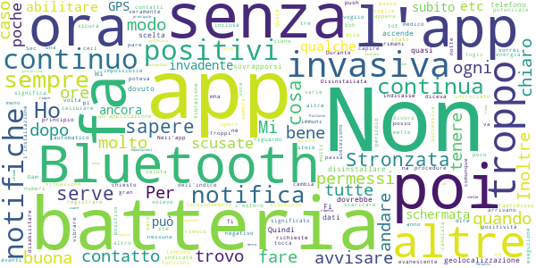
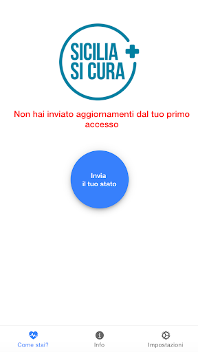
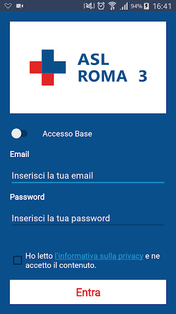

# COVID-related Android apps in Italy

Author: `Ivano Malavolta` (ivanomalavolta@gmail.com)

Created at: `2020/8/4`

Report generated by the [covid-apps-observer](http://github.com/covid-apps-observer) project, version 0.1

# Table of contents 

- [Background](#background)
    * [Data sources and analyses](#data-sources-and-analyses)
        * [App metadata](#app-metadata)
        * [Requested permissions](#requested-permissions)
        * [Mentioned servers](#mentioned_servers)
        * [Security analysis](#security_analysis)
        * [User ratings and reviews](#user-ratings-and-reviews)
    * [Disclaimer](#disclaimer)
- [SM_Covid19](#sm_covid19)
- [allertaLOM](#allertalom)
- [LAZIOdrCovid](#laziodrcovid)
- [SiciliaSiCura](#siciliasicura)
- [Covid-19](#covid-19)
- [WHO Info](#who-info)
- [OpenWHO: Knowledge for Health Emergencies](#openwho-knowledge-for-health-emergencies)
- [Immuni](#immuni)
- [Sardegna Sicura](#sardegna-sicura)

- [Credits](#credits)

# How to read this report

This report has been generated by the [covid-apps-observer](http://github.com/covid-apps-observer) project. The project automatically analyzes the apps by extracting information which is already publicly available either on the web or in the apps binary files. 

Our analysis covers the following apps:
| | |
|-------------------------|-------------------------| 
|  | SM_Covid19
|  | allertaLOM
|  | LAZIOdrCovid
|  | SiciliaSiCura
|  | Covid-19
|  | WHO Info
|  | OpenWHO: Knowledge for Health Emergencies
|  | Immuni
|  | Sardegna Sicura

The details of our analysis are presented in the remainder of this report.

For independent verification, the raw data and the source code of the project is publicly available in its GitHub repository [http://github.com/covid-apps-observer](http://github.com/covid-apps-observer) and its source code has been thoroughly commented in order to provide all the details about how the information provided in this report has been extracted. 

Any feedback, questions, and improvements about the project are very welcome, feel free to create an issue or pull request directly in its GitHub repository: [http://github.com/covid-apps-observer](http://github.com/covid-apps-observer).

## Data sources and analyses

The analysis of each app is structured around five main dimensions: 
* App metadata  
* Requested permissions
* Mentioned servers
* Androwarn analysis
* User ratings and reviews

In the following we describe the data sources and analysis performed for each dimension.

### App metadata

App metadata includes an overview of the main information about the app (for example, its name, releases, privacy policy, etc.), contact information of the development team, and the various Android versions supported by the app. This information is extracted from two main data sources:
* _Google Play store_: we automatically mined the web page of the Google Play store showing the basic information about the app and we parsed it in order to extract information about the app and development team 
* _Android Manifest file_: in our analysis we decompiled the binary file of the app (it is similar to a Zip archive but it contains the code of the app instead of normal files) and we extracted information about the supported Android versions, as it has been listed by its development team.

The extracted app metadata feeds the _App overview_, _Development team_, and _Android support_ sections of this report.
We make use of the [google-play-scraper](https://github.com/JoMingyu/google-play-scraper) tool for extracting the raw data related to this dimension of the project.

### Requested permissions

The Android operating system has a permission model which allows users to grant access to potentially privacy-related information. Every Android app has to explictly declare the permissions it needs to properly function in the Android Manifest file.  

In this report we also show the protection level of each permission, which is a key information for understanding how the requested permissions related to the user's privacy. We carefully analyzed the [official Android documentation (v. 29)](https://developer.android.com/reference/android/Manifest.permission), and it resulted that a permission requested by an Android app can belong to the following protection levels:
* **Dangerous**: higher-risk permissions that would give a requesting app access to private user data or control over the device that can negatively impact the user. Because this type of permission introduces potential risk, the system usually does not automatically grant it to the requesting app. For example, any dangerous permissions requested by an app may be displayed to the user and require confirmation before proceeding.
* **Normal**: this is the default and most common level in Android; normal permissions are lower-risk and give access to isolated app-level features, with minimal risk to other apps, the system, or the user. 
* **Signature**: permissions granted only if the requesting app is signed with the same certificate as the app that declared the permission
* **Appop**: old permission level, a reminiscence of the App Ops tool that Google introduced in Android 4.3.
* **Development**: optional permissions which can be granted to development-oriented apps.
* **Privileged**: permissions who give higher power to mobile apps w.r.t. other apps, such as binding to incoming calls, interacting via bluetooth with other devices without user interaction, etc.
* **Preinstalled**: reserved only for preinstalled apps
* **Installer**: allow the holder to start the permission usage screen for an app
* **RetailDemo**: permissions related to devices used in demonstrations in shops.
* **Pre23**: permissions automatically granted to apps targeting devices running pre-6.0 Android.
* **Upcoming**: permissions which will be released in the next version of the Android platform. 
* **Deprecated**: permissions belonging to old releases of the Android platform, they should not be used by developers since they will not be supported in the near future.
* **Not for use by third-party applications**: permissions which can be requested only by apps developed by Google.
* **Undefined**: this protection level is not documented by Google.

The permissions dimension of this project is based on the [Androguard](https://github.com/androguard/androguard) static analysis tool.

### Mentioned servers

We decompiled each app in order to look for all possible mentions of remote URLs. The mentioned URLs can refer to remote servers the the app is using for either sending or receiving information, web addresses for directing the user to an information website, and so on. 

:warning: It is important to note that this analysis is not meant to be complete and it is very prone to obfuscation. The servers reported here are simply _mentioned_ somewhere in the code of the app and are meant to just give an indication about the "hooks" of the app towards external resources. For example, for an Android app it is normal to contact Google services in order to send/receive push notifications, or to contact the servers of analytics services for having real-time diagnostics about crashes of the app or bugs.

This part of the analysis is based on the [Androguard](https://github.com/androguard/androguard) static analysis tool for identfying the raw URLs mentioned in the app; then, the information about each mentioned server is collected by performing a _whois_ lookup on the first-level domain present in the URL.

### Security analysis

This dimension is based on the [Androwarn](https://github.com/maaaaz/androwarn) structural and data flow analysis of Android bytecode. Androwarn is developed by the University of Lyon/INSA (France) and it has been used in several academic studies. According to its documentation, Androwarn targets the following categories of potential security issues:
* **Telephony identifiers exfiltration**: IMEI, IMSI, MCC, MNC, LAC, CID, operator's name, etc.
* **Device settings exfiltration**: software version, usage statistics, system settings, logs, etc.
* **Geolocation information leakage**: GPS/WiFi geolocation, etc.
* **Connection interfaces information exfiltration**: WiFi credentials, Bluetooth MAC adress, etc.
* **Telephony services abuse**: premium SMS sending, phone call composition, etc.
* **Audio/video flow interception**: call recording, video capture, etc.
* **Remote connection establishment**: socket open call, Bluetooth pairing, APN settings edit, etc.
* **PIM data leakage**: contacts, calendar, SMS, mails, clipboard, etc.
* **External memory operations**: file access on SD card, etc.
* **PIM data modification**: add/delete contacts, calendar events, etc.
* **Arbitrary code execution**: native code using JNI, UNIX command, privilege escalation, etc.
* **Denial of Service**: event notification deactivation, file deletion, process killing, virtual keyboard disable, terminal shutdown/reboot, etc.

Note: We do not consider this data point in the current version of our analyzers since it is too verbose for our purposes.

:warning: It is important to note that Androwarn is a static analysis tool, and as such it performs a variety of heuristics and approximations in its analyses. Said that, the results shown in this report are meant to provide an indication of _potential_ security issues and should be by no means treated as complete and correct.   

### User ratings and reviews

For this dimension we turn again to the web interface of the Google Play store. Firstly, we automatically mine summary statistics about user ratings from the web page of the app under analysis; then, we automatically download the newest 1000 reviews of the app under analysis. For each level of rating (5 stars, 4 stars, , etc., 1 star) we show:
- a word cloud presenting the main terms used by end users in their reviews in the Google Play store
- the last 10 reviews provided by app users in the Google Play store. 

This purposefully simple analysis is meant to help both future users and the development team of the app in understanding what are the main positive and negative points of the app under analysis.

We make use of the [google-play-scraper](https://github.com/JoMingyu/google-play-scraper) tool for extracting the raw data related to this dimension of the project.

## Disclaimer 

This report has been produced independently of any parties and its only objective is to help anybody in better understanding how COVID-related apps work in practice (and compare to each other). The results of this report are limited to the specific version of the software used for running the analyses and on the various heuristics implemented in there. In other words, the results of the analyzers may differ depending on the time and modalities in which they are executed. We do not guarantee that the results of the analyses and the corresponding contents of this report are fully complete or correct. The analysis software is licensed under the [MIT License](https://github.com/iivanoo/covid-apps-observer/blob/master/LICENSE).

# SM_Covid19
App version ``5.1``

Analyzed with [covid-apps-observer](http://github.com/covid-apps-observer) project, version ``0.1``

## App overview
| | |
|-------------------------|-------------------------| 
| **Name**&nbsp;&nbsp;&nbsp;&nbsp;&nbsp;&nbsp;&nbsp;&nbsp;&nbsp;&nbsp;&nbsp;&nbsp;&nbsp;&nbsp;&nbsp;&nbsp;&nbsp;&nbsp;&nbsp;&nbsp;&nbsp;&nbsp;&nbsp;&nbsp;&nbsp;&nbsp;&nbsp;&nbsp;&nbsp;&nbsp;&nbsp;&nbsp;&nbsp;&nbsp;&nbsp;&nbsp;&nbsp;&nbsp;&nbsp;&nbsp;  | SM_Covid19 |
| **Unique identifier** | it.softmining.projects.covid19.savelifestyle |
| **Link to Google Play** | [https://play.google.com/store/apps/details?id=it.softmining.projects.covid19.savelifestyle](https://play.google.com/store/apps/details?id=it.softmining.projects.covid19.savelifestyle) |
| **Summary**  | Community di Contact Tracing volontario per la sfida al Covid19. |
| **Privacy policy** | [https://www.softmining.it/index.php/sm-covid19-app/](https://www.softmining.it/index.php/sm-covid19-app/) |
| **Latest version** | 5.1 |
| **Last update** | 2020-07-17 16:52:14 |
| **Recent changes** | Bug fix per Huawei |
| **Installs**  | 50.000+ |
| **Category** | Salute e fitness |
| **First release** | 12 apr 2020 |
| **Size**  | 4,8M |
| **Supported Android version**  | 5.0 e versioni successive |

### Description
> Sm-Covid-19 ti permette di tenere sotto controllo il tuo "Indice dei Contatti", ovvero una stima numerica con valori da 0 a 100 che cresce e decresce a seconda del numero (e del tipo) di contatti rilevati nelle ultime 24 ore. Il calcolo dell'indice avviene ogni ora.  Il valore "Indice dei Contatti" è una stima che può aiutarti a capire se durante la fase 2 stai avendo troppi contatti. 
 Questa App è stata sviluppata e viene costantemente aggiornata con l'obiettivo di valutare (attraverso la definizione di modelli statistici e matematici) il rischio di trasmissione (e il comportamento epidemico) del virus attraverso il monitoraggio:
 - del numero dei contatti
 - della durata dei contatti;
 - della distanza presente tra i contatti rilevati rispetto alla durata del contatto.
 Sm-Covid-19 è in grado di rilevare l'App Immuni in modo da aumentare la precisione dei modelli matematici.
 Sm-Covid-19 non acquisisce dati personali ne dati sanitari: Ti preghiamo di visualizzare il video introduttivo per avere maggiori dettagli sullo scopo e sul funzionamento di questa App. 
 Se desideri maggiori dettagli tecnici sul funzionamento di Sm-Covid-19 puoi visitare questo link: https://www.smcovid19.org/recover/
 Sm-Covid-19 non acquisisce dati sensibili dell’utente (ne ha bisogno di tali dati per funzionare).
 Il modulo di auto-segnalazione è stato rimosso in quanto la funzionalità non sarà gestita da Sm-Covid-19.
 Durante la fase 2, cercheremo di acquisire un gran numero di utenti attivi, per poter migliorare i modelli di stima del contagio: Al momento siamo una piccola community di 40.000 volontari, ma per poter eseguire calcoli statistici precisi ti chiediamo di aiutarci a diffondere l'App tra tutti i tuoi contatti, sopratutto quelli con i quali presumibilmente potresti entrare in contatto durante la fase 2.
 Ci teniamo a ricordarti che SOLO le autorità sanitarie possono indicare la positività di un soggetto. Poiché IMMUNI sarà l'app ufficiale di contact tracing Italiana, abbiamo rimosso il modello di calcolo dell'"Indice di Rischio". L'APP mostrerà solo un Indice di Contatto che aumenterà e diminuirà in base al numero di contatti efficaci rilevati. 
 I valori indicati in Sm-Covid-19 NON possono essere considerate diagnosi di positività o negatività al Covid-19: Lo scopo di questa APP è di generare modelli rappresentativi del contagio (modelli matematici) e statistiche accurate.
 L’utente non viene geo-localizzato, né viene reso riconoscibile, salvo nel caso in cui esso stesso decida di condividere di suo spontanea volontà i dati GPS attraverso il menù Impostazioni -> Abilita condivisione dati GPS.  
 I dati GPS verranno registrati SOLO quando verranno rilevati dei contatti. Se nessun utente viene rilevato nei dintorni, nessun dato viene acquisito. È possibile disabilitare in qualsiasi momento l'acquisizione dei dati GPS. 
 Le informazioni acquisite (solo numero, tipo di contatto, distanza e dati GPS se abilitati) saranno condivise con la comunità scientifica e sotto forma di open-data. I dati sono anonimi, tuttavia applichiamo tecniche di shuffle e cifratura degli ID random acquisiti prima di pubblicare open-data.
 Sm-Covid-19 è stata sviluppata e viene manutenuta senza fini economici né di acquisizione di dati sensibili. 
 Sm-Covid-19 non può essere considerata sostitutiva di una diagnosi medica.

### User interface
The developers of the app provide the following screenshots in the Google play store.
| | | |
|:-------------------------:|:-------------------------:|:-------------------------:|
 |   |   |   | 
 |   |  

## Development team
In the following we report the main information provided by the development team in the Google play store.

| | |
|-------------------------|-------------------------|
| **Developer**  | Softmining Srl |
| **Website**  | [https://www.smcovid19.org/](https://www.smcovid19.org/) |
| **Email** | smcovid19@softmining.it |
| **Physical address**  | [Via Tenente Corrado 22 - 83100 Avellino - Italia](https://www.google.com/maps/search/Via%20Tenente%20Corrado%2022%20-%2083100%20Avellino%20-%20Italia) (Google Maps) |
| **Other developed apps**  | [https://play.google.com/store/apps/developer?id=Softmining+Srl](https://play.google.com/store/apps/developer?id=Softmining+Srl) |

## Android support

| | |
|-------------------------|-------------------------|
| **Declared target Android version**  | Android10, version 10 (API level 29) |
| **Effective target Android version**  | Android10, version 10 (API level 29) |
| **Minimum supported Android version**  | Lollipop, version 5.0 (API level 21) |
| **Maximum target Android version**  | - |

The larger the difference between the minimum and maximum supported Android versions, the better. A larger difference means a wider audience. For example, old phones have a very low Android version, so a high minimum supported Android version means that the app cannot be used by users with old phones, thus leading to accessibility problems. 

## Requested permissions

In the following we report the complete list of the permissions requested by the app. 

| **Permission** | **Protection level** | **Description** | 
|-------------------------|-------------------------|-------------------------|
 **android.permission ACCESS_BACKGROUND_LOCATION** | :warning:**Dangerous** | Allows an app to access location in the background. 
 **android.permission ACCESS_COARSE_LOCATION** | :warning:**Dangerous** | Allows an app to access approximate location. 
 **android.permission ACCESS_FINE_LOCATION** | :warning:**Dangerous** | Allows an app to access precise location. 
 **android.permission ACCESS_NETWORK_STATE** | Normal | Allows applications to access information about networks. 
 **android.permission BLUETOOTH** | Normal | Allows applications to connect to paired bluetooth devices. 
 **android.permission BLUETOOTH_ADMIN** | Normal | Allows applications to discover and pair bluetooth devices. 
 **android.permission FOREGROUND_SERVICE** | Normal | Allows a regular application to use Service.startForeground. 
 **android.permission INTERNET** | Normal | Allows applications to open network sockets. 
 **android.permission READ_APP_BADGE** | - | - 
 **android.permission READ_EXTERNAL_STORAGE** | :warning:**Dangerous** | Allows an application to read from external storage. 
 **android.permission RECEIVE_BOOT_COMPLETED** | Normal | Allows an application to receive the Intent.ACTION_BOOT_COMPLETED that is broadcast after the system finishes booting. 
 **android.permission REQUEST_IGNORE_BATTERY_OPTIMIZATIONS** | Normal | Permission an application must hold in order to use Settings.ACTION_REQUEST_IGNORE_BATTERY_OPTIMIZATIONS. 
 **android.permission SYSTEM_ALERT_WINDOW** | Signature - preinstalled - appop - pre23 - development | Allows an app to create windows using the type WindowManager.LayoutParams.TYPE_APPLICATION_OVERLAY, shown on top of all other apps. 
 **android.permission USE_FULL_SCREEN_INTENT** | Normal | Required for apps targeting Build.VERSION_CODES.Q that want to use notification full screen intents. 
 **android.permission VIBRATE** | Normal | Allows access to the vibrator. 
 **android.permission WAKE_LOCK** | Normal | Allows using PowerManager WakeLocks to keep processor from sleeping or screen from dimming. 
 **android.permission WRITE_EXTERNAL_STORAGE** | :warning:**Dangerous** | Allows an application to write to external storage. 
 **com.anddoes.launcher.permission UPDATE_COUNT** | - | - 
 **com.google.android.c2dm.permission RECEIVE** | - | - 
 **com.google.android.finsky.permission BIND_GET_INSTALL_REFERRER_SERVICE** | - | - 
 **com.htc.launcher.permission READ_SETTINGS** | - | - 
 **com.htc.launcher.permission UPDATE_SHORTCUT** | - | - 
 **com.huawei.android.launcher.permission CHANGE_BADGE** | - | - 
 **com.huawei.android.launcher.permission READ_SETTINGS** | - | - 
 **com.huawei.android.launcher.permission WRITE_SETTINGS** | - | - 
 **com.huawei.permission.external_app_settings USE_COMPONENT** | - | - 
 **com.majeur.launcher.permission UPDATE_BADGE** | - | - 
 **com.oppo.launcher.permission READ_SETTINGS** | - | - 
 **com.oppo.launcher.permission WRITE_SETTINGS** | - | - 
 **com.sec.android.provider.badge.permission READ** | - | - 
 **com.sec.android.provider.badge.permission WRITE** | - | - 
 **com.sonyericsson.home.permission BROADCAST_BADGE** | - | - 
 **com.sonymobile.home.permission PROVIDER_INSERT_BADGE** | - | - 
 **it.softmining.projects.covid19.savelifestyle.permission C2D_MESSAGE** | - | - 
 **me.everything.badger.permission BADGE_COUNT_READ** | - | - 
 **me.everything.badger.permission BADGE_COUNT_WRITE** | - | - 
 **oppo.permission OPPO_COMPONENT_SAFE** | - | - 

## Mentioned servers

| **Server** | **Registrant** | **Registrant country** | **Creation date** | 
|-------------------------|-------------------------|-------------------------|-------------------------|
 | googlesyndication.com | Google LLC | :us: US | 2003-01-21 06:17:24 |
 | google.com | Google LLC | :us: US | 1997-09-15 04:00:00 |
 | googleadservices.com | Google LLC | :us: US | 2003-06-19 16:34:53 |
 | app-measurement.com | Google LLC | :us: US | 2015-06-19 20:13:31 |
 | onesignal.com | Domains By Proxy, LLC | :us: US | 2011-09-10 18:40:52 |
 | smcovid19.org | Data Protected | :canada: CA | 2020-03-31 21:30:24 |
 | softmining.it | SOFTMINING S.R.L. | :it: IT | 2017-10-16 19:27:28 |
 | governo.it | Presidenza del Consiglio dei Ministri | :it: IT | 2000-01-24 00:00:00 |
 | githubusercontent.com | GitHub, Inc. | :us: US | 2014-02-06 21:17:00 |
 | amazonaws.com | Amazon.com, Inc. | :us: US | 2005-08-18 02:10:45 |
 | crashlytics.com | Google LLC | :us: US | 2011-01-21 15:30:40 |

## Security analysis 

Below we report the main security warnings raised by our execution of the [Androwarn](https://github.com/maaaaz/androwarn) security analysis tool.

**Telephony identifiers leakage**
> - This application reads the numeric name (MCC+MNC) of current registered operator 
> - This application reads the operator name 

**Connection interfaces exfiltration**
> - This application reads details about the currently active data network 

**Telephony services abuse**
> - This application makes phone calls 

**Suspicious connection establishment**
> - This application opens a Socket and connects it to the remote address 'Ld/a/a/a/a;->f(Ljava/lang/String;)Ljava/lang/StringBuilder;' on the 'N/A' port  
> - This application opens a Socket and connects it to the remote address 'Ljava/net/Proxy;->type()Ljava/net/Proxy$Type;' on the 'N/A' port  
> - This application opens a Socket and connects it to the remote address 'hostname == null ' on the 'N/A' port  
> - This application opens a Socket and connects it to the remote address 'timeout' on the 'N/A' port  

**Code execution**
> - This application executes a UNIX command containing this argument: 'Ljava/lang/StringBuilder;->toString()Ljava/lang/String;' 

## User ratings and reviews

Below we provide information about how end users are reacting to the app in terms of ratings and reviews in the Google Play store.

### Ratings

The SM_Covid19 app has been installed by more than **50000** times. At this time, **764** rated the app and its average score is **4.01**. Below we show the distribution of the ratings across the usual star-based rating of Google Play

:star::star::star::star::star:: 412

:star::star::star::star:: 152

:star::star::star:: 76

:star::star:: 38

:star:: 84

### Reviews 

#### 5-star reviews

> Un piccolo problema su Xiaomi Tutto risolto in un batter d'occhio Bravissimi ora funziona di nuovo che è una meraviglia. Altro che Immuni, questa è una app di tracciamento veramente completa.  :date: __2020-08-03 14:36:37__

> Era una ottima app che avevo installato da subito... Purtroppo con i vincoli derivati da immuni sulla geolocalizzaIone obbligatoria è andato tutto a putt... Dopo 2 mesi mi arrendo, ho disinstallato immuni e ora anche questa. Sono convinto sostenitore dell'efficacia delle app per la prevenzione ma anche con la buona batteria del mio xiaomi A1 a volte a ora di cena rimango a piedi, ho capito che a volte qualche altra app (non so quale) attiva il gps e mi scarica il telefono... Peccato...  :date: __2020-07-29 19:35:55__

> Io preferisco utilizzare questa applicazione invece di altre, mi risulta più user Friendly.  :date: __2020-07-24 18:07:05__

> Ok frequento poche persone  :date: __2020-07-22 17:01:56__

> Ottima app  :date: __2020-07-21 09:00:14__

> Utile nei centri commetciali  :date: __2020-07-20 14:10:06__

> Molto utile.... Avevo delle riserve all'inizio....ma con il passare dei giorni mi rendo conto che mi aiuta a mantenere il distanziamento  :date: __2020-07-19 22:23:35__

> Buono  :date: __2020-07-17 09:33:04__

> Buono  :date: __2020-07-14 15:44:06__

> Dovremmo applicarla tutti l'applicazione immuni....saremmo PIÙ tranquilli TUTTI  :date: __2020-07-11 15:59:39__

#### 4-star reviews

> Positiva  :date: __2020-07-31 14:48:10__

> 4Stelle e non 5 perché dopo l'ultimo aggiornamento 5.0 l'applicazione va in crash alla apertura...parte e subito all'istante si chiude.Ho disinstallato e reinstallato l'applicazione e cosí facendo ho risolto il bug. HUAWEI P20 PRO android 10  :date: __2020-07-19 11:54:17__

> Buona  :date: __2020-07-17 20:36:04__

> App molto utili  :date: __2020-07-01 13:08:36__

> Ottima app. Mi piace moltissimo la possibilità di calcolare l'indice di assembramento. Tuttavia riscontro un problema con le notifiche in quanto mi da sempre zero mentre quando apro l'app c'è il corretto valore.  :date: __2020-06-29 14:15:33__

> Ottima ma con l'ultimo aggiornamento, l'applicazione si blocca in modo anomalo. Attendo notizie ho un android 9. Il problema è stato risolto nell'ulteriore aggiornamento. Tutto a posto. Ottima e utile applicazione  :date: __2020-06-27 16:36:49__

> Per il momento nessuna rapporti a rischio ci persone positive se l' app funziona  :date: __2020-06-25 21:31:12__

> Molto bella  :date: __2020-06-18 21:12:10__

> Non ho capito se ad oggi, 17.6.2020, la app è attiva e funzionante, con invio di notifiche in caso di contatti a rischio  :date: __2020-06-17 21:37:42__

> Molto utile  :date: __2020-06-17 13:58:09__

#### 3-star reviews

> Dovrebbero installarla tutti per essere più efficace  :date: __2020-07-27 11:38:34__

> Dopo l'aggiornamento del 13 luglio è diventata instabile e si chiude in continuazione  :date: __2020-07-16 14:24:48__

> Ancora in prova  :date: __2020-07-11 09:41:40__

> Nessuna esperinsa  :date: __2020-07-08 21:44:00__

> Buona  :date: __2020-07-08 19:36:55__

> non 0si capisce il funz.to  :date: __2020-07-01 13:12:28__

> Applicazione molto interessante e ben fatta ma che consuma una quantità di batteria assurda: minimo il 16% della batteria in 10 ore e senza mai averla aperta in modo esplicito ed è un valore molto più alto di quello del display o di Facebook o navigazione internet nello stesso intervallo  :date: __2020-06-29 22:46:39__

> Non so quanto sia credibile, al momento non posso dare di + poi si vedra', a me pare + un controllo della persona. E allora W la privacy.  :date: __2020-06-16 11:42:51__

> Do 3 stelle sulla fiducia. Ho un Samsung del 2016 e volendo impostare il mio profilo riesco a vedere solo le prime 2 opzioni. Come mai? So che dovrei cambiare smartphone...  :date: __2020-06-15 16:02:14__

> e una beta comunque  :date: __2020-06-04 11:07:17__

#### 2-star reviews

> Per ora va bene, io non ho molti contatti con l'estero comunque  :date: __2020-07-06 11:35:49__

> Non serve a gran che visto che ho incrociato positivi e loro non avevano l'app  :date: __2020-06-26 08:05:34__

> Non buona. Troppo evanescente  :date: __2020-06-22 10:28:01__

> Dam pl v  :date: __2020-06-22 09:47:34__

> Cosa significa quando mette 0,e poi un tot di numeri dopo?  :date: __2020-06-20 18:27:25__

> Qusta app vale 2 stele  :date: __2020-06-17 18:12:17__

> Non riesco a capire in che modo (spero di no) avvisare il medico in caso di positività per poi avvisare chi è stato a contatto con me (principio di funzionamento di immuni). Nell'app non trovo nessuna voce a riguardo  :date: __2020-06-15 21:05:35__

> Mi sembra una stronzata come app come fa a sapere se uno è veramente positivo o negativo senza tampone? Poi se l tocca un altro il cell cambia o no? Sec me na cavolata l altra volta m diceva che ero poco rischioso ora mi dice tutto bene mha  :date: __2020-06-08 13:48:07__

> Non è chiaro il significato dell'indice (e le varie soglie), né sono indicate le procedure da fare in caso indicasse una situazione di potenziale pericolo. Inoltre è molto fastidioso il continuo vibrare delle notifiche push che arrivano più o meno ogni ora, inclusa la notte. Vibrazione che a quanto pare è impossibile disabilitare.  :date: __2020-06-08 11:13:44__

> Non sicura  :date: __2020-06-06 19:22:21__

#### 1-star reviews

> Non c'è ne di covidi  :date: __2020-07-30 08:49:05__

> App pessima da 3 giorni circa non si apre più. È meglio che cambiate lavoro!!!!  :date: __2020-07-21 19:14:07__

> Dopo ultimo upgrade, l'app va in crash  :date: __2020-07-19 20:33:36__

> Samsung A70  :date: __2020-07-14 14:32:17__

> 😝  :date: __2020-07-10 20:11:42__

> Poco efficace fino ad ora  :date: __2020-07-08 23:41:06__

> Non soddisfacente (al momento). Domanda: perché mi appare spesso la scritta 'applicazione in esecuzione" e l' indice è a 0.00? La prima volta che l'ho scaricata andava molto bene. Perché ora no saluti Paolo  :date: __2020-07-06 18:26:16__

> 😢  :date: __2020-07-06 15:08:42__

> Si blocca e non mi fa scorrere lo schermo😡. Ieri o l'altro giorno al TELEGIORNALE hanno detto che le app sul COVID-19 rubano dati personali o ti spiano. Quando ho parlato dell'app ai miei genitori si sono SUBITO ARRABBIATI (anche preoccupati) e mi hanno detto di DISINSTALLARE E BASTA.  :date: __2020-06-27 21:55:07__

> nn c'è il numero degli infetti  :date: __2020-06-26 08:27:18__

# allertaLOM
App version ``1.7.0``

Analyzed with [covid-apps-observer](http://github.com/covid-apps-observer) project, version ``0.1``

## App overview
| | |
|-------------------------|-------------------------| 
| **Name**&nbsp;&nbsp;&nbsp;&nbsp;&nbsp;&nbsp;&nbsp;&nbsp;&nbsp;&nbsp;&nbsp;&nbsp;&nbsp;&nbsp;&nbsp;&nbsp;&nbsp;&nbsp;&nbsp;&nbsp;&nbsp;&nbsp;&nbsp;&nbsp;&nbsp;&nbsp;&nbsp;&nbsp;&nbsp;&nbsp;&nbsp;&nbsp;&nbsp;&nbsp;&nbsp;&nbsp;&nbsp;&nbsp;&nbsp;&nbsp;  | allertaLOM |
| **Unique identifier** | it.lispa.sire.app.mobile.allertalom |
| **Link to Google Play** | [https://play.google.com/store/apps/details?id=it.lispa.sire.app.mobile.allertalom](https://play.google.com/store/apps/details?id=it.lispa.sire.app.mobile.allertalom) |
| **Summary**  | L’app della Protezione Civile di Regione Lombardia che allerta in tempo reale |
| **Privacy policy** | [http://www.allertalom.regione.lombardia.it/privacyapp](http://www.allertalom.regione.lombardia.it/privacyapp) |
| **Latest version** | 1.7.0 |
| **Last update** | 2020-06-03 16:56:13 |
| **Recent changes** | Grazie di essere un utente allertaLOM.  Aggiorniamo regolarmente la nostra app per risolvere bug e fornire informazioni utili all&#39;utenza. |
| **Installs**  | 500.000+ |
| **Category** | Meteo |
| **First release** | 11 dic 2019 |
| **Size**  | 9,5M |
| **Supported Android version**  | 5.0 e versioni successive |

### Description
> allertaLOM è l’App di Regione Lombardia che permette di ricevere le allerte di Protezione Civile emesse dal Centro Funzionale Monitoraggio Rischi naturali di Regione Lombardia, in previsione di eventi naturali con possibili danni sul territorio.
 allertaLOM, in occasione dell’emergenza Coronavirus in Lombardia, si è evoluta in uno strumento di partecipazione attiva della cittadinanza al monitoraggio della diffusione del virus e in un canale di informazioni aggiornate sulle disposizioni regionali in materia, attraverso due nuove funzionalità:
 •	CercaCovid – la partecipazione al sondaggio CercaCovid permette a Regione Lombardia di quantificare il livello di diffusione del contagio e la distribuzione territoriale della positività, sulla base dei sintomi segnalati dagli utenti. I dati raccolti servono per analisi statistiche ed epidemiologiche, fondamentali per aiutare le autorità sanitarie a definire modelli e strategie di contrasto al Coronavirus. Il questionario è volontario, completamente anonimo, non prevede alcuna geolocalizzazione e non sostituisce una valutazione medica delle proprie condizioni. Partecipare è importante, anche in assenza di sintomi: più dati si ricevono, più il quadro della situazione è preciso. 
 •	Notifiche sull’emergenza Coronavirus in Lombardia - sono state attivate notifiche push con il link alla pagina del portale istituzionale che contiene gli aggiornamenti sul tema. Le notifiche possono essere disattivate dall'utente nell'apposita sezione. 
 Scarica l’App per:
 •	partecipare al monitoraggio attivo della diffusione del Coronavirus;
 •	ricevere informazioni aggiornate sulle azioni intraprese da Regione Lombardia per l’emergenza Coronavirus 
 •	personalizzare la ricezione delle notifiche sulle ultime disposizioni regionali riguardanti l’emergenza Coronavirus
 •	restare sempre aggiornato sulle allerte di Protezione Civile in Lombardia;
 •	monitorare la situazione di allerta sui Comuni preferiti oppure su tutta la regione;
 •	seguire l’evoluzione su mappa dei li-velli di allerta nell’arco di 36 ore;
 •	personalizzare la ricezione delle notifiche su tutti i rischi naturali oppure sui singoli rischi;
 •	ricevere notifiche all’emissione di allerte nei Comuni preferiti sui rischi prescelti;
 •	scaricare e consultare i documenti di allerta
 Come funziona l’allertamento di Protezione civile in Regione Lombardia
 •	Le allerte riguardano i rischi naturali prevedibili (idrogeologico, idraulico, temporali forti, vento forte, neve, valanghe e incendi boschivi) e presentano livelli crescenti di criticità (codice verde, giallo, arancione, rosso) a seconda della gravità ed estensione dei fenomeni. I documenti di allerta sono destinati al sistema locale di Protezione Civile e forniscono indicazioni per attivare le misure di contrasto previste nei Piani Comunali di Protezione Civile. Per i cittadini, le allerte sono uno strumento per sapere quando adottare le misure di auto-protezione, seguendo le indicazioni dell’Autorità locale di Protezione Civile. Per maggiori informazioni, consultare la pagina sulle allerte sul Portale di Regione Lombardia.

### User interface
The developers of the app provide the following screenshots in the Google play store.
| | | |
|:-------------------------:|:-------------------------:|:-------------------------:|
 |   |   |   | 
 |   |   |   | 
 |   |   |   | 
 |   |   |   | 
 |   |   |   | 
 |   |   |   | 
 |   |   |   | 

## Development team
In the following we report the main information provided by the development team in the Google play store.

| | |
|-------------------------|-------------------------|
| **Developer**  | Regione Lombardia |
| **Website**  | [http://www.allertalom.regione.lombardia.it](http://www.allertalom.regione.lombardia.it) |
| **Email** | info.allertalom@ariaspa.it |
| **Physical address**  | [Piazza Città di Lombardia 1 - 20124 Milano (Italia)](https://www.google.com/maps/search/Piazza%20Città%20di%20Lombardia%201%20-%2020124%20Milano%20(Italia)) (Google Maps) |
| **Other developed apps**  | [https://play.google.com/store/apps/developer?id=Regione+Lombardia](https://play.google.com/store/apps/developer?id=Regione+Lombardia) |

## Android support

| | |
|-------------------------|-------------------------|
| **Declared target Android version**  | Pie, version 9 (API level 28) |
| **Effective target Android version**  | Pie, version 9 (API level 28) |
| **Minimum supported Android version**  | Lollipop, version 5.0 (API level 21) |
| **Maximum target Android version**  | - |

The larger the difference between the minimum and maximum supported Android versions, the better. A larger difference means a wider audience. For example, old phones have a very low Android version, so a high minimum supported Android version means that the app cannot be used by users with old phones, thus leading to accessibility problems. 

## Requested permissions

In the following we report the complete list of the permissions requested by the app. 

| **Permission** | **Protection level** | **Description** | 
|-------------------------|-------------------------|-------------------------|
 **android.permission ACCESS_NETWORK_STATE** | Normal | Allows applications to access information about networks. 
 **android.permission CALL_PHONE** | :warning:**Dangerous** | Allows an application to initiate a phone call without going through the Dialer user interface for the user to confirm the call. 
 **android.permission GET_ACCOUNTS** | :warning:**Dangerous** | Allows access to the list of accounts in the Accounts Service. 
 **android.permission INTERNET** | Normal | Allows applications to open network sockets. 
 **android.permission READ_EXTERNAL_STORAGE** | :warning:**Dangerous** | Allows an application to read from external storage. 
 **android.permission WAKE_LOCK** | Normal | Allows using PowerManager WakeLocks to keep processor from sleeping or screen from dimming. 
 **android.permission WRITE_EXTERNAL_STORAGE** | :warning:**Dangerous** | Allows an application to write to external storage. 
 **com.google.android.c2dm.permission RECEIVE** | - | - 
 **it.lispa.sire.app.mobile.allertalom.permission C2D_MESSAGE** | - | - 

## Mentioned servers

| **Server** | **Registrant** | **Registrant country** | **Creation date** | 
|-------------------------|-------------------------|-------------------------|-------------------------|
 | googlesyndication.com | Google LLC | :us: US | 2003-01-21 06:17:24 |
 | google.com | Google LLC | :us: US | 1997-09-15 04:00:00 |
 | app-measurement.com | Google LLC | :us: US | 2015-06-19 20:13:31 |
 | gstatic.com | Google LLC | :us: US | 2008-02-11 15:31:25 |
 | whatsapp.com | Whatsapp Inc. | :us: US | 2008-09-04 12:39:12 |

## Security analysis 

Below we report the main security warnings raised by our execution of the [Androwarn](https://github.com/maaaaz/androwarn) security analysis tool.

**Telephony identifiers leakage**
> - This application reads the device phone type value 

**Connection interfaces exfiltration**
> - This application reads details about the currently active data network 
> - This application tries to find out if the currently active data network is metered 

**Telephony services abuse**
> - This application makes phone calls 

**Suspicious connection establishment**
> - This application opens a Socket and connects it to the remote address '' on the 'N/A' port  
> - This application opens a Socket and connects it to the remote address 'Ljava/lang/StringBuilder;->toString()Ljava/lang/String;' on the ': connect, resolve' port  
> - This application opens a Socket and connects it to the remote address 'Ljava/lang/StringBuilder;->toString()Ljava/lang/String;' on the 'N/A' port  
> - This application opens a Socket and connects it to the remote address 'Ljava/net/Proxy;->type()Ljava/net/Proxy$Type;' on the 'N/A' port  
> - This application opens a Socket and connects it to the remote address 'timeout' on the 'N/A' port  

**Code execution**
> - This application loads a native library: 'sqlc-native-driver' 
> - This application loads a native library: 'tool-checker' 
> - This application executes a UNIX command 
> - This application executes a UNIX command containing this argument: 'getprop' 
> - This application executes a UNIX command containing this argument: 'mount' 

## User ratings and reviews

Below we provide information about how end users are reacting to the app in terms of ratings and reviews in the Google Play store.

### Ratings

The allertaLOM app has been installed by more than **500000** times. At this time, **3568** rated the app and its average score is **3.3971832**. Below we show the distribution of the ratings across the usual star-based rating of Google Play

:star::star::star::star::star:: 1356

:star::star::star::star:: 643

:star::star::star:: 502

:star::star:: 190

:star:: 874

### Reviews 

#### 5-star reviews

> NEI PRONTO SOCCORSO SON TUTTI RIGOROSI ALLE REGOLE E TI METTONO MOLTO A TUO AGIO GRAZIE A TUTTI X LA COLLABORAZIONEUN ABBRACCIO SEPPUR VIRTUALE  :date: __2020-07-31 15:42:15__

> Di un certo qual spessore...  :date: __2020-07-27 19:40:37__

> A volte non è proprio perfetta, ma la trovo molto utile.  :date: __2020-07-21 20:24:00__

> Ok  :date: __2020-07-18 18:01:45__

> Molto utile  :date: __2020-07-03 22:31:26__

> Tutto ok, fino a quando la dobbiamo usare? Fino a che trovano il vaccino?  :date: __2020-07-03 12:45:10__

> Ritornata fantastica!  :date: __2020-07-01 12:55:17__

> Vorrei fare le vacanze in Calabria come midevo compore  :date: __2020-06-26 21:00:11__

> Tutto funziona perfettamente!  :date: __2020-06-26 16:58:45__

> Applicazione aggiornata in data 22/04 funziona perfettamente, grazie della mail inviata per L aggiornamento, spero presto di essere parte della protezione civile, in data 24/06 ho superato i test per il corso volontario di protezione civile, presto dei vostri  :date: __2020-06-25 14:10:44__

#### 4-star reviews

> Applicazione utile ed abbastanza ben progettata. Vorrei però capire a cosa serve la sezione Preferiti, dal momento che non riesco a trovare nessuna schermata da cui aggiungere qualcosa alla lista...  :date: __2020-08-01 14:47:36__

> Nel menù non trovo niente per cambiare l'età .  :date: __2020-08-01 13:02:14__

> Post covid-19 modifico la recensione che è molto utile per le allerte meteo ... sarebbero il TOP se sulla piantina inserite anche il nome delle province e non solo la delimitazione. Grazie  :date: __2020-07-29 13:17:38__

> Interessante e valida. A volte complicata apertura.  :date: __2020-07-10 16:38:11__

> 25/6/2020: i campi "condizioni mediche rilevanti" sono comparsi tutti deselezionati e non è permesso inviare dichiarazioni senza selezionarne uno. Allo stesso tempo non è permesso fare una selezione dopo avere già inviato una dichiarazione al servizio CercaCovid. Problema risolto cancellando i dati dell'applicazione.  :date: __2020-06-25 15:01:47__

> Dopo questa modifica diciamo che già meglio, la cosa che mi lascia perplesso e perché si possa inserire solo un figlio chi ne ha due o piu cosa deve fare ?  :date: __2020-06-24 14:28:57__

> Convinto della bontà del sito  :date: __2020-06-12 22:46:58__

> Secondo me sarebbe ancora più utile se le domande non si riferissero solo ai precedenti 15 giorni allargando il periodo temporale a tutto il 2020 lasciando un campo libero per aggiungere delle note oppure chiedendo la data in cui sono iniziati e finiti determinati sintomi o contatti con persone e luoghi infetti. dopo l'aggiornamento giugno 2020 la finestra di pop-up finale dopo la compilazione non viene visualizzata correttamente  :date: __2020-06-07 18:54:52__

> Grazie per la risposta che non ha chiarito il problema. non sono risposte inesatte ma nemmeno precise. Es. Se la mia temperatura è 36,3 devo scegliere se segnare 36 o 36,5. Per questo ho detto che le risposte non sono precise. Lo stesso per le altre domande categoriche e sempre le stesse. So benissimo che se ho un malessere nuovo devo rivolgermi al mio medico. Leggendo anche altre recensioni le osservazioni sono più o meno le stesse e non si comprende quale utilità abbia questa ricerca.  :date: __2020-06-06 09:52:05__

> Facile da utilizzare. Molto migliorata con gli ultimi aggiornamenti. Unico difetto non è possibile aggiornare l'età. Inserita la prima volta non è possibile modificarla al compimento degli anni  :date: __2020-06-05 13:11:25__

#### 3-star reviews

> Non sempre veritiere  :date: __2020-07-26 16:43:10__

> Problema risolto, grazie  :date: __2020-07-21 15:39:01__

> Lavoro in uno studio odontoiatrico, noi le mascherine le togliamo hai pazienti e siamo a pochi centimetri dalla bocca con effetto aereosol e nessuno ci fa un tampone di controllo, resto molto perplessa  :date: __2020-07-18 18:52:01__

> Sarà utile per segnalare covid ma è monotona rispondere sempre alle stesse domande tutti i giorni se non ci sono cambiamenti. Per di più l'applicazione si blocca ogni tanto con lo schermo che diventa bianco e si deve disinstallare e reinstallare tutto di nuovo....  :date: __2020-07-02 16:06:39__

> Secondo me è utilizzata pochissimo e non ho capito come dare informazioni dopo aver compilato il questionario  :date: __2020-06-15 18:06:53__

> Scaricata ma non riesco a ricevere nessuna notifica di allerta inoltre ogni volta che si chiude l'applicazione spariscono dai preferiti i comuni precedentemente memorizzati. Le notifiche sono tutte attive, occorre tenere sempre acceso il GPS ? grazie  :date: __2020-06-11 15:25:30__

> L'app è ben fatta, solo a volte non arrivano le notifiche ma gli SMS. Inoltre, come si fa a cambiare i numeri associati all allerta meteo? Non vedo nessun menù a disposizione. Grazie  :date: __2020-06-09 07:43:19__

> Per la parte covid, con Android mi è impossibile compilarla nè per me, nè per la mia famiglia. Ritengo sia un baco. Ci ho riprovato e funziona.  :date: __2020-06-08 16:11:32__

> Lasciando perdere per un attimo l'aggiunta della sezione covid, poco integrata e sviluppata, per quanto riguarda le allerte sarebbe bene un maggiore sviluppo. Ad esempio vorrei poter vedere nelle notifiche il colore e la descrizione delle allerte emesse Se si potesse sarebbe bello addirittura poter selezionare una provincia preferita per le allerte  :date: __2020-06-08 13:26:21__

> Boh info perlopiu' inutili ed esageratamente allarmistiche  :date: __2020-06-06 07:58:56__

#### 2-star reviews

> Arrivano le notifiche si clicca sul popup che contiene il link.. pagina non trovata.  :date: __2020-07-31 20:20:23__

> Scaricata x curiosità, mah... Ci sono domande che andrebbero migliorate, tipo in che comune lavori? Non c'è modo di fare scelte multiple un rappresentante, una guardia giurata, un corriere girano la provincia ed oltre, io ho messo dove ho la sede xò...  :date: __2020-07-18 16:00:53__

> Questa app no piage perché io sto regione marche e sto Appignano provincia magerata  :date: __2020-06-18 18:07:20__

> Funziona una volta si e 5 no  :date: __2020-06-14 15:57:48__

> perche modificare in peggio la parte covid?? uso questa app da circa tre mesi direi esclusivamente per la parte covid la prima versione poteva essere migliorata e la seconda l'ha sicuramente molto più fruibile e rapida la compilazione l'ultimo aggiornamento di qualche giorno fa ha spostato la compilazione a sinistra. dato che la maggior parte delle persone é destrorsa e usa il pollice, cio ha reso l'applicazione non ergonomica. l'ho trovato stupido  :date: __2020-06-07 10:13:33__

> Sinceramente non capisco a cosa serve compilare il test...  :date: __2020-06-07 00:35:39__

> Ogni volta che arriva una notifica e fai per aprirla, non si carica mai, ma va in crash.  :date: __2020-06-03 18:40:59__

> Ho smesso di trasmettere i dati perché dopo un mese di utilizzo mi sfugge l'utilità di questa app specificatamente la parte riguardante allerta covid  :date: __2020-06-03 14:39:24__

> Non permette di visualizzare le notifiche di allerta rischio idrogeologico..  :date: __2020-06-02 12:26:06__

> Sarebbe interessante che i risultati dell'analisi dei questionari covid compilati fossero condivisi con la cittadinanza, magari in un'apposita sezione dell'app o sul sito di Regione Lombardia.  :date: __2020-05-28 10:27:40__

#### 1-star reviews

> Inutile per il virus...come tutte le iniziative lombarde  :date: __2020-08-02 17:55:12__

> Pessima veramente, assurdo  :date: __2020-07-29 12:48:33__

> Mi obbliga a compilare la parte del covid e comunque anche quando provo a compilare la parte del covid non mi lascia andare avanti continuando a dire che non ho compilato tutti i campi anche se li ho compilati  :date: __2020-07-21 23:56:26__

> 2ww  :date: __2020-07-18 14:54:10__

> Pessima. Sembra scritta da fontana ⛲ & gallera..😱 Peggio che inutile  :date: __2020-07-13 22:01:24__

> Non riesco ad usarla, ad ogni notifica mi chiede di accettare le condizioni e di compilare il questionario ma non riesco a finire. App inutile per me! Con dispiacere la elimino  :date: __2020-07-10 12:30:41__

> Non funziona mai, mi chiede tutti i permessi e mi porta alla pagina di adesione al questionario Covid e da lì non va oltre. Fa schifo!  :date: __2020-07-10 12:30:05__

> App poco comprensibile e poco funzionale. Si puo' certamente fare molto meglio  :date: __2020-07-06 12:36:24__

> Disinstallato  :date: __2020-07-03 14:26:55__

> Non riesco a scaricare  :date: __2020-07-02 15:20:12__

# LAZIOdrCovid
App version ``1.0.15``

Analyzed with [covid-apps-observer](http://github.com/covid-apps-observer) project, version ``0.1``

## App overview
| | |
|-------------------------|-------------------------| 
| **Name**&nbsp;&nbsp;&nbsp;&nbsp;&nbsp;&nbsp;&nbsp;&nbsp;&nbsp;&nbsp;&nbsp;&nbsp;&nbsp;&nbsp;&nbsp;&nbsp;&nbsp;&nbsp;&nbsp;&nbsp;&nbsp;&nbsp;&nbsp;&nbsp;&nbsp;&nbsp;&nbsp;&nbsp;&nbsp;&nbsp;&nbsp;&nbsp;&nbsp;&nbsp;&nbsp;&nbsp;&nbsp;&nbsp;&nbsp;&nbsp;  | LAZIOdrCovid |
| **Unique identifier** | com.intellicare.covid |
| **Link to Google Play** | [https://play.google.com/store/apps/details?id=com.intellicare.covid](https://play.google.com/store/apps/details?id=com.intellicare.covid) |
| **Summary**  | Piattaforma di telesorveglianza sanitaria dei pazienti con rischio COVID-19. |
| **Privacy policy** | [https://www.salutelazio.it/documents/10182/59078875/PoliticaPrivacy+LazioDoctor.pdf/2707a744-fe9d-92c9-abb8-c2e749ce82a1](https://www.salutelazio.it/documents/10182/59078875/PoliticaPrivacy+LazioDoctor.pdf/2707a744-fe9d-92c9-abb8-c2e749ce82a1) |
| **Latest version** | 1.0.15 |
| **Last update** | 2020-05-09 13:15:10 |
| **Recent changes** | Aggiorniamo l&#39;app regolarmente per renderla sempre migliore. Scarica la versione più recente per avere tutte le funzioni, i miglioramenti delle prestazioni e la risoluzione di problemi tecnici disponibili. |
| **Installs**  | 50.000+ |
| **Category** | Medicina |
| **First release** | 16 mar 2020 |
| **Size**  | 33M |
| **Supported Android version**  | 6.0 e versioni successive |

### Description
> La Regione Lazio offre la piattaforma Lazio Doctor per consultare informazioni utili legati all’emergenza COVID-19 e per connettere i pazienti con operatori sanitari e numero verde 800118800. Attraverso l’applicazione mobile scaricata sul telefono è possibile entrare in contatto con il proprio medico di base in modalità virtuale, ovunque, inviando in qualsiasi momento, le richieste di cui si ha bisogno. L’applicazione prevede comunicazioni testo-audio bidirezionali sicure tramite smartphone tra il cittadino ed il proprio medico. La videochiamata viene attivata, se necessario, dal medico per approfondire il quadro clinico del paziente.
 La Regione Lazio ha voluto rendere disponibile, ai pro¬pri cittadini, una corsia veloce ed affidabile per la fruizione dei servizi sanitari efficace soprattutto nei momenti di emergenza e in sicurezza. L’applicazione è scaricabile gratuitamente su App Store (iPhone) e Play Store (telefoni Android) su smar¬tphone. La modalità di accesso è immediata. Basta poi seguire i semplici passaggi per accedere ai servizi disponibili.

### User interface
The developers of the app provide the following screenshots in the Google play store.
| | | |
|:-------------------------:|:-------------------------:|:-------------------------:|
 |   |   |   | 
 |   |   |   | 

## Development team
In the following we report the main information provided by the development team in the Google play store.

| | |
|-------------------------|-------------------------|
| **Developer**  | LAZIOcrea S.p.A. |
| **Website**  | - |
| **Email** | mobile@laziocrea.it |
| **Physical address**  | - |
| **Other developed apps**  | [https://play.google.com/store/apps/developer?id=LAZIOcrea+S.p.A.](https://play.google.com/store/apps/developer?id=LAZIOcrea+S.p.A.) |

## Android support

| | |
|-------------------------|-------------------------|
| **Declared target Android version**  | Android10, version 10 (API level 29) |
| **Effective target Android version**  | Android10, version 10 (API level 29) |
| **Minimum supported Android version**  | Marshmallow, version 6.0 (API level 23) |
| **Maximum target Android version**  | - |

The larger the difference between the minimum and maximum supported Android versions, the better. A larger difference means a wider audience. For example, old phones have a very low Android version, so a high minimum supported Android version means that the app cannot be used by users with old phones, thus leading to accessibility problems. 

## Requested permissions

In the following we report the complete list of the permissions requested by the app. 

| **Permission** | **Protection level** | **Description** | 
|-------------------------|-------------------------|-------------------------|
 **android.permission ACCESS_NETWORK_STATE** | Normal | Allows applications to access information about networks. 
 **android.permission CAMERA** | :warning:**Dangerous** | Required to be able to access the camera device. 
 **android.permission FLASHLIGHT** | - | - 
 **android.permission INTERNET** | Normal | Allows applications to open network sockets. 
 **android.permission MODIFY_AUDIO_SETTINGS** | Normal | Allows an application to modify global audio settings. 
 **android.permission READ_EXTERNAL_STORAGE** | :warning:**Dangerous** | Allows an application to read from external storage. 
 **android.permission RECEIVE_BOOT_COMPLETED** | Normal | Allows an application to receive the Intent.ACTION_BOOT_COMPLETED that is broadcast after the system finishes booting. 
 **android.permission RECORD_AUDIO** | :warning:**Dangerous** | Allows an application to record audio. 
 **android.permission USE_FULL_SCREEN_INTENT** | Normal | Required for apps targeting Build.VERSION_CODES.Q that want to use notification full screen intents. 
 **android.permission VIBRATE** | Normal | Allows access to the vibrator. 
 **android.permission WAKE_LOCK** | Normal | Allows using PowerManager WakeLocks to keep processor from sleeping or screen from dimming. 
 **android.permission WRITE_EXTERNAL_STORAGE** | :warning:**Dangerous** | Allows an application to write to external storage. 
 **android.webkit PermissionRequest** | - | - 
 **com.google.android.c2dm.permission RECEIVE** | - | - 
 **com.google.android.finsky.permission BIND_GET_INSTALL_REFERRER_SERVICE** | - | - 

## Mentioned servers

| **Server** | **Registrant** | **Registrant country** | **Creation date** | 
|-------------------------|-------------------------|-------------------------|-------------------------|
 | googlesyndication.com | Google LLC | :us: US | 2003-01-21 06:17:24 |
 | google.com | Google LLC | :us: US | 1997-09-15 04:00:00 |
 | app-measurement.com | Google LLC | :us: US | 2015-06-19 20:13:31 |
 | googleadservices.com | Google LLC | :us: US | 2003-06-19 16:34:53 |
 | color.org | International Color Consortium | :us: US | 1995-12-12 05:00:00 |
 | regione.lazio.it | Regione Lazio | :it: IT | 1996-12-17 00:00:00 |

## Security analysis 

Below we report the main security warnings raised by our execution of the [Androwarn](https://github.com/maaaaz/androwarn) security analysis tool.

**Connection interfaces exfiltration**
> - This application reads details about the currently active data network 
> - This application tries to find out if the currently active data network is metered 

**Telephony services abuse**
> - This application makes phone calls 

**Suspicious connection establishment**
> - This application opens a Socket and connects it to the remote address 'Lc/a/a/a/a;->a(Ljava/lang/String;)Ljava/lang/StringBuilder;' on the 'N/A' port  
> - This application opens a Socket and connects it to the remote address 'Ljava/net/Proxy;->type()Ljava/net/Proxy$Type;' on the 'N/A' port  
> - This application opens a Socket and connects it to the remote address 'hostname == null ' on the 'N/A' port  
> - This application opens a Socket and connects it to the remote address 'timeout' on the 'N/A' port  

**Code execution**
> - This application loads a native library: 'jingle_peerconnection_so' 

## User ratings and reviews

Below we provide information about how end users are reacting to the app in terms of ratings and reviews in the Google Play store.

### Ratings

The LAZIOdrCovid app has been installed by more than **50000** times. At this time, **584** rated the app and its average score is **3.19**. Below we show the distribution of the ratings across the usual star-based rating of Google Play

:star::star::star::star::star:: 233

:star::star::star::star:: 58

:star::star::star:: 58

:star::star:: 52

:star:: 181

### Reviews 

#### 5-star reviews

> Buoni  :date: __2020-06-18 15:11:38__

> La salute prima di tutto.  :date: __2020-06-17 12:27:22__

> Ottimo  :date: __2020-05-11 12:02:38__

> Dopo la segnalazione hanno aggionato l'app e ora funziona  :date: __2020-05-02 10:25:12__

> L'unica cosa che contesto nuovamente (lo feci già all'inizio ad un operatore) è che molte risposte non possono essere complete ed esplicitative perché il questionario non ti dà la possibilità di ampliare le risposte in maniera adeguata. Il SI e il NO non credo siano sufficienti a capire le singole situazioni.  :date: __2020-04-25 10:35:51__

> Non ho più il sms che mi avete mandato  :date: __2020-04-17 19:05:50__

> Perché non mi fa installare questa applicazione anche sul mio tablet e non accede e non mi fa registrare?Grazie Attendo una risposta gradita  :date: __2020-04-17 01:18:30__

> Ottima  :date: __2020-04-15 14:34:24__

> Dopo aver fatto il backup dello smartphone ed averlo resettato e quindi ricaricato il backup, una volta reinstallata l'applicazione, questa ora funziona benissimo.  :date: __2020-04-15 13:47:11__

> Messaggio arrivato.. Vediamo la funzionalità  :date: __2020-04-14 11:30:20__

#### 4-star reviews

> Salve, vorrei farvi notare che quando si compila l'autovalutazione, alla domanda: hai frequentato nelle ultime 2 settimane strutture sanitarie ? Io rispondo NO e al termine dei quesiti andando ad aprire il documento word con le mie risposte risulta SI per gli ospedali anche se la mia risposta, come già ho detto, sia stata No! Ho provato 2 volte per sicurezza, ma il risultato è lo stesso.  :date: __2020-05-28 05:22:18__

> Funziona, per quelle che sono le sue funzioni base. Sarebbe il caso che fosse collegata con la propria cartella che si trova online accessibile con CNS in modo che possano essere sincronizzati i parametri.  :date: __2020-05-08 18:46:04__

> Un buon progetto e decisamente un buon inizio, spero che per il futuro non si abbandonerà questo progetto ma che si possa ampliare per utilizzarlo aggiornando funzionalità.  :date: __2020-04-14 12:22:09__

> Si potrebbe integrare la movimentazione per eventuale sorveglianza per la fase due  :date: __2020-04-14 11:24:04__

> Ottima  :date: __2020-04-13 13:24:49__

> Buona applicazione utile e ben strutturata Ma nel mio caso è da qualche giorno ( 2 ) che non riesco a trasmettere i dati e si chiude. Provato a disinstallare e istallare sempre uguale.  :date: __2020-04-11 11:00:48__

> App decisamente utile ma dopo l'ultimo aggiornamento aveva cominciato a dare problemi. Ora funziona correttamente. Grazie.  :date: __2020-04-08 15:44:14__

> Update 6/4/2020: Scaricata nuova versione, confermo la risoluzione delle problematiche. Grazie  :date: __2020-04-07 11:08:15__

> Positiva  :date: __2020-04-03 14:28:41__

> Aiuta a capirsi meglio quanta criticità hai in relazione al virus. Al momento non ho capito come poter cambiare medico curante... Dato che il medico inserito è in pensione dal 1 aprile e dovrei inserire nuovo medico scelto o dovrebbe proporlo in automatico  :date: __2020-04-03 12:21:47__

#### 3-star reviews

> Buona l'idea...peccato sia solo x il Lazio...ogni Regione dovrebbe averne una simile, da integrare con Immuni a livello nazionale...tutti i cittadini dovrebbero utilizzarla x tenere sotto controllo la propria salute e stare più tranquilli...  :date: __2020-06-16 11:10:30__

> Correggo la sottostante recensione, credo sia stato un malfunzionamento temporaneo, mi ha dato la possibilità di accedere e funziona. "Pessimo funzionamento. Avevo già installato l'applicazione ed avevo anche inserito i miei dati, ad un certo punto all'accesso (fase invio SMS di verifica) usciva un messaggio di errore che diceva che mi ero registrato con un altro numero (impossibile) e quindi non mi ha più consentito l'accesso. Sarebbe utile se funzionasse!!!"  :date: __2020-05-13 18:20:22__

> Un po' complicato  :date: __2020-05-10 17:47:50__

> Ok ma il fatto che nella scheda "contatta il tuo medico" non compaia piú in nome del mio medico cosa significa? é voluto?  :date: __2020-04-30 12:58:44__

> A volte non consente inserimento dati  :date: __2020-04-27 07:41:30__

> Non mo permette di cambiare il recapito telefonico: come debbo fare?  :date: __2020-04-25 17:53:57__

> Continuo ad aver il solito problema, dopo un po' di tempo al tentativo di accesso mi dice sessione scaduta. Sono costretto a ripetere la procedura di accesso con invio SMS.  :date: __2020-04-23 18:51:09__

> Dall'ultimo aggiornamento. Tutto ok  :date: __2020-04-20 19:58:07__

> Aggiornamento 18 aprile: finalmente risolti diversi problemi. L'app adesso sembra funzionare decentemente, anche se il questionario di autovalutazione rimane un po' macchinoso e una volta inviato non si sa né quando né se arriva una risposta  :date: __2020-04-18 16:28:14__

> Si blocca spesso  :date: __2020-04-12 10:26:43__

#### 2-star reviews

> Io vorrei sapere solo se altri hanno un problema di covid io sono un paziente sano e vorrei solo prevenire il contagio  :date: __2020-05-26 18:40:05__

> L'ho appena installata memorizzando i miei dati ma cliccando sul link del SMS mi dà errore. Per ora ho solo perso tempo.  :date: __2020-05-23 16:19:44__

> Non si riesce ad aprire perché indica numero telefonico. Mentre quello indicato è assolutamente corretto  :date: __2020-05-14 19:28:38__

> Non aggiunge né leva nulla alle altre mille sul corona virus  :date: __2020-05-04 12:03:16__

> come faccio a vedere il nome del medico? e per contattare la pediatra dei bambini? grazie  :date: __2020-04-26 12:12:58__

> Dal 7 al 22 aprile ha funzionato (lenta ad aprirsi e a cambiare quadro) Ora devo ricensirmi ad ogni accesso. Non era un prb risolto? Samsung a50  :date: __2020-04-23 18:36:57__

> Se funzionasse, l'idea non sarebbe male ma giusto per tenere un archivio di valori da presentare al medico. Invece dopo l'ultimo aggiornamento non vengono più registrati valori del pulsossimetro e frequenza cardiaca. Non si capisce neanche cosa voglia dire valore MED nella registrazione della pressione arteriosa.  :date: __2020-04-10 11:19:25__

> Si blocca spesso ed a volte bisogna ricominciare dall'inizio. Secondo me non e' affidabile  :date: __2020-04-09 15:07:46__

> Mah.... Passi che ho dovuto installarla die volte perché la prima non si apriva, passi pure che ogni tanto si perde i dati e devi reinserirli, ma il fatto che dall'altra parte il medico non ti caga proprio rende l'applicazione piuttosto inutile.  :date: __2020-04-08 13:53:33__

> Fa molto schifo!  :date: __2020-04-06 13:42:42__

#### 1-star reviews

> Per carità lo avete fatto difficile, non lho scaricata.  :date: __2020-06-21 15:45:11__

> Qualcuno ha detto ai mmg che esiste questa applicazione e la relativa chat? Applicazione totalmente inutile.  :date: __2020-06-11 08:39:29__

> Istallata ma ho dovuto disinstallare perché mi ha infettato il telefono con il covid20  :date: __2020-06-08 01:38:27__

> L'app non si riesce a scaricare il mio medico non risponde al telefono il numero verde della regione e' una voce registrata. Se in un momento di lucida e onesta autovalutazione decideste di cambiare mestiere provate a cercarlo in un ambito dove si fanno pochi danni. Tipo ippica ad esempio  :date: __2020-06-04 17:33:23__

> Appena installata mi chiede di effettuare l'aggiornamento peccato che su play store non c'è alcun aggiornamento... In tal modo non la posso aprire. Disinstallata.  :date: __2020-05-09 14:34:20__

> Appena aggiornata non si apre dice di installare la versione recente ma l ho appena installata!  :date: __2020-05-09 14:28:28__

> Mi arriva un messaggio che dice che sono registrata con altro numero, ma io ho sempre e soltanto avuto un unico numero di telefono che il sistema non, riconosce come il mio.  :date: __2020-05-06 14:25:24__

> Perché per aprire la app devo dare il consenso all'accesso ai file multimediali, foto e altro del mio dispositivo? Credo che tale consenso debba essere richiesto solo se necessario e in prossimità di tali azione da parte dell'utente (immagino che la app dia la possibilità di caricare foto e audio e altro in caso). Disinstallata.  :date: __2020-05-06 07:43:03__

> Da 1 mese e mezzo cerco di installarla e non c'è verso che funzioni. Mi fa inserire i miei dati,mi avverte di aver inviato un SMS al mio numero e di cliccare sul link. SMS mai arrivato. Inoltre sull'app accessibile da PC, riservata ai medici manca la colonna dei tamponi.  :date: __2020-04-30 15:14:08__

> Fate prima a morire perchè ogni volta che provate ad aprirla dovete reinserire tutti i dati compreso il codice fiscale e non credo che con la febbre a 40 ho tempo ne voglia ne lucidità per farlo. Ma del resto nel Lazio non abbiamo neanche le mascherine (regolarmente pagate con i soldi pubblici) quindi una App che non serve a niente è il male minore. La elimino.  :date: __2020-04-30 06:09:44__

# SiciliaSiCura
App version ``7.5``

Analyzed with [covid-apps-observer](http://github.com/covid-apps-observer) project, version ``0.1``

## App overview
| | |
|-------------------------|-------------------------| 
| **Name**&nbsp;&nbsp;&nbsp;&nbsp;&nbsp;&nbsp;&nbsp;&nbsp;&nbsp;&nbsp;&nbsp;&nbsp;&nbsp;&nbsp;&nbsp;&nbsp;&nbsp;&nbsp;&nbsp;&nbsp;&nbsp;&nbsp;&nbsp;&nbsp;&nbsp;&nbsp;&nbsp;&nbsp;&nbsp;&nbsp;&nbsp;&nbsp;&nbsp;&nbsp;&nbsp;&nbsp;&nbsp;&nbsp;&nbsp;&nbsp;  | SiciliaSiCura |
| **Unique identifier** | com.siciliasicura.app |
| **Link to Google Play** | [https://play.google.com/store/apps/details?id=com.siciliasicura.app](https://play.google.com/store/apps/details?id=com.siciliasicura.app) |
| **Summary**  | Servizio valutazione epidemiologica avanzamento del contagio Covid-19 in Sicilia |
| **Privacy policy** | [https://siciliasicura.costruiresalute.it/welcome](https://siciliasicura.costruiresalute.it/welcome) |
| **Latest version** | 7.5 |
| **Last update** | 2020-07-14 13:34:00 |
| **Recent changes** | Ottimizzazioni e bug fixes |
| **Installs**  | 50.000+ |
| **Category** | Salute e fitness |
| **First release** | 27 mar 2020 |
| **Size**  | 7,3M |
| **Supported Android version**  | 5.0 e versioni successive |

### Description
> Ai sensi dell'ordinanza n. 24 del 6 Giugno 2020 del Presidente della Regione Siciliana, al momento della programmazione del viaggio in Sicilia o della prenotazione del viaggio (volo, treno, traghetto, nave), è possibile registrarsi al servizio SiciliaSiCura, avviando la procedura di registrazione su S[iciliaSicura.com](http://www.siciliasicura.com) o facendo tap su "Registrati" all'interno dell'APP.
 Dopo aver effettuato la registrazione, verrà inviato un messaggio di benvenuto via e-mail e le istruzioni per il completamento della registrazione. Facendo click sul link ricevuto sarà possibile accede alla pagina che consente la creazione della propria password personale. 
 Il giorno dell'arrivo in Sicilia, viene inviata una seconda E-mail con le istruzioni per l'utilizzo di SiciliaSiCura. 
 Non appena arrivati in Sicilia, è possibile effettuare il "check-in" nell'Isola, validando la propria presenza attraverso il servizio SiciliaSiCura. È possibile accedere con le proprie credenziali ed inviare un aggiornamento sul proprio stato di salute al momento dell'arrivo. Questo consente al Servizio Sanitario Regionale di conoscere le condizioni di salute dell'utente al momento dell'arrivo in Sicilia.
 Si riceverà giornalmente un avviso di cortesia che ricorda cosa fare in caso si avvertissero sintomi collegati al Covid-19. 
 Se si dovesse presentare uno dei sintomi collegati al Covid-19, lo si può segnalare tramite SiciliaSiCura. Per ottenere un aiuto migliore, l'utente può volontariamente scegliere di essere geolocalizzato: in questo modo il Sistema Sanitario Regionale potrà facilmente identificare leStrutture Sanitarie più vicine. SiciliaSiCura fornirà anche indicazioni sul comportamento che l'utente dovrà seguire e genererà un codice di contatto da utilizzare nelle comunicazioni con il Sistema Sanitario Regionale, ad esempio quando si contatterà il numero verde 800 45 87 87.
 Si ricorda, comunque, che l'APP NON E' UN SERVIZIO DI EMERGENZA: per qualsiasi urgenza sanitaria bisogna sempre chiamare il numero di emergenza 112. 
 Terminato il periodo di permanenza sul territorio siciliano, l'utente può effettuare il "check-out" cancellandosi direttamente da SiciliaSiCura. In questo modo i suoi dati verranno cancellati in modo definitivo e, ovviamente, non potrà più inviare aggiornamenti sul proprio stato di salute.
 E' comunque sempre possibile effettuare una Cancellazione dal servizio,  andando su Impostazioni→Cancellami. 
 I dati registrati verranno mantenuti solo per 16 giorni dalla data di partenza (check-out) e successivamente rimossi definitivamente dal Sistema. I dati di un utente non attivo da oltre 30 giorni saranno in ogni caso rimossi in automatico dal sistema.
 Il manuale completo dei SiciliaSiCura è disponibile all'indirizzo http://tinyurl.com/siciliasicura-it.

### User interface
The developers of the app provide the following screenshots in the Google play store.
| | | |
|:-------------------------:|:-------------------------:|:-------------------------:|
 |   |   |   | 
 |   |  

## Development team
In the following we report the main information provided by the development team in the Google play store.

| | |
|-------------------------|-------------------------|
| **Developer**  | IES Solutions |
| **Website**  | [http://www.siciliacoronavirus.it](http://www.siciliacoronavirus.it) |
| **Email** | info@costruiresalute.it |
| **Physical address**  | - |
| **Other developed apps**  | [https://play.google.com/store/apps/developer?id=IES+Solutions](https://play.google.com/store/apps/developer?id=IES+Solutions) |

## Android support

| | |
|-------------------------|-------------------------|
| **Declared target Android version**  | Android10, version 10 (API level 29) |
| **Effective target Android version**  | Android10, version 10 (API level 29) |
| **Minimum supported Android version**  | Lollipop, version 5.0 (API level 21) |
| **Maximum target Android version**  | - |

The larger the difference between the minimum and maximum supported Android versions, the better. A larger difference means a wider audience. For example, old phones have a very low Android version, so a high minimum supported Android version means that the app cannot be used by users with old phones, thus leading to accessibility problems. 

## Requested permissions

In the following we report the complete list of the permissions requested by the app. 

| **Permission** | **Protection level** | **Description** | 
|-------------------------|-------------------------|-------------------------|
 **android.permission ACCESS_COARSE_LOCATION** | :warning:**Dangerous** | Allows an app to access approximate location. 
 **android.permission ACCESS_FINE_LOCATION** | :warning:**Dangerous** | Allows an app to access precise location. 
 **android.permission ACCESS_NETWORK_STATE** | Normal | Allows applications to access information about networks. 
 **android.permission INTERNET** | Normal | Allows applications to open network sockets. 
 **android.permission READ_EXTERNAL_STORAGE** | :warning:**Dangerous** | Allows an application to read from external storage. 
 **android.permission WAKE_LOCK** | Normal | Allows using PowerManager WakeLocks to keep processor from sleeping or screen from dimming. 
 **android.permission WRITE_EXTERNAL_STORAGE** | :warning:**Dangerous** | Allows an application to write to external storage. 
 **com.google.android.c2dm.permission RECEIVE** | - | - 

## Mentioned servers

| **Server** | **Registrant** | **Registrant country** | **Creation date** | 
|-------------------------|-------------------------|-------------------------|-------------------------|
 | google.com | Google LLC | :us: US | 1997-09-15 04:00:00 |
 | gstatic.com | Google LLC | :us: US | 2008-02-11 15:31:25 |
 | googleapis.com | Google LLC | :us: US | 2005-01-25 17:52:26 |

## Security analysis 

Below we report the main security warnings raised by our execution of the [Androwarn](https://github.com/maaaaz/androwarn) security analysis tool.

**Connection interfaces exfiltration**
> - This application reads details about the currently active data network 
> - This application tries to find out if the currently active data network is metered 

**Pim data leakage**
> - This application accesses the downloads folder 
> - This application accesses data stored in the clipboard 

**Code execution**
> - This application loads a native library: 'sqlc-native-driver' 

## User ratings and reviews

Below we provide information about how end users are reacting to the app in terms of ratings and reviews in the Google Play store.

### Ratings

The SiciliaSiCura app has been installed by more than **50000** times. At this time, **178** rated the app and its average score is **2.4**. Below we show the distribution of the ratings across the usual star-based rating of Google Play

:star::star::star::star::star:: 33

:star::star::star::star:: 17

:star::star::star:: 21

:star::star:: 17

:star:: 87

### Reviews 

#### 5-star reviews

> Funziona  :date: __2020-08-04 04:41:44__

> App discreta e funzionale.  :date: __2020-08-02 09:23:41__

> Chiara  :date: __2020-07-30 18:13:40__

> Ottima app, solo che nn si capisce se le analisi sono obbligatorie i no.  :date: __2020-07-28 10:33:38__

> App molto utile e semplice da utilizzare. Consigliata! Ricordatevi però di fare il check-in solo quando sarete in Sicilia come spiega chiaramente la mail che riceverete in fase di registrazione.  :date: __2020-07-23 16:19:11__

> Pratica e semplice  :date: __2020-07-18 17:48:14__

> Iscrizione facile e sicura. App ben fatta e chiara da usare.  :date: __2020-07-18 00:00:46__

> Ad oggi funziona molto bene. Installazione rapida ed efficace.  :date: __2020-07-11 17:09:50__

> Utile  :date: __2020-07-08 10:18:11__

> A me non ha dato problemi. Mi sono registrata da casa col PC e ho effettuato l'accesso dalla app solo in un secondo momento. Quando arriverò in Sicilia farò il check-in.  :date: __2020-07-06 22:56:07__

#### 4-star reviews

> Il problema sul codice fiscale invalido causa secondo nome non si è ripresentato più. Modifico recensione e valutazione  :date: __2020-07-24 11:04:17__

> Stamattina ha ricevuto 5 mail di reset e ho potuto effettuare il login. Grazie per l'aiuto.  :date: __2020-07-02 09:53:40__

> A me funziona senza problemi, ho effettuato il check-in appena arrivata e di tanto in tanto la aggiorno.  :date: __2020-06-24 20:22:08__

> Buongiorno volevo sapere siccome noi partiamo dalla Svizzera ad agosto,devo comunque scaricare l'app, o basta immettere i propri dati nel sito Siciliasicura. it Un altra cosa siccome siamo in 4,io mia moglie e 2 figlie minorenni, ogni persona ha bisogno della registrazione. Posso farlo io per tutti e 4.  :date: __2020-06-24 13:21:59__

> Salve, sarebbe utile poter inserire un eventuale test/tampone effettuato (data,esito, sede...) per completare il patrimonio informativo  :date: __2020-06-18 23:59:45__

> Volevo porre una domanda. Scendendo in vacanza con la mia famiglia visto che per i minori non c'è l'obbligo della registrazione, mia moglie deve scaricare anche lei l'app?  :date: __2020-06-16 20:12:14__

> Strano approccio. Dopo installata chiede il consenso quindi "Surname e Password". Ma dice che la password perverrà via mail. Quale mail? Non è prevista registrazione né richiesta di email! Pertanto non consente l'avvio. Grazie per la cortese risposta. Rivaluto a 4 stelle.  :date: __2020-06-01 23:06:10__

> app funzionale, consiglierei l'aggiunta di una notifica durate le prime ore del mattino.  :date: __2020-05-16 03:55:51__

> Si blocca spesso e riprende a funzionare dopo aver riavviato lo smartphone, anche quando ricevo notifica per aggiornare il mio stato di salute, clicco su come stai e si blocca, bisogna sempre riavviare lo smartphone, non so se è un problema della app o del device... Grazie  :date: __2020-05-06 05:47:22__

#### 3-star reviews

> App dal potenziale interessante ma arrivato sull'isola non ho trovato, fino ad ora, NESSUN locale in cui si riapettino le regole BASE anti covid!! Camerieri senza mascherina, nessuna sanificazione dei tavoli dove si è mangiato, presenza di oggetti usati da altri commensali (bottiglie di olio, sale ecc) si vede che l'isola fino ad ora è stata risparmiata dalla pandemia, speriamo non arrivi nessun turista positivo al covid altrimenti saranno guai per tutti!  :date: __2020-07-15 11:11:26__

> È molto invadente, mi chiede come sto e se mi piace la Sicilia anche quattro volte al giorno, sto pensando di cancellarmi e di disinstallarla, tanto ormai sono passate tre settimane dal mio arrivo  :date: __2020-07-11 16:14:48__

> Che App inutile... Dopo che ho perso tutto il tempo a scaricarlo e inserire i dati richiesti è arrivata la mail di conferma ma le credenziali sono sempre errate.... Ora però funziona tutto correttamente 👍  :date: __2020-07-06 18:43:21__

> Non entro nel merito del funzionamento dell' app, ma alla sua utilità. In Sicilia l'uso della mascherina e il distanziamento sociale sono un ricordo di lontano passato. Ci sono delle eccezioni, ma sono veramente rarissime. A questo punto mi chiedo, se una Regione non riesce a fare rispettare le leggi, Nazionali e Regionali a seguito di una pandemia mondale, che tipo di affidabilità può trasmettere ai turisti in viaggio... NESSUNA!!!  :date: __2020-07-05 16:57:48__

> Ho avuto difficoltà a registrarmi mi diceva l'email era già presente. Una volta inviata l'email al servizio clienti il problema lo risolvono rapidamente.  :date: __2020-07-01 13:03:53__

> Continuo a ricevere la notifica che mi chiede il mio stato di salute... almeno 3 volte al giorno anche se ho già aggiornato lo stato.  :date: __2020-06-26 15:07:10__

> La email di conferma arriva in italiano. Ma come si puó pensare di fare turismo in questo modo?  :date: __2020-06-21 12:34:07__

> Provo a registrarmi e la mia mail risulta già presente, ma io non ho mai scaricato né app e nulla, cosa debbo fare?  :date: __2020-06-11 18:19:53__

> È legalmente obbligatoria per entrare in Sicilia? Grazie  :date: __2020-06-10 17:44:39__

> Salve, potreste dirmi come registrare i figli minorenni?  :date: __2020-06-10 14:19:32__

#### 2-star reviews

> App un pò complicata, non lineare e intuitiva. Cosa serve se quando vai in giro pochissimi isolani rispettano l'isolamento sociale e mascherine. Italia divisa in due al nord prenotazione obbligatoria per spiaggia libera e nell'isola tutti insieme appassionatamente.  :date: __2020-08-03 08:31:31__

> Non si apre l'app  :date: __2020-07-26 19:15:58__

> App inutile, con diligenza e rispetto l'ho installata ed utilizzata giornalmente. Ma mi sembra di combattere contro i mulini a vento, la mascherina è indossata da poche persone locali, la utilizzano solo i turisti e il personale dei negozi ma non gli avventori. In tante occasioni chi la porta è soggetto a scherno e risate varie, la distanza sociale non è cosa loro ed i controlli non si vedono in giro. Ma se ne discuti con le persone dicono che sono stati bravi e rispettosi , contenti loro.  :date: __2020-07-23 08:38:25__

> Non si riesce a immettere la data di nascita il sistema non sta funziona  :date: __2020-07-13 13:45:50__

> Nn si vedono i mesi dell' anno e tanto meno l anno, bisogna andare a fortuna o contare all indietro. Vedete di modificare e di semplificare l'iscrizione  :date: __2020-07-04 16:24:40__

> L'app manda 5-6 volte di fila la notifica per segnalare il proprio stato. Si verifica ogni santo giorno! Da 2-3 giorni, addirittura, anche dopo che invio l'aggiornamento sul mio stato mi viene notificato nuovamente di segnalare il mio stato! Sempre 5-6 volte di fila!  :date: __2020-07-03 17:02:43__

> Ho fatto la registrazione compilando il modulo ma dopo tempo continuo a non ricevere nessuna mail di conferma...  :date: __2020-07-03 09:45:20__

> Un app con diversi malfunzionamenti , una volta registrati quando si prova a fare il check in pur avendo attivato la geolocalizzazione, il sistema si blocca, dice di attivare la geolocalizzazione già attiva e rimanda al numero verde  :date: __2020-07-01 07:45:11__

> Ho appena scarico app. Ho compilato il form per la registrazione ma quando clicco su "invia" non va avanti.  :date: __2020-06-25 17:28:23__

> Scusate ma come si fa ad impostare le date,c è da sclerare,devo essere in sicilia nei primi di luglio e non riesco a registrarmi,impostare le date,di nascita,di partenza non si capisce,fate qualcosa  :date: __2020-06-13 21:00:06__

#### 1-star reviews

> Non funziona nulla , dopo svariati tentativi neanche fosse la nato ti accorgi che é una pagliacciata . Ora sono un clandestino in patria 😞😞😞  :date: __2020-08-03 16:17:29__

> Nessun controllo. Ho istallato l'app. Ho inserito tutti i nomi della mia famiglia. Ho fatto il check-in appena arrivato in Sicilia in auto. Sul traghetto nessun controllo, nemmeno temperatura. In giro nessuno indossa mascherina, e chi lo fa lascia il naso scoperto, o idiozie del genere. In molti bar e negozi (quasi tutti) camerieri e baristi non hanno la mascherina, idem per in negozi di vestiti, etc. Per carità, non sono tutti così, ma molti, troppi, lo sono. Io sono sano, ma loro???  :date: __2020-08-03 14:05:14__

> Arrivato in Sicilia l'app non s apre!!! Per fare il cekin  :date: __2020-08-01 15:28:09__

> Valutazione zero tagliato. Sono registrato, non lo so! Modificare i dati, neanche a parlarne. Utilità, zero, solo forse per incasinare il telefonino. Soldi spesi malissimo.  :date: __2020-08-01 14:59:40__

> Disastrosa! Penso la peggiore app con cui ho avuto a che fare...  :date: __2020-07-31 12:10:38__

> Ricevo un messaggio che devo registrare i dati per sapere l arrivo è la partenza però non posso aggiungere i componenti della mia famiglia visto che viaggiamo insieme bhooo la logica dove sta? App inutile  :date: __2020-07-31 11:47:09__

> Non funziona l'app sul mio telefono, scarico ed è tutto bianco  :date: __2020-07-28 17:56:04__

> Orribile quasi impossibile e molto(ma molto) difficile da capire sono riuscito dopo un ora a registrarmi..... e poi devo fare il check-in al momento d'arrivo vosa da matti  :date: __2020-07-26 16:36:12__

> Non riesco ad accedere  :date: __2020-07-23 12:10:44__

> Inutile. Solo perdita di (troppo) tempo. Obbligatoria la registrazione su app e poi si sta tutti insieme appassionatamente. Ridicoli. É solo una scusa per sapere costantemente dove siamo, con chi siamo e cosa facciamo: la sviluppatrice deve essere mia madre😒  :date: __2020-07-22 12:46:16__

# Covid-19
App version ``1.0.4``

Analyzed with [covid-apps-observer](http://github.com/covid-apps-observer) project, version ``0.1``

## App overview
| | |
|-------------------------|-------------------------| 
| **Name**&nbsp;&nbsp;&nbsp;&nbsp;&nbsp;&nbsp;&nbsp;&nbsp;&nbsp;&nbsp;&nbsp;&nbsp;&nbsp;&nbsp;&nbsp;&nbsp;&nbsp;&nbsp;&nbsp;&nbsp;&nbsp;&nbsp;&nbsp;&nbsp;&nbsp;&nbsp;&nbsp;&nbsp;&nbsp;&nbsp;&nbsp;&nbsp;&nbsp;&nbsp;&nbsp;&nbsp;&nbsp;&nbsp;&nbsp;&nbsp;  | Covid-19 |
| **Unique identifier** | it.adl.aslroma3.covid19.app |
| **Link to Google Play** | [https://play.google.com/store/apps/details?id=it.adl.aslroma3.covid19.app](https://play.google.com/store/apps/details?id=it.adl.aslroma3.covid19.app) |
| **Summary**  | App per l&#39;acquisizione e il monitoraggio parametri vitali - Covid-19. |
| **Privacy policy** | [https://www.adilife.net/en/policy-gdpr-app](https://www.adilife.net/en/policy-gdpr-app) |
| **Latest version** | 1.0.4 |
| **Last update** | 2020-03-11 14:58:32 |
| **Recent changes** | Aggiornata icona dell&#39;App. |
| **Installs**  | 10.000+ |
| **Category** | Salute e fitness |
| **First release** | 2 mar 2020 |
| **Size**  | 4,3M |
| **Supported Android version**  | 5.0 e versioni successive |

### Description
> COVID-19 è la nuova App di “Connected Health” idonea per il self measurement, la prevenzione e il monitoraggio dei parametri fisiologici, o ancora per l’assistenza remota di pazienti contaggiati da COVID-19.
 Per accedere al servizio è sufficiente ricevere un account dalla struttura medica di riferimento per l’avvio della sorveglianza durante tutto il periodo di isolamento forzato.
 COVID-19 coniuga insieme la più moderna tecnologia medica di monitoraggio parametri vitali con la comunicazione in tempo reale via messaging, chat, video e audio per coloro che sono in isolamento fiduciario o pazienti in sorveglianza attiva.
 L’App COVID-19 è parte integrante della piattaforma di Connected Health ADiLife e permette ad un utente di effettuare il self assessment delle capacità fisiologiche quotidiana, o ancora di monitorare parametri come temperatura, frequenza cardiaca, saturazione d'ossigeno, pressione arteriosa da dispositivi medicali wearable Bluetooth certificati.
 È quindi possibile monitorare in maniera semplice e intuitiva i più diversi parametri vitali, che verranno selezionati dall’utente, caregiver/operatore secondo le proprie esigenze. 
 L'App consente inoltre di inviare un questionario alla centrale operativa per comunicare lo stato attuale dei sintomi.
 L’App COVID-19 comunica con una centrale operativa da cui, nella stessa semplice modalità potranno essere fissati i limiti e le soglie parametriche che daranno origine, 
 nel caso di superamento, a messaggi, segnalazioni, alerts spediti ad operatori o utenti selezionabili, così come saranno opzionabili le modalità con cui comunicare con il care giver/utente (social network, SMS, mail …).
 Tutti i dati saranno disponibili con il trend storico e accessibili dall’App o dal portale ADiLife con il proprio account di utente. I dispositivi disponibili per le misurazioni sono termometri no contact, pulsossimetri, misuratori pressione arteriosa, elettrocardiografi.
 L'utente può visualizzare le soglie impostate dalla struttura di riferimento, i promemoria e il trend delle proprie misurazioni nel tempo.
 L'App permette, inoltre, di richiedere un consulto medico in videocomunicazione grazie alla piattaforma di video comunicazione WebRTC integrata. Cliccando sull’apposita icona si entra in video chat con l’operatore di turno, attraverso l’analisi dei propri sintomi 
 l’operatore sarà in grado di suggerire il medico con cui conferire e mettere in contatto per un ulteriore approfondimento e visita in video comunicazione dal proprio smartphone.
 Per maggiori informazioni a riguardo https://www.adilife.net/covid-19.
 ADiLife è la salute a portata di tasca.

### User interface
The developers of the app provide the following screenshots in the Google play store.
| | | |
|:-------------------------:|:-------------------------:|:-------------------------:|
 |   |   |   | 
 |   |   |   | 
 |   |   |   | 
 |   |   |   | 
 |   |   |   | 
 |   |   |   | 
 |   |   |   | 
 |   |   |   | 

## Development team
In the following we report the main information provided by the development team in the Google play store.

| | |
|-------------------------|-------------------------|
| **Developer**  | ADiLife Srl |
| **Website**  | [https://www.adilife.net](https://www.adilife.net) |
| **Email** | info@adilife.net |
| **Physical address**  | [Via Mosca 52 00142 Rome Italy](https://www.google.com/maps/search/Via%20Mosca%2052%2000142%20Rome%20Italy) (Google Maps) |
| **Other developed apps**  | [https://play.google.com/store/apps/developer?id=ADiLife+Srl](https://play.google.com/store/apps/developer?id=ADiLife+Srl) |

## Android support

| | |
|-------------------------|-------------------------|
| **Declared target Android version**  | Android10, version 10 (API level 29) |
| **Effective target Android version**  | Android10, version 10 (API level 29) |
| **Minimum supported Android version**  | Lollipop, version 5.0 (API level 21) |
| **Maximum target Android version**  | - |

The larger the difference between the minimum and maximum supported Android versions, the better. A larger difference means a wider audience. For example, old phones have a very low Android version, so a high minimum supported Android version means that the app cannot be used by users with old phones, thus leading to accessibility problems. 

## Requested permissions

In the following we report the complete list of the permissions requested by the app. 

| **Permission** | **Protection level** | **Description** | 
|-------------------------|-------------------------|-------------------------|
 **android.permission ACCESS_COARSE_LOCATION** | :warning:**Dangerous** | Allows an app to access approximate location. 
 **android.permission ACCESS_FINE_LOCATION** | :warning:**Dangerous** | Allows an app to access precise location. 
 **android.permission ACCESS_NETWORK_STATE** | Normal | Allows applications to access information about networks. 
 **android.permission BLUETOOTH** | Normal | Allows applications to connect to paired bluetooth devices. 
 **android.permission BLUETOOTH_ADMIN** | Normal | Allows applications to discover and pair bluetooth devices. 
 **android.permission FOREGROUND_SERVICE** | Normal | Allows a regular application to use Service.startForeground. 
 **android.permission INTERNET** | Normal | Allows applications to open network sockets. 
 **android.permission WAKE_LOCK** | Normal | Allows using PowerManager WakeLocks to keep processor from sleeping or screen from dimming. 

## Mentioned servers

| **Server** | **Registrant** | **Registrant country** | **Creation date** | 
|-------------------------|-------------------------|-------------------------|-------------------------|
 | xyz-life.com | - | - | 2014-09-29 01:53:30 |
 | adilife.net | REDACTED FOR PRIVACY | :it: IT | 2017-04-06 09:06:30 |

## Security analysis 

Below we report the main security warnings raised by our execution of the [Androwarn](https://github.com/maaaaz/androwarn) security analysis tool.

**Telephony identifiers leakage**
> - This application reads the phone's current state 

**Connection interfaces exfiltration**
> - This application reads details about the currently active data network 
> - This application tries to find out if the currently active data network is metered 

**Telephony services abuse**
> - This application makes phone calls 

**Pim data leakage**
> - This application accesses the SMS list 

## User ratings and reviews

Below we provide information about how end users are reacting to the app in terms of ratings and reviews in the Google Play store.

### Ratings

The Covid-19 app has been installed by more than **10000** times. At this time, **134** rated the app and its average score is **3.04**. Below we show the distribution of the ratings across the usual star-based rating of Google Play

:star::star::star::star::star:: 56

:star::star::star::star:: 13

:star::star::star:: 2

:star::star:: 2

:star:: 58

### Reviews 

#### 5-star reviews

> Spero che serva, ma serve anche per quelli che non hanno contratto il Covid 19, siccome da 1 al 15 agosto 2020 dovrei recarmi ad Porto San Maurizio in provincia di Imperia Liguria Italia Italie Italy. Oltre ad installare questa applicazione si dobbiamo fare i 3 tamponi e eseguire l'autocertificazione quella per l'uscita dal Piemonte ovvero dal capoluogo Torino TO alla Liguria, Porto San Maurizio, in provincia di Imperia IM, siccome dovremmo convivere insieme in un alloggio bilocale. Luisa  :date: __2020-06-08 16:16:05__

> Ottima  :date: __2020-06-08 09:27:16__

> Ottimo  :date: __2020-05-16 00:56:55__

> E importante.Ne va della nostra salute, della famiglia, quella altrui.Ottimo se siamo attenti.Il panico non serve..Basta essere coscienti ,e responsabili.Solo cosi' ritorneremo liberi da questo mostro.  :date: __2020-05-15 13:41:47__

> Ok  :date: __2020-05-08 07:14:05__

> App. Fantastica, e necessaria. Bravi 👏👏👏 Noto che cè troppa ignoranza. Dovrebbero leggere le modalità, prima di commentare.  :date: __2020-05-01 16:35:43__

> Ottima app per la prevenzione sanitaria nostra e altruistica .  :date: __2020-04-30 15:38:06__

> ciao é un'app utile, ah ok ora ho capito grazie 👌  :date: __2020-04-21 18:08:58__

> Buon  :date: __2020-04-18 19:45:08__

> E' valida anche per l' area di Rieti e provincia?  :date: __2020-04-06 14:01:21__

#### 4-star reviews

> Si può individuare qualcuno con il coronaviru  :date: __2020-06-08 14:07:56__

> Interessante  :date: __2020-05-14 18:21:52__

> Lo avevo scaricato ma non mi accetta l'imeil e non so come entrarci!  :date: __2020-05-01 19:29:55__

> Buono..  :date: __2020-04-17 20:26:24__

> Anche a me dice credenziali errate, in entrambe le modalita'. Ma che cavolo di email e password devo metterci??? Vi do 4 stelle di incoraggiamento sperando che risolvete grazie. Edit ah ookk bastava legger sotto... Mi sono accorto solo ora.  :date: __2020-04-06 16:00:11__

> Ok 😂😂🔚🔚🔚🔚⌛  :date: __2020-03-30 06:20:22__

> VALIDA BRAVI.  :date: __2020-03-26 14:39:15__

#### 3-star reviews

> Ma è solo per gli assistiti in quarantena di Roma? Allora mi tocca scaricarla...Peccato... se fosse un'app nazionale potrebbe risultare quasi più utile di Immuni...anche per chi è sano...  :date: __2020-06-16 11:01:44__

> Voglio più informazioni  :date: __2020-05-14 07:56:09__

> se mi fa entrare o mi posso registrare allora merita5 stelle 👍  :date: __2020-04-03 23:59:46__

> Ma è valido solo per Roma?  :date: __2020-04-02 17:32:38__

#### 2-star reviews

> Inutile  :date: __2020-03-29 08:51:38__

> Fa SCHIFO!!! Non serve a nulla. Non rileva ID né Passwd...  :date: __2020-03-25 11:46:24__

#### 1-star reviews

> Non riuscivo ad accedere da migliorare  :date: __2020-06-07 13:56:29__

> Bleee  :date: __2020-05-28 13:15:44__

> Troppe omissioni  :date: __2020-05-25 16:30:20__

> Magari scrivetelo che è per Roma o Lazio... Così uno evita di installare App a capocchia e inutilmente  :date: __2020-05-06 01:39:14__

> Malware e Spyware  :date: __2020-05-05 13:49:42__

> C è si ignoranza È DEDICATA SOLO A CHI POSITIVO CAPRE !  :date: __2020-05-04 11:25:06__

> All'inizio sembrava un gioco divertente, simile a plauge inc in cui c'è un virus che deve sterminare il mondo, poi è iniziato anche nella vita reale ed è diventato un po' noioso, soprattutto perché bisogna stare a casa per giocare ed è obbligatorio giocare  :date: __2020-05-04 10:55:31__

> Non funziona  :date: __2020-04-27 20:19:51__

> Ho installato questa app però non funziona, quando metto la mia email e la password mi dice sempre dati errati...potete fare qualcosa? Se lo fate metto altre stelline  :date: __2020-04-25 00:22:26__

> Dice errato  :date: __2020-04-24 23:09:25__

# WHO Info
App version ``2.2.0``

Analyzed with [covid-apps-observer](http://github.com/covid-apps-observer) project, version ``0.1``

## App overview
| | |
|-------------------------|-------------------------| 
| **Name**&nbsp;&nbsp;&nbsp;&nbsp;&nbsp;&nbsp;&nbsp;&nbsp;&nbsp;&nbsp;&nbsp;&nbsp;&nbsp;&nbsp;&nbsp;&nbsp;&nbsp;&nbsp;&nbsp;&nbsp;&nbsp;&nbsp;&nbsp;&nbsp;&nbsp;&nbsp;&nbsp;&nbsp;&nbsp;&nbsp;&nbsp;&nbsp;&nbsp;&nbsp;&nbsp;&nbsp;&nbsp;&nbsp;&nbsp;&nbsp;  | WHO Info |
| **Unique identifier** | org.who.infoapp |
| **Link to Google Play** | [https://play.google.com/store/apps/details?id=org.who.infoapp](https://play.google.com/store/apps/details?id=org.who.infoapp) |
| **Summary**  | L&#39;App ufficiale di informazione dell&#39;Organizzazione mondiale della sanità. |
| **Privacy policy** | [https://www.who.int/about/who-we-are/privacy-policy](https://www.who.int/about/who-we-are/privacy-policy) |
| **Latest version** | 2.2.0 |
| **Last update** | 2020-06-25 08:10:20 |
| **Recent changes** | Version 2.2.0 adds the Russian, Spanish, French and Chinese content produced by the World Health Organization global multi-lingual team. Arabic and regional content will be coming soon. |
| **Installs**  | 100.000+ |
| **Category** | Notizie e riviste |
| **First release** | 13 apr 2020 |
| **Size**  | 8,0M |
| **Supported Android version**  | 4.2 e versioni successive |

### Description
> Have the latest health information at your fingertips with the official World Health Organization Information App. This app displays the latest news, events, features and breaking updates on outbreaks. 
  
 WHO works worldwide to promote health, keep the world safe, and serve the vulnerable. 
 Our goal is to ensure that a billion more people have universal health coverage, to protect a billion more people from health emergencies, and provide a further billion people with better health and well-being.

### User interface
The developers of the app provide the following screenshots in the Google play store.
| | | |
|:-------------------------:|:-------------------------:|:-------------------------:|
 |   |   |   | 
 |   |   |   | 
 |   |   |   | 
 |   |   |   | 
 |   |   |   | 
 |   |   |   | 
 |   |   |   | 
 |   |   |   | 

## Development team
In the following we report the main information provided by the development team in the Google play store.

| | |
|-------------------------|-------------------------|
| **Developer**  | World Health Organization |
| **Website**  | [https://www.who.int/](https://www.who.int/) |
| **Email** | dcx@who.int |
| **Physical address**  | [Avenu Appia 20 1211 Geneva Switzerland](https://www.google.com/maps/search/Avenu%20Appia%2020%201211%20Geneva%20Switzerland) (Google Maps) |
| **Other developed apps**  | [https://play.google.com/store/apps/developer?id=World+Health+Organization](https://play.google.com/store/apps/developer?id=World+Health+Organization) |

## Android support

| | |
|-------------------------|-------------------------|
| **Declared target Android version**  | Android10, version 10 (API level 29) |
| **Effective target Android version**  | Android10, version 10 (API level 29) |
| **Minimum supported Android version**  | Jelly Bean, version 4.2.x (API level 17) |
| **Maximum target Android version**  | - |

The larger the difference between the minimum and maximum supported Android versions, the better. A larger difference means a wider audience. For example, old phones have a very low Android version, so a high minimum supported Android version means that the app cannot be used by users with old phones, thus leading to accessibility problems. 

## Requested permissions

In the following we report the complete list of the permissions requested by the app. 

| **Permission** | **Protection level** | **Description** | 
|-------------------------|-------------------------|-------------------------|
 **android.permission INTERNET** | Normal | Allows applications to open network sockets. 
 **android.permission READ_CALENDAR** | :warning:**Dangerous** | Allows an application to read the user's calendar data. 
 **android.permission READ_EXTERNAL_STORAGE** | :warning:**Dangerous** | Allows an application to read from external storage. 
 **android.permission WRITE_CALENDAR** | :warning:**Dangerous** | Allows an application to write the user's calendar data. 
 **android.permission WRITE_EXTERNAL_STORAGE** | :warning:**Dangerous** | Allows an application to write to external storage. 

## Mentioned servers

| **Server** | **Registrant** | **Registrant country** | **Creation date** | 
|-------------------------|-------------------------|-------------------------|-------------------------|
-

## Security analysis 

Below we report the main security warnings raised by our execution of the [Androwarn](https://github.com/maaaaz/androwarn) security analysis tool.

**Connection interfaces exfiltration**
> - This application reads details about the currently active data network 
> - This application tries to find out if the currently active data network is metered 

**Suspicious connection establishment**
> - This application opens a Socket and connects it to the remote address 'Lfi/iki/elonen/NanoHTTPD$ResponseException;' on the 'N/A' port  
> - This application opens a Socket and connects it to the remote address 'NanoHttpd Shutdown' on the 'N/A' port  

**Code execution**
> - This application loads a native library: 'NativeScript' 
> - This application executes a UNIX command containing this argument: '2' 

## User ratings and reviews

Below we provide information about how end users are reacting to the app in terms of ratings and reviews in the Google Play store.

### Ratings

The WHO Info app has been installed by more than **100000** times. At this time, **699** rated the app and its average score is **3.62**. Below we show the distribution of the ratings across the usual star-based rating of Google Play

:star::star::star::star::star:: 412

:star::star::star::star:: 27

:star::star::star:: 34

:star::star:: 27

:star:: 195

### Reviews 

#### 5-star reviews

> Uti  :date: __2020-06-16 07:00:29__

> Molto utile per me che viaggio molto.  :date: __2020-04-24 06:42:36__

> Per me questa ap é molto utile in questo momento difficile ma noi siamo molto forti e vinceremo però per ora restamo a casa  :date: __2020-04-22 14:59:40__

> Lo provò se va benne  :date: __2020-04-22 10:50:07__

#### 4-star reviews

> per chi non sa leggere l'inglese basta che tenga premuto il testo lo evidenzi e lo traduca  :date: __2020-04-26 21:44:50__

#### 3-star reviews

> Ma è possibile che tutti quelli che abbiano istallato l'app non conoscano l'Inglese? (O almeno l'Italiano visto che lo parlate, ma non sembrerebbe) C'è più ignoranza di quanta ne servirebbe nelle critiche.  :date: __2020-06-30 12:43:55__

#### 2-star reviews

No recent reviews available with 2 stars.

#### 1-star reviews

> Non riconosce Taiwan e Hong Kong nella ricerca del paese desiderato. Ciò indica che WHO si è venduta alla Cina. Male male, come sempre il governo cinese non ha anima.  :date: __2020-07-23 15:04:05__

> Visto che molte persone non conoscono l'inglese (e tra queste anche io)sarebbe più opportuno metterla in italiano  :date: __2020-07-01 16:19:18__

> Non si apre mi da errore  :date: __2020-06-18 14:35:44__

> Non si apre, inoltre dato che non tutti conosco l'inglese sarebbe opportuno metterla in ITALIANO.  :date: __2020-05-31 15:19:43__

> Inutile...  :date: __2020-05-25 12:15:14__

> Io non conosco l'inglese non si potrebbe averla in italiano visto che siamo in Italia ?  :date: __2020-04-24 23:15:26__

> Non funziona  :date: __2020-04-19 18:22:27__

# OpenWHO: Knowledge for Health Emergencies
App version ``3.4``

Analyzed with [covid-apps-observer](http://github.com/covid-apps-observer) project, version ``0.1``

## App overview
| | |
|-------------------------|-------------------------| 
| **Name**&nbsp;&nbsp;&nbsp;&nbsp;&nbsp;&nbsp;&nbsp;&nbsp;&nbsp;&nbsp;&nbsp;&nbsp;&nbsp;&nbsp;&nbsp;&nbsp;&nbsp;&nbsp;&nbsp;&nbsp;&nbsp;&nbsp;&nbsp;&nbsp;&nbsp;&nbsp;&nbsp;&nbsp;&nbsp;&nbsp;&nbsp;&nbsp;&nbsp;&nbsp;&nbsp;&nbsp;&nbsp;&nbsp;&nbsp;&nbsp;  | OpenWHO: Knowledge for Health Emergencies |
| **Unique identifier** | de.xikolo.openwho |
| **Link to Google Play** | [https://play.google.com/store/apps/details?id=de.xikolo.openwho](https://play.google.com/store/apps/details?id=de.xikolo.openwho) |
| **Summary**  | Conoscenza salvavita per i soccorritori in prima linea nelle emergenze sanitarie. |
| **Privacy policy** | [https://openwho.org/pages/privacy](https://openwho.org/pages/privacy) |
| **Latest version** | 3.4 |
| **Last update** | 2020-07-27 15:51:54 |
| **Recent changes** | - Bug fixes and performance improvements |
| **Installs**  | 1.000.000+ |
| **Category** | Istruzione |
| **First release** | 17 mag 2017 |
| **Size**  | 18M |
| **Supported Android version**  | 5.0 e versioni successive |

### Description
> OpenWHO is the World Health Organization's (WHO) interactive knowledge-transfer platform offering online courses to improve the response to health emergencies. OpenWHO enables the Organization and its key partners to transfer life-saving knowledge to large numbers of frontline responders.
 With OpenWHO, you have the flexibility to learn at your convenience. Watch the short video lectures and test your knowledge with self-tests when and where you like. The course forum and the collaboration space allow you to get in touch with other participants and experts around the world.
  
 Designed primarily for health care workers, frontline responders, and decision-makers, the app is also a source of information for those affected by disease outbreaks and health emergencies, or for those with a general interest in WHO's work in health emergencies.
  
 It features 6 channels:
 - The <b>Outbreak</b> channel addresses the management of infectious diseases and provides life-saving, scientific information.
 - The <b>Ready for Response</b> channel helps prepare personnel who are training for deployment to work in disease outbreaks and health emergencies.
 - The <b>Get Social</b> channel focuses on social science-based interventions and helps to communicate with affected communities.
 - The <b>Preparing for Pandemics</b> channel brings together courses on various aspects of preparedness, including surveillance, public health measures and risk communication during a pandemic.
 - The <b>COVID-19</b> channel provides learning resources in WHO's 6 official languages (Arabic, Chinese, English, French, Russian and Spanish) for health professionals, decision-makers and the public for the outbreak of coronavirus disease (COVID-19).
 - The <b>COVID-19 National Languages</b> channel provides the same learning resources as the COVID-19 channel but in national languages, such as Indonesian, Japanese and Portuguese. 
  
 OpenWHO courses are available in many languages, including WHO's 6 official languages. 
  
 Download the app now, and join the OpenWHO community.
 This app is developed in cooperation between the Hasso Plattner Institute and the WHO. The learning content is provided exclusively by the WHO.

### User interface
The developers of the app provide the following screenshots in the Google play store.
| | | |
|:-------------------------:|:-------------------------:|:-------------------------:|
 |   |   |   | 
 |   |   |   | 

## Development team
In the following we report the main information provided by the development team in the Google play store.

| | |
|-------------------------|-------------------------|
| **Developer**  | HPI Knowledge Engineering Team |
| **Website**  | [https://openwho.org/](https://openwho.org/) |
| **Email** | openwho-support@hpi.de |
| **Physical address**  | [Prof.-Dr.-Helmert-Str.2-3 14482 Potsdam](https://www.google.com/maps/search/Prof.-Dr.-Helmert-Str.2-3%2014482%20Potsdam) (Google Maps) |
| **Other developed apps**  | [https://play.google.com/store/apps/developer?id=7185448023325736337](https://play.google.com/store/apps/developer?id=7185448023325736337) |

## Android support

| | |
|-------------------------|-------------------------|
| **Declared target Android version**  | Android10, version 10 (API level 29) |
| **Effective target Android version**  | Android10, version 10 (API level 29) |
| **Minimum supported Android version**  | Lollipop, version 5.0 (API level 21) |
| **Maximum target Android version**  | - |

The larger the difference between the minimum and maximum supported Android versions, the better. A larger difference means a wider audience. For example, old phones have a very low Android version, so a high minimum supported Android version means that the app cannot be used by users with old phones, thus leading to accessibility problems. 

## Requested permissions

In the following we report the complete list of the permissions requested by the app. 

| **Permission** | **Protection level** | **Description** | 
|-------------------------|-------------------------|-------------------------|
 **android.permission ACCESS_NETWORK_STATE** | Normal | Allows applications to access information about networks. 
 **android.permission ACCESS_WIFI_STATE** | Normal | Allows applications to access information about Wi-Fi networks. 
 **android.permission FOREGROUND_SERVICE** | Normal | Allows a regular application to use Service.startForeground. 
 **android.permission INTERNET** | Normal | Allows applications to open network sockets. 
 **android.permission READ_EXTERNAL_STORAGE** | :warning:**Dangerous** | Allows an application to read from external storage. 
 **android.permission RECEIVE_BOOT_COMPLETED** | Normal | Allows an application to receive the Intent.ACTION_BOOT_COMPLETED that is broadcast after the system finishes booting. 
 **android.permission WAKE_LOCK** | Normal | Allows using PowerManager WakeLocks to keep processor from sleeping or screen from dimming. 
 **android.permission WRITE_EXTERNAL_STORAGE** | :warning:**Dangerous** | Allows an application to write to external storage. 
 **com.google.android.c2dm.permission RECEIVE** | - | - 
 **com.google.android.finsky.permission BIND_GET_INSTALL_REFERRER_SERVICE** | - | - 

## Mentioned servers

| **Server** | **Registrant** | **Registrant country** | **Creation date** | 
|-------------------------|-------------------------|-------------------------|-------------------------|
 | googlesyndication.com | Google LLC | :us: US | 2003-01-21 06:17:24 |
 | google.com | Google LLC | :us: US | 1997-09-15 04:00:00 |
 | app-measurement.com | Google LLC | :us: US | 2015-06-19 20:13:31 |
 | apple.com | Apple Inc. | :us: US | 1987-02-19 05:00:00 |
 | aomedia.org | Contact Privacy Inc. Customer 1243324949 | :canada: CA | 2015-08-24 14:07:31 |
 | dashif.org | VTM Group | :us: US | 2012-04-27 13:02:46 |
 | w3.org | W3C | :us: US | 1994-07-06 04:00:00 |
 | googleapis.com | Google LLC | :us: US | 2005-01-25 17:52:26 |
 | googleadservices.com | Google LLC | :us: US | 2003-06-19 16:34:53 |
 | psdev.de | - | - | - |
 | xmlpull.org | WhoisGuard, Inc. | PA | 2001-11-26 20:33:08 |
 | someurl.com | WhoisGuard, Inc. | PA | 2000-02-08 15:50:35 |
 | crashlytics.com | Google LLC | :us: US | 2011-01-21 15:30:40 |
 | apache.org | The Apache Software Foundation | :us: US | 1995-04-11 04:00:00 |
 | opensource.org | Open Source Initiative | :us: US | 1998-02-11 05:00:00 |
 | creativecommons.org | Creative Commons Corporation | :canada: CA | 2001-01-15 16:51:44 |
 | eclipse.org | Eclipse.org Foundation, Inc. | :canada: CA | 1997-04-14 04:00:00 |
 | gnu.org | Free Software Foundation | :us: US | 1995-11-24 05:00:00 |
 | mozilla.org | Mozilla Corporation | :us: US | 1998-01-24 05:00:00 |

## Security analysis 

Below we report the main security warnings raised by our execution of the [Androwarn](https://github.com/maaaaz/androwarn) security analysis tool.

**Telephony identifiers leakage**
> - This application reads the ISO country code equivalent of the current registered operator's MCC (Mobile Country Code) 

**Connection interfaces exfiltration**
> - This application reads details about the currently active data network 
> - This application tries to find out if the currently active data network is metered 

**Suspicious connection establishment**
> - This application opens a Socket and connects it to the remote address ' returned no addresses for  ; port is out of range' on the 'N/A' port  
> - This application opens a Socket and connects it to the remote address '' on the 'N/A' port  
> - This application opens a Socket and connects it to the remote address 'Ljava/lang/StringBuilder;->toString()Ljava/lang/String;' on the 'N/A' port  
> - This application opens a Socket and connects it to the remote address 'Ljava/net/Proxy;->type()Ljava/net/Proxy$Type;' on the 'N/A' port  
> - This application opens a Socket and connects it to the remote address 'timeout' on the 'N/A' port  

**Code execution**
> - This application loads a native library 
> - This application loads a native library: 'bypass' 

## User ratings and reviews

Below we provide information about how end users are reacting to the app in terms of ratings and reviews in the Google Play store.

### Ratings

The OpenWHO: Knowledge for Health Emergencies app has been installed by more than **1000000** times. At this time, **3047** rated the app and its average score is **4.278146**. Below we show the distribution of the ratings across the usual star-based rating of Google Play

:star::star::star::star::star:: 2068

:star::star::star::star:: 403

:star::star::star:: 191

:star::star:: 121

:star:: 262

### Reviews 

#### 5-star reviews

> Useful and well-structured  :date: __2020-04-23 13:33:22__

> Ottimo e significativo per la vita.  :date: __2020-04-17 06:44:32__

#### 4-star reviews

No recent reviews available with 4 stars.

#### 3-star reviews

No recent reviews available with 3 stars.

#### 2-star reviews

No recent reviews available with 2 stars.

#### 1-star reviews

> Non c'è in italiano  :date: __2020-04-14 23:32:56__

# Immuni
App version ``1.3.0``

Analyzed with [covid-apps-observer](http://github.com/covid-apps-observer) project, version ``0.1``

## App overview
| | |
|-------------------------|-------------------------| 
| **Name**&nbsp;&nbsp;&nbsp;&nbsp;&nbsp;&nbsp;&nbsp;&nbsp;&nbsp;&nbsp;&nbsp;&nbsp;&nbsp;&nbsp;&nbsp;&nbsp;&nbsp;&nbsp;&nbsp;&nbsp;&nbsp;&nbsp;&nbsp;&nbsp;&nbsp;&nbsp;&nbsp;&nbsp;&nbsp;&nbsp;&nbsp;&nbsp;&nbsp;&nbsp;&nbsp;&nbsp;&nbsp;&nbsp;&nbsp;&nbsp;  | Immuni |
| **Unique identifier** | it.ministerodellasalute.immuni |
| **Link to Google Play** | [https://play.google.com/store/apps/details?id=it.ministerodellasalute.immuni](https://play.google.com/store/apps/details?id=it.ministerodellasalute.immuni) |
| **Summary**  | App ufficiale per le notifiche di esposizione in Italia |
| **Privacy policy** | [https://www.immuni.italia.it/app-pn.html](https://www.immuni.italia.it/app-pn.html) |
| **Latest version** | 1.3.0 |
| **Last update** | 2020-07-10 10:50:18 |
| **Recent changes** | - Miglioramento dell&#39;esperienza utente - Correzione dei bug - Aggiunta delle operational info |
| **Installs**  | 1.000.000+ |
| **Category** | Medicina |
| **First release** | 1 giu 2020 |
| **Size**  | 28M |
| **Supported Android version**  | 6.0 e versioni successive |

### Description
> Immuni è l’app ufficiale per le notifiche di esposizione del governo italiano, sviluppata dal Commissario Straordinario per l’Emergenza COVID-19 in collaborazione con il Ministero della Salute e il Ministero per l’Innovazione Tecnologica e la Digitalizzazione. L’app è sviluppata e rilasciata nel pieno rispetto della protezione dei dati personali dell’utente e della normativa vigente, incluso il decreto-legge del 30 aprile 2020, n. 28.
 Nella lotta all’epidemia di COVID-19, l’app aiuta a notificare gli utenti potenzialmente contagiati il prima possibile, anche quando sono asintomatici. Questi utenti possono poi isolarsi per evitare di contagiare altri, con l’effetto di minimizzare la diffusione del virus e velocizzare il ritorno a una vita normale per la maggior parte della popolazione. Venendo informati tempestivamente, inoltre, gli utenti possono anche contattare il proprio medico di medicina generale, riducendo così il rischio di complicanze.
 Il sistema di notifiche di esposizione di Immuni si basa sulla tecnologia Bluetooth Low Energy, creata per essere particolarmente efficiente in termini di risparmio energetico, e non utilizza alcun tipo di dato di geolocalizzazione, inclusi quelli del GPS. L’app non raccoglie e non è in grado di ottenere alcun dato che identifichi l’utente, quali nome, cognome, data di nascita, indirizzo, numero di telefono o indirizzo email. Immuni riesce quindi a determinare che un contatto fra due utenti è avvenuto, ma non chi siano effettivamente i due utenti o dove si siano incontrati.
 Ecco una lista di alcune delle misure con cui Immuni protegge i dati degli utenti:
 • I dati raccolti sono quelli minimi, strettamente necessari per supportare e migliorare il sistema di notifiche di esposizione.
 • Il codice Bluetooth Low Energy trasmesso dall’app è generato in maniera casuale e non contiene alcuna informazione riguardo allo smartphone dell’utente, tanto meno sull’utente stesso. Inoltre, questo codice cambia svariate volte ogni ora, per tutelare ancora meglio la privacy dell’utente.
 • I dati salvati sullo smartphone sono cifrati.
 • Le connessioni tra l’app e il server sono cifrate.
 • Tutti i dati, siano essi salvati sul dispositivo o sul server, saranno cancellati non appena non saranno più necessari e in ogni caso non oltre il 31 dicembre 2020.
 • È il Ministero della Salute il soggetto che raccoglie i dati e che decide per quali scopi utilizzarli. In ogni caso, i dati verranno usati solo per contenere l’epidemia del COVID-19 e per la ricerca scientifica.
 • I dati sono salvati su server in Italia e gestiti da soggetti pubblici.

 Immuni non fa e non può fare diagnosi. Sulla base dello storico dei contatti con utenti potenzialmente contagiosi, Immuni elabora alcune raccomandazioni su come è necessario comportarsi. Ma l’app non è un dispositivo medico e non può in alcun caso sostituire un medico.
 Immuni è uno strumento importante nella lotta a questa terribile epidemia e ciascun utente ne aumenta l’efficacia complessiva. Per questo consigliamo vivamente di installare l’app, usarla correttamente e incoraggiare parenti e amici a fare lo stesso. Tuttavia, non c’è alcun obbligo di utilizzo. La decisione spetta soltanto all’individuo.

### User interface
The developers of the app provide the following screenshots in the Google play store.
| | | |
|:-------------------------:|:-------------------------:|:-------------------------:|
 |   |   |   | 
 |  

## Development team
In the following we report the main information provided by the development team in the Google play store.

| | |
|-------------------------|-------------------------|
| **Developer**  | Ministero della Salute |
| **Website**  | [https://www.immuni.italia.it/](https://www.immuni.italia.it/) |
| **Email** | cittadini@immuni.italia.it |
| **Physical address**  | - |
| **Other developed apps**  | [https://play.google.com/store/apps/developer?id=Ministero+della+Salute](https://play.google.com/store/apps/developer?id=Ministero+della+Salute) |

## Android support

| | |
|-------------------------|-------------------------|
| **Declared target Android version**  | Android10, version 10 (API level 29) |
| **Effective target Android version**  | Android10, version 10 (API level 29) |
| **Minimum supported Android version**  | Marshmallow, version 6.0 (API level 23) |
| **Maximum target Android version**  | - |

The larger the difference between the minimum and maximum supported Android versions, the better. A larger difference means a wider audience. For example, old phones have a very low Android version, so a high minimum supported Android version means that the app cannot be used by users with old phones, thus leading to accessibility problems. 

## Requested permissions

In the following we report the complete list of the permissions requested by the app. 

| **Permission** | **Protection level** | **Description** | 
|-------------------------|-------------------------|-------------------------|
 **android.permission ACCESS_NETWORK_STATE** | Normal | Allows applications to access information about networks. 
 **android.permission BLUETOOTH** | Normal | Allows applications to connect to paired bluetooth devices. 
 **android.permission FOREGROUND_SERVICE** | Normal | Allows a regular application to use Service.startForeground. 
 **android.permission INTERNET** | Normal | Allows applications to open network sockets. 
 **android.permission RECEIVE_BOOT_COMPLETED** | Normal | Allows an application to receive the Intent.ACTION_BOOT_COMPLETED that is broadcast after the system finishes booting. 
 **android.permission WAKE_LOCK** | Normal | Allows using PowerManager WakeLocks to keep processor from sleeping or screen from dimming. 

## Mentioned servers

| **Server** | **Registrant** | **Registrant country** | **Creation date** | 
|-------------------------|-------------------------|-------------------------|-------------------------|
 | google.com | Google LLC | :us: US | 1997-09-15 04:00:00 |
 | googleapis.com | Google LLC | :us: US | 2005-01-25 17:52:26 |
 | italia.it | Presidenza del Consiglio dei Ministri | :it: IT | 2004-06-03 00:00:00 |

## Security analysis 

Below we report the main security warnings raised by our execution of the [Androwarn](https://github.com/maaaaz/androwarn) security analysis tool.

**Connection interfaces exfiltration**
> - This application reads details about the currently active data network 
> - This application tries to find out if the currently active data network is metered 

**Telephony services abuse**
> - This application makes phone calls 

**Suspicious connection establishment**
> - This application opens a Socket and connects it to the remote address ' returned no addresses for  ; port is out of range' on the 'N/A' port  
> - This application opens a Socket and connects it to the remote address '' on the 'N/A' port  
> - This application opens a Socket and connects it to the remote address 'Ljava/lang/StringBuilder;->toString()Ljava/lang/String;' on the 'N/A' port  
> - This application opens a Socket and connects it to the remote address 'Ljava/net/Proxy;->type()Ljava/net/Proxy$Type;' on the 'N/A' port  
> - This application opens a Socket and connects it to the remote address 'Method sendUrgentData() is not supported.' on the 'N/A' port  
> - This application opens a Socket and connects it to the remote address 'Method setHandshakeTimeout() is not supported.' on the 'N/A' port  
> - This application opens a Socket and connects it to the remote address 'Method setOOBInline() is not supported.' on the 'N/A' port  
> - This application opens a Socket and connects it to the remote address 'Method setSoWriteTimeout() is not supported.' on the 'N/A' port  
> - This application opens a Socket and connects it to the remote address 'Socket closed' on the 'N/A' port  
> - This application opens a Socket and connects it to the remote address 'Socket is closed' on the 'N/A' port  
> - This application opens a Socket and connects it to the remote address 'Socket is closed.' on the 'N/A' port  
> - This application opens a Socket and connects it to the remote address 'Socket is not connected.' on the 'N/A' port  
> - This application opens a Socket and connects it to the remote address 'socket is closed' on the 'N/A' port  
> - This application opens a Socket and connects it to the remote address 'timeout' on the 'N/A' port  

**Code execution**
> - This application loads a native library: 'conscrypt_gmscore_jni' 
> - This application loads a native library: 'conscrypt_jni' 

## User ratings and reviews

Below we provide information about how end users are reacting to the app in terms of ratings and reviews in the Google Play store.

### Ratings

The Immuni app has been installed by more than **1000000** times. At this time, **23741** rated the app and its average score is **3.856901**. Below we show the distribution of the ratings across the usual star-based rating of Google Play

:star::star::star::star::star:: 13870

:star::star::star::star:: 2573

:star::star::star:: 1688

:star::star:: 1246

:star:: 4362

### Reviews 

#### 5-star reviews

> È un'App estremamente utile e semplice , per nulla invasiva e se fosse installata su più device, ( non vista come un'intrusione alla privacy) potrebbe rendere al meglio contro il covid19. Per questo è stata sviluppata. Grazie. ( Roberto M. sono con te 👍)  :date: __2020-08-04 17:41:48__

> Installata dal primo giorno, app utilissima a fini etici e di salute. É giusto averla per proteggere se stessi e gli altri. Unica cosa è che x colpa di Android che deve x forza tenere il gps arrivo per il bluetooth, si scarica abb velocemente la batteria  :date: __2020-08-04 15:21:00__

> Scaricata ancora da poche persone. Per sapere come funziona in modo semplice e chiaro consiglio l'ascolto del podcast Digitalia.fm o 2024 puntata del 08 maggio 2020. Installatela  :date: __2020-08-04 13:49:41__

> Mi sembra un atto civile usare questo dispositivo.  :date: __2020-08-04 13:36:49__

> È una app molto utile  :date: __2020-08-04 11:03:57__

> Ou iji  :date: __2020-08-04 10:04:57__

> Applicazione utilissima e che puó aiutarci a farci tornare alla normalità. Da ingegnere informatico garantisco che la privacy è rispettata dato che il codice dell'applicazione è visibile da chiunque  :date: __2020-08-03 21:50:01__

> Mi dispiace solo che gran parte degli italiani non abbia capito quanto è utile una app come questa!  :date: __2020-08-03 21:29:52__

> Nessun problema di funzionamento.  :date: __2020-08-03 19:43:25__

> Ottima  :date: __2020-08-03 19:13:09__

#### 4-star reviews

> Difficile valutarla, visto che non ho avuto alcuna segnalazione di esposizione. Non ho notato problemi di bug o crash improvvisi, sembra funzionare correttamente e non ho notato peggioramenti riguardo l'autonomia del telefono. Ho sempre collegato il mio fit band e perciò posso dire che non ci sono problemi sulla gestione della connessione.  :date: __2020-08-04 15:29:50__

> Peccato che non sia stata scaricata da più utenti perché sarebbe molto utile  :date: __2020-08-04 11:49:18__

> Unica pecca: non è stata scaricata ancora da tutti!  :date: __2020-08-04 08:58:30__

> Sarebbe da 5 stelle solo se si impone a tutti i residenti in Italia di scaricarla.  :date: __2020-08-04 02:11:19__

> XXbox and ;93  :date: __2020-08-02 15:48:02__

> Non mi ha dato nessun problema, sicuramente molto più discreto di tante app che uso normalmente. Bisogna però farla installare a tutti..  :date: __2020-08-01 18:45:06__

> Deve essere obbligatoria... altrimenti stamo a perde tempo.  :date: __2020-08-01 09:16:02__

> @Rosaria Iuppa: La notifica dovrebbe anche indicare la distanza approssimativa dal soggetto risultato poi positivo, così come la durata del contatto; ovvio che se la durata del contatto risulta una manciata di secondi, con tutta probabilità si è trattato di un incontro casuale con qualcuno che le è passato accanto, senza avere alcuna interazione significativa con la sua persona, al che il rischio sarebbe irrilevante. Può segnalare tuttavia la cosa al suo medico, e nel frattempo cercare di limitare i contatti con famigliari e soggetti terzi, e comunque prendere tutte le precauzioni del caso. Cordiali saluti. RECENSIONE: Ottime app e iniziativa per monitoraggio, tuttavia i dati sembrano indicare un utilizzo irrisorio rispetto alla popolazione complessiva, e se dobbiamo essere in 4 gatti, tanto vale disinstallare, perché viene meno lo scopo per cui è stata realizzata. Staremo a vedere se si raggiungeranno almeno i 10 mln di utenti  :date: __2020-07-31 05:19:38__

> 5 stelle perché la app è ottima così come la iniziativa, ma 1 stella alla utenza per la scarsa partecipazione! Ad oggi i download segnati dal Play Store Google ammontano ad appena 1 milione! Capisco impossibilità di obbligare la popolazione (mica tutti hanno smartphone, soggetti un po' impediti, anziani refrattari a novità e modernità...), ma credo si dovrebbe pressare mediaticamente molto di più l'utilizzo della applicazione! Altrimenti che senso ha investire per svilupparla se efficacia e utilità tendono a zero? Io la attivo, e la probabilità che in un ambiente affollato le persone intorno a me l'abbiano pure attiva si aggira intorno al 2%... l'idea rimane buona solo sulla carta! Invito a leggere questo interessante articolo su Zeusnews: «No, non serve il 60% per rendere utili le app anti-coronavirus» sulla fatidica soglia minima utile del 60%. Personalmente nutro qualche dubbio: in Italia, stando alle stime, non arriviamo neanche al 7%! In Francia addirittura nemmeno al 3%! Di quel 7%, considerando smemorati, menefreghisti noncuranti e rinunciatari, non so poi quanto rimanga.. Per cui, a questo punto, credo si debba intervenire più drasticamente, in barba a quanto avevo scritto in precedenza, adottando una politica sanzionatoria severa tipo quella usata per impedire spostamenti fisici nei mesi scorsi. Ovviamente, tale misura dovrà valere solo per chi avrà disponibilità di uno smartphone adeguato alla app; chi invece non ne sarà in possesso, dovrà autocertificarlo, non subendo alcuna sanzione fino a prova contraria (proprio come si faceva in fase lockdown per gli spostamenti ammessi); per la Autorità l'accertamento è semplice: basta verificare se il dichiarante ha un piano dati mobile in essere, e nel database di Google per esempio sono registrati tutti i dispositivi collegati a eventuale account (ma in realtà mica occorre andare a bussare in casa Google..). Concludendo: imporre dunque per legge la app, controllare casualmente in luoghi pubblici che chi dispone d uno smartphone compatibile abbia Immuni installata E in esecuzione, pena 400€ di multa, perché è inutile, l'essere umano (mediamente) capisce la sola regola del bastone e della carota! Ah! Dimenticavo.. parimenti importante: la app dovrebbe disporre internamente di un record in cui memorizzare i dati anagrafici di Tizio in modo da renderli disponibili sul server del Ministero della Salute, così che qualora Tizio risultasse positivo gli operatori sanitari potrebbero immediatamente registrare il fatto su detto database, il quale poi provvederebbe a notificare anonimamente i soggetti entrati in contatto con Tizio nei giorni precedenti. Semplice, no? Dove starebbe la fantomatica violazione della privacy? A livelllo di settore pubblico (pubblica amministrazione) un sacco di dati di ogni cittadino sono gelosamente custoditi da che mondo è mondo! dati anagrafici, catastali, civili, fiscali, clinici.... Per giunta, ora, in una contingenza di emergenza sanitaria! Dov'è il problema?  :date: __2020-07-31 05:14:07__

> Non sempre e funzionante  :date: __2020-07-30 18:14:06__

#### 3-star reviews

> Scaricata App tempo fa, arrivato segnale di aver avuto contatto con persona positiva. Peccato mi siano state date poche info come muovermi. Fatto tampone da mia decisione ora attendo.  :date: __2020-08-04 14:41:22__

> Poche informazioni sul numero dei controlli.  :date: __2020-08-04 10:54:34__

> App non perfetta al servizio, che senso ha disabilitare il servizio in automatico se non si apre da qualche giorno? Se uno non riceve notifiche è normale che non apre l'app visto il suo non utilizzo attivo.  :date: __2020-08-04 09:01:53__

> Mi ha dato un orario di esposizione, che corrisponde a un momento che ero solo in una stanza  :date: __2020-08-04 07:41:38__

> Non leggo il rapporto informativo  :date: __2020-08-03 13:53:39__

> Ho ricevuto dei messaggi ma non restano in memoria e quindi non avendoli letti bene non so se sono effettivamente stata a contatto con positivi ! Aggiustate sta funzione. Uno deve essere in grado di vedere tutte le comunicazioni arrivate! Indubbiamente ci vuole un buon cellulare aggiornato. Modelli dal 2018 in poi con buona memoria  :date: __2020-08-03 12:52:00__

> Al di là delle demagogie, delle chiacchiere da bar tra ignoranti (nel senso che ignorano), degli slogan politici e di tutte le false news, resta solo il dovere civico e l'essenza del bravo cittadino. Un italiano che ama veramente l'Italia si informa e segue le persone competenti. Questo è il modo più semplice per essere un buon cittadino  :date: __2020-08-03 12:33:57__

> non ho usato l'app perché nn posso ma non ascoltate i vecchi che hanno visto un video su YouTube e gli ha detto che il gps consuma batteria quindi il commento é questo :NO NN FATELO USA IL GPS CHI L'HA PROGRAMMATA É UN INCAPACE. prima cosa se non hai il gps attivo l'app nn può funzionare perché richiede la tua posizione per vedere se sei a contatto con un altro che ha l'app ed é infetto seconda puoi attivarlo solo quando esci così nn consuma batteria nn ci vuole un genio  :date: __2020-08-03 05:14:33__

> Boh  :date: __2020-08-02 23:57:08__

> Consuma troppa batteria dovendo lasciare il Bluetooth inserito  :date: __2020-08-02 23:36:42__

#### 2-star reviews

> Non funziona come dovrebbe. Fa schifo ed è imutile.  :date: __2020-08-04 14:51:53__

> L'app continua a riavviarsi dall'inizio, la apro ogni giorno e mi fa ricominciare daccapo come se fosse la prima volta che la scarico. 4 agosto. Si è presentato nuovamente lo stesso problema. Avevo spento lo smartphone e dopo averlo riacceso ed avere aperto Immuni, l'app è ripartita dall'inizio come se fossi alla prima installazione. Le precedenti notifiche relative a tutto il mese di luglio sono sparite.  :date: __2020-08-04 12:20:18__

> L'app risulta essere classificata come PEGI 3 ma per utilizzarla bisogna dichiarare di avere almeno 14 anni!  :date: __2020-08-03 14:20:37__

> App è funzionata fino a poco tempo fa. Penso dopo aggiornamento Android10 a patch sicurezza 1 Luglio 2020. In seguito, non capisco se app è attiva: cliccando app non si apre, popup di Android "applicazione si interrompe continuamente". Attivazione forzata BT e GPS non cambia la situazione. Rimozione e reinstallazione non cambia la situazione.  :date: __2020-08-03 09:49:54__

> Credo che l'applicazione sia stata mele sfruttata da gli untenti risultati positivi, nel senso che hanno omesso di segnalarlo. Io stesso, e lo dico per certo, sono stato a contatto con tre persone infettate, e poi guarite, so che hanno l'applicazione ma non hanno mai dichiarato di essete state positive. Cosi lapplicazione è inutile.  :date: __2020-08-03 07:37:05__

> Sarebbe carino se funzionasse. Io ho wuawei P8 lite e tutti i giorni, la devo reistallare, perché quando provo ad aprirla....... non si collega a niente. Non so se così, può essere utile.  :date: __2020-08-02 23:25:49__

> Carina la grafica e l'idea. Peccato che si mangia la batteria del telefono in poche ore. Il telefono mi serve... disinstallata.  :date: __2020-08-02 18:36:09__

> Funziona correttamente ma penso sia più utile mandare report giornalieri o max ogni 2 giorni ad ora arrivano ogni 15 e non sono molto descrittivi non si rileva il luogo ma solo orario dello scambio dati è poco utile in questo modo il suo utilizzo. Spero venga migliorato a breve.  :date: __2020-08-02 12:21:07__

> Geroglifico ostrogoto che altro?  :date: __2020-08-01 18:44:17__

> Huawei P8 lite. L'aspetto grafico è semplice e intuitivo. L'APP tuttavia crasha di continuo e ogni due giorni devo disinstallarla e reinstallarla. Non so se facendo così serve a qualcosa tenerla installata. Per il momento cerco di tenerla il più possibile, ma sto dubitando del suo funzionamento. La uso da appena uscita, non ho mai ricevuto nessuna notifica.  :date: __2020-08-01 08:53:02__

#### 1-star reviews

> Non funziona. Non si apre proprio. E l'unica volta che si è aperta, sì e bloccato sulla configurazione bluetooth e poi si è bloccata di nuovo. Voglio essere utile, voglio aiutare. Ma se il sistema è inutilizzabile, diventa impossibile. Dovete renderla utilizzabile anche per i sistemi più vecchi o economici. Altrimenti resta solo una stupida trovata pubblicitaria del governo. Cosa importante c'è qualcuno che risponde a chi ha avuto problemi? O non avete il coraggio di confrontarvi?  :date: __2020-08-04 15:41:15__

> Ogni 2/3 giorni app non si apre Devo disinstallarla e installarla nuovamente È normale? Grazie  :date: __2020-08-04 15:07:52__

> Non ricevo alcuna notifica  :date: __2020-08-04 15:05:56__

> Devo continuamente disinstallarla e reinstallarla. Si attiva e dopo un paio di gg non entra piu' nella app.  :date: __2020-08-04 14:09:34__

> Non funziona....  :date: __2020-08-04 13:37:30__

> Fortuna che doveva funzionare solo col bluetooth! In realtà vengono richiesti i permessi android per geolocalizzarti e si da il caso che attivandosi si accenda pure il GPS. Solita disinformazione all'italiana. Provate a spegnere il GPS e puff.. magia.. immuni non funziona più. Coerenza no eh.  :date: __2020-08-04 13:34:25__

> Applicatela a chi la ha inventata. GRAZIE!  :date: __2020-08-04 13:33:00__

> La mia esperienza non é stata prorpio delle migliori, anche se devo dire che é stato molto divertente disinstallarla  :date: __2020-08-04 12:23:31__

> Pessima applicazione. Oggi a distanza di circa due mesi dalla prima, ho dovuto riscaricarla per la terza volta in quanto dopo un tot giorni diventa inutilizzabile. Provvedete a risolvere il problema.  :date: __2020-08-04 11:27:07__

> Sinceramente sono molto deluso da questa app. Magari tecnicamente è fatta anche bene. Il problema però è che non ci è data nessuna chiave di lettura : l'app ci tratta come "cavie" a cui niente è dato di capire. Per esempio, cos'è il "numero di chiavi" ? Cos'è il "numero delle corrispondenze" ? Perché non spiegate come leggere l'app ? Vergogna ! Un'app che promette grandi cose senza che le persone che partecipano capiscano qualcosa. La disinstallo !  :date: __2020-08-04 11:13:13__

# Sardegna Sicura
App version ``1.3.4``

Analyzed with [covid-apps-observer](http://github.com/covid-apps-observer) project, version ``0.1``

## App overview
| | |
|-------------------------|-------------------------| 
| **Name**&nbsp;&nbsp;&nbsp;&nbsp;&nbsp;&nbsp;&nbsp;&nbsp;&nbsp;&nbsp;&nbsp;&nbsp;&nbsp;&nbsp;&nbsp;&nbsp;&nbsp;&nbsp;&nbsp;&nbsp;&nbsp;&nbsp;&nbsp;&nbsp;&nbsp;&nbsp;&nbsp;&nbsp;&nbsp;&nbsp;&nbsp;&nbsp;&nbsp;&nbsp;&nbsp;&nbsp;&nbsp;&nbsp;&nbsp;&nbsp;  | Sardegna Sicura |
| **Unique identifier** | it.regione.sardegna.autorizzazionicovid19 |
| **Link to Google Play** | [https://play.google.com/store/apps/details?id=it.regione.sardegna.autorizzazionicovid19](https://play.google.com/store/apps/details?id=it.regione.sardegna.autorizzazionicovid19) |
| **Summary**  | Applicazione della Regione Sardegna per registrare i propri soggiorni nell&#39;isola |
| **Privacy policy** | [https://sus.regione.sardegna.it/sus/footer/privacy](https://sus.regione.sardegna.it/sus/footer/privacy) |
| **Latest version** | 1.3.4 |
| **Last update** | 2020-07-20 17:35:06 |
| **Recent changes** | Miglioramento delle prestazioni |
| **Installs**  | 100.000+ |
| **Category** | Strumenti |
| **First release** | 28 mar 2020 |
| **Size**  | 4,5M |
| **Supported Android version**  | 5.0 e versioni successive |

### Description
> Sardegna Sicura è l'app rilasciata dalla Regione Autonoma della Sardegna e pensata affinché il cittadino possa procedere alla registrazione dell'imbarco per la Sardegna nell'ambito dell’emergenza COVID-19 e dell'ordinanza del Presidente della Regione N.27 del 2 Giugno 2020. Questa applicazione consente inoltre di registrare su base volontaria i propri spostamenti locali durante la permanenza in Sardegna.

### User interface
The developers of the app provide the following screenshots in the Google play store.
| | | |
|:-------------------------:|:-------------------------:|:-------------------------:|
 |   |   |   | 
 |  

## Development team
In the following we report the main information provided by the development team in the Google play store.

| | |
|-------------------------|-------------------------|
| **Developer**  | Regione Sardegna |
| **Website**  | [https://sus.regione.sardegna.it](https://sus.regione.sardegna.it) |
| **Email** | urp.emergenza@regione.sardegna.it |
| **Physical address**  | [Regione Sardegna - Via Posada n.1 - 09122 Cagliari](https://www.google.com/maps/search/Regione%20Sardegna%20-%20Via%20Posada%20n.1%20-%2009122%20Cagliari) (Google Maps) |
| **Other developed apps**  | [https://play.google.com/store/apps/developer?id=Regione+Sardegna](https://play.google.com/store/apps/developer?id=Regione+Sardegna) |

## Android support

| | |
|-------------------------|-------------------------|
| **Declared target Android version**  | Pie, version 9 (API level 28) |
| **Effective target Android version**  | Pie, version 9 (API level 28) |
| **Minimum supported Android version**  | Lollipop, version 5.0 (API level 21) |
| **Maximum target Android version**  | - |

The larger the difference between the minimum and maximum supported Android versions, the better. A larger difference means a wider audience. For example, old phones have a very low Android version, so a high minimum supported Android version means that the app cannot be used by users with old phones, thus leading to accessibility problems. 

## Requested permissions

In the following we report the complete list of the permissions requested by the app. 

| **Permission** | **Protection level** | **Description** | 
|-------------------------|-------------------------|-------------------------|
 **android.hardware location** | - | - 
 **android.permission ACCESS_BACKGROUND_LOCATION** | :warning:**Dangerous** | Allows an app to access location in the background. 
 **android.permission ACCESS_COARSE_LOCATION** | :warning:**Dangerous** | Allows an app to access approximate location. 
 **android.permission ACCESS_FINE_LOCATION** | :warning:**Dangerous** | Allows an app to access precise location. 
 **android.permission ACCESS_LOCATION_EXTRA_COMMANDS** | Normal | Allows an application to access extra location provider commands. 
 **android.permission ACCESS_NETWORK_STATE** | Normal | Allows applications to access information about networks. 
 **android.permission AUTHENTICATE_ACCOUNTS** | - | - 
 **android.permission BLUETOOTH** | Normal | Allows applications to connect to paired bluetooth devices. 
 **android.permission FOREGROUND_SERVICE** | Normal | Allows a regular application to use Service.startForeground. 
 **android.permission INTERNET** | Normal | Allows applications to open network sockets. 
 **android.permission READ_APP_BADGE** | - | - 
 **android.permission READ_EXTERNAL_STORAGE** | :warning:**Dangerous** | Allows an application to read from external storage. 
 **android.permission READ_SYNC_SETTINGS** | Normal | Allows applications to read the sync settings. 
 **android.permission RECEIVE_BOOT_COMPLETED** | Normal | Allows an application to receive the Intent.ACTION_BOOT_COMPLETED that is broadcast after the system finishes booting. 
 **android.permission REQUEST_IGNORE_BATTERY_OPTIMIZATIONS** | Normal | Permission an application must hold in order to use Settings.ACTION_REQUEST_IGNORE_BATTERY_OPTIMIZATIONS. 
 **android.permission WAKE_LOCK** | Normal | Allows using PowerManager WakeLocks to keep processor from sleeping or screen from dimming. 
 **android.permission WRITE_EXTERNAL_STORAGE** | :warning:**Dangerous** | Allows an application to write to external storage. 
 **android.permission WRITE_SYNC_SETTINGS** | Normal | Allows applications to write the sync settings. 
 **com.anddoes.launcher.permission UPDATE_COUNT** | - | - 
 **com.google.android.gms.permission ACTIVITY_RECOGNITION** | - | - 
 **com.htc.launcher.permission READ_SETTINGS** | - | - 
 **com.htc.launcher.permission UPDATE_SHORTCUT** | - | - 
 **com.huawei.android.launcher.permission CHANGE_BADGE** | - | - 
 **com.huawei.android.launcher.permission READ_SETTINGS** | - | - 
 **com.huawei.android.launcher.permission WRITE_SETTINGS** | - | - 
 **com.majeur.launcher.permission UPDATE_BADGE** | - | - 
 **com.oppo.launcher.permission READ_SETTINGS** | - | - 
 **com.oppo.launcher.permission WRITE_SETTINGS** | - | - 
 **com.sec.android.provider.badge.permission READ** | - | - 
 **com.sec.android.provider.badge.permission WRITE** | - | - 
 **com.sonyericsson.home.permission BROADCAST_BADGE** | - | - 
 **com.sonymobile.home.permission PROVIDER_INSERT_BADGE** | - | - 
 **me.everything.badger.permission BADGE_COUNT_READ** | - | - 
 **me.everything.badger.permission BADGE_COUNT_WRITE** | - | - 

## Mentioned servers

| **Server** | **Registrant** | **Registrant country** | **Creation date** | 
|-------------------------|-------------------------|-------------------------|-------------------------|
 | googlesyndication.com | Google LLC | :us: US | 2003-01-21 06:17:24 |
 | google.com | Google LLC | :us: US | 1997-09-15 04:00:00 |
 | gstatic.com | Google LLC | :us: US | 2008-02-11 15:31:25 |
 | xml.org | OASIS Open | :us: US | 1997-02-03 05:00:00 |
 | googleapis.com | Google LLC | :us: US | 2005-01-25 17:52:26 |

## Security analysis 

Below we report the main security warnings raised by our execution of the [Androwarn](https://github.com/maaaaz/androwarn) security analysis tool.

**Connection interfaces exfiltration**
> - This application reads details about the currently active data network 
> - This application tries to find out if the currently active data network is metered 

**Telephony services abuse**
> - This application makes phone calls 

**Suspicious connection establishment**
> - This application opens a Socket and connects it to the remote address '' on the 'N/A' port  
> - This application opens a Socket and connects it to the remote address 'Ljava/lang/StringBuilder;->toString()Ljava/lang/String;' on the ': connect, resolve' port  
> - This application opens a Socket and connects it to the remote address 'Ljava/lang/StringBuilder;->toString()Ljava/lang/String;' on the 'N/A' port  
> - This application opens a Socket and connects it to the remote address 'Ljava/net/Proxy;->type()Ljava/net/Proxy$Type;' on the 'N/A' port  
> - This application opens a Socket and connects it to the remote address 'timeout' on the 'N/A' port  

**Code execution**
> - This application loads a native library: 'tool-checker' 
> - This application executes a UNIX command 
> - This application executes a UNIX command containing this argument: 'getprop' 
> - This application executes a UNIX command containing this argument: 'mount' 

## User ratings and reviews

Below we provide information about how end users are reacting to the app in terms of ratings and reviews in the Google Play store.

### Ratings

The Sardegna Sicura app has been installed by more than **100000** times. At this time, **493** rated the app and its average score is **2.98**. Below we show the distribution of the ratings across the usual star-based rating of Google Play

:star::star::star::star::star:: 167

:star::star::star::star:: 44

:star::star::star:: 54

:star::star:: 64

:star:: 162

### Reviews 

#### 5-star reviews

> UTILE .  :date: __2020-08-04 15:46:50__

> In Sardegna si sta bene. Venire tutti  :date: __2020-07-31 13:35:26__

> Ottimo  :date: __2020-07-28 21:34:20__

> Semplice all'utilizzo  :date: __2020-07-28 21:26:10__

> Organizzazione ottima. Sbarco ad Olbia e accoglienza pronta al passeggiero  :date: __2020-07-28 06:59:51__

> Sono più tranquillo se uso la App tracciabile..per me...per gli altri.  :date: __2020-07-25 08:49:08__

> Ottima app veloce funzionale chiara  :date: __2020-07-23 16:22:27__

> Complimenti agli sviluppatori, l'applicazione funziona molto bene. Ho solo dovuto fare un secondo login quando ho disconnesso l'utente (doppio user su cellulare). Le mappe funzionano bene. Si deve accettare la privacy ogni volta, ma è ok. Il codice QR non è stato visionato né richiesto da nessuno all'entrata in Sardegna.  :date: __2020-07-22 21:04:22__

> Sperando che funziono stavolta  :date: __2020-07-22 14:14:49__

> Ottima  :date: __2020-07-22 13:15:14__

#### 4-star reviews

> Buona  :date: __2020-08-02 10:05:46__

> Sono rientrata mercoledì sera da Torino, scaricato app,compilata in tutti i campi obbligatori, arrivate mail di conferma e codice CQ ma nessuno a controllato ne all'aeroporto di Torino e meno che mai a Cagliari, una signora accanto a me non ha nemmeno effettuato la registrazione!tutto ciò e un po deludente!e parliamo di sicurezza? Mah🤔🤔  :date: __2020-08-01 13:48:13__

> Non tiene la password  :date: __2020-07-30 08:29:48__

> Troppo elaborata  :date: __2020-07-28 15:19:03__

> Registrazione perfettamente funzionante (veloce). Tracciamento volontario non attivabile sul mio dispositivo. Aggiornamento: Grazie per il riscontro tempestivo (elevo di 1 stella). Sembra un problema applicativo. Anomalia presente da qualche giorno. Forse legato al dispositivo. Prima dell'aggiornamento non credo accadesse. A disposizione per inviare screenshot.  :date: __2020-07-27 18:24:42__

> Non ho riscontrato alcuna difficoltà sull'utilizzo dell'applicazione. Semplice, intuitiva. Registrazione avvenuta immediatamente e nelle 48 ore precedenti la partenza modulo disponibile e compilato in 2 minuti.  :date: __2020-07-24 20:39:22__

> Ho aggiunto una stella perché ho ricevuto tramite mail precisissime indicazioni sull'utilizzo dell'app e la procedura per la registrazione. Aggiungerò una stella quando completerò la registrazione per partire  :date: __2020-07-23 18:00:21__

> Salve ho fatto la registrazione ma mi sono accorto di aver sbagliato il numero del biglietto di imbarco. Come posso modificarlo?  :date: __2020-07-22 19:14:49__

> Grazie per la risposta ma non ho capito bene La Moldavia non entra nel elenco dei paesi che possono venire in Italia. Io però abito in Italia.. Mi sarà consentito quindi venire in Sardegna?  :date: __2020-07-13 18:03:52__

> Per gli anziani tutte queste cose sono complesse  :date: __2020-07-12 18:07:40__

#### 3-star reviews

> Non mi fa accedere, ci viene sempre scritto error con un numero.... http 500 Aiuto  :date: __2020-08-03 22:30:09__

> 3 stelle perche' l'applicazione apparentemente funziona, pero' chi l'ha progettata crede che in Sardegna si possa arrivare solo in aereo o nave. Ho un notizione: si puo' arrivare anche con imbarcazione privata. E quindi l'app non permette di indicare l'imbarcazione stessa come domicilio. Per andare avanti bisogna scrivere stupidaggini al posto dell'indirizzo.  :date: __2020-07-30 14:52:32__

> Ho installato l'app Sardegna Sicura sul mio cellulare sistema Android con successo; ma quando mi vengono richieste la mia mail e la password, benchè io sia matematicamente sicura di fornirle correttamente, mi compare l'avviso che l'una o l'altra sono errate.Il che non può esere dal momento che con queste credenziali ho installato l'app. Come posso risolvere il problema? Grazie per l'assistenza Roberta  :date: __2020-07-26 14:15:18__

> Ottima  :date: __2020-07-24 21:51:35__

> al momento mi riesce difficilmente valutare l'app perché ho fatto la registrazione al portale Sardegna Sicura via PC e non capisco quali credenziali o meglio password debba inserire nell'app. l'email che ho ricevuto a conferma della registrazione mi invita a scaricare l'app. mi dite che dati inserire e quindi accedere alla registrazione? spero che una registrazione fatta via web sia condivisa con l'app  :date: __2020-07-22 20:52:43__

> App minimale (consiglio: aggiungere il tempo medio di accettazione)  :date: __2020-07-22 18:38:46__

> Non riesco a completare la registrazione, una volta inseriti tutti i dati, indicata l'email e scelta la password da errore: si è verificato un problema tecnico, riprova più tardi. Aggiornamento: l'app è stata aggiornata e ora la registrazione funziona. Modifico portando a 3 stelle perché si poteva evitare il dover scaricare l'app per ogni componente maggiorenne del nucleo familiare.  :date: __2020-07-02 15:18:44__

> Salve. Ho scaricato l'app su Android, mi sono registrato,fino a qui tutto bene. Provo a mettere i miei dati,codice fiscale, entrata in Sardegna ed ecc.. scorrendo giù,giá mi fa fare Si o no per le risposte covid, ovviamente metto tutti no. Quando vado a completare la registrazione, mi dice errore inaspettato. Come mai? Devo completare tutto entro le 48 h dal.viaggio? Grazie mille.  :date: __2020-07-02 12:57:33__

> Non funziona perfettamente  :date: __2020-06-26 14:36:46__

> Scaricata oggi. Vado in Sardegna nel periodo estivo, dove vivono i miei genitori. Non avendo ancora previsto una data precisa per il mio rientro in continente, sono costretto a flaggare "non è prevista ripartenza dalla Sardegna". Come mi dovrò comportare al momento in cui avrò la data della mia ripartenza? Dovrò fare una nuova registrazione o dovrò modificare quella che ho appena fatto? Grazie mille.  :date: __2020-06-24 19:13:27__

#### 2-star reviews

> Purtroppo non è possibile modificare i dati una volta inseriti. In caso di aggiornamenti è necessario inserire una nuova registrazione, ripartendo da zero. Non è inoltre possibile cancellare le vecchie registrazioni: tutto questo genera una mole di dati errati archiviati a sistema.  :date: __2020-08-03 22:05:58__

> Non è prevista una soluzione per nuclei familiari o per gruppi di maggiorenni? Noi siamo tre maggiorenni. Non basta registrare le date di arrivo e di partenza per uno e aggiungere tutti i nominativi interessati? Per quanto mi riguarda, il commento sarebbe già più che sufficiente ma siccome leggo in calce che le recensioni "utili" hanno almeno 100 parole (quando si dice l'importanza della qualità... sic!), mi dilungo per raggiungere il fatidico traguardo che farà apparire utili le le mie domande. Ungaretti scrisse una enciclopedia con un solo verso...inutile, evidentemente visto che purtroppo non raggiunge le previste 100 parole.  :date: __2020-08-02 14:05:58__

> Avendo commesso un errore di digitazione ho errato il mio cognome...ho provato attraverso "modifica profilo" a correggere l'errore ma non mi consente di salvare la modfica...disinstallo e rifaccio tutto da capo?! Grazie  :date: __2020-07-25 18:11:36__

> Non riesco a capire io ho fatto registrazione su sito della regione ma devo anche scaricare questa app o basta il modulo fatto tramite il sito?  :date: __2020-07-22 21:00:08__

> Non ancora partito  :date: __2020-07-17 13:01:19__

> L'app ha funzionato, anche la registrazione, ma sembra fatta proprio in modo frettoloso. Non c'è una sezione istruzioni /aiuto. Se si fa un errore in fase di inserimento dei dati del viaggio non è possibile correggere. È necessario inserire un secondo viaggio. Inoltre non si può caricare più di un adulto nella stessa app.  :date: __2020-07-15 12:12:03__

> Buongiorno io non ho ancora scaricato app volevo chiedere dato che noi siamo in quattro in famiglia se è possibile registrare tutti grazie p.s. ha messo solo due stelle per adesso perché non mi faceva scrivere  :date: __2020-07-09 12:55:46__

> Non riesco a completare l'ultima parte della registrazione.Sempre il solito errore.  :date: __2020-07-08 13:11:17__

> Non carica L'ho scaricata su un altro telefono e andava L'ho scaricata su questo e non fa il caricamento iniziale  :date: __2020-07-07 20:36:15__

> Ho effettuato la registrazione sul sito della regione Sardegna ricevendo la relativa email di conferma. Per utilizzare eventualmente l'app devo rifare una nuova registrazione? Inoltre, quando lascerò l'isola quale codice qr devo presentare?  :date: __2020-07-06 17:58:18__

#### 1-star reviews

> Devo partire giovedì mattina...ma l'app non si apre in nessun modo!!!  :date: __2020-08-04 15:18:42__

> Non funziona. Qua do vado a registrarmi mi dice codice fiscale non valido,pur essendo corretto!  :date: __2020-08-04 11:37:12__

> Non funziona bene, mi fa compilare tutte le voci, ma non mi fa inviare la richiesta.  :date: __2020-08-03 17:18:20__

> App. Che dal 20 di giugno data del mio rientro in Sardegna, mi ha creato non poche difficoltà, già dalla prima iscrizione. In particolare la ricezione del bar code che in teoria dovrebbe essere indispensabile. Tracciamento volontario non funzionante.  :date: __2020-08-03 12:10:06__

> Ho scaricato l'app, inserendo tutti i dati necessari, e più volte ha dato errore, non mi fa iscrivere per dichiarare il mio soggiorno in sardegna. Cosa dovrei fare per poter partire in modo sicuro?  :date: __2020-08-02 23:07:12__

> Ho provato a registrarmi, ma quando arrivo alla data di nascita, il sistema parte dal giorno in cui si sta effettuando la registrazione! Dovrei cliccare un numero enorme di volte per arrivare da 01/agosto/2020 alla mia data di nascita (anni 50)! Non compare una tendina per la scelta dell'anno, del giorno, e del mese e francamente non ho intenzione di stare a cliccare all'infinito mese per mese ed anno per anno! Come mai questo problema?  :date: __2020-08-01 20:55:58__

> Non serve a nulla. Agli imbarchi nessuno chiede i documenti o i codici. Non frega niente a nessuno. È solo uno specchietto per le allodole per lavarsi le mani. Aggiungo anche che per un qualche bug, la mai col recapito per completare la domanda nelle ultime 48h era sbagliata e mi rimandava alla domanda di un'altra persona. Meno male che non ci sono dati estremamente sensibili..  :date: __2020-08-01 14:43:00__

> Pessima app, non convalida il codice fiscale nonostante sia corretto. Ridicolo anche solo che esista..  :date: __2020-07-31 16:01:15__

> Tutti a fare le pulci ad immuni che garantisce la privacy al 100% e poi pur di andare in ferie scaricate questa app che chiede vita, morte e miracoli? Ma non si poteva usare su tutto il territorio immuni? Soldi e tempo buttati.  :date: __2020-07-31 14:45:58__

> L'app ha funzionato anche se con molti problemi. Ma la cosa più importante è che sia a me che a un gruppo di amici con la stessa app non hanno fatto controlli di nessun tipo. Quindi potete anche non installarla. Purtroppo altro spreco di denaro pubblico, d'altronde c'è la lega...  :date: __2020-07-31 11:48:51__

# Credits

This project makes use of the following main third-party projects:
* Androguard: [https://github.com/androguard/androguard](https://github.com/androguard/androguard)
* Androwarn: [https://github.com/maaaaz/androwarn](https://github.com/maaaaz/androwarn)
* google_play_scraper: [https://github.com/JoMingyu/google-play-scraper](https://github.com/JoMingyu/google-play-scraper)
* whois: [https://github.com/DannyCork/python-whois](https://github.com/DannyCork/python-whois)
* BeautifulSoup: [https://www.crummy.com/software/BeautifulSoup](https://www.crummy.com/software/BeautifulSoup)

Other open-source projects used in this project include: 

- androguard==3.3.5
- appnope==0.1.0
- asn1crypto==1.3.0
- backcall==0.1.0
- beautifulsoup4==4.9.0
- bs4==0.0.1
- certifi==2020.4.5.1
- cffi==1.14.0
- chardet==3.0.4
- click==7.1.2
- colorama==0.4.3
- cryptography==2.9.2
- cycler==0.10.0
- decorator==4.4.2
- future==0.18.2
- google-play-scraper==0.0.3.0
- idna==2.9
- ipython==7.13.0
- ipython-genutils==0.2.0
- jedi==0.17.0
- Jinja2==2.11.2
- joblib==0.14.1
- kiwisolver==1.2.0
- lxml==4.5.0
- MarkupSafe==1.1.1
- matplotlib==3.2.1
- networkx==2.4
- nltk==3.5
- numpy==1.18.3
- parso==0.7.0
- pexpect==4.8.0
- pickleshare==0.7.5
- Pillow==7.1.2
- play-scraper==0.6.0
- prompt-toolkit==3.0.5
- ptyprocess==0.6.0
- pycountry==19.8.18
- pycparser==2.20
- pydot==1.4.1
- Pygments==2.6.1
- pyOpenSSL==19.1.0
- pyparsing==2.4.7
- python-dateutil==2.8.1
- regex==2020.4.4
- requests==2.23.0
- requests-futures==1.0.0
- six==1.14.0
- soupsieve==2.0
- tld==0.12.1
- tqdm==4.45.0
- traitlets==4.3.3
- urllib3==1.25.9
- wcwidth==0.1.9
- wordcloud==1.7.0

