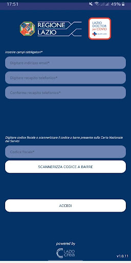
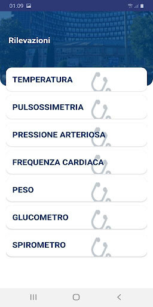
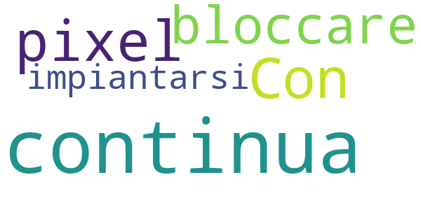
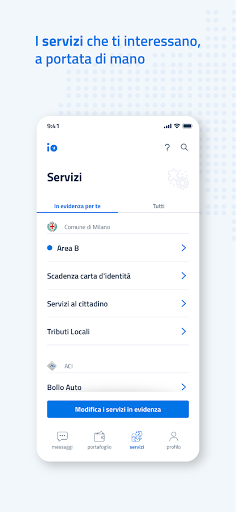
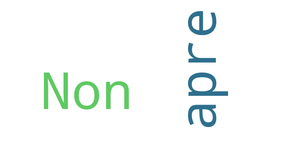

# COVID-related Android apps in Italy

Author: `Ivano Malavolta` (ivanomalavolta@gmail.com)

Created at: `2021/5/22`

Report generated by the [covid-apps-observer](http://github.com/covid-apps-observer) project, version 0.1

# Table of contents 

- [Background](#background)
    * [Data sources and analyses](#data-sources-and-analyses)
        * [App metadata](#app-metadata)
        * [Requested permissions](#requested-permissions)
        * [Mentioned servers](#mentioned_servers)
        * [Security analysis](#security_analysis)
        * [User ratings and reviews](#user-ratings-and-reviews)
    * [Disclaimer](#disclaimer)
- [SM_Covid19](#sm_covid19)
- [allertaLOM](#allertalom)
- [LAZIOdrCovid](#laziodrcovid)
- [SiciliaSiCura](#siciliasicura)
- [Covid-19](#covid-19)
- [WHO Info](#who-info)
- [OpenWHO: Knowledge for Health Emergencies](#openwho-knowledge-for-health-emergencies)
- [Immuni](#immuni)
- [Sardegna Sicura](#sardegna-sicura)
- [SOS COVID-19](#sos-covid-19)
- [TreCovid19](#trecovid19)
- [ADiLife C-19](#adilife-c-19)
- [IO, l'app dei servizi pubblici](#io-l'app-dei-servizi-pubblici)
- [Apss CV-19 (operatori sanitari)](#apss-cv-19-(operatori-sanitari))
- [PC Alta Langa](#pc-alta-langa)

- [Credits](#credits)

# How to read this report

This report has been generated by the [covid-apps-observer](http://github.com/covid-apps-observer) project. The project automatically analyzes the apps by extracting information which is already publicly available either on the web or in the apps binary files. 

Our analysis covers the following apps:
| | |
|-------------------------|-------------------------| 
|  | SM_Covid19
|  | allertaLOM
|  | LAZIOdrCovid
|  | SiciliaSiCura
|  | Covid-19
|  | WHO Info
|  | OpenWHO: Knowledge for Health Emergencies
|  | Immuni
|  | Sardegna Sicura
|  | SOS COVID-19
|  | TreCovid19
|  | ADiLife C-19
|  | IO, l'app dei servizi pubblici
|  | Apss CV-19 (operatori sanitari)
|  | PC Alta Langa

The details of our analysis are presented in the remainder of this report.

For independent verification, the raw data and the source code of the project is publicly available in its GitHub repository [http://github.com/covid-apps-observer](http://github.com/covid-apps-observer) and its source code has been thoroughly commented in order to provide all the details about how the information provided in this report has been extracted. 

Any feedback, questions, and improvements about the project are very welcome, feel free to create an issue or pull request directly in its GitHub repository: [http://github.com/covid-apps-observer](http://github.com/covid-apps-observer).

## Data sources and analyses

The analysis of each app is structured around five main dimensions: 
* App metadata  
* Requested permissions
* Mentioned servers
* Androwarn analysis
* User ratings and reviews

In the following we describe the data sources and analysis performed for each dimension.

### App metadata

App metadata includes an overview of the main information about the app (for example, its name, releases, privacy policy, etc.), contact information of the development team, and the various Android versions supported by the app. This information is extracted from two main data sources:
* _Google Play store_: we automatically mined the web page of the Google Play store showing the basic information about the app and we parsed it in order to extract information about the app and development team 
* _Android Manifest file_: in our analysis we decompiled the binary file of the app (it is similar to a Zip archive but it contains the code of the app instead of normal files) and we extracted information about the supported Android versions, as it has been listed by its development team.

The extracted app metadata feeds the _App overview_, _Development team_, and _Android support_ sections of this report.
We make use of the [google-play-scraper](https://github.com/JoMingyu/google-play-scraper) tool for extracting the raw data related to this dimension of the project.

### Requested permissions

The Android operating system has a permission model which allows users to grant access to potentially privacy-related information. Every Android app has to explictly declare the permissions it needs to properly function in the Android Manifest file.  

In this report we also show the protection level of each permission, which is a key information for understanding how the requested permissions related to the user's privacy. We carefully analyzed the [official Android documentation (v. 29)](https://developer.android.com/reference/android/Manifest.permission), and it resulted that a permission requested by an Android app can belong to the following protection levels:
* **Dangerous**: higher-risk permissions that would give a requesting app access to private user data or control over the device that can negatively impact the user. Because this type of permission introduces potential risk, the system usually does not automatically grant it to the requesting app. For example, any dangerous permissions requested by an app may be displayed to the user and require confirmation before proceeding.
* **Normal**: this is the default and most common level in Android; normal permissions are lower-risk and give access to isolated app-level features, with minimal risk to other apps, the system, or the user. 
* **Signature**: permissions granted only if the requesting app is signed with the same certificate as the app that declared the permission
* **Appop**: old permission level, a reminiscence of the App Ops tool that Google introduced in Android 4.3.
* **Development**: optional permissions which can be granted to development-oriented apps.
* **Privileged**: permissions who give higher power to mobile apps w.r.t. other apps, such as binding to incoming calls, interacting via bluetooth with other devices without user interaction, etc.
* **Preinstalled**: reserved only for preinstalled apps
* **Installer**: allow the holder to start the permission usage screen for an app
* **RetailDemo**: permissions related to devices used in demonstrations in shops.
* **Pre23**: permissions automatically granted to apps targeting devices running pre-6.0 Android.
* **Upcoming**: permissions which will be released in the next version of the Android platform. 
* **Deprecated**: permissions belonging to old releases of the Android platform, they should not be used by developers since they will not be supported in the near future.
* **Not for use by third-party applications**: permissions which can be requested only by apps developed by Google.
* **Undefined**: this protection level is not documented by Google.

The permissions dimension of this project is based on the [Androguard](https://github.com/androguard/androguard) static analysis tool.

### Mentioned servers

We decompiled each app in order to look for all possible mentions of remote URLs. The mentioned URLs can refer to remote servers the the app is using for either sending or receiving information, web addresses for directing the user to an information website, and so on. 

:warning: It is important to note that this analysis is not meant to be complete and it is very prone to obfuscation. The servers reported here are simply _mentioned_ somewhere in the code of the app and are meant to just give an indication about the "hooks" of the app towards external resources. For example, for an Android app it is normal to contact Google services in order to send/receive push notifications, or to contact the servers of analytics services for having real-time diagnostics about crashes of the app or bugs.

This part of the analysis is based on the [Androguard](https://github.com/androguard/androguard) static analysis tool for identfying the raw URLs mentioned in the app; then, the information about each mentioned server is collected by performing a _whois_ lookup on the first-level domain present in the URL.

### Security analysis

This dimension is based on the [Androwarn](https://github.com/maaaaz/androwarn) structural and data flow analysis of Android bytecode. Androwarn is developed by the University of Lyon/INSA (France) and it has been used in several academic studies. According to its documentation, Androwarn targets the following categories of potential security issues:
* **Telephony identifiers exfiltration**: IMEI, IMSI, MCC, MNC, LAC, CID, operator's name, etc.
* **Device settings exfiltration**: software version, usage statistics, system settings, logs, etc.
* **Geolocation information leakage**: GPS/WiFi geolocation, etc.
* **Connection interfaces information exfiltration**: WiFi credentials, Bluetooth MAC adress, etc.
* **Telephony services abuse**: premium SMS sending, phone call composition, etc.
* **Audio/video flow interception**: call recording, video capture, etc.
* **Remote connection establishment**: socket open call, Bluetooth pairing, APN settings edit, etc.
* **PIM data leakage**: contacts, calendar, SMS, mails, clipboard, etc.
* **External memory operations**: file access on SD card, etc.
* **PIM data modification**: add/delete contacts, calendar events, etc.
* **Arbitrary code execution**: native code using JNI, UNIX command, privilege escalation, etc.
* **Denial of Service**: event notification deactivation, file deletion, process killing, virtual keyboard disable, terminal shutdown/reboot, etc.

Note: We do not consider this data point in the current version of our analyzers since it is too verbose for our purposes.

:warning: It is important to note that Androwarn is a static analysis tool, and as such it performs a variety of heuristics and approximations in its analyses. Said that, the results shown in this report are meant to provide an indication of _potential_ security issues and should be by no means treated as complete and correct.   

### User ratings and reviews

For this dimension we turn again to the web interface of the Google Play store. Firstly, we automatically mine summary statistics about user ratings from the web page of the app under analysis; then, we automatically download the newest 1000 reviews of the app under analysis. For each level of rating (5 stars, 4 stars, , etc., 1 star) we show:
- a word cloud presenting the main terms used by end users in their reviews in the Google Play store
- the last 10 reviews provided by app users in the Google Play store. 

This purposefully simple analysis is meant to help both future users and the development team of the app in understanding what are the main positive and negative points of the app under analysis.

We make use of the [google-play-scraper](https://github.com/JoMingyu/google-play-scraper) tool for extracting the raw data related to this dimension of the project.

## Disclaimer 

This report has been produced independently of any parties and its only objective is to help anybody in better understanding how COVID-related apps work in practice (and compare to each other). The results of this report are limited to the specific version of the software used for running the analyses and on the various heuristics implemented in there. In other words, the results of the analyzers may differ depending on the time and modalities in which they are executed. We do not guarantee that the results of the analyses and the corresponding contents of this report are fully complete or correct. The analysis software is licensed under the [MIT License](https://github.com/iivanoo/covid-apps-observer/blob/master/LICENSE).

# SM_Covid19
App version ``5.1``

Analyzed with [covid-apps-observer](http://github.com/covid-apps-observer) project, version ``0.1``

## App overview
| | |
|-------------------------|-------------------------| 
| **Name**&nbsp;&nbsp;&nbsp;&nbsp;&nbsp;&nbsp;&nbsp;&nbsp;&nbsp;&nbsp;&nbsp;&nbsp;&nbsp;&nbsp;&nbsp;&nbsp;&nbsp;&nbsp;&nbsp;&nbsp;&nbsp;&nbsp;&nbsp;&nbsp;&nbsp;&nbsp;&nbsp;&nbsp;&nbsp;&nbsp;&nbsp;&nbsp;&nbsp;&nbsp;&nbsp;&nbsp;&nbsp;&nbsp;&nbsp;&nbsp;  | SM_Covid19 |
| **Unique identifier** | it.softmining.projects.covid19.savelifestyle |
| **Link to Google Play** | [https://play.google.com/store/apps/details?id=it.softmining.projects.covid19.savelifestyle](https://play.google.com/store/apps/details?id=it.softmining.projects.covid19.savelifestyle) |
| **Summary**  | Community di Contact Tracing volontario per la sfida al Covid19. |
| **Privacy policy** | [https://www.softmining.it/index.php/sm-covid19-app/](https://www.softmining.it/index.php/sm-covid19-app/) |
| **Latest version** | 5.1 |
| **Last update** | 2020-07-17 16:52:14 |
| **Recent changes** | Bug fix per Huawei |
| **Installs**  | 50.000+ |
| **Category** | Salute e fitness |
| **First release** | 12 apr 2020 |
| **Size**  | 4,8M |
| **Supported Android version**  | 5.0 e versioni successive |

### Description
> Sm-Covid-19 ti permette di tenere sotto controllo il tuo "Indice dei Contatti", ovvero una stima numerica con valori da 0 a 100 che cresce e decresce a seconda del numero (e del tipo) di contatti rilevati nelle ultime 24 ore. Il calcolo dell'indice avviene ogni ora.  Il valore "Indice dei Contatti" è una stima che può aiutarti a capire se durante la fase 2 stai avendo troppi contatti. 
 Questa App è stata sviluppata e viene costantemente aggiornata con l'obiettivo di valutare (attraverso la definizione di modelli statistici e matematici) il rischio di trasmissione (e il comportamento epidemico) del virus attraverso il monitoraggio:
 - del numero dei contatti
 - della durata dei contatti;
 - della distanza presente tra i contatti rilevati rispetto alla durata del contatto.
 Sm-Covid-19 è in grado di rilevare l'App Immuni in modo da aumentare la precisione dei modelli matematici.
 Sm-Covid-19 non acquisisce dati personali ne dati sanitari: Ti preghiamo di visualizzare il video introduttivo per avere maggiori dettagli sullo scopo e sul funzionamento di questa App. 
 Se desideri maggiori dettagli tecnici sul funzionamento di Sm-Covid-19 puoi visitare questo link: https://www.smcovid19.org/recover/
 Sm-Covid-19 non acquisisce dati sensibili dell’utente (ne ha bisogno di tali dati per funzionare).
 Il modulo di auto-segnalazione è stato rimosso in quanto la funzionalità non sarà gestita da Sm-Covid-19.
 Durante la fase 2, cercheremo di acquisire un gran numero di utenti attivi, per poter migliorare i modelli di stima del contagio: Al momento siamo una piccola community di 40.000 volontari, ma per poter eseguire calcoli statistici precisi ti chiediamo di aiutarci a diffondere l'App tra tutti i tuoi contatti, sopratutto quelli con i quali presumibilmente potresti entrare in contatto durante la fase 2.
 Ci teniamo a ricordarti che SOLO le autorità sanitarie possono indicare la positività di un soggetto. Poiché IMMUNI sarà l'app ufficiale di contact tracing Italiana, abbiamo rimosso il modello di calcolo dell'"Indice di Rischio". L'APP mostrerà solo un Indice di Contatto che aumenterà e diminuirà in base al numero di contatti efficaci rilevati. 
 I valori indicati in Sm-Covid-19 NON possono essere considerate diagnosi di positività o negatività al Covid-19: Lo scopo di questa APP è di generare modelli rappresentativi del contagio (modelli matematici) e statistiche accurate.
 L’utente non viene geo-localizzato, né viene reso riconoscibile, salvo nel caso in cui esso stesso decida di condividere di suo spontanea volontà i dati GPS attraverso il menù Impostazioni -> Abilita condivisione dati GPS.  
 I dati GPS verranno registrati SOLO quando verranno rilevati dei contatti. Se nessun utente viene rilevato nei dintorni, nessun dato viene acquisito. È possibile disabilitare in qualsiasi momento l'acquisizione dei dati GPS. 
 Le informazioni acquisite (solo numero, tipo di contatto, distanza e dati GPS se abilitati) saranno condivise con la comunità scientifica e sotto forma di open-data. I dati sono anonimi, tuttavia applichiamo tecniche di shuffle e cifratura degli ID random acquisiti prima di pubblicare open-data.
 Sm-Covid-19 è stata sviluppata e viene manutenuta senza fini economici né di acquisizione di dati sensibili. 
 Sm-Covid-19 non può essere considerata sostitutiva di una diagnosi medica.

### User interface
The developers of the app provide the following screenshots in the Google play store.
| | | |
|:-------------------------:|:-------------------------:|:-------------------------:|
 |   |   |   | 
 |   |  

## Development team
In the following we report the main information provided by the development team in the Google play store.

| | |
|-------------------------|-------------------------|
| **Developer**  | Softmining Srl |
| **Website**  | [https://www.smcovid19.org/](https://www.smcovid19.org/) |
| **Email** | smcovid19@softmining.it |
| **Physical address**  | [Via Tenente Corrado 22 - 83100 Avellino - Italia](https://www.google.com/maps/search/Via%20Tenente%20Corrado%2022%20-%2083100%20Avellino%20-%20Italia) (Google Maps) |
| **Other developed apps**  | [https://play.google.com/store/apps/developer?id=Softmining+Srl](https://play.google.com/store/apps/developer?id=Softmining+Srl) |

## Android support

| | |
|-------------------------|-------------------------|
| **Declared target Android version**  | Android10, version 10 (API level 29) |
| **Effective target Android version**  | Android10, version 10 (API level 29) |
| **Minimum supported Android version**  | Lollipop, version 5.0 (API level 21) |
| **Maximum target Android version**  | - |

The larger the difference between the minimum and maximum supported Android versions, the better. A larger difference means a wider audience. For example, old phones have a very low Android version, so a high minimum supported Android version means that the app cannot be used by users with old phones, thus leading to accessibility problems. 

## Requested permissions

In the following we report the complete list of the permissions requested by the app. 

| **Permission** | **Protection level** | **Description** | 
|-------------------------|-------------------------|-------------------------|
 **android.permission ACCESS_BACKGROUND_LOCATION** | :warning:**Dangerous** | Allows an app to access location in the background. 
 **android.permission ACCESS_COARSE_LOCATION** | :warning:**Dangerous** | Allows an app to access approximate location. 
 **android.permission ACCESS_FINE_LOCATION** | :warning:**Dangerous** | Allows an app to access precise location. 
 **android.permission ACCESS_NETWORK_STATE** | Normal | Allows applications to access information about networks. 
 **android.permission BLUETOOTH** | Normal | Allows applications to connect to paired bluetooth devices. 
 **android.permission BLUETOOTH_ADMIN** | Normal | Allows applications to discover and pair bluetooth devices. 
 **android.permission FOREGROUND_SERVICE** | Normal | Allows a regular application to use Service.startForeground. 
 **android.permission INTERNET** | Normal | Allows applications to open network sockets. 
 **android.permission READ_APP_BADGE** | - | - 
 **android.permission READ_EXTERNAL_STORAGE** | :warning:**Dangerous** | Allows an application to read from external storage. 
 **android.permission RECEIVE_BOOT_COMPLETED** | Normal | Allows an application to receive the Intent.ACTION_BOOT_COMPLETED that is broadcast after the system finishes booting. 
 **android.permission REQUEST_IGNORE_BATTERY_OPTIMIZATIONS** | Normal | Permission an application must hold in order to use Settings.ACTION_REQUEST_IGNORE_BATTERY_OPTIMIZATIONS. 
 **android.permission SYSTEM_ALERT_WINDOW** | Signature - preinstalled - appop - pre23 - development | Allows an app to create windows using the type WindowManager.LayoutParams.TYPE_APPLICATION_OVERLAY, shown on top of all other apps. 
 **android.permission USE_FULL_SCREEN_INTENT** | Normal | Required for apps targeting Build.VERSION_CODES.Q that want to use notification full screen intents. 
 **android.permission VIBRATE** | Normal | Allows access to the vibrator. 
 **android.permission WAKE_LOCK** | Normal | Allows using PowerManager WakeLocks to keep processor from sleeping or screen from dimming. 
 **android.permission WRITE_EXTERNAL_STORAGE** | :warning:**Dangerous** | Allows an application to write to external storage. 
 **com.anddoes.launcher.permission UPDATE_COUNT** | - | - 
 **com.google.android.c2dm.permission RECEIVE** | - | - 
 **com.google.android.finsky.permission BIND_GET_INSTALL_REFERRER_SERVICE** | - | - 
 **com.htc.launcher.permission READ_SETTINGS** | - | - 
 **com.htc.launcher.permission UPDATE_SHORTCUT** | - | - 
 **com.huawei.android.launcher.permission CHANGE_BADGE** | - | - 
 **com.huawei.android.launcher.permission READ_SETTINGS** | - | - 
 **com.huawei.android.launcher.permission WRITE_SETTINGS** | - | - 
 **com.huawei.permission.external_app_settings USE_COMPONENT** | - | - 
 **com.majeur.launcher.permission UPDATE_BADGE** | - | - 
 **com.oppo.launcher.permission READ_SETTINGS** | - | - 
 **com.oppo.launcher.permission WRITE_SETTINGS** | - | - 
 **com.sec.android.provider.badge.permission READ** | - | - 
 **com.sec.android.provider.badge.permission WRITE** | - | - 
 **com.sonyericsson.home.permission BROADCAST_BADGE** | - | - 
 **com.sonymobile.home.permission PROVIDER_INSERT_BADGE** | - | - 
 **it.softmining.projects.covid19.savelifestyle.permission C2D_MESSAGE** | - | - 
 **me.everything.badger.permission BADGE_COUNT_READ** | - | - 
 **me.everything.badger.permission BADGE_COUNT_WRITE** | - | - 
 **oppo.permission OPPO_COMPONENT_SAFE** | - | - 

## Mentioned servers

| **Server** | **Registrant** | **Registrant country** | **Creation date** | 
|-------------------------|-------------------------|-------------------------|-------------------------|
 | googlesyndication.com | Google LLC | :us: US | 2003-01-21 06:17:24 |
 | google.com | Google LLC | :us: US | 1997-09-15 04:00:00 |
 | googleadservices.com | Google LLC | :us: US | 2003-06-19 16:34:53 |
 | app-measurement.com | Google LLC | :us: US | 2015-06-19 20:13:31 |
 | onesignal.com | Domains By Proxy, LLC | :us: US | 2011-09-10 18:40:52 |
 | smcovid19.org | Data Protected | :canada: CA | 2020-03-31 21:30:24 |
 | softmining.it | SOFTMINING S.R.L. | :it: IT | 2017-10-16 19:27:28 |
 | governo.it | Presidenza del Consiglio dei Ministri | :it: IT | 2000-01-24 00:00:00 |
 | githubusercontent.com | GitHub, Inc. | :us: US | 2014-02-06 21:17:00 |
 | amazonaws.com | Amazon.com, Inc. | :us: US | 2005-08-18 02:10:45 |
 | crashlytics.com | Google LLC | :us: US | 2011-01-21 15:30:40 |

## Security analysis 

Below we report the main security warnings raised by our execution of the [Androwarn](https://github.com/maaaaz/androwarn) security analysis tool.

**Telephony identifiers leakage**
> - This application reads the numeric name (MCC+MNC) of current registered operator 
> - This application reads the operator name 

**Connection interfaces exfiltration**
> - This application reads details about the currently active data network 

**Telephony services abuse**
> - This application makes phone calls 

**Suspicious connection establishment**
> - This application opens a Socket and connects it to the remote address 'Ld/a/a/a/a;->f(Ljava/lang/String;)Ljava/lang/StringBuilder;' on the 'N/A' port  
> - This application opens a Socket and connects it to the remote address 'Ljava/net/Proxy;->type()Ljava/net/Proxy$Type;' on the 'N/A' port  
> - This application opens a Socket and connects it to the remote address 'hostname == null ' on the 'N/A' port  
> - This application opens a Socket and connects it to the remote address 'timeout' on the 'N/A' port  

**Code execution**
> - This application executes a UNIX command containing this argument: 'Ljava/lang/StringBuilder;->toString()Ljava/lang/String;' 

## User ratings and reviews

Below we provide information about how end users are reacting to the app in terms of ratings and reviews in the Google Play store.

### Ratings

The SM_Covid19 app has been installed by more than **50000** times. At this time, **764** rated the app and its average score is **4.01**. Below we show the distribution of the ratings across the usual star-based rating of Google Play

:star::star::star::star::star:: 412

:star::star::star::star:: 152

:star::star::star:: 76

:star::star:: 38

:star:: 84

### Reviews 

#### 5-star reviews

> Ottima app  :date: __2021-01-17 03:55:29__

> Affidabile buono  :date: __2020-12-10 12:23:55__

> App molto utile  :date: __2020-11-27 11:04:32__

> Ooooooo my God é molto utile  :date: __2020-11-16 19:30:59__

> Immuni  :date: __2020-11-01 16:23:28__

> Ottima Grazie  :date: __2020-10-26 15:50:55__

> Eccezionale  :date: __2020-10-13 11:33:09__

> Per sapere se qualcuno in casa ha il VIRUS COME faccio a sapere. ?  :date: __2020-10-11 16:34:58__

> Molto interessante  :date: __2020-10-11 10:26:42__

> E utile e ti da una certa sicurezza oltre a livello di prevenzione anche un a livello psicologico e un ottima applicazione  :date: __2020-10-10 23:22:43__

#### 4-star reviews

> Buona  :date: __2021-03-27 12:30:24__

> Ottimo  :date: __2020-10-17 20:24:12__

> Buona e facile da usare  :date: __2020-10-10 11:21:08__

> Facile  :date: __2020-10-08 13:38:48__

> Non ho avuto ancora esperienze  :date: __2020-08-24 15:38:20__

> Mi dicete come funziona? Mi dice indice contatti 0,00%  :date: __2020-08-23 19:29:43__

> Positiva  :date: __2020-07-31 14:48:10__

> 4Stelle e non 5 perché dopo l'ultimo aggiornamento 5.0 l'applicazione va in crash alla apertura...parte e subito all'istante si chiude.Ho disinstallato e reinstallato l'applicazione e cosí facendo ho risolto il bug. HUAWEI P20 PRO android 10  :date: __2020-07-19 11:54:17__

> Buona  :date: __2020-07-17 20:36:04__

> App molto utili  :date: __2020-07-01 13:08:36__

#### 3-star reviews

> Non capisco  :date: __2020-11-10 20:57:14__

> Questa app è sicura come quella governativa?  :date: __2020-10-20 14:31:12__

> Se non attivano tutti, il bluetooth e il gps, l' utilità è solo parziale.  :date: __2020-10-07 17:36:45__

> Aspetto di usarla e vederne il responso per dare una valutazione più attinente. Faccio notare una mancanza tra le categorie indicate... Mancano le forze dell'ordine, forse meno a rischio dei medici/infermieri/OSS ma categoria a rischio per servizio.  :date: __2020-09-16 14:09:22__

> Sembra ok, ma vorrei sapere il calibra BLE quanto deve essere il valore?toccando lo scudo blu non succede nulla.  :date: __2020-09-06 17:57:00__

> Pro:è compatibile anche con dispositivi più datati; è comoda per tenere sotto controllo il numero dei casi. Contro: è un po' troppo invasiva (chiede troppi permessi); troppe notifiche; consuma più batteria dell'altra app (Immuni).  :date: __2020-08-28 18:08:29__

> Dovrebbero installarla tutti per essere più efficace  :date: __2020-07-27 11:38:34__

> Dopo l'aggiornamento del 13 luglio è diventata instabile e si chiude in continuazione  :date: __2020-07-16 14:24:48__

> Ancora in prova  :date: __2020-07-11 09:41:40__

> Nessuna esperinsa  :date: __2020-07-08 21:44:00__

#### 2-star reviews

> Inizialmente tutto ok,adesso non funziona più,premo sullo scudo per aggiornare la percentuale di contagio e rimane a zero,in una sala d'aspetto con 15 persone! così è inutile esattamente come immuni!  :date: __2021-04-22 08:52:53__

> Disinstallata troppo invasiva  :date: __2021-02-12 14:06:24__

> Stronzata vorrei sapere a cosa serve  :date: __2021-01-30 19:35:44__

> Troppi permessi... Non si poteva fare un'applicazione senza tutte ste richieste?  :date: __2020-09-17 22:19:23__

> Per ora va bene, io non ho molti contatti con l'estero comunque  :date: __2020-07-06 11:35:49__

> Non serve a gran che visto che ho incrociato positivi e loro non avevano l'app  :date: __2020-06-26 08:05:34__

> Non buona. Troppo evanescente  :date: __2020-06-22 10:28:01__

> Dam pl v  :date: __2020-06-22 09:47:34__

> Cosa significa quando mette 0,e poi un tot di numeri dopo?  :date: __2020-06-20 18:27:25__

> Qusta app vale 2 stele  :date: __2020-06-17 18:12:17__

#### 1-star reviews

> Mi hanno detto di scaricare questa applicazione per vedere l'esito del tampone,ma non riesco.come si fa??  :date: __2021-02-05 13:58:01__

> 🔴 Aumentate invece posti letto, posti per medici e infermieri. Garantite un servizio sanitario DEGNO di essere umani. Invece di "tracciare i contatti" inutilmente.  :date: __2021-01-30 17:19:36__

> Pessima app  :date: __2020-12-27 23:16:46__

> Inutile. Qualunque app di tracciamento al di fuori di immuni è inutile e anzi dannosa in quanto divide gli utenti che vanno tracciati usando4una unica app nazionale unificata.  :date: __2020-12-10 10:44:31__

> Decerebrati  :date: __2020-12-04 11:55:01__

> Opzione anti assembramento.avvisa se ci sono meno di tot persone.dovrebbe segnare il superamento di tot persone.  :date: __2020-11-24 06:34:30__

> Non funziona  :date: __2020-11-17 22:27:14__

> Poco attendibile visto che 2 cell. stessa marca stessa persona stesso ambiente,risultati molto diversi.  :date: __2020-11-11 09:55:51__

> Come faccio entrare se ultimontasto rosso non si ttasforma in verde clicco ok ma non succede nulla cosa è un bidone?  :date: __2020-11-04 16:36:37__

> Ottimo  :date: __2020-10-20 16:15:04__

# allertaLOM
App version ``1.7.2``

Analyzed with [covid-apps-observer](http://github.com/covid-apps-observer) project, version ``0.1``

## App overview
| | |
|-------------------------|-------------------------| 
| **Name**&nbsp;&nbsp;&nbsp;&nbsp;&nbsp;&nbsp;&nbsp;&nbsp;&nbsp;&nbsp;&nbsp;&nbsp;&nbsp;&nbsp;&nbsp;&nbsp;&nbsp;&nbsp;&nbsp;&nbsp;&nbsp;&nbsp;&nbsp;&nbsp;&nbsp;&nbsp;&nbsp;&nbsp;&nbsp;&nbsp;&nbsp;&nbsp;&nbsp;&nbsp;&nbsp;&nbsp;&nbsp;&nbsp;&nbsp;&nbsp;  | allertaLOM |
| **Unique identifier** | it.lispa.sire.app.mobile.allertalom |
| **Link to Google Play** | [https://play.google.com/store/apps/details?id=it.lispa.sire.app.mobile.allertalom](https://play.google.com/store/apps/details?id=it.lispa.sire.app.mobile.allertalom) |
| **Summary**  | L’app della Protezione Civile di Regione Lombardia che allerta in tempo reale |
| **Privacy policy** | [http://www.allertalom.regione.lombardia.it/privacyapp](http://www.allertalom.regione.lombardia.it/privacyapp) |
| **Latest version** | 1.7.2 |
| **Last update** | 2021-03-26 17:21:09 |
| **Recent changes** | Aggiornamento del sistema di gestione delle notifiche per la ricezione delle Allerte di Protezione Civile sui rischi naturali. Aggiunta delle “note sulla previsione” nella pagina con la mappa di Regione Lombardia. |
| **Installs**  | 500.000+ |
| **Category** | Meteo |
| **First release** | 11 dic 2019 |
| **Size**  | 9,6M |
| **Supported Android version**  | 5.0 e versioni successive |

### Description
> allertaLOM è l’App di Regione Lombardia che permette di ricevere le allerte di Protezione Civile emesse dal Centro Funzionale Monitoraggio Rischi naturali di Regione Lombardia, in previsione di eventi naturali con possibili danni sul territorio.
 allertaLOM, in occasione dell’emergenza Coronavirus in Lombardia, si è evoluta in uno strumento di partecipazione attiva della cittadinanza al monitoraggio della diffusione del virus e in un canale di informazioni aggiornate sulle disposizioni regionali in materia, attraverso due nuove funzionalità:
 •	CercaCovid – la partecipazione al sondaggio CercaCovid permette a Regione Lombardia di quantificare il livello di diffusione del contagio e la distribuzione territoriale della positività, sulla base dei sintomi segnalati dagli utenti. I dati raccolti servono per analisi statistiche ed epidemiologiche, fondamentali per aiutare le autorità sanitarie a definire modelli e strategie di contrasto al Coronavirus. Il questionario è volontario, completamente anonimo, non prevede alcuna geolocalizzazione e non sostituisce una valutazione medica delle proprie condizioni. Partecipare è importante, anche in assenza di sintomi: più dati si ricevono, più il quadro della situazione è preciso. 
 •	Notifiche sull’emergenza Coronavirus in Lombardia - sono state attivate notifiche push con il link alla pagina del portale istituzionale che contiene gli aggiornamenti sul tema. Le notifiche possono essere disattivate dall'utente nell'apposita sezione. 
 Scarica l’App per:
 •	partecipare al monitoraggio attivo della diffusione del Coronavirus;
 •	ricevere informazioni aggiornate sulle azioni intraprese da Regione Lombardia per l’emergenza Coronavirus 
 •	personalizzare la ricezione delle notifiche sulle ultime disposizioni regionali riguardanti l’emergenza Coronavirus
 •	restare sempre aggiornato sulle allerte di Protezione Civile in Lombardia;
 •	monitorare la situazione di allerta sui Comuni preferiti oppure su tutta la regione;
 •	seguire l’evoluzione su mappa dei li-velli di allerta nell’arco di 36 ore;
 •	personalizzare la ricezione delle notifiche su tutti i rischi naturali oppure sui singoli rischi;
 •	ricevere notifiche all’emissione di allerte nei Comuni preferiti sui rischi prescelti;
 •	scaricare e consultare i documenti di allerta
 Come funziona l’allertamento di Protezione civile in Regione Lombardia
 •	Le allerte riguardano i rischi naturali prevedibili (idrogeologico, idraulico, temporali forti, vento forte, neve, valanghe e incendi boschivi) e presentano livelli crescenti di criticità (codice verde, giallo, arancione, rosso) a seconda della gravità ed estensione dei fenomeni. I documenti di allerta sono destinati al sistema locale di Protezione Civile e forniscono indicazioni per attivare le misure di contrasto previste nei Piani Comunali di Protezione Civile. Per i cittadini, le allerte sono uno strumento per sapere quando adottare le misure di auto-protezione, seguendo le indicazioni dell’Autorità locale di Protezione Civile. Per maggiori informazioni, consultare la pagina sulle allerte sul Portale di Regione Lombardia.

### User interface
The developers of the app provide the following screenshots in the Google play store.
| | | |
|:-------------------------:|:-------------------------:|:-------------------------:|
 |   |   |   | 
 |   |   |   | 
 |   |   |   | 
 |   |   |   | 
 |   |   |   | 
 |   |   |   | 
 |   |   |   | 
 |   |   |   | 

## Development team
In the following we report the main information provided by the development team in the Google play store.

| | |
|-------------------------|-------------------------|
| **Developer**  | Regione Lombardia |
| **Website**  | [http://www.allertalom.regione.lombardia.it](http://www.allertalom.regione.lombardia.it) |
| **Email** | info.allertalom@ariaspa.it |
| **Physical address**  | [Piazza Città di Lombardia 1 - 20124 Milano (Italia)](https://www.google.com/maps/search/Piazza%20Città%20di%20Lombardia%201%20-%2020124%20Milano%20(Italia)) (Google Maps) |
| **Other developed apps**  | [https://play.google.com/store/apps/developer?id=Regione+Lombardia](https://play.google.com/store/apps/developer?id=Regione+Lombardia) |

## Android support

| | |
|-------------------------|-------------------------|
| **Declared target Android version**  | Pie, version 9 (API level 28) |
| **Effective target Android version**  | Pie, version 9 (API level 28) |
| **Minimum supported Android version**  | Lollipop, version 5.0 (API level 21) |
| **Maximum target Android version**  | - |

The larger the difference between the minimum and maximum supported Android versions, the better. A larger difference means a wider audience. For example, old phones have a very low Android version, so a high minimum supported Android version means that the app cannot be used by users with old phones, thus leading to accessibility problems. 

## Requested permissions

In the following we report the complete list of the permissions requested by the app. 

| **Permission** | **Protection level** | **Description** | 
|-------------------------|-------------------------|-------------------------|
 **android.permission ACCESS_NETWORK_STATE** | Normal | Allows applications to access information about networks. 
 **android.permission CALL_PHONE** | :warning:**Dangerous** | Allows an application to initiate a phone call without going through the Dialer user interface for the user to confirm the call. 
 **android.permission GET_ACCOUNTS** | :warning:**Dangerous** | Allows access to the list of accounts in the Accounts Service. 
 **android.permission INTERNET** | Normal | Allows applications to open network sockets. 
 **android.permission READ_EXTERNAL_STORAGE** | :warning:**Dangerous** | Allows an application to read from external storage. 
 **android.permission WAKE_LOCK** | Normal | Allows using PowerManager WakeLocks to keep processor from sleeping or screen from dimming. 
 **android.permission WRITE_EXTERNAL_STORAGE** | :warning:**Dangerous** | Allows an application to write to external storage. 
 **com.google.android.c2dm.permission RECEIVE** | - | - 
 **it.lispa.sire.app.mobile.allertalom.permission C2D_MESSAGE** | - | - 

## Mentioned servers

| **Server** | **Registrant** | **Registrant country** | **Creation date** | 
|-------------------------|-------------------------|-------------------------|-------------------------|
 | googlesyndication.com | Google LLC | :us: US | 2003-01-21 06:17:24 |
 | google.com | Google LLC | :us: US | 1997-09-15 04:00:00 |
 | app-measurement.com | Google LLC | :us: US | 2015-06-19 20:13:31 |
 | gstatic.com | Google LLC | :us: US | 2008-02-11 15:31:25 |
 | whatsapp.com | WhatsApp LLC | :us: US | 2008-09-04 12:39:12 |

## Security analysis 

Below we report the main security warnings raised by our execution of the [Androwarn](https://github.com/maaaaz/androwarn) security analysis tool.

**Telephony identifiers leakage**
> - This application reads the device phone type value 

**Connection interfaces exfiltration**
> - This application reads details about the currently active data network 
> - This application tries to find out if the currently active data network is metered 

**Telephony services abuse**
> - This application makes phone calls 

**Suspicious connection establishment**
> - This application opens a Socket and connects it to the remote address '' on the 'N/A' port  
> - This application opens a Socket and connects it to the remote address 'Ljava/lang/StringBuilder;->toString()Ljava/lang/String;' on the ': connect, resolve' port  
> - This application opens a Socket and connects it to the remote address 'Ljava/lang/StringBuilder;->toString()Ljava/lang/String;' on the 'N/A' port  
> - This application opens a Socket and connects it to the remote address 'Ljava/net/Proxy;->type()Ljava/net/Proxy$Type;' on the 'N/A' port  
> - This application opens a Socket and connects it to the remote address 'timeout' on the 'N/A' port  

**Code execution**
> - This application loads a native library: 'sqlc-native-driver' 
> - This application loads a native library: 'tool-checker' 
> - This application executes a UNIX command 
> - This application executes a UNIX command containing this argument: 'getprop' 
> - This application executes a UNIX command containing this argument: 'mount' 

## User ratings and reviews

Below we provide information about how end users are reacting to the app in terms of ratings and reviews in the Google Play store.

### Ratings

The allertaLOM app has been installed by more than **500000** times. At this time, **4081** rated the app and its average score is **3.6617646**. Below we show the distribution of the ratings across the usual star-based rating of Google Play

:star::star::star::star::star:: 1631

:star::star::star::star:: 980

:star::star::star:: 500

:star::star:: 400

:star:: 570

### Reviews 

#### 5-star reviews

> Ottima  :date: __2021-05-07 09:15:59__

> App fantastica: sono felicissimo, così si riuscirà a contenere il virus ed evitare che le classi finiscano in quarantena per l'ennesima volta come la mia... non ne potevo più di sentirmi inutile e non servire a niente a parte stare ai regolamenti, invece adesso posso aiutare più di 60 milioni di persone...  :date: __2021-04-29 21:38:24__

> Oggi 24 Aprile 2021, NON si apre il collegamento "alla pagina", riguardo le ultime comunicazioni Regionali per il colore e, le novità del nuovo Decreto Regione Lombardia. Potete fare qualcosa? Grazie. * Problema risolto! Grazie agli sviluppatori per la risposta.  :date: __2021-04-28 14:38:16__

> L'applicazione insiste a dirmi di essere aggiornata, io controllo ma di aggiornamenti non ne trovo. Come mai?  :date: __2021-04-28 13:35:25__

> Grande  :date: __2021-04-22 20:50:49__

> Mando soltanto informazioni utile  :date: __2021-04-22 20:46:28__

> Ottima  :date: __2021-04-22 17:36:37__

> Mi trovo bene  :date: __2021-04-22 17:08:33__

> Molto soddisfatto  :date: __2021-04-22 16:23:10__

> Buona app, alta affidabilità!  :date: __2021-04-22 16:02:44__

#### 4-star reviews

> Perché non si riesce a cambiare l'età....e bisogna rifare tutto....è logico che anno con anno si cambia....dovrebbe esserci la possibilità di farlo senza dover disinstallare e reinstallare....almeno io non riesco...se c'è un modo ....grazie  :date: __2021-05-22 09:02:31__

> Non mi fa modificare la mia età è rimasta quella dell anno scorso ma per il resto funziona benissimo  :date: __2021-05-16 22:10:43__

> App funzionale, suggerisco aggiungere anche la localizzazione per avere la possibilità di essere aggiornati in tempo reale sulle allerte nella esatta posizione in cui ci si trova  :date: __2021-05-12 13:10:22__

> È sempre andata bene, da un po' di tempo escono le notifiche ma non apre la APP. Alzo il punteggio a seguito della risposta dello sviluppatore  :date: __2021-05-07 12:55:17__

> Ok:risolto con altro update dopo 14gg-Era molto bella, aveva una cartina con l'evoluzione nel tempo ma una cosa pubblica non poteva essere bella o utile, quindi qualcuno è intervenuto e ha fatto diventare la semplice cartina una lista di codici tipo "pianura centrale IM10" "nodo idraulico Milano IM09" di cui nessuno che non lavori in regione sa confini o posizione, con tabelle illeggibili. Non trovo modo di riavere la cartina o l'impegno che hanno messo nel nasconderla supera la mia pazienza. :(  :date: __2021-05-01 16:17:27__

> Ottimo servizio.  :date: __2021-04-23 06:36:30__

> Ottima  :date: __2021-04-22 17:59:01__

> Perché continua a dirmi di aggiornare e non me lo permette?  :date: __2021-04-22 16:38:14__

> Non continuate a mandare messaggi del tipo: se non aggiorni non riceverai più le notifiche......aggiornamento al 19/ 3  :date: __2021-04-22 15:59:03__

> 👍  :date: __2021-04-19 21:35:04__

#### 3-star reviews

> Ottimo  :date: __2021-04-22 15:51:52__

> Avverte di aggiornare ma non me lo permette!!! Uffa!!!  :date: __2021-04-22 15:49:24__

> Non riesco ad aggiornare mi potete aiutare  :date: __2021-04-22 15:48:16__

> Inefficace x la prevenzione del contagio  :date: __2021-04-20 17:55:07__

> Il questionario emergenza covid non mi lascia aggiornare i miei dati personali, età anagrafica.  :date: __2021-04-19 21:19:02__

> Utile ,mi tiene aggiornata.  :date: __2021-04-08 21:17:47__

> Non è possibile cambiare l'età durante l'aggiornamento dei dati in un modulo già compilato  :date: __2021-03-12 15:22:58__

> Ha funzionato sempre bene ma, da un paio di settimane il servizio risulta "non raggiungibile, riprova più tardi ". L'ho disinstallato e reinstallato ma, non cambia nulla.  :date: __2021-03-08 19:14:03__

> Ottima okk  :date: __2020-12-01 18:32:58__

> Abbastanza semplice e pratica ..... Ma mi domando..... ---- Serve a qualcosa ?????  :date: __2020-11-10 15:03:59__

#### 2-star reviews

> Dice di aggiornare ma non me la fa aggiornare, dice 19/03/2021 ma non c'è nessun aggiornamento grazie Gigio  :date: __2021-04-22 16:59:09__

> Mediocre  :date: __2021-04-22 16:22:23__

> Mi dice da due giorni di aggiornare l' app, ma non lo fa fare, non ci sono aggiornamenti.  :date: __2021-04-22 16:08:42__

> Ho ricevuro l'invito ad aggiornare l'app, ma su Play Store non c'è nessun aggiornamento. Come devo fare per aggiornare ?  :date: __2021-04-22 15:39:33__

> Come la sanità funziona una volta si e tre NO  :date: __2021-04-22 15:35:12__

> Non riesco ad aggiornare l'app, come posso fare? Non riesco più ad entrare  :date: __2021-04-19 21:10:56__

> Una cosa aveva di buono: quando arrivavano le allerte meteo, vedevi la cartina della regione coi colori e poi potevi vedere il dettaglio. Ora invece c' Questa recensione è stata utile? Sì No Regione Lombardia 15/03/21 Ciao Emanuele, assicurati di aver selezionato "Mappa" dalle 3 linee in alto a destra dell'app. Per assistenza scrivi a info.allertalom@ariasp ......... Dove sono le tre linee in alto a destra? .......... Galaxy note 20 con ultima UI e ultima versione android  :date: __2021-04-05 19:14:35__

> Con l'ultimo aggiornamento mi chiede di compilare il questionario che ho già fatto ma non va più avanti. Mi chiede di inserire un parente  :date: __2021-03-07 14:22:52__

> Non viene mostrato in modo chiaro i vincoli colore delle zone (arancio giallo verde ....) In relazione alle ordinanze anticovid. In pratica non mostra in che zona colore siamo.  :date: __2021-01-10 11:16:37__

> Poco efficente e con descrizioni e annunci che sono copia di quelli ministeriali. Era meglio potenziare di più Immuni invece di farne una simile.  :date: __2020-12-10 17:45:49__

#### 1-star reviews

> Spesso è in blocco  :date: __2021-05-19 15:05:39__

> Non si apre più da circa una settimana/10 giorni, pur ricevendo le notifiche. La risolvete o raccontate la favola dei troppi utenti collegati?  :date: __2021-05-18 12:57:42__

> L'app non funziona più da giorni e non ho aggiornamenti. Dinstallo?  :date: __2021-05-16 12:48:17__

> Scusate ma cosa serve!?. Poteva essere usata almeno per tracciare i vaccini o per prenotazioni..  :date: __2021-05-09 08:11:35__

> Stesso problema con Matteo Repossi: "aggiorna l'app per avere le ultime notifiche bla, bla, bla..." vado su play store e l'app è del 19/3 e non ci sono aggiornamenti più recenti. Oggi l'app fa sapere che da domani, senza aggiornamento non si riceveranno più le allerte. vado su play store e l'app è del 19/3 e non ci sono aggiornamenti più recenti. Quindi? Hanno risposto gli sviluppatori?  :date: __2021-04-23 14:54:25__

> Come si fa ad aggiornarla? Non compare nulla nè aggiorna nè nuova versione... Anche questa è organizzata da Aria? Quanta incompetenza!!!!!!  :date: __2021-04-23 07:58:26__

> Nessun aggiornamento disponibile.... Notizie saltuarie e non sempre dell'ultima ora..  :date: __2021-04-22 21:14:34__

> Mi piacerebbe fare l'aggiornamento dell'app prima di domani 23 come richiede, ma non trovo nessun aggiornamento possibile..... Quindi da domani cosa succede che non funzionano più gli aggiornamenti?  :date: __2021-04-22 19:47:17__

> Continua a chiedere un aggiornamento che non è disponibile da nessuna parte....che devo fare??  :date: __2021-04-22 18:43:44__

> Ogni volta mi avvisa di aggiornare l'app ma ho gia fatto l'ultimo update  :date: __2021-04-22 16:27:37__

# LAZIOdrCovid
App version ``1.0.19``

Analyzed with [covid-apps-observer](http://github.com/covid-apps-observer) project, version ``0.1``

## App overview
| | |
|-------------------------|-------------------------| 
| **Name**&nbsp;&nbsp;&nbsp;&nbsp;&nbsp;&nbsp;&nbsp;&nbsp;&nbsp;&nbsp;&nbsp;&nbsp;&nbsp;&nbsp;&nbsp;&nbsp;&nbsp;&nbsp;&nbsp;&nbsp;&nbsp;&nbsp;&nbsp;&nbsp;&nbsp;&nbsp;&nbsp;&nbsp;&nbsp;&nbsp;&nbsp;&nbsp;&nbsp;&nbsp;&nbsp;&nbsp;&nbsp;&nbsp;&nbsp;&nbsp;  | LAZIOdrCovid |
| **Unique identifier** | com.intellicare.covid |
| **Link to Google Play** | [https://play.google.com/store/apps/details?id=com.intellicare.covid](https://play.google.com/store/apps/details?id=com.intellicare.covid) |
| **Summary**  | Piattaforma di telesorveglianza sanitaria dei pazienti con rischio COVID-19. |
| **Privacy policy** | [https://www.salutelazio.it/documents/10182/59078875/PoliticaPrivacy+LazioDoctor.pdf/2707a744-fe9d-92c9-abb8-c2e749ce82a1](https://www.salutelazio.it/documents/10182/59078875/PoliticaPrivacy+LazioDoctor.pdf/2707a744-fe9d-92c9-abb8-c2e749ce82a1) |
| **Latest version** | 1.0.19 |
| **Last update** | 2021-04-01 08:33:18 |
| **Recent changes** | Aggiorniamo l&#39;app regolarmente per renderla sempre migliore. Scarica la versione più recente per avere tutte le funzioni, i miglioramenti delle prestazioni e la risoluzione di problemi tecnici disponibili. |
| **Installs**  | 100.000+ |
| **Category** | Medicina |
| **First release** | 16 mar 2020 |
| **Size**  | 30M |
| **Supported Android version**  | 6.0 e versioni successive |

### Description
> La Regione Lazio offre la piattaforma Lazio Doctor per consultare informazioni utili legati all’emergenza COVID-19 e per connettere i pazienti con operatori sanitari e numero verde 800118800. Attraverso l’applicazione mobile scaricata sul telefono è possibile entrare in contatto con il proprio medico di base in modalità virtuale, ovunque, inviando in qualsiasi momento, le richieste di cui si ha bisogno. L’applicazione prevede comunicazioni testo-audio bidirezionali sicure tramite smartphone tra il cittadino ed il proprio medico. La videochiamata viene attivata, se necessario, dal medico per approfondire il quadro clinico del paziente.
 La Regione Lazio ha voluto rendere disponibile, ai pro¬pri cittadini, una corsia veloce ed affidabile per la fruizione dei servizi sanitari efficace soprattutto nei momenti di emergenza e in sicurezza. L’applicazione è scaricabile gratuitamente su App Store (iPhone) e Play Store (telefoni Android) su smar¬tphone. La modalità di accesso è immediata. Basta poi seguire i semplici passaggi per accedere ai servizi disponibili.

### User interface
The developers of the app provide the following screenshots in the Google play store.
| | | |
|:-------------------------:|:-------------------------:|:-------------------------:|
 |   |   |   | 
 |   |   |   | 

## Development team
In the following we report the main information provided by the development team in the Google play store.

| | |
|-------------------------|-------------------------|
| **Developer**  | LAZIOcrea S.p.A. |
| **Website**  | - |
| **Email** | mobile@laziocrea.it |
| **Physical address**  | - |
| **Other developed apps**  | [https://play.google.com/store/apps/developer?id=LAZIOcrea+S.p.A.](https://play.google.com/store/apps/developer?id=LAZIOcrea+S.p.A.) |

## Android support

| | |
|-------------------------|-------------------------|
| **Declared target Android version**  | Android10, version 10 (API level 29) |
| **Effective target Android version**  | Android10, version 10 (API level 29) |
| **Minimum supported Android version**  | Marshmallow, version 6.0 (API level 23) |
| **Maximum target Android version**  | - |

The larger the difference between the minimum and maximum supported Android versions, the better. A larger difference means a wider audience. For example, old phones have a very low Android version, so a high minimum supported Android version means that the app cannot be used by users with old phones, thus leading to accessibility problems. 

## Requested permissions

In the following we report the complete list of the permissions requested by the app. 

| **Permission** | **Protection level** | **Description** | 
|-------------------------|-------------------------|-------------------------|
 **android.permission ACCESS_NETWORK_STATE** | Normal | Allows applications to access information about networks. 
 **android.permission CAMERA** | :warning:**Dangerous** | Required to be able to access the camera device. 
 **android.permission FLASHLIGHT** | - | - 
 **android.permission FOREGROUND_SERVICE** | Normal | Allows a regular application to use Service.startForeground. 
 **android.permission INTERNET** | Normal | Allows applications to open network sockets. 
 **android.permission MODIFY_AUDIO_SETTINGS** | Normal | Allows an application to modify global audio settings. 
 **android.permission READ_EXTERNAL_STORAGE** | :warning:**Dangerous** | Allows an application to read from external storage. 
 **android.permission RECEIVE_BOOT_COMPLETED** | Normal | Allows an application to receive the Intent.ACTION_BOOT_COMPLETED that is broadcast after the system finishes booting. 
 **android.permission RECORD_AUDIO** | :warning:**Dangerous** | Allows an application to record audio. 
 **android.permission USE_FULL_SCREEN_INTENT** | Normal | Required for apps targeting Build.VERSION_CODES.Q that want to use notification full screen intents. 
 **android.permission VIBRATE** | Normal | Allows access to the vibrator. 
 **android.permission WAKE_LOCK** | Normal | Allows using PowerManager WakeLocks to keep processor from sleeping or screen from dimming. 
 **android.permission WRITE_EXTERNAL_STORAGE** | :warning:**Dangerous** | Allows an application to write to external storage. 
 **android.webkit PermissionRequest** | - | - 
 **com.google.android.c2dm.permission RECEIVE** | - | - 
 **com.google.android.finsky.permission BIND_GET_INSTALL_REFERRER_SERVICE** | - | - 

## Mentioned servers

| **Server** | **Registrant** | **Registrant country** | **Creation date** | 
|-------------------------|-------------------------|-------------------------|-------------------------|
 | googlesyndication.com | Google LLC | :us: US | 2003-01-21 06:17:24 |
 | google.com | Google LLC | :us: US | 1997-09-15 04:00:00 |
 | googleadservices.com | Google LLC | :us: US | 2003-06-19 16:34:53 |
 | app-measurement.com | Google LLC | :us: US | 2015-06-19 20:13:31 |
 | color.org | International Color Consortium | :us: US | 1995-12-12 05:00:00 |
 | intellicare.it | Kukua srl | :it: IT | 2016-09-19 18:25:36 |
 | regione.lazio.it | Regione Lazio | :it: IT | 1996-12-17 00:00:00 |

## Security analysis 

Below we report the main security warnings raised by our execution of the [Androwarn](https://github.com/maaaaz/androwarn) security analysis tool.

**Connection interfaces exfiltration**
> - This application reads details about the currently active data network 
> - This application tries to find out if the currently active data network is metered 

**Telephony services abuse**
> - This application makes phone calls 

**Suspicious connection establishment**
> - This application opens a Socket and connects it to the remote address 'Lc/a/a/a/a;->g(Ljava/lang/String;)Ljava/lang/StringBuilder;' on the 'N/A' port  
> - This application opens a Socket and connects it to the remote address 'Ljava/net/Proxy;->type()Ljava/net/Proxy$Type;' on the 'N/A' port  
> - This application opens a Socket and connects it to the remote address 'hostname == null ' on the 'N/A' port  
> - This application opens a Socket and connects it to the remote address 'timeout' on the 'N/A' port  

**Code execution**
> - This application loads a native library: 'jingle_peerconnection_so' 

## User ratings and reviews

Below we provide information about how end users are reacting to the app in terms of ratings and reviews in the Google Play store.

### Ratings

The LAZIOdrCovid app has been installed by more than **100000** times. At this time, **770** rated the app and its average score is **2.31**. Below we show the distribution of the ratings across the usual star-based rating of Google Play

:star::star::star::star::star:: 162

:star::star::star::star:: 84

:star::star::star:: 23

:star::star:: 61

:star:: 440

### Reviews 

#### 5-star reviews

> Ottima  :date: __2021-05-19 19:42:51__

> Ottimo servizio, sempre gentili e disponibili  :date: __2021-05-16 14:17:52__

> Ottima iniziativa!  :date: __2021-04-28 20:25:53__

> Applicazione molto semplice e di grande aiuto . Finalmente nessuna attesa di svariati infiniti minuti per poter informare chi di competenza su propri stati di salute causa Covid 19. Dopo aver inviato i campi richiesti, la risposta asl, è pressoché immediata.  :date: __2021-04-04 18:20:47__

> App stupenda e mi é stata utile durante il periodo del covid 19 . Ora fortunatamente sono guarito ma continuo ad aggiornarla 💯😁😍  :date: __2021-04-01 18:59:29__

> Eccellente. Siamo stati seguiti con massima attenzione durante tutto il periodo di "clausura" domestica.  :date: __2021-03-21 13:47:27__

> Servizio eccellente reso da personale paramedico e medico di indubbia professionalità e umanità. Grazie ancora  :date: __2021-01-27 17:13:36__

> Applicazione per fatta. Utilissima ed indispensabile.  :date: __2021-01-18 15:11:07__

> Ottima  :date: __2020-11-11 19:16:16__

> Credo che sia unottima protezione.  :date: __2020-10-24 15:02:19__

#### 4-star reviews

> Adesso funziona. Ho avuto molte difficoltà con l'installazione perché dopo avere fatto clic sull'SMS di conferma la app si bloccava. Ho riprovato più volte inutilmente. Ora invece sono tornato ad aprirla dopo qualche giorno e funziona regolarmente.  :date: __2021-03-22 19:21:36__

> Serve per informazione  :date: __2021-03-10 19:57:14__

> Scaricata appena uscita, ora che mi serve, nemmeno si apre. 24/1/21 contattata dal gestore dell'app, che consigliava di reinstallare l'app. Nel frattempo, è uscito il nuovo aggiornamento e l'app funziona di nuovo. Do 4 stelle, perché credo sia un servizio utile, ma non ho avuto il modo di sperimentarlo, in quanto, al momento, non ne ho la necessità.  :date: __2021-01-24 15:20:11__

> Utile applicazione. Ho avuto feedback dal medico di medicina generale senza problemi.  :date: __2021-01-14 17:29:26__

> Non consente alcune descrizioni nel dettaglio, a volte si blocca  :date: __2020-08-27 07:53:21__

> Salve, vorrei farvi notare che quando si compila l'autovalutazione, alla domanda: hai frequentato nelle ultime 2 settimane strutture sanitarie ? Io rispondo NO e al termine dei quesiti andando ad aprire il documento word con le mie risposte risulta SI per gli ospedali anche se la mia risposta, come già ho detto, sia stata No! Ho provato 2 volte per sicurezza, ma il risultato è lo stesso.  :date: __2020-05-28 05:22:18__

> Funziona, per quelle che sono le sue funzioni base. Sarebbe il caso che fosse collegata con la propria cartella che si trova online accessibile con CNS in modo che possano essere sincronizzati i parametri.  :date: __2020-05-08 18:46:04__

> Un buon progetto e decisamente un buon inizio, spero che per il futuro non si abbandonerà questo progetto ma che si possa ampliare per utilizzarlo aggiornando funzionalità.  :date: __2020-04-14 12:22:09__

> Si potrebbe integrare la movimentazione per eventuale sorveglianza per la fase due  :date: __2020-04-14 11:24:04__

> Ottima  :date: __2020-04-13 13:24:49__

#### 3-star reviews

> Da migliorare: lenta nel caricamento dei dati e altri dettagli  :date: __2021-05-17 16:57:38__

> Fatta la seconda dose di vaccino non ha l'upgrade che consenta di scansionare il qr code per ottenere il passaporto vaccinale.. Al numero verde non risponde nessuno!  :date: __2021-01-26 16:18:58__

> Certamente migliorabile quanto a velocità e feedback del inserimento dati e della conferma lettura ma in assoluto sembra funzionare. Molto utile e doverosa sarebbe la possibilità di esportare i propri parametri inseriti  :date: __2021-01-22 09:39:31__

> Con l'ultima versione non mi funziona più. Mi dice che devo aggiornare l'app, cosa che naturalmente ho già fatto, e mi porta al Google store dove mi dicono che, per l'appunto, ho già l'ultima versione. Dovreste rimettere le cose a posto, per favore. Aggiornamento: bug corretto, metto 3 stelle perché secondo me alla fine cos' come è un po' senza infamia e senza lode. Secondo me l'unica app che dovremmo tutti installere è Immuni, quella del Ministero della Salute. Se non l'avete fatto, per favore fatelo.  :date: __2020-08-23 20:10:53__

> Una domanda, posso usare l'app per autodenunciare il mio rientro in Italia? Il numero verde regionale all'estero non funziona e la mia Asl da giorni non risponde, grazie  :date: __2020-08-18 08:28:24__

> Sono registrata regolarmente alla App solo che ho una domanda in merito. Essendo solo domiciliata nel Lazio e avendo medico di base per motivi di studio, nella versione precedente mi dava comunque il nome del mio medico di base. Adesso non appare più al momento che clicco su "contatta il medico". Vorrei sapere se è dovuto all'aggiornamento o, in casi ottimali dovrebbe comparire. Soprattutto in vista di questo aumento contagi vorrei essere sicura di averlo. Tutto qui.  :date: __2020-08-16 09:50:43__

> Non la ho ancora provata  :date: __2020-08-14 14:39:03__

> Buona l'idea...peccato sia solo x il Lazio...ogni Regione dovrebbe averne una simile, da integrare con Immuni a livello nazionale...tutti i cittadini dovrebbero utilizzarla x tenere sotto controllo la propria salute e stare più tranquilli...  :date: __2020-06-16 11:10:30__

> Correggo la sottostante recensione, credo sia stato un malfunzionamento temporaneo, mi ha dato la possibilità di accedere e funziona. "Pessimo funzionamento. Avevo già installato l'applicazione ed avevo anche inserito i miei dati, ad un certo punto all'accesso (fase invio SMS di verifica) usciva un messaggio di errore che diceva che mi ero registrato con un altro numero (impossibile) e quindi non mi ha più consentito l'accesso. Sarebbe utile se funzionasse!!!"  :date: __2020-05-13 18:20:22__

> Un po' complicato  :date: __2020-05-10 17:47:50__

#### 2-star reviews

> Dopo aver fatto l'accesso l'app non si apre più, come fare?  :date: __2021-04-23 16:34:45__

> non riesco più ad entrare per registrare i miei valori..è possibile riavere il link tramite sms  :date: __2021-02-13 16:11:30__

> L'accesso al App è strano. Inseriti i dati, cliccato sul link. Account attivato. Accesso consentito. Tentando di entrare di nuovo, vedo già i miei dati, clicco su Accedi, messaggio su account non attivo (?), SMS inviato con link (non arriva nulla). Dove sbaglio?  :date: __2021-02-08 21:38:55__

> La app nella ultima release ha difficoltà a scaricare le misurazioni già inserite e ad aggiungerne nuove: entra in loop  :date: __2021-01-27 10:08:17__

> Dopo aver installato l'app e inserito i dati x 2 giorni l'app ha chiesto un aggiornamento fatto e da quel momento non mi fa più accedere mi chiede i dati di accesso dice ti ho inviato una conferma al numero ma non invia nulla e non riesco più ad accedere. Se ai miei tempi si facevano procedure del genere ci cacciavano a pedate.  :date: __2021-01-22 10:53:44__

> Installa mia malgrado, non ha mai brillato per rapidità nella memorizzazione e nella visualizzazione dei parametri ma era senz'altro utile. Tuttavia, da oggi, 26 dicembre, mi è impossibile aggiornare e visualizzare i dati sulla pressione arteriosa e non funziona neanche l'archivio, perciò non ho accesso allo storico dei parametri. Sono tornato a scrivere tutto a mano...  :date: __2020-12-29 18:04:30__

> I grafici non funzionano più: invio i dati ma, non avendo il riscontro nel grafico non so' se sono registrati. Se non funziona più ditelo, risparmio memoria del cell.  :date: __2020-10-23 21:46:21__

> sicuri che l'app funzioni correttamente? E che i medici di base siano informati o connessi ad essa? Io non credo...ho contattato il mio medico con l'app questa mattina alle 11 (quando era ancora in servizio nell'ambulatorio della mia zona) e ancora non ho ricevuto risposta né vedo esito di lettura... ipotizzo che avendo tutti i miei dati (comunicati in fase di registrazione, con mia assoluta approvazione) siete anche in grado di 'collegarmi' con il mio medico... il problema di chi è allora?  :date: __2020-09-07 17:25:46__

> Ho provato più volte a contattare il medico di famiglia. Invano. Non ne ho capito bene l'utilità. Due stelle di incoraggiamento  :date: __2020-09-03 12:06:54__

> scaricato app Lazio DrCovid e compilata autovalutazione  ma come posso segnalare il mio rientro dalla Grecia a Fiumicino per poter fare il tampone?la app fa riferimento solo al n. Verde che non riesco a contattare col cellulare dalla Grecia, c'e un altro modo per segnalare il rientro e prenotare il tampone?in caso affermativo potete indicarmi la procedura?  :date: __2020-08-29 00:06:40__

#### 1-star reviews

> Ottima idea, ma merita una segnalazione all'autorità per la protezione dei dati personali: perché deve poter accedere a foto e contenuti multimediali dell'utente, a chi interessano le mie foto con il gatto o i filmati mentre gioco con il cane del vicino ? E se non si concede l'accesso non puoi fruire del servizio di assistenza sanitaria. Ma chi approva la messa in linea di questi scalcinati e subdoli prodotti ?  :date: __2021-05-09 13:27:37__

> L app chiede l abilitazione via sms ,clicco sul link ma poi l app non viene abilitata  :date: __2021-04-27 11:35:23__

> Indecente. SMS che non arriva mai. Poi riesci a fartelo spedire ma sorpresa l'attivazione non è riuscita. Una delle solite prese in giro..  :date: __2021-04-17 16:30:44__

> Pessima appena istallata mi si é scaricata la batteria  :date: __2021-04-12 00:25:33__

> molto negativa  :date: __2021-04-01 13:42:11__

> Al momento negativa, sono riuscito ad entrare solo una volta e dopo che ho inserito i primi dati non mi ha fatto più entrare.  :date: __2021-03-30 05:55:33__

> Sono malato di COVID e la app non funziona è partita solo la prima vera e poi non accetta più il login. Non vi sentite responsabili di questo ennesimo fallimento?  :date: __2021-03-27 18:40:11__

> Non capisco a cosa possa servire un'app di pubblica utilità come questa quando poi non ha nessuna interazione con chi la installa (per ovvi motivi), tanto vale continuare a mandare messaggi al mio medico di base  :date: __2021-03-27 16:26:41__

> NON FUNZIONA!!!!!!  :date: __2021-03-26 16:38:37__

> non funziona, dovrebbe arrivare una email con un link per l'attivazione che non è mai arrivato.  :date: __2021-03-19 09:34:20__

# SiciliaSiCura
App version ``7.5``

Analyzed with [covid-apps-observer](http://github.com/covid-apps-observer) project, version ``0.1``

## App overview
| | |
|-------------------------|-------------------------| 
| **Name**&nbsp;&nbsp;&nbsp;&nbsp;&nbsp;&nbsp;&nbsp;&nbsp;&nbsp;&nbsp;&nbsp;&nbsp;&nbsp;&nbsp;&nbsp;&nbsp;&nbsp;&nbsp;&nbsp;&nbsp;&nbsp;&nbsp;&nbsp;&nbsp;&nbsp;&nbsp;&nbsp;&nbsp;&nbsp;&nbsp;&nbsp;&nbsp;&nbsp;&nbsp;&nbsp;&nbsp;&nbsp;&nbsp;&nbsp;&nbsp;  | SiciliaSiCura |
| **Unique identifier** | com.siciliasicura.app |
| **Link to Google Play** | [https://play.google.com/store/apps/details?id=com.siciliasicura.app](https://play.google.com/store/apps/details?id=com.siciliasicura.app) |
| **Summary**  | Servizio valutazione epidemiologica avanzamento del contagio Covid-19 in Sicilia |
| **Privacy policy** | [https://siciliasicura.costruiresalute.it/welcome](https://siciliasicura.costruiresalute.it/welcome) |
| **Latest version** | 7.5 |
| **Last update** | 2020-07-14 13:34:00 |
| **Recent changes** | Ottimizzazioni e bug fixes |
| **Installs**  | 50.000+ |
| **Category** | Salute e fitness |
| **First release** | 27 mar 2020 |
| **Size**  | 7,3M |
| **Supported Android version**  | 5.0 e versioni successive |

### Description
> Ai sensi dell'ordinanza n. 24 del 6 Giugno 2020 del Presidente della Regione Siciliana, al momento della programmazione del viaggio in Sicilia o della prenotazione del viaggio (volo, treno, traghetto, nave), è possibile registrarsi al servizio SiciliaSiCura, avviando la procedura di registrazione su S[iciliaSicura.com](http://www.siciliasicura.com) o facendo tap su "Registrati" all'interno dell'APP.
 Dopo aver effettuato la registrazione, verrà inviato un messaggio di benvenuto via e-mail e le istruzioni per il completamento della registrazione. Facendo click sul link ricevuto sarà possibile accede alla pagina che consente la creazione della propria password personale. 
 Il giorno dell'arrivo in Sicilia, viene inviata una seconda E-mail con le istruzioni per l'utilizzo di SiciliaSiCura. 
 Non appena arrivati in Sicilia, è possibile effettuare il "check-in" nell'Isola, validando la propria presenza attraverso il servizio SiciliaSiCura. È possibile accedere con le proprie credenziali ed inviare un aggiornamento sul proprio stato di salute al momento dell'arrivo. Questo consente al Servizio Sanitario Regionale di conoscere le condizioni di salute dell'utente al momento dell'arrivo in Sicilia.
 Si riceverà giornalmente un avviso di cortesia che ricorda cosa fare in caso si avvertissero sintomi collegati al Covid-19. 
 Se si dovesse presentare uno dei sintomi collegati al Covid-19, lo si può segnalare tramite SiciliaSiCura. Per ottenere un aiuto migliore, l'utente può volontariamente scegliere di essere geolocalizzato: in questo modo il Sistema Sanitario Regionale potrà facilmente identificare leStrutture Sanitarie più vicine. SiciliaSiCura fornirà anche indicazioni sul comportamento che l'utente dovrà seguire e genererà un codice di contatto da utilizzare nelle comunicazioni con il Sistema Sanitario Regionale, ad esempio quando si contatterà il numero verde 800 45 87 87.
 Si ricorda, comunque, che l'APP NON E' UN SERVIZIO DI EMERGENZA: per qualsiasi urgenza sanitaria bisogna sempre chiamare il numero di emergenza 112. 
 Terminato il periodo di permanenza sul territorio siciliano, l'utente può effettuare il "check-out" cancellandosi direttamente da SiciliaSiCura. In questo modo i suoi dati verranno cancellati in modo definitivo e, ovviamente, non potrà più inviare aggiornamenti sul proprio stato di salute.
 E' comunque sempre possibile effettuare una Cancellazione dal servizio,  andando su Impostazioni→Cancellami. 
 I dati registrati verranno mantenuti solo per 16 giorni dalla data di partenza (check-out) e successivamente rimossi definitivamente dal Sistema. I dati di un utente non attivo da oltre 30 giorni saranno in ogni caso rimossi in automatico dal sistema.
 Il manuale completo dei SiciliaSiCura è disponibile all'indirizzo http://tinyurl.com/siciliasicura-it.

### User interface
The developers of the app provide the following screenshots in the Google play store.
| | | |
|:-------------------------:|:-------------------------:|:-------------------------:|
 |   |   |   | 
 |   |  

## Development team
In the following we report the main information provided by the development team in the Google play store.

| | |
|-------------------------|-------------------------|
| **Developer**  | IES Solutions |
| **Website**  | [http://www.siciliacoronavirus.it](http://www.siciliacoronavirus.it) |
| **Email** | info@costruiresalute.it |
| **Physical address**  | - |
| **Other developed apps**  | [https://play.google.com/store/apps/developer?id=IES+Solutions](https://play.google.com/store/apps/developer?id=IES+Solutions) |

## Android support

| | |
|-------------------------|-------------------------|
| **Declared target Android version**  | Android10, version 10 (API level 29) |
| **Effective target Android version**  | Android10, version 10 (API level 29) |
| **Minimum supported Android version**  | Lollipop, version 5.0 (API level 21) |
| **Maximum target Android version**  | - |

The larger the difference between the minimum and maximum supported Android versions, the better. A larger difference means a wider audience. For example, old phones have a very low Android version, so a high minimum supported Android version means that the app cannot be used by users with old phones, thus leading to accessibility problems. 

## Requested permissions

In the following we report the complete list of the permissions requested by the app. 

| **Permission** | **Protection level** | **Description** | 
|-------------------------|-------------------------|-------------------------|
 **android.permission ACCESS_COARSE_LOCATION** | :warning:**Dangerous** | Allows an app to access approximate location. 
 **android.permission ACCESS_FINE_LOCATION** | :warning:**Dangerous** | Allows an app to access precise location. 
 **android.permission ACCESS_NETWORK_STATE** | Normal | Allows applications to access information about networks. 
 **android.permission INTERNET** | Normal | Allows applications to open network sockets. 
 **android.permission READ_EXTERNAL_STORAGE** | :warning:**Dangerous** | Allows an application to read from external storage. 
 **android.permission WAKE_LOCK** | Normal | Allows using PowerManager WakeLocks to keep processor from sleeping or screen from dimming. 
 **android.permission WRITE_EXTERNAL_STORAGE** | :warning:**Dangerous** | Allows an application to write to external storage. 
 **com.google.android.c2dm.permission RECEIVE** | - | - 

## Mentioned servers

| **Server** | **Registrant** | **Registrant country** | **Creation date** | 
|-------------------------|-------------------------|-------------------------|-------------------------|
 | google.com | Google LLC | :us: US | 1997-09-15 04:00:00 |
 | gstatic.com | Google LLC | :us: US | 2008-02-11 15:31:25 |
 | googleapis.com | Google LLC | :us: US | 2005-01-25 17:52:26 |

## Security analysis 

Below we report the main security warnings raised by our execution of the [Androwarn](https://github.com/maaaaz/androwarn) security analysis tool.

**Connection interfaces exfiltration**
> - This application reads details about the currently active data network 
> - This application tries to find out if the currently active data network is metered 

**Pim data leakage**
> - This application accesses the downloads folder 
> - This application accesses data stored in the clipboard 

**Code execution**
> - This application loads a native library: 'sqlc-native-driver' 

## User ratings and reviews

Below we provide information about how end users are reacting to the app in terms of ratings and reviews in the Google Play store.

### Ratings

The SiciliaSiCura app has been installed by more than **50000** times. At this time, **178** rated the app and its average score is **2.4**. Below we show the distribution of the ratings across the usual star-based rating of Google Play

:star::star::star::star::star:: 33

:star::star::star::star:: 17

:star::star::star:: 21

:star::star:: 17

:star:: 87

### Reviews 

#### 5-star reviews

> Ottimo viaggio spesso trovo applicazione efficiente  :date: __2020-10-20 19:32:59__

> Ottima  :date: __2020-10-18 11:03:50__

> Regione stupenda, con gente calorosa e accogliente, l'unica nota stonata è la pulizia, non proprio all'altezza dei luoghi visitati!  :date: __2020-09-16 17:24:06__

> Complimenti alla regione Sicilia che ha fatto una app semplice nella compilazione ed efficace con check-in con messaggio di conferma e di benvenuto, e checkout con messaggio auspicando che la permanenza sia stata di gradimento; diversamente dalla dichiarazione che ho dovuto fare nella regione Puglia, molto complicata e senza la sicurezza di ricevimento dalla Usl di riferimento. Brava la regione Sicilia.  :date: __2020-09-13 11:30:43__

> Bene  :date: __2020-09-01 18:47:34__

> Sono un siciliano residente in altra regione. Leggendo i commenti di altri utenti, a prescindere dai commenti sull'utilità o meno dell'app, ero un po' scettico sulla sua funzionalità. Tuttavia, dalla mia esperienza posso dire che non ho avuto problemi durante la registrazione. Sono riuscito a fare il check-in ed il check-out del mio gruppo (io e la mia compagna) con facilità. Spero che questa piccola accortezza possa essere utile per la sicurezza di tutti.  :date: __2020-08-26 15:57:11__

> Un'app progettata molto bene ed estremamente utile!  :date: __2020-08-25 00:10:37__

> Ottima  :date: __2020-08-14 15:47:45__

> Funziona  :date: __2020-08-04 04:41:44__

> App discreta e funzionale.  :date: __2020-08-02 09:23:41__

#### 4-star reviews

> Problemi iniziali risolti, rimaneva bloccata. Al momento ci siamo registrati con la fidanzata. Procedura un po' ridondante, abbiamo inserito sia io che lei dati miei e dati suoi. Vediamo in Sicilia come si comporterà dopo check in.  :date: __2020-09-14 12:52:11__

> Scaricata e utilizzata per il mio soggiorno in Sicilia, registrazione ed utilizzo senza problemi. Non capisco però come effettuare un nuovo check-in, dato che ritornerò in Sicilia a breve. Al massimo farò la cancellazione e successiva ri-iscrizione dell'account.  :date: __2020-09-12 17:19:11__

> Si spera di non aver bisogno di aiuto.  :date: __2020-08-27 15:08:29__

> Il problema sul codice fiscale invalido causa secondo nome non si è ripresentato più. Modifico recensione e valutazione  :date: __2020-07-24 11:04:17__

> Stamattina ha ricevuto 5 mail di reset e ho potuto effettuare il login. Grazie per l'aiuto.  :date: __2020-07-02 09:53:40__

> A me funziona senza problemi, ho effettuato il check-in appena arrivata e di tanto in tanto la aggiorno.  :date: __2020-06-24 20:22:08__

> Buongiorno volevo sapere siccome noi partiamo dalla Svizzera ad agosto,devo comunque scaricare l'app, o basta immettere i propri dati nel sito Siciliasicura. it Un altra cosa siccome siamo in 4,io mia moglie e 2 figlie minorenni, ogni persona ha bisogno della registrazione. Posso farlo io per tutti e 4.  :date: __2020-06-24 13:21:59__

> Salve, sarebbe utile poter inserire un eventuale test/tampone effettuato (data,esito, sede...) per completare il patrimonio informativo  :date: __2020-06-18 23:59:45__

> Volevo porre una domanda. Scendendo in vacanza con la mia famiglia visto che per i minori non c'è l'obbligo della registrazione, mia moglie deve scaricare anche lei l'app?  :date: __2020-06-16 20:12:14__

> Strano approccio. Dopo installata chiede il consenso quindi "Surname e Password". Ma dice che la password perverrà via mail. Quale mail? Non è prevista registrazione né richiesta di email! Pertanto non consente l'avvio. Grazie per la cortese risposta. Rivaluto a 4 stelle.  :date: __2020-06-01 23:06:10__

#### 3-star reviews

> Non riesco ad installare l'app  :date: __2020-10-21 12:52:18__

> Mi dite che numero giusto di telefono cellulare che occorre indicare?? Cosa significa "il valore può contenere +...". Ho provato a formulare il numero in modi diversi ma non si va avanti Concetta  :date: __2020-08-19 18:56:14__

> Considerati i nuovi obblighi, è necessario che sui traghetti ci sia meno gente e che tutti indossino la mascherina in modo corretto (coprendo naso e bocca) iniziando dal personale addetto......l'aliscafo di ieri da Milazzo a Lipari era stracolmo di gente e tantissimi ospiti indossavano la mascherina in modo non corretto  :date: __2020-08-18 09:22:52__

> App dal potenziale interessante ma arrivato sull'isola non ho trovato, fino ad ora, NESSUN locale in cui si riapettino le regole BASE anti covid!! Camerieri senza mascherina, nessuna sanificazione dei tavoli dove si è mangiato, presenza di oggetti usati da altri commensali (bottiglie di olio, sale ecc) si vede che l'isola fino ad ora è stata risparmiata dalla pandemia, speriamo non arrivi nessun turista positivo al covid altrimenti saranno guai per tutti!  :date: __2020-07-15 11:11:26__

> È molto invadente, mi chiede come sto e se mi piace la Sicilia anche quattro volte al giorno, sto pensando di cancellarmi e di disinstallarla, tanto ormai sono passate tre settimane dal mio arrivo  :date: __2020-07-11 16:14:48__

> Che App inutile... Dopo che ho perso tutto il tempo a scaricarlo e inserire i dati richiesti è arrivata la mail di conferma ma le credenziali sono sempre errate.... Ora però funziona tutto correttamente 👍  :date: __2020-07-06 18:43:21__

> Non entro nel merito del funzionamento dell' app, ma alla sua utilità. In Sicilia l'uso della mascherina e il distanziamento sociale sono un ricordo di lontano passato. Ci sono delle eccezioni, ma sono veramente rarissime. A questo punto mi chiedo, se una Regione non riesce a fare rispettare le leggi, Nazionali e Regionali a seguito di una pandemia mondale, che tipo di affidabilità può trasmettere ai turisti in viaggio... NESSUNA!!!  :date: __2020-07-05 16:57:48__

> Ho avuto difficoltà a registrarmi mi diceva l'email era già presente. Una volta inviata l'email al servizio clienti il problema lo risolvono rapidamente.  :date: __2020-07-01 13:03:53__

> Continuo a ricevere la notifica che mi chiede il mio stato di salute... almeno 3 volte al giorno anche se ho già aggiornato lo stato.  :date: __2020-06-26 15:07:10__

> La email di conferma arriva in italiano. Ma come si puó pensare di fare turismo in questo modo?  :date: __2020-06-21 12:34:07__

#### 2-star reviews

> Non sono riuscito a registarmi , sembra un APP di altri tempi , credo che dovrebbe essere strutturata in modo + semplice.  :date: __2020-11-01 12:50:36__

> Sono nel punto in cui dovrei copiare il link e procedere con la password.Impostata la password ma non va..Come si fa reimpostare nuova password,mi apra sempre solo schermata del password. E non va oltre.Dove puo essere il problema,oltre la rete che si legge spesso nei commenti?  :date: __2020-09-27 09:04:56__

> Non ne ho capito l utilità  :date: __2020-09-14 20:19:05__

> Salve, il 30 Agosto scenderò dalle Isole Canarie alla Sicilia . Dovrò fare tampone o anche solo il test sierologico prima della partenza? Grazie  :date: __2020-08-15 14:53:34__

> App un pò complicata, non lineare e intuitiva. Cosa serve se quando vai in giro pochissimi isolani rispettano l'isolamento sociale e mascherine. Italia divisa in due al nord prenotazione obbligatoria per spiaggia libera e nell'isola tutti insieme appassionatamente.  :date: __2020-08-03 08:31:31__

> Non si apre l'app  :date: __2020-07-26 19:15:58__

> App inutile, con diligenza e rispetto l'ho installata ed utilizzata giornalmente. Ma mi sembra di combattere contro i mulini a vento, la mascherina è indossata da poche persone locali, la utilizzano solo i turisti e il personale dei negozi ma non gli avventori. In tante occasioni chi la porta è soggetto a scherno e risate varie, la distanza sociale non è cosa loro ed i controlli non si vedono in giro. Ma se ne discuti con le persone dicono che sono stati bravi e rispettosi , contenti loro.  :date: __2020-07-23 08:38:25__

> Non si riesce a immettere la data di nascita il sistema non sta funziona  :date: __2020-07-13 13:45:50__

> Nn si vedono i mesi dell' anno e tanto meno l anno, bisogna andare a fortuna o contare all indietro. Vedete di modificare e di semplificare l'iscrizione  :date: __2020-07-04 16:24:40__

> L'app manda 5-6 volte di fila la notifica per segnalare il proprio stato. Si verifica ogni santo giorno! Da 2-3 giorni, addirittura, anche dopo che invio l'aggiornamento sul mio stato mi viene notificato nuovamente di segnalare il mio stato! Sempre 5-6 volte di fila!  :date: __2020-07-03 17:02:43__

#### 1-star reviews

> Una pagliacciata  :date: __2020-11-15 20:26:26__

> App inutile  :date: __2020-10-29 18:34:43__

> Concordo con le recensioni di tutti.. Mi sono presa la briga di fare tutto l iter, ma potevo anche evitare tutto lo sbattimento. Controlli zero, nemmeno l ombra. Adesso l app ha pure smesso di funzionare dopo meno di un mese XD EDIT: non funziona dopo 1 m dal checkout. Ora l ho già disinstallato e non saprei come aiutare ora. Ma al di là di ciò: se i controlli non esistono a prescindere l App può anche considerarsi funzionante ma anche considerarsi completamente inutile ;) Saluti  :date: __2020-10-05 13:11:57__

> Una cavolata infinita... la gente non istalla appimmuni che non richiede alcun dato sensibile per paura della privacy... qui invece occorre lasciare tutti i dati sensibili non si sa a chi... per quale utilità? Bho. Sono stato in Sicilia e nessuna struttura mi ha chiesto se avevo scaricato l'app.  :date: __2020-09-28 12:28:02__

> Avrei dato zero, pessima app confusionaria, ripetitiva! La Regione Sicilia se ha speso soldi per questa app, ha speso in maniera pessima i soldi dei contribuenti!  :date: __2020-09-27 22:25:56__

> L' applicazione nemmeno si apre.  :date: __2020-09-27 16:00:07__

> È uno schifo di app non si riesce a registrarsi  :date: __2020-09-26 17:01:05__

> L'app non consente di effettuare un nuovo check in in caso di viaggi multipli in Sicilia. Edit: dopo la risposta dello sviluppatore confermo una stella. L'applicazione è incredibilmente farraginosa ( a partire dal fatto che il nome utente è generato automaticamente dal sistema, quindi facilmente dimenticarlo)  :date: __2020-09-22 09:36:47__

> Aprendo l'app ottengo solo una schermata bianca. Il problema persiste tutti i giorni. Sono costretto a loggarmi via chrome  :date: __2020-09-14 10:45:17__

> Ci sto ancora impazzendo...  :date: __2020-09-09 12:38:32__

# Covid-19
App version ``1.0.4``

Analyzed with [covid-apps-observer](http://github.com/covid-apps-observer) project, version ``0.1``

## App overview
| | |
|-------------------------|-------------------------| 
| **Name**&nbsp;&nbsp;&nbsp;&nbsp;&nbsp;&nbsp;&nbsp;&nbsp;&nbsp;&nbsp;&nbsp;&nbsp;&nbsp;&nbsp;&nbsp;&nbsp;&nbsp;&nbsp;&nbsp;&nbsp;&nbsp;&nbsp;&nbsp;&nbsp;&nbsp;&nbsp;&nbsp;&nbsp;&nbsp;&nbsp;&nbsp;&nbsp;&nbsp;&nbsp;&nbsp;&nbsp;&nbsp;&nbsp;&nbsp;&nbsp;  | Covid-19 |
| **Unique identifier** | it.adl.aslroma3.covid19.app |
| **Link to Google Play** | [https://play.google.com/store/apps/details?id=it.adl.aslroma3.covid19.app](https://play.google.com/store/apps/details?id=it.adl.aslroma3.covid19.app) |
| **Summary**  | App per l&#39;acquisizione e il monitoraggio parametri vitali - Covid-19. |
| **Privacy policy** | [https://www.adilife.net/en/policy-gdpr-app](https://www.adilife.net/en/policy-gdpr-app) |
| **Latest version** | 1.0.4 |
| **Last update** | 2020-03-11 14:58:32 |
| **Recent changes** | Aggiornata icona dell&#39;App. |
| **Installs**  | 10.000+ |
| **Category** | Salute e fitness |
| **First release** | 2 mar 2020 |
| **Size**  | 4,3M |
| **Supported Android version**  | 5.0 e versioni successive |

### Description
> COVID-19 è la nuova App di “Connected Health” idonea per il self measurement, la prevenzione e il monitoraggio dei parametri fisiologici, o ancora per l’assistenza remota di pazienti contaggiati da COVID-19.
 Per accedere al servizio è sufficiente ricevere un account dalla struttura medica di riferimento per l’avvio della sorveglianza durante tutto il periodo di isolamento forzato.
 COVID-19 coniuga insieme la più moderna tecnologia medica di monitoraggio parametri vitali con la comunicazione in tempo reale via messaging, chat, video e audio per coloro che sono in isolamento fiduciario o pazienti in sorveglianza attiva.
 L’App COVID-19 è parte integrante della piattaforma di Connected Health ADiLife e permette ad un utente di effettuare il self assessment delle capacità fisiologiche quotidiana, o ancora di monitorare parametri come temperatura, frequenza cardiaca, saturazione d'ossigeno, pressione arteriosa da dispositivi medicali wearable Bluetooth certificati.
 È quindi possibile monitorare in maniera semplice e intuitiva i più diversi parametri vitali, che verranno selezionati dall’utente, caregiver/operatore secondo le proprie esigenze. 
 L'App consente inoltre di inviare un questionario alla centrale operativa per comunicare lo stato attuale dei sintomi.
 L’App COVID-19 comunica con una centrale operativa da cui, nella stessa semplice modalità potranno essere fissati i limiti e le soglie parametriche che daranno origine, 
 nel caso di superamento, a messaggi, segnalazioni, alerts spediti ad operatori o utenti selezionabili, così come saranno opzionabili le modalità con cui comunicare con il care giver/utente (social network, SMS, mail …).
 Tutti i dati saranno disponibili con il trend storico e accessibili dall’App o dal portale ADiLife con il proprio account di utente. I dispositivi disponibili per le misurazioni sono termometri no contact, pulsossimetri, misuratori pressione arteriosa, elettrocardiografi.
 L'utente può visualizzare le soglie impostate dalla struttura di riferimento, i promemoria e il trend delle proprie misurazioni nel tempo.
 L'App permette, inoltre, di richiedere un consulto medico in videocomunicazione grazie alla piattaforma di video comunicazione WebRTC integrata. Cliccando sull’apposita icona si entra in video chat con l’operatore di turno, attraverso l’analisi dei propri sintomi 
 l’operatore sarà in grado di suggerire il medico con cui conferire e mettere in contatto per un ulteriore approfondimento e visita in video comunicazione dal proprio smartphone.
 Per maggiori informazioni a riguardo https://www.adilife.net/covid-19.
 ADiLife è la salute a portata di tasca.

### User interface
The developers of the app provide the following screenshots in the Google play store.
| | | |
|:-------------------------:|:-------------------------:|:-------------------------:|
 |   |   |   | 
 |   |   |   | 
 |   |   |   | 
 |   |   |   | 
 |   |   |   | 
 |   |   |   | 
 |   |   |   | 
 |   |   |   | 

## Development team
In the following we report the main information provided by the development team in the Google play store.

| | |
|-------------------------|-------------------------|
| **Developer**  | ADiLife Srl |
| **Website**  | [https://www.adilife.net](https://www.adilife.net) |
| **Email** | info@adilife.net |
| **Physical address**  | [Via Mosca 52 00142 Rome Italy](https://www.google.com/maps/search/Via%20Mosca%2052%2000142%20Rome%20Italy) (Google Maps) |
| **Other developed apps**  | [https://play.google.com/store/apps/developer?id=ADiLife+Srl](https://play.google.com/store/apps/developer?id=ADiLife+Srl) |

## Android support

| | |
|-------------------------|-------------------------|
| **Declared target Android version**  | Android10, version 10 (API level 29) |
| **Effective target Android version**  | Android10, version 10 (API level 29) |
| **Minimum supported Android version**  | Lollipop, version 5.0 (API level 21) |
| **Maximum target Android version**  | - |

The larger the difference between the minimum and maximum supported Android versions, the better. A larger difference means a wider audience. For example, old phones have a very low Android version, so a high minimum supported Android version means that the app cannot be used by users with old phones, thus leading to accessibility problems. 

## Requested permissions

In the following we report the complete list of the permissions requested by the app. 

| **Permission** | **Protection level** | **Description** | 
|-------------------------|-------------------------|-------------------------|
 **android.permission ACCESS_COARSE_LOCATION** | :warning:**Dangerous** | Allows an app to access approximate location. 
 **android.permission ACCESS_FINE_LOCATION** | :warning:**Dangerous** | Allows an app to access precise location. 
 **android.permission ACCESS_NETWORK_STATE** | Normal | Allows applications to access information about networks. 
 **android.permission BLUETOOTH** | Normal | Allows applications to connect to paired bluetooth devices. 
 **android.permission BLUETOOTH_ADMIN** | Normal | Allows applications to discover and pair bluetooth devices. 
 **android.permission FOREGROUND_SERVICE** | Normal | Allows a regular application to use Service.startForeground. 
 **android.permission INTERNET** | Normal | Allows applications to open network sockets. 
 **android.permission WAKE_LOCK** | Normal | Allows using PowerManager WakeLocks to keep processor from sleeping or screen from dimming. 

## Mentioned servers

| **Server** | **Registrant** | **Registrant country** | **Creation date** | 
|-------------------------|-------------------------|-------------------------|-------------------------|
 | xyz-life.com | - | - | 2014-09-29 01:53:30 |
 | adilife.net | REDACTED FOR PRIVACY | :it: IT | 2017-04-06 09:06:30 |

## Security analysis 

Below we report the main security warnings raised by our execution of the [Androwarn](https://github.com/maaaaz/androwarn) security analysis tool.

**Telephony identifiers leakage**
> - This application reads the phone's current state 

**Connection interfaces exfiltration**
> - This application reads details about the currently active data network 
> - This application tries to find out if the currently active data network is metered 

**Telephony services abuse**
> - This application makes phone calls 

**Pim data leakage**
> - This application accesses the SMS list 

## User ratings and reviews

Below we provide information about how end users are reacting to the app in terms of ratings and reviews in the Google Play store.

### Ratings

The Covid-19 app has been installed by more than **10000** times. At this time, **134** rated the app and its average score is **3.04**. Below we show the distribution of the ratings across the usual star-based rating of Google Play

:star::star::star::star::star:: 56

:star::star::star::star:: 13

:star::star::star:: 2

:star::star:: 2

:star:: 58

### Reviews 

#### 5-star reviews

> Spero che serva, ma serve anche per quelli che non hanno contratto il Covid 19, siccome da 1 al 15 agosto 2020 dovrei recarmi ad Porto San Maurizio in provincia di Imperia Liguria Italia Italie Italy. Oltre ad installare questa applicazione si dobbiamo fare i 3 tamponi e eseguire l'autocertificazione quella per l'uscita dal Piemonte ovvero dal capoluogo Torino TO alla Liguria, Porto San Maurizio, in provincia di Imperia IM, siccome dovremmo convivere insieme in un alloggio bilocale. Luisa  :date: __2020-06-08 16:16:05__

> Ottima  :date: __2020-06-08 09:27:16__

> Ottimo  :date: __2020-05-16 00:56:55__

> E importante.Ne va della nostra salute, della famiglia, quella altrui.Ottimo se siamo attenti.Il panico non serve..Basta essere coscienti ,e responsabili.Solo cosi' ritorneremo liberi da questo mostro.  :date: __2020-05-15 13:41:47__

> Ok  :date: __2020-05-08 07:14:05__

> App. Fantastica, e necessaria. Bravi 👏👏👏 Noto che cè troppa ignoranza. Dovrebbero leggere le modalità, prima di commentare.  :date: __2020-05-01 16:35:43__

> Ottima app per la prevenzione sanitaria nostra e altruistica .  :date: __2020-04-30 15:38:06__

> ciao é un'app utile, ah ok ora ho capito grazie 👌  :date: __2020-04-21 18:08:58__

> Buon  :date: __2020-04-18 19:45:08__

> E' valida anche per l' area di Rieti e provincia?  :date: __2020-04-06 14:01:21__

#### 4-star reviews

> CIAO  :date: __2020-11-08 16:39:13__

> Mi piacerebbe avere l'app x cortesia  :date: __2020-08-21 23:11:42__

> Si può individuare qualcuno con il coronaviru  :date: __2020-06-08 14:07:56__

> Interessante  :date: __2020-05-14 18:21:52__

> Lo avevo scaricato ma non mi accetta l'imeil e non so come entrarci!  :date: __2020-05-01 19:29:55__

> Buono..  :date: __2020-04-17 20:26:24__

> Anche a me dice credenziali errate, in entrambe le modalita'. Ma che cavolo di email e password devo metterci??? Vi do 4 stelle di incoraggiamento sperando che risolvete grazie. Edit ah ookk bastava legger sotto... Mi sono accorto solo ora.  :date: __2020-04-06 16:00:11__

> Ok 😂😂🔚🔚🔚🔚⌛  :date: __2020-03-30 06:20:22__

> VALIDA BRAVI.  :date: __2020-03-26 14:39:15__

#### 3-star reviews

> Ma è solo per gli assistiti in quarantena di Roma? Allora mi tocca scaricarla...Peccato... se fosse un'app nazionale potrebbe risultare quasi più utile di Immuni...anche per chi è sano...  :date: __2020-06-16 11:01:44__

> Voglio più informazioni  :date: __2020-05-14 07:56:09__

> se mi fa entrare o mi posso registrare allora merita5 stelle 👍  :date: __2020-04-03 23:59:46__

> Ma è valido solo per Roma?  :date: __2020-04-02 17:32:38__

#### 2-star reviews

> Inutile  :date: __2020-03-29 08:51:38__

> Fa SCHIFO!!! Non serve a nulla. Non rileva ID né Passwd...  :date: __2020-03-25 11:46:24__

#### 1-star reviews

> Kkkkkk  :date: __2020-11-13 02:37:43__

> Non riuscivo ad accedere da migliorare  :date: __2020-06-07 13:56:29__

> Bleee  :date: __2020-05-28 13:15:44__

> Troppe omissioni  :date: __2020-05-25 16:30:20__

> Magari scrivetelo che è per Roma o Lazio... Così uno evita di installare App a capocchia e inutilmente  :date: __2020-05-06 01:39:14__

> Malware e Spyware  :date: __2020-05-05 13:49:42__

> C è si ignoranza È DEDICATA SOLO A CHI POSITIVO CAPRE !  :date: __2020-05-04 11:25:06__

> All'inizio sembrava un gioco divertente, simile a plauge inc in cui c'è un virus che deve sterminare il mondo, poi è iniziato anche nella vita reale ed è diventato un po' noioso, soprattutto perché bisogna stare a casa per giocare ed è obbligatorio giocare  :date: __2020-05-04 10:55:31__

> Non funziona  :date: __2020-04-27 20:19:51__

> Ho installato questa app però non funziona, quando metto la mia email e la password mi dice sempre dati errati...potete fare qualcosa? Se lo fate metto altre stelline  :date: __2020-04-25 00:22:26__

# WHO Info
App version ``4.1.0``

Analyzed with [covid-apps-observer](http://github.com/covid-apps-observer) project, version ``0.1``

## App overview
| | |
|-------------------------|-------------------------| 
| **Name**&nbsp;&nbsp;&nbsp;&nbsp;&nbsp;&nbsp;&nbsp;&nbsp;&nbsp;&nbsp;&nbsp;&nbsp;&nbsp;&nbsp;&nbsp;&nbsp;&nbsp;&nbsp;&nbsp;&nbsp;&nbsp;&nbsp;&nbsp;&nbsp;&nbsp;&nbsp;&nbsp;&nbsp;&nbsp;&nbsp;&nbsp;&nbsp;&nbsp;&nbsp;&nbsp;&nbsp;&nbsp;&nbsp;&nbsp;&nbsp;  | WHO Info |
| **Unique identifier** | org.who.infoapp |
| **Link to Google Play** | [https://play.google.com/store/apps/details?id=org.who.infoapp](https://play.google.com/store/apps/details?id=org.who.infoapp) |
| **Summary**  | L&#39;App ufficiale di informazione dell&#39;Organizzazione mondiale della sanità. |
| **Privacy policy** | [https://www.who.int/about/who-we-are/privacy-policy](https://www.who.int/about/who-we-are/privacy-policy) |
| **Latest version** | 4.1.0 |
| **Last update** | 2021-01-14 10:10:28 |
| **Recent changes** | This release introduces &quot;Health Topics&quot;. &quot;Health Topics&quot; provide additional information about favourite health topics. |
| **Installs**  | 500.000+ |
| **Category** | Notizie e riviste |
| **First release** | 13 apr 2020 |
| **Size**  | 12M |
| **Supported Android version**  | 4.2 e versioni successive |

### Description
> Have the latest health information at your fingertips with the official World Health Organization Information App. This app displays the latest news, events, features and breaking updates on outbreaks. 
  
 WHO works worldwide to promote health, keep the world safe, and serve the vulnerable. 
 Our goal is to ensure that a billion more people have universal health coverage, to protect a billion more people from health emergencies, and provide a further billion people with better health and well-being.

### User interface
The developers of the app provide the following screenshots in the Google play store.
| | | |
|:-------------------------:|:-------------------------:|:-------------------------:|
 |   |   |   | 
 |   |   |   | 
 |   |   |   | 
 |   |   |   | 
 |   |   |   | 
 |   |   |   | 
 |   |   |   | 
 |   |   |   | 

## Development team
In the following we report the main information provided by the development team in the Google play store.

| | |
|-------------------------|-------------------------|
| **Developer**  | World Health Organization |
| **Website**  | [https://www.who.int/](https://www.who.int/) |
| **Email** | dcx@who.int |
| **Physical address**  | [Avenu Appia 20 1211 Geneva Switzerland](https://www.google.com/maps/search/Avenu%20Appia%2020%201211%20Geneva%20Switzerland) (Google Maps) |
| **Other developed apps**  | [https://play.google.com/store/apps/developer?id=World+Health+Organization](https://play.google.com/store/apps/developer?id=World+Health+Organization) |

## Android support

| | |
|-------------------------|-------------------------|
| **Declared target Android version**  | - |
| **Effective target Android version**  | - |
| **Minimum supported Android version**  | Jelly Bean, version 4.2.x (API level 17) |
| **Maximum target Android version**  | - |

The larger the difference between the minimum and maximum supported Android versions, the better. A larger difference means a wider audience. For example, old phones have a very low Android version, so a high minimum supported Android version means that the app cannot be used by users with old phones, thus leading to accessibility problems. 

## Requested permissions

In the following we report the complete list of the permissions requested by the app. 

| **Permission** | **Protection level** | **Description** | 
|-------------------------|-------------------------|-------------------------|
 **android.permission ACCESS_NETWORK_STATE** | Normal | Allows applications to access information about networks. 
 **android.permission INTERNET** | Normal | Allows applications to open network sockets. 
 **android.permission READ_CALENDAR** | :warning:**Dangerous** | Allows an application to read the user's calendar data. 
 **android.permission READ_EXTERNAL_STORAGE** | :warning:**Dangerous** | Allows an application to read from external storage. 
 **android.permission WAKE_LOCK** | Normal | Allows using PowerManager WakeLocks to keep processor from sleeping or screen from dimming. 
 **android.permission WRITE_CALENDAR** | :warning:**Dangerous** | Allows an application to write the user's calendar data. 
 **android.permission WRITE_EXTERNAL_STORAGE** | :warning:**Dangerous** | Allows an application to write to external storage. 
 **com.google.android.c2dm.permission RECEIVE** | - | - 
 **com.google.android.finsky.permission BIND_GET_INSTALL_REFERRER_SERVICE** | - | - 

## Mentioned servers

| **Server** | **Registrant** | **Registrant country** | **Creation date** | 
|-------------------------|-------------------------|-------------------------|-------------------------|
 | adobe.com | Adobe Inc. | :us: US | 1986-11-17 05:00:00 |
 | googlesyndication.com | Google LLC | :us: US | 2003-01-21 06:17:24 |
 | google.com | Google LLC | :us: US | 1997-09-15 04:00:00 |
 | app-measurement.com | Google LLC | :us: US | 2015-06-19 20:13:31 |
 | googleapis.com | Google LLC | :us: US | 2005-01-25 17:52:26 |
 | googleadservices.com | Google LLC | :us: US | 2003-06-19 16:34:53 |

## Security analysis 

Below we report the main security warnings raised by our execution of the [Androwarn](https://github.com/maaaaz/androwarn) security analysis tool.

**Connection interfaces exfiltration**
> - This application reads details about the currently active data network 
> - This application tries to find out if the currently active data network is metered 

**Suspicious connection establishment**
> - This application opens a Socket and connects it to the remote address 'Lfi/iki/elonen/NanoHTTPD$ResponseException;' on the 'N/A' port  
> - This application opens a Socket and connects it to the remote address 'NanoHttpd Shutdown' on the 'N/A' port  

**Code execution**
> - This application loads a native library: 'NativeScript' 
> - This application executes a UNIX command containing this argument: '2' 

## User ratings and reviews

Below we provide information about how end users are reacting to the app in terms of ratings and reviews in the Google Play store.

### Ratings

The WHO Info app has been installed by more than **500000** times. At this time, **1114** rated the app and its average score is **4.108108**. Below we show the distribution of the ratings across the usual star-based rating of Google Play

:star::star::star::star::star:: 754

:star::star::star::star:: 90

:star::star::star:: 60

:star::star:: 60

:star:: 150

### Reviews 

#### 5-star reviews

> Unica e vera fonte di verità sul Covid-19. Ottima App, la consiglio ai Negazionisti.  :date: __2020-12-15 11:42:50__

> Ottima e leggibile. Mi vergogno per tutti gli italiani che piagnucolano. La scienza parla inglese e lingue a larghissima diffusione!! Non certo l'italiano degli ignoranti  :date: __2020-11-24 12:18:10__

> App ben fatta, unica pecca poche sincronizzazioni con enti nazionali e di epidemiologia  :date: __2020-10-09 11:58:41__

> Uti  :date: __2020-06-16 07:00:29__

> Molto utile per me che viaggio molto.  :date: __2020-04-24 06:42:36__

> Per me questa ap é molto utile in questo momento difficile ma noi siamo molto forti e vinceremo però per ora restamo a casa  :date: __2020-04-22 14:59:40__

> Lo provò se va benne  :date: __2020-04-22 10:50:07__

#### 4-star reviews

> per chi non sa leggere l'inglese basta che tenga premuto il testo lo evidenzi e lo traduca  :date: __2020-04-26 21:44:50__

#### 3-star reviews

> Ma è possibile che tutti quelli che abbiano istallato l'app non conoscano l'Inglese? (O almeno l'Italiano visto che lo parlate, ma non sembrerebbe) C'è più ignoranza di quanta ne servirebbe nelle critiche.  :date: __2020-06-30 12:43:55__

#### 2-star reviews

No recent reviews available with 2 stars.

#### 1-star reviews

> Private organization. Deciding world's policies...🤔  :date: __2021-01-30 17:24:21__

> Non ce l'italiano..  :date: __2020-11-21 17:13:12__

> Fatelo anche in italiano grazie  :date: __2020-10-18 21:06:47__

> Non serve a niente . vorrei darle meno di una stella ma non si poe 😄😄😄  :date: __2020-09-05 08:23:52__

> Non riconosce Taiwan e Hong Kong nella ricerca del paese desiderato. Ciò indica che WHO si è venduta alla Cina. Male male, come sempre il governo cinese non ha anima.  :date: __2020-07-23 15:04:05__

> Visto che molte persone non conoscono l'inglese (e tra queste anche io)sarebbe più opportuno metterla in italiano  :date: __2020-07-01 16:19:18__

> Non si apre mi da errore  :date: __2020-06-18 14:35:44__

> Non si apre, inoltre dato che non tutti conosco l'inglese sarebbe opportuno metterla in ITALIANO.  :date: __2020-05-31 15:19:43__

> Inutile...  :date: __2020-05-25 12:15:14__

> Io non conosco l'inglese non si potrebbe averla in italiano visto che siamo in Italia ?  :date: __2020-04-24 23:15:26__

# OpenWHO: Knowledge for Health Emergencies
App version ``3.7``

Analyzed with [covid-apps-observer](http://github.com/covid-apps-observer) project, version ``0.1``

## App overview
| | |
|-------------------------|-------------------------| 
| **Name**&nbsp;&nbsp;&nbsp;&nbsp;&nbsp;&nbsp;&nbsp;&nbsp;&nbsp;&nbsp;&nbsp;&nbsp;&nbsp;&nbsp;&nbsp;&nbsp;&nbsp;&nbsp;&nbsp;&nbsp;&nbsp;&nbsp;&nbsp;&nbsp;&nbsp;&nbsp;&nbsp;&nbsp;&nbsp;&nbsp;&nbsp;&nbsp;&nbsp;&nbsp;&nbsp;&nbsp;&nbsp;&nbsp;&nbsp;&nbsp;  | OpenWHO: Knowledge for Health Emergencies |
| **Unique identifier** | de.xikolo.openwho |
| **Link to Google Play** | [https://play.google.com/store/apps/details?id=de.xikolo.openwho](https://play.google.com/store/apps/details?id=de.xikolo.openwho) |
| **Summary**  | Conoscenza salvavita per i soccorritori in prima linea nelle emergenze sanitarie. |
| **Privacy policy** | [https://openwho.org/pages/privacy](https://openwho.org/pages/privacy) |
| **Latest version** | 3.7 |
| **Last update** | 2020-11-23 13:57:15 |
| **Recent changes** | - Bug fixes and performance improvements |
| **Installs**  | 1.000.000+ |
| **Category** | Istruzione |
| **First release** | 17 mag 2017 |
| **Size**  | 18M |
| **Supported Android version**  | 5.0 e versioni successive |

### Description
> OpenWHO is the World Health Organization's (WHO) interactive knowledge-transfer platform offering online courses to improve the response to health emergencies. OpenWHO enables the Organization and its key partners to transfer life-saving knowledge to large numbers of frontline responders.
 With OpenWHO, you have the flexibility to learn at your convenience. Watch the short video lectures and test your knowledge with self-tests when and where you like. The course forum and the collaboration space allow you to get in touch with other participants and experts around the world.
  
 Designed primarily for health care workers, frontline responders, and decision-makers, the app is also a source of information for those affected by disease outbreaks and health emergencies, or for those with a general interest in WHO's work in health emergencies.
  
 It features 6 channels:
 - The <b>Outbreak</b> channel addresses the management of infectious diseases and provides life-saving, scientific information.
 - The <b>Ready for Response</b> channel helps prepare personnel who are training for deployment to work in disease outbreaks and health emergencies.
 - The <b>Get Social</b> channel focuses on social science-based interventions and helps to communicate with affected communities.
 - The <b>Preparing for Pandemics</b> channel brings together courses on various aspects of preparedness, including surveillance, public health measures and risk communication during a pandemic.
 - The <b>COVID-19</b> channel provides learning resources in WHO's 6 official languages (Arabic, Chinese, English, French, Russian and Spanish) for health professionals, decision-makers and the public for the outbreak of coronavirus disease (COVID-19).
 - The <b>COVID-19 National Languages</b> channel provides the same learning resources as the COVID-19 channel but in national languages, such as Indonesian, Japanese and Portuguese. 
  
 OpenWHO courses are available in many languages, including WHO's 6 official languages. 
  
 Download the app now, and join the OpenWHO community.
 This app is developed in cooperation between the Hasso Plattner Institute and the WHO. The learning content is provided exclusively by the WHO.

### User interface
The developers of the app provide the following screenshots in the Google play store.
| | | |
|:-------------------------:|:-------------------------:|:-------------------------:|
 |   |   |   | 
 |   |   |   | 

## Development team
In the following we report the main information provided by the development team in the Google play store.

| | |
|-------------------------|-------------------------|
| **Developer**  | HPI Knowledge Engineering Team |
| **Website**  | [https://openwho.org/](https://openwho.org/) |
| **Email** | openwho-support@hpi.de |
| **Physical address**  | [Prof.-Dr.-Helmert-Str.2-3 14482 Potsdam](https://www.google.com/maps/search/Prof.-Dr.-Helmert-Str.2-3%2014482%20Potsdam) (Google Maps) |
| **Other developed apps**  | [https://play.google.com/store/apps/developer?id=7185448023325736337](https://play.google.com/store/apps/developer?id=7185448023325736337) |

## Android support

| | |
|-------------------------|-------------------------|
| **Declared target Android version**  | - |
| **Effective target Android version**  | - |
| **Minimum supported Android version**  | Lollipop, version 5.0 (API level 21) |
| **Maximum target Android version**  | - |

The larger the difference between the minimum and maximum supported Android versions, the better. A larger difference means a wider audience. For example, old phones have a very low Android version, so a high minimum supported Android version means that the app cannot be used by users with old phones, thus leading to accessibility problems. 

## Requested permissions

In the following we report the complete list of the permissions requested by the app. 

| **Permission** | **Protection level** | **Description** | 
|-------------------------|-------------------------|-------------------------|
 **android.permission ACCESS_NETWORK_STATE** | Normal | Allows applications to access information about networks. 
 **android.permission ACCESS_WIFI_STATE** | Normal | Allows applications to access information about Wi-Fi networks. 
 **android.permission DOWNLOAD_WITHOUT_NOTIFICATION** | - | - 
 **android.permission FOREGROUND_SERVICE** | Normal | Allows a regular application to use Service.startForeground. 
 **android.permission INTERNET** | Normal | Allows applications to open network sockets. 
 **android.permission RECEIVE_BOOT_COMPLETED** | Normal | Allows an application to receive the Intent.ACTION_BOOT_COMPLETED that is broadcast after the system finishes booting. 
 **android.permission WAKE_LOCK** | Normal | Allows using PowerManager WakeLocks to keep processor from sleeping or screen from dimming. 
 **android.permission WRITE_EXTERNAL_STORAGE** | :warning:**Dangerous** | Allows an application to write to external storage. 
 **com.google.android.c2dm.permission RECEIVE** | - | - 
 **com.google.android.finsky.permission BIND_GET_INSTALL_REFERRER_SERVICE** | - | - 

## Mentioned servers

| **Server** | **Registrant** | **Registrant country** | **Creation date** | 
|-------------------------|-------------------------|-------------------------|-------------------------|
 | googlesyndication.com | Google LLC | :us: US | 2003-01-21 06:17:24 |
 | google.com | Google LLC | :us: US | 1997-09-15 04:00:00 |
 | apple.com | Apple Inc. | :us: US | 1987-02-19 05:00:00 |
 | aomedia.org | Contact Privacy Inc. Customer 1243324949 | :canada: CA | 2015-08-24 14:07:31 |
 | dashif.org | VTM Group | :us: US | 2012-04-27 13:02:46 |
 | app-measurement.com | Google LLC | :us: US | 2015-06-19 20:13:31 |
 | w3.org | W3C | :us: US | 1994-07-06 04:00:00 |
 | googleapis.com | Google LLC | :us: US | 2005-01-25 17:52:26 |
 | psdev.de | - | - | - |
 | xmlpull.org | WhoisGuard, Inc. | PA | 2001-11-26 20:33:08 |
 | crashlytics.com | Google LLC | :us: US | 2011-01-21 15:30:40 |
 | apache.org | The Apache Software Foundation | :us: US | 1995-04-11 04:00:00 |
 | opensource.org | Open Source Initiative | :us: US | 1998-02-11 05:00:00 |
 | creativecommons.org | Creative Commons Corporation | :canada: CA | 2001-01-15 16:51:44 |
 | eclipse.org | Eclipse.org Foundation, Inc. | :canada: CA | 1997-04-14 04:00:00 |
 | gnu.org | Free Software Foundation | :us: US | 1995-11-24 05:00:00 |
 | mozilla.org | Mozilla Corporation | :us: US | 1998-01-24 05:00:00 |
 | googleadservices.com | Google LLC | :us: US | 2003-06-19 16:34:53 |

## Security analysis 

Below we report the main security warnings raised by our execution of the [Androwarn](https://github.com/maaaaz/androwarn) security analysis tool.

**Telephony identifiers leakage**
> - This application reads the ISO country code equivalent of the current registered operator's MCC (Mobile Country Code) 
> - This application reads the MCC+MNC of the provider of the SIM 

**Connection interfaces exfiltration**
> - This application reads details about the currently active data network 
> - This application tries to find out if the currently active data network is metered 

**Suspicious connection establishment**
> - This application opens a Socket and connects it to the remote address ' returned no addresses for  ; port is out of range' on the 'N/A' port  
> - This application opens a Socket and connects it to the remote address '' on the 'N/A' port  
> - This application opens a Socket and connects it to the remote address 'Ljava/lang/StringBuilder;->toString()Ljava/lang/String;' on the 'N/A' port  
> - This application opens a Socket and connects it to the remote address 'Ljava/net/Proxy;->type()Ljava/net/Proxy$Type;' on the 'N/A' port  
> - This application opens a Socket and connects it to the remote address 'timeout' on the 'N/A' port  

**Code execution**
> - This application loads a native library 

## User ratings and reviews

Below we provide information about how end users are reacting to the app in terms of ratings and reviews in the Google Play store.

### Ratings

The OpenWHO: Knowledge for Health Emergencies app has been installed by more than **1000000** times. At this time, **3403** rated the app and its average score is **4.2647057**. Below we show the distribution of the ratings across the usual star-based rating of Google Play

:star::star::star::star::star:: 2403

:star::star::star::star:: 370

:star::star::star:: 130

:star::star:: 130

:star:: 370

### Reviews 

#### 5-star reviews

> Useful and well-structured  :date: __2020-04-23 13:33:22__

> Ottimo e significativo per la vita.  :date: __2020-04-17 06:44:32__

#### 4-star reviews

No recent reviews available with 4 stars.

#### 3-star reviews

No recent reviews available with 3 stars.

#### 2-star reviews

No recent reviews available with 2 stars.

#### 1-star reviews

> Non c'è in italiano  :date: __2020-04-14 23:32:56__

# Immuni
App version ``2.4.0``

Analyzed with [covid-apps-observer](http://github.com/covid-apps-observer) project, version ``0.1``

## App overview
| | |
|-------------------------|-------------------------| 
| **Name**&nbsp;&nbsp;&nbsp;&nbsp;&nbsp;&nbsp;&nbsp;&nbsp;&nbsp;&nbsp;&nbsp;&nbsp;&nbsp;&nbsp;&nbsp;&nbsp;&nbsp;&nbsp;&nbsp;&nbsp;&nbsp;&nbsp;&nbsp;&nbsp;&nbsp;&nbsp;&nbsp;&nbsp;&nbsp;&nbsp;&nbsp;&nbsp;&nbsp;&nbsp;&nbsp;&nbsp;&nbsp;&nbsp;&nbsp;&nbsp;  | Immuni |
| **Unique identifier** | it.ministerodellasalute.immuni |
| **Link to Google Play** | [https://play.google.com/store/apps/details?id=it.ministerodellasalute.immuni](https://play.google.com/store/apps/details?id=it.ministerodellasalute.immuni) |
| **Summary**  | App ufficiale per le notifiche di esposizione in Italia |
| **Privacy policy** | [https://www.immuni.italia.it/app-pn.html](https://www.immuni.italia.it/app-pn.html) |
| **Latest version** | 2.4.0 |
| **Last update** | 2021-04-07 10:02:12 |
| **Recent changes** | - Nuova funzionalità per segnalare la positività in autonomia per l&#39;utente e per verificare e caricare le informazioni. - Aggiornate FAQ sulla segnalazione di positività, UI e testi. |
| **Installs**  | 5.000.000+ |
| **Category** | Medicina |
| **First release** | 1 giu 2020 |
| **Size**  | 29M |
| **Supported Android version**  | 6.0 e versioni successive |

### Description
> Immuni è l’app ufficiale per le notifiche di esposizione del governo italiano, sviluppata dal Commissario Straordinario per l’Emergenza COVID-19 in collaborazione con il Ministero della Salute e il Ministero per l’Innovazione Tecnologica e la Digitalizzazione. L’app è sviluppata e rilasciata nel pieno rispetto della protezione dei dati personali dell’utente e della normativa vigente, incluso il decreto-legge del 30 aprile 2020, n. 28.
 Nella lotta all’epidemia di COVID-19, l’app aiuta a notificare gli utenti potenzialmente contagiati il prima possibile, anche quando sono asintomatici. Questi utenti possono poi isolarsi per evitare di contagiare altri, con l’effetto di minimizzare la diffusione del virus e velocizzare il ritorno a una vita normale per la maggior parte della popolazione. Venendo informati tempestivamente, inoltre, gli utenti possono anche contattare il proprio medico di medicina generale, riducendo così il rischio di complicanze.
 Il sistema di notifiche di esposizione di Immuni si basa sulla tecnologia Bluetooth Low Energy, creata per essere particolarmente efficiente in termini di risparmio energetico, e non utilizza alcun tipo di dato di geolocalizzazione, inclusi quelli del GPS. L’app non raccoglie e non è in grado di ottenere alcun dato che identifichi l’utente, quali nome, cognome, data di nascita, indirizzo, numero di telefono o indirizzo email. Immuni riesce quindi a determinare che un contatto fra due utenti è avvenuto, ma non chi siano effettivamente i due utenti o dove si siano incontrati.
 Ecco una lista di alcune delle misure con cui Immuni protegge i dati degli utenti:
 • I dati raccolti sono quelli minimi, strettamente necessari per supportare e migliorare il sistema di notifiche di esposizione.
 • Il codice Bluetooth Low Energy trasmesso dall’app è generato in maniera casuale e non contiene alcuna informazione riguardo allo smartphone dell’utente, tanto meno sull’utente stesso. Inoltre, questo codice cambia svariate volte ogni ora, per tutelare ancora meglio la privacy dell’utente.
 • I dati salvati sullo smartphone sono cifrati.
 • Le connessioni tra l’app e il server sono cifrate.
 • Tutti i dati, siano essi salvati sul dispositivo o sul server, saranno cancellati non appena non saranno più necessari e in ogni caso non oltre il 31 dicembre 2021.
 • È il Ministero della Salute il soggetto che raccoglie i dati e che decide per quali scopi utilizzarli. In ogni caso, i dati verranno usati solo per contenere l’epidemia del COVID-19 e per la ricerca scientifica.
 • I dati sono salvati su server in Italia e gestiti da soggetti pubblici.

 Immuni non fa e non può fare diagnosi. Sulla base dello storico dei contatti con utenti potenzialmente contagiosi, Immuni elabora alcune raccomandazioni su come è necessario comportarsi. Ma l’app non è un dispositivo medico e non può in alcun caso sostituire un medico.
 Immuni è uno strumento importante nella lotta a questa terribile epidemia e ciascun utente ne aumenta l’efficacia complessiva. Per questo consigliamo vivamente di installare l’app, usarla correttamente e incoraggiare parenti e amici a fare lo stesso. Tuttavia, non c’è alcun obbligo di utilizzo. La decisione spetta soltanto all’individuo.

### User interface
The developers of the app provide the following screenshots in the Google play store.
| | | |
|:-------------------------:|:-------------------------:|:-------------------------:|
 |   |   |   | 
 |  

## Development team
In the following we report the main information provided by the development team in the Google play store.

| | |
|-------------------------|-------------------------|
| **Developer**  | Ministero della Salute |
| **Website**  | [https://www.immuni.italia.it/](https://www.immuni.italia.it/) |
| **Email** | cittadini@immuni.italia.it |
| **Physical address**  | - |
| **Other developed apps**  | [https://play.google.com/store/apps/developer?id=Ministero+della+Salute](https://play.google.com/store/apps/developer?id=Ministero+della+Salute) |

## Android support

| | |
|-------------------------|-------------------------|
| **Declared target Android version**  | Android10, version 10 (API level 29) |
| **Effective target Android version**  | Android10, version 10 (API level 29) |
| **Minimum supported Android version**  | Marshmallow, version 6.0 (API level 23) |
| **Maximum target Android version**  | - |

The larger the difference between the minimum and maximum supported Android versions, the better. A larger difference means a wider audience. For example, old phones have a very low Android version, so a high minimum supported Android version means that the app cannot be used by users with old phones, thus leading to accessibility problems. 

## Requested permissions

In the following we report the complete list of the permissions requested by the app. 

| **Permission** | **Protection level** | **Description** | 
|-------------------------|-------------------------|-------------------------|
 **android.permission ACCESS_NETWORK_STATE** | Normal | Allows applications to access information about networks. 
 **android.permission BLUETOOTH** | Normal | Allows applications to connect to paired bluetooth devices. 
 **android.permission FOREGROUND_SERVICE** | Normal | Allows a regular application to use Service.startForeground. 
 **android.permission INTERNET** | Normal | Allows applications to open network sockets. 
 **android.permission RECEIVE_BOOT_COMPLETED** | Normal | Allows an application to receive the Intent.ACTION_BOOT_COMPLETED that is broadcast after the system finishes booting. 
 **android.permission WAKE_LOCK** | Normal | Allows using PowerManager WakeLocks to keep processor from sleeping or screen from dimming. 

## Mentioned servers

| **Server** | **Registrant** | **Registrant country** | **Creation date** | 
|-------------------------|-------------------------|-------------------------|-------------------------|
 | google.com | Google LLC | :us: US | 1997-09-15 04:00:00 |
 | googleapis.com | Google LLC | :us: US | 2005-01-25 17:52:26 |
 | italia.it | Presidenza del Consiglio dei Ministri | :it: IT | 2004-06-03 00:00:00 |

## Security analysis 

Below we report the main security warnings raised by our execution of the [Androwarn](https://github.com/maaaaz/androwarn) security analysis tool.

**Connection interfaces exfiltration**
> - This application reads details about the currently active data network 
> - This application tries to find out if the currently active data network is metered 

**Telephony services abuse**
> - This application makes phone calls 

**Suspicious connection establishment**
> - This application opens a Socket and connects it to the remote address ' returned no addresses for  ; port is out of range' on the 'N/A' port  
> - This application opens a Socket and connects it to the remote address '' on the 'N/A' port  
> - This application opens a Socket and connects it to the remote address 'Ljava/lang/StringBuilder;->toString()Ljava/lang/String;' on the 'N/A' port  
> - This application opens a Socket and connects it to the remote address 'Ljava/net/Proxy;->type()Ljava/net/Proxy$Type;' on the 'N/A' port  
> - This application opens a Socket and connects it to the remote address 'Method sendUrgentData() is not supported.' on the 'N/A' port  
> - This application opens a Socket and connects it to the remote address 'Method setHandshakeTimeout() is not supported.' on the 'N/A' port  
> - This application opens a Socket and connects it to the remote address 'Method setOOBInline() is not supported.' on the 'N/A' port  
> - This application opens a Socket and connects it to the remote address 'Method setSoWriteTimeout() is not supported.' on the 'N/A' port  
> - This application opens a Socket and connects it to the remote address 'Socket closed' on the 'N/A' port  
> - This application opens a Socket and connects it to the remote address 'Socket is closed' on the 'N/A' port  
> - This application opens a Socket and connects it to the remote address 'Socket is closed.' on the 'N/A' port  
> - This application opens a Socket and connects it to the remote address 'Socket is not connected.' on the 'N/A' port  
> - This application opens a Socket and connects it to the remote address 'socket is closed' on the 'N/A' port  
> - This application opens a Socket and connects it to the remote address 'timeout' on the 'N/A' port  

**Code execution**
> - This application loads a native library: 'conscrypt_gmscore_jni' 
> - This application loads a native library: 'conscrypt_jni' 

## User ratings and reviews

Below we provide information about how end users are reacting to the app in terms of ratings and reviews in the Google Play store.

### Ratings

The Immuni app has been installed by more than **5000000** times. At this time, **47128** rated the app and its average score is **2.3650591**. Below we show the distribution of the ratings across the usual star-based rating of Google Play

:star::star::star::star::star:: 12540

:star::star::star::star:: 2262

:star::star::star:: 2252

:star::star:: 2880

:star:: 27194

### Reviews 

#### 5-star reviews

> Ottima, ma potreste mettere la possibilità di cambiare tema e scegliete tra quello chiaro e quello scuro per me. Ma comunque per il resto è una ottima app e la consiglio a tutti.  :date: __2021-05-21 22:32:52__

> Una cavolata tremenda non serve a niente  :date: __2021-05-19 20:47:34__

> Un'ottima App, la migliore di tutte.  :date: __2021-05-18 16:43:44__

> Sebbene abiti in Piemonte, ho scaricato Immuni il 02/06/2020; ho un Samsung A51, Android 11, app e sistema operativo sempre aggiornati: non ho mai avuto nessun calo di batteria né problemi con l'app. P.s. Immuni serve a trovare gli asintomatici, lo capite? Aiutate il sistema sanitario ed installatela!  :date: __2021-05-17 20:12:55__

> Da quando abbiamo scaricato la app abbiamo avuto in famiglia 3 segnalazioni di contatto prolungato con persona positiva al coronavirus; questo ci ha consentito di sottoporci immediatamente a tampone, cosa che non avremmo mai potuto sapere senza questa fantastica app. La consigliamo assolutamente  :date: __2021-05-17 19:57:39__

> Ottima e, per senso civico, consiglio a chiunque.  :date: __2021-05-17 12:53:38__

> Cercavo un app ciuccia ca\*\**ma questa non è quella che cercavo  :date: __2021-05-16 18:36:51__

> IMPORTANTE!!!  :date: __2021-05-16 12:44:30__

> Eccellente bravi  :date: __2021-05-14 19:49:56__

> (ʃƪ＾3＾）(ʃƪ＾3＾）～(つˆДˆ)つ｡☆～(つˆДˆ)つ｡☆～(つˆДˆ)つ｡☆～(つˆДˆ)つ｡☆～(つˆДˆ)つ｡☆🚛(･–･) \(･◡･)/  :date: __2021-05-14 11:20:44__

#### 4-star reviews

> L'ho sempre tenuta attiva e quindi penso sia stata efficace, anche se non ho mai ricevuto avvisi di alcun tipo. Chiedo agli sviluppatori: perché non si può integrare l'avvenuta vaccinazione? Sarebbe un bel risparmio di tempo e di soldi.  :date: __2021-05-20 07:33:44__

> Se veramente funziona come descritto e molto utile.Spero contenga dati sempre aggiornati altrimenti nn serve.  :date: __2021-05-14 05:28:53__

> Bella idea ma peccato non la usi nessuno, comprese le istituzioni  :date: __2021-05-12 20:43:58__

> Può essere utile ma soli se usata correttamente  :date: __2021-05-11 14:35:28__

> Più che altro è se riesce a rintracciare il primo contatto che può non essere avvenuto in famiglia  :date: __2021-05-08 13:27:42__

> Autodidatta novità sempre e!  :date: __2021-05-07 11:57:32__

> Il Portogallo è un Paese europeo...  :date: __2021-05-05 10:54:23__

> Peccato che non sia stata scaricata dalla massa.😪  :date: __2021-05-04 18:32:08__

> Enricobonito  :date: __2021-05-03 20:26:26__

> L avessero scaricata tutti sarebbe stato meglio  :date: __2021-04-30 17:24:40__

#### 3-star reviews

> Si potrebbero inserire i dati sulle proprie vaccinazioni von un promemoria per eventuali richiami  :date: __2021-05-20 07:49:31__

> L'ho scaricata da subito. Non capisco se serve a qualcosa o meno, ma fiducioso la tengo sul telefono, in attesa di un riscontro.. che forse è meglio non ricevere mai  :date: __2021-05-18 09:40:31__

> Sono uno sviluppatore, conosco come funzionano le app e questa è imprecisa, esistono un sacco di SDK che potevate usare per migliorarla, da un lato è troppo deotimizzata e dal altro è troppo complesso per alcuni utenti segnalare la positività e questo è inaccettabile. Se usata così app inutile Però grafica ottima ⭐⭐⭐  :date: __2021-05-18 08:42:12__

> Mi sono Vaccinato con prima e seconda dose  :date: __2021-05-15 16:46:04__

> Perché non aggiungere uno spazio per mettere il certificato verde??  :date: __2021-05-15 08:47:09__

> Ho dei serri dubbi app funzioni  :date: __2021-05-13 18:32:30__

> Questa app NON MI È SERVITA A NULLA! E dire che lavorando in Sanità l'ho sponsorizzata senza dubbi! (Non ho avuto Covid e sono vaccinata da gennaio 21) Lascio la prima recensione qui sotto. Ma forse devo essere screenata (=aver fatto un tampone) x essere avvisata di un possibile contagio??? E, quindi, aver comunicato il mio codice (che mi da l'applicazione) ??? A chi operatore sanitario??? ... Cioè che devo fare??? Non è chiara non è semplice!!!  :date: __2021-05-11 10:19:11__

> Gameplay ripetitivo e ci sono poche attività da svolgere, 4/10 Storia completamente assente, fornisce solo un po' di contesto sulla situazione, 2/10 La grafica non è nulla di speciale, ma buona, 7/10  :date: __2021-05-09 20:03:34__

> Funziona solo in alcuni paesi europei.  :date: __2021-05-08 18:18:36__

> Si Blocca molto spesso  :date: __2021-05-07 15:04:01__

#### 2-star reviews

> Più che l'app vorrei recensire il servizio. Siamo d'accordo che per diversi mesi i numeri non hanno consentito il tracciamento, ahimè. Ma ora siamo sotto i 5.000 nuovi casi al giorno a livello nazionale, e sotto i 50 casi per 100.000 abitanti a settimana in diverse regioni... Vogliamo ricominciare a fare questo benedetto tracciamento, o no? Grazie!  :date: __2021-05-18 17:59:01__

> secondo me non funziona quindi la tolgo  :date: __2021-05-15 14:42:18__

> Ho avuto il covid 19 o coronavirus ma questa app. Non mi ha avvisato. Perche?  :date: __2021-05-08 15:16:29__

> Sarà perché poco diffusa ma la trovo inutile. Sono stato in ambienti con persone positive senza alcuna segnalazione.  :date: __2021-05-02 21:07:05__

> Ottima idea ma purtroppo nella realtà si è rivelata un flop...  :date: __2021-05-02 07:14:11__

> Purtroppo si disattiva autonomamente, e per lunghi mesi non ha avuto la notifica di inattività. Aldilà della tecnologia con cui vengono tracciati i contatti, se sia più o meno sicura dal punto di vista della privacy, per quanto mi riguarda l'unica cosa importante è che sia attiva sempre e che contribuisca al monitoraggio dei contatti con persone contagiate. Si è rivelata assolutamente inadeguata.  :date: __2021-05-01 14:06:47__

> Non fa vedere niente dice che funziona ma non si capice come.  :date: __2021-05-01 09:32:52__

> Mai avvisato sempre installata?  :date: __2021-04-30 22:31:05__

> Dico subito che questa app (dato che la sua efficacia è legata ad una sua ampia diffusione) doveva nascere con uno strumento facile-facile da implementare: un bottone con la scritta "condividi". Agg. (un anno dopo) Vivo il lombardia e giro parecchio. Con tutti i casi che ci sono qui questa app avrebbe dovuto squillare e lanciare allarmi tutto il giorno tutti i giorni e invece mai una singola segnalazione. Non potevate investire questi soldi per farvi mettere una piscina im giardino?  :date: __2021-04-30 08:17:46__

> L'app in sé e per sé funziona, ma visto che non è stata mai gestita al meglio delle sue grandi potenzialità, sono costretto a disinstallarla  :date: __2021-04-28 23:47:27__

#### 1-star reviews

> Scaricata subito. Disinstallata dopo 8 mesi. Inutile. Una cosa da grillini.  :date: __2021-05-22 12:39:58__

> App che non funziona per niente e soprattutto molto inutile, ma d'altronde non c'è da meravigliarsi perché ci troviamo in Italia  :date: __2021-05-22 12:30:32__

> Utile tanto quanto il solitario ma con dispendio di batteria 100 volte superiore. Occasione persa speriamo non ce ne sia più bisogno.  :date: __2021-05-21 23:15:17__

> Inutile  :date: __2021-05-21 22:10:05__

> Completamente un fiasco totale perché pochissimi la installano e l'app è fatta fondamentalmente da schifo  :date: __2021-05-21 21:44:38__

> Non so se sia più penosa l'applicazione o i dementi che scrivono che non rimane aperta in background perché non sanno usare il telefono e autorizzare l'uso dell'app in background  :date: __2021-05-21 20:06:36__

> Ormai inutile...  :date: __2021-05-21 15:06:31__

> Ho preso il covid e non sono riuscito a comunicare con nessuno per dare il mio codice tracciamento. Non ho mai avuto una segnalazione di contatto con positivi. Ma a che serve sta app? Magnaschei  :date: __2021-05-21 14:36:17__

> Disinstallata vista l'inutilità  :date: __2021-05-21 13:26:22__

> Mai un segno di vita.  :date: __2021-05-21 13:15:47__

# Sardegna Sicura
App version ``1.4.3``

Analyzed with [covid-apps-observer](http://github.com/covid-apps-observer) project, version ``0.1``

## App overview
| | |
|-------------------------|-------------------------| 
| **Name**&nbsp;&nbsp;&nbsp;&nbsp;&nbsp;&nbsp;&nbsp;&nbsp;&nbsp;&nbsp;&nbsp;&nbsp;&nbsp;&nbsp;&nbsp;&nbsp;&nbsp;&nbsp;&nbsp;&nbsp;&nbsp;&nbsp;&nbsp;&nbsp;&nbsp;&nbsp;&nbsp;&nbsp;&nbsp;&nbsp;&nbsp;&nbsp;&nbsp;&nbsp;&nbsp;&nbsp;&nbsp;&nbsp;&nbsp;&nbsp;  | Sardegna Sicura |
| **Unique identifier** | it.regione.sardegna.autorizzazionicovid19 |
| **Link to Google Play** | [https://play.google.com/store/apps/details?id=it.regione.sardegna.autorizzazionicovid19](https://play.google.com/store/apps/details?id=it.regione.sardegna.autorizzazionicovid19) |
| **Summary**  | Applicazione della Regione Sardegna per registrare i propri soggiorni nell&#39;isola |
| **Privacy policy** | [https://sus.regione.sardegna.it/sus/footer/privacy](https://sus.regione.sardegna.it/sus/footer/privacy) |
| **Latest version** | 1.4.3 |
| **Last update** | 2021-05-05 18:28:06 |
| **Recent changes** | Fix bug minori |
| **Installs**  | 100.000+ |
| **Category** | Strumenti |
| **First release** | 28 mar 2020 |
| **Size**  | 9,6M |
| **Supported Android version**  | 5.1 e versioni successive |

### Description
> Sardegna Sicura è l'app rilasciata dalla Regione Autonoma della Sardegna e pensata affinché il cittadino possa procedere alla registrazione dell'imbarco per la Sardegna nell'ambito dell’emergenza COVID-19 e dell'ordinanza del Presidente della Regione N.5 del 05/03/2021.

### User interface
The developers of the app provide the following screenshots in the Google play store.
| | | |
|:-------------------------:|:-------------------------:|:-------------------------:|
 |   |   |   | 
 |   |   |   | 
 |   |   |   | 
 |   |   |   | 
 |   |   |   | 
 |   |  

## Development team
In the following we report the main information provided by the development team in the Google play store.

| | |
|-------------------------|-------------------------|
| **Developer**  | Regione Sardegna |
| **Website**  | [https://sus.regione.sardegna.it](https://sus.regione.sardegna.it) |
| **Email** | urp.emergenza@regione.sardegna.it |
| **Physical address**  | [Regione Sardegna - Via Posada n.1 - 09122 Cagliari](https://www.google.com/maps/search/Regione%20Sardegna%20-%20Via%20Posada%20n.1%20-%2009122%20Cagliari) (Google Maps) |
| **Other developed apps**  | [https://play.google.com/store/apps/developer?id=Regione+Sardegna](https://play.google.com/store/apps/developer?id=Regione+Sardegna) |

## Android support

| | |
|-------------------------|-------------------------|
| **Declared target Android version**  | Android10, version 10 (API level 29) |
| **Effective target Android version**  | Android10, version 10 (API level 29) |
| **Minimum supported Android version**  | Lollipop, version 5.1 (API level 22) |
| **Maximum target Android version**  | - |

The larger the difference between the minimum and maximum supported Android versions, the better. A larger difference means a wider audience. For example, old phones have a very low Android version, so a high minimum supported Android version means that the app cannot be used by users with old phones, thus leading to accessibility problems. 

## Requested permissions

In the following we report the complete list of the permissions requested by the app. 

| **Permission** | **Protection level** | **Description** | 
|-------------------------|-------------------------|-------------------------|
 **android.hardware location** | - | - 
 **android.permission ACCESS_COARSE_LOCATION** | :warning:**Dangerous** | Allows an app to access approximate location. 
 **android.permission ACCESS_FINE_LOCATION** | :warning:**Dangerous** | Allows an app to access precise location. 
 **android.permission ACCESS_LOCATION_EXTRA_COMMANDS** | Normal | Allows an application to access extra location provider commands. 
 **android.permission ACCESS_NETWORK_STATE** | Normal | Allows applications to access information about networks. 
 **android.permission AUTHENTICATE_ACCOUNTS** | - | - 
 **android.permission BLUETOOTH** | Normal | Allows applications to connect to paired bluetooth devices. 
 **android.permission CALL_PHONE** | :warning:**Dangerous** | Allows an application to initiate a phone call without going through the Dialer user interface for the user to confirm the call. 
 **android.permission INTERNET** | Normal | Allows applications to open network sockets. 
 **android.permission READ_APP_BADGE** | - | - 
 **android.permission READ_EXTERNAL_STORAGE** | :warning:**Dangerous** | Allows an application to read from external storage. 
 **android.permission READ_SYNC_SETTINGS** | Normal | Allows applications to read the sync settings. 
 **android.permission RECEIVE_BOOT_COMPLETED** | Normal | Allows an application to receive the Intent.ACTION_BOOT_COMPLETED that is broadcast after the system finishes booting. 
 **android.permission WAKE_LOCK** | Normal | Allows using PowerManager WakeLocks to keep processor from sleeping or screen from dimming. 
 **android.permission WRITE_EXTERNAL_STORAGE** | :warning:**Dangerous** | Allows an application to write to external storage. 
 **android.permission WRITE_SYNC_SETTINGS** | Normal | Allows applications to write the sync settings. 
 **com.anddoes.launcher.permission UPDATE_COUNT** | - | - 
 **com.google.android.c2dm.permission RECEIVE** | - | - 
 **com.google.android.finsky.permission BIND_GET_INSTALL_REFERRER_SERVICE** | - | - 
 **com.google.android.gms.permission ACTIVITY_RECOGNITION** | - | - 
 **com.htc.launcher.permission READ_SETTINGS** | - | - 
 **com.htc.launcher.permission UPDATE_SHORTCUT** | - | - 
 **com.huawei.android.launcher.permission CHANGE_BADGE** | - | - 
 **com.huawei.android.launcher.permission READ_SETTINGS** | - | - 
 **com.huawei.android.launcher.permission WRITE_SETTINGS** | - | - 
 **com.majeur.launcher.permission UPDATE_BADGE** | - | - 
 **com.oppo.launcher.permission READ_SETTINGS** | - | - 
 **com.oppo.launcher.permission WRITE_SETTINGS** | - | - 
 **com.sec.android.provider.badge.permission READ** | - | - 
 **com.sec.android.provider.badge.permission WRITE** | - | - 
 **com.sonyericsson.home.permission BROADCAST_BADGE** | - | - 
 **com.sonymobile.home.permission PROVIDER_INSERT_BADGE** | - | - 
 **me.everything.badger.permission BADGE_COUNT_READ** | - | - 
 **me.everything.badger.permission BADGE_COUNT_WRITE** | - | - 

## Mentioned servers

| **Server** | **Registrant** | **Registrant country** | **Creation date** | 
|-------------------------|-------------------------|-------------------------|-------------------------|
 | googlesyndication.com | Google LLC | :us: US | 2003-01-21 06:17:24 |
 | google.com | Google LLC | :us: US | 1997-09-15 04:00:00 |
 | facebook.com | Facebook, Inc. | :us: US | 1997-03-29 05:00:00 |
 | google-analytics.com | Google LLC | :us: US | 2005-07-18 19:24:32 |
 | app-measurement.com | Google LLC | :us: US | 2015-06-19 20:13:31 |
 | xml.org | OASIS Open | :us: US | 1997-02-03 05:00:00 |
 | googleapis.com | Google LLC | :us: US | 2005-01-25 17:52:26 |
 | googleadservices.com | Google LLC | :us: US | 2003-06-19 16:34:53 |
 | googleapis.com | Google LLC | :us: US | 2005-01-25 17:52:26 |
 | crashlytics.com | Google LLC | :us: US | 2011-01-21 15:30:40 |
 | gstatic.com | Google LLC | :us: US | 2008-02-11 15:31:25 |

## Security analysis 

Below we report the main security warnings raised by our execution of the [Androwarn](https://github.com/maaaaz/androwarn) security analysis tool.

**Telephony identifiers leakage**
> - This application reads the device phone type value 
> - This application reads the numeric name (MCC+MNC) of current registered operator 
> - This application reads the operator name 

**Connection interfaces exfiltration**
> - This application reads details about the currently active data network 
> - This application tries to find out if the currently active data network is metered 

**Telephony services abuse**
> - This application makes phone calls 

**Suspicious connection establishment**
> - This application opens a Socket and connects it to the remote address '' on the 'N/A' port  
> - This application opens a Socket and connects it to the remote address 'Ljava/lang/StringBuilder;->toString()Ljava/lang/String;' on the ': connect, resolve' port  
> - This application opens a Socket and connects it to the remote address 'Ljava/lang/StringBuilder;->toString()Ljava/lang/String;' on the 'N/A' port  
> - This application opens a Socket and connects it to the remote address 'Ljava/net/Proxy;->type()Ljava/net/Proxy$Type;' on the 'N/A' port  
> - This application opens a Socket and connects it to the remote address 'timeout' on the 'N/A' port  

**Code execution**
> - This application loads a native library: 'crashlytics' 
> - This application loads a native library: 'tool-checker' 
> - This application executes a UNIX command 
> - This application executes a UNIX command containing this argument: 'getprop' 
> - This application executes a UNIX command containing this argument: 'mount' 

## User ratings and reviews

Below we provide information about how end users are reacting to the app in terms of ratings and reviews in the Google Play store.

### Ratings

The Sardegna Sicura app has been installed by more than **100000** times. At this time, **868** rated the app and its average score is **2.85**. Below we show the distribution of the ratings across the usual star-based rating of Google Play

:star::star::star::star::star:: 313

:star::star::star::star:: 52

:star::star::star:: 60

:star::star:: 78

:star:: 365

### Reviews 

#### 5-star reviews

> COBRA 11  :date: __2021-05-06 14:43:22__

> Ok  :date: __2021-05-02 22:18:05__

> Ottimo  :date: __2021-04-30 18:45:48__

> ancora niente xche sono da poco registrato  :date: __2021-03-29 22:35:03__

> App indispensabile per accedere in Sardegna, l'ho usata ed è molto veloce, consigliata a tutti  :date: __2021-03-20 09:43:59__

> La.trovonun po' difficile da gestire  :date: __2021-03-20 00:30:41__

> Sa Sardinnya deppi essi segura  :date: __2021-03-19 15:02:53__

> Ben fatta! E speriamo che tra un pò non serva più....  :date: __2021-03-18 20:31:38__

> Io la ho installata ed utilizzata e funziona benissimo  :date: __2021-03-18 09:26:44__

> Ottima  :date: __2021-03-09 10:09:31__

#### 4-star reviews

> Concreta  :date: __2021-03-24 14:26:54__

> Oggi dopo vari tentativi falliti, sono registrata Purtroppo per il formulario compilato più volte trova sempre difetti inesistenti!Parto domani mattina presto Malpensa-Alghero Risiedo a Lugano. Svizzera ho il treno delle ore 06,00 senza formulario con codice ,sono due giorni che provo in continuazione anche dal sito indicato dalla regione sardegna niente ho spedito diverse email nessuna risposta. Incomprensibile .La causa era un mio errore nella compilazione.!Grazie per la risposta  :date: __2020-09-21 16:26:56__

> Buona, mi sono sentito in sicurezza.  :date: __2020-09-08 09:38:48__

> EDIT: ok, grazie del chiarimento, metto 4 stelle. (Non ne metto 5 perché non sono fornite delle informazioni importanti nella descrizione dell'app e non le ho nemmeno trovate su internet. Ho dovuto contattarvi 1 volta tramite email e 2 tramite recensione per avere una risposta, grazie comunque per il vostro tempo.)  :date: __2020-08-20 10:23:50__

> Non è possibile modificare una dichiarazione già inserita se si fanno errori di compilazione  :date: __2020-08-15 17:18:57__

> L'app funziona abbastanza bene, a differenza degli aeroporti e da quanto riportato da altri utenti , al porto di Livorno richiedono obbligatoriamente il QR code di autorizzazione. Su Galaxy note 8 funziona bene, non riesco ad avviare l'applicazione su xaomi note 9.  :date: __2020-08-06 15:08:49__

> Utile  :date: __2020-08-06 09:50:47__

> Buona  :date: __2020-08-02 10:05:46__

> Sono rientrata mercoledì sera da Torino, scaricato app,compilata in tutti i campi obbligatori, arrivate mail di conferma e codice CQ ma nessuno a controllato ne all'aeroporto di Torino e meno che mai a Cagliari, una signora accanto a me non ha nemmeno effettuato la registrazione!tutto ciò e un po deludente!e parliamo di sicurezza? Mah🤔🤔  :date: __2020-08-01 13:48:13__

> Non tiene la password  :date: __2020-07-30 08:29:48__

#### 3-star reviews

> per venire giù in Sardegna verso fine agosto primi di settembre servirà ancora scaricare l'applicazione!?  :date: __2021-05-13 19:07:00__

> L'app non da la possibilità di modificare una richiesta già effettuata sui dati di arrivo o partenza che possono essere variati per ragioni diverse (tipo volo annullato e data spostata...) o di poter cancellare la richiesta per inoltrarne un'altra ex novo. Sicuramente da migliorare.  :date: __2021-03-19 12:36:51__

> Buongiorno, ma quest'app serve ancora per viaggiare?  :date: __2021-02-23 07:09:48__

> Allora bisogna presentarlo all imbarco si o no, serve ancora o no, non risponde ai sensi del dcpm ecc ecc, ci vuole ancora o no, chiarezza no dubbi.  :date: __2020-11-28 12:16:19__

> Buongiorno, vorrei capire se questa app sia ancora in uso. L'ho utilizzata ad Agosto senza problemi, ma ora non si apre più.  :date: __2020-11-16 12:32:33__

> Sinceramente non ho capito a cosa serve. Sono rientrata il 15 ottobre a Cagliari. App attiva, con il codice da mostrare, scesa dall'aereo, nessun controllo, neanche la temperatura, cosa che invece viene fatta regolarmente negli altri aeroporti.  :date: __2020-10-16 20:15:31__

> Come già segnalato non permette la cancellazione di spostamenti inseriti e poi non effettuati, in caso di tracciamento, questo creerebbe problemi. Per il resto mi auguro sia utile anche se fin'ora nessuno ha mai verificato la compilazione in aeroporto.  :date: __2020-09-18 10:41:11__

> Salve, viaggio con mia moglie e figlia di 13 anni, devono scaricare anche loro l'applicazione per comunicare ciò che chiedete per il soggiorno? Per ora 3 perché sn riuscito ad usarla  :date: __2020-09-12 19:10:10__

> Ridicola la traduzione in sardo, io sono sardo DOCG ma non capisco alcuni termini per altri la traduzione è ridicola. Perché usare la email per autenticarsi, meglio il numero di telefono.  :date: __2020-08-23 23:29:49__

> Nella compilazione dei dati per potersi registrare e usare la app si è costretti a inserire i dati relativi alla residenza in Sardegna nonostante il box per la residenza in Sardegna non sia stato spuntato. È bastato inserire "--“ in ogni campo per i dati dei residenti in Sardegna per poter proseguire. Non esiste la possibilità per stranieri e/o residenti all'estero di dichiararlo esplicitamente. Anche in questo caso è bastato scrivere il nome del paese estero alla voce "provincia". Etc...  :date: __2020-08-17 12:40:16__

#### 2-star reviews

> Non c'è la possibilità di modificare i dati appena inseriti e occorre rifare registrazione arrivo  :date: __2021-05-16 15:48:22__

> Ciao, parlo da pendolare e quindi devo compilare tale dichiarazione ogni volta, sarebbe utile: LOGIN con impronta digitale o memorizzazione password ( ad oggi ancora non memorizza la Poter richiamare una registrazione precedente e cambiare solo le date ( pensate ad uno che fa spesso lo stesso viaggio)  :date: __2021-04-14 09:42:37__

> Non siete riusciti a trovare il modo di procedere ai controlli in entrata x combattere il covid 19. Mi dispiace x i Sardi che devono subire questa mancanza. Sinceri saluti da un Sardo che ha tanta nostalgia della Sardegna.  :date: __2021-03-23 20:54:01__

> Non riesco a registrarmi, cosa faccio?  :date: __2021-03-15 18:17:46__

> Devo rientrare oggi e non mi lascia andare avanti per completare la registrazione  :date: __2021-03-13 07:37:07__

> Non riesco ad accedere agli spostamenti non capisco perche.  :date: __2020-11-13 17:35:04__

> Poco precisa  :date: __2020-10-09 14:13:47__

> Inserisco i dati email e password mi dice errato come devo fare e assurdo  :date: __2020-09-07 16:22:43__

> Non si apre più, nonostante mi ero già registrato mi fate sapere come fare ?  :date: __2020-09-02 18:35:42__

> Scaricato l'applicazione,ma continua a caricare (buffering) e purtroppo non posso accedere perché non posso inserire le credenziali.  :date: __2020-08-28 12:19:09__

#### 1-star reviews

> Ho scaricato e disinstallato l'app diverse volte ma niente non funziona ,cosa posso fare ?  :date: __2021-05-22 07:39:04__

> Buonasera,sono ormai passati 16 giorni dalla prima segnalazione sul non funzionamento dell'applicazione, quando si risolverà il problema?  :date: __2021-05-21 19:30:04__

> Ho necessità di resettare la password, ma non mi arriva l'email per completare la procedura. Una app inutile al pari di queste inutili misure anticovid che non servono a limitare i contagi, ma solo a complicare la vita alle persone  :date: __2021-05-21 05:34:48__

> Negative  :date: __2021-05-20 20:54:51__

> Ovviamente non funziona. Nemmeno con l'ultimo aggiornamento. Complimenti 🔝  :date: __2021-05-19 08:45:52__

> Fatta con i piedi. Piena di Bug e soppratutto inutilee!!!!!!! Che pena...  :date: __2021-05-16 21:53:31__

> Semplicemente NON funziona.  :date: __2021-05-16 08:33:20__

> Buongiorno, ho inserito la data di arrivo nell'app (giorno 22) ma una volta completata la registrazione la data comunicata nella mail risulta essere il 23.  :date: __2021-05-16 00:10:31__

> Buon giorno, sono giorni che cerco d'aprire l'applicazione con scarsi successi ,vedo solo la schermata bianca con il logo di Sardegna sicura e nient'altro .Disinstalla e installata di nuovo e ogni tanto ci provo con scarsi successo, visto che sono Sarda e tra poco verrò in Sardegna come ogni anno. Prego aggiornare l'APP  :date: __2021-05-05 17:18:32__

> L'ho scaricata ma non si apre.  :date: __2021-04-20 15:45:28__

# TreCovid19
App version ``0.4.15``

Analyzed with [covid-apps-observer](http://github.com/covid-apps-observer) project, version ``0.1``

## App overview
| | |
|-------------------------|-------------------------| 
| **Name**&nbsp;&nbsp;&nbsp;&nbsp;&nbsp;&nbsp;&nbsp;&nbsp;&nbsp;&nbsp;&nbsp;&nbsp;&nbsp;&nbsp;&nbsp;&nbsp;&nbsp;&nbsp;&nbsp;&nbsp;&nbsp;&nbsp;&nbsp;&nbsp;&nbsp;&nbsp;&nbsp;&nbsp;&nbsp;&nbsp;&nbsp;&nbsp;&nbsp;&nbsp;&nbsp;&nbsp;&nbsp;&nbsp;&nbsp;&nbsp;  | TreCovid19 |
| **Unique identifier** | eu.fbk.trec.apps.covid |
| **Link to Google Play** | [https://play.google.com/store/apps/details?id=eu.fbk.trec.apps.covid](https://play.google.com/store/apps/details?id=eu.fbk.trec.apps.covid) |
| **Summary**  | TreCovid19, l&#39;app per tenersi informato sull&#39;emergenza Coronavirus in Trentino. |
| **Privacy policy** | [https://www.apss.tn.it/informativa](https://www.apss.tn.it/informativa) |
| **Latest version** | 0.4.15 |
| **Last update** | 2020-04-08 18:59:51 |
| **Recent changes** | Risolta vulnerabilità. |
| **Installs**  | 1.000+ |
| **Category** | Salute e fitness |
| **First release** | 27 mar 2020 |
| **Size**  | 7,5M |
| **Supported Android version**  | 5.0 e versioni successive |

### Description
> Hai dubbi o domande sull'emergenza Coronavirus, vuoi sapere quali sono le misure previste in Trentino? Quali i numeri da contattare in caso di necessità? Per trovare le risposte da fonti ufficiali e certificate, installa "TreCovid19", nata dalla sinergia tra gli enti di TrentinoSalute4.0: Provincia autonoma di Trento (PAT), Azienda provinciale per i servizi sanitari (APSS) e Fondazione Bruno Kessler (FBK). Presto la app permetterà di aiutare medici e persone a monitorare lo stato di salute di chi è in isolamento. Ci stiamo lavorando!

### User interface
The developers of the app provide the following screenshots in the Google play store.
| | | |
|:-------------------------:|:-------------------------:|:-------------------------:|
 |   |   |   | 
 |   |   |   | 

## Development team
In the following we report the main information provided by the development team in the Google play store.

| | |
|-------------------------|-------------------------|
| **Developer**  | APSS Provincia Autonoma di Trento |
| **Website**  | [https://trentinosalutedigitale.com/blog/2020/03/16/trecovid19-la-app-per-i-cittadini-per-tenersi-aggiornati-sullemergenza-coronavirus-in-trentino/](https://trentinosalutedigitale.com/blog/2020/03/16/trecovid19-la-app-per-i-cittadini-per-tenersi-aggiornati-sullemergenza-coronavirus-in-trentino/) |
| **Email** | progettotrec@gmail.com |
| **Physical address**  | - |
| **Other developed apps**  | [https://play.google.com/store/apps/developer?id=APSS+Provincia+Autonoma+di+Trento](https://play.google.com/store/apps/developer?id=APSS+Provincia+Autonoma+di+Trento) |

## Android support

| | |
|-------------------------|-------------------------|
| **Declared target Android version**  | Pie, version 9 (API level 28) |
| **Effective target Android version**  | Pie, version 9 (API level 28) |
| **Minimum supported Android version**  | Lollipop, version 5.0 (API level 21) |
| **Maximum target Android version**  | - |

The larger the difference between the minimum and maximum supported Android versions, the better. A larger difference means a wider audience. For example, old phones have a very low Android version, so a high minimum supported Android version means that the app cannot be used by users with old phones, thus leading to accessibility problems. 

## Requested permissions

In the following we report the complete list of the permissions requested by the app. 

| **Permission** | **Protection level** | **Description** | 
|-------------------------|-------------------------|-------------------------|
 **android.permission ACCESS_NETWORK_STATE** | Normal | Allows applications to access information about networks. 
 **android.permission INTERNET** | Normal | Allows applications to open network sockets. 
 **android.permission READ_EXTERNAL_STORAGE** | :warning:**Dangerous** | Allows an application to read from external storage. 
 **android.permission WAKE_LOCK** | Normal | Allows using PowerManager WakeLocks to keep processor from sleeping or screen from dimming. 
 **android.permission WRITE_EXTERNAL_STORAGE** | :warning:**Dangerous** | Allows an application to write to external storage. 
 **com.google.android.c2dm.permission RECEIVE** | - | - 
 **com.google.android.finsky.permission BIND_GET_INSTALL_REFERRER_SERVICE** | - | - 

## Mentioned servers

| **Server** | **Registrant** | **Registrant country** | **Creation date** | 
|-------------------------|-------------------------|-------------------------|-------------------------|
 | googlesyndication.com | Google LLC | :us: US | 2003-01-21 06:17:24 |
 | google.com | Google LLC | :us: US | 1997-09-15 04:00:00 |
 | app-measurement.com | Google LLC | :us: US | 2015-06-19 20:13:31 |
 | gstatic.com | Google LLC | :us: US | 2008-02-11 15:31:25 |
 | googleapis.com | Google LLC | :us: US | 2005-01-25 17:52:26 |
 | googleadservices.com | Google LLC | :us: US | 2003-06-19 16:34:53 |

## Security analysis 

Below we report the main security warnings raised by our execution of the [Androwarn](https://github.com/maaaaz/androwarn) security analysis tool.

**Location lookup**
> - This application reads location information from all available providers (WiFi, GPS etc.) 

**Connection interfaces exfiltration**
> - This application reads details about the currently active data network 
> - This application tries to find out if the currently active data network is metered 

**Pim data leakage**
> - This application accesses the downloads folder 
> - This application accesses data stored in the clipboard 

## User ratings and reviews

Below we provide information about how end users are reacting to the app in terms of ratings and reviews in the Google Play store.

### Ratings

The TreCovid19 app has been installed by more than **1000** times. At this time, **12** rated the app and its average score is **4.3333335**. Below we show the distribution of the ratings across the usual star-based rating of Google Play

:star::star::star::star::star:: 6

:star::star::star::star:: 4

:star::star::star:: 2

:star::star:: 0

:star:: 0

### Reviews 

#### 5-star reviews

> Ottima app, funziona benissimo  :date: __2021-03-28 16:19:04__

> Molto utile e ben fatta. Aggiornamenti costanti, video e cartina sulle zone sempre aggiornata  :date: __2020-04-06 19:31:13__

> Complimenti agli sviluppatori. Perfetta.  :date: __2020-04-04 00:10:54__

#### 4-star reviews

> Ora per tutti i paesi (scheda "world") quando si apre la scheda "plots" per guardare la curva di contaggio di un paese specifico, solo informa i dati di USA (per qualsiasi paese)... Penso che sia arrivato un problema.  :date: __2020-05-05 12:43:04__

> Bella applicazione ed è aggiornata alla situazione attuale  :date: __2020-04-02 21:24:31__

#### 3-star reviews

> Comoda l'app. Una cosa quando si seleziona un comune nella mappa (ma forse quando si seleziona in generale) non usate la stessa tonalità che usate per le alte percentuali di contagi. Confonde!  :date: __2020-04-16 21:32:13__

#### 2-star reviews

> Con il mio pixel si continua a bloccare  :date: __2021-02-16 19:46:50__

> Continua a impiantarsi  :date: __2021-01-27 20:08:07__

#### 1-star reviews

> La app si blocca in continuazione. Inutile come Fugatti e la sua amministrazione.  :date: __2021-03-10 10:17:51__

> si blocca sempre!  :date: __2021-02-22 21:48:06__

# ADiLife C-19
App version ``1.1.5``

Analyzed with [covid-apps-observer](http://github.com/covid-apps-observer) project, version ``0.1``

## App overview
| | |
|-------------------------|-------------------------| 
| **Name**&nbsp;&nbsp;&nbsp;&nbsp;&nbsp;&nbsp;&nbsp;&nbsp;&nbsp;&nbsp;&nbsp;&nbsp;&nbsp;&nbsp;&nbsp;&nbsp;&nbsp;&nbsp;&nbsp;&nbsp;&nbsp;&nbsp;&nbsp;&nbsp;&nbsp;&nbsp;&nbsp;&nbsp;&nbsp;&nbsp;&nbsp;&nbsp;&nbsp;&nbsp;&nbsp;&nbsp;&nbsp;&nbsp;&nbsp;&nbsp;  | ADiLife C-19 |
| **Unique identifier** | it.adilife.covid19.app |
| **Link to Google Play** | [https://play.google.com/store/apps/details?id=it.adilife.covid19.app](https://play.google.com/store/apps/details?id=it.adilife.covid19.app) |
| **Summary**  | App per l&#39;acquisizione e il monitoraggio dei propri parametri vitali - Covid-19 |
| **Privacy policy** | [https://www.adilife.net/en/policy-gdpr-app](https://www.adilife.net/en/policy-gdpr-app) |
| **Latest version** | 1.1.5 |
| **Last update** | 2020-05-05 11:57:07 |
| **Recent changes** | Aggiunta nuova domanda al questionario di valutazione. Migliorata la procedura di aggiornamento del DB. |
| **Installs**  | 1.000+ |
| **Category** | Salute e fitness |
| **First release** | 6 mar 2020 |
| **Size**  | 4,3M |
| **Supported Android version**  | 5.0 e versioni successive |

### Description
> ADiLife C-19 è la nuova piattaforma idonea all’assistenza remota di pazienti contagiati da COVID-19 per il self measurement dei parametri fisiologici in isolamento fiduciario o pazienti in sorveglianza attiva.
 Per accedere al servizio è sufficiente ricevere un account dalla struttura medica di riferimento per l’avvio della sorveglianza durante tutto il periodo di isolamento forzato.
 L’App ADiLife C-19 è parte integrante della piattaforma di Connected Health ADiLife e permette ad un utente di effettuare il self measurement quotidiano monitorando la temperatura, frequenza cardiaca, saturazione d'ossigeno, pressione arteriosa da dispositivi medicali wearable Bluetooth certificati. 
 L'utente può visualizzare dall’App ADiLife C-19 le soglie impostate dalla struttura di riferimento, i promemoria e il trend delle proprie misurazioni nel tempo.
 L’App ADiLife C-19 permette una comunicazione in tempo reale via messaging, video e audio con una centrale operativa da cui, nella stessa semplice modalità potranno 
 essere fissati i limiti e le soglie parametriche che daranno origine, nel caso di superamento, a messaggi, segnalazioni, alerts spediti ad operatori o utenti selezionabili, così come saranno opzionabili le modalità con cui comunicare con il care giver/utente (social network, SMS, mail …).
 Tutti i dati sono disponibili con il trend storico e accessibili dall’App o dal portale ADiLife con il proprio account di utente.
 I dispositivi disponibili per le misurazioni sono termometri no contact, pulsossimetri emisuratori pressione arteriosa.
 L'App consente, inoltre, di richiedere un consulto medico in videocomunicazione grazie alla piattaforma di video comunicazione WebRTC integrata. Cliccando sull’apposita icona si entra direttamente  in videocomunicazione  con l’operatore di turno che, attraverso l’analisi dei  sintomi, sarà in grado di suggerire il medico/specialista con cui conferire e per un ulteriore approfondimento.
 Per maggiori informazioni visita il sito https://www.adilife.net/covid-19 .
 ADiLife è la salute a portata di tasca.

### User interface
The developers of the app provide the following screenshots in the Google play store.
| | | |
|:-------------------------:|:-------------------------:|:-------------------------:|
 |   |   |   | 
 |   |   |   | 
 |   |   |   | 
 |   |   |   | 
 |   |   |   | 
 |   |   |   | 
 |   |   |   | 
 |   |   |   | 

## Development team
In the following we report the main information provided by the development team in the Google play store.

| | |
|-------------------------|-------------------------|
| **Developer**  | ADiLife Srl |
| **Website**  | [https://www.adilife.net](https://www.adilife.net) |
| **Email** | info@adilife.net |
| **Physical address**  | [Via Mosca 52 00142 Rome Italy](https://www.google.com/maps/search/Via%20Mosca%2052%2000142%20Rome%20Italy) (Google Maps) |
| **Other developed apps**  | [https://play.google.com/store/apps/developer?id=ADiLife+Srl](https://play.google.com/store/apps/developer?id=ADiLife+Srl) |

## Android support

| | |
|-------------------------|-------------------------|
| **Declared target Android version**  | Android10, version 10 (API level 29) |
| **Effective target Android version**  | Android10, version 10 (API level 29) |
| **Minimum supported Android version**  | Lollipop, version 5.0 (API level 21) |
| **Maximum target Android version**  | - |

The larger the difference between the minimum and maximum supported Android versions, the better. A larger difference means a wider audience. For example, old phones have a very low Android version, so a high minimum supported Android version means that the app cannot be used by users with old phones, thus leading to accessibility problems. 

## Requested permissions

In the following we report the complete list of the permissions requested by the app. 

| **Permission** | **Protection level** | **Description** | 
|-------------------------|-------------------------|-------------------------|
 **android.permission ACCESS_COARSE_LOCATION** | :warning:**Dangerous** | Allows an app to access approximate location. 
 **android.permission ACCESS_FINE_LOCATION** | :warning:**Dangerous** | Allows an app to access precise location. 
 **android.permission ACCESS_NETWORK_STATE** | Normal | Allows applications to access information about networks. 
 **android.permission BLUETOOTH** | Normal | Allows applications to connect to paired bluetooth devices. 
 **android.permission BLUETOOTH_ADMIN** | Normal | Allows applications to discover and pair bluetooth devices. 
 **android.permission FOREGROUND_SERVICE** | Normal | Allows a regular application to use Service.startForeground. 
 **android.permission INTERNET** | Normal | Allows applications to open network sockets. 
 **android.permission WAKE_LOCK** | Normal | Allows using PowerManager WakeLocks to keep processor from sleeping or screen from dimming. 

## Mentioned servers

| **Server** | **Registrant** | **Registrant country** | **Creation date** | 
|-------------------------|-------------------------|-------------------------|-------------------------|
 | xyz-life.com | - | - | 2014-09-29 01:53:30 |
 | adilife.net | REDACTED FOR PRIVACY | :it: IT | 2017-04-06 09:06:30 |

## Security analysis 

Below we report the main security warnings raised by our execution of the [Androwarn](https://github.com/maaaaz/androwarn) security analysis tool.

**Telephony identifiers leakage**
> - This application reads the phone's current state 

**Connection interfaces exfiltration**
> - This application reads details about the currently active data network 
> - This application tries to find out if the currently active data network is metered 

**Telephony services abuse**
> - This application makes phone calls 

**Pim data leakage**
> - This application accesses the SMS list 

## User ratings and reviews

Below we provide information about how end users are reacting to the app in terms of ratings and reviews in the Google Play store.

### Ratings

The ADiLife C-19 app has been installed by more than **1000** times. At this time, **18** rated the app and its average score is **3.7777777**. Below we show the distribution of the ratings across the usual star-based rating of Google Play

:star::star::star::star::star:: 12

:star::star::star::star:: 0

:star::star::star:: 1

:star::star:: 0

:star:: 5

### Reviews 

#### 5-star reviews

> Ottima funzionalità  :date: __2020-04-18 12:02:34__

> Ottima App. Speriamo che molte strutture sanitarie la adottino al più presto. Il futuro è questo!  :date: __2020-04-17 19:12:06__

> Ottima idea, l'applicazione è molto utile ed il sistema di collegamento ben strutturato  :date: __2020-03-27 18:47:17__

> Ottima App  :date: __2020-03-27 17:59:02__

> APPELLO A TUTTE LE ASL DI ADERIRE  :date: __2020-03-27 16:14:47__

> Molto ben fatta e soprattutto tempestiva e di grande utilità !!  :date: __2020-03-27 14:37:15__

> ottimo sistema per collegare medici e pazienti . Dovrebbe essere distribuito dalle ASL per tutti quelli in isolamento  :date: __2020-03-27 12:35:25__

> L'App non è per tutti, ma solo per quelli che sono in quarantena e sorvegliati dalla propria struttura sanitaria di riferimento. C'è scritto in modo chiaro all'inizio della descrizione. Quindi prima di fare commenti negativi, leggiamo prima, non facciamo le capre :).  :date: __2020-03-25 15:54:30__

#### 4-star reviews

No recent reviews available with 4 stars.

#### 3-star reviews

> L'idea é buona ma non capisco come accedere  :date: __2020-03-24 13:58:48__

#### 2-star reviews

No recent reviews available with 2 stars.

#### 1-star reviews

> Non riesco ad iscrivermi e accedere alla applicazione e non ne capisco il motivo😪  :date: __2020-03-30 21:43:28__

> Anche zero darei  :date: __2020-03-24 10:31:28__

# IO, l'app dei servizi pubblici
App version ``1.23.0.6``

Analyzed with [covid-apps-observer](http://github.com/covid-apps-observer) project, version ``0.1``

## App overview
| | |
|-------------------------|-------------------------| 
| **Name**&nbsp;&nbsp;&nbsp;&nbsp;&nbsp;&nbsp;&nbsp;&nbsp;&nbsp;&nbsp;&nbsp;&nbsp;&nbsp;&nbsp;&nbsp;&nbsp;&nbsp;&nbsp;&nbsp;&nbsp;&nbsp;&nbsp;&nbsp;&nbsp;&nbsp;&nbsp;&nbsp;&nbsp;&nbsp;&nbsp;&nbsp;&nbsp;&nbsp;&nbsp;&nbsp;&nbsp;&nbsp;&nbsp;&nbsp;&nbsp;  | IO, l'app dei servizi pubblici |
| **Unique identifier** | it.pagopa.io.app |
| **Link to Google Play** | [https://play.google.com/store/apps/details?id=it.pagopa.io.app](https://play.google.com/store/apps/details?id=it.pagopa.io.app) |
| **Summary**  | Tutti i servizi della Pubblica Amministrazione a portata di mano. |
| **Privacy policy** | [https://io.italia.it/app-content/tos_privacy.html](https://io.italia.it/app-content/tos_privacy.html) |
| **Latest version** | 1.23.0.6 |
| **Last update** | 2021-03-23 10:03:04 |
| **Recent changes** | • Da oggi puoi aggiungere le carte di pagamento dei supermercati aderenti all’iniziativa • Se la tua banca è supportata, ora puoi aggiungere la tua carta anche se è non abilitata ai pagamenti online |
| **Installs**  | 5.000.000+ |
| **Category** | Comunicazione |
| **First release** | 16 apr 2020 |
| **Size**  | 19M |
| **Supported Android version**  | 4.4 e versioni successive |

### Description
> IO permette di interagire facilmente e in modo sicuro con diverse Pubbliche Amministrazioni italiane, locali o nazionali, raccogliendo tutti i loro servizi, comunicazioni e pagamenti e in un'unica app. 
 In particolare tramite IO potrai:  
 - ricevere messaggi e comunicazioni rilevanti dagli enti pubblici, locali o nazionali;
 - ricordare e gestire le tue scadenze verso la Pubblica Amministrazione, aggiungendo i promemoria direttamente nel tuo calendario personale;
 - ricevere avvisi di pagamento, con la possibilità di pagare servizi e tributi dall’app in pochi secondi (direttamente dal messaggio o tramite scansione QR dell’avviso cartaceo);
 - tenere traccia dei tuoi pagamenti verso la Pubblica Amministrazione, grazie allo storico delle operazioni svolte.
 Per iniziare a utilizzare IO, devi registrarti con le tue credenziali SPID o, in alternativa, con la tua Carta d’Identità Elettronica (CIE). In seguito alla prima registrazione, potrai accedere più facilmente digitando il PIN scelto da te o tramite riconoscimento biometrico (impronta digitale o riconoscimento del volto), mantenendo un'autenticazione sicura. 
 IO è un progetto che cresce giorno dopo giorno, anche grazie ai feedback dei cittadini: se nell'utilizzarla vedi qualcosa che non funziona o che pensi possa essere migliorato, puoi segnalarlo attraverso gli appositi strumenti presenti in app. 
 Molte nuove funzionalità verranno rilasciate nei prossimi mesi: segui la roadmap di progetto sul sito io.italia.it

### User interface
The developers of the app provide the following screenshots in the Google play store.
| | | |
|:-------------------------:|:-------------------------:|:-------------------------:|
 |   |   |   | 
 |   |   |   | 
 |  

## Development team
In the following we report the main information provided by the development team in the Google play store.

| | |
|-------------------------|-------------------------|
| **Developer**  | PagoPA S.p.A. |
| **Website**  | [https://io.italia.it](https://io.italia.it) |
| **Email** | android-account@pagopa.it |
| **Physical address**  | - |
| **Other developed apps**  | [https://play.google.com/store/apps/developer?id=PagoPA+S.p.A.](https://play.google.com/store/apps/developer?id=PagoPA+S.p.A.) |

## Android support

| | |
|-------------------------|-------------------------|
| **Declared target Android version**  | Android10, version 10 (API level 29) |
| **Effective target Android version**  | Android10, version 10 (API level 29) |
| **Minimum supported Android version**  | KitKat, version 4.4 - 4.4.4 (API level 19) |
| **Maximum target Android version**  | - |

The larger the difference between the minimum and maximum supported Android versions, the better. A larger difference means a wider audience. For example, old phones have a very low Android version, so a high minimum supported Android version means that the app cannot be used by users with old phones, thus leading to accessibility problems. 

## Requested permissions

In the following we report the complete list of the permissions requested by the app. 

| **Permission** | **Protection level** | **Description** | 
|-------------------------|-------------------------|-------------------------|
 **android.permission ACCESS_NETWORK_STATE** | Normal | Allows applications to access information about networks. 
 **android.permission ACCESS_WIFI_STATE** | Normal | Allows applications to access information about Wi-Fi networks. 
 **android.permission CAMERA** | :warning:**Dangerous** | Required to be able to access the camera device. 
 **android.permission FOREGROUND_SERVICE** | Normal | Allows a regular application to use Service.startForeground. 
 **android.permission INTERNET** | Normal | Allows applications to open network sockets. 
 **android.permission MODIFY_AUDIO_SETTINGS** | Normal | Allows an application to modify global audio settings. 
 **android.permission NFC** | Normal | Allows applications to perform I/O operations over NFC. 
 **android.permission READ_APP_BADGE** | - | - 
 **android.permission READ_CALENDAR** | :warning:**Dangerous** | Allows an application to read the user's calendar data. 
 **android.permission READ_EXTERNAL_STORAGE** | :warning:**Dangerous** | Allows an application to read from external storage. 
 **android.permission RECEIVE_BOOT_COMPLETED** | Normal | Allows an application to receive the Intent.ACTION_BOOT_COMPLETED that is broadcast after the system finishes booting. 
 **android.permission USE_FINGERPRINT** | Normal | This constant was deprecated in API level 28. Applications should request USE_BIOMETRIC instead 
 **android.permission VIBRATE** | Normal | Allows access to the vibrator. 
 **android.permission WAKE_LOCK** | Normal | Allows using PowerManager WakeLocks to keep processor from sleeping or screen from dimming. 
 **android.permission WRITE_CALENDAR** | :warning:**Dangerous** | Allows an application to write the user's calendar data. 
 **android.permission WRITE_EXTERNAL_STORAGE** | :warning:**Dangerous** | Allows an application to write to external storage. 
 **com.anddoes.launcher.permission UPDATE_COUNT** | - | - 
 **com.google.android.c2dm.permission RECEIVE** | - | - 
 **com.google.android.finsky.permission BIND_GET_INSTALL_REFERRER_SERVICE** | - | - 
 **com.htc.launcher.permission READ_SETTINGS** | - | - 
 **com.htc.launcher.permission UPDATE_SHORTCUT** | - | - 
 **com.huawei.android.launcher.permission CHANGE_BADGE** | - | - 
 **com.huawei.android.launcher.permission READ_SETTINGS** | - | - 
 **com.huawei.android.launcher.permission WRITE_SETTINGS** | - | - 
 **com.majeur.launcher.permission UPDATE_BADGE** | - | - 
 **com.oppo.launcher.permission READ_SETTINGS** | - | - 
 **com.oppo.launcher.permission WRITE_SETTINGS** | - | - 
 **com.sec.android.provider.badge.permission READ** | - | - 
 **com.sec.android.provider.badge.permission WRITE** | - | - 
 **com.sonyericsson.home.permission BROADCAST_BADGE** | - | - 
 **com.sonymobile.home.permission PROVIDER_INSERT_BADGE** | - | - 
 **me.everything.badger.permission BADGE_COUNT_READ** | - | - 
 **me.everything.badger.permission BADGE_COUNT_WRITE** | - | - 

## Mentioned servers

| **Server** | **Registrant** | **Registrant country** | **Creation date** | 
|-------------------------|-------------------------|-------------------------|-------------------------|
 | apache.org | The Apache Software Foundation | :us: US | 1995-04-11 04:00:00 |
 | xml.org | OASIS Open | :us: US | 1997-02-03 05:00:00 |
 | w3.org | W3C | :us: US | 1994-07-06 04:00:00 |
 | purl.org | Internet Archive | :us: US | 1996-01-01 05:00:00 |
 | adobe.com | Adobe Inc. | :us: US | 1986-11-17 05:00:00 |
 | android.com | Google LLC | :us: US | 1997-06-23 04:00:00 |
 | googlesyndication.com | Google LLC | :us: US | 2003-01-21 06:17:24 |
 | google.com | Google LLC | :us: US | 1997-09-15 04:00:00 |
 | iptc.org | Whois Privacy Service | :us: US | 1995-12-27 05:00:00 |
 | useplus.org | PLUS COALITION | :us: US | 2003-11-18 19:31:25 |
 | npes.org | NPES | :us: US | 1996-01-30 05:00:00 |
 | aiim.org | Association for Information and Image Management International | :us: US | 1995-10-18 04:00:00 |
 | app-measurement.com | Google LLC | :us: US | 2015-06-19 20:13:31 |
 | instabug.com | - | :us: US | 2000-05-16 23:13:25 |
 | facebook.com | Facebook, Inc. | :us: US | 1997-03-29 05:00:00 |
 | pinterest.com | DNStination Inc. | :us: US | 2009-11-26 19:21:23 |
 | twitter.com | Twitter, Inc. | :us: US | 2000-01-21 16:28:17 |
 | drewnoakes.com | REDACTED FOR PRIVACY | GB | 2002-04-04 10:00:05 |
 | googleapis.com | Google LLC | :us: US | 2005-01-25 17:52:26 |
 | mixpanel.com | - | - | 2007-03-13 02:23:00 |
 | googleadservices.com | Google LLC | :us: US | 2003-06-19 16:34:53 |
 | maven.org | Whois Privacy Service | :us: US | 2001-06-30 10:38:24 |

## Security analysis 

Below we report the main security warnings raised by our execution of the [Androwarn](https://github.com/maaaaz/androwarn) security analysis tool.

**Telephony identifiers leakage**
> - This application reads the MCC+MNC of the provider of the SIM 
> - This application reads the device phone type value 
> - This application reads the numeric name (MCC+MNC) of current registered operator 
> - This application reads the operator name 
> - This application reads the phone number string for line 1, for example, the MSISDN for a GSM phone 

**Location lookup**
> - This application reads location information from all available providers (WiFi, GPS etc.) 

**Connection interfaces exfiltration**
> - This application reads details about the currently active data network 
> - This application tries to find out if the currently active data network is metered 

**Audio video eavesdropping**
> - This application records audio from the 'CAMCORDER' source  
> - This application records audio from the 'MIC' source  
> - This application captures video from the 'CAMERA' source 
> - This application captures video from the 'SURFACE' source 

**Suspicious connection establishment**
> - This application opens a Socket and connects it to the remote address '' on the 'N/A' port  
> - This application opens a Socket and connects it to the remote address 'Ljava/lang/StringBuilder;->toString()Ljava/lang/String;' on the ': connect, resolve' port  
> - This application opens a Socket and connects it to the remote address 'Ljava/lang/StringBuilder;->toString()Ljava/lang/String;' on the 'N/A' port  
> - This application opens a Socket and connects it to the remote address 'Ljava/net/Proxy;->type()Ljava/net/Proxy$Type;' on the 'N/A' port  
> - This application opens a Socket and connects it to the remote address 'timeout' on the 'N/A' port  

**Pim data leakage**
> - This application accesses the downloads folder 
> - This application accesses data stored in the clipboard 

**Code execution**
> - This application loads a native library 
> - This application loads a native library: 'Ljava/util/Iterator;->next()Ljava/lang/Object;' 
> - This application loads a native library: 'constant' 
> - This application loads a native library: 'tool-checker' 
> - This application executes a UNIX command 
> - This application executes a UNIX command containing this argument: '' 
> - This application executes a UNIX command containing this argument: 'Ljava/io/File;->isFile()Z' 
> - This application executes a UNIX command containing this argument: 'getprop' 
> - This application executes a UNIX command containing this argument: 'mount' 

## User ratings and reviews

Below we provide information about how end users are reacting to the app in terms of ratings and reviews in the Google Play store.

### Ratings

The IO, l'app dei servizi pubblici app has been installed by more than **5000000** times. At this time, **52871** rated the app and its average score is **4.1971354**. Below we show the distribution of the ratings across the usual star-based rating of Google Play

:star::star::star::star::star:: 28832

:star::star::star::star:: 13990

:star::star::star:: 5069

:star::star:: 1603

:star:: 3377

### Reviews 

#### 5-star reviews

> Da l'ultimo aggiornamento la modalità scura è scomparsa. Come posso ripristinarla? Grazie  :date: __2021-04-12 12:57:54__

> Ottima app  :date: __2021-04-12 09:19:13__

> Sarebbe buona se non si dovesse sempre cambiare l a psword  :date: __2021-04-12 06:30:07__

> Funziona bene  :date: __2021-04-11 19:25:57__

> Perfetto  :date: __2021-04-11 15:21:50__

> Ok  :date: __2021-04-11 14:55:37__

> Perché non riesco a vedere le operazioni che ho fatto?  :date: __2021-04-10 22:15:35__

> Impossibile caricare metodi pagamento. Consiglio cambiare svilippatori (anche per i siti inps e ade che sono macchinosi e poco intuitivi) Aggiornamento aprile 2021 problemi risolti.  :date: __2021-04-10 19:12:35__

> Puoi fare tutto semplicissimo e veloce  :date: __2021-04-10 18:04:27__

> Va bene  :date: __2021-04-10 16:15:21__

#### 4-star reviews

> L'App è buona ma dal 31 di marzo non mi carica più le mie transizioni, c'è qualcun che sa dirmi perchè succede questo e a chi posso chiedere informazioni?. Grazie  :date: __2021-04-12 14:58:35__

> Devo dire che è migliorata molto rispetto all'inizio. Servirebbe che nelle FAQ venissero ampliate e aggiornate ulteriormente affinché tutte le segnalazioni che gli utenti fanno vengano utilizzate da altri per rispondere ai quesiti di ognuno.  :date: __2021-04-11 21:46:16__

> Ok  :date: __2021-04-11 18:50:14__

> Ottima  :date: __2021-04-08 14:23:40__

> Buonada peovare  :date: __2021-04-07 20:47:49__

> come aggiornare i dati della mia carta di identità scaduta sull APP? grazie  :date: __2021-04-07 16:27:59__

> È un ottima applicazione. E potrebbe diventare ECCELLENTE. MA NON RIESCO A CAPIRE PERCHÉ NON SI AGGIORNA PIÙ SPESSO, E LE TRANSAZIONI SONO GIÀ CONTABILIZZATE. IO AD ESEMPIO SONO FERMO A 133 DAL 1 APRILE. MAHHHHH  :date: __2021-04-07 13:16:46__

> Salve Ho attivato il cashback con le app di poste sulle mie carte. Volevo sapere se posso attivare anche l'app IO, non vorrei perdere le transazioni accumulate. Grazie cordiali saluti. Qualcuno mi risponde?  :date: __2021-04-07 08:39:46__

> App buona. Fa quello che occorre ed è sicura. Da avere sul telefono  :date: __2021-04-06 08:46:32__

> Anche a voi non appare il bonus vacanze?  :date: __2021-04-05 20:07:33__

#### 3-star reviews

> Date un n di telefono x comunicare con voi o una mail. A me il cash back si è bloccato x cui acquisti fatti dal 23 marzo in poi ad oggi, non mi vengono conteggiati e nn appaiono come incremento nonostante continuo a farli sia con bancomat che con maestro e sull estratto conto della banca ci sn. La carta è sia bancomat che maestro, praticamente è la stessa non funziona? . Mi aiutate ha risolvere l arcano. Ho tutti i movimenti e scontrini conservati posso inviarvi e dove?. In originale? Antonio  :date: __2021-04-12 14:58:37__

> Da 6 aprile le mie transazioni non sono state più aggiunte. Anche se sono sempre uguali alle prime. Stesi venditori stesso pagamento.  :date: __2021-04-12 10:47:41__

> Buongiorno, volevo sapere come mai non vengono più visualizzate le operazioni, sono fermo al 1 di aprile ma continuo a pagare con bancomat, quindi penso che sia un problema di aggiornamento del app. Spero che al più presto possibile venga risolto.  :date: __2021-04-12 10:37:30__

> Dopo 1 anno dal pagamento del bollo auto ancora risulta da pagare  :date: __2021-04-12 10:23:03__

> Ha funzionato a dovere fino al 3 aprile, le transazioni sono ferme a quella data, anche se ne ho fatte altre nei soliti punti di vendita .  :date: __2021-04-12 09:29:22__

> La app è interessante e funziona bene. Peccato per la scarsa partecipazione dei comuni e quindi dei servizi. Potrebbe offrire molto di più.  :date: __2021-04-11 15:41:58__

> Non ci siamo proprio  :date: __2021-04-10 20:16:27__

> Sembra sia tutto a posto ma non funziona e non capisco dove sia il pri  :date: __2021-04-10 07:42:05__

> Il Login tramite SPID va rivisto. Invece di mail e password sarebbe utile una notifica via app e stop. Ma forse è colpa dell'app Poste ID che non propone questa modalità. Per il resto bella idea, ma ancora troppo poco usata dalla PA  :date: __2021-04-09 18:41:07__

> State introducendo tutti i metodi di pagamento tranne Google pay e Samsung pay  :date: __2021-04-09 15:43:29__

#### 2-star reviews

> Sono mesi che la uso e non ho mai avuto problemi...ma è dal 4 Aprile che non si aggiornano più i pagamenti e non si riesce a contattare nessuno perché sono sempre" tutti occupati". Si può comunicare solo con messaggi e la risposta automatica è sempre la stessa..." Siamo spiacenti ma gli operatori al momento sono tutti occupati"... Che amarezza  :date: __2021-04-12 15:06:16__

> Come segnalano anche altri utenti, è dai primi di aprile che non vengono più registrate transazioni, le quali sono già state rendicontate dalla banca e che sono state effettuate in negozi "abituali", quindi luoghi testati e operazioni registrate in passato con successo. Se fai una segnalazione, ricevi la risposta di rito che ti dice in sostanza che non dipende da loro il tempo di trasmissione...  :date: __2021-04-12 14:09:53__

> Buongiorno, da alcuni giorni non vengono più conteggiate le transazioni effettuate. Tutto è fermo da una settimana, quindi da più di 3giorni. Le carte utilizzate sono sempre le stesse e nei medesimi negozi.  Per cortesia potete verificare e ripristinare il funzionamento? Ringrazio in anticipo per il vs gentile supporto.  :date: __2021-04-12 13:09:20__

> Pessima caricano le operazioni dopo 15 giorni è impossibile tenere un rendiconto delle operazioni dopo cosi tanti giorni e se segnali ti dicono che l'esercente non è associato ma lo stesso esercente magari ad amici ha funzionato.  :date: __2021-04-12 11:25:33__

> Con il mio nuovo telefono Oppo A72 non riconosce la CIE tramite nfc. Sul vecchio telefono Huawei P9 funziona. Ho testato il telefono con altre app senza aver nessun probema  :date: __2021-04-12 11:25:19__

> Dal 31 marzo l'applicazione non aggiorna le spese che ho sostenuto pagando con la carta penso sia ora di un aggiornamento.  :date: __2021-04-12 10:31:00__

> Dov'è GPay ed Apple Pay? Stiamo ancora ad aspettare!  :date: __2021-04-12 07:57:55__

> Dal 1 aprile 2021 non aggiorna e contabilizza le transazioni...  :date: __2021-04-11 23:00:47__

> Passo da 5 a 2 stelle....stranamente dal 5 aprile tutte le transazioni non vengono registrate.Di tutti gli acquisti fatti sabato 3 aprile ne è stato registrato solo uno.Inviato decine di segnalazioni,nessuna risposta concreta.Se risolvono ripasso a 5 stelle.  :date: __2021-04-11 19:51:38__

> Non mi aggiorna più i pagamenti sono fermi al 3 aprile .  :date: __2021-04-11 18:24:45__

#### 1-star reviews

> Dal 01 aprile non registra più le mie operazioni. Ho letto le recensioni più recenti e mi rendo conto che il problema è generalizzato e diffuso. Ho mandato una segnalazione ma non spero molto in una risposta esaustiva.  :date: __2021-04-12 15:07:03__

> Ogni volta che devo entrare con spid mi dice che la password è errata , ma la password è giusta .  :date: __2021-04-12 15:06:58__

> Dopo circa tre mesi di funzionamento più o meno regolare, cominciano i problemi: interi giorni di transazioni perse! Assistenza nulla e totalmente latitante, sto provando a scrivere da giorni. Il solito appalto di stato vinto da incapaci con tangenti, bustarelle e raccomandazioni  :date: __2021-04-12 14:54:30__

> dal primo aprile non si aggiornano più le transazioni, l'assistenza risulta impegnata e non prende in carico i ticket... utente abbandonato a se stesso....  :date: __2021-04-12 14:19:22__

> Non vanno piu le transazioni  :date: __2021-04-12 14:06:04__

> Andava tutto bene poi dal 20 Marzo ha cominciato a saltare alcune transazioni ed ora è dal 6 Aprile che non contabilizza più niente.  :date: __2021-04-12 13:26:15__

> Per cortesia qualcuno può spiegarmi come avviare una nuova conversazione col centro assistenza sulla app?? Ogni volta vengo automaticamente indirizzato ad una vecchia "conversazione " e puntualmente mi arriva un messaggio automatico "questa conversazione è stata chiusa si prega di aprirne una nuova" . Perché dovete far venire il nervoso al sistema rabbioso?  :date: __2021-04-12 13:03:04__

> Dal 4 aprile ad oggi tutte le transazioni bloccate. Assistenza pessima. Per favore aggiornate le transazioni  :date: __2021-04-12 12:56:00__

> Purtroppo non mi carica alcuni scontrini. Inviando richiesta di supporto risponde un messaggio sempre uguale, quindi non si ha possibilitá di risolvere il problema. Da sabato poi sono tutti occupati gli operatori. Assistenza inutile. Do 1 stella perche 0 non si può.  :date: __2021-04-12 12:38:39__

> Da un po' non aggiorna le transazioni e se scrivi x segnalarlo ti scrivono subito segnalazione chiusa o mancano transazioni regolari se va avanti così le transazioni non si sbloccano e loro non pagano vorrei più correttezza  :date: __2021-04-12 12:29:48__

# Apss CV-19 (operatori sanitari)
App version ``2.0.0``

Analyzed with [covid-apps-observer](http://github.com/covid-apps-observer) project, version ``0.1``

## App overview
| | |
|-------------------------|-------------------------| 
| **Name**&nbsp;&nbsp;&nbsp;&nbsp;&nbsp;&nbsp;&nbsp;&nbsp;&nbsp;&nbsp;&nbsp;&nbsp;&nbsp;&nbsp;&nbsp;&nbsp;&nbsp;&nbsp;&nbsp;&nbsp;&nbsp;&nbsp;&nbsp;&nbsp;&nbsp;&nbsp;&nbsp;&nbsp;&nbsp;&nbsp;&nbsp;&nbsp;&nbsp;&nbsp;&nbsp;&nbsp;&nbsp;&nbsp;&nbsp;&nbsp;  | Apss CV-19 (operatori sanitari) |
| **Unique identifier** | it.apss.coronavirus.esterni |
| **Link to Google Play** | [https://play.google.com/store/apps/details?id=it.apss.coronavirus.esterni](https://play.google.com/store/apps/details?id=it.apss.coronavirus.esterni) |
| **Summary**  | Applicazione per operatori interni ad APSS con istruzioni relative a Covid-19 |
| **Privacy policy** | [https://www.apss.tn.it/-/gestione-consenso-privacy](https://www.apss.tn.it/-/gestione-consenso-privacy) |
| **Latest version** | 2.0.0 |
| **Last update** | 2020-03-09 18:04:02 |
| **Recent changes** | Versione per operatori sanitari con istruzioni per la gestione di Covid-19 |
| **Installs**  | 100+ |
| **Category** | Salute e fitness |
| **First release** | 9 mar 2020 |
| **Size**  | 8,3M |
| **Supported Android version**  | 4.4 e versioni successive |

### Description
> Applicazione per operatori interni dell'Azienda Provinciale per i Servizi Sanitari di Trento  con istruzioni relative alla gestione dell'emergenza Coronavirus Covid-19.

### User interface
The developers of the app provide the following screenshots in the Google play store.
| | | |
|:-------------------------:|:-------------------------:|:-------------------------:|
 |   |  

## Development team
In the following we report the main information provided by the development team in the Google play store.

| | |
|-------------------------|-------------------------|
| **Developer**  | APSS Provincia Autonoma di Trento |
| **Website**  | [http://www.apss.tn.it](http://www.apss.tn.it) |
| **Email** | sviluppo.mobile@apss.tn.it |
| **Physical address**  | - |
| **Other developed apps**  | [https://play.google.com/store/apps/developer?id=APSS+Provincia+Autonoma+di+Trento](https://play.google.com/store/apps/developer?id=APSS+Provincia+Autonoma+di+Trento) |

## Android support

| | |
|-------------------------|-------------------------|
| **Declared target Android version**  | Pie, version 9 (API level 28) |
| **Effective target Android version**  | Pie, version 9 (API level 28) |
| **Minimum supported Android version**  | KitKat, version 4.4 - 4.4.4 (API level 19) |
| **Maximum target Android version**  | - |

The larger the difference between the minimum and maximum supported Android versions, the better. A larger difference means a wider audience. For example, old phones have a very low Android version, so a high minimum supported Android version means that the app cannot be used by users with old phones, thus leading to accessibility problems. 

## Requested permissions

In the following we report the complete list of the permissions requested by the app. 

| **Permission** | **Protection level** | **Description** | 
|-------------------------|-------------------------|-------------------------|
 **android.permission INTERNET** | Normal | Allows applications to open network sockets. 
 **android.permission READ_EXTERNAL_STORAGE** | :warning:**Dangerous** | Allows an application to read from external storage. 
 **android.permission WRITE_EXTERNAL_STORAGE** | :warning:**Dangerous** | Allows an application to write to external storage. 

## Mentioned servers

| **Server** | **Registrant** | **Registrant country** | **Creation date** | 
|-------------------------|-------------------------|-------------------------|-------------------------|
 | gstatic.com | Google LLC | :us: US | 2008-02-11 15:31:25 |

## Security analysis 

Below we report the main security warnings raised by our execution of the [Androwarn](https://github.com/maaaaz/androwarn) security analysis tool.

**Connection interfaces exfiltration**
> - This application reads details about the currently active data network 
> - This application tries to find out if the currently active data network is metered 

**Telephony services abuse**
> - This application makes phone calls 

## User ratings and reviews

Below we provide information about how end users are reacting to the app in terms of ratings and reviews in the Google Play store.

### Ratings

The Apss CV-19 (operatori sanitari) app has been installed by more than **100** times. At this time, **-** rated the app and its average score is **0.0**. Below we show the distribution of the ratings across the usual star-based rating of Google Play

:star::star::star::star::star:: 0

:star::star::star::star:: 0

:star::star::star:: 0

:star::star:: 0

:star:: 0

### Reviews 

#### 5-star reviews

No recent reviews available with 5 stars.

#### 4-star reviews

> Non si apre più  :date: __2020-04-20 13:36:46__

#### 3-star reviews

No recent reviews available with 3 stars.

#### 2-star reviews

No recent reviews available with 2 stars.

#### 1-star reviews

No recent reviews available with 1 stars.

# PC Alta Langa
App version ``1.1.0``

Analyzed with [covid-apps-observer](http://github.com/covid-apps-observer) project, version ``0.1``

## App overview
| | |
|-------------------------|-------------------------| 
| **Name**&nbsp;&nbsp;&nbsp;&nbsp;&nbsp;&nbsp;&nbsp;&nbsp;&nbsp;&nbsp;&nbsp;&nbsp;&nbsp;&nbsp;&nbsp;&nbsp;&nbsp;&nbsp;&nbsp;&nbsp;&nbsp;&nbsp;&nbsp;&nbsp;&nbsp;&nbsp;&nbsp;&nbsp;&nbsp;&nbsp;&nbsp;&nbsp;&nbsp;&nbsp;&nbsp;&nbsp;&nbsp;&nbsp;&nbsp;&nbsp;  | PC Alta Langa |
| **Unique identifier** | it.oikos.pcaltalanga |
| **Link to Google Play** | [https://play.google.com/store/apps/details?id=it.oikos.pcaltalanga](https://play.google.com/store/apps/details?id=it.oikos.pcaltalanga) |
| **Summary**  | Pubblicazione di eventi vari sui territori della &quot;Unione montana Alta Langa&quot; |
| **Privacy policy** | [https://www.oikosweb.com/privacy/](https://www.oikosweb.com/privacy/) |
| **Latest version** | 1.1.0 |
| **Last update** | 2020-05-18 12:33:50 |
| **Recent changes** | Bug fix |
| **Installs**  | 100+ |
| **Category** | Eventi |
| **First release** | 1 apr 2020 |
| **Size**  | 16M |
| **Supported Android version**  | 4.4 e versioni successive |

### Description
> Applicazione per la pubblicazione ai cittadini dei dati relativi ad eventi, notizie ed allerte di protezione civile (comprensivi di previsioni e bollettini meteo) sul territorio dei comuni dell'Unione di Comuni "Unione montana Alta Langa" previo notifiche. L'APP consente inoltre la navigazione del territorio tramite cartografia con la possibilità di geolocalizzarsi tramite GPS on board.

### User interface
The developers of the app provide the following screenshots in the Google play store.
| | | |
|:-------------------------:|:-------------------------:|:-------------------------:|
 |   |   |   | 

## Development team
In the following we report the main information provided by the development team in the Google play store.

| | |
|-------------------------|-------------------------|
| **Developer**  | Oikos Engineering |
| **Website**  | [https://www.oikosweb.com/contact-forms/](https://www.oikosweb.com/contact-forms/) |
| **Email** | oikos@oikosweb.com |
| **Physical address**  | - |
| **Other developed apps**  | [https://play.google.com/store/apps/developer?id=Oikos+Engineering](https://play.google.com/store/apps/developer?id=Oikos+Engineering) |

## Android support

| | |
|-------------------------|-------------------------|
| **Declared target Android version**  | Pie, version 9 (API level 28) |
| **Effective target Android version**  | Pie, version 9 (API level 28) |
| **Minimum supported Android version**  | KitKat, version 4.4 - 4.4.4 (API level 19) |
| **Maximum target Android version**  | - |

The larger the difference between the minimum and maximum supported Android versions, the better. A larger difference means a wider audience. For example, old phones have a very low Android version, so a high minimum supported Android version means that the app cannot be used by users with old phones, thus leading to accessibility problems. 

## Requested permissions

In the following we report the complete list of the permissions requested by the app. 

| **Permission** | **Protection level** | **Description** | 
|-------------------------|-------------------------|-------------------------|
 **android.permission ACCESS_COARSE_LOCATION** | :warning:**Dangerous** | Allows an app to access approximate location. 
 **android.permission ACCESS_FINE_LOCATION** | :warning:**Dangerous** | Allows an app to access precise location. 
 **android.permission ACCESS_NETWORK_STATE** | Normal | Allows applications to access information about networks. 
 **android.permission CALL_PHONE** | :warning:**Dangerous** | Allows an application to initiate a phone call without going through the Dialer user interface for the user to confirm the call. 
 **android.permission INTERNET** | Normal | Allows applications to open network sockets. 
 **android.permission READ_EXTERNAL_STORAGE** | :warning:**Dangerous** | Allows an application to read from external storage. 
 **android.permission WAKE_LOCK** | Normal | Allows using PowerManager WakeLocks to keep processor from sleeping or screen from dimming. 
 **android.permission WRITE_EXTERNAL_STORAGE** | :warning:**Dangerous** | Allows an application to write to external storage. 
 **com.google.android.c2dm.permission RECEIVE** | - | - 
 **com.google.android.finsky.permission BIND_GET_INSTALL_REFERRER_SERVICE** | - | - 
 **com.google.android.providers.gsf.permission READ_GSERVICES** | - | - 

## Mentioned servers

| **Server** | **Registrant** | **Registrant country** | **Creation date** | 
|-------------------------|-------------------------|-------------------------|-------------------------|
 | googlesyndication.com | Google LLC | :us: US | 2003-01-21 06:17:24 |
 | google.com | Google LLC | :us: US | 1997-09-15 04:00:00 |
 | facebook.com | Facebook, Inc. | :us: US | 1997-03-29 05:00:00 |
 | google-analytics.com | Google LLC | :us: US | 2005-07-18 19:24:32 |
 | app-measurement.com | Google LLC | :us: US | 2015-06-19 20:13:31 |
 | googleapis.com | Google LLC | :us: US | 2005-01-25 17:52:26 |
 | crashlytics.com | Google LLC | :us: US | 2011-01-21 15:30:40 |
 | gstatic.com | Google LLC | :us: US | 2008-02-11 15:31:25 |
 | whatsapp.com | Whatsapp Inc. | :us: US | 2008-09-04 12:39:12 |
 | googleapis.com | Google LLC | :us: US | 2005-01-25 17:52:26 |
 | googleadservices.com | Google LLC | :us: US | 2003-06-19 16:34:53 |

## Security analysis 

Below we report the main security warnings raised by our execution of the [Androwarn](https://github.com/maaaaz/androwarn) security analysis tool.

**Telephony identifiers leakage**
> - This application reads the device phone type value 
> - This application reads the numeric name (MCC+MNC) of current registered operator 
> - This application reads the operator name 

**Connection interfaces exfiltration**
> - This application reads details about the currently active data network 
> - This application tries to find out if the currently active data network is metered 

**Telephony services abuse**
> - This application makes phone calls 

**Suspicious connection establishment**
> - This application opens a Socket and connects it to the remote address '' on the 'N/A' port  
> - This application opens a Socket and connects it to the remote address 'Ljava/lang/StringBuilder;->toString()Ljava/lang/String;' on the ': connect, resolve' port  
> - This application opens a Socket and connects it to the remote address 'Ljava/lang/StringBuilder;->toString()Ljava/lang/String;' on the 'N/A' port  
> - This application opens a Socket and connects it to the remote address 'Ljava/net/Proxy;->type()Ljava/net/Proxy$Type;' on the 'N/A' port  
> - This application opens a Socket and connects it to the remote address 'timeout' on the 'N/A' port  

**Code execution**
> - This application loads a native library: 'crashlytics' 

## User ratings and reviews

Below we provide information about how end users are reacting to the app in terms of ratings and reviews in the Google Play store.

### Ratings

The PC Alta Langa app has been installed by more than **100** times. At this time, **-** rated the app and its average score is **0.0**. Below we show the distribution of the ratings across the usual star-based rating of Google Play

:star::star::star::star::star:: 0

:star::star::star::star:: 0

:star::star::star:: 0

:star::star:: 0

:star:: 0

### Reviews 

#### 5-star reviews

> Adatta per comunicare alla popolazione. Molto utile  :date: __2020-05-02 23:15:31__

> Molto utile e precisa nelle infomazioni, nonché nella possibilità di inviare notifiche verso la popolazione  :date: __2020-04-23 09:47:15__

#### 4-star reviews

No recent reviews available with 4 stars.

#### 3-star reviews

No recent reviews available with 3 stars.

#### 2-star reviews

No recent reviews available with 2 stars.

#### 1-star reviews

No recent reviews available with 1 stars.

# Credits

This project makes use of the following main third-party projects:
* Androguard: [https://github.com/androguard/androguard](https://github.com/androguard/androguard)
* Androwarn: [https://github.com/maaaaz/androwarn](https://github.com/maaaaz/androwarn)
* google_play_scraper: [https://github.com/JoMingyu/google-play-scraper](https://github.com/JoMingyu/google-play-scraper)
* whois: [https://github.com/DannyCork/python-whois](https://github.com/DannyCork/python-whois)
* BeautifulSoup: [https://www.crummy.com/software/BeautifulSoup](https://www.crummy.com/software/BeautifulSoup)

Other open-source projects used in this project include: 

- androguard==3.3.5
- appnope==0.1.0
- asn1crypto==1.3.0
- backcall==0.1.0
- beautifulsoup4==4.9.0
- bs4==0.0.1
- certifi==2020.4.5.1
- cffi==1.14.0
- chardet==3.0.4
- click==7.1.2
- colorama==0.4.3
- cryptography==2.9.2
- cycler==0.10.0
- decorator==4.4.2
- future==0.18.2
- google-play-scraper==0.1.1
- idna==2.9
- ipython==7.13.0
- ipython-genutils==0.2.0
- jedi==0.17.0
- Jinja2==2.11.2
- joblib==0.14.1
- kiwisolver==1.2.0
- lxml==4.5.0
- MarkupSafe==1.1.1
- matplotlib==3.2.1
- networkx==2.4
- nltk==3.5
- numpy==1.18.3
- parso==0.7.0
- pexpect==4.8.0
- pickleshare==0.7.5
- Pillow==7.1.2
- play-scraper==0.6.0
- prompt-toolkit==3.0.5
- ptyprocess==0.6.0
- pycountry==19.8.18
- pycparser==2.20
- pydot==1.4.1
- Pygments==2.6.1
- pyOpenSSL==19.1.0
- pyparsing==2.4.7
- python-dateutil==2.8.1
- regex==2020.4.4
- requests==2.23.0
- requests-futures==1.0.0
- six==1.14.0
- soupsieve==2.0
- tld==0.12.1
- tqdm==4.45.0
- traitlets==4.3.3
- urllib3==1.25.9
- wcwidth==0.1.9
- wordcloud==1.7.0

