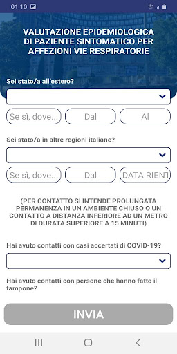

# LAZIOdrCovid
App version ``1.0.19``

Analyzed with [covid-apps-observer](http://github.com/covid-apps-observer) project, version ``0.1``

## App overview
| | |
|-------------------------|-------------------------| 
| **Name**&nbsp;&nbsp;&nbsp;&nbsp;&nbsp;&nbsp;&nbsp;&nbsp;&nbsp;&nbsp;&nbsp;&nbsp;&nbsp;&nbsp;&nbsp;&nbsp;&nbsp;&nbsp;&nbsp;&nbsp;&nbsp;&nbsp;&nbsp;&nbsp;&nbsp;&nbsp;&nbsp;&nbsp;&nbsp;&nbsp;&nbsp;&nbsp;&nbsp;&nbsp;&nbsp;&nbsp;&nbsp;&nbsp;&nbsp;&nbsp;  | LAZIOdrCovid |
| **Unique identifier** | com.intellicare.covid |
| **Link to Google Play** | [https://play.google.com/store/apps/details?id=com.intellicare.covid](https://play.google.com/store/apps/details?id=com.intellicare.covid) |
| **Summary**  | Piattaforma di telesorveglianza sanitaria dei pazienti con rischio COVID-19. |
| **Privacy policy** | [https://www.salutelazio.it/documents/10182/59078875/PoliticaPrivacy+LazioDoctor.pdf/2707a744-fe9d-92c9-abb8-c2e749ce82a1](https://www.salutelazio.it/documents/10182/59078875/PoliticaPrivacy+LazioDoctor.pdf/2707a744-fe9d-92c9-abb8-c2e749ce82a1) |
| **Latest version** | 1.0.19 |
| **Last update** | 2021-04-01 08:33:18 |
| **Recent changes** | Aggiorniamo l&#39;app regolarmente per renderla sempre migliore. Scarica la versione più recente per avere tutte le funzioni, i miglioramenti delle prestazioni e la risoluzione di problemi tecnici disponibili. |
| **Installs**  | 100.000+ |
| **Category** | Medicina |
| **First release** | 16 mar 2020 |
| **Size**  | 30M |
| **Supported Android version**  | 6.0 e versioni successive |

### Description
> La Regione Lazio offre la piattaforma Lazio Doctor per consultare informazioni utili legati all’emergenza COVID-19 e per connettere i pazienti con operatori sanitari e numero verde 800118800. Attraverso l’applicazione mobile scaricata sul telefono è possibile entrare in contatto con il proprio medico di base in modalità virtuale, ovunque, inviando in qualsiasi momento, le richieste di cui si ha bisogno. L’applicazione prevede comunicazioni testo-audio bidirezionali sicure tramite smartphone tra il cittadino ed il proprio medico. La videochiamata viene attivata, se necessario, dal medico per approfondire il quadro clinico del paziente.
 La Regione Lazio ha voluto rendere disponibile, ai pro¬pri cittadini, una corsia veloce ed affidabile per la fruizione dei servizi sanitari efficace soprattutto nei momenti di emergenza e in sicurezza. L’applicazione è scaricabile gratuitamente su App Store (iPhone) e Play Store (telefoni Android) su smar¬tphone. La modalità di accesso è immediata. Basta poi seguire i semplici passaggi per accedere ai servizi disponibili.

### User interface
The developers of the app provide the following screenshots in the Google play store.
| | | |
|:-------------------------:|:-------------------------:|:-------------------------:|
 |   |   |   | 
 |   |   |   | 

## Development team
In the following we report the main information provided by the development team in the Google play store.

| | |
|-------------------------|-------------------------|
| **Developer**  | LAZIOcrea S.p.A. |
| **Website**  | - |
| **Email** | mobile@laziocrea.it |
| **Physical address**  | - |
| **Other developed apps**  | [https://play.google.com/store/apps/developer?id=LAZIOcrea+S.p.A.](https://play.google.com/store/apps/developer?id=LAZIOcrea+S.p.A.) |

## Android support

| | |
|-------------------------|-------------------------|
| **Declared target Android version**  | Android10, version 10 (API level 29) |
| **Effective target Android version**  | Android10, version 10 (API level 29) |
| **Minimum supported Android version**  | Marshmallow, version 6.0 (API level 23) |
| **Maximum target Android version**  | - |

The larger the difference between the minimum and maximum supported Android versions, the better. A larger difference means a wider audience. For example, old phones have a very low Android version, so a high minimum supported Android version means that the app cannot be used by users with old phones, thus leading to accessibility problems. 

## Requested permissions

In the following we report the complete list of the permissions requested by the app. 

| **Permission** | **Protection level** | **Description** | 
|-------------------------|-------------------------|-------------------------|
 **android.permission ACCESS_NETWORK_STATE** | Normal | Allows applications to access information about networks. 
 **android.permission CAMERA** | :warning:**Dangerous** | Required to be able to access the camera device. 
 **android.permission FLASHLIGHT** | - | - 
 **android.permission FOREGROUND_SERVICE** | Normal | Allows a regular application to use Service.startForeground. 
 **android.permission INTERNET** | Normal | Allows applications to open network sockets. 
 **android.permission MODIFY_AUDIO_SETTINGS** | Normal | Allows an application to modify global audio settings. 
 **android.permission READ_EXTERNAL_STORAGE** | :warning:**Dangerous** | Allows an application to read from external storage. 
 **android.permission RECEIVE_BOOT_COMPLETED** | Normal | Allows an application to receive the Intent.ACTION_BOOT_COMPLETED that is broadcast after the system finishes booting. 
 **android.permission RECORD_AUDIO** | :warning:**Dangerous** | Allows an application to record audio. 
 **android.permission USE_FULL_SCREEN_INTENT** | Normal | Required for apps targeting Build.VERSION_CODES.Q that want to use notification full screen intents. 
 **android.permission VIBRATE** | Normal | Allows access to the vibrator. 
 **android.permission WAKE_LOCK** | Normal | Allows using PowerManager WakeLocks to keep processor from sleeping or screen from dimming. 
 **android.permission WRITE_EXTERNAL_STORAGE** | :warning:**Dangerous** | Allows an application to write to external storage. 
 **android.webkit PermissionRequest** | - | - 
 **com.google.android.c2dm.permission RECEIVE** | - | - 
 **com.google.android.finsky.permission BIND_GET_INSTALL_REFERRER_SERVICE** | - | - 

## Mentioned servers

| **Server** | **Registrant** | **Registrant country** | **Creation date** | 
|-------------------------|-------------------------|-------------------------|-------------------------|
 | googlesyndication.com | Google LLC | :us: US | 2003-01-21 06:17:24 |
 | google.com | Google LLC | :us: US | 1997-09-15 04:00:00 |
 | googleadservices.com | Google LLC | :us: US | 2003-06-19 16:34:53 |
 | app-measurement.com | Google LLC | :us: US | 2015-06-19 20:13:31 |
 | color.org | International Color Consortium | :us: US | 1995-12-12 05:00:00 |
 | intellicare.it | Kukua srl | :it: IT | 2016-09-19 18:25:36 |
 | regione.lazio.it | Regione Lazio | :it: IT | 1996-12-17 00:00:00 |

## Security analysis 

Below we report the main security warnings raised by our execution of the [Androwarn](https://github.com/maaaaz/androwarn) security analysis tool.

**Connection interfaces exfiltration**
> - This application reads details about the currently active data network 
> - This application tries to find out if the currently active data network is metered 

**Telephony services abuse**
> - This application makes phone calls 

**Suspicious connection establishment**
> - This application opens a Socket and connects it to the remote address 'Lc/a/a/a/a;->g(Ljava/lang/String;)Ljava/lang/StringBuilder;' on the 'N/A' port  
> - This application opens a Socket and connects it to the remote address 'Ljava/net/Proxy;->type()Ljava/net/Proxy$Type;' on the 'N/A' port  
> - This application opens a Socket and connects it to the remote address 'hostname == null ' on the 'N/A' port  
> - This application opens a Socket and connects it to the remote address 'timeout' on the 'N/A' port  

**Code execution**
> - This application loads a native library: 'jingle_peerconnection_so' 

## User ratings and reviews

Below we provide information about how end users are reacting to the app in terms of ratings and reviews in the Google Play store.

### Ratings

The LAZIOdrCovid app has been installed by more than **100000** times. At this time, **770** rated the app and its average score is **2.31**. Below we show the distribution of the ratings across the usual star-based rating of Google Play

:star::star::star::star::star:: 162

:star::star::star::star:: 84

:star::star::star:: 23

:star::star:: 61

:star:: 440

### Reviews 

#### 5-star reviews

> Ottima iniziativa!  :date: __2021-04-28 20:25:53__

> Applicazione molto semplice e di grande aiuto . Finalmente nessuna attesa di svariati infiniti minuti per poter informare chi di competenza su propri stati di salute causa Covid 19. Dopo aver inviato i campi richiesti, la risposta asl, è pressoché immediata.  :date: __2021-04-04 18:20:47__

> App stupenda e mi é stata utile durante il periodo del covid 19 . Ora fortunatamente sono guarito ma continuo ad aggiornarla 💯😁😍  :date: __2021-04-01 18:59:29__

> Eccellente. Siamo stati seguiti con massima attenzione durante tutto il periodo di "clausura" domestica.  :date: __2021-03-21 13:47:27__

> Servizio eccellente reso da personale paramedico e medico di indubbia professionalità e umanità. Grazie ancora  :date: __2021-01-27 17:13:36__

> Applicazione per fatta. Utilissima ed indispensabile.  :date: __2021-01-18 15:11:07__

> Ottima  :date: __2020-11-11 19:16:16__

> Credo che sia unottima protezione.  :date: __2020-10-24 15:02:19__

> Tolto accesso, prego provvedere non mi invia sms per attivare  :date: __2020-10-21 12:26:52__

> App veramente chiara e immediata. Semplicissima da utilizzare  :date: __2020-10-12 08:58:04__

#### 4-star reviews

> Adesso funziona. Ho avuto molte difficoltà con l'installazione perché dopo avere fatto clic sull'SMS di conferma la app si bloccava. Ho riprovato più volte inutilmente. Ora invece sono tornato ad aprirla dopo qualche giorno e funziona regolarmente.  :date: __2021-03-22 19:21:36__

> Serve per informazione  :date: __2021-03-10 19:57:14__

> Scaricata appena uscita, ora che mi serve, nemmeno si apre. 24/1/21 contattata dal gestore dell'app, che consigliava di reinstallare l'app. Nel frattempo, è uscito il nuovo aggiornamento e l'app funziona di nuovo. Do 4 stelle, perché credo sia un servizio utile, ma non ho avuto il modo di sperimentarlo, in quanto, al momento, non ne ho la necessità.  :date: __2021-01-24 15:20:11__

> Utile applicazione. Ho avuto feedback dal medico di medicina generale senza problemi.  :date: __2021-01-14 17:29:26__

> Non consente alcune descrizioni nel dettaglio, a volte si blocca  :date: __2020-08-27 07:53:21__

> Salve, vorrei farvi notare che quando si compila l'autovalutazione, alla domanda: hai frequentato nelle ultime 2 settimane strutture sanitarie ? Io rispondo NO e al termine dei quesiti andando ad aprire il documento word con le mie risposte risulta SI per gli ospedali anche se la mia risposta, come già ho detto, sia stata No! Ho provato 2 volte per sicurezza, ma il risultato è lo stesso.  :date: __2020-05-28 05:22:18__

> Funziona, per quelle che sono le sue funzioni base. Sarebbe il caso che fosse collegata con la propria cartella che si trova online accessibile con CNS in modo che possano essere sincronizzati i parametri.  :date: __2020-05-08 18:46:04__

> Un buon progetto e decisamente un buon inizio, spero che per il futuro non si abbandonerà questo progetto ma che si possa ampliare per utilizzarlo aggiornando funzionalità.  :date: __2020-04-14 12:22:09__

> Si potrebbe integrare la movimentazione per eventuale sorveglianza per la fase due  :date: __2020-04-14 11:24:04__

> Ottima  :date: __2020-04-13 13:24:49__

#### 3-star reviews

> Fatta la seconda dose di vaccino non ha l'upgrade che consenta di scansionare il qr code per ottenere il passaporto vaccinale.. Al numero verde non risponde nessuno!  :date: __2021-01-26 16:18:58__

> Certamente migliorabile quanto a velocità e feedback del inserimento dati e della conferma lettura ma in assoluto sembra funzionare. Molto utile e doverosa sarebbe la possibilità di esportare i propri parametri inseriti  :date: __2021-01-22 09:39:31__

> Con l'ultima versione non mi funziona più. Mi dice che devo aggiornare l'app, cosa che naturalmente ho già fatto, e mi porta al Google store dove mi dicono che, per l'appunto, ho già l'ultima versione. Dovreste rimettere le cose a posto, per favore. Aggiornamento: bug corretto, metto 3 stelle perché secondo me alla fine cos' come è un po' senza infamia e senza lode. Secondo me l'unica app che dovremmo tutti installere è Immuni, quella del Ministero della Salute. Se non l'avete fatto, per favore fatelo.  :date: __2020-08-23 20:10:53__

> Una domanda, posso usare l'app per autodenunciare il mio rientro in Italia? Il numero verde regionale all'estero non funziona e la mia Asl da giorni non risponde, grazie  :date: __2020-08-18 08:28:24__

> Sono registrata regolarmente alla App solo che ho una domanda in merito. Essendo solo domiciliata nel Lazio e avendo medico di base per motivi di studio, nella versione precedente mi dava comunque il nome del mio medico di base. Adesso non appare più al momento che clicco su "contatta il medico". Vorrei sapere se è dovuto all'aggiornamento o, in casi ottimali dovrebbe comparire. Soprattutto in vista di questo aumento contagi vorrei essere sicura di averlo. Tutto qui.  :date: __2020-08-16 09:50:43__

> Non la ho ancora provata  :date: __2020-08-14 14:39:03__

> Buona l'idea...peccato sia solo x il Lazio...ogni Regione dovrebbe averne una simile, da integrare con Immuni a livello nazionale...tutti i cittadini dovrebbero utilizzarla x tenere sotto controllo la propria salute e stare più tranquilli...  :date: __2020-06-16 11:10:30__

> Correggo la sottostante recensione, credo sia stato un malfunzionamento temporaneo, mi ha dato la possibilità di accedere e funziona. "Pessimo funzionamento. Avevo già installato l'applicazione ed avevo anche inserito i miei dati, ad un certo punto all'accesso (fase invio SMS di verifica) usciva un messaggio di errore che diceva che mi ero registrato con un altro numero (impossibile) e quindi non mi ha più consentito l'accesso. Sarebbe utile se funzionasse!!!"  :date: __2020-05-13 18:20:22__

> Un po' complicato  :date: __2020-05-10 17:47:50__

> Ok ma il fatto che nella scheda "contatta il tuo medico" non compaia piú in nome del mio medico cosa significa? é voluto?  :date: __2020-04-30 12:58:44__

#### 2-star reviews

> Dopo aver fatto l'accesso l'app non si apre più, come fare?  :date: __2021-04-23 16:34:45__

> non riesco più ad entrare per registrare i miei valori..è possibile riavere il link tramite sms  :date: __2021-02-13 16:11:30__

> L'accesso al App è strano. Inseriti i dati, cliccato sul link. Account attivato. Accesso consentito. Tentando di entrare di nuovo, vedo già i miei dati, clicco su Accedi, messaggio su account non attivo (?), SMS inviato con link (non arriva nulla). Dove sbaglio?  :date: __2021-02-08 21:38:55__

> La app nella ultima release ha difficoltà a scaricare le misurazioni già inserite e ad aggiungerne nuove: entra in loop  :date: __2021-01-27 10:08:17__

> Dopo aver installato l'app e inserito i dati x 2 giorni l'app ha chiesto un aggiornamento fatto e da quel momento non mi fa più accedere mi chiede i dati di accesso dice ti ho inviato una conferma al numero ma non invia nulla e non riesco più ad accedere. Se ai miei tempi si facevano procedure del genere ci cacciavano a pedate.  :date: __2021-01-22 10:53:44__

> Installa mia malgrado, non ha mai brillato per rapidità nella memorizzazione e nella visualizzazione dei parametri ma era senz'altro utile. Tuttavia, da oggi, 26 dicembre, mi è impossibile aggiornare e visualizzare i dati sulla pressione arteriosa e non funziona neanche l'archivio, perciò non ho accesso allo storico dei parametri. Sono tornato a scrivere tutto a mano...  :date: __2020-12-29 18:04:30__

> I grafici non funzionano più: invio i dati ma, non avendo il riscontro nel grafico non so' se sono registrati. Se non funziona più ditelo, risparmio memoria del cell.  :date: __2020-10-23 21:46:21__

> sicuri che l'app funzioni correttamente? E che i medici di base siano informati o connessi ad essa? Io non credo...ho contattato il mio medico con l'app questa mattina alle 11 (quando era ancora in servizio nell'ambulatorio della mia zona) e ancora non ho ricevuto risposta né vedo esito di lettura... ipotizzo che avendo tutti i miei dati (comunicati in fase di registrazione, con mia assoluta approvazione) siete anche in grado di 'collegarmi' con il mio medico... il problema di chi è allora?  :date: __2020-09-07 17:25:46__

> Ho provato più volte a contattare il medico di famiglia. Invano. Non ne ho capito bene l'utilità. Due stelle di incoraggiamento  :date: __2020-09-03 12:06:54__

> scaricato app Lazio DrCovid e compilata autovalutazione  ma come posso segnalare il mio rientro dalla Grecia a Fiumicino per poter fare il tampone?la app fa riferimento solo al n. Verde che non riesco a contattare col cellulare dalla Grecia, c'e un altro modo per segnalare il rientro e prenotare il tampone?in caso affermativo potete indicarmi la procedura?  :date: __2020-08-29 00:06:40__

#### 1-star reviews

> Ottima idea, ma merita una segnalazione all'autorità per la protezione dei dati personali: perché deve poter accedere a foto e contenuti multimediali dell'utente, a chi interessano le mie foto con il gatto o i filmati mentre gioco con il cane del vicino ? E se non si concede l'accesso non puoi fruire del servizio di assistenza sanitaria. Ma chi approva la messa in linea di questi scalcinati e subdoli prodotti ?  :date: __2021-05-09 13:27:37__

> L app chiede l abilitazione via sms ,clicco sul link ma poi l app non viene abilitata  :date: __2021-04-27 11:35:23__

> Indecente. SMS che non arriva mai. Poi riesci a fartelo spedire ma sorpresa l'attivazione non è riuscita. Una delle solite prese in giro..  :date: __2021-04-17 16:30:44__

> Pessima appena istallata mi si é scaricata la batteria  :date: __2021-04-12 00:25:33__

> molto negativa  :date: __2021-04-01 13:42:11__

> Al momento negativa, sono riuscito ad entrare solo una volta e dopo che ho inserito i primi dati non mi ha fatto più entrare.  :date: __2021-03-30 05:55:33__

> Sono malato di COVID e la app non funziona è partita solo la prima vera e poi non accetta più il login. Non vi sentite responsabili di questo ennesimo fallimento?  :date: __2021-03-27 18:40:11__

> Non capisco a cosa possa servire un'app di pubblica utilità come questa quando poi non ha nessuna interazione con chi la installa (per ovvi motivi), tanto vale continuare a mandare messaggi al mio medico di base  :date: __2021-03-27 16:26:41__

> NON FUNZIONA!!!!!!  :date: __2021-03-26 16:38:37__

> non funziona, dovrebbe arrivare una email con un link per l'attivazione che non è mai arrivato.  :date: __2021-03-19 09:34:20__

