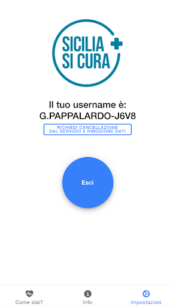
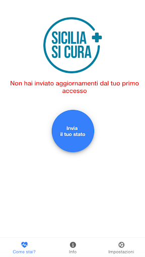

# SiciliaSiCura
App version ``5.2``

Analyzed with [covid-apps-observer](http://github.com/covid-apps-observer) project, version ``0.1``

## App overview
| | |
|-------------------------|-------------------------| 
| **Name**&nbsp;&nbsp;&nbsp;&nbsp;&nbsp;&nbsp;&nbsp;&nbsp;&nbsp;&nbsp;&nbsp;&nbsp;&nbsp;&nbsp;&nbsp;&nbsp;&nbsp;&nbsp;&nbsp;&nbsp;&nbsp;&nbsp;&nbsp;&nbsp;&nbsp;&nbsp;&nbsp;&nbsp;&nbsp;&nbsp;&nbsp;&nbsp;&nbsp;&nbsp;&nbsp;&nbsp;&nbsp;&nbsp;&nbsp;&nbsp;  | SiciliaSiCura |
| **Unique identifier** | com.siciliasicura.app |
| **Link to Google Play** | [https://play.google.com/store/apps/details?id=com.siciliasicura.app](https://play.google.com/store/apps/details?id=com.siciliasicura.app) |
| **Summary**  | Servizio valutazione epidemiologica avanzamento del contagio Covid-19 in Sicilia |
| **Privacy policy** | [https://siciliasicura.costruiresalute.it/welcome](https://siciliasicura.costruiresalute.it/welcome) |
| **Latest version** | 5.2 |
| **Last update** | 2020-06-17 17:13:22 |
| **Recent changes** | Ottimizzazioni e bug fixes |
| **Installs**  | 10.000+ |
| **Category** | Salute e fitness |
| **First release** | 27 mar 2020 |
| **Size**  | 7,3M |
| **Supported Android version**  | 5.0 e versioni successive |

### Description
> Ai sensi dell'ordinanza n. 24 del 6 Giugno 2020 del Presidente della Regione Siciliana, al momento della programmazione del viaggio in Sicilia o della prenotazione del viaggio (volo, treno, traghetto, nave), è possibile registrarsi al servizio SiciliaSiCura, avviando la procedura di registrazione su S[iciliaSicura.com](http://www.siciliasicura.com) o facendo tap su "Registrati" all'interno dell'APP.
 Dopo aver effettuato la registrazione, verrà inviato un messaggio di benvenuto via e-mail e le istruzioni per il completamento della registrazione. Facendo click sul link ricevuto sarà possibile accede alla pagina che consente la creazione della propria password personale. 
 Il giorno dell'arrivo in Sicilia, viene inviata una seconda E-mail con le istruzioni per l'utilizzo di SiciliaSiCura. 
 Non appena arrivati in Sicilia, è possibile effettuare il "check-in" nell'Isola, validando la propria presenza attraverso il servizio SiciliaSiCura. È possibile accedere con le proprie credenziali ed inviare un aggiornamento sul proprio stato di salute al momento dell'arrivo. Questo consente al Servizio Sanitario Regionale di conoscere le condizioni di salute dell'utente al momento dell'arrivo in Sicilia.
 Si riceverà giornalmente un avviso di cortesia che ricorda cosa fare in caso si avvertissero sintomi collegati al Covid-19. 
 Se si dovesse presentare uno dei sintomi collegati al Covid-19, lo si può segnalare tramite SiciliaSiCura. Per ottenere un aiuto migliore, l'utente può volontariamente scegliere di essere geolocalizzato: in questo modo il Sistema Sanitario Regionale potrà facilmente identificare leStrutture Sanitarie più vicine. SiciliaSiCura fornirà anche indicazioni sul comportamento che l'utente dovrà seguire e genererà un codice di contatto da utilizzare nelle comunicazioni con il Sistema Sanitario Regionale, ad esempio quando si contatterà il numero verde 800 45 87 87.
 Si ricorda, comunque, che l'APP NON E' UN SERVIZIO DI EMERGENZA: per qualsiasi urgenza sanitaria bisogna sempre chiamare il numero di emergenza 112. 
 Terminato il periodo di permanenza sul territorio siciliano, l'utente può effettuare il "check-out" cancellandosi direttamente da SiciliaSiCura. In questo modo i suoi dati verranno cancellati in modo definitivo e, ovviamente, non potrà più inviare aggiornamenti sul proprio stato di salute.
 E' comunque sempre possibile effettuare una Cancellazione dal servizio,  andando su Impostazioni→Cancellami. 
 I dati registrati verranno mantenuti solo per 16 giorni dalla data di partenza (check-out) e successivamente rimossi definitivamente dal Sistema. I dati di un utente non attivo da oltre 30 giorni saranno in ogni caso rimossi in automatico dal sistema.
 Il manuale completo dei SiciliaSiCura è disponibile all'indirizzo http://tinyurl.com/siciliasicura-it.

### User interface
The developers of the app provide the following screenshots in the Google play store.
| | | |
|:-------------------------:|:-------------------------:|:-------------------------:|
 |   |   |   | 
 |   |  

## Development team
In the following we report the main information provided by the development team in the Google play store.

| | |
|-------------------------|-------------------------|
| **Developer**  | IES Solutions |
| **Website**  | [http://www.siciliacoronavirus.it](http://www.siciliacoronavirus.it) |
| **Email** | info@costruiresalute.it |
| **Physical address**  | - |
| **Other developed apps**  | [https://play.google.com/store/apps/developer?id=IES+Solutions](https://play.google.com/store/apps/developer?id=IES+Solutions) |

## Android support

| | |
|-------------------------|-------------------------|
| **Declared target Android version**  | Android10, version 10 (API level 29) |
| **Effective target Android version**  | Android10, version 10 (API level 29) |
| **Minimum supported Android version**  | Lollipop, version 5.0 (API level 21) |
| **Maximum target Android version**  | - |

The larger the difference between the minimum and maximum supported Android versions, the better. A larger difference means a wider audience. For example, old phones have a very low Android version, so a high minimum supported Android version means that the app cannot be used by users with old phones, thus leading to accessibility problems. 

## Requested permissions

In the following we report the complete list of the permissions requested by the app. 

| **Permission** | **Protection level** | **Description** | 
|-------------------------|-------------------------|-------------------------|
 **android.permission ACCESS_COARSE_LOCATION** | :warning:**Dangerous** | Allows an app to access approximate location. 
 **android.permission ACCESS_FINE_LOCATION** | :warning:**Dangerous** | Allows an app to access precise location. 
 **android.permission ACCESS_NETWORK_STATE** | Normal | Allows applications to access information about networks. 
 **android.permission INTERNET** | Normal | Allows applications to open network sockets. 
 **android.permission READ_EXTERNAL_STORAGE** | :warning:**Dangerous** | Allows an application to read from external storage. 
 **android.permission WAKE_LOCK** | Normal | Allows using PowerManager WakeLocks to keep processor from sleeping or screen from dimming. 
 **android.permission WRITE_EXTERNAL_STORAGE** | :warning:**Dangerous** | Allows an application to write to external storage. 
 **com.google.android.c2dm.permission RECEIVE** | - | - 

## Mentioned servers

| **Server** | **Registrant** | **Registrant country** | **Creation date** | 
|-------------------------|-------------------------|-------------------------|-------------------------|
 | google.com | Google LLC | :us: US | 1997-09-15 04:00:00 |
 | gstatic.com | Google LLC | :us: US | 2008-02-11 15:31:25 |
 | googleapis.com | Google LLC | :us: US | 2005-01-25 17:52:26 |

## Security analysis 

Below we report the main security warnings raised by our execution of the [Androwarn](https://github.com/maaaaz/androwarn) security analysis tool.

**Connection interfaces exfiltration**
> - This application reads details about the currently active data network 
> - This application tries to find out if the currently active data network is metered 

**Pim data leakage**
> - This application accesses the downloads folder 
> - This application accesses data stored in the clipboard 

**Code execution**
> - This application loads a native library: 'sqlc-native-driver' 

## User ratings and reviews

Below we provide information about how end users are reacting to the app in terms of ratings and reviews in the Google Play store.

### Ratings

The SiciliaSiCura app has been installed by more than **10000** times. At this time, **92** rated the app and its average score is **2.8804348**. Below we show the distribution of the ratings across the usual star-based rating of Google Play

:star::star::star::star::star:: 30

:star::star::star::star:: 9

:star::star::star:: 9

:star::star:: 8

:star:: 36

### Reviews 

#### 5-star reviews

> Grazie per il chiarimento.  :date: __2020-06-17 13:29:24__

> Ottima ed estremamente semplice  :date: __2020-06-16 18:12:35__

> Funzionale. Mi piace.  :date: __2020-06-07 15:36:48__

> App utile! :-)  :date: __2020-06-06 17:23:59__

> Ottima per i siciliani che ci stanno da quando sono nati ad oggi 2020 e per chi arriva dall'altra parte del nord, sud, ovest ed est.  :date: __2020-06-06 10:43:15__

> Per attivare l'applicazione bisogna essere presenti nel luogo di residenza indicato al momento della registrazione. Non è possibile effettuare l'accesso prima della partenza  :date: __2020-05-29 11:08:55__

> App utile e facile  :date: __2020-04-29 14:12:38__

> App fantastica, semplice da utilizzare e veramente molto utile  :date: __2020-04-26 00:17:04__

> Applicazione molto utile  :date: __2020-04-25 19:51:32__

> Applicazione semplice e veramente molto utile  :date: __2020-04-25 19:43:44__

#### 4-star reviews

> Salve, sarebbe utile poter inserire un eventuale test/tampone effettuato (data,esito, sede...) per completare il patrimonio informativo  :date: __2020-06-18 23:59:45__

> Volevo porre una domanda. Scendendo in vacanza con la mia famiglia visto che per i minori non c'è l'obbligo della registrazione, mia moglie deve scaricare anche lei l'app?  :date: __2020-06-16 20:12:14__

> Strano approccio. Dopo installata chiede il consenso quindi "Surname e Password". Ma dice che la password perverrà via mail. Quale mail? Non è prevista registrazione né richiesta di email! Pertanto non consente l'avvio. Grazie per la cortese risposta. Rivaluto a 4 stelle.  :date: __2020-06-01 23:06:10__

> app funzionale, consiglierei l'aggiunta di una notifica durate le prime ore del mattino.  :date: __2020-05-16 03:55:51__

> Si blocca spesso e riprende a funzionare dopo aver riavviato lo smartphone, anche quando ricevo notifica per aggiornare il mio stato di salute, clicco su come stai e si blocca, bisogna sempre riavviare lo smartphone, non so se è un problema della app o del device... Grazie  :date: __2020-05-06 05:47:22__

#### 3-star reviews

> La email di conferma arriva in italiano. Ma come si puó pensare di fare turismo in questo modo?  :date: __2020-06-21 12:34:07__

> Provo a registrarmi e la mia mail risulta già presente, ma io non ho mai scaricato né app e nulla, cosa debbo fare?  :date: __2020-06-11 18:19:53__

> È legalmente obbligatoria per entrare in Sicilia? Grazie  :date: __2020-06-10 17:44:39__

> Salve, potreste dirmi come registrare i figli minorenni?  :date: __2020-06-10 14:19:32__

> Una volta arrivato in Sicilia, indicata la mia posizione che corrisponde all'indirizzo indicato in fase di registrazione, se volessi spostarmi in un'altra località (San Vito Lo Capo) in un villaggio turistico, posso spostarmi o devo rimanere nel luogo di Palermo?  :date: __2020-06-02 19:35:59__

> Sarebbe comoda l'aggiunta di un reminder giornaliero che ricordi di aggiornare lo stato di salute e non solo quello delle passate 6 ore  :date: __2020-05-01 03:57:37__

> Ma di preciso a cosa serve questa app  :date: __2020-04-30 18:44:40__

> Disinstallata inutilizzabile. Troppo complicato avere le credenziali per utilizzare questa app. speriamo nei nuovi aggiornamenti. Grazie  :date: __2020-04-23 18:02:08__

#### 2-star reviews

> Scusate ma come si fa ad impostare le date,c è da sclerare,devo essere in sicilia nei primi di luglio e non riesco a registrarmi,impostare le date,di nascita,di partenza non si capisce,fate qualcosa  :date: __2020-06-13 21:00:06__

> Nn riesco ad effettuare la registrazione, né dall'APP, tantomenovia web...scade in continuazione il time della verifica captcha...  :date: __2020-06-10 16:14:27__

> L'applicazione è tutta in italiano, solo dopo si può scegliere la lingua di preferenza, molto dopo. Un turista che arriva dall'estero e non conosce l'italiano, come dovrebbe fare? Ai gestori di strutture ricettive si dice di dire scaricare l'app, di controllare che l'ospite l'abbia scaricata, ma gli ospiti che non parlano italiano stanno riscontrando un sacco di difficoltà, non comprendendo neanche il consenso ai dati personali.... sistematela subito!!!  :date: __2020-06-07 23:36:49__

> Non riesco ad iscrivermi al sito o per lo meno non trovo da dove registrarmi  :date: __2020-06-03 10:43:25__

> Io devo rientrare in Sicilia e al momento della registrazione mi dice che la mia posizione non è nel territorio regionale. Ma io per rientrare in Sicilia devo per forza registrarmi? come faccio se non mi fa registrare? Non capisco, se qualcuno può rispondere grazie.  :date: __2020-05-12 12:12:40__

> Devo tornare a casa tra qualche giorno e come indicato mi sono registrata al sito indicando il luogo di partenza e di arrivo. Ora ho scaricato l'app, ho ricevuto l'email e la password ma non riesco ad accedere perché mi chiede la geolocalizzazione. Mi spiegate cosa devo fare? Che senso ha impedire l'accesso perché sono fuori dal comune? l'ho scaricata apposta perché sono fuori e devo rientrare.  :date: __2020-05-11 17:56:46__

> Al momento di registrarmi,mi chiede l'indirizzo in cui risiedo,mi fa attivare la geolocalizzazione per poi non farmi continuare con la registrazione in quanto mi dice che la posizione dell'utente non coincide con l'indirizzo selezionato. Aiutatemi!!!  :date: __2020-05-05 17:35:06__

#### 1-star reviews

> Nella registrazione, per la data di nascita è possibile indicare solo i mesi da gennaio a giugno, come se i successivinon esistessero. Io sono nata ad agosto e non ho potuto selezionare il mese 08. Quondi, niente registrazione!!!  :date: __2020-06-21 14:15:52__

> Provo a registrarmi ma dice che la mail è già presente e devo fare prima il checkout... vorrei capire come visto che non ho i dati per accedere (controllato anche la cartella spam. La registrazione non è mai stata completata). Restiamo in attesa dell'helpdesk. Se un turista deve fare tutti questi giri voglio proprio vedere a fine stagione quanti si sono registrati. Sicuramente da migliorare.  :date: __2020-06-21 12:43:42__

> Ho scaricato l'applicazione, l'ho compilata ma alla fine, dopo la verifica corretta col captcha non mi fa inviare la richiesta, cioè non si evidenzia INVIA. Ho provato da pc, stessa cosa, tutti i campi compilati correttamente, ma alla fine non fa inviare  :date: __2020-06-20 10:08:15__

> Nella fase finale della registrazione, dopo la verifica " non sono un robot" non ti fa andare avanti e non ti dice il perche', il tasto invia e' inattivo.  :date: __2020-06-19 13:34:56__

> Non funziona  :date: __2020-06-18 14:05:10__

> Complicata involontariamente ho fatto il check-out e non mi fa più aggiornare nulla, volevo solo inserire mio figlio  :date: __2020-06-16 14:45:21__

> Tre volte che provo a registrarmi si blocca sempre alla fine non invia i dati sul cellulare le richieste si leggono a pezzi. Non ho capito a che serve il CF. Non scaricatela. Da verificare.  :date: __2020-06-16 08:37:12__

> Dopo vari tentativi sono riuscito a fare la registrazione ma sulla email non ho ricevuto alcuna password e conferma della registrazione. Ho provato a fare la registrazione direttamente dal sito. ma alla fine dei vari passaggi e fatto invio continuo a non ricevere gli estremi di conferma della registrazione. Forse sbaglio qualche passaggio...?  :date: __2020-06-15 15:11:21__

> Ho appena scaricato l app sicilia sicura. Finita la procedura di registrazione compare una bella scritta in rosso con scritto contattare helpdesk o qualcosa del genere visto che spunta improvvisamente e rimane solo per pochi secondi. Inutile riprovare a compilare il questionario della registrazione inquanto l email risulta gia utilizzata. In più all email inserita in fase di registrazione non mi è arrivata alcuma email contenente login e password. Che fare??? Sara obbligatoria ma non funziona.  :date: __2020-06-15 14:52:33__

> Applicazione x ora totalmente inefficente. Dopo la registrazione non riconosce ne username ne password. Non esegue il reset della password . Neanche dopo il vostro intervento tramite helpdesk con reset password. Una nuova registrazione inefficente perché sei già registrato con i tuoi dati. Uno che viene in vacanza in Sicilia non può stare in balia giorni dietro applicazioni o call center. Predisponete anche un cartaceo forse risolviamo.  :date: __2020-06-13 11:44:20__

