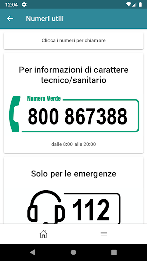
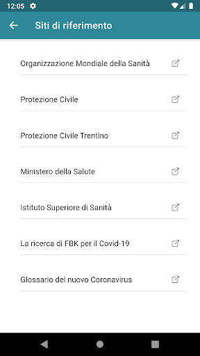
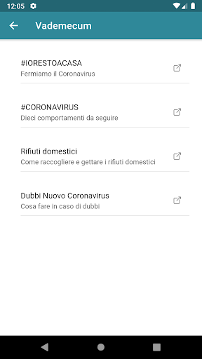
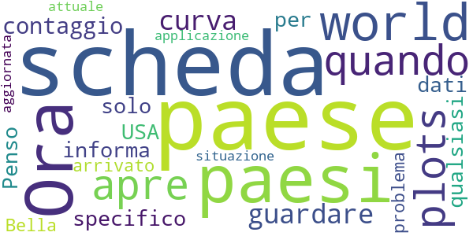

# TreCovid19
App version ``0.4.15``

Analyzed with [covid-apps-observer](http://github.com/covid-apps-observer) project, version ``0.1``

## App overview
| | |
|-------------------------|-------------------------| 
| **Name**&nbsp;&nbsp;&nbsp;&nbsp;&nbsp;&nbsp;&nbsp;&nbsp;&nbsp;&nbsp;&nbsp;&nbsp;&nbsp;&nbsp;&nbsp;&nbsp;&nbsp;&nbsp;&nbsp;&nbsp;&nbsp;&nbsp;&nbsp;&nbsp;&nbsp;&nbsp;&nbsp;&nbsp;&nbsp;&nbsp;&nbsp;&nbsp;&nbsp;&nbsp;&nbsp;&nbsp;&nbsp;&nbsp;&nbsp;&nbsp;  | TreCovid19 |
| **Unique identifier** | eu.fbk.trec.apps.covid |
| **Link to Google Play** | [https://play.google.com/store/apps/details?id=eu.fbk.trec.apps.covid](https://play.google.com/store/apps/details?id=eu.fbk.trec.apps.covid) |
| **Summary**  | TreCovid19, l&#39;app per tenersi informato sull&#39;emergenza Coronavirus in Trentino. |
| **Privacy policy** | [https://www.apss.tn.it/informativa](https://www.apss.tn.it/informativa) |
| **Latest version** | 0.4.15 |
| **Last update** | 2020-04-08 18:59:51 |
| **Recent changes** | Risolta vulnerabilità. |
| **Installs**  | 1.000+ |
| **Category** | Salute e fitness |
| **First release** | 27 mar 2020 |
| **Size**  | 7,5M |
| **Supported Android version**  | 5.0 e versioni successive |

### Description
> Hai dubbi o domande sull'emergenza Coronavirus, vuoi sapere quali sono le misure previste in Trentino? Quali i numeri da contattare in caso di necessità? Per trovare le risposte da fonti ufficiali e certificate, installa "TreCovid19", nata dalla sinergia tra gli enti di TrentinoSalute4.0: Provincia autonoma di Trento (PAT), Azienda provinciale per i servizi sanitari (APSS) e Fondazione Bruno Kessler (FBK). Presto la app permetterà di aiutare medici e persone a monitorare lo stato di salute di chi è in isolamento. Ci stiamo lavorando!

### User interface
The developers of the app provide the following screenshots in the Google play store.
| | | |
|:-------------------------:|:-------------------------:|:-------------------------:|
 |   |   |   | 
 |   |   |   | 

## Development team
In the following we report the main information provided by the development team in the Google play store.

| | |
|-------------------------|-------------------------|
| **Developer**  | APSS Provincia Autonoma di Trento |
| **Website**  | [https://trentinosalutedigitale.com/blog/2020/03/16/trecovid19-la-app-per-i-cittadini-per-tenersi-aggiornati-sullemergenza-coronavirus-in-trentino/](https://trentinosalutedigitale.com/blog/2020/03/16/trecovid19-la-app-per-i-cittadini-per-tenersi-aggiornati-sullemergenza-coronavirus-in-trentino/) |
| **Email** | progettotrec@gmail.com |
| **Physical address**  | - |
| **Other developed apps**  | [https://play.google.com/store/apps/developer?id=APSS+Provincia+Autonoma+di+Trento](https://play.google.com/store/apps/developer?id=APSS+Provincia+Autonoma+di+Trento) |

## Android support

| | |
|-------------------------|-------------------------|
| **Declared target Android version**  | Pie, version 9 (API level 28) |
| **Effective target Android version**  | Pie, version 9 (API level 28) |
| **Minimum supported Android version**  | Lollipop, version 5.0 (API level 21) |
| **Maximum target Android version**  | - |

The larger the difference between the minimum and maximum supported Android versions, the better. A larger difference means a wider audience. For example, old phones have a very low Android version, so a high minimum supported Android version means that the app cannot be used by users with old phones, thus leading to accessibility problems. 

## Requested permissions

In the following we report the complete list of the permissions requested by the app. 

| **Permission** | **Protection level** | **Description** | 
|-------------------------|-------------------------|-------------------------|
 **android.permission ACCESS_NETWORK_STATE** | Normal | Allows applications to access information about networks. 
 **android.permission INTERNET** | Normal | Allows applications to open network sockets. 
 **android.permission READ_EXTERNAL_STORAGE** | :warning:**Dangerous** | Allows an application to read from external storage. 
 **android.permission WAKE_LOCK** | Normal | Allows using PowerManager WakeLocks to keep processor from sleeping or screen from dimming. 
 **android.permission WRITE_EXTERNAL_STORAGE** | :warning:**Dangerous** | Allows an application to write to external storage. 
 **com.google.android.c2dm.permission RECEIVE** | - | - 
 **com.google.android.finsky.permission BIND_GET_INSTALL_REFERRER_SERVICE** | - | - 

## Mentioned servers

| **Server** | **Registrant** | **Registrant country** | **Creation date** | 
|-------------------------|-------------------------|-------------------------|-------------------------|
 | googlesyndication.com | Google LLC | :us: US | 2003-01-21 06:17:24 |
 | google.com | Google LLC | :us: US | 1997-09-15 04:00:00 |
 | app-measurement.com | Google LLC | :us: US | 2015-06-19 20:13:31 |
 | gstatic.com | Google LLC | :us: US | 2008-02-11 15:31:25 |
 | googleapis.com | Google LLC | :us: US | 2005-01-25 17:52:26 |
 | googleadservices.com | Google LLC | :us: US | 2003-06-19 16:34:53 |

## Security analysis 

Below we report the main security warnings raised by our execution of the [Androwarn](https://github.com/maaaaz/androwarn) security analysis tool.

**Location lookup**
> - This application reads location information from all available providers (WiFi, GPS etc.) 

**Connection interfaces exfiltration**
> - This application reads details about the currently active data network 
> - This application tries to find out if the currently active data network is metered 

**Pim data leakage**
> - This application accesses the downloads folder 
> - This application accesses data stored in the clipboard 

## User ratings and reviews

Below we provide information about how end users are reacting to the app in terms of ratings and reviews in the Google Play store.

### Ratings

The TreCovid19 app has been installed by more than **1000** times. At this time, **12** rated the app and its average score is **4.3333335**. Below we show the distribution of the ratings across the usual star-based rating of Google Play

:star::star::star::star::star:: 6

:star::star::star::star:: 4

:star::star::star:: 2

:star::star:: 0

:star:: 0

### Reviews 

#### 5-star reviews

> Molto utile e ben fatta. Aggiornamenti costanti, video e cartina sulle zone sempre aggiornata  :date: __2020-04-06 19:31:13__

> Complimenti agli sviluppatori. Perfetta.  :date: __2020-04-04 00:10:54__

#### 4-star reviews

> Ora per tutti i paesi (scheda "world") quando si apre la scheda "plots" per guardare la curva di contaggio di un paese specifico, solo informa i dati di USA (per qualsiasi paese)... Penso che sia arrivato un problema.  :date: __2020-05-05 12:43:04__

> Bella applicazione ed è aggiornata alla situazione attuale  :date: __2020-04-02 21:24:31__

#### 3-star reviews

> Comoda l'app. Una cosa quando si seleziona un comune nella mappa (ma forse quando si seleziona in generale) non usate la stessa tonalità che usate per le alte percentuali di contagi. Confonde!  :date: __2020-04-16 21:32:13__

#### 2-star reviews

> Continua a impiantarsi  :date: __2021-01-27 20:08:07__

#### 1-star reviews

No recent reviews available with 1 stars.
