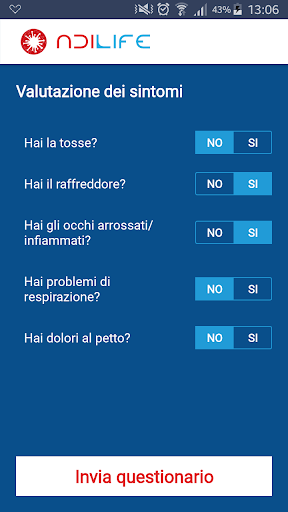
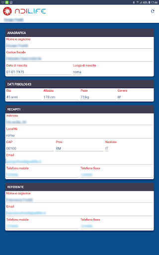
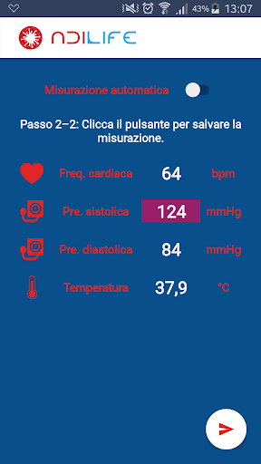
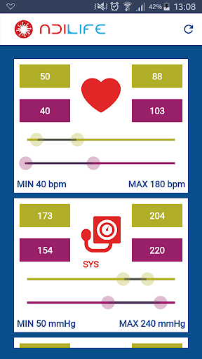

# ADiLife C-19
App version ``1.1.5``

Analyzed with [covid-apps-observer](http://github.com/covid-apps-observer) project, version ``0.1``

## App overview
| | |
|-------------------------|-------------------------| 
| **Name**                                          | ADiLife C-19 |
| **Unique identifier** | it.adilife.covid19.app |
| **Link to Google Play** | [https://play.google.com/store/apps/details?id=it.adilife.covid19.app](https://play.google.com/store/apps/details?id=it.adilife.covid19.app) |
| **Summary**  | App per l'acquisizione e il monitoraggio dei propri parametri vitali - Covid-19 |
| **Privacy policy** | [https://www.adilife.net/en/policy-gdpr-app](https://www.adilife.net/en/policy-gdpr-app) |
| **Latest version** | 1.1.5 |
| **Last update** | 2020-05-05 11:57:07 |
| **Recent changes** | Aggiunta nuova domanda al questionario di valutazione. Migliorata la procedura di aggiornamento del DB. |
| **Installs**  | 1.000+ |
| **Category** | Salute e fitness |
| **First release** | 6 mar 2020 |
| **Size**  | 4,3M |
| **Supported Android version**  | 5.0 e versioni successive |

### Description
> ADiLife C-19 è la nuova piattaforma idonea all’assistenza remota di pazienti contagiati da COVID-19 per il self measurement dei parametri fisiologici in isolamento fiduciario o pazienti in sorveglianza attiva.
 Per accedere al servizio è sufficiente ricevere un account dalla struttura medica di riferimento per l’avvio della sorveglianza durante tutto il periodo di isolamento forzato.
 L’App ADiLife C-19 è parte integrante della piattaforma di Connected Health ADiLife e permette ad un utente di effettuare il self measurement quotidiano monitorando la temperatura, frequenza cardiaca, saturazione d'ossigeno, pressione arteriosa da dispositivi medicali wearable Bluetooth certificati. 
 L'utente può visualizzare dall’App ADiLife C-19 le soglie impostate dalla struttura di riferimento, i promemoria e il trend delle proprie misurazioni nel tempo.
 L’App ADiLife C-19 permette una comunicazione in tempo reale via messaging, video e audio con una centrale operativa da cui, nella stessa semplice modalità potranno 
 essere fissati i limiti e le soglie parametriche che daranno origine, nel caso di superamento, a messaggi, segnalazioni, alerts spediti ad operatori o utenti selezionabili, così come saranno opzionabili le modalità con cui comunicare con il care giver/utente (social network, SMS, mail …).
 Tutti i dati sono disponibili con il trend storico e accessibili dall’App o dal portale ADiLife con il proprio account di utente.
 I dispositivi disponibili per le misurazioni sono termometri no contact, pulsossimetri emisuratori pressione arteriosa.
 L'App consente, inoltre, di richiedere un consulto medico in videocomunicazione grazie alla piattaforma di video comunicazione WebRTC integrata. Cliccando sull’apposita icona si entra direttamente  in videocomunicazione  con l’operatore di turno che, attraverso l’analisi dei  sintomi, sarà in grado di suggerire il medico/specialista con cui conferire e per un ulteriore approfondimento.
 Per maggiori informazioni visita il sito https://www.adilife.net/covid-19 .
 ADiLife è la salute a portata di tasca.

### User interface
The developers of the app provide the following screenshots in the Google play store.
| | | |
|:-------------------------:|:-------------------------:|:-------------------------:|
 |   |   |   | 
 |   |   |   | 
 |   |   |   | 
 |   |   |   | 
 |   |   |   | 
 |   |   |   | 
 |   |   |   | 
 |   |   |   | 

## Development team
In the following we report the main information provided by the development team in the Google play store.

| | |
|-------------------------|-------------------------|
| **Developer**  | ADiLife Srl |
| **Website**  | [https://www.adilife.net](https://www.adilife.net) |
| **Email** | info@adilife.net |
| **Physical address**  | [Via Mosca 52 00142 Rome Italy](https://www.google.com/maps/search/Via%20Mosca%2052%2000142%20Rome%20Italy) (Google Maps) |
| **Other developed apps**  | [https://play.google.com/store/apps/developer?id=ADiLife+Srl](https://play.google.com/store/apps/developer?id=ADiLife+Srl) |

## Android support

| | |
|-------------------------|-------------------------|
| **Declared target Android version**  | Android10, version 10 (API level 29) |
| **Effective target Android version**  | Android10, version 10 (API level 29) |
| **Minimum supported Android version**  | Lollipop, version 5.0 (API level 21) |
| **Maximum target Android version**  | - |

The larger the difference between the minimum and maximum supported Android versions, the better. A larger difference means a wider audience. For example, old phones have a very low Android version, so a high minimum supported Android version means that the app cannot be used by users with old phones, thus leading to accessibility problems. 

## Requested permissions

In the following we report the complete list of the permissions requested by the app. 

| **Permission** | **Protection level** | **Description** | 
|-------------------------|-------------------------|-------------------------|
 **android.permission ACCESS_COARSE_LOCATION** | :warning:**Dangerous** | Allows an app to access approximate location. 
 **android.permission ACCESS_FINE_LOCATION** | :warning:**Dangerous** | Allows an app to access precise location. 
 **android.permission ACCESS_NETWORK_STATE** | Normal | Allows applications to access information about networks. 
 **android.permission BLUETOOTH** | Normal | Allows applications to connect to paired bluetooth devices. 
 **android.permission BLUETOOTH_ADMIN** | Normal | Allows applications to discover and pair bluetooth devices. 
 **android.permission FOREGROUND_SERVICE** | Normal | Allows a regular application to use Service.startForeground. 
 **android.permission INTERNET** | Normal | Allows applications to open network sockets. 
 **android.permission WAKE_LOCK** | Normal | Allows using PowerManager WakeLocks to keep processor from sleeping or screen from dimming. 

## Mentioned servers

| **Server** | **Registrant** | **Registrant country** | **Creation date** | 
|-------------------------|-------------------------|-------------------------|-------------------------|
 | xyz-life.com | - | - | 2014-09-29 01:53:30 |
 | adilife.net | REDACTED FOR PRIVACY | :it: IT | 2017-04-06 09:06:30 |

## Security analysis 

Below we report the main security warnings raised by our execution of the [Androwarn](https://github.com/maaaaz/androwarn) security analysis tool.

**Telephony identifiers leakage**
> - This application reads the phone's current state 

**Connection interfaces exfiltration**
> - This application reads details about the currently active data network 
> - This application tries to find out if the currently active data network is metered 

**Telephony services abuse**
> - This application makes phone calls 

**Pim data leakage**
> - This application accesses the SMS list 

## User ratings and reviews

Below we provide information about how end users are reacting to the app in terms of ratings and reviews in the Google Play store.

### Ratings

The ADiLife C-19 app has been installed by more than **1000** times. At this time, **18** rated the app and its average score is **3.7777777**. Below we show the distribution of the ratings across the usual star-based rating of Google Play

:star::star::star::star::star:: 12

:star::star::star::star:: 0

:star::star::star:: 1

:star::star:: 0

:star:: 5

### Reviews 

#### 5-star reviews

> Ottima funzionalità  :date: __2020-04-18 12:02:34__

> Ottima App. Speriamo che molte strutture sanitarie la adottino al più presto. Il futuro è questo!  :date: __2020-04-17 19:12:06__

> Ottima idea, l'applicazione è molto utile ed il sistema di collegamento ben strutturato  :date: __2020-03-27 18:47:17__

> Ottima App  :date: __2020-03-27 17:59:02__

> APPELLO A TUTTE LE ASL DI ADERIRE  :date: __2020-03-27 16:14:47__

> Molto ben fatta e soprattutto tempestiva e di grande utilità !!  :date: __2020-03-27 14:37:15__

> ottimo sistema per collegare medici e pazienti . Dovrebbe essere distribuito dalle ASL per tutti quelli in isolamento  :date: __2020-03-27 12:35:25__

> L'App non è per tutti, ma solo per quelli che sono in quarantena e sorvegliati dalla propria struttura sanitaria di riferimento. C'è scritto in modo chiaro all'inizio della descrizione. Quindi prima di fare commenti negativi, leggiamo prima, non facciamo le capre :).  :date: __2020-03-25 15:54:30__

#### 4-star reviews

No recent reviews available with 4 stars.

#### 3-star reviews

> L'idea é buona ma non capisco come accedere  :date: __2020-03-24 13:58:48__

#### 2-star reviews

No recent reviews available with 2 stars.

#### 1-star reviews

> Non riesco ad iscrivermi e accedere alla applicazione e non ne capisco il motivo😪  :date: __2020-03-30 21:43:28__

> Anche zero darei  :date: __2020-03-24 10:31:28__

