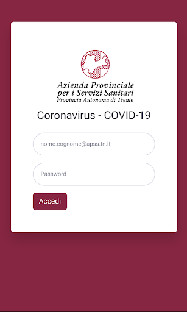

# Apss CV-19 (operatori sanitari)
App version ``2.0.0``

Analyzed with [covid-apps-observer](http://github.com/covid-apps-observer) project, version ``0.1``

## App overview
| | |
|-------------------------|-------------------------| 
| **Name**&nbsp;&nbsp;&nbsp;&nbsp;&nbsp;&nbsp;&nbsp;&nbsp;&nbsp;&nbsp;&nbsp;&nbsp;&nbsp;&nbsp;&nbsp;&nbsp;&nbsp;&nbsp;&nbsp;&nbsp;&nbsp;&nbsp;&nbsp;&nbsp;&nbsp;&nbsp;&nbsp;&nbsp;&nbsp;&nbsp;&nbsp;&nbsp;&nbsp;&nbsp;&nbsp;&nbsp;&nbsp;&nbsp;&nbsp;&nbsp;  | Apss CV-19 (operatori sanitari) |
| **Unique identifier** | it.apss.coronavirus.esterni |
| **Link to Google Play** | [https://play.google.com/store/apps/details?id=it.apss.coronavirus.esterni](https://play.google.com/store/apps/details?id=it.apss.coronavirus.esterni) |
| **Summary**  | Applicazione per operatori interni ad APSS con istruzioni relative a Covid-19 |
| **Privacy policy** | [https://www.apss.tn.it/-/gestione-consenso-privacy](https://www.apss.tn.it/-/gestione-consenso-privacy) |
| **Latest version** | 2.0.0 |
| **Last update** | 2020-03-09 18:04:02 |
| **Recent changes** | Versione per operatori sanitari con istruzioni per la gestione di Covid-19 |
| **Installs**  | 100+ |
| **Category** | Salute e fitness |
| **First release** | 9 mar 2020 |
| **Size**  | 8,3M |
| **Supported Android version**  | 4.4 e versioni successive |

### Description
> Applicazione per operatori interni dell'Azienda Provinciale per i Servizi Sanitari di Trento  con istruzioni relative alla gestione dell'emergenza Coronavirus Covid-19.

### User interface
The developers of the app provide the following screenshots in the Google play store.
| | | |
|:-------------------------:|:-------------------------:|:-------------------------:|
 |   |  

## Development team
In the following we report the main information provided by the development team in the Google play store.

| | |
|-------------------------|-------------------------|
| **Developer**  | APSS Provincia Autonoma di Trento |
| **Website**  | [http://www.apss.tn.it](http://www.apss.tn.it) |
| **Email** | sviluppo.mobile@apss.tn.it |
| **Physical address**  | - |
| **Other developed apps**  | [https://play.google.com/store/apps/developer?id=APSS+Provincia+Autonoma+di+Trento](https://play.google.com/store/apps/developer?id=APSS+Provincia+Autonoma+di+Trento) |

## Android support

| | |
|-------------------------|-------------------------|
| **Declared target Android version**  | Pie, version 9 (API level 28) |
| **Effective target Android version**  | Pie, version 9 (API level 28) |
| **Minimum supported Android version**  | KitKat, version 4.4 - 4.4.4 (API level 19) |
| **Maximum target Android version**  | - |

The larger the difference between the minimum and maximum supported Android versions, the better. A larger difference means a wider audience. For example, old phones have a very low Android version, so a high minimum supported Android version means that the app cannot be used by users with old phones, thus leading to accessibility problems. 

## Requested permissions

In the following we report the complete list of the permissions requested by the app. 

| **Permission** | **Protection level** | **Description** | 
|-------------------------|-------------------------|-------------------------|
 **android.permission INTERNET** | Normal | Allows applications to open network sockets. 
 **android.permission READ_EXTERNAL_STORAGE** | :warning:**Dangerous** | Allows an application to read from external storage. 
 **android.permission WRITE_EXTERNAL_STORAGE** | :warning:**Dangerous** | Allows an application to write to external storage. 

## Mentioned servers

| **Server** | **Registrant** | **Registrant country** | **Creation date** | 
|-------------------------|-------------------------|-------------------------|-------------------------|
 | gstatic.com | Google LLC | :us: US | 2008-02-11 15:31:25 |

## Security analysis 

Below we report the main security warnings raised by our execution of the [Androwarn](https://github.com/maaaaz/androwarn) security analysis tool.

**Connection interfaces exfiltration**
> - This application reads details about the currently active data network 
> - This application tries to find out if the currently active data network is metered 

**Telephony services abuse**
> - This application makes phone calls 

## User ratings and reviews

Below we provide information about how end users are reacting to the app in terms of ratings and reviews in the Google Play store.

### Ratings

The Apss CV-19 (operatori sanitari) app has been installed by more than **100** times. At this time, **-** rated the app and its average score is **0.0**. Below we show the distribution of the ratings across the usual star-based rating of Google Play

:star::star::star::star::star:: 0

:star::star::star::star:: 0

:star::star::star:: 0

:star::star:: 0

:star:: 0

### Reviews 

#### 5-star reviews

> Buona  :date: __2021-07-08 14:18:17__

#### 4-star reviews

> Non si apre più  :date: __2020-04-20 13:36:46__

#### 3-star reviews

No recent reviews available with 3 stars.

#### 2-star reviews

No recent reviews available with 2 stars.

#### 1-star reviews

No recent reviews available with 1 stars.
