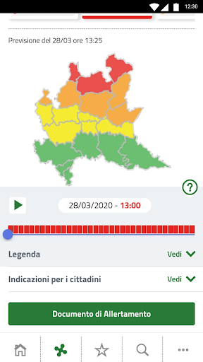
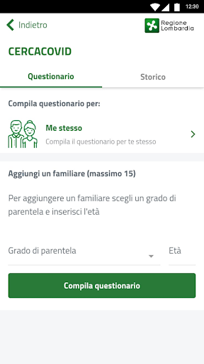
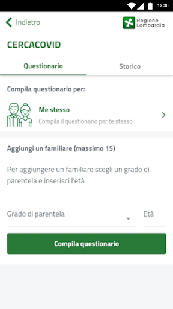

# allertaLOM
App version ``1.7.0``

Analyzed with [covid-apps-observer](http://github.com/covid-apps-observer) project, version ``0.1``

## App overview
| | |
|-------------------------|-------------------------| 
| **Name**&nbsp;&nbsp;&nbsp;&nbsp;&nbsp;&nbsp;&nbsp;&nbsp;&nbsp;&nbsp;&nbsp;&nbsp;&nbsp;&nbsp;&nbsp;&nbsp;&nbsp;&nbsp;&nbsp;&nbsp;&nbsp;&nbsp;&nbsp;&nbsp;&nbsp;&nbsp;&nbsp;&nbsp;&nbsp;&nbsp;&nbsp;&nbsp;&nbsp;&nbsp;&nbsp;&nbsp;&nbsp;&nbsp;&nbsp;&nbsp;  | allertaLOM |
| **Unique identifier** | it.lispa.sire.app.mobile.allertalom |
| **Link to Google Play** | [https://play.google.com/store/apps/details?id=it.lispa.sire.app.mobile.allertalom](https://play.google.com/store/apps/details?id=it.lispa.sire.app.mobile.allertalom) |
| **Summary**  | L’app della Protezione Civile di Regione Lombardia che allerta in tempo reale |
| **Privacy policy** | [http://www.allertalom.regione.lombardia.it/privacyapp](http://www.allertalom.regione.lombardia.it/privacyapp) |
| **Latest version** | 1.7.0 |
| **Last update** | 2020-06-03 16:56:13 |
| **Recent changes** | Grazie di essere un utente allertaLOM.  Aggiorniamo regolarmente la nostra app per risolvere bug e fornire informazioni utili all&#39;utenza. |
| **Installs**  | 500.000+ |
| **Category** | Meteo |
| **First release** | 11 dic 2019 |
| **Size**  | 9,5M |
| **Supported Android version**  | 5.0 e versioni successive |

### Description
> allertaLOM è l’App di Regione Lombardia che permette di ricevere le allerte di Protezione Civile emesse dal Centro Funzionale Monitoraggio Rischi naturali di Regione Lombardia, in previsione di eventi naturali con possibili danni sul territorio.
 allertaLOM, in occasione dell’emergenza Coronavirus in Lombardia, si è evoluta in uno strumento di partecipazione attiva della cittadinanza al monitoraggio della diffusione del virus e in un canale di informazioni aggiornate sulle disposizioni regionali in materia, attraverso due nuove funzionalità:
 •	CercaCovid – la partecipazione al sondaggio CercaCovid permette a Regione Lombardia di quantificare il livello di diffusione del contagio e la distribuzione territoriale della positività, sulla base dei sintomi segnalati dagli utenti. I dati raccolti servono per analisi statistiche ed epidemiologiche, fondamentali per aiutare le autorità sanitarie a definire modelli e strategie di contrasto al Coronavirus. Il questionario è volontario, completamente anonimo, non prevede alcuna geolocalizzazione e non sostituisce una valutazione medica delle proprie condizioni. Partecipare è importante, anche in assenza di sintomi: più dati si ricevono, più il quadro della situazione è preciso. 
 •	Notifiche sull’emergenza Coronavirus in Lombardia - sono state attivate notifiche push con il link alla pagina del portale istituzionale che contiene gli aggiornamenti sul tema. Le notifiche possono essere disattivate dall'utente nell'apposita sezione. 
 Scarica l’App per:
 •	partecipare al monitoraggio attivo della diffusione del Coronavirus;
 •	ricevere informazioni aggiornate sulle azioni intraprese da Regione Lombardia per l’emergenza Coronavirus 
 •	personalizzare la ricezione delle notifiche sulle ultime disposizioni regionali riguardanti l’emergenza Coronavirus
 •	restare sempre aggiornato sulle allerte di Protezione Civile in Lombardia;
 •	monitorare la situazione di allerta sui Comuni preferiti oppure su tutta la regione;
 •	seguire l’evoluzione su mappa dei li-velli di allerta nell’arco di 36 ore;
 •	personalizzare la ricezione delle notifiche su tutti i rischi naturali oppure sui singoli rischi;
 •	ricevere notifiche all’emissione di allerte nei Comuni preferiti sui rischi prescelti;
 •	scaricare e consultare i documenti di allerta
 Come funziona l’allertamento di Protezione civile in Regione Lombardia
 •	Le allerte riguardano i rischi naturali prevedibili (idrogeologico, idraulico, temporali forti, vento forte, neve, valanghe e incendi boschivi) e presentano livelli crescenti di criticità (codice verde, giallo, arancione, rosso) a seconda della gravità ed estensione dei fenomeni. I documenti di allerta sono destinati al sistema locale di Protezione Civile e forniscono indicazioni per attivare le misure di contrasto previste nei Piani Comunali di Protezione Civile. Per i cittadini, le allerte sono uno strumento per sapere quando adottare le misure di auto-protezione, seguendo le indicazioni dell’Autorità locale di Protezione Civile. Per maggiori informazioni, consultare la pagina sulle allerte sul Portale di Regione Lombardia.

### User interface
The developers of the app provide the following screenshots in the Google play store.
| | | |
|:-------------------------:|:-------------------------:|:-------------------------:|
 |   |   |   | 
 |   |   |   | 
 |   |   |   | 
 |   |   |   | 
 |   |   |   | 
 |   |   |   | 
 |   |   |   | 

## Development team
In the following we report the main information provided by the development team in the Google play store.

| | |
|-------------------------|-------------------------|
| **Developer**  | Regione Lombardia |
| **Website**  | [http://www.allertalom.regione.lombardia.it](http://www.allertalom.regione.lombardia.it) |
| **Email** | info.allertalom@ariaspa.it |
| **Physical address**  | [Piazza Città di Lombardia 1 - 20124 Milano (Italia)](https://www.google.com/maps/search/Piazza%20Città%20di%20Lombardia%201%20-%2020124%20Milano%20(Italia)) (Google Maps) |
| **Other developed apps**  | [https://play.google.com/store/apps/developer?id=Regione+Lombardia](https://play.google.com/store/apps/developer?id=Regione+Lombardia) |

## Android support

| | |
|-------------------------|-------------------------|
| **Declared target Android version**  | Pie, version 9 (API level 28) |
| **Effective target Android version**  | Pie, version 9 (API level 28) |
| **Minimum supported Android version**  | Lollipop, version 5.0 (API level 21) |
| **Maximum target Android version**  | - |

The larger the difference between the minimum and maximum supported Android versions, the better. A larger difference means a wider audience. For example, old phones have a very low Android version, so a high minimum supported Android version means that the app cannot be used by users with old phones, thus leading to accessibility problems. 

## Requested permissions

In the following we report the complete list of the permissions requested by the app. 

| **Permission** | **Protection level** | **Description** | 
|-------------------------|-------------------------|-------------------------|
 **android.permission ACCESS_NETWORK_STATE** | Normal | Allows applications to access information about networks. 
 **android.permission CALL_PHONE** | :warning:**Dangerous** | Allows an application to initiate a phone call without going through the Dialer user interface for the user to confirm the call. 
 **android.permission GET_ACCOUNTS** | :warning:**Dangerous** | Allows access to the list of accounts in the Accounts Service. 
 **android.permission INTERNET** | Normal | Allows applications to open network sockets. 
 **android.permission READ_EXTERNAL_STORAGE** | :warning:**Dangerous** | Allows an application to read from external storage. 
 **android.permission WAKE_LOCK** | Normal | Allows using PowerManager WakeLocks to keep processor from sleeping or screen from dimming. 
 **android.permission WRITE_EXTERNAL_STORAGE** | :warning:**Dangerous** | Allows an application to write to external storage. 
 **com.google.android.c2dm.permission RECEIVE** | - | - 
 **it.lispa.sire.app.mobile.allertalom.permission C2D_MESSAGE** | - | - 

## Mentioned servers

| **Server** | **Registrant** | **Registrant country** | **Creation date** | 
|-------------------------|-------------------------|-------------------------|-------------------------|
 | googlesyndication.com | Google LLC | :us: US | 2003-01-21 06:17:24 |
 | google.com | Google LLC | :us: US | 1997-09-15 04:00:00 |
 | app-measurement.com | Google LLC | :us: US | 2015-06-19 20:13:31 |
 | gstatic.com | Google LLC | :us: US | 2008-02-11 15:31:25 |
 | whatsapp.com | Whatsapp Inc. | :us: US | 2008-09-04 12:39:12 |

## Security analysis 

Below we report the main security warnings raised by our execution of the [Androwarn](https://github.com/maaaaz/androwarn) security analysis tool.

**Telephony identifiers leakage**
> - This application reads the device phone type value 

**Connection interfaces exfiltration**
> - This application reads details about the currently active data network 
> - This application tries to find out if the currently active data network is metered 

**Telephony services abuse**
> - This application makes phone calls 

**Suspicious connection establishment**
> - This application opens a Socket and connects it to the remote address '' on the 'N/A' port  
> - This application opens a Socket and connects it to the remote address 'Ljava/lang/StringBuilder;->toString()Ljava/lang/String;' on the ': connect, resolve' port  
> - This application opens a Socket and connects it to the remote address 'Ljava/lang/StringBuilder;->toString()Ljava/lang/String;' on the 'N/A' port  
> - This application opens a Socket and connects it to the remote address 'Ljava/net/Proxy;->type()Ljava/net/Proxy$Type;' on the 'N/A' port  
> - This application opens a Socket and connects it to the remote address 'timeout' on the 'N/A' port  

**Code execution**
> - This application loads a native library: 'sqlc-native-driver' 
> - This application loads a native library: 'tool-checker' 
> - This application executes a UNIX command 
> - This application executes a UNIX command containing this argument: 'getprop' 
> - This application executes a UNIX command containing this argument: 'mount' 

## User ratings and reviews

Below we provide information about how end users are reacting to the app in terms of ratings and reviews in the Google Play store.

### Ratings

The allertaLOM app has been installed by more than **500000** times. At this time, **3568** rated the app and its average score is **3.3971832**. Below we show the distribution of the ratings across the usual star-based rating of Google Play

:star::star::star::star::star:: 1356

:star::star::star::star:: 643

:star::star::star:: 502

:star::star:: 190

:star:: 874

### Reviews 

#### 5-star reviews

> Bravi, è così che si sente che il Pubblico serve e non solo chiede.  :date: __2020-08-17 12:52:56__

> L'ho scaricata in aprile confidando nell'utilità per me è per tutti noi. È un piccolo ma importante aiuto alla collettività che non costa nulla  :date: __2020-08-16 13:29:30__

> Sono contenta vorrei approfondire  :date: __2020-08-16 13:19:34__

> E wtt e  :date: __2020-08-15 10:52:10__

> Ok  :date: __2020-08-06 18:32:44__

> NEI PRONTO SOCCORSO SON TUTTI RIGOROSI ALLE REGOLE E TI METTONO MOLTO A TUO AGIO GRAZIE A TUTTI X LA COLLABORAZIONEUN ABBRACCIO SEPPUR VIRTUALE  :date: __2020-07-31 15:42:15__

> Di un certo qual spessore...  :date: __2020-07-27 19:40:37__

> A volte non è proprio perfetta, ma la trovo molto utile.  :date: __2020-07-21 20:24:00__

> Ok  :date: __2020-07-18 18:01:45__

> Molto utile  :date: __2020-07-03 22:31:26__

#### 4-star reviews

> Bene  :date: __2020-08-17 13:59:27__

> Semplici e chiare informazioni. Grazie  :date: __2020-08-06 20:51:49__

> Applicazione utile ed abbastanza ben progettata. Vorrei però capire a cosa serve la sezione Preferiti, dal momento che non riesco a trovare nessuna schermata da cui aggiungere qualcosa alla lista...  :date: __2020-08-01 14:47:36__

> Nel menù non trovo niente per cambiare l'età .  :date: __2020-08-01 13:02:14__

> Post covid-19 modifico la recensione che è molto utile per le allerte meteo ... sarebbero il TOP se sulla piantina inserite anche il nome delle province e non solo la delimitazione. Grazie  :date: __2020-07-29 13:17:38__

> Interessante e valida. A volte complicata apertura.  :date: __2020-07-10 16:38:11__

> 25/6/2020: i campi "condizioni mediche rilevanti" sono comparsi tutti deselezionati e non è permesso inviare dichiarazioni senza selezionarne uno. Allo stesso tempo non è permesso fare una selezione dopo avere già inviato una dichiarazione al servizio CercaCovid. Problema risolto cancellando i dati dell'applicazione.  :date: __2020-06-25 15:01:47__

> Dopo questa modifica diciamo che già meglio, la cosa che mi lascia perplesso e perché si possa inserire solo un figlio chi ne ha due o piu cosa deve fare ?  :date: __2020-06-24 14:28:57__

> Convinto della bontà del sito  :date: __2020-06-12 22:46:58__

> Secondo me sarebbe ancora più utile se le domande non si riferissero solo ai precedenti 15 giorni allargando il periodo temporale a tutto il 2020 lasciando un campo libero per aggiungere delle note oppure chiedendo la data in cui sono iniziati e finiti determinati sintomi o contatti con persone e luoghi infetti. dopo l'aggiornamento giugno 2020 la finestra di pop-up finale dopo la compilazione non viene visualizzata correttamente  :date: __2020-06-07 18:54:52__

#### 3-star reviews

> Funzionare funziona... le cose che ci sono servono... bruttina. Quello si e le allerte meteo attendibili come le previsioni mentre per i decreti covid rimanda ad apposite pagine on line.  :date: __2020-08-20 22:16:38__

> Le previsioni meteo sono quasi sempre sballate  :date: __2020-08-17 14:05:10__

> Non sempre veritiere  :date: __2020-07-26 16:43:10__

> Problema risolto, grazie  :date: __2020-07-21 15:39:01__

> Lavoro in uno studio odontoiatrico, noi le mascherine le togliamo hai pazienti e siamo a pochi centimetri dalla bocca con effetto aereosol e nessuno ci fa un tampone di controllo, resto molto perplessa  :date: __2020-07-18 18:52:01__

> Sarà utile per segnalare covid ma è monotona rispondere sempre alle stesse domande tutti i giorni se non ci sono cambiamenti. Per di più l'applicazione si blocca ogni tanto con lo schermo che diventa bianco e si deve disinstallare e reinstallare tutto di nuovo....  :date: __2020-07-02 16:06:39__

> Secondo me è utilizzata pochissimo e non ho capito come dare informazioni dopo aver compilato il questionario  :date: __2020-06-15 18:06:53__

> Scaricata ma non riesco a ricevere nessuna notifica di allerta inoltre ogni volta che si chiude l'applicazione spariscono dai preferiti i comuni precedentemente memorizzati. Le notifiche sono tutte attive, occorre tenere sempre acceso il GPS ? grazie  :date: __2020-06-11 15:25:30__

> L'app è ben fatta, solo a volte non arrivano le notifiche ma gli SMS. Inoltre, come si fa a cambiare i numeri associati all allerta meteo? Non vedo nessun menù a disposizione. Grazie  :date: __2020-06-09 07:43:19__

> Per la parte covid, con Android mi è impossibile compilarla nè per me, nè per la mia famiglia. Ritengo sia un baco. Ci ho riprovato e funziona.  :date: __2020-06-08 16:11:32__

#### 2-star reviews

> Arrivano le notifiche si clicca sul popup che contiene il link.. pagina non trovata.  :date: __2020-07-31 20:20:23__

> Scaricata x curiosità, mah... Ci sono domande che andrebbero migliorate, tipo in che comune lavori? Non c'è modo di fare scelte multiple un rappresentante, una guardia giurata, un corriere girano la provincia ed oltre, io ho messo dove ho la sede xò...  :date: __2020-07-18 16:00:53__

> Questa app no piage perché io sto regione marche e sto Appignano provincia magerata  :date: __2020-06-18 18:07:20__

> Funziona una volta si e 5 no  :date: __2020-06-14 15:57:48__

> perche modificare in peggio la parte covid?? uso questa app da circa tre mesi direi esclusivamente per la parte covid la prima versione poteva essere migliorata e la seconda l'ha sicuramente molto più fruibile e rapida la compilazione l'ultimo aggiornamento di qualche giorno fa ha spostato la compilazione a sinistra. dato che la maggior parte delle persone é destrorsa e usa il pollice, cio ha reso l'applicazione non ergonomica. l'ho trovato stupido  :date: __2020-06-07 10:13:33__

> Sinceramente non capisco a cosa serve compilare il test...  :date: __2020-06-07 00:35:39__

> Ogni volta che arriva una notifica e fai per aprirla, non si carica mai, ma va in crash.  :date: __2020-06-03 18:40:59__

> Ho smesso di trasmettere i dati perché dopo un mese di utilizzo mi sfugge l'utilità di questa app specificatamente la parte riguardante allerta covid  :date: __2020-06-03 14:39:24__

> Non permette di visualizzare le notifiche di allerta rischio idrogeologico..  :date: __2020-06-02 12:26:06__

> Sarebbe interessante che i risultati dell'analisi dei questionari covid compilati fossero condivisi con la cittadinanza, magari in un'apposita sezione dell'app o sul sito di Regione Lombardia.  :date: __2020-05-28 10:27:40__

#### 1-star reviews

> Tutti i giorni un'allerta meteo, tutte sbagliate  :date: __2020-08-23 19:33:58__

> La mia versione dell'app non mostra la mappa con i livelli di allerta colorati, ma solo l'elenco. Ho disinstallato e reinstallato più volte senza ottenere cambiamenti. Praticamente non ho il tasto del menù a tendina di scelta della visualizzazione ad elenco o a mappa (non ho le "tre righette" in alto a destra vicino alla scritta "regione Lombardia"). Perché?  :date: __2020-08-19 00:21:07__

> Continua a bloccarsi e non si apre, peccato sarebbe utile  :date: __2020-08-18 07:05:22__

> Na pir. .  :date: __2020-08-16 14:41:43__

> Grande sciocchezza il fatto che non si possano variare determinati dati. Ad esempio, durante il periodo di maggiore virulenza, ho compiuto gli anni. Se non scarichi l'app e poi la ricarichi, rimane fisso il dato degli anni compiuti, così come caricato in origine. Poi le allerte non mi arrivano mai. Sto parlando di fenomeni atmosferici. Nella mia zona, da maggio 2020, ce ne sono stati almeno due. La tengo caricata per campanilismo, ma le applicazioni efficienti sono veramente tutt'altra cosa.  :date: __2020-08-14 13:37:08__

> Allerta idro-meteo 8 volte su 10 sono sbagliate.  :date: __2020-08-13 12:30:29__

> Non serve perché nel mio cellulare non è un app accettata. Me la fa sparire sempre. Ho un wauawey. P30. Non l'accetta  :date: __2020-08-09 13:42:48__

> Sono costretta ad abbandonare AllertaLom perché ogni giorno , per compilare il questionario, devo disinstallare e re-installare l'App. Ora poi non si apre neppure più. Adesso basta.  :date: __2020-08-07 19:10:32__

> Inutile per il virus...come tutte le iniziative lombarde  :date: __2020-08-02 17:55:12__

> Pessima veramente, assurdo  :date: __2020-07-29 12:48:33__

