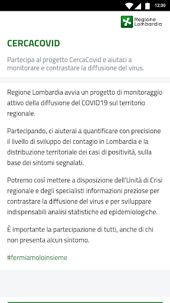
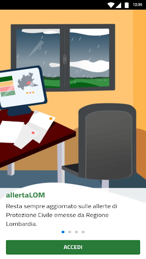
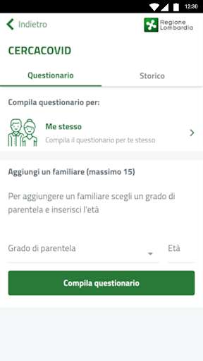

# allertaLOM
App version ``1.7.1``

Analyzed with [covid-apps-observer](http://github.com/covid-apps-observer) project, version ``0.1``

## App overview
| | |
|-------------------------|-------------------------| 
| **Name**&nbsp;&nbsp;&nbsp;&nbsp;&nbsp;&nbsp;&nbsp;&nbsp;&nbsp;&nbsp;&nbsp;&nbsp;&nbsp;&nbsp;&nbsp;&nbsp;&nbsp;&nbsp;&nbsp;&nbsp;&nbsp;&nbsp;&nbsp;&nbsp;&nbsp;&nbsp;&nbsp;&nbsp;&nbsp;&nbsp;&nbsp;&nbsp;&nbsp;&nbsp;&nbsp;&nbsp;&nbsp;&nbsp;&nbsp;&nbsp;  | allertaLOM |
| **Unique identifier** | it.lispa.sire.app.mobile.allertalom |
| **Link to Google Play** | [https://play.google.com/store/apps/details?id=it.lispa.sire.app.mobile.allertalom](https://play.google.com/store/apps/details?id=it.lispa.sire.app.mobile.allertalom) |
| **Summary**  | L’app della Protezione Civile di Regione Lombardia che allerta in tempo reale |
| **Privacy policy** | [http://www.allertalom.regione.lombardia.it/privacyapp](http://www.allertalom.regione.lombardia.it/privacyapp) |
| **Latest version** | 1.7.1 |
| **Last update** | 2020-10-30 21:53:06 |
| **Recent changes** | Grazie di essere un utente allertaLOM. Aggiorniamo regolarmente la nostra app per risolvere bug e fornire informazioni utili all&#39;utenza. |
| **Installs**  | 500.000+ |
| **Category** | Meteo |
| **First release** | 11 dic 2019 |
| **Size**  | 9,5M |
| **Supported Android version**  | 5.0 e versioni successive |

### Description
> allertaLOM è l’App di Regione Lombardia che permette di ricevere le allerte di Protezione Civile emesse dal Centro Funzionale Monitoraggio Rischi naturali di Regione Lombardia, in previsione di eventi naturali con possibili danni sul territorio.
 allertaLOM, in occasione dell’emergenza Coronavirus in Lombardia, si è evoluta in uno strumento di partecipazione attiva della cittadinanza al monitoraggio della diffusione del virus e in un canale di informazioni aggiornate sulle disposizioni regionali in materia, attraverso due nuove funzionalità:
 •	CercaCovid – la partecipazione al sondaggio CercaCovid permette a Regione Lombardia di quantificare il livello di diffusione del contagio e la distribuzione territoriale della positività, sulla base dei sintomi segnalati dagli utenti. I dati raccolti servono per analisi statistiche ed epidemiologiche, fondamentali per aiutare le autorità sanitarie a definire modelli e strategie di contrasto al Coronavirus. Il questionario è volontario, completamente anonimo, non prevede alcuna geolocalizzazione e non sostituisce una valutazione medica delle proprie condizioni. Partecipare è importante, anche in assenza di sintomi: più dati si ricevono, più il quadro della situazione è preciso. 
 •	Notifiche sull’emergenza Coronavirus in Lombardia - sono state attivate notifiche push con il link alla pagina del portale istituzionale che contiene gli aggiornamenti sul tema. Le notifiche possono essere disattivate dall'utente nell'apposita sezione. 
 Scarica l’App per:
 •	partecipare al monitoraggio attivo della diffusione del Coronavirus;
 •	ricevere informazioni aggiornate sulle azioni intraprese da Regione Lombardia per l’emergenza Coronavirus 
 •	personalizzare la ricezione delle notifiche sulle ultime disposizioni regionali riguardanti l’emergenza Coronavirus
 •	restare sempre aggiornato sulle allerte di Protezione Civile in Lombardia;
 •	monitorare la situazione di allerta sui Comuni preferiti oppure su tutta la regione;
 •	seguire l’evoluzione su mappa dei li-velli di allerta nell’arco di 36 ore;
 •	personalizzare la ricezione delle notifiche su tutti i rischi naturali oppure sui singoli rischi;
 •	ricevere notifiche all’emissione di allerte nei Comuni preferiti sui rischi prescelti;
 •	scaricare e consultare i documenti di allerta
 Come funziona l’allertamento di Protezione civile in Regione Lombardia
 •	Le allerte riguardano i rischi naturali prevedibili (idrogeologico, idraulico, temporali forti, vento forte, neve, valanghe e incendi boschivi) e presentano livelli crescenti di criticità (codice verde, giallo, arancione, rosso) a seconda della gravità ed estensione dei fenomeni. I documenti di allerta sono destinati al sistema locale di Protezione Civile e forniscono indicazioni per attivare le misure di contrasto previste nei Piani Comunali di Protezione Civile. Per i cittadini, le allerte sono uno strumento per sapere quando adottare le misure di auto-protezione, seguendo le indicazioni dell’Autorità locale di Protezione Civile. Per maggiori informazioni, consultare la pagina sulle allerte sul Portale di Regione Lombardia.

### User interface
The developers of the app provide the following screenshots in the Google play store.
| | | |
|:-------------------------:|:-------------------------:|:-------------------------:|
 |   |   |   | 
 |   |   |   | 
 |   |   |   | 
 |   |   |   | 
 |   |   |   | 
 |   |   |   | 
 |   |   |   | 

## Development team
In the following we report the main information provided by the development team in the Google play store.

| | |
|-------------------------|-------------------------|
| **Developer**  | Regione Lombardia |
| **Website**  | [http://www.allertalom.regione.lombardia.it](http://www.allertalom.regione.lombardia.it) |
| **Email** | info.allertalom@ariaspa.it |
| **Physical address**  | [Piazza Città di Lombardia 1 - 20124 Milano (Italia)](https://www.google.com/maps/search/Piazza%20Città%20di%20Lombardia%201%20-%2020124%20Milano%20(Italia)) (Google Maps) |
| **Other developed apps**  | [https://play.google.com/store/apps/developer?id=Regione+Lombardia](https://play.google.com/store/apps/developer?id=Regione+Lombardia) |

## Android support

| | |
|-------------------------|-------------------------|
| **Declared target Android version**  | Pie, version 9 (API level 28) |
| **Effective target Android version**  | Pie, version 9 (API level 28) |
| **Minimum supported Android version**  | Lollipop, version 5.0 (API level 21) |
| **Maximum target Android version**  | - |

The larger the difference between the minimum and maximum supported Android versions, the better. A larger difference means a wider audience. For example, old phones have a very low Android version, so a high minimum supported Android version means that the app cannot be used by users with old phones, thus leading to accessibility problems. 

## Requested permissions

In the following we report the complete list of the permissions requested by the app. 

| **Permission** | **Protection level** | **Description** | 
|-------------------------|-------------------------|-------------------------|
 **android.permission ACCESS_NETWORK_STATE** | Normal | Allows applications to access information about networks. 
 **android.permission CALL_PHONE** | :warning:**Dangerous** | Allows an application to initiate a phone call without going through the Dialer user interface for the user to confirm the call. 
 **android.permission GET_ACCOUNTS** | :warning:**Dangerous** | Allows access to the list of accounts in the Accounts Service. 
 **android.permission INTERNET** | Normal | Allows applications to open network sockets. 
 **android.permission READ_EXTERNAL_STORAGE** | :warning:**Dangerous** | Allows an application to read from external storage. 
 **android.permission WAKE_LOCK** | Normal | Allows using PowerManager WakeLocks to keep processor from sleeping or screen from dimming. 
 **android.permission WRITE_EXTERNAL_STORAGE** | :warning:**Dangerous** | Allows an application to write to external storage. 
 **com.google.android.c2dm.permission RECEIVE** | - | - 
 **it.lispa.sire.app.mobile.allertalom.permission C2D_MESSAGE** | - | - 

## Mentioned servers

| **Server** | **Registrant** | **Registrant country** | **Creation date** | 
|-------------------------|-------------------------|-------------------------|-------------------------|
 | googlesyndication.com | Google LLC | :us: US | 2003-01-21 06:17:24 |
 | google.com | Google LLC | :us: US | 1997-09-15 04:00:00 |
 | app-measurement.com | Google LLC | :us: US | 2015-06-19 20:13:31 |
 | gstatic.com | Google LLC | :us: US | 2008-02-11 15:31:25 |
 | whatsapp.com | Whatsapp Inc. | :us: US | 2008-09-04 12:39:12 |

## Security analysis 

Below we report the main security warnings raised by our execution of the [Androwarn](https://github.com/maaaaz/androwarn) security analysis tool.

**Telephony identifiers leakage**
> - This application reads the device phone type value 

**Connection interfaces exfiltration**
> - This application reads details about the currently active data network 
> - This application tries to find out if the currently active data network is metered 

**Telephony services abuse**
> - This application makes phone calls 

**Suspicious connection establishment**
> - This application opens a Socket and connects it to the remote address '' on the 'N/A' port  
> - This application opens a Socket and connects it to the remote address 'Ljava/lang/StringBuilder;->toString()Ljava/lang/String;' on the ': connect, resolve' port  
> - This application opens a Socket and connects it to the remote address 'Ljava/lang/StringBuilder;->toString()Ljava/lang/String;' on the 'N/A' port  
> - This application opens a Socket and connects it to the remote address 'Ljava/net/Proxy;->type()Ljava/net/Proxy$Type;' on the 'N/A' port  
> - This application opens a Socket and connects it to the remote address 'timeout' on the 'N/A' port  

**Code execution**
> - This application loads a native library: 'sqlc-native-driver' 
> - This application loads a native library: 'tool-checker' 
> - This application executes a UNIX command 
> - This application executes a UNIX command containing this argument: 'getprop' 
> - This application executes a UNIX command containing this argument: 'mount' 

## User ratings and reviews

Below we provide information about how end users are reacting to the app in terms of ratings and reviews in the Google Play store.

### Ratings

The allertaLOM app has been installed by more than **500000** times. At this time, **3912** rated the app and its average score is **3.6025**. Below we show the distribution of the ratings across the usual star-based rating of Google Play

:star::star::star::star::star:: 1487

:star::star::star::star:: 988

:star::star::star:: 499

:star::star:: 273

:star:: 665

### Reviews 

#### 5-star reviews

> App puntuale molto valida  :date: __2021-03-13 14:25:24__

> Aggiungerei una pagina relativa a info vaccini Covid e con l'occasione proporrei l'iscrizione si avrebbe un censimento migliore delle persone magari anche chiedendo vari dati lavoro, patologie, esenzioni ecc. Ecc. .  :date: __2021-03-11 01:51:09__

> NON FUNZIONA PIÙ  :date: __2021-03-09 11:43:55__

> Funziona bene  :date: __2021-01-29 01:26:56__

> Ottimo  :date: __2021-01-20 14:23:32__

> Ottimale  :date: __2021-01-09 13:14:56__

> Hanno risposto subito e ora funziona perfettamente grazie  :date: __2021-01-04 11:14:17__

> Funziona  :date: __2020-12-23 14:32:10__

> App molto utile per info sul tempo sulle allerte sui decreti per notizie e spostamenti utili in questo particolare momento un Grazie a tutti coloro che partecipano alla realizzazione del programma  :date: __2020-12-11 22:56:29__

> Seria  :date: __2020-12-11 16:52:11__

#### 4-star reviews

> Ok  :date: __2021-02-27 12:18:08__

> Ok  :date: __2021-02-13 21:07:14__

> Dopo aver segnalato l'errore persistente (impossibile evitare la compilazione questionario COVID e altri problemi), lo sviluppatore ha risolto il problema. Al momento tutto funziona come deve. Grazie Devs.  :date: __2021-01-24 10:39:00__

> Ogni tanto un po' lento  :date: __2021-01-14 19:00:44__

> Aggiungo due stelle. Senza fronzoli va al dunque. Per me lombardo funziona alla grande.  :date: __2020-12-11 13:32:57__

> La ritengo molto utile👍  :date: __2020-12-05 15:14:58__

> Applicazione utile serebbe opportuno inserire nelle cartine della regione le sigle delle aree come elencate nelle note  :date: __2020-12-05 14:41:39__

> La ritengo utile a livello informativo  :date: __2020-12-02 15:00:18__

> Utilissima soprattutto per un montanaro come me  :date: __2020-11-21 20:29:11__

> Molto buona!!  :date: __2020-11-14 09:31:47__

#### 3-star reviews

> Non è possibile cambiare l'età durante l'aggiornamento dei dati in un modulo già compilato  :date: __2021-03-12 15:22:58__

> Ha funzionato sempre bene ma, da un paio di settimane il servizio risulta "non raggiungibile, riprova più tardi ". L'ho disinstallato e reinstallato ma, non cambia nulla.  :date: __2021-03-08 19:14:03__

> Ottima okk  :date: __2020-12-01 18:32:58__

> Abbastanza semplice e pratica ..... Ma mi domando..... ---- Serve a qualcosa ?????  :date: __2020-11-10 15:03:59__

> Ottima ma al momento non riesco più ad entrare  :date: __2020-11-06 17:40:02__

> Subentrato un problema. Non appaiono più le notifiche. Ne circa il coronavirus, ne sulle allerte di protezione civile.  :date: __2020-10-27 01:06:02__

> Non mi permette di modificare i dati che restano memorizzati, come l'età, oppure variazioni nelle risposte di sintomi o problemi di salute  :date: __2020-10-21 23:43:43__

> Bene finora...dal 10 settembre non è stata pubblicata nemmeno un'ordinanza.... è un problema solo mio?  :date: __2020-10-21 20:04:12__

> Un po lenta per un uso di emergenza  :date: __2020-10-02 14:21:43__

> Come si cambia l'età anagrafica?  :date: __2020-09-18 20:18:32__

#### 2-star reviews

> Con l'ultimo aggiornamento mi chiede di compilare il questionario che ho già fatto ma non va più avanti. Mi chiede di inserire un parente  :date: __2021-03-07 14:22:52__

> Non viene mostrato in modo chiaro i vincoli colore delle zone (arancio giallo verde ....) In relazione alle ordinanze anticovid. In pratica non mostra in che zona colore siamo.  :date: __2021-01-10 11:16:37__

> Poco efficente e con descrizioni e annunci che sono copia di quelli ministeriali. Era meglio potenziare di più Immuni invece di farne una simile.  :date: __2020-12-10 17:45:49__

> App molto utile ed interessante peccato che ultimamente non si possa più utilizzare perché senza consenso al questionario covid, obbligato perché il tasto di rifiuto non funziona, non è più possibile utilizzare neppure la parte relativa alle allerte atmosferiche L'alternativa è ignorare completamente l'app  :date: __2020-12-05 13:55:03__

> Non si riesce a cambiare l'età e una volta inserito un familiare non si riesce più a toglierlo  :date: __2020-11-21 13:58:07__

> Oggi non si collega....  :date: __2020-10-30 08:31:22__

> Da un paio di mesi arrivano le allerte ma non si apre più l'applicazione  :date: __2020-10-04 13:40:07__

> Da tempo non riesco più ad aggiornare la mia situazione perché alla.prima domanda non mi viene consentito di rispondere . Le altre funzionano tutte ma alla fine mi dice che non posso inviare perché non ho risposto a tutte le domande. Peccato  :date: __2020-09-24 21:36:21__

> Non si comprende l utilizzo  :date: __2020-09-23 12:44:32__

> Poco utile  :date: __2020-09-09 18:24:47__

#### 1-star reviews

> Una cosa aveva di buono: quando arrivavano le allerte meteo, vedevi la cartina della regione coi colori e poi potevi vedere il dettaglio. Ora invece c'è un elenco di zone assolutamente inutile.  :date: __2021-03-13 12:59:41__

> Con l'ultimo aggiornamento non riesco più ad usare l'app senza compilare il questionario covid, e se provo a compilarlo si blocca sulla schermata di scelta familiare.  :date: __2021-02-24 15:38:39__

> Si blocca sempre  :date: __2021-01-23 20:49:46__

> Inutile  :date: __2021-01-09 10:44:04__

> Ti costringe a partecipare al questionario covid, per proseguire. Non funziona il tasto "Non mi interessa". Volevo essere informato sulle allerte della protezione civile. Le cercherò altrove.  :date: __2020-12-24 12:07:27__

> Ad un certo punto non ha più funzionato. Ho tentato di fare un aggiornamento ma non è riuscito, allora ho disinstallato la app e cercato di reinstallare, ma inutilmente! Non si installa  :date: __2020-11-19 12:54:38__

> Dopo l'ultimo aggiornamento non si apre più. Si inchioda ed esce la finestra che avvisa di riprovare. Avete voluto strafare per tracciare covid e compagni ed è uscito un minestrone inutile e che non sapete maneggiare. Peccato, le allerte meteo erano interessanti. Disinstallata e amen.  :date: __2020-11-16 00:51:51__

> Con gli ultimi aggiornamenti non si riesce più ad utilizzare l'App se non si compila il questionario. L'opzione di non partecipare al questionario non funziona  :date: __2020-11-15 12:10:17__

> Buon giorno Da ieri ho notato che app non si riesce più ad aprire.  :date: __2020-10-30 08:31:44__

> Non aggiornata  :date: __2020-10-27 23:50:27__

