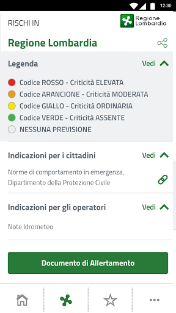

# allertaLOM
App version ``1.7.3``

Analyzed with [covid-apps-observer](http://github.com/covid-apps-observer) project, version ``0.1``

## App overview
| | |
|-------------------------|-------------------------| 
| **Name**&nbsp;&nbsp;&nbsp;&nbsp;&nbsp;&nbsp;&nbsp;&nbsp;&nbsp;&nbsp;&nbsp;&nbsp;&nbsp;&nbsp;&nbsp;&nbsp;&nbsp;&nbsp;&nbsp;&nbsp;&nbsp;&nbsp;&nbsp;&nbsp;&nbsp;&nbsp;&nbsp;&nbsp;&nbsp;&nbsp;&nbsp;&nbsp;&nbsp;&nbsp;&nbsp;&nbsp;&nbsp;&nbsp;&nbsp;&nbsp;  | allertaLOM |
| **Unique identifier** | it.lispa.sire.app.mobile.allertalom |
| **Link to Google Play** | [https://play.google.com/store/apps/details?id=it.lispa.sire.app.mobile.allertalom](https://play.google.com/store/apps/details?id=it.lispa.sire.app.mobile.allertalom) |
| **Summary**  | L’app della Protezione Civile di Regione Lombardia che allerta in tempo reale |
| **Privacy policy** | [http://www.allertalom.regione.lombardia.it/privacyapp](http://www.allertalom.regione.lombardia.it/privacyapp) |
| **Latest version** | 1.7.3 |
| **Last update** | 2021-05-21 16:22:44 |
| **Recent changes** | Grazie per essere un utente di allertaLOM. Aggiorniamo regolarmente la nostra app per garantire prestazioni e fruibilità. |
| **Installs**  | 500.000+ |
| **Category** | Meteo |
| **First release** | 11 dic 2019 |
| **Size**  | 9,6M |
| **Supported Android version**  | 5.0 e versioni successive |

### Description
> allertaLOM è l’App di Regione Lombardia che permette di ricevere le allerte di Protezione Civile emesse dal Centro Funzionale Monitoraggio Rischi naturali di Regione Lombardia, in previsione di eventi naturali con possibili danni sul territorio.
 allertaLOM, in occasione dell’emergenza Coronavirus in Lombardia, si è evoluta in uno strumento di partecipazione attiva della cittadinanza al monitoraggio della diffusione del virus e in un canale di informazioni aggiornate sulle disposizioni regionali in materia, attraverso due nuove funzionalità:
 •	CercaCovid – la partecipazione al sondaggio CercaCovid permette a Regione Lombardia di quantificare il livello di diffusione del contagio e la distribuzione territoriale della positività, sulla base dei sintomi segnalati dagli utenti. I dati raccolti servono per analisi statistiche ed epidemiologiche, fondamentali per aiutare le autorità sanitarie a definire modelli e strategie di contrasto al Coronavirus. Il questionario è volontario, completamente anonimo, non prevede alcuna geolocalizzazione e non sostituisce una valutazione medica delle proprie condizioni. Partecipare è importante, anche in assenza di sintomi: più dati si ricevono, più il quadro della situazione è preciso. 
 •	Notifiche sull’emergenza Coronavirus in Lombardia - sono state attivate notifiche push con il link alla pagina del portale istituzionale che contiene gli aggiornamenti sul tema. Le notifiche possono essere disattivate dall'utente nell'apposita sezione. 
 Scarica l’App per:
 •	partecipare al monitoraggio attivo della diffusione del Coronavirus;
 •	ricevere informazioni aggiornate sulle azioni intraprese da Regione Lombardia per l’emergenza Coronavirus 
 •	personalizzare la ricezione delle notifiche sulle ultime disposizioni regionali riguardanti l’emergenza Coronavirus
 •	restare sempre aggiornato sulle allerte di Protezione Civile in Lombardia;
 •	monitorare la situazione di allerta sui Comuni preferiti oppure su tutta la regione;
 •	seguire l’evoluzione su mappa dei li-velli di allerta nell’arco di 36 ore;
 •	personalizzare la ricezione delle notifiche su tutti i rischi naturali oppure sui singoli rischi;
 •	ricevere notifiche all’emissione di allerte nei Comuni preferiti sui rischi prescelti;
 •	scaricare e consultare i documenti di allerta
 Come funziona l’allertamento di Protezione civile in Regione Lombardia
 •	Le allerte riguardano i rischi naturali prevedibili (idrogeologico, idraulico, temporali forti, vento forte, neve, valanghe e incendi boschivi) e presentano livelli crescenti di criticità (codice verde, giallo, arancione, rosso) a seconda della gravità ed estensione dei fenomeni. I documenti di allerta sono destinati al sistema locale di Protezione Civile e forniscono indicazioni per attivare le misure di contrasto previste nei Piani Comunali di Protezione Civile. Per i cittadini, le allerte sono uno strumento per sapere quando adottare le misure di auto-protezione, seguendo le indicazioni dell’Autorità locale di Protezione Civile. Per maggiori informazioni, consultare la pagina sulle allerte sul Portale di Regione Lombardia.

### User interface
The developers of the app provide the following screenshots in the Google play store.
| | | |
|:-------------------------:|:-------------------------:|:-------------------------:|
 |   |   |   | 
 |   |   |   | 
 |   |   |   | 
 |   |   |   | 
 |   |   |   | 
 |   |   |   | 
 |   |   |   | 
 |   |   |   | 

## Development team
In the following we report the main information provided by the development team in the Google play store.

| | |
|-------------------------|-------------------------|
| **Developer**  | Regione Lombardia |
| **Website**  | [http://www.allertalom.regione.lombardia.it](http://www.allertalom.regione.lombardia.it) |
| **Email** | info.allertalom@ariaspa.it |
| **Physical address**  | [Piazza Città di Lombardia 1 - 20124 Milano (Italia)](https://www.google.com/maps/search/Piazza%20Città%20di%20Lombardia%201%20-%2020124%20Milano%20(Italia)) (Google Maps) |
| **Other developed apps**  | [https://play.google.com/store/apps/developer?id=Regione+Lombardia](https://play.google.com/store/apps/developer?id=Regione+Lombardia) |

## Android support

| | |
|-------------------------|-------------------------|
| **Declared target Android version**  | Pie, version 9 (API level 28) |
| **Effective target Android version**  | Pie, version 9 (API level 28) |
| **Minimum supported Android version**  | Lollipop, version 5.0 (API level 21) |
| **Maximum target Android version**  | - |

The larger the difference between the minimum and maximum supported Android versions, the better. A larger difference means a wider audience. For example, old phones have a very low Android version, so a high minimum supported Android version means that the app cannot be used by users with old phones, thus leading to accessibility problems. 

## Requested permissions

In the following we report the complete list of the permissions requested by the app. 

| **Permission** | **Protection level** | **Description** | 
|-------------------------|-------------------------|-------------------------|
 **android.permission ACCESS_NETWORK_STATE** | Normal | Allows applications to access information about networks. 
 **android.permission CALL_PHONE** | :warning:**Dangerous** | Allows an application to initiate a phone call without going through the Dialer user interface for the user to confirm the call. 
 **android.permission GET_ACCOUNTS** | :warning:**Dangerous** | Allows access to the list of accounts in the Accounts Service. 
 **android.permission INTERNET** | Normal | Allows applications to open network sockets. 
 **android.permission READ_EXTERNAL_STORAGE** | :warning:**Dangerous** | Allows an application to read from external storage. 
 **android.permission WAKE_LOCK** | Normal | Allows using PowerManager WakeLocks to keep processor from sleeping or screen from dimming. 
 **android.permission WRITE_EXTERNAL_STORAGE** | :warning:**Dangerous** | Allows an application to write to external storage. 
 **com.google.android.c2dm.permission RECEIVE** | - | - 
 **it.lispa.sire.app.mobile.allertalom.permission C2D_MESSAGE** | - | - 

## Mentioned servers

| **Server** | **Registrant** | **Registrant country** | **Creation date** | 
|-------------------------|-------------------------|-------------------------|-------------------------|
 | googlesyndication.com | Google LLC | :us: US | 2003-01-21 06:17:24 |
 | google.com | Google LLC | :us: US | 1997-09-15 04:00:00 |
 | app-measurement.com | Google LLC | :us: US | 2015-06-19 20:13:31 |
 | gstatic.com | Google LLC | :us: US | 2008-02-11 15:31:25 |
 | whatsapp.com | WhatsApp LLC | :us: US | 2008-09-04 12:39:12 |

## Security analysis 

Below we report the main security warnings raised by our execution of the [Androwarn](https://github.com/maaaaz/androwarn) security analysis tool.

**Telephony identifiers leakage**
> - This application reads the device phone type value 

**Connection interfaces exfiltration**
> - This application reads details about the currently active data network 
> - This application tries to find out if the currently active data network is metered 

**Telephony services abuse**
> - This application makes phone calls 

**Suspicious connection establishment**
> - This application opens a Socket and connects it to the remote address '' on the 'N/A' port  
> - This application opens a Socket and connects it to the remote address 'Ljava/lang/StringBuilder;->toString()Ljava/lang/String;' on the ': connect, resolve' port  
> - This application opens a Socket and connects it to the remote address 'Ljava/lang/StringBuilder;->toString()Ljava/lang/String;' on the 'N/A' port  
> - This application opens a Socket and connects it to the remote address 'Ljava/net/Proxy;->type()Ljava/net/Proxy$Type;' on the 'N/A' port  
> - This application opens a Socket and connects it to the remote address 'timeout' on the 'N/A' port  

**Code execution**
> - This application loads a native library: 'sqlc-native-driver' 
> - This application loads a native library: 'tool-checker' 
> - This application executes a UNIX command 
> - This application executes a UNIX command containing this argument: 'getprop' 
> - This application executes a UNIX command containing this argument: 'mount' 

## User ratings and reviews

Below we provide information about how end users are reacting to the app in terms of ratings and reviews in the Google Play store.

### Ratings

The allertaLOM app has been installed by more than **500000** times. At this time, **4214** rated the app and its average score is **3.6966825**. Below we show the distribution of the ratings across the usual star-based rating of Google Play

:star::star::star::star::star:: 1758

:star::star::star::star:: 989

:star::star::star:: 509

:star::star:: 349

:star:: 609

### Reviews 

#### 5-star reviews

> Ottima  :date: __2021-07-09 15:31:03__

> Ottimo per informazioni sul pandemia  :date: __2021-06-19 09:52:09__

> Ciaet  :date: __2021-06-16 10:40:21__

> Ottima  :date: __2021-05-07 09:15:59__

> App fantastica: sono felicissimo, così si riuscirà a contenere il virus ed evitare che le classi finiscano in quarantena per l'ennesima volta come la mia... non ne potevo più di sentirmi inutile e non servire a niente a parte stare ai regolamenti, invece adesso posso aiutare più di 60 milioni di persone...  :date: __2021-04-29 21:38:24__

> Oggi 24 Aprile 2021, NON si apre il collegamento "alla pagina", riguardo le ultime comunicazioni Regionali per il colore e, le novità del nuovo Decreto Regione Lombardia. Potete fare qualcosa? Grazie. * Problema risolto! Grazie agli sviluppatori per la risposta.  :date: __2021-04-28 14:38:16__

> L'applicazione insiste a dirmi di essere aggiornata, io controllo ma di aggiornamenti non ne trovo. Come mai?  :date: __2021-04-28 13:35:25__

> Grande  :date: __2021-04-22 20:50:49__

> Mando soltanto informazioni utile  :date: __2021-04-22 20:46:28__

> Ottima  :date: __2021-04-22 17:36:37__

#### 4-star reviews

> Dall'ultima versione non mi arrivano più gli avvisi di allarme. Devo entrare io nell'app e verificare  :date: __2021-07-13 10:26:13__

> Perché non si riesce a cambiare l'età....e bisogna rifare tutto....è logico che anno con anno si cambia....dovrebbe esserci la possibilità di farlo senza dover disinstallare e reinstallare....almeno io non riesco...se c'è un modo ....grazie  :date: __2021-05-22 09:02:31__

> Non mi fa modificare la mia età è rimasta quella dell anno scorso ma per il resto funziona benissimo  :date: __2021-05-16 22:10:43__

> App funzionale, suggerisco aggiungere anche la localizzazione per avere la possibilità di essere aggiornati in tempo reale sulle allerte nella esatta posizione in cui ci si trova  :date: __2021-05-12 13:10:22__

> È sempre andata bene, da un po' di tempo escono le notifiche ma non apre la APP. Alzo il punteggio a seguito della risposta dello sviluppatore  :date: __2021-05-07 12:55:17__

> Ok:risolto con altro update dopo 14gg-Era molto bella, aveva una cartina con l'evoluzione nel tempo ma una cosa pubblica non poteva essere bella o utile, quindi qualcuno è intervenuto e ha fatto diventare la semplice cartina una lista di codici tipo "pianura centrale IM10" "nodo idraulico Milano IM09" di cui nessuno che non lavori in regione sa confini o posizione, con tabelle illeggibili. Non trovo modo di riavere la cartina o l'impegno che hanno messo nel nasconderla supera la mia pazienza. :(  :date: __2021-05-01 16:17:27__

> Ottimo servizio.  :date: __2021-04-23 06:36:30__

> Ottima  :date: __2021-04-22 17:59:01__

> Perché continua a dirmi di aggiornare e non me lo permette?  :date: __2021-04-22 16:38:14__

> Non continuate a mandare messaggi del tipo: se non aggiorni non riceverai più le notifiche......aggiornamento al 19/ 3  :date: __2021-04-22 15:59:03__

#### 3-star reviews

> Poco precisa  :date: __2021-07-26 17:12:47__

> Nella parte dedicata alle istruzioni ai cittadini, il link risulta rimosso. Poco utile avere l'allerta se poi mancano le istruzioni da seguire. Verificate che i link siano funzionanti  :date: __2021-07-26 11:54:48__

> Spesso la app su blocca all'apertura...  :date: __2021-07-24 13:45:10__

> Sembra tornata a funzionare.  :date: __2021-06-23 10:19:38__

> Ottimo  :date: __2021-04-22 15:51:52__

> Avverte di aggiornare ma non me lo permette!!! Uffa!!!  :date: __2021-04-22 15:49:24__

> Non riesco ad aggiornare mi potete aiutare  :date: __2021-04-22 15:48:16__

> Inefficace x la prevenzione del contagio  :date: __2021-04-20 17:55:07__

> Il questionario emergenza covid non mi lascia aggiornare i miei dati personali, età anagrafica.  :date: __2021-04-19 21:19:02__

> Utile ,mi tiene aggiornata.  :date: __2021-04-08 21:17:47__

#### 2-star reviews

> Con l'ultimo aggiornamento si verifica un bug con "lista zone" e "mappa": Quando arriva un'allerta di qualisiasi entità (giallo rossa ecc, idro, vento ecc) l'app mostra sempre prima la lista zone e se voglio vedere la mappa questa risulta non visibile fino a quando mi sposto su un'altra categoria, a quel punto ricompare la mappa e tornando indietro viene caricata anche quella iniziale in allerta.(es allerta gialla per temporali>mappa bianca>mi sposto su allerta vento>torno su temporali>mappa)  :date: __2021-07-15 12:48:38__

> Purtroppo devo dire che, così com'è impostata, con il discorso tampone, non ha più senso. Dovrebbe essere aggiornata, vista l'enorme campagna vaccinale in corso, con l'effettuazione del tipo di vaccino somministrato.  :date: __2021-06-12 13:00:54__

> Si poteva fare meglio  :date: __2021-06-06 11:48:57__

> Dice di aggiornare ma non me la fa aggiornare, dice 19/03/2021 ma non c'è nessun aggiornamento grazie Gigio  :date: __2021-04-22 16:59:09__

> Mediocre  :date: __2021-04-22 16:22:23__

> Mi dice da due giorni di aggiornare l' app, ma non lo fa fare, non ci sono aggiornamenti.  :date: __2021-04-22 16:08:42__

> Ho ricevuro l'invito ad aggiornare l'app, ma su Play Store non c'è nessun aggiornamento. Come devo fare per aggiornare ?  :date: __2021-04-22 15:39:33__

> Come la sanità funziona una volta si e tre NO  :date: __2021-04-22 15:35:12__

> Non riesco ad aggiornare l'app, come posso fare? Non riesco più ad entrare  :date: __2021-04-19 21:10:56__

> Una cosa aveva di buono: quando arrivavano le allerte meteo, vedevi la cartina della regione coi colori e poi potevi vedere il dettaglio. Ora invece c' Questa recensione è stata utile? Sì No Regione Lombardia 15/03/21 Ciao Emanuele, assicurati di aver selezionato "Mappa" dalle 3 linee in alto a destra dell'app. Per assistenza scrivi a info.allertalom@ariasp ......... Dove sono le tre linee in alto a destra? .......... Galaxy note 20 con ultima UI e ultima versione android  :date: __2021-04-05 19:14:35__

#### 1-star reviews

> più lenta e malfunzionante di quest'app, c'è solo quest'app  :date: __2021-07-24 17:57:54__

> Non mi arrivano le notifiche di allert  :date: __2021-07-11 09:47:58__

> La disinstallo che non é mai servita a niente. Ore 17 grandinata mega, ti arrivata in mattina il solito messaggio che non fa aprire l'app. Ma un servizio cone quello delle assicurazioni che ti avvisa all'istante in base a GPS o impostazioni da scegliere non ce l'avete? Che mi frega se fate una pappardella degli eventi della Lombardia, chi la legge? Poi la parte Covid stendiamo un velo pietoso. Soldi buttati  :date: __2021-07-08 17:30:46__

> Non si apre più  :date: __2021-07-03 12:40:13__

> Divenuta obsoleta! Da domani la disinstallo se nulla è migliorato  :date: __2021-07-01 19:20:56__

> Non si apre  :date: __2021-06-21 13:41:53__

> Non funziona, disinstallata...  :date: __2021-06-20 09:31:14__

> Arrivano le notifiche e quando si tenta di aprirle dice servizio non disponibile  :date: __2021-06-19 14:10:16__

> Sempre stata un po' zoppicante ma adesso nn si apre nemmeno più. Mi è arrivata una notifica, la avvio e... servizio attualmente nn disponibile, riprova più tardi!! Penosa.  :date: __2021-06-19 13:56:38__

> Arrivano le notifiche di allerta e quando si clicca sulla notifica non mostra niente solo pagina bianca  :date: __2021-06-19 13:40:22__

