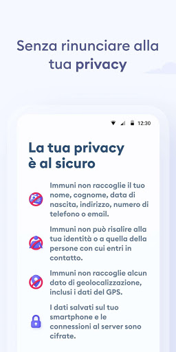
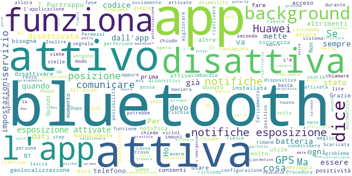
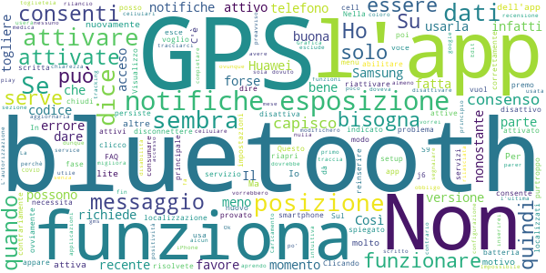
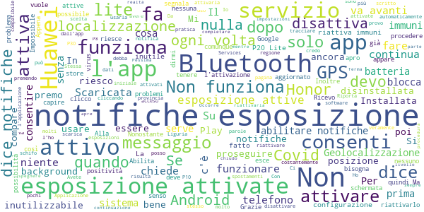

# Immuni
App version ``1.0.0``

Analyzed with [covid-apps-observer](http://github.com/covid-apps-observer) project, version ``0.1``

## App overview
| | |
|-------------------------|-------------------------| 
| **Name**&nbsp;&nbsp;&nbsp;&nbsp;&nbsp;&nbsp;&nbsp;&nbsp;&nbsp;&nbsp;&nbsp;&nbsp;&nbsp;&nbsp;&nbsp;&nbsp;&nbsp;&nbsp;&nbsp;&nbsp;&nbsp;&nbsp;&nbsp;&nbsp;&nbsp;&nbsp;&nbsp;&nbsp;&nbsp;&nbsp;&nbsp;&nbsp;&nbsp;&nbsp;&nbsp;&nbsp;&nbsp;&nbsp;&nbsp;&nbsp;  | Immuni |
| **Unique identifier** | it.ministerodellasalute.immuni |
| **Link to Google Play** | [https://play.google.com/store/apps/details?id=it.ministerodellasalute.immuni](https://play.google.com/store/apps/details?id=it.ministerodellasalute.immuni) |
| **Summary**  | App ufficiale per le notifiche di esposizione in Italia |
| **Privacy policy** | [https://www.immuni.italia.it/app-pn.html](https://www.immuni.italia.it/app-pn.html) |
| **Latest version** | 1.0.0 |
| **Last update** | 2020-06-01 17:52:09 |
| **Recent changes** | Primo rilascio |
| **Installs**  | 10+ |
| **Category** | Medicina |
| **First release** | 1 giu 2020 |
| **Size**  | 7,2M |
| **Supported Android version**  | 6.0 e versioni successive |

### Description
> Immuni è l’app ufficiale per le notifiche di esposizione del governo italiano, sviluppata dal Commissario Straordinario per l’Emergenza COVID-19 in collaborazione con il Ministero della Salute e il Ministero per l’Innovazione Tecnologica e la Digitalizzazione. L’app è sviluppata e rilasciata nel pieno rispetto della protezione dei dati personali dell’utente e della normativa vigente, incluso il decreto-legge del 30 aprile 2020, n. 28.
 Nella lotta all’epidemia di COVID-19, l’app aiuta a notificare gli utenti potenzialmente contagiati il prima possibile, anche quando sono asintomatici. Questi utenti possono poi isolarsi per evitare di contagiare altri, con l’effetto di minimizzare la diffusione del virus e velocizzare il ritorno a una vita normale per la maggior parte della popolazione. Venendo informati tempestivamente, inoltre, gli utenti possono anche contattare il proprio medico di medicina generale, riducendo così il rischio di complicanze.
 Il sistema di notifiche di esposizione di Immuni si basa sulla tecnologia Bluetooth Low Energy, creata per essere particolarmente efficiente in termini di risparmio energetico, e non utilizza alcun tipo di dato di geolocalizzazione, inclusi quelli del GPS. L’app non raccoglie e non è in grado di ottenere alcun dato che identifichi l’utente, quali nome, cognome, data di nascita, indirizzo, numero di telefono o indirizzo email. Immuni riesce quindi a determinare che un contatto fra due utenti è avvenuto, ma non chi siano effettivamente i due utenti o dove si siano incontrati.
 Ecco una lista di alcune delle misure con cui Immuni protegge i dati degli utenti:
 • I dati raccolti sono quelli minimi, strettamente necessari per supportare e migliorare il sistema di notifiche di esposizione.
 • Il codice Bluetooth Low Energy trasmesso dall’app è generato in maniera casuale e non contiene alcuna informazione riguardo allo smartphone dell’utente, tanto meno sull’utente stesso. Inoltre, questo codice cambia svariate volte ogni ora, per tutelare ancora meglio la privacy dell’utente.
 • I dati salvati sullo smartphone sono cifrati.
 • Le connessioni tra l’app e il server sono cifrate.
 • Tutti i dati, siano essi salvati sul dispositivo o sul server, saranno cancellati non appena non saranno più necessari e in ogni caso non oltre il 31 dicembre 2020.
 • È il Ministero della Salute il soggetto che raccoglie i dati e che decide per quali scopi utilizzarli. In ogni caso, i dati verranno usati solo per contenere l’epidemia del COVID-19 e per la ricerca scientifica.
 • I dati sono salvati su server in Italia e gestiti da soggetti pubblici.

 Immuni non fa e non può fare diagnosi. Sulla base dello storico dei contatti con utenti potenzialmente contagiosi, Immuni elabora alcune raccomandazioni su come è necessario comportarsi. Ma l’app non è un dispositivo medico e non può in alcun caso sostituire un medico.
 Immuni è uno strumento importante nella lotta a questa terribile epidemia e ciascun utente ne aumenta l’efficacia complessiva. Per questo consigliamo vivamente di installare l’app, usarla correttamente e incoraggiare parenti e amici a fare lo stesso. Tuttavia, non c’è alcun obbligo di utilizzo. La decisione spetta soltanto all’individuo.

### User interface
The developers of the app provide the following screenshots in the Google play store.
| | | |
|:-------------------------:|:-------------------------:|:-------------------------:|
 |   |   |   | 
 |  

## Development team
In the following we report the main information provided by the development team in the Google play store.

| | |
|-------------------------|-------------------------|
| **Developer**  | Ministero della Salute |
| **Website**  | [https://www.immuni.italia.it/](https://www.immuni.italia.it/) |
| **Email** | direzionesistemainformativo@sanita.it |
| **Physical address**  | - |
| **Other developed apps**  | [https://play.google.com/store/apps/developer?id=Ministero+della+Salute](https://play.google.com/store/apps/developer?id=Ministero+della+Salute) |

## Android support

| | |
|-------------------------|-------------------------|
| **Declared target Android version**  | Android10, version 10 (API level 29) |
| **Effective target Android version**  | Android10, version 10 (API level 29) |
| **Minimum supported Android version**  | Marshmallow, version 6.0 (API level 23) |
| **Maximum target Android version**  | - |

The larger the difference between the minimum and maximum supported Android versions, the better. A larger difference means a wider audience. For example, old phones have a very low Android version, so a high minimum supported Android version means that the app cannot be used by users with old phones, thus leading to accessibility problems. 

## Requested permissions

In the following we report the complete list of the permissions requested by the app. 

| **Permission** | **Protection level** | **Description** | 
|-------------------------|-------------------------|-------------------------|
 **android.permission ACCESS_NETWORK_STATE** | Normal | Allows applications to access information about networks. 
 **android.permission BLUETOOTH** | Normal | Allows applications to connect to paired bluetooth devices. 
 **android.permission FOREGROUND_SERVICE** | Normal | Allows a regular application to use Service.startForeground. 
 **android.permission INTERNET** | Normal | Allows applications to open network sockets. 
 **android.permission RECEIVE_BOOT_COMPLETED** | Normal | Allows an application to receive the Intent.ACTION_BOOT_COMPLETED that is broadcast after the system finishes booting. 
 **android.permission WAKE_LOCK** | Normal | Allows using PowerManager WakeLocks to keep processor from sleeping or screen from dimming. 

## Mentioned servers

| **Server** | **Registrant** | **Registrant country** | **Creation date** | 
|-------------------------|-------------------------|-------------------------|-------------------------|
 | google.com | Google LLC | :us: US | 1997-09-15 04:00:00 |
 | googleapis.com | Google LLC | :us: US | 2005-01-25 17:52:26 |

## Security analysis 

Below we report the main security warnings raised by our execution of the [Androwarn](https://github.com/maaaaz/androwarn) security analysis tool.

**Connection interfaces exfiltration**
> - This application reads details about the currently active data network 
> - This application tries to find out if the currently active data network is metered 

**Telephony services abuse**
> - This application makes phone calls 

**Suspicious connection establishment**
> - This application opens a Socket and connects it to the remote address ' returned no addresses for  ; port is out of range' on the 'N/A' port  
> - This application opens a Socket and connects it to the remote address '' on the 'N/A' port  
> - This application opens a Socket and connects it to the remote address 'Ljava/lang/StringBuilder;->toString()Ljava/lang/String;' on the 'N/A' port  
> - This application opens a Socket and connects it to the remote address 'Ljava/net/Proxy;->type()Ljava/net/Proxy$Type;' on the 'N/A' port  
> - This application opens a Socket and connects it to the remote address 'Method sendUrgentData() is not supported.' on the 'N/A' port  
> - This application opens a Socket and connects it to the remote address 'Method setHandshakeTimeout() is not supported.' on the 'N/A' port  
> - This application opens a Socket and connects it to the remote address 'Method setOOBInline() is not supported.' on the 'N/A' port  
> - This application opens a Socket and connects it to the remote address 'Method setSoWriteTimeout() is not supported.' on the 'N/A' port  
> - This application opens a Socket and connects it to the remote address 'Socket closed' on the 'N/A' port  
> - This application opens a Socket and connects it to the remote address 'Socket is closed' on the 'N/A' port  
> - This application opens a Socket and connects it to the remote address 'Socket is closed.' on the 'N/A' port  
> - This application opens a Socket and connects it to the remote address 'Socket is not connected.' on the 'N/A' port  
> - This application opens a Socket and connects it to the remote address 'socket is closed' on the 'N/A' port  
> - This application opens a Socket and connects it to the remote address 'timeout' on the 'N/A' port  

**Code execution**
> - This application loads a native library: 'conscrypt_gmscore_jni' 
> - This application loads a native library: 'conscrypt_jni' 

## User ratings and reviews

Below we provide information about how end users are reacting to the app in terms of ratings and reviews in the Google Play store.

### Ratings

The Immuni app has been installed by more than **10** times. At this time, **1037** rated the app and its average score is **4.355834**. Below we show the distribution of the ratings across the usual star-based rating of Google Play

:star::star::star::star::star:: 787

:star::star::star::star:: 76

:star::star::star:: 42

:star::star:: 20

:star:: 112

### Reviews 

#### 5-star reviews

> App semplice e chiara. Chi si preoccupa della privacy come minimo usa sempre la stessa password per tutti i siti e usa regolarmente social network. Per Facebook o instagram non vi fate tutti questi problemi? Meno complottismi  :date: __2020-06-01 22:56:37__

> Dovrebbero installarla tutti per il bene comune  :date: __2020-06-01 22:56:13__

> Semplice da installare e molto chiara nelle spiegazioni  :date: __2020-06-01 22:54:39__

> Ottima! Semplice funzionale e ben fatta  :date: __2020-06-01 22:50:37__

> Ottimo!  :date: __2020-06-01 22:49:39__

> Bellissima  :date: __2020-06-01 22:48:59__

> App semplice da capire ed usare. A mio avviso adatta a tutti senza problemi. Per me sembra veramente perfetta!  :date: __2020-06-01 22:48:35__

> Fin'ora tutto ok. Molto fruibile e non da problemi.  :date: __2020-06-01 22:48:25__

> Bellissima  :date: __2020-06-01 22:47:56__

> Su Samsung S9+ sembra funzionare.  :date: __2020-06-01 22:47:54__

#### 4-star reviews

> Da incoraggiare. Segnalo tuttavia alcuni problemi. Se si esce e subito dopo si rientra, la app è disattivata. Non appena si prova a riattivare, non consente di riattivare le notifiche di esposizione a Covid.  :date: __2020-06-01 22:43:22__

> Al momento mi riservo di fare una valutazione  :date: __2020-06-01 22:35:35__

> Ottima  :date: __2020-06-01 22:34:29__

> Il gioco è ben fatto e la grafica carina, ideale per gli amanti del genere horror/post-apocalittico. Darò 5 stelle quando aggiungerete le armi per affrontare gli infetti  :date: __2020-06-01 22:31:45__

> Comunica questo codice alloperatore sanitario Che significa  :date: __2020-06-01 22:22:43__

> Grafica moderna ed accattivante, installazione e configurazione molto semplici. Ora resta solo da capire se funzionerà 😊  :date: __2020-06-01 22:22:11__

> dal punto di vista della facilità di installazione ottima. utilità dipendente dai comportamenti collettivi. vediamo. Magari si merita 5 stelle...  :date: __2020-06-01 22:18:00__

> Per ora pare fatta bene, quando girerò in città vedrò come si comporterà.  :date: __2020-06-01 22:15:53__

> Al momento segnalo solo che da ricerca Play store, l'app immuni non compare: ho dovuto scaricare da un link diretto. Per il resto sembra stabile e rimane attiva anche dopo riavvio dello smartphone. Asus_X00HD, Android 8.1.0.  :date: __2020-06-01 22:14:49__

> Le notifiche di esposizione si attivano solo se quando installi l'app il Bluetooth è spento e l' app lo attiva. Honor 6x  :date: __2020-06-01 22:05:08__

#### 3-star reviews

> Purtroppo richiede il GPS sempre attivo poiché altrimenti il mio telefono non riesce a sfruttare la geolocalizzazione. Avrei voluto usarla ma se lascio il GPS acceso sempre la batteria mi muore ogni 2 ore.  :date: __2020-06-01 22:51:47__

> Scaricata ma, durante la configurazione, non procede perché appare un messaggio "notifiche di esposizione non attivate". Ho un huawei mate 20 lite... Possibile che sia per questo motivo? Grazie  :date: __2020-06-01 22:41:54__

> Sarebbe utile per le persone che per lavoro si muovono stabilmente su più province poterle selezionare tutte.  :date: __2020-06-01 22:39:28__

> Si disattiva e chiede l'autorizzazione alle notifiche che però ho già dato in precedenza nn funziona  :date: __2020-06-01 22:37:32__

> L' App si disattiva quando si mette in background o si chiude. Per il resto perfetta.  :date: __2020-06-01 22:33:59__

> Mi lascia perplessa la cancellazione dei dati entro e non oltre il 31 dicembre 2020. E se l'emergenza non sarà ancora terminata?  :date: __2020-06-01 22:29:08__

> Si mai dai perché attivate la geolocalizzazione se non ne ha bisogno...sthonks  :date: __2020-06-01 22:21:44__

> Sul mio dispositivo l'app non funziona alla perfezione se chiudo e riapro l'applicazione non rimane attiva la funzione e se premo per riattivarla mi segnala un problema, spero in un aggiornamento  :date: __2020-06-01 22:19:48__

> Purtroppo chiede pure la posizione attiva e anche se dice che non verrà utilizzata per rintracciare, ma per trovare i dispositivi bluetooth vicini, la mia batteria crollerebbe in molto poco tempo con bluetooth e posizione sempre attiva! Non so quanto la potrò usare mi spiace  :date: __2020-06-01 22:16:19__

> app potrebbe essere utile pero' dicono che non tracceranno la posizione e perche' allora per utilizzarla bisogna avere il GPS acceso? un eventuale contagiato come fa a comunicare che e' stato contagiato?  :date: __2020-06-01 22:10:03__

#### 2-star reviews

> Notifiche di esposizione non attive Questo è il messaggio di errore che mi dà Ho un Samsung j6  :date: __2020-06-01 22:54:17__

> Clicando sulla voce "consenti" esce la scritta " notifiche da esposizione non attivate" e non mi consente di abilitare le notifiche. Il cell. è uno smartphone Samsung S9  :date: __2020-06-01 22:53:56__

> Quando chiudi l'app e poi la riapri si disattiva, bisogna disconnettere il bluetooth e per riattivare l'app bisogna di nuovo attivare il bluetooth.  :date: __2020-06-01 22:43:52__

> Nella fase di setup dice "notifiche di esposizione non attivate" quando premo "consenti".  :date: __2020-06-01 22:42:59__

> L'app sembra fatta bene, se non fosse che necessita dei servizi di localizzazione attivi per funzionare e non solo del bluetooth come indicato, infatti se disattivo il GPS appare il messaggio "servizio non attivo". In questo modo si può essere localizzati, contrariamente a quanto spiegato nelle FAQ.  :date: __2020-06-01 22:40:53__

> Non posso dare di più perché quando clicco si "consenti " mi dice notifiche di esposizione non attivate...che vuol dire...risolvete  :date: __2020-06-01 22:31:51__

> Sul mio telefono non si possono attivare le notifiche di esposizione  :date: __2020-06-01 22:28:55__

> Su Huawei purtroppo non funziona. Visualizzo un messaggio di errore che mi richiede di attivare il GPS nonostante questo sia correttamente attivato. Ho provato ovviamente a togliere e reinserire il GPS, sia dal menú principale che da impostazioni, ma il problema persiste.  :date: __2020-06-01 22:27:34__

> Non voglio consumare la batteria con il GPS acceso. Se la app non usa il GPS per favore aggiornarla e togliere obbligo di gps. Così non la userà nessuno. È scritto ovunque che non serve la posizione, quindi toglietela  :date: __2020-06-01 22:25:37__

> Non capisco... Il codice..? Serve?.. L'autorizzazione medica?  :date: __2020-06-01 21:47:59__

#### 1-star reviews

> Grandi proclami, ma poi con i dispositivi Huawei, che sono una fetta non indifferente del mercato, non funziona. Prima di sbandierare che Immuni era pronta, non era opportuno renderla compatibile con tutte le marche? Possibile che una app così importante debba avere questi problemi???  :date: __2020-06-01 22:58:11__

> stesso problema già descritto da molti...non si riesce ad attivare su tanti modelli Huawei, in pratica è inutilizzabile  :date: __2020-06-01 22:57:36__

> Applicazione molto bella, ma su Huawei P20 Lite tutto aggiornato non funziona, non si abilitano le notifiche di esposizione.  :date: __2020-06-01 22:57:34__

> Scaricata ma disinstallata subito! Doveva usare solo il Bluetooth, invece chiede la geocalizzazione. Per questo non la voglio usare  :date: __2020-06-01 22:57:09__

> il servizio si disattiva ogni volta che esco dall'app. Ed ogni volta devo riattivare. Impossibile da usare così  :date: __2020-06-01 22:56:17__

> inizialmente ha funzionato, poi è uscito scritto "non attivo"... "abilità le notifiche"...ma niente da fare...non funziona più  :date: __2020-06-01 22:52:48__

> Per far funzionare la app devo scollegare lo smart band!  :date: __2020-06-01 22:52:46__

> Con Hawaii P20 lite se Bluetooth è già attivo app segnala che deve essere riattivata la notifica di esposizione covid e non va avanti. Se Bluetooth è spento la riattivazione funziona  :date: __2020-06-01 22:51:15__

> Installata, mi blocca l'avvio perché mi dice "notifiche di esposizione non attivate“ quando il mio telefono ha tutto aperto, dal Bluetooth alla geolocalizzazione. In ritardo è già baggata?  :date: __2020-06-01 22:44:28__

> Lo appena istallato ma dice che vuole assistenza operatore sanitaria per attivare il codice  :date: __2020-06-01 22:44:25__

