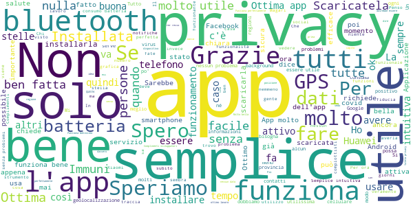
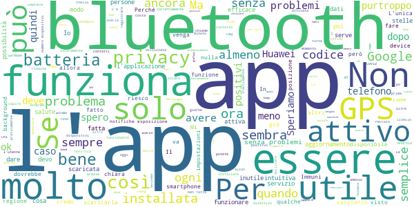
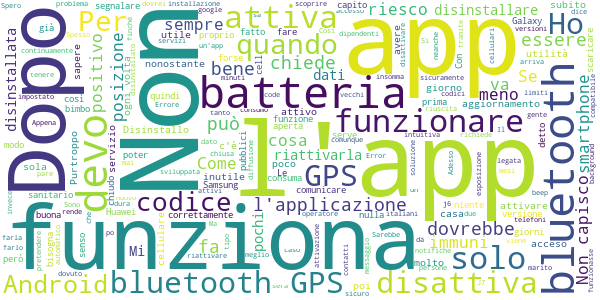

# Immuni
App version ``1.0.2``

Analyzed with [covid-apps-observer](http://github.com/covid-apps-observer) project, version ``0.1``

## App overview
| | |
|-------------------------|-------------------------| 
| **Name**&nbsp;&nbsp;&nbsp;&nbsp;&nbsp;&nbsp;&nbsp;&nbsp;&nbsp;&nbsp;&nbsp;&nbsp;&nbsp;&nbsp;&nbsp;&nbsp;&nbsp;&nbsp;&nbsp;&nbsp;&nbsp;&nbsp;&nbsp;&nbsp;&nbsp;&nbsp;&nbsp;&nbsp;&nbsp;&nbsp;&nbsp;&nbsp;&nbsp;&nbsp;&nbsp;&nbsp;&nbsp;&nbsp;&nbsp;&nbsp;  | Immuni |
| **Unique identifier** | it.ministerodellasalute.immuni |
| **Link to Google Play** | [https://play.google.com/store/apps/details?id=it.ministerodellasalute.immuni](https://play.google.com/store/apps/details?id=it.ministerodellasalute.immuni) |
| **Summary**  | App ufficiale per le notifiche di esposizione in Italia |
| **Privacy policy** | [https://www.immuni.italia.it/app-pn.html](https://www.immuni.italia.it/app-pn.html) |
| **Latest version** | 1.0.2 |
| **Last update** | 2020-06-06 11:13:08 |
| **Recent changes** | Nuove illustrazioni e correzione dei bug |
| **Installs**  | 500.000+ |
| **Category** | Medicina |
| **First release** | 1 giu 2020 |
| **Size**  | 25M |
| **Supported Android version**  | 6.0 e versioni successive |

### Description
> Immuni è l’app ufficiale per le notifiche di esposizione del governo italiano, sviluppata dal Commissario Straordinario per l’Emergenza COVID-19 in collaborazione con il Ministero della Salute e il Ministero per l’Innovazione Tecnologica e la Digitalizzazione. L’app è sviluppata e rilasciata nel pieno rispetto della protezione dei dati personali dell’utente e della normativa vigente, incluso il decreto-legge del 30 aprile 2020, n. 28.
 Nella lotta all’epidemia di COVID-19, l’app aiuta a notificare gli utenti potenzialmente contagiati il prima possibile, anche quando sono asintomatici. Questi utenti possono poi isolarsi per evitare di contagiare altri, con l’effetto di minimizzare la diffusione del virus e velocizzare il ritorno a una vita normale per la maggior parte della popolazione. Venendo informati tempestivamente, inoltre, gli utenti possono anche contattare il proprio medico di medicina generale, riducendo così il rischio di complicanze.
 Il sistema di notifiche di esposizione di Immuni si basa sulla tecnologia Bluetooth Low Energy, creata per essere particolarmente efficiente in termini di risparmio energetico, e non utilizza alcun tipo di dato di geolocalizzazione, inclusi quelli del GPS. L’app non raccoglie e non è in grado di ottenere alcun dato che identifichi l’utente, quali nome, cognome, data di nascita, indirizzo, numero di telefono o indirizzo email. Immuni riesce quindi a determinare che un contatto fra due utenti è avvenuto, ma non chi siano effettivamente i due utenti o dove si siano incontrati.
 Ecco una lista di alcune delle misure con cui Immuni protegge i dati degli utenti:
 • I dati raccolti sono quelli minimi, strettamente necessari per supportare e migliorare il sistema di notifiche di esposizione.
 • Il codice Bluetooth Low Energy trasmesso dall’app è generato in maniera casuale e non contiene alcuna informazione riguardo allo smartphone dell’utente, tanto meno sull’utente stesso. Inoltre, questo codice cambia svariate volte ogni ora, per tutelare ancora meglio la privacy dell’utente.
 • I dati salvati sullo smartphone sono cifrati.
 • Le connessioni tra l’app e il server sono cifrate.
 • Tutti i dati, siano essi salvati sul dispositivo o sul server, saranno cancellati non appena non saranno più necessari e in ogni caso non oltre il 31 dicembre 2020.
 • È il Ministero della Salute il soggetto che raccoglie i dati e che decide per quali scopi utilizzarli. In ogni caso, i dati verranno usati solo per contenere l’epidemia del COVID-19 e per la ricerca scientifica.
 • I dati sono salvati su server in Italia e gestiti da soggetti pubblici.

 Immuni non fa e non può fare diagnosi. Sulla base dello storico dei contatti con utenti potenzialmente contagiosi, Immuni elabora alcune raccomandazioni su come è necessario comportarsi. Ma l’app non è un dispositivo medico e non può in alcun caso sostituire un medico.
 Immuni è uno strumento importante nella lotta a questa terribile epidemia e ciascun utente ne aumenta l’efficacia complessiva. Per questo consigliamo vivamente di installare l’app, usarla correttamente e incoraggiare parenti e amici a fare lo stesso. Tuttavia, non c’è alcun obbligo di utilizzo. La decisione spetta soltanto all’individuo.

### User interface
The developers of the app provide the following screenshots in the Google play store.
| | | |
|:-------------------------:|:-------------------------:|:-------------------------:|
 |   |   |   | 
 |  

## Development team
In the following we report the main information provided by the development team in the Google play store.

| | |
|-------------------------|-------------------------|
| **Developer**  | Ministero della Salute |
| **Website**  | [https://www.immuni.italia.it/](https://www.immuni.italia.it/) |
| **Email** | direzionesistemainformativo@sanita.it |
| **Physical address**  | - |
| **Other developed apps**  | [https://play.google.com/store/apps/developer?id=Ministero+della+Salute](https://play.google.com/store/apps/developer?id=Ministero+della+Salute) |

## Android support

| | |
|-------------------------|-------------------------|
| **Declared target Android version**  | Android10, version 10 (API level 29) |
| **Effective target Android version**  | Android10, version 10 (API level 29) |
| **Minimum supported Android version**  | Marshmallow, version 6.0 (API level 23) |
| **Maximum target Android version**  | - |

The larger the difference between the minimum and maximum supported Android versions, the better. A larger difference means a wider audience. For example, old phones have a very low Android version, so a high minimum supported Android version means that the app cannot be used by users with old phones, thus leading to accessibility problems. 

## Requested permissions

In the following we report the complete list of the permissions requested by the app. 

| **Permission** | **Protection level** | **Description** | 
|-------------------------|-------------------------|-------------------------|
 **android.permission ACCESS_NETWORK_STATE** | Normal | Allows applications to access information about networks. 
 **android.permission BLUETOOTH** | Normal | Allows applications to connect to paired bluetooth devices. 
 **android.permission FOREGROUND_SERVICE** | Normal | Allows a regular application to use Service.startForeground. 
 **android.permission INTERNET** | Normal | Allows applications to open network sockets. 
 **android.permission RECEIVE_BOOT_COMPLETED** | Normal | Allows an application to receive the Intent.ACTION_BOOT_COMPLETED that is broadcast after the system finishes booting. 
 **android.permission WAKE_LOCK** | Normal | Allows using PowerManager WakeLocks to keep processor from sleeping or screen from dimming. 

## Mentioned servers

| **Server** | **Registrant** | **Registrant country** | **Creation date** | 
|-------------------------|-------------------------|-------------------------|-------------------------|
 | google.com | Google LLC | :us: US | 1997-09-15 04:00:00 |
 | googleapis.com | Google LLC | :us: US | 2005-01-25 17:52:26 |

## Security analysis 

Below we report the main security warnings raised by our execution of the [Androwarn](https://github.com/maaaaz/androwarn) security analysis tool.

**Connection interfaces exfiltration**
> - This application reads details about the currently active data network 
> - This application tries to find out if the currently active data network is metered 

**Telephony services abuse**
> - This application makes phone calls 

**Suspicious connection establishment**
> - This application opens a Socket and connects it to the remote address ' returned no addresses for  ; port is out of range' on the 'N/A' port  
> - This application opens a Socket and connects it to the remote address '' on the 'N/A' port  
> - This application opens a Socket and connects it to the remote address 'Ljava/lang/StringBuilder;->toString()Ljava/lang/String;' on the 'N/A' port  
> - This application opens a Socket and connects it to the remote address 'Ljava/net/Proxy;->type()Ljava/net/Proxy$Type;' on the 'N/A' port  
> - This application opens a Socket and connects it to the remote address 'Method sendUrgentData() is not supported.' on the 'N/A' port  
> - This application opens a Socket and connects it to the remote address 'Method setHandshakeTimeout() is not supported.' on the 'N/A' port  
> - This application opens a Socket and connects it to the remote address 'Method setOOBInline() is not supported.' on the 'N/A' port  
> - This application opens a Socket and connects it to the remote address 'Method setSoWriteTimeout() is not supported.' on the 'N/A' port  
> - This application opens a Socket and connects it to the remote address 'Socket closed' on the 'N/A' port  
> - This application opens a Socket and connects it to the remote address 'Socket is closed' on the 'N/A' port  
> - This application opens a Socket and connects it to the remote address 'Socket is closed.' on the 'N/A' port  
> - This application opens a Socket and connects it to the remote address 'Socket is not connected.' on the 'N/A' port  
> - This application opens a Socket and connects it to the remote address 'socket is closed' on the 'N/A' port  
> - This application opens a Socket and connects it to the remote address 'timeout' on the 'N/A' port  

**Code execution**
> - This application loads a native library: 'conscrypt_gmscore_jni' 
> - This application loads a native library: 'conscrypt_jni' 

## User ratings and reviews

Below we provide information about how end users are reacting to the app in terms of ratings and reviews in the Google Play store.

### Ratings

The Immuni app has been installed by more than **500000** times. At this time, **10082** rated the app and its average score is **4.0898643**. Below we show the distribution of the ratings across the usual star-based rating of Google Play

:star::star::star::star::star:: 6847

:star::star::star::star:: 779

:star::star::star:: 495

:star::star:: 431

:star:: 1527

### Reviews 

#### 5-star reviews

> Bello lo rifarei  :date: __2020-06-07 23:44:53__

> Scaricata ed installata in 2 minuti.  :date: __2020-06-07 23:38:01__

> QUESTA APP LO HO STUDIATA CON SVOGLIATEZZA !!!!!!!!!!!!  :date: __2020-06-07 23:09:43__

> Ottima se solo tutti la scaricassero  :date: __2020-06-07 23:04:33__

> Nel mio caso installazione semplice e immediatamente online. Vedo che il servizio è attivo, il funzionamento è semplice.  :date: __2020-06-07 22:59:12__

> Geniale  :date: __2020-06-07 22:53:55__

> App ben fatta e sicuramente utilissima per il tracciamento dei contagi...scaricatela il più possibile per il bene di tutti!  :date: __2020-06-07 22:48:10__

> App realizzata molto bene e curata anche la parte della privacy. Speriamo facciano una campagna pubblicitaria massiva per far capire a tutti quanto possa essere utile installarla.  :date: __2020-06-07 22:40:42__

> Ottima app  :date: __2020-06-07 22:35:00__

> Ripongo molta fiducia in questa app ad oggi siamo 2 milioni e mi auguro che le iscrizioni salgano in modo esponenziale  :date: __2020-06-07 22:14:21__

#### 4-star reviews

> Da oggi finalmente si è attivata la app. Adesso funziona  :date: __2020-06-07 22:06:56__

> Ancora non testata  :date: __2020-06-07 21:59:02__

> Al fine di non far scaricare la batteria potrebbe essere utile poter identificare un luogo sicuro, come casa, in cui Bluetooth e GPS vengono spenti mentre vengono accesi automaticamente quasi ci si allontana da questo luogo  :date: __2020-06-07 20:52:25__

> Molto bella la grafica! Dovreste renderla disponibile anche per PC con Windows e Linux. Dovreste,in ogni fase della giornata, inserire uno sfondo che cambia a seconda del tempo che c'è nella propria Città o Regione.  :date: __2020-06-07 20:10:26__

> la app funziona correttamente e si installa in pochissimi minuti. vorrei solo sottolineare che essendo io un pensionato che passa il settanta per cento del suo tempo fuori da qualsiasi incontro penso che sia inutile tenere sempre attiva la app salvo attivarla quando uno esce.  :date: __2020-06-07 20:07:32__

> App fatta bene. 4 stelle meritate. Leggo tutti i problemi che può dare ed è vero. Io con il mio Realme x2 Pro 12GB RAM 256 non ho avuto nessun tipo di problema. Non do 5 stelle perché personalmente la trovo un App inutile ieri, oggi e per i prossimi anni. Molto pericoloso il fatto di dover avere sempre attivo il Bluethoot perché si è esposti ad Hacking.Non serve il cellulare per avvisarti di un positivo(monitoraggio e mappatura lo stanno già facendo)ci sono altre tecnologie più precise e comode.  :date: __2020-06-07 20:06:33__

> App ben fatta, ma purtroppo non compatibile con un buon numero di dispositivi  :date: __2020-06-07 19:56:58__

> Dopo il terzo aggiornamento sembra rimanere attiva. Servirebbe una icona che ne indica il funzionamento in background.  :date: __2020-06-07 19:05:24__

> L'app credo faccia quello che deve, il problema è sapere se é veramente utile. Se si continua a non registrare i malati credo rimanga una cattedrale nel deserto... Per ora la tengo anche se con tanti dubbi, spero di sbagliarmi!  :date: __2020-06-07 18:15:45__

> Chi sarebbe L'operatore sanitario qualificato?  :date: __2020-06-07 17:20:50__

#### 3-star reviews

> Cercate di renderla compatibile anche con le vecchie versioni android . Su Xiaomi mi 9 se ok ma su Asus zenfone di qualche anno fa di mia moglie non è compatibile . In questa maniera tutti potranno installare e aiutare a controllare la diffusione del virus . Se non la rendete compatibile con le vecchie versioni penso che le persone non cambieranno i cellulare per installare ..... Anche perché ora come ora non c'è da spendere tanto .  :date: __2020-06-07 21:18:55__

> Non capisco come utilizzarla con un operatore  :date: __2020-06-07 20:11:51__

> Con un vecchio huawei non riesco neache a trovare l'app... Come mai?  :date: __2020-06-07 20:10:00__

> Molto semplice! Da migliorare l'attivazione: dovrebbe essere automatica dopo l'accensione del bluetooth.  :date: __2020-06-07 19:29:15__

> Do 3 stelle (scaricare l'app è stato facilissimo) solo perché non ho capito alcune cose: 1) se cambio provincia devo comunicarlo all'app ogni volta? 2) come capisce l'app se incontro qlc asintomatico ma positivo se non lo sa ancora neanche lui? 3) la positività di una persona come viene comunicata all' app?  :date: __2020-06-07 16:34:13__

> App di semplice utilizzo, ma molto vorace di energia. Il mio smartphone durava 2 gg, con l'app arriva appena alla sera, e poi devo ricaricarlo.  :date: __2020-06-07 15:09:12__

> Ora finalmente funziona  :date: __2020-06-07 15:04:27__

> Questa app dovrebbe preoccuparsi di un'emergenza sanitaria, invece spendiamo tempo e risorse per accontentare quattro galline nazifemministe e relativi cani da pecora cambiando delle illustrazioni ritenute "sessiste".  :date: __2020-06-07 14:19:59__

> Dovrebbe essere obbligatoria a tutti e poi chi lo dice che chi è positivo scarica app .....spero servi a qualcosa ma ho dei forti dubbi.....  :date: __2020-06-07 13:12:58__

> Non capisco perché, sul mio Xiaomi Redmi, debba essere obbligatorio, oltre (ovviamente) il bluetooth, anche la posizione GPS. GPS che, da quanto sapevo, non era necessario per il funzionamento corretto dell'app. In più, con bluetooth e GPS attivi contemporaneamente, si scarica la batteria in 2 secondi.  :date: __2020-06-07 13:01:41__

#### 2-star reviews

> Come devo fare per comunicare il codice ad un operatore sanitario??  :date: __2020-06-07 22:05:04__

> Devo sempre riattivarla  :date: __2020-06-07 21:45:32__

> L'avevo disinstallata in quanto dopo la prima installazione mi dava che i permessi sulla geolocazione non era corretta. Dopo averla disinstallata non riesco più a installarla e google store mi dice che non ho device compatibili con l'app Ho un Huawey P20 Lite e Android 9. Mi sarei aspettato una stabilità migliore da un'app sviluppata e distribuita dal ministero.  :date: __2020-06-07 20:43:56__

> Ho dovuto disinstallare l'applicazione per un consumo eccessivo di batteria.  :date: __2020-06-07 20:14:49__

> Non è spiegato come fare a segnalare quando si è positivi. Bisogna scoprire da soli che si fa da Impostazioni - Caricamento dati. Il che non è proprio intuitivo. Forse sarebbe opportuno una funzione più esplicita "Segnalare che sono positivo "  :date: __2020-06-07 18:40:32__

> Pochi giorni e già un aggiornamento per un'app che dovrebbe avere una sola funzione? Bah..  :date: __2020-06-07 17:34:47__

> Non è scaricabile per gli smartphone non recentissimi quindi con limiti notevoli di persone da poter coinvolgere.  :date: __2020-06-07 15:11:58__

> Sarebbe utile avere un report con il quantitativo dei contatti ricevuti....messa così sembra quasi che non funziona....aggiornamento 7 giugno...come per tutti i servizi pubblici, ai nostri dipendenti pubblici non gli importa niente di quello che chiede l'utente....c'è tanta gente che chiede spiegazioni e fa osservazioni, ma i ns pubblici dipendenti non si degnano di alcuna risposta....fanno bene gli italiani che non la scaricano...tanto non serve a niente...che rabbia...che occasioni perse....  :date: __2020-06-07 13:25:33__

> Spesso si disconnettere da sola e non riesco a riconnetterla la devo disinstallare e reinstallare.  :date: __2020-06-07 12:38:03__

> Non arriva la conferma del cidice quindi in Campania e inutile  :date: __2020-06-07 12:38:02__

#### 1-star reviews

> Mi sembra troppo macchinosa leggendo le istruzioni...  :date: __2020-06-07 23:43:19__

> Al momento è totalmente inutile, non rimane attività in background e non parte automaticamente. Se si va "indietro" su Android si chiude e sono sicuro che moltissimi utenti non saprebbero come tornare alla home senza arrestarla. Al momento è totalmente inutile, per cortesia lavorateci!  :date: __2020-06-07 23:31:13__

> È da 40 giorni che aspetto di essere contatta dall' ATS perche sono in lista per fare il sierologico. Se ľ app funziona come ATS povera ITALIA .  :date: __2020-06-07 23:26:49__

> Pessima, quando gioco lagga sempre un sacco, e tra il pass normale e quello a pagamento non cambia praticamente nulla, è meglio fortnite probabilmente  :date: __2020-06-07 22:54:42__

> Negativa. L'app si disattiva da sola!!! Non male per un'app di tracciamento.....  :date: __2020-06-07 22:49:20__

> Bisogna tenere il bluetooth sempre acceso e consuma troppa batteria..... Inventarsi qualcos'altro????  :date: __2020-06-07 22:17:31__

> Ho avuto diversi ordini di problemi con le app da organizzazioni sanitarie. Ho all'attivo problemi di crash con il fascicolo sanitario elettronico della regione emilia-romagna e adesso anche con immuni governativo che neanche si avvia. Sembra proprio che non ci sia modo di avere app sanitarie funzionanti sui formidabili Meizu cinesi. Un bel china's divide italiano.  :date: __2020-06-07 22:06:06__

> Non s  :date: __2020-06-07 22:01:38__

> Una grandissima ca.....!  :date: __2020-06-07 22:00:33__

> È proprio orribile e inutile, costringe ad avere il GPS sempre acceso, un consumo inutile di batteria, non la userò assolutamente, una vera delusione, soldi buttati per acquistarla..... Disinstallata la app occupa spazio inutilmente oltretutto non rimane in background e non ha senso è un flop enorme.....  :date: __2020-06-07 21:57:21__

