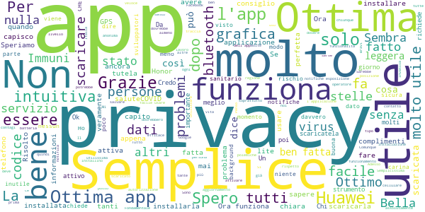
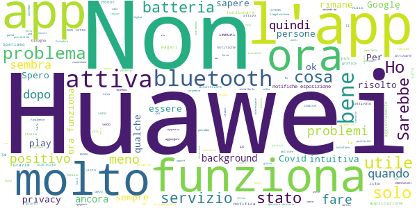
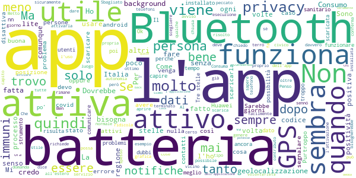
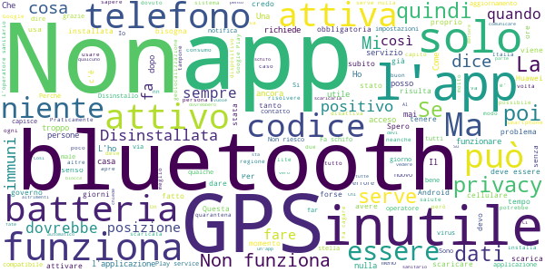

# Immuni
App version ``1.1.0``

Analyzed with [covid-apps-observer](http://github.com/covid-apps-observer) project, version ``0.1``

## App overview
| | |
|-------------------------|-------------------------| 
| **Name**&nbsp;&nbsp;&nbsp;&nbsp;&nbsp;&nbsp;&nbsp;&nbsp;&nbsp;&nbsp;&nbsp;&nbsp;&nbsp;&nbsp;&nbsp;&nbsp;&nbsp;&nbsp;&nbsp;&nbsp;&nbsp;&nbsp;&nbsp;&nbsp;&nbsp;&nbsp;&nbsp;&nbsp;&nbsp;&nbsp;&nbsp;&nbsp;&nbsp;&nbsp;&nbsp;&nbsp;&nbsp;&nbsp;&nbsp;&nbsp;  | Immuni |
| **Unique identifier** | it.ministerodellasalute.immuni |
| **Link to Google Play** | [https://play.google.com/store/apps/details?id=it.ministerodellasalute.immuni](https://play.google.com/store/apps/details?id=it.ministerodellasalute.immuni) |
| **Summary**  | App ufficiale per le notifiche di esposizione in Italia |
| **Privacy policy** | [https://www.immuni.italia.it/app-pn.html](https://www.immuni.italia.it/app-pn.html) |
| **Latest version** | 1.1.0 |
| **Last update** | 2020-06-09 09:47:50 |
| **Recent changes** | • Possibilità di disattivare il servizio dalla sezione Home • Miglioramenti e correzione dei bug |
| **Installs**  | 1.000.000+ |
| **Category** | Medicina |
| **First release** | 1 giu 2020 |
| **Size**  | 27M |
| **Supported Android version**  | 6.0 e versioni successive |

### Description
> Immuni è l’app ufficiale per le notifiche di esposizione del governo italiano, sviluppata dal Commissario Straordinario per l’Emergenza COVID-19 in collaborazione con il Ministero della Salute e il Ministero per l’Innovazione Tecnologica e la Digitalizzazione. L’app è sviluppata e rilasciata nel pieno rispetto della protezione dei dati personali dell’utente e della normativa vigente, incluso il decreto-legge del 30 aprile 2020, n. 28.
 Nella lotta all’epidemia di COVID-19, l’app aiuta a notificare gli utenti potenzialmente contagiati il prima possibile, anche quando sono asintomatici. Questi utenti possono poi isolarsi per evitare di contagiare altri, con l’effetto di minimizzare la diffusione del virus e velocizzare il ritorno a una vita normale per la maggior parte della popolazione. Venendo informati tempestivamente, inoltre, gli utenti possono anche contattare il proprio medico di medicina generale, riducendo così il rischio di complicanze.
 Il sistema di notifiche di esposizione di Immuni si basa sulla tecnologia Bluetooth Low Energy, creata per essere particolarmente efficiente in termini di risparmio energetico, e non utilizza alcun tipo di dato di geolocalizzazione, inclusi quelli del GPS. L’app non raccoglie e non è in grado di ottenere alcun dato che identifichi l’utente, quali nome, cognome, data di nascita, indirizzo, numero di telefono o indirizzo email. Immuni riesce quindi a determinare che un contatto fra due utenti è avvenuto, ma non chi siano effettivamente i due utenti o dove si siano incontrati.
 Ecco una lista di alcune delle misure con cui Immuni protegge i dati degli utenti:
 • I dati raccolti sono quelli minimi, strettamente necessari per supportare e migliorare il sistema di notifiche di esposizione.
 • Il codice Bluetooth Low Energy trasmesso dall’app è generato in maniera casuale e non contiene alcuna informazione riguardo allo smartphone dell’utente, tanto meno sull’utente stesso. Inoltre, questo codice cambia svariate volte ogni ora, per tutelare ancora meglio la privacy dell’utente.
 • I dati salvati sullo smartphone sono cifrati.
 • Le connessioni tra l’app e il server sono cifrate.
 • Tutti i dati, siano essi salvati sul dispositivo o sul server, saranno cancellati non appena non saranno più necessari e in ogni caso non oltre il 31 dicembre 2020.
 • È il Ministero della Salute il soggetto che raccoglie i dati e che decide per quali scopi utilizzarli. In ogni caso, i dati verranno usati solo per contenere l’epidemia del COVID-19 e per la ricerca scientifica.
 • I dati sono salvati su server in Italia e gestiti da soggetti pubblici.

 Immuni non fa e non può fare diagnosi. Sulla base dello storico dei contatti con utenti potenzialmente contagiosi, Immuni elabora alcune raccomandazioni su come è necessario comportarsi. Ma l’app non è un dispositivo medico e non può in alcun caso sostituire un medico.
 Immuni è uno strumento importante nella lotta a questa terribile epidemia e ciascun utente ne aumenta l’efficacia complessiva. Per questo consigliamo vivamente di installare l’app, usarla correttamente e incoraggiare parenti e amici a fare lo stesso. Tuttavia, non c’è alcun obbligo di utilizzo. La decisione spetta soltanto all’individuo.

### User interface
The developers of the app provide the following screenshots in the Google play store.
| | | |
|:-------------------------:|:-------------------------:|:-------------------------:|
 |   |   |   | 
 |  

## Development team
In the following we report the main information provided by the development team in the Google play store.

| | |
|-------------------------|-------------------------|
| **Developer**  | Ministero della Salute |
| **Website**  | [https://www.immuni.italia.it/](https://www.immuni.italia.it/) |
| **Email** | cittadini@immuni.italia.it |
| **Physical address**  | - |
| **Other developed apps**  | [https://play.google.com/store/apps/developer?id=Ministero+della+Salute](https://play.google.com/store/apps/developer?id=Ministero+della+Salute) |

## Android support

| | |
|-------------------------|-------------------------|
| **Declared target Android version**  | Android10, version 10 (API level 29) |
| **Effective target Android version**  | Android10, version 10 (API level 29) |
| **Minimum supported Android version**  | Marshmallow, version 6.0 (API level 23) |
| **Maximum target Android version**  | - |

The larger the difference between the minimum and maximum supported Android versions, the better. A larger difference means a wider audience. For example, old phones have a very low Android version, so a high minimum supported Android version means that the app cannot be used by users with old phones, thus leading to accessibility problems. 

## Requested permissions

In the following we report the complete list of the permissions requested by the app. 

| **Permission** | **Protection level** | **Description** | 
|-------------------------|-------------------------|-------------------------|
 **android.permission ACCESS_NETWORK_STATE** | Normal | Allows applications to access information about networks. 
 **android.permission BLUETOOTH** | Normal | Allows applications to connect to paired bluetooth devices. 
 **android.permission FOREGROUND_SERVICE** | Normal | Allows a regular application to use Service.startForeground. 
 **android.permission INTERNET** | Normal | Allows applications to open network sockets. 
 **android.permission RECEIVE_BOOT_COMPLETED** | Normal | Allows an application to receive the Intent.ACTION_BOOT_COMPLETED that is broadcast after the system finishes booting. 
 **android.permission WAKE_LOCK** | Normal | Allows using PowerManager WakeLocks to keep processor from sleeping or screen from dimming. 

## Mentioned servers

| **Server** | **Registrant** | **Registrant country** | **Creation date** | 
|-------------------------|-------------------------|-------------------------|-------------------------|
 | google.com | Google LLC | :us: US | 1997-09-15 04:00:00 |
 | googleapis.com | Google LLC | :us: US | 2005-01-25 17:52:26 |

## Security analysis 

Below we report the main security warnings raised by our execution of the [Androwarn](https://github.com/maaaaz/androwarn) security analysis tool.

**Connection interfaces exfiltration**
> - This application reads details about the currently active data network 
> - This application tries to find out if the currently active data network is metered 

**Telephony services abuse**
> - This application makes phone calls 

**Suspicious connection establishment**
> - This application opens a Socket and connects it to the remote address ' returned no addresses for  ; port is out of range' on the 'N/A' port  
> - This application opens a Socket and connects it to the remote address '' on the 'N/A' port  
> - This application opens a Socket and connects it to the remote address 'Ljava/lang/StringBuilder;->toString()Ljava/lang/String;' on the 'N/A' port  
> - This application opens a Socket and connects it to the remote address 'Ljava/net/Proxy;->type()Ljava/net/Proxy$Type;' on the 'N/A' port  
> - This application opens a Socket and connects it to the remote address 'Method sendUrgentData() is not supported.' on the 'N/A' port  
> - This application opens a Socket and connects it to the remote address 'Method setHandshakeTimeout() is not supported.' on the 'N/A' port  
> - This application opens a Socket and connects it to the remote address 'Method setOOBInline() is not supported.' on the 'N/A' port  
> - This application opens a Socket and connects it to the remote address 'Method setSoWriteTimeout() is not supported.' on the 'N/A' port  
> - This application opens a Socket and connects it to the remote address 'Socket closed' on the 'N/A' port  
> - This application opens a Socket and connects it to the remote address 'Socket is closed' on the 'N/A' port  
> - This application opens a Socket and connects it to the remote address 'Socket is closed.' on the 'N/A' port  
> - This application opens a Socket and connects it to the remote address 'Socket is not connected.' on the 'N/A' port  
> - This application opens a Socket and connects it to the remote address 'socket is closed' on the 'N/A' port  
> - This application opens a Socket and connects it to the remote address 'timeout' on the 'N/A' port  

**Code execution**
> - This application loads a native library: 'conscrypt_gmscore_jni' 
> - This application loads a native library: 'conscrypt_jni' 

## User ratings and reviews

Below we provide information about how end users are reacting to the app in terms of ratings and reviews in the Google Play store.

### Ratings

The Immuni app has been installed by more than **1000000** times. At this time, **13616** rated the app and its average score is **3.9253957**. Below we show the distribution of the ratings across the usual star-based rating of Google Play

:star::star::star::star::star:: 8424

:star::star::star::star:: 1241

:star::star::star:: 882

:star::star:: 646

:star:: 2421

### Reviews 

#### 5-star reviews

> Efficentissima e sicura  :date: __2020-06-14 20:33:20__

> Istallatelo e fatelo istallare, anche se i nella vostra regione per qualche giorno non sarà ancora attivo, probabilmente lo sarà in regioni confinanti e dal 3 Giugno si può viaggiare tra le regioni. Come per le mascherine chirurgiche in luoghi chiusi, la funzione è protettiva verso gli altri, ma se tutti la istallano di riflesso protegge anche noi e chi ci sta attorno.  :date: __2020-06-14 20:20:40__

> L'app non sembra impattare la durata della batteria, ed ha una finalità veramente importante. Triste leggere che c'è chi si lamenta per violazione della privacy, chi si lamenta al contrario perché non traccia i movimenti, chi perché l'app elenca troppo i diritti dell'utente. RIDICOLO! Non credo che questa app potesse essere fatta diversamente da com'è!  :date: __2020-06-14 20:18:18__

> È l'unica arma che abbiamo per evitare un nuovo lock-down in tutta Italia! 🤞🏻  :date: __2020-06-14 20:00:11__

> Impossibile riattivare le notifiche di esposizione  :date: __2020-06-14 19:35:10__

> Semplice da utilizzare  :date: __2020-06-14 19:28:54__

> Utile  :date: __2020-06-14 19:27:10__

> 👍👍👍  :date: __2020-06-14 19:04:23__

> Tutto perfetto. Bella app  :date: __2020-06-14 19:00:59__

> Semplice  :date: __2020-06-14 18:33:51__

#### 4-star reviews

> Molto bella la grafica! Dovreste renderla disponibile anche per PC con Windows e Linux.  :date: __2020-06-14 20:43:58__

> Bene, speriamo possa aiutare veramente.  :date: __2020-06-14 20:25:56__

> Ora funziona anche sul mio Huawei. Molto bene  :date: __2020-06-14 20:08:38__

> Un'app che in Italia non ha alcuna utilità, sia per come sono stati (e sono tuttora) gestiti i tamponi e sia per l'obbligatorietà d'uso della stessa, di cui magari i servizi sanitari terranno conto ignorandola a loro volta. Mi fa solo piacere per il team di sviluppo, che merita per qualità di quest'app.  :date: __2020-06-14 20:03:59__

> 4 non tanto x l'applicazione in se quanto x la mancanza di fiducia e timori che porta con se. Inoltre non ho trovato come inoltrare e e consigliare l'applicazione ad altri. Credo che il porta a porta sia ilmetodo migliore x la divulgazione ed il superamento dei timori.  :date: __2020-06-14 20:02:24__

> Io ho appena installato vediamo ok grazie intanto. Ho provato ha installare imbambi ma quanti che ce ne sono urka .saltano fuori come funghi.  :date: __2020-06-14 17:36:41__

> A mio parere risulta di non immediata comprensione la schermata "caricamento dati". Ci si finisce facilmente, ma non è chiaro a cosa serva. Solo leggendo le FAQ viene chiarito.  :date: __2020-06-14 17:20:20__

> Ho ricevuto una notifica  :date: __2020-06-14 17:03:09__

> Non finziona  :date: __2020-06-14 16:55:55__

> Spero che tutto abbia un termine ciao  :date: __2020-06-14 16:36:27__

#### 3-star reviews

> Abito all'estero e vorrei usare l'app quando mi trovo in Italia. È, però, richiesta la scelta di una regione e provincia di domicilio in Italia perciò non posso andare avanti e usare l'app.  :date: __2020-06-14 19:27:54__

> Dovete renderlo disponibile per tutti i telefoni e per tutte le versioni android.  :date: __2020-06-14 19:06:43__

> Le notifiche quando spengo la posizione e il bluetooth sono costanti e pressanti.  :date: __2020-06-14 17:43:52__

> Trovo inesatto, o incompleto asserire che Immuni non consumi batteria, poiché richiede sempre attivi Bluetooth e Geolocalizzazione, che consumano parecchio.  :date: __2020-06-14 17:40:01__

> Bah, non mi "attacco" alla privacy, perché diamo davvero il consenso ad ogni minima applicazione, ma la mia domanda è, che uso ha come app? Se non si ha Bluetooth o posizione attiva non serve a nulla, i dati non sono obbligatori o altro, quindi chi la scarica non sempre mette dati se sia contagioso o meno... Quindi ad oggi l'uso di questa app quale sarebbe?!?!  :date: __2020-06-14 16:12:38__

> Non chiara l'attivazione con un un'operatore  :date: __2020-06-14 15:27:20__

> Ben fatta, sicuramente servirà, ma sul mio Huawei p7 lite, vecchiotto sicuramente , non funziona , non abilita le notifiche di contatto covid. Reinstallata qualche giorno dopo sembra che sia tutto normale, vedremo. Consumo batteria esiguo. Al 12/06/2020, l app.è attiva, ma sarebbe buono ricevere qualche report di qualunque genere per sapere se effettivamente funziona, quanti contatti con persone che l hanno attivata o cose del genere altrimenti sembra "morta" .  :date: __2020-06-14 15:05:03__

> Bella cosa  :date: __2020-06-14 13:33:40__

> Bellissima idea, ma dopo 5 Min il telefono diventa bollente...  :date: __2020-06-14 11:04:09__

> Penso che sia importante che tutti installino questa App. Volevo solo segnalare agli sviluppatori che è un'applicazione eccessivamente "muta", sarebbe molto opportuno, a mio avviso, un minimo di interattività. Per esempio a me piacerebbe molto avere il numero di contatti memorizzati dal mio dispositivo. Così da avere un esempio di efficacia della App!!  :date: __2020-06-14 10:44:51__

#### 2-star reviews

> scaricata ma non funziona.. Huawei p30  :date: __2020-06-14 19:55:12__

> La app sarà pure utilissima ma, siccome non usa solo il buerooth ma anche il GPS (deve essere sempre attivo...) il consumo della batteria è molto alto. Per cui il cellulare si scaricherà notevolmente più velocemente  :date: __2020-06-14 19:41:30__

> Non la riesco a scaricare sul mio dispositivo, Samsung A10  :date: __2020-06-14 19:06:07__

> Non serve a una mazza  :date: __2020-06-14 18:35:49__

> Avevo installato questa app il primo giorno utile, per senso civico. Dopo tre giorni, si è bloccata senza motivo, e un messaggio diceva: "la app continua a bloccarsi". Allora l'ho disinstallata, e installata di nuovo. Dopo due giorni si è bloccata di nuovo! E a mia moglie è successa la stessa cosa. Preciso che sullo smartphone (Android 7) ho decine e decine di app e tutte funzionano alla perfezione. Direi che non va proprio!  :date: __2020-06-14 15:21:15__

> Non è chiara comunque  :date: __2020-06-14 14:24:47__

> La geolocalizzazione è obbligatoria anche se i dati non vengono memorizzati, tuttavia le altre app sul telefono che magari sono usate da noi utenti una volta ogni tanto e alle quali concediamo occasionalmente l'accesso alla posizione GPS, con Immuni attiva useranno i dati della nostra geolocalizzazione tutto il giorno... Questo non è un buon incentivo a usare l'app. Per quanto riguarda la praticità nell'uso, sarebbe utile che l'icona cambiasse a seconda se ho Immuni attiva o disattiva  :date: __2020-06-14 13:51:42__

> L'app non penso sia in grado di valutare se una persona è positiva, se non inserita dopo aver fatto prima degli esami. Per tanto chi è risultato positivo è obbligato alla quarantena e non ad andare in giro. Se una persona è positiva ma senza disturbi e non lo sa, perché non ha fatto esami visto che sta bene, può contagiare altre persone e L'app Immuni non lo segnalerà mai a chi gli è vicino anche se tutti hanno L'app installata  :date: __2020-06-14 13:29:41__

> L'applicazione in questione potrebbe essere fatta meglio perché se il malato di Covid-19 non vuole fare sapere che è malato, basta che lui non lo comunica a nessuno e l'applicazione non ha effetto. L'app dovrebbe segnalare chiunque sia malato nei dintorni nel raggio di 100 metri in modo automatico.  :date: __2020-06-14 11:33:56__

> Nella teoria ho capito come dovrebbe funzionare ma in pratica no. Vedo un codice che ricevo ma poi si blocca tutto.. non è chiaro cosa devi fare..  :date: __2020-06-14 07:43:03__

#### 1-star reviews

> Su huawei p30 lite si disattiva continuamente. Provando a riattivare l'app si ottiene l'errore 39501. A volte si riesce a riattivare l'app disattivando prima il Bluetooth.  :date: __2020-06-14 20:51:41__

> Questo gioco è belissimo  :date: __2020-06-14 20:41:48__

> Google Play services non è ancora pronto. Google Play services è aggiornato ma non può ancora abilitare le notifiche di esposizione.. Error code:39507  :date: __2020-06-14 20:25:34__

> Ma è a pagamento ?  :date: __2020-06-14 20:24:24__

> Non serve a niente  :date: __2020-06-14 20:08:58__

> Praticamente inutile! 78 esperti (così ci hanno detto) per sviluppare un'app che non serve a niente! Direi imbarazzante!! Per garantire la completa privacy non viene neppure mappato il luogo di contagio, non dico i nomi, ma almeno la posizione! Tutto e demandato al senso di responsabilità dell'utente, che può perfino scegliere se tenersi per sé la propria positività. Mi chiedo, con questi vincoli, quale "espertone" possa aver solo pensato di realizzare qualcosa di realmente efficace!  :date: __2020-06-14 20:05:29__

> Complimenti, è la terza volta che mi eliminate il commento. Continuate pure, bambini di m\*\**a, che tanto continuo a metterlo.  :date: __2020-06-14 20:02:13__

> Non interssa  :date: __2020-06-14 18:28:38__

> Non serve assolutamente a niente!anzi,scarica la batteria e fa funzionare male il cellulare.lo disattivo.  :date: __2020-06-14 18:11:42__

> Non riesco a farla funzionare  :date: __2020-06-14 18:08:19__

