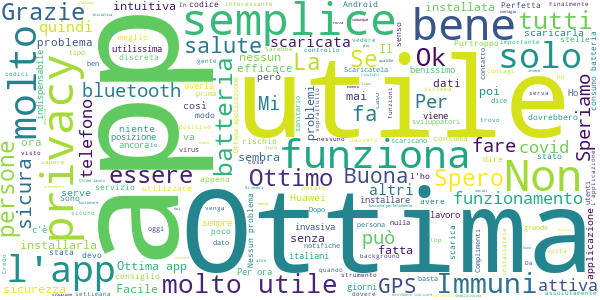
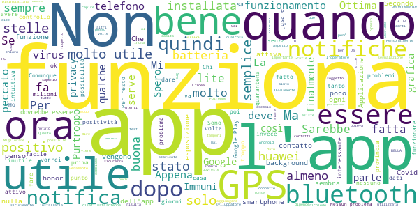
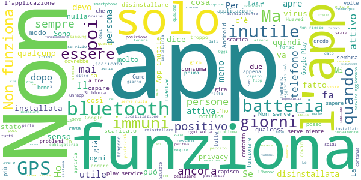

# Immuni
App version ``1.2.0``

Analyzed with [covid-apps-observer](http://github.com/covid-apps-observer) project, version ``0.1``

## App overview
| | |
|-------------------------|-------------------------| 
| **Name**&nbsp;&nbsp;&nbsp;&nbsp;&nbsp;&nbsp;&nbsp;&nbsp;&nbsp;&nbsp;&nbsp;&nbsp;&nbsp;&nbsp;&nbsp;&nbsp;&nbsp;&nbsp;&nbsp;&nbsp;&nbsp;&nbsp;&nbsp;&nbsp;&nbsp;&nbsp;&nbsp;&nbsp;&nbsp;&nbsp;&nbsp;&nbsp;&nbsp;&nbsp;&nbsp;&nbsp;&nbsp;&nbsp;&nbsp;&nbsp;  | Immuni |
| **Unique identifier** | it.ministerodellasalute.immuni |
| **Link to Google Play** | [https://play.google.com/store/apps/details?id=it.ministerodellasalute.immuni](https://play.google.com/store/apps/details?id=it.ministerodellasalute.immuni) |
| **Summary**  | App ufficiale per le notifiche di esposizione in Italia |
| **Privacy policy** | [https://www.immuni.italia.it/app-pn.html](https://www.immuni.italia.it/app-pn.html) |
| **Latest version** | 1.2.0 |
| **Last update** | 2020-06-19 09:53:11 |
| **Recent changes** | - Miglioramento dell’esperienza utente - Correzione dei bug |
| **Installs**  | 1.000.000+ |
| **Category** | Medicina |
| **First release** | 1 giu 2020 |
| **Size**  | 28M |
| **Supported Android version**  | 6.0 e versioni successive |

### Description
> Immuni è l’app ufficiale per le notifiche di esposizione del governo italiano, sviluppata dal Commissario Straordinario per l’Emergenza COVID-19 in collaborazione con il Ministero della Salute e il Ministero per l’Innovazione Tecnologica e la Digitalizzazione. L’app è sviluppata e rilasciata nel pieno rispetto della protezione dei dati personali dell’utente e della normativa vigente, incluso il decreto-legge del 30 aprile 2020, n. 28.
 Nella lotta all’epidemia di COVID-19, l’app aiuta a notificare gli utenti potenzialmente contagiati il prima possibile, anche quando sono asintomatici. Questi utenti possono poi isolarsi per evitare di contagiare altri, con l’effetto di minimizzare la diffusione del virus e velocizzare il ritorno a una vita normale per la maggior parte della popolazione. Venendo informati tempestivamente, inoltre, gli utenti possono anche contattare il proprio medico di medicina generale, riducendo così il rischio di complicanze.
 Il sistema di notifiche di esposizione di Immuni si basa sulla tecnologia Bluetooth Low Energy, creata per essere particolarmente efficiente in termini di risparmio energetico, e non utilizza alcun tipo di dato di geolocalizzazione, inclusi quelli del GPS. L’app non raccoglie e non è in grado di ottenere alcun dato che identifichi l’utente, quali nome, cognome, data di nascita, indirizzo, numero di telefono o indirizzo email. Immuni riesce quindi a determinare che un contatto fra due utenti è avvenuto, ma non chi siano effettivamente i due utenti o dove si siano incontrati.
 Ecco una lista di alcune delle misure con cui Immuni protegge i dati degli utenti:
 • I dati raccolti sono quelli minimi, strettamente necessari per supportare e migliorare il sistema di notifiche di esposizione.
 • Il codice Bluetooth Low Energy trasmesso dall’app è generato in maniera casuale e non contiene alcuna informazione riguardo allo smartphone dell’utente, tanto meno sull’utente stesso. Inoltre, questo codice cambia svariate volte ogni ora, per tutelare ancora meglio la privacy dell’utente.
 • I dati salvati sullo smartphone sono cifrati.
 • Le connessioni tra l’app e il server sono cifrate.
 • Tutti i dati, siano essi salvati sul dispositivo o sul server, saranno cancellati non appena non saranno più necessari e in ogni caso non oltre il 31 dicembre 2020.
 • È il Ministero della Salute il soggetto che raccoglie i dati e che decide per quali scopi utilizzarli. In ogni caso, i dati verranno usati solo per contenere l’epidemia del COVID-19 e per la ricerca scientifica.
 • I dati sono salvati su server in Italia e gestiti da soggetti pubblici.

 Immuni non fa e non può fare diagnosi. Sulla base dello storico dei contatti con utenti potenzialmente contagiosi, Immuni elabora alcune raccomandazioni su come è necessario comportarsi. Ma l’app non è un dispositivo medico e non può in alcun caso sostituire un medico.
 Immuni è uno strumento importante nella lotta a questa terribile epidemia e ciascun utente ne aumenta l’efficacia complessiva. Per questo consigliamo vivamente di installare l’app, usarla correttamente e incoraggiare parenti e amici a fare lo stesso. Tuttavia, non c’è alcun obbligo di utilizzo. La decisione spetta soltanto all’individuo.

### User interface
The developers of the app provide the following screenshots in the Google play store.
| | | |
|:-------------------------:|:-------------------------:|:-------------------------:|
 |   |   |   | 
 |  

## Development team
In the following we report the main information provided by the development team in the Google play store.

| | |
|-------------------------|-------------------------|
| **Developer**  | Ministero della Salute |
| **Website**  | [https://www.immuni.italia.it/](https://www.immuni.italia.it/) |
| **Email** | cittadini@immuni.italia.it |
| **Physical address**  | - |
| **Other developed apps**  | [https://play.google.com/store/apps/developer?id=Ministero+della+Salute](https://play.google.com/store/apps/developer?id=Ministero+della+Salute) |

## Android support

| | |
|-------------------------|-------------------------|
| **Declared target Android version**  | Android10, version 10 (API level 29) |
| **Effective target Android version**  | Android10, version 10 (API level 29) |
| **Minimum supported Android version**  | Marshmallow, version 6.0 (API level 23) |
| **Maximum target Android version**  | - |

The larger the difference between the minimum and maximum supported Android versions, the better. A larger difference means a wider audience. For example, old phones have a very low Android version, so a high minimum supported Android version means that the app cannot be used by users with old phones, thus leading to accessibility problems. 

## Requested permissions

In the following we report the complete list of the permissions requested by the app. 

| **Permission** | **Protection level** | **Description** | 
|-------------------------|-------------------------|-------------------------|
 **android.permission ACCESS_NETWORK_STATE** | Normal | Allows applications to access information about networks. 
 **android.permission BLUETOOTH** | Normal | Allows applications to connect to paired bluetooth devices. 
 **android.permission FOREGROUND_SERVICE** | Normal | Allows a regular application to use Service.startForeground. 
 **android.permission INTERNET** | Normal | Allows applications to open network sockets. 
 **android.permission RECEIVE_BOOT_COMPLETED** | Normal | Allows an application to receive the Intent.ACTION_BOOT_COMPLETED that is broadcast after the system finishes booting. 
 **android.permission WAKE_LOCK** | Normal | Allows using PowerManager WakeLocks to keep processor from sleeping or screen from dimming. 

## Mentioned servers

| **Server** | **Registrant** | **Registrant country** | **Creation date** | 
|-------------------------|-------------------------|-------------------------|-------------------------|
 | google.com | Google LLC | :us: US | 1997-09-15 04:00:00 |
 | googleapis.com | Google LLC | :us: US | 2005-01-25 17:52:26 |
 | italia.it | Presidenza del Consiglio dei Ministri | :it: IT | 2004-06-03 00:00:00 |

## Security analysis 

Below we report the main security warnings raised by our execution of the [Androwarn](https://github.com/maaaaz/androwarn) security analysis tool.

**Connection interfaces exfiltration**
> - This application reads details about the currently active data network 
> - This application tries to find out if the currently active data network is metered 

**Telephony services abuse**
> - This application makes phone calls 

**Suspicious connection establishment**
> - This application opens a Socket and connects it to the remote address ' returned no addresses for  ; port is out of range' on the 'N/A' port  
> - This application opens a Socket and connects it to the remote address '' on the 'N/A' port  
> - This application opens a Socket and connects it to the remote address 'Ljava/lang/StringBuilder;->toString()Ljava/lang/String;' on the 'N/A' port  
> - This application opens a Socket and connects it to the remote address 'Ljava/net/Proxy;->type()Ljava/net/Proxy$Type;' on the 'N/A' port  
> - This application opens a Socket and connects it to the remote address 'Method sendUrgentData() is not supported.' on the 'N/A' port  
> - This application opens a Socket and connects it to the remote address 'Method setHandshakeTimeout() is not supported.' on the 'N/A' port  
> - This application opens a Socket and connects it to the remote address 'Method setOOBInline() is not supported.' on the 'N/A' port  
> - This application opens a Socket and connects it to the remote address 'Method setSoWriteTimeout() is not supported.' on the 'N/A' port  
> - This application opens a Socket and connects it to the remote address 'Socket closed' on the 'N/A' port  
> - This application opens a Socket and connects it to the remote address 'Socket is closed' on the 'N/A' port  
> - This application opens a Socket and connects it to the remote address 'Socket is closed.' on the 'N/A' port  
> - This application opens a Socket and connects it to the remote address 'Socket is not connected.' on the 'N/A' port  
> - This application opens a Socket and connects it to the remote address 'socket is closed' on the 'N/A' port  
> - This application opens a Socket and connects it to the remote address 'timeout' on the 'N/A' port  

**Code execution**
> - This application loads a native library: 'conscrypt_gmscore_jni' 
> - This application loads a native library: 'conscrypt_jni' 

## User ratings and reviews

Below we provide information about how end users are reacting to the app in terms of ratings and reviews in the Google Play store.

### Ratings

The Immuni app has been installed by more than **1000000** times. At this time, **19548** rated the app and its average score is **4.076483**. Below we show the distribution of the ratings across the usual star-based rating of Google Play

:star::star::star::star::star:: 12550

:star::star::star::star:: 2186

:star::star::star:: 1301

:star::star:: 772

:star:: 2735

### Reviews 

#### 5-star reviews

> Scusate una che ha il coronavirus  :date: __2020-06-22 01:04:12__

> Mi auguro che tutti gli Italiani scarichino e utilizzino questa app.  :date: __2020-06-22 00:10:09__

> È semplice perfetta fino ora siamo 3.000.000 che la stiamo utilizzando ma dobbiamo aumentare e convinci che ci è utile e senza costo  :date: __2020-06-21 23:30:20__

> Semplice da installare,speriamo di disinstallarla presto vuol dire che il peggio è passato  :date: __2020-06-21 23:12:17__

> Un'arma per tutelare la nostra salute  :date: __2020-06-21 22:56:29__

> Se può essere d'aiuto benvenga questa applicazione. Ne abbiamo a sicuramente installate altredi gran lunga più... DIVERSAMENFE UTILI.  :date: __2020-06-21 22:13:39__

> Funziona e nessun problema per l'installazione su LG del 2017. Dopo una settimana mi é arrivata una notifica in cui mi avvisavano che negli ultimi 7 gg non ero entrata in contatto con persone positive. Certo che se la maggior parte delle persone non la scarica serve a poco. Speriamo nel buon senso altrui.  :date: __2020-06-21 21:47:44__

> Adatta per questa situazione che stiamo vivendo  :date: __2020-06-21 21:31:37__

> Utile per me e per le persone alle qualo voglio bene... Anche per gli stupidini che nn la scaricano  :date: __2020-06-21 21:30:35__

> Bohhh  :date: __2020-06-21 21:23:18__

#### 4-star reviews

> Se non viene utilizzata da almeno ⅘ della popolazione non potrà essere utile... peccato.  :date: __2020-06-22 00:09:48__

> Ottima app, peccato che sia stata sviluppata in un paese troppo arretrato. Troppo pochi i download. Così non serve a nulla.  :date: __2020-06-21 23:08:51__

> Non ho sintomi e godo discreta salute. (a parte il morbo di parkinson ed un tumore alla prostata)  :date: __2020-06-21 21:50:56__

> È utile per tutti per la prevenzione della salute di tutti  :date: __2020-06-21 20:59:37__

> Molto bella la grafica! Dovreste renderla disponibile anche per PC con Windows e Linux.  :date: __2020-06-21 20:42:27__

> "notifiche di esposizione non attivate" su Honor 10 lite.  :date: __2020-06-21 20:27:15__

> Semplice e intuitiva. Nessun problema nell'installazione  :date: __2020-06-21 20:19:24__

> Non do le 5 stelle perché se il GPS e BT non sono attivi vengono notificati dei messaggi di servizio inattivo. Se si è a casa, queste notifiche sono fuori luogo. Sarebbe utile introdurre una modalità "home" che disattiva tali notifiche  :date: __2020-06-21 19:33:32__

> La notifica che qualcuno dice apparire e "sparire" nel nulla è quella relativa all'app stessa che utilizza il sistema di notifiche all'esposizione di Google e Apple. La si può leggere nel menu notifiche (ma va?) su Google Play ad esempio. Non è notifica sul contagio scomparsa. Capre! - App facile da installare e intuitiva nella configurazione. Non è chiaro invece con che procedura va segnalata la positività. Aspetto sicuramente da migliorare.  :date: __2020-06-21 17:14:09__

> Molto utile  :date: __2020-06-21 15:41:34__

#### 3-star reviews

> Per quanto riguarda l'app nulla da dire , ma voi FATELA FINITA con questa psicosi e ricominciate a vivere! Altrimenti tra poco non ci sarà più niente da VIVERE ,con le vostre assurde psicosi ed esagerazioni state mandando al collasso il paese intero! Questo perché a prescindere guardare il vostro orticello senza capire che è una CATENA! Chiude la pizzeria all'angolo ,ci rimette il proprietario e anche chi ci lavora e di conseguenza i lavoratori non potranno spendere altrove! Brutti idioti!!!  :date: __2020-06-22 00:56:37__

> L'app di per sé "potrebbe" essere utile a limitare il contagio. Potrebbe, in quanto, oltre a diversi bug riscontrati come il servizio che si autodisattiva, su molti dispositivi è pressoché impossibile farla partire (Huawei e alcuni modelli Xiaomi in primis, più ovviamente tutti i device senza le API). Aggiungo inoltre che ho notato un battery drain abbastanza elevato per via della geolocalizzazione sempre attiva (anche se alla fine non la usa) L'unico problema però era la foto introduttiva...  :date: __2020-06-22 00:19:22__

> App molto utile, non invadente , il problema è tenere sempre il bluetooth acceso, la batteria ne risente.  :date: __2020-06-21 20:32:38__

> Non mi preoccupa la questione privacy. Ma servirebbe qualche funzione in più, per verificare che stia facendo il suo mestiere: un contatore dei codici scambiati, possibilità di testare le notifiche.  :date: __2020-06-21 19:43:05__

> Ma forse devo essere screenata (=aver fatto un tampone) x essere avvisata di un possibile contagio??? E, quindi, aver comunicato il mio codice (che mi da l'applicazione) ??? A chi operatore sanitario??? ... Cioè che devo fare??? Non è molto chiara e semplice!!!  :date: __2020-06-21 17:51:42__

> Praticamente non serve a nulla quando mi avvertirà di essere stato contagiato me ne sarò accorto certamente da solo.... quando stramazzerò al suolo mi manderà una notifica con un codice casuale e l'operatore sanitario non potrà far altro che constatare la mia morte!!!!.....  :date: __2020-06-21 15:44:20__

> Se l'app non traccia la posizione, a che gli serve avere accesso al GPS? Non ho nulla in contrario, infatti a parer mio l'app doveva funzionare fin dal principio con il tracking della posizione ma vorrei solo un po' più di chiarezza. La sezione "Segnala positività" la metterei in home page, per il resto la trovo fluida e ben fatta graficamente.  :date: __2020-06-21 14:32:10__

> Ancora da provare non so il mio cellulare la tiene e non capisco che cosa sia il blututh  :date: __2020-06-21 14:23:40__

> Sembra funzionare tutto bene grazie  :date: __2020-06-21 12:05:52__

> Non è immediato il funzionamento, inoltre, è difficile capire se rimane attiva dopo l'uscita  :date: __2020-06-21 12:01:57__

#### 2-star reviews

> Tecnologia di livello troppo basso per l importanza del caso.Dovrebbe segnalare a priori la presenza di soggetti positivi che violano la quarantena in luoghi pubblici  :date: __2020-06-21 22:37:51__

> Esta app no funciona  :date: __2020-06-21 21:19:29__

> Non credo possa servire, se fosse utilizzato da tutti potrebbe avere un senso, ma così...  :date: __2020-06-21 21:13:44__

> Finalmente va anche per i huawei e gli honor. Ho messo 4 stelle solo perché su i huawei in generale all'inizio non andava. Però ora tutto funziona  :date: __2020-06-21 19:53:05__

> Spero di contribuire x migliorare tutti  :date: __2020-06-21 19:25:53__

> Con Immuni attivo devo ricaricare la batteria due volte al giorno, inaccettabile.  :date: __2020-06-21 17:26:50__

> Da quando ho installato immuni non riesco a trasferire file via bluetooth  :date: __2020-06-21 17:19:04__

> una app che per essere efficace dovrebbe avere una diffusione capillare non può, come invece fa, escludere i possessori di smartphone prodotti dal terzo costruttore mondiale  :date: __2020-06-21 16:46:17__

> Non se capisce se funziona o no io la tengo sempre aperta ma non ricevo nessuna modifica  :date: __2020-06-21 15:05:00__

> Scaricata ma non ho capito bene il funzionamento  :date: __2020-06-21 12:42:17__

#### 1-star reviews

> Potrebbe essere utile ma creata app senza pensare a come comportarsi se si incrocia un codice di un positivo. Pessima gestione .  :date: __2020-06-22 00:48:39__

> Casus belli: due persone con la mascherina si incontrano, entrambe con l'applicazione Immuni (forse dovrebbe chiamarla Contagiati!), una delle due è risultata positiva al tampone ma è stata a casa già per due settimane. L'altra riceve la segnalazione che si è beccata il contagio solo perché la distanza era ridotta e quindi le viene suggerito di andare a fare il tampone (che si paga!)? Ma siamo matti ?  :date: __2020-06-22 00:17:26__

> Non funziona dice che Google non e' ancora pronto errore 30507  :date: __2020-06-21 22:57:00__

> anche se hai febbre non succede niente...  :date: __2020-06-21 22:35:03__

> Consuma troppa batteria con GPS e BLUETOOTH sempre accesi  :date: __2020-06-21 22:28:31__

> Sono un boomer  :date: __2020-06-21 21:57:36__

> Inutile se non ha fatto il tampone  :date: __2020-06-21 21:48:41__

> Meizu M5 non funziona  :date: __2020-06-21 21:13:41__

> Trovo estremamente inaffidabile l'applicazione essendo lo stesso paziente che gli è stato riscontrato il covid a segnalarlo e non l'azienda sanitaria, riscontrando la grande capacità dell'italiano a dichiarare il falso trovo per questo un servizio inaffidabile. Giacomo Roversi  :date: __2020-06-21 20:49:01__

> Fa schifoooooo  :date: __2020-06-21 20:28:57__

