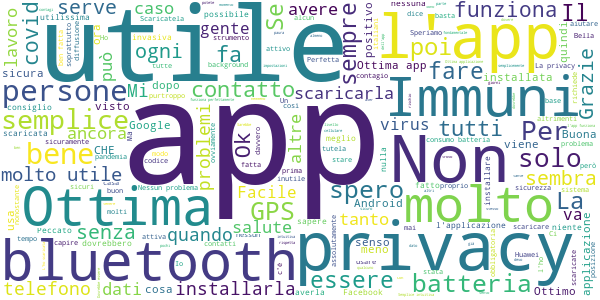
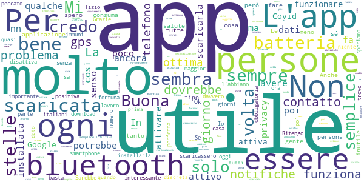
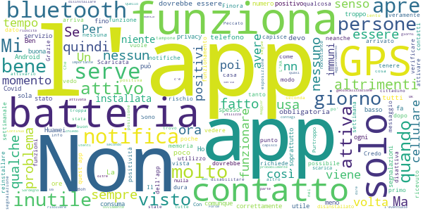
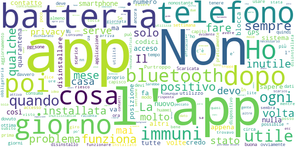

# Immuni
App version ``1.3.0``

Analyzed with [covid-apps-observer](http://github.com/covid-apps-observer) project, version ``0.1``

## App overview
| | |
|-------------------------|-------------------------| 
| **Name**&nbsp;&nbsp;&nbsp;&nbsp;&nbsp;&nbsp;&nbsp;&nbsp;&nbsp;&nbsp;&nbsp;&nbsp;&nbsp;&nbsp;&nbsp;&nbsp;&nbsp;&nbsp;&nbsp;&nbsp;&nbsp;&nbsp;&nbsp;&nbsp;&nbsp;&nbsp;&nbsp;&nbsp;&nbsp;&nbsp;&nbsp;&nbsp;&nbsp;&nbsp;&nbsp;&nbsp;&nbsp;&nbsp;&nbsp;&nbsp;  | Immuni |
| **Unique identifier** | it.ministerodellasalute.immuni |
| **Link to Google Play** | [https://play.google.com/store/apps/details?id=it.ministerodellasalute.immuni](https://play.google.com/store/apps/details?id=it.ministerodellasalute.immuni) |
| **Summary**  | App ufficiale per le notifiche di esposizione in Italia |
| **Privacy policy** | [https://www.immuni.italia.it/app-pn.html](https://www.immuni.italia.it/app-pn.html) |
| **Latest version** | 1.3.0 |
| **Last update** | 2020-07-10 10:50:18 |
| **Recent changes** | - Miglioramento dell&#39;esperienza utente - Correzione dei bug - Aggiunta delle operational info |
| **Installs**  | 1.000.000+ |
| **Category** | Medicina |
| **First release** | 1 giu 2020 |
| **Size**  | 28M |
| **Supported Android version**  | 6.0 e versioni successive |

### Description
> Immuni è l’app ufficiale per le notifiche di esposizione del governo italiano, sviluppata dal Commissario Straordinario per l’Emergenza COVID-19 in collaborazione con il Ministero della Salute e il Ministero per l’Innovazione Tecnologica e la Digitalizzazione. L’app è sviluppata e rilasciata nel pieno rispetto della protezione dei dati personali dell’utente e della normativa vigente, incluso il decreto-legge del 30 aprile 2020, n. 28.
 Nella lotta all’epidemia di COVID-19, l’app aiuta a notificare gli utenti potenzialmente contagiati il prima possibile, anche quando sono asintomatici. Questi utenti possono poi isolarsi per evitare di contagiare altri, con l’effetto di minimizzare la diffusione del virus e velocizzare il ritorno a una vita normale per la maggior parte della popolazione. Venendo informati tempestivamente, inoltre, gli utenti possono anche contattare il proprio medico di medicina generale, riducendo così il rischio di complicanze.
 Il sistema di notifiche di esposizione di Immuni si basa sulla tecnologia Bluetooth Low Energy, creata per essere particolarmente efficiente in termini di risparmio energetico, e non utilizza alcun tipo di dato di geolocalizzazione, inclusi quelli del GPS. L’app non raccoglie e non è in grado di ottenere alcun dato che identifichi l’utente, quali nome, cognome, data di nascita, indirizzo, numero di telefono o indirizzo email. Immuni riesce quindi a determinare che un contatto fra due utenti è avvenuto, ma non chi siano effettivamente i due utenti o dove si siano incontrati.
 Ecco una lista di alcune delle misure con cui Immuni protegge i dati degli utenti:
 • I dati raccolti sono quelli minimi, strettamente necessari per supportare e migliorare il sistema di notifiche di esposizione.
 • Il codice Bluetooth Low Energy trasmesso dall’app è generato in maniera casuale e non contiene alcuna informazione riguardo allo smartphone dell’utente, tanto meno sull’utente stesso. Inoltre, questo codice cambia svariate volte ogni ora, per tutelare ancora meglio la privacy dell’utente.
 • I dati salvati sullo smartphone sono cifrati.
 • Le connessioni tra l’app e il server sono cifrate.
 • Tutti i dati, siano essi salvati sul dispositivo o sul server, saranno cancellati non appena non saranno più necessari e in ogni caso non oltre il 31 dicembre 2020.
 • È il Ministero della Salute il soggetto che raccoglie i dati e che decide per quali scopi utilizzarli. In ogni caso, i dati verranno usati solo per contenere l’epidemia del COVID-19 e per la ricerca scientifica.
 • I dati sono salvati su server in Italia e gestiti da soggetti pubblici.

 Immuni non fa e non può fare diagnosi. Sulla base dello storico dei contatti con utenti potenzialmente contagiosi, Immuni elabora alcune raccomandazioni su come è necessario comportarsi. Ma l’app non è un dispositivo medico e non può in alcun caso sostituire un medico.
 Immuni è uno strumento importante nella lotta a questa terribile epidemia e ciascun utente ne aumenta l’efficacia complessiva. Per questo consigliamo vivamente di installare l’app, usarla correttamente e incoraggiare parenti e amici a fare lo stesso. Tuttavia, non c’è alcun obbligo di utilizzo. La decisione spetta soltanto all’individuo.

### User interface
The developers of the app provide the following screenshots in the Google play store.
| | | |
|:-------------------------:|:-------------------------:|:-------------------------:|
 |   |   |   | 
 |  

## Development team
In the following we report the main information provided by the development team in the Google play store.

| | |
|-------------------------|-------------------------|
| **Developer**  | Ministero della Salute |
| **Website**  | [https://www.immuni.italia.it/](https://www.immuni.italia.it/) |
| **Email** | cittadini@immuni.italia.it |
| **Physical address**  | - |
| **Other developed apps**  | [https://play.google.com/store/apps/developer?id=Ministero+della+Salute](https://play.google.com/store/apps/developer?id=Ministero+della+Salute) |

## Android support

| | |
|-------------------------|-------------------------|
| **Declared target Android version**  | Android10, version 10 (API level 29) |
| **Effective target Android version**  | Android10, version 10 (API level 29) |
| **Minimum supported Android version**  | Marshmallow, version 6.0 (API level 23) |
| **Maximum target Android version**  | - |

The larger the difference between the minimum and maximum supported Android versions, the better. A larger difference means a wider audience. For example, old phones have a very low Android version, so a high minimum supported Android version means that the app cannot be used by users with old phones, thus leading to accessibility problems. 

## Requested permissions

In the following we report the complete list of the permissions requested by the app. 

| **Permission** | **Protection level** | **Description** | 
|-------------------------|-------------------------|-------------------------|
 **android.permission ACCESS_NETWORK_STATE** | Normal | Allows applications to access information about networks. 
 **android.permission BLUETOOTH** | Normal | Allows applications to connect to paired bluetooth devices. 
 **android.permission FOREGROUND_SERVICE** | Normal | Allows a regular application to use Service.startForeground. 
 **android.permission INTERNET** | Normal | Allows applications to open network sockets. 
 **android.permission RECEIVE_BOOT_COMPLETED** | Normal | Allows an application to receive the Intent.ACTION_BOOT_COMPLETED that is broadcast after the system finishes booting. 
 **android.permission WAKE_LOCK** | Normal | Allows using PowerManager WakeLocks to keep processor from sleeping or screen from dimming. 

## Mentioned servers

| **Server** | **Registrant** | **Registrant country** | **Creation date** | 
|-------------------------|-------------------------|-------------------------|-------------------------|
 | google.com | Google LLC | :us: US | 1997-09-15 04:00:00 |
 | googleapis.com | Google LLC | :us: US | 2005-01-25 17:52:26 |
 | italia.it | Presidenza del Consiglio dei Ministri | :it: IT | 2004-06-03 00:00:00 |

## Security analysis 

Below we report the main security warnings raised by our execution of the [Androwarn](https://github.com/maaaaz/androwarn) security analysis tool.

**Connection interfaces exfiltration**
> - This application reads details about the currently active data network 
> - This application tries to find out if the currently active data network is metered 

**Telephony services abuse**
> - This application makes phone calls 

**Suspicious connection establishment**
> - This application opens a Socket and connects it to the remote address ' returned no addresses for  ; port is out of range' on the 'N/A' port  
> - This application opens a Socket and connects it to the remote address '' on the 'N/A' port  
> - This application opens a Socket and connects it to the remote address 'Ljava/lang/StringBuilder;->toString()Ljava/lang/String;' on the 'N/A' port  
> - This application opens a Socket and connects it to the remote address 'Ljava/net/Proxy;->type()Ljava/net/Proxy$Type;' on the 'N/A' port  
> - This application opens a Socket and connects it to the remote address 'Method sendUrgentData() is not supported.' on the 'N/A' port  
> - This application opens a Socket and connects it to the remote address 'Method setHandshakeTimeout() is not supported.' on the 'N/A' port  
> - This application opens a Socket and connects it to the remote address 'Method setOOBInline() is not supported.' on the 'N/A' port  
> - This application opens a Socket and connects it to the remote address 'Method setSoWriteTimeout() is not supported.' on the 'N/A' port  
> - This application opens a Socket and connects it to the remote address 'Socket closed' on the 'N/A' port  
> - This application opens a Socket and connects it to the remote address 'Socket is closed' on the 'N/A' port  
> - This application opens a Socket and connects it to the remote address 'Socket is closed.' on the 'N/A' port  
> - This application opens a Socket and connects it to the remote address 'Socket is not connected.' on the 'N/A' port  
> - This application opens a Socket and connects it to the remote address 'socket is closed' on the 'N/A' port  
> - This application opens a Socket and connects it to the remote address 'timeout' on the 'N/A' port  

**Code execution**
> - This application loads a native library: 'conscrypt_gmscore_jni' 
> - This application loads a native library: 'conscrypt_jni' 

## User ratings and reviews

Below we provide information about how end users are reacting to the app in terms of ratings and reviews in the Google Play store.

### Ratings

The Immuni app has been installed by more than **1000000** times. At this time, **23741** rated the app and its average score is **3.856901**. Below we show the distribution of the ratings across the usual star-based rating of Google Play

:star::star::star::star::star:: 13870

:star::star::star::star:: 2573

:star::star::star:: 1688

:star::star:: 1246

:star:: 4362

### Reviews 

#### 5-star reviews

> Dal punto di vista tecnico la app non ha mai crashato, non è evidente nessun scaricamento eccessivo della batteria e per come sviluppata, vedi sorgenti e tutorial di presentazione, protegge la privacy completamente.  :date: __2020-07-28 10:04:55__

> Top dei top  :date: __2020-07-28 01:22:39__

> @Susanna Santoro: carissima, arriverà direttamente alla sua dimora un mezzo della Sanità, che provvederà a registrarla e porla in quarantena a tempo indeterminato 😃 Più probabilmente, non subirà un bel niente, visto che le interazioni della app con gli altri dispositivi e col server del Governo sono completamente ANONIME. Per il suo dubbio circa l'inattesa notifica le dico che è coerente con la logica di funzionamento della app: Immuni registra sul suo smartphone i codici inviati dagli smartphone nelle vicinanze che hanno Immuni; se un soggetto da cui ha ricevuto un codice risulta dopo qualche giorno positivo e decide di condividere col server del Ministero della Salute i codici che ha condiviso con gli altri utenti (dichiarandosi in tal modo ANONIMAMENTE positivo al covid), allora Immuni che lei ha sullo smartphone riceverà dal server governativo i codici condivisi dall'utente infetto, eseguirà un rapido confronto coi codici memorizzati sul suo smartphone, e se troverà corrispondenza con qualche codice condiviso dal soggetto ammalato, farà apparire la notifica sul suo smartphone di contatto a rischio avvenuto nei giorni precedenti; notare che la app deve avere attivo il servizio di notifiche per poter allertare, ed esegue periodicamente nell'arco della giornata controlli su codici del tipo descritto prima, cioè condivisi col server governativo da parte di soggetti contagiati (per comunicare col server ovviamente occorre avere attiva la connessione dati sullo smartphone, oltre alla app). Cordiali saluti. RECENSIONE: Ottime app e iniziativa per monitoraggio, tuttavia i dati sembrano indicare un utilizzo irrisorio rispetto alla popolazione complessiva, e se dobbiamo essere in 4 gatti, tanto vale disinstallare, perché viene meno lo scopo per cui è stata realizzata. Staremo a vedere se si raggiungeranno almeno i 10 mln di utenti  :date: __2020-07-27 23:54:11__

> NON rileva alcun dato personale dell'utente, genera codici casuali ogni ora, che invia tramite bluetooth ai dispositivi nelle vicinanze che montano pure Immuni (a causa di limiti Android è necessario attivare anche il GPS: non per tracciamento, ma semplicemente per poter inviare (e ricevere) i codici ai (e dai) dispositivi nelle vicinanze). L'utente è "identificato" tramite tali codici casuali anonimi, e se risulterà positivo in seguito (spetta a lui, insieme all'operatore sanitario, inviare la sua accertata positività al server del Ministero della Salute per mezzo della app), gli utenti con i codici casuali memorizzati sui propri dispositivi nei giorni precedenti per via del contatto con il soggetto che risulta ora ammalato, verranno allertati di potenziali contatti a rischio tramite notifica da parte dell'app Immuni. Sta poi al buon senso di costoro procedere ad ulteriori accertamenti, consultando il proprio medico di base; Immuni lo suggerisce soltanto, poiché non è assolutamente in grado di obbligare, non sapendo nemmeno chi siano gli utenti coinvolti e notificati. Condivido al 100% la recensione dell'utente Paolo Paoli 👍👏, ma vorrei aggiungere o precisare che i soggetti notificati anonimamente (nel senso che non sapranno chi era effettivamente Tizio) dovranno comunque essere obbligatoriamente monitorati, testati e in caso estremo isolati da parte della Autorità sanitaria, in modo da contenere la diffusione della epidemia (e questo sarebbe agevolmente realizzabile in base alla soluzione prospettata dall'utente Paoli)  :date: __2020-07-27 23:21:16__

> App fatta molto bene, complimenti!  :date: __2020-07-27 23:02:05__

> App tranquilla, non da nessun problema al cellulare. Spero non mi arrivi mai nessuna notifica.  :date: __2020-07-27 22:55:26__

> Questa app mi sembra molto utile  :date: __2020-07-27 21:28:26__

> Uso sempre la app quando esco, anche durante il lavoro, non sono sicuro però lì la gente la utilizzi.  :date: __2020-07-27 20:01:47__

> Ottima  :date: __2020-07-27 19:56:22__

> Bella la app  :date: __2020-07-27 19:35:11__

#### 4-star reviews

> L'app è ottima ma quella notifica del virus rosso acceso mi dà un'ansia tremenda, staccare la cassa dal cellulare spegnendo il bluetooth mi procura sempre un attacco di cuore  :date: __2020-07-28 01:10:14__

> RISOLTO PROBLEMA GPS Se si attiva il GPS è per i settaggi del telefono relativi alla geolocalizzazione: nella scheda corrispondente in Impostazioni si abilita il solo uso di internet per fornire la posizione e si risolve. FEEDBACK L'app non traccia l'utente, ma anche solo Google potrebbe, infatti nel menù Notifiche di Esposizione al Covid-19 del telefono dichiara che non lo farà, pur dovendo chiedere comunque il permesso per la geolocalizzazione: sarebbe meglio specificarlo.  :date: __2020-07-28 00:21:16__

> 24mila download... Ce ne facciamo ben poco. Per il resto fa il suo lavoro, per la riservatezza non mi esprimo visto che ce poco da tenere riservato se sei iscritto a social e piattaforme varie...  :date: __2020-07-27 22:10:49__

> Non do se è in funzione  :date: __2020-07-27 18:55:04__

> 5 stelle perché la app è ottima così come la iniziativa, ma 1 stella alla utenza per la scarsa partecipazione! Ad oggi i download segnati dal Play Store Google ammontano ad appena 1 milione! Capisco impossibilità di obbligare la popolazione (mica tutti hanno smartphone, soggetti un po' impediti, anziani refrattari a novità e modernità...), ma credo si dovrebbe pressare mediaticamente molto di più l'utilizzo della applicazione! Altrimenti che senso ha investire per svilupparla se efficacia e utilità tendono a zero? Io la attivo, e la probabilità che in un ambiente affollato le persone intorno a me l'abbiano pure attiva si aggira intorno al 2%... l'idea rimane buona solo sulla carta! Invito a leggere questo interessante articolo su Zeusnews: «No, non serve il 60% per rendere utili le app anti-coronavirus» sulla fatidica soglia minima utile del 60%. Personalmente nutro qualche dubbio: in Italia, stando alle stime, non arriviamo neanche al 7%! In Francia addirittura nemmeno al 3%! Di quel 7%, considerando smemorati, menefreghisti noncuranti e rinunciatari, non so poi quanto rimanga.. Per cui, a questo punto, credo si debba intervenire più drasticamente, in barba a quanto avevo scritto in precedenza, adottando una politica sanzionatoria severa tipo quella usata per impedire spostamenti fisici nei mesi scorsi. Ovviamente, tale misura dovrà valere solo per chi avrà disponibilità di uno smartphone adeguato alla app; chi invece non ne sarà in possesso, dovrà autocertificarlo, non subendo alcuna sanzione fino a prova contraria (proprio come si faceva in fase lockdown per gli spostamenti ammessi); per la Autorità l'accertamento è semplice: basta verificare se il dichiarante ha un piano dati mobile in essere, e nel database di Google per esempio sono registrati tutti i dispositivi collegati a eventuale account (ma in realtà mica occorre andare a bussare in casa Google..). Concludendo: imporre dunque per legge la app, controllare casualmente in luoghi pubblici che chi dispone d uno smartphone compatibile abbia Immuni installata E in esecuzione, pena 400€ di multa, perché è inutile, l'essere umano (mediamente) capisce la sola regola del bastone e della carota! Ah! Dimenticavo.. parimenti importante: la app dovrebbe disporre internamente di un record in cui memorizzare i dati anagrafici di Tizio in modo da renderli disponibili sul server del Ministero della Salute, così che qualora Tizio risultasse positivo gli operatori sanitari potrebbero immediatamente registrare il fatto su detto database, il quale poi provvederebbe a notificare anonimamente i soggetti entrati in contatto con Tizio nei giorni precedenti. Semplice, no? Dove starebbe la fantomatica violazione della privacy? A livelllo di settore pubblico (pubblica amministrazione) un sacco di dati di ogni cittadino sono gelosamente custoditi da che mondo è mondo! dati anagrafici, catastali, civili, fiscali, clinici.... Per giunta, ora, in una contingenza di emergenza sanitaria! Dov'è il problema?  :date: __2020-07-27 14:42:25__

> Mi sono arrivate le notifiche di esposizioe ....in orari anche strani (quindi qual è il raggio di azione???)!!! Vabbè .....ma una volta chiuse le notifiche nn si sa piu dove andarle a cercare....sparite ....mi dice inoltte di scaricare app del ssn della regione di appartenenza......è tutto poco chiaro, ma se è uno strumento utile x la prevenzione ritengo giusto venga usata !  :date: __2020-07-27 13:43:52__

> Gradirei che io e mia coniuge che siam da 07/03''20 in casa per covid 19.. che si facessero dei piu' accurati controlli. Anche a queste persone... Non basta avere LE APP..io e' da qualche giorno che ogni tanto esco..anche se in me ho' delle patologia ALLERGICHE E Asmatiche.. Ma son sempre molto cauto alle uscite Rispettando le Emergenze Igeniche Personali..!!!!!Mia coniuge non ancora SI SENTE SICURA AD USCIRE(per paura.?IN NOI 68 A chi ci Contr/ attendiamo un responso su cio' distinti saluti...  :date: __2020-07-27 07:00:37__

> Lo uso ogni volta che esco, la batteria non si scarica come temevo, sarebbe utile avere come utente le statistiche di quante persone ho incontrato con immuni attivo... secondo me la maggior parte delle persone non lo ha neppure installato  :date: __2020-07-26 21:48:20__

> Per ora inutile, speriamo resti così 😁  :date: __2020-07-26 21:47:59__

> Credo sia una bella app. Bravi  :date: __2020-07-26 17:44:43__

#### 3-star reviews

> Consuma la batteria  :date: __2020-07-28 09:21:47__

> Bellissima ap continuiamo così  :date: __2020-07-28 01:05:44__

> Non si capisce quando l'app è attiva e ovviamente non sempre mi ricordo di entrare nell'app. Consiglio di mettere, nella barra di notifiche, l'icona dell'app immuni  :date: __2020-07-27 23:14:42__

> Scattolini. Monca. E. Omar. La. Rocca.  :date: __2020-07-27 17:14:02__

> Voto basso perché non l'ha applicato quasi nessuno ,quindi serve poco  :date: __2020-07-27 16:45:01__

> Le province della Sardegna, e i relativi comuni, non sono aggiornati.  :date: __2020-07-27 11:07:54__

> Per quanto sia specificato che non occorra tenere il GPS acceso perché l'app funziona solo con il Bluetooth così non è, in quanto se non li si accende entrambi continua a chiedere di attivarlo per il corretto funzionamento.  :date: __2020-07-26 23:42:54__

> se dx d a, se 15 Qatar 76  :date: __2020-07-26 17:11:39__

> Ho installato la app fino dal primo giorno ma vedo che sono uno dei pochi ad averla infatti a chiunque chiedo nessuno ce l ha ! Quindi è inutile averla penso che a giorni la disinstallo così andrò a risparmiare batteria e recuperare memoria  :date: __2020-07-26 11:55:27__

> Troppi pochi download per capire se funziona o no. Per aumentare i download L'app dovrebbe implementare funzioni utili come: 1. Contenere il sunto dei dati sulla pandemia giorno per giorno con cronologia e grafici. 2. Permettere l'inserimento delle patologie croniche da tenere in considerazione nel caso di terapia intensiva  :date: __2020-07-26 10:52:36__

#### 2-star reviews

> Va resa obbligatoria per tutti esattamente come andare in giro con carta d'identità e la patente di guida per chi guida. Altrimenti non serve a molto  :date: __2020-07-28 03:59:15__

> Troppe pecche, consumo eccessivo batteria. Tempi lungi di verifica. Il sistema di crittazione non risponde ai criteri internazionali. Inoltre in alcuni casi tenta un accesso root.  :date: __2020-07-27 21:35:34__

> Installata appena possibile. Quello che non riesco a capire è, cosa si deve fare quando ti arrivano dei codici in cui si dice che devo comunicare ad un operatore sanitario. Quale? Mio medico di base, ospedale, ufficio igiene? Se non so a chi devo comunicare, non so come si possa capire se e con chi sono entrato in contatto. Mi sembra una buona cosa questo immuni, ma non si sa poi come muoversi e a chi rivolgersi. Non c'è un numero specifico.  :date: __2020-07-27 17:20:29__

> Nonostante abbia questa applicazione da più di un mese non mi ha mai segnalato alcun caso positivo al coronavirus. Anche perché ritengo che un contagiato si guarda bene dal notificare il suo stato  :date: __2020-07-27 14:49:18__

> Scaricata qulche settimana fa. Nessun problema con il telefono. Dopo averla aperta e poi chiusa lavora in background. Nessuna notifica al momento se non quando metto il telefono in modalità aereo.  :date: __2020-07-27 10:53:50__

> Yttu byk k.k .tmooooololo  :date: __2020-07-27 08:42:16__

> Di scarsa utilità. In più, ogni tre/quattro giorni smette di funzionare (non si riesce più ad aprire) e mi tocca disinstallarla e riscaricarla. Andava resa obbligatoria, ovviamente migliorandola.  :date: __2020-07-27 08:21:15__

> Mi è stata comunicata una esposizione 12gg dopo alle ore 1442 ma a quella data mi trovavo a casa di mia madre per tutta la giornata. Solo con lei. Successivamente altra esposizione ma mi trovavo in famiglia. No ho capito il senso dell'avviso? E che cosa avrei dovuto fare ? Peraltro nel caso dell'esposizione con i miei familiari essi hanno l'app ma non hanno avuto nessuna notifica.  :date: __2020-07-26 20:58:14__

> Utile ma.... Applicazione utile e il problema della privacy è una stupidaggine visto che basta avere uno smartphone e la privacy non esiste più!!! Il problema qui è il consumo di risorse, si arriva a malapena a mezza giornata poi batteria scarica!!!! Disinstallata.  :date: __2020-07-26 10:05:45__

> Ogni volta che ci guardo é disattivato e devo riattivarlo, praticamente come non averlo  :date: __2020-07-25 20:32:04__

#### 1-star reviews

> Si scollega in continuazione... Praticamente ogni volta che la controllo è staccata. P.S. Dopo un mese, con dispiacere l'ho disinstallata, risolti i problemi di scollegamento mi sono trovato una app che consumava la batteria in modo anomalo, praticamente il telefono a mezzogiorno di spegneva... Peccato, magari alla prossima pandemia la faranno un lavoro migliore.  :date: __2020-07-28 08:41:10__

> Da quando l'ho installata non è servita a niente. Sicuramente non ci sono stati tanti Download però la trovo inutile anche perché non è fatta bene, quindi la disinstallo....  :date: __2020-07-28 05:58:28__

> Chi ha avuto il covid quest'app non la mette, quindi a cosa serve?  :date: __2020-07-28 00:32:16__

> Utile come un culo senza buchi  :date: __2020-07-27 23:12:30__

> Ricevuto messaggio con codice sabato sera verso le 21,30 mentre ero sola e a letto. Evidentemente non ho capito come funziona la app. Mi sono autocontagiata! Credo x altro di aver inviato il messaggio con il codice ai sanitari...cosa succede ora? AIUTO!  :date: __2020-07-27 22:38:18__

> Disinstallata  :date: __2020-07-27 21:13:06__

> Mi sembra una presa per i fondelli  :date: __2020-07-27 19:21:33__

> App immuni impossibile istallare  :date: __2020-07-27 19:15:06__

> Non posso esprimere la mia valutazione avendola installata di recente  :date: __2020-07-27 19:11:19__

> Non funziona. Dopo qualche giorno aver installato l'applicazione compare una schermata nera dopo l'apertura, in questo modo risulta inutile scaricare una App che ci dovrebbe salvaguardare. E questo lo fa sempre. Ho scaricato e cancellato già 3 volte questa App, ma se continua così disinstallo e pace e amen.  :date: __2020-07-27 17:40:06__

