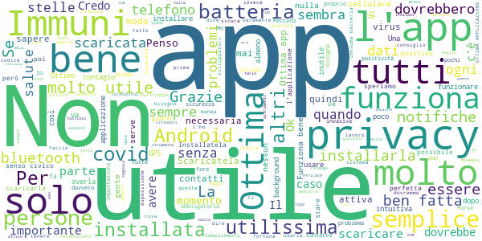
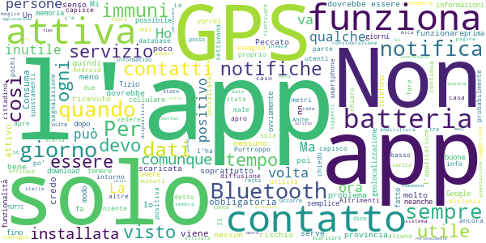
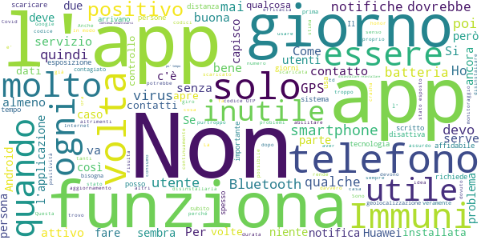

# Immuni
App version ``1.3.1``

Analyzed with [covid-apps-observer](http://github.com/covid-apps-observer) project, version ``0.1``

## App overview
| | |
|-------------------------|-------------------------| 
| **Name**&nbsp;&nbsp;&nbsp;&nbsp;&nbsp;&nbsp;&nbsp;&nbsp;&nbsp;&nbsp;&nbsp;&nbsp;&nbsp;&nbsp;&nbsp;&nbsp;&nbsp;&nbsp;&nbsp;&nbsp;&nbsp;&nbsp;&nbsp;&nbsp;&nbsp;&nbsp;&nbsp;&nbsp;&nbsp;&nbsp;&nbsp;&nbsp;&nbsp;&nbsp;&nbsp;&nbsp;&nbsp;&nbsp;&nbsp;&nbsp;  | Immuni |
| **Unique identifier** | it.ministerodellasalute.immuni |
| **Link to Google Play** | [https://play.google.com/store/apps/details?id=it.ministerodellasalute.immuni](https://play.google.com/store/apps/details?id=it.ministerodellasalute.immuni) |
| **Summary**  | App ufficiale per le notifiche di esposizione in Italia |
| **Privacy policy** | [https://www.immuni.italia.it/app-pn.html](https://www.immuni.italia.it/app-pn.html) |
| **Latest version** | 1.3.1 |
| **Last update** | 2020-08-05 09:10:25 |
| **Recent changes** | Correzione di alcuni bug |
| **Installs**  | 1.000.000+ |
| **Category** | Medicina |
| **First release** | 1 giu 2020 |
| **Size**  | 28M |
| **Supported Android version**  | 6.0 e versioni successive |

### Description
> Immuni è l’app ufficiale per le notifiche di esposizione del governo italiano, sviluppata dal Commissario Straordinario per l’Emergenza COVID-19 in collaborazione con il Ministero della Salute e il Ministero per l’Innovazione Tecnologica e la Digitalizzazione. L’app è sviluppata e rilasciata nel pieno rispetto della protezione dei dati personali dell’utente e della normativa vigente, incluso il decreto-legge del 30 aprile 2020, n. 28.
 Nella lotta all’epidemia di COVID-19, l’app aiuta a notificare gli utenti potenzialmente contagiati il prima possibile, anche quando sono asintomatici. Questi utenti possono poi isolarsi per evitare di contagiare altri, con l’effetto di minimizzare la diffusione del virus e velocizzare il ritorno a una vita normale per la maggior parte della popolazione. Venendo informati tempestivamente, inoltre, gli utenti possono anche contattare il proprio medico di medicina generale, riducendo così il rischio di complicanze.
 Il sistema di notifiche di esposizione di Immuni si basa sulla tecnologia Bluetooth Low Energy, creata per essere particolarmente efficiente in termini di risparmio energetico, e non utilizza alcun tipo di dato di geolocalizzazione, inclusi quelli del GPS. L’app non raccoglie e non è in grado di ottenere alcun dato che identifichi l’utente, quali nome, cognome, data di nascita, indirizzo, numero di telefono o indirizzo email. Immuni riesce quindi a determinare che un contatto fra due utenti è avvenuto, ma non chi siano effettivamente i due utenti o dove si siano incontrati.
 Ecco una lista di alcune delle misure con cui Immuni protegge i dati degli utenti:
 • I dati raccolti sono quelli minimi, strettamente necessari per supportare e migliorare il sistema di notifiche di esposizione.
 • Il codice Bluetooth Low Energy trasmesso dall’app è generato in maniera casuale e non contiene alcuna informazione riguardo allo smartphone dell’utente, tanto meno sull’utente stesso. Inoltre, questo codice cambia svariate volte ogni ora, per tutelare ancora meglio la privacy dell’utente.
 • I dati salvati sullo smartphone sono cifrati.
 • Le connessioni tra l’app e il server sono cifrate.
 • Tutti i dati, siano essi salvati sul dispositivo o sul server, saranno cancellati non appena non saranno più necessari e in ogni caso non oltre il 31 dicembre 2020.
 • È il Ministero della Salute il soggetto che raccoglie i dati e che decide per quali scopi utilizzarli. In ogni caso, i dati verranno usati solo per contenere l’epidemia del COVID-19 e per la ricerca scientifica.
 • I dati sono salvati su server in Italia e gestiti da soggetti pubblici.

 Immuni non fa e non può fare diagnosi. Sulla base dello storico dei contatti con utenti potenzialmente contagiosi, Immuni elabora alcune raccomandazioni su come è necessario comportarsi. Ma l’app non è un dispositivo medico e non può in alcun caso sostituire un medico.
 Immuni è uno strumento importante nella lotta a questa terribile epidemia e ciascun utente ne aumenta l’efficacia complessiva. Per questo consigliamo vivamente di installare l’app, usarla correttamente e incoraggiare parenti e amici a fare lo stesso. Tuttavia, non c’è alcun obbligo di utilizzo. La decisione spetta soltanto all’individuo.

### User interface
The developers of the app provide the following screenshots in the Google play store.
| | | |
|:-------------------------:|:-------------------------:|:-------------------------:|
 |   |   |   | 
 |  

## Development team
In the following we report the main information provided by the development team in the Google play store.

| | |
|-------------------------|-------------------------|
| **Developer**  | Ministero della Salute |
| **Website**  | [https://www.immuni.italia.it/](https://www.immuni.italia.it/) |
| **Email** | cittadini@immuni.italia.it |
| **Physical address**  | - |
| **Other developed apps**  | [https://play.google.com/store/apps/developer?id=Ministero+della+Salute](https://play.google.com/store/apps/developer?id=Ministero+della+Salute) |

## Android support

| | |
|-------------------------|-------------------------|
| **Declared target Android version**  | Android10, version 10 (API level 29) |
| **Effective target Android version**  | Android10, version 10 (API level 29) |
| **Minimum supported Android version**  | Marshmallow, version 6.0 (API level 23) |
| **Maximum target Android version**  | - |

The larger the difference between the minimum and maximum supported Android versions, the better. A larger difference means a wider audience. For example, old phones have a very low Android version, so a high minimum supported Android version means that the app cannot be used by users with old phones, thus leading to accessibility problems. 

## Requested permissions

In the following we report the complete list of the permissions requested by the app. 

| **Permission** | **Protection level** | **Description** | 
|-------------------------|-------------------------|-------------------------|
 **android.permission ACCESS_NETWORK_STATE** | Normal | Allows applications to access information about networks. 
 **android.permission BLUETOOTH** | Normal | Allows applications to connect to paired bluetooth devices. 
 **android.permission FOREGROUND_SERVICE** | Normal | Allows a regular application to use Service.startForeground. 
 **android.permission INTERNET** | Normal | Allows applications to open network sockets. 
 **android.permission RECEIVE_BOOT_COMPLETED** | Normal | Allows an application to receive the Intent.ACTION_BOOT_COMPLETED that is broadcast after the system finishes booting. 
 **android.permission WAKE_LOCK** | Normal | Allows using PowerManager WakeLocks to keep processor from sleeping or screen from dimming. 

## Mentioned servers

| **Server** | **Registrant** | **Registrant country** | **Creation date** | 
|-------------------------|-------------------------|-------------------------|-------------------------|
 | google.com | Google LLC | :us: US | 1997-09-15 04:00:00 |
 | googleapis.com | Google LLC | :us: US | 2005-01-25 17:52:26 |
 | italia.it | Presidenza del Consiglio dei Ministri | :it: IT | 2004-06-03 00:00:00 |

## Security analysis 

Below we report the main security warnings raised by our execution of the [Androwarn](https://github.com/maaaaz/androwarn) security analysis tool.

**Connection interfaces exfiltration**
> - This application reads details about the currently active data network 
> - This application tries to find out if the currently active data network is metered 

**Telephony services abuse**
> - This application makes phone calls 

**Suspicious connection establishment**
> - This application opens a Socket and connects it to the remote address ' returned no addresses for  ; port is out of range' on the 'N/A' port  
> - This application opens a Socket and connects it to the remote address '' on the 'N/A' port  
> - This application opens a Socket and connects it to the remote address 'Ljava/lang/StringBuilder;->toString()Ljava/lang/String;' on the 'N/A' port  
> - This application opens a Socket and connects it to the remote address 'Ljava/net/Proxy;->type()Ljava/net/Proxy$Type;' on the 'N/A' port  
> - This application opens a Socket and connects it to the remote address 'Method sendUrgentData() is not supported.' on the 'N/A' port  
> - This application opens a Socket and connects it to the remote address 'Method setHandshakeTimeout() is not supported.' on the 'N/A' port  
> - This application opens a Socket and connects it to the remote address 'Method setOOBInline() is not supported.' on the 'N/A' port  
> - This application opens a Socket and connects it to the remote address 'Method setSoWriteTimeout() is not supported.' on the 'N/A' port  
> - This application opens a Socket and connects it to the remote address 'Socket closed' on the 'N/A' port  
> - This application opens a Socket and connects it to the remote address 'Socket is closed' on the 'N/A' port  
> - This application opens a Socket and connects it to the remote address 'Socket is closed.' on the 'N/A' port  
> - This application opens a Socket and connects it to the remote address 'Socket is not connected.' on the 'N/A' port  
> - This application opens a Socket and connects it to the remote address 'socket is closed' on the 'N/A' port  
> - This application opens a Socket and connects it to the remote address 'timeout' on the 'N/A' port  

**Code execution**
> - This application loads a native library: 'conscrypt_gmscore_jni' 
> - This application loads a native library: 'conscrypt_jni' 

## User ratings and reviews

Below we provide information about how end users are reacting to the app in terms of ratings and reviews in the Google Play store.

### Ratings

The Immuni app has been installed by more than **1000000** times. At this time, **26053** rated the app and its average score is **3.6383636**. Below we show the distribution of the ratings across the usual star-based rating of Google Play

:star::star::star::star::star:: 13866

:star::star::star::star:: 2423

:star::star::star:: 2131

:star::star:: 1739

:star:: 5892

### Reviews 

#### 5-star reviews

> Da installare senza se e senza ma, per noi e per gli altri.  :date: __2020-08-17 12:14:05__

> Penso sia una app intelligente ed utile in questo momento così difficile per tutti. Aiuterà ad aiutarci tra noi...  :date: __2020-08-17 11:27:41__

> Ottima app. Chi la critica, spesso non ha proprio capito nulla. Il consumo della batteria è veramente limitato. Dovrebbero installarla tutti.  :date: __2020-08-17 10:50:26__

> io c'è l'ho dal primo giorno che è uscita, penso sia un ottima applicazione, utilissima  :date: __2020-08-17 10:48:33__

> MI RISPETTO E RISPETTO TUTTE LE PERSONE:LA SALUTE PRIMA DI TUTTO  :date: __2020-08-17 10:45:46__

> Ottima. Bravi.  :date: __2020-08-17 09:53:35__

> Consuma pochissima batteria, non vi controlla, usatela!  :date: __2020-08-17 09:20:40__

> Scaricatela tutti, è necessaria per fermare il contagio  :date: __2020-08-17 08:51:29__

> Funziona bene su Huawei p10 e su Redmi note 9. Scaricatela!  :date: __2020-08-17 08:07:03__

> Non sapevo che posso installare questa app dall'estero! Grazie di cuore!!!  :date: __2020-08-17 05:48:13__

#### 4-star reviews

> Favorevole all'app. Ma non capisco come interpretare le notifiche di esposizione: ad esempio mi trovo a casa ore 20.55 e mi compaiono 5 chiavi, 0 corrispondenze.  :date: __2020-08-16 21:44:40__

> Semplice ed essenziale.. Parlando con amici e conoscenti sono pochi quella che l'hanno installata Bisognerebbe dare un " premio" a chi la installa ad esempio un ticket per analisi sierologiche gratis  :date: __2020-08-16 18:36:15__

> Adesso è risolto e funziona bene - - - - - - - - Purtroppo su Honor 10 l'app si disattiva subito e non riesce a riattivare le notifiche di esposizione al covid. So che è un problema noto su molti dispositivi Honor e Huawei, ma se non viene risolto questo bug l'app risulta inutilizzabile per molti utenti.  :date: __2020-08-16 17:57:03__

> Se volete provare a GUADAGNARE DIVERTENDOVI buttate un occhio qui @guadagnaconbonus (telegram).  :date: __2020-08-16 15:29:06__

> Buona  :date: __2020-08-15 20:44:23__

> Honor 9, problema risolto!  :date: __2020-08-15 05:01:19__

> Ha un sacco di difetti, ma è un aiuto in più. Fatevela piacere e installatela senza tanti distinguo perché la pelle è una sola. Dopo potrebbe essere troppo tardi....  :date: __2020-08-14 18:54:24__

> Non è tanto una recensione la mia quanto una serie di osservazioni...dal 1 giugno al 13 luglio l'app nel mio cel ha rilevato 0 chiavi, mentre da quella data ne sta rilevando ogni giorno da 3 a 20. E finora con 0 corrispondenze per fortuna...significa che più persone l'hanno installata e attivata o che l'app ha cominciato a funzionare il 13 luglio? Poi ad agosto con l'update 1.3.1 ho notato la nuova notifica Promemoria settimanale che segnala se le notifiche di esposizione sono attive  :date: __2020-08-14 16:28:51__

> Manca una sorta di gamification per evitare che una persona la disinstalli. Magari un badge condivisibile per mostrare il tempo attivo  :date: __2020-08-14 00:15:36__

> Ritengo possa costituire un ottimo sistema se raggiunge un alta diffusione e che la privacy sia tutelata più di quanto la mettiamo a rischio nella nostra quotidianita' tra acquisti on line, social, foto ecc  :date: __2020-08-13 18:40:30__

#### 3-star reviews

> Ogni due o tre giorni non si carica più. Devo rifare l'installazione.  :date: __2020-08-17 11:26:41__

> La app è molto semplice, il che è un bene visto che è destinata a TUTTI. Ma qualche funzionalità in più non sarebbe male. A me non sta più sincronizzando i dati con i server, un tasto per forzare non sarebbe male. Anche qualche statistica in app probabilmente aiuterebbe alla diffusione...  :date: __2020-08-17 10:49:04__

> Mediocre, ti dice quando sei stato vicino ad un positivo però non resta nel telefono uno storico di avvertenze  :date: __2020-08-17 10:19:23__

> Rendetela anche uno strumento informativo su R0 ed Rt della zona in cui ci si trova indicando i presidi minimi da rispettare , anche degli alert di incremento e decremento di tali valori aiuterebbero molto di più della sola autosegnalazione di contagio....  :date: __2020-08-17 09:23:52__

> Purtroppo il mio telefono è vecchiotto e la batteria non è più tanto efficace, non posso permettermi di usarla sempre in quanto mi obbliga a tenere il GPS e il Bluetooth accessi e rischio di scaricare completamente il cellulare se rimango tutto il giorno fuori casa  :date: __2020-08-17 08:40:44__

> devo reinstallarla ogni qualche giorno, se ho un contatto positivo quando si è disinstallato in pratica è inutile.  :date: __2020-08-17 08:11:06__

> Non so se già è così, ma per la massima diffusione della app, suggerisco che si forniscano informazioni di contact tracing ottenute tramite altre fonti come le ASL e che questa caratteristica sia pubblicizzata! Un servizio di informazione funzionerebbe da volano per la diffusione della app... Aggiungerei anche bollettini ufficiali, mappe interattive, e un servizio di geolocalizzazione nel tempo degli utenti anonimizzati su database centrale.  :date: __2020-08-17 07:18:41__

> Arrivano notifiche di contatti con orari impossibili di contatti non specifica la zona non ti aiuta x niente ma confonde e crea panico  :date: __2020-08-16 18:51:57__

> Utile  :date: __2020-08-16 14:53:40__

> Occorre riattivare l'applicazione svariate volte al mese. Perché non può restare sempre attiva? La segnalazione della positività al virus dovrebbe essere obbligatoria e non facoltativa, anche in considerazione che comunque c'è l'anonimato.  :date: __2020-08-16 13:33:13__

#### 2-star reviews

> Iniziativa lodevole, sicuramente, ma applicata in tal modo, ha una utilita' praticamente nulla. Purtroppo, il prezioso alleato dei virus, ma anche batteri e quant'altro, e' la democrazia. Mentre si discute, il virus corre; mentre, trovato il giusto percorso epidemiologico, si perde tempo a decidere come, dove, quando intervenire, abbiamo gia' perso tempo, troppo tempo. Immuni, come applicazione, in democrazia, serve a poco, infatti......non ci sono stati grandi risultati. Amicissimo, franco santi  :date: __2020-08-17 11:38:04__

> Non posso restare costantemente con gps e bluetooth attivi, consumano troppa batteria. Quando a casa li disattivo mi mandano 383939 notifiche, qualcuno sa come si possano disattivare? Sono snervanti.  :date: __2020-08-17 10:22:35__

> Bug continui, non si apre, bisogna reinstallare o riconfigurare il tutto di continuo! Risolvete perché così non è utile nemmeno per quei pochi che l'hanno scaricata!!  :date: __2020-08-17 09:19:15__

> Sembra che non funziona ..mi da dei contatti .a ore che non è possibile.  :date: __2020-08-16 23:44:41__

> Ho ricevuto le notifiche di esposizione e sono riuscita a controllare la cronologia dei dati rilevati ma le date e gli orari segnalati per la maggior parte non corrispondono perché ero sempre in casa da sola!  :date: __2020-08-15 20:19:21__

> Quasi inutile  :date: __2020-08-15 19:57:18__

> Non metto in dubbio le sue funzionalità però la trovo molto scarna si potrebbe aggiungere una maggiore informazione: tipo i dcpm in uso per regione, avvertimenti, zone pericolose ( tipo i paesi o regioni piu colpite secondi l'andamento del virus). Non so mi sembra ci sia molto da aggiungere.  :date: __2020-08-15 17:24:01__

> Ho dato 2 stelle perché ho un Huawei e non so quante volte ho dovuto reistallarlo,perché ogni 2-3giorni non mi fa più aprire l'app.Non capisco se è un problema dell'app oppure del telefono.Spero che risolviate al più presto questo problema, perché è un app molto utile.  :date: __2020-08-15 15:00:47__

> Come faccio a sapere se sono stato a contatto con qualcuno positivo la notifica come arriva  :date: __2020-08-15 14:14:54__

> Siamo una coppia che ha scaricato lApp Immuni e ricevuto alcune notifiche di esposizione ma in ritardo rispetto ai giorni in cui sarebbe avvenuto l'incontro con un'eventuale "positivo al Covid". Purtroppo le notifiche sono sparite nel nulla lasciandoci indecisi sul da farsi. App da rendere più efficiente e chiara  :date: __2020-08-15 12:25:55__

#### 1-star reviews

> Non funziona sul mio telefono, dà errore e dice di riprovare più tardi. Ma è da quando l'app è operativa che ho lo stesso messaggio!!! Possibile che non riuscite a risolvere il problema.  :date: __2020-08-17 13:32:47__

> Mi si blocca in continuazione.  :date: __2020-08-17 13:21:22__

> Sono stata costretta a disinstallarla a causa di un virus nella vostra app. Risolvete in modo da poterla rinstallare.  :date: __2020-08-17 12:57:51__

> Dopo l'aggiornamento non si attiva più.  :date: __2020-08-17 12:54:52__

> 1 non rileva gli asintomatici, 2 se uno ha il virus non deve installare ma stare a casa, 3 se io la installo ma tu no non mi rileva se tu sei stato in contatto con persone che hanno avuto il covid, 4 io lo installata ma ti dicono solo se sei a rischio e qui dove sto io ci sono abbastanza conteggiati ne tanti ne pochi per ora e mi risulti non a rischio? Direi applicazione inutile, fa perdere tempo e batteria..  :date: __2020-08-17 11:49:57__

> L'ho scaricata fiduciosa... Ma il fatto che uno debba inserire la provincia nella quale si trova mi sdubbia... Come si fa a sapere che la gente mentre viaggia (es. in treno) cambi continuamente provincia? Poi vorrei sapere, sui traghetti (es. sono ora su un traghetto per la Sardegna) funziona? Mah...  :date: __2020-08-17 09:05:27__

> Non si apre... anche accendendo prima il bluetooth.  :date: __2020-08-17 08:21:53__

> Zero stelle non serve a un c\*\*\*\* per favore  :date: __2020-08-17 04:45:37__

> Si interrompe e si blocca dopo un giorno. Per riattivarla la devo disinstallare e scaricarla di nuovo, per poi ritrovarla bloccata all'indomani  :date: __2020-08-16 23:07:52__

> Dopo due gg non funziona. Grossa bufala.  :date: __2020-08-16 21:23:08__

