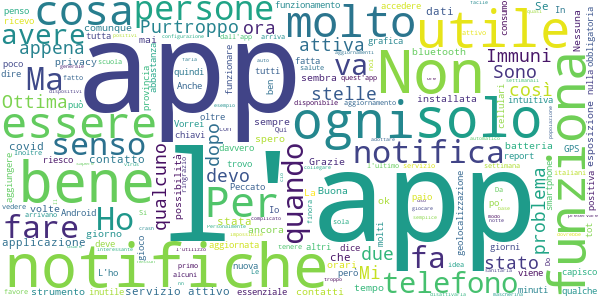
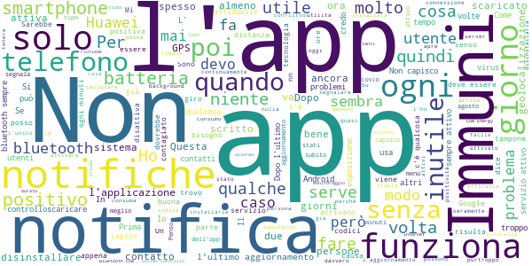

# Immuni
App version ``1.4.0``

Analyzed with [covid-apps-observer](http://github.com/covid-apps-observer) project, version ``0.1``

## App overview
| | |
|-------------------------|-------------------------| 
| **Name**&nbsp;&nbsp;&nbsp;&nbsp;&nbsp;&nbsp;&nbsp;&nbsp;&nbsp;&nbsp;&nbsp;&nbsp;&nbsp;&nbsp;&nbsp;&nbsp;&nbsp;&nbsp;&nbsp;&nbsp;&nbsp;&nbsp;&nbsp;&nbsp;&nbsp;&nbsp;&nbsp;&nbsp;&nbsp;&nbsp;&nbsp;&nbsp;&nbsp;&nbsp;&nbsp;&nbsp;&nbsp;&nbsp;&nbsp;&nbsp;  | Immuni |
| **Unique identifier** | it.ministerodellasalute.immuni |
| **Link to Google Play** | [https://play.google.com/store/apps/details?id=it.ministerodellasalute.immuni](https://play.google.com/store/apps/details?id=it.ministerodellasalute.immuni) |
| **Summary**  | App ufficiale per le notifiche di esposizione in Italia |
| **Privacy policy** | [https://www.immuni.italia.it/app-pn.html](https://www.immuni.italia.it/app-pn.html) |
| **Latest version** | 1.4.0 |
| **Last update** | 2020-09-14 17:18:40 |
| **Recent changes** | Correzione di alcuni bug |
| **Installs**  | 1.000.000+ |
| **Category** | Medicina |
| **First release** | 1 giu 2020 |
| **Size**  | 28M |
| **Supported Android version**  | 6.0 e versioni successive |

### Description
> Immuni è l’app ufficiale per le notifiche di esposizione del governo italiano, sviluppata dal Commissario Straordinario per l’Emergenza COVID-19 in collaborazione con il Ministero della Salute e il Ministero per l’Innovazione Tecnologica e la Digitalizzazione. L’app è sviluppata e rilasciata nel pieno rispetto della protezione dei dati personali dell’utente e della normativa vigente, incluso il decreto-legge del 30 aprile 2020, n. 28.
 Nella lotta all’epidemia di COVID-19, l’app aiuta a notificare gli utenti potenzialmente contagiati il prima possibile, anche quando sono asintomatici. Questi utenti possono poi isolarsi per evitare di contagiare altri, con l’effetto di minimizzare la diffusione del virus e velocizzare il ritorno a una vita normale per la maggior parte della popolazione. Venendo informati tempestivamente, inoltre, gli utenti possono anche contattare il proprio medico di medicina generale, riducendo così il rischio di complicanze.
 Il sistema di notifiche di esposizione di Immuni si basa sulla tecnologia Bluetooth Low Energy, creata per essere particolarmente efficiente in termini di risparmio energetico, e non utilizza alcun tipo di dato di geolocalizzazione, inclusi quelli del GPS. L’app non raccoglie e non è in grado di ottenere alcun dato che identifichi l’utente, quali nome, cognome, data di nascita, indirizzo, numero di telefono o indirizzo email. Immuni riesce quindi a determinare che un contatto fra due utenti è avvenuto, ma non chi siano effettivamente i due utenti o dove si siano incontrati.
 Ecco una lista di alcune delle misure con cui Immuni protegge i dati degli utenti:
 • I dati raccolti sono quelli minimi, strettamente necessari per supportare e migliorare il sistema di notifiche di esposizione.
 • Il codice Bluetooth Low Energy trasmesso dall’app è generato in maniera casuale e non contiene alcuna informazione riguardo allo smartphone dell’utente, tanto meno sull’utente stesso. Inoltre, questo codice cambia svariate volte ogni ora, per tutelare ancora meglio la privacy dell’utente.
 • I dati salvati sullo smartphone sono cifrati.
 • Le connessioni tra l’app e il server sono cifrate.
 • Tutti i dati, siano essi salvati sul dispositivo o sul server, saranno cancellati non appena non saranno più necessari e in ogni caso non oltre il 31 dicembre 2020.
 • È il Ministero della Salute il soggetto che raccoglie i dati e che decide per quali scopi utilizzarli. In ogni caso, i dati verranno usati solo per contenere l’epidemia del COVID-19 e per la ricerca scientifica.
 • I dati sono salvati su server in Italia e gestiti da soggetti pubblici.

 Immuni non fa e non può fare diagnosi. Sulla base dello storico dei contatti con utenti potenzialmente contagiosi, Immuni elabora alcune raccomandazioni su come è necessario comportarsi. Ma l’app non è un dispositivo medico e non può in alcun caso sostituire un medico.
 Immuni è uno strumento importante nella lotta a questa terribile epidemia e ciascun utente ne aumenta l’efficacia complessiva. Per questo consigliamo vivamente di installare l’app, usarla correttamente e incoraggiare parenti e amici a fare lo stesso. Tuttavia, non c’è alcun obbligo di utilizzo. La decisione spetta soltanto all’individuo.

### User interface
The developers of the app provide the following screenshots in the Google play store.
| | | |
|:-------------------------:|:-------------------------:|:-------------------------:|
 |   |   |   | 
 |  

## Development team
In the following we report the main information provided by the development team in the Google play store.

| | |
|-------------------------|-------------------------|
| **Developer**  | Ministero della Salute |
| **Website**  | [https://www.immuni.italia.it/](https://www.immuni.italia.it/) |
| **Email** | cittadini@immuni.italia.it |
| **Physical address**  | - |
| **Other developed apps**  | [https://play.google.com/store/apps/developer?id=Ministero+della+Salute](https://play.google.com/store/apps/developer?id=Ministero+della+Salute) |

## Android support

| | |
|-------------------------|-------------------------|
| **Declared target Android version**  | Android10, version 10 (API level 29) |
| **Effective target Android version**  | Android10, version 10 (API level 29) |
| **Minimum supported Android version**  | Marshmallow, version 6.0 (API level 23) |
| **Maximum target Android version**  | - |

The larger the difference between the minimum and maximum supported Android versions, the better. A larger difference means a wider audience. For example, old phones have a very low Android version, so a high minimum supported Android version means that the app cannot be used by users with old phones, thus leading to accessibility problems. 

## Requested permissions

In the following we report the complete list of the permissions requested by the app. 

| **Permission** | **Protection level** | **Description** | 
|-------------------------|-------------------------|-------------------------|
 **android.permission ACCESS_NETWORK_STATE** | Normal | Allows applications to access information about networks. 
 **android.permission BLUETOOTH** | Normal | Allows applications to connect to paired bluetooth devices. 
 **android.permission FOREGROUND_SERVICE** | Normal | Allows a regular application to use Service.startForeground. 
 **android.permission INTERNET** | Normal | Allows applications to open network sockets. 
 **android.permission RECEIVE_BOOT_COMPLETED** | Normal | Allows an application to receive the Intent.ACTION_BOOT_COMPLETED that is broadcast after the system finishes booting. 
 **android.permission WAKE_LOCK** | Normal | Allows using PowerManager WakeLocks to keep processor from sleeping or screen from dimming. 

## Mentioned servers

| **Server** | **Registrant** | **Registrant country** | **Creation date** | 
|-------------------------|-------------------------|-------------------------|-------------------------|
 | google.com | Google LLC | :us: US | 1997-09-15 04:00:00 |
 | googleapis.com | Google LLC | :us: US | 2005-01-25 17:52:26 |
 | italia.it | Presidenza del Consiglio dei Ministri | :it: IT | 2004-06-03 00:00:00 |

## Security analysis 

Below we report the main security warnings raised by our execution of the [Androwarn](https://github.com/maaaaz/androwarn) security analysis tool.

**Connection interfaces exfiltration**
> - This application reads details about the currently active data network 
> - This application tries to find out if the currently active data network is metered 

**Telephony services abuse**
> - This application makes phone calls 

**Suspicious connection establishment**
> - This application opens a Socket and connects it to the remote address ' returned no addresses for  ; port is out of range' on the 'N/A' port  
> - This application opens a Socket and connects it to the remote address '' on the 'N/A' port  
> - This application opens a Socket and connects it to the remote address 'Ljava/lang/StringBuilder;->toString()Ljava/lang/String;' on the 'N/A' port  
> - This application opens a Socket and connects it to the remote address 'Ljava/net/Proxy;->type()Ljava/net/Proxy$Type;' on the 'N/A' port  
> - This application opens a Socket and connects it to the remote address 'Method sendUrgentData() is not supported.' on the 'N/A' port  
> - This application opens a Socket and connects it to the remote address 'Method setHandshakeTimeout() is not supported.' on the 'N/A' port  
> - This application opens a Socket and connects it to the remote address 'Method setOOBInline() is not supported.' on the 'N/A' port  
> - This application opens a Socket and connects it to the remote address 'Method setSoWriteTimeout() is not supported.' on the 'N/A' port  
> - This application opens a Socket and connects it to the remote address 'Socket closed' on the 'N/A' port  
> - This application opens a Socket and connects it to the remote address 'Socket is closed' on the 'N/A' port  
> - This application opens a Socket and connects it to the remote address 'Socket is closed.' on the 'N/A' port  
> - This application opens a Socket and connects it to the remote address 'Socket is not connected.' on the 'N/A' port  
> - This application opens a Socket and connects it to the remote address 'socket is closed' on the 'N/A' port  
> - This application opens a Socket and connects it to the remote address 'timeout' on the 'N/A' port  

**Code execution**
> - This application loads a native library: 'conscrypt_gmscore_jni' 
> - This application loads a native library: 'conscrypt_jni' 

## User ratings and reviews

Below we provide information about how end users are reacting to the app in terms of ratings and reviews in the Google Play store.

### Ratings

The Immuni app has been installed by more than **1000000** times. At this time, **29787** rated the app and its average score is **3.73686**. Below we show the distribution of the ratings across the usual star-based rating of Google Play

:star::star::star::star::star:: 16606

:star::star::star::star:: 3060

:star::star::star:: 2101

:star::star:: 1717

:star:: 6303

### Reviews 

#### 5-star reviews

> Sarebbe utile aggiungere un contatore di persone con cui si è entrati in contatto, giusto per renderla più interattiva e dare il senso di funzionamento...  :date: __2020-09-15 16:41:56__

> La app è molto ben fatta e spero davvero che la scarichino tutti, in modo ma avere un controllo preciso dei contagi. A chi è preoccupato della privacy, ma che non si è mai preoccupato di mettere mano alle impostazioni della privacy sul telefono, dico che possono stare tranquillissimi perché Google già sa tutto di loro  :date: __2020-09-15 15:47:37__

> Visto che l'app è open source e che ha risposto a tutte le richieste relative alla privacy, la bilancia fra pro e contro l'installazione pende decisamente al pro.  :date: __2020-09-15 15:01:28__

> Nokia 8 aggiornato ad Android 9, questa applicazione funziona perfettamente, resta attiva, non consuma batteria, è di una semplicità disarmante, diamo il giusto merito a chi l'ha sviluppata! Con l'aggiornamento 1.4.0 l'app segnala in continuazione che è attiva, non va bene questa cosa, è snervante, credo sia un bug da risolvere (segnalato agli sviluppatori, mi hanno risposto nell'arco di poco tempo dicendo di essere a conoscenza del problema e di essere al lavoro per risolverlo)  :date: __2020-09-15 14:18:17__

> Fa il suo dovere senza scaricare troppo la batteria. Spero cmq di non aver mai problemi.  :date: __2020-09-15 14:09:45__

> Consumo batteria insignificante, non va on conflitto. Ottima  :date: __2020-09-15 13:49:49__

> Necessario. Dovrebbe essere obbligatorio scaricarlo.  :date: __2020-09-15 13:23:25__

> Ritengo sia soddisfacente.  :date: __2020-09-15 13:20:15__

> App utile e ben fatta. Non capisco vari commenti che leggo. C'è un tutorial che spiega come funziona l'applicazione. É semplice da comprendere. Impossibile che arrivino pubblicità su mail o SMS poiché non si deve inserire nessun dato sensibile. Personalmente l'ho installata da quando è uscita e non ho avuto alcun problema. Scaricatela perché può decisamente contenere i contagi.  :date: __2020-09-15 13:06:07__

> Io vorrei fidarmi di questa app però non posso sapere se le persone da Luino ho provincia lo usano. Potete dirmi qualcosa su questo conto? Grazie  :date: __2020-09-15 12:38:40__

#### 4-star reviews

> App ben fatta, rispettosa della privacy e poco invadente. Soprattutto utile per la collettività. Purtroppo dopo l'ultimo aggiornamento del 13/09 escono continuamente notifiche (con annesso beep) con la sola indicazione "servizio attivo" che sparisce dopo pochi istanti (non faccio in tempo a fare lo screenshot).  :date: __2020-09-15 16:27:19__

> Versione 1.4.0: Ogni tot mi arriva una notifica di Immuni per un instante: Servizio attivo. Risolvete per favore. Installatela tutti per favore. Anche la mia scuola lo sta fortemente consigliando.  :date: __2020-09-15 13:33:26__

> Ottima.  :date: __2020-09-15 12:11:19__

> Non riesco ad accedere. Non mi fa attivare le notifiche da esposizione e non ho idea come fare. Ha tutte le autorizzazioni dal mio telefono  :date: __2020-09-15 11:49:12__

> Da quando l'ho aggiornata ogni 10/15 minuti mi manda notifiche di servizio attivo. Prima mandava solo il consueto report settimanale. Le notifiche così ravvicinate sono fastidiose. Si può sistemare? Grazie  :date: __2020-09-15 11:32:18__

> Ottima app mi aspettavo di peggio sinceramente. La trovo davvero veloce oltre che essenziale per tutti noi. Qui si parla di salute e spero che questa app diventi ancora più leggera e con un consumo di batteria e memoria ancora più ottimizzato. Spero possiate aggiungere funzioni intelligenti come fatto in UK.  :date: __2020-09-15 09:29:10__

> Mi complimento con i nostri sviluppatori italiani per io funzionamento di quest'app e li ringrazio per la mano che hanno l'aouto che hanno dato in questa delicata situazione. Do 4 stelle perché sul mio dispositivo devo tenere perennemente attiva la geolocalizzazione per tenere il servizio attivo. In altri dispisitivi il servizio funziona attivando al primo avvio la geolocalizzazione. Mi piacerebbe vedere anche la notifica di aggiornamento disponibile direttamente dall'app.  :date: __2020-09-15 07:43:45__

> L'ho appena scaricato penso sia una cosa utile mi riservo di valutare in seguito.  :date: __2020-09-15 07:01:07__

> Appena aggiornata. Partono notifiche a vuoto ogni 4-5 minuti.  :date: __2020-09-14 23:51:18__

> Non capisco perché le date di rilevazione siano così disordinate, intendo non in ordine cronologico. Inoltre per alcuni giorni in cui sono sicura di non essere uscita mi risultano parecchie chiavi anche a orari strani. Le notifiche arrivano a volte ogni settimana, altre volte ogni due. Insomma, un po' tutto pasticciato  :date: __2020-09-14 23:42:05__

#### 3-star reviews

> 3 stelle perché ho installato l'app appena disponibile, oggi 15 settembre 2020 sul mio Samsung s7 edge continua a far suonare il suono di notifica ogni tot minuti, aperta app nessuna notifica di esposizione, provato a disattivare e riattivare il servizio ed a riavviare il cellulare, ho dovuto togliere e reinstallare l'app per risolvere  :date: __2020-09-15 16:59:47__

> Ogni quarto d'ora arriva la notifica: "app immuni servizio attivo". Succede dopo l'ultimo aggiornamento.  :date: __2020-09-15 15:15:41__

> Dall'ultimo update il mio telefono vibra spesso ricevendo notifiche (finte) dall'app immuni che poi spariscono da sole.  :date: __2020-09-15 14:49:59__

> trovo vagamente fastidioso che ogni 3 secondi debba mandare una notifica che il servizio è attivo  :date: __2020-09-15 14:34:45__

> Ogni tanto compare una notifica che poi sparisce subito  :date: __2020-09-15 14:10:41__

> Do ,3 stelle perché mi arrivano troppe email  :date: __2020-09-15 13:11:41__

> Dopo l'ultimo aggiornamento mi suona brevemente il telefono circa ogni 15 minuti e mi appare una notifica che subito scompare. Xiaomi mi A2 lite.  :date: __2020-09-15 12:50:04__

> Dopo il recente aggiornamento, l'app fa vibrare il telefono per segnalare in continuazione che il servizio è attivo. Correggere grazie  :date: __2020-09-15 12:03:13__

> Abbasso la valutazione per via del bug che non ha permesso all'app di effettuare controlli nelle ultime settimane (da fine luglio!), anche su Xiaomi Mi 9T non andava...  :date: __2020-09-15 01:41:25__

> Scaricata dal primo giorno in cui era disponibile perché credo in questa cosa. Da allora ho sempre bluetooth e GPS acceso per permetterle di funzionare, oggi do un'occhiata e dice "ultimo controllo effettuato il 24 agosto". Oggi è il 14 settembre. Cosa significa?  :date: __2020-09-14 23:51:55__

#### 2-star reviews

> Ogni tanto segnala che il servizio è attivo anche se il bluetooth è sempre attivo. Ogni tanto riepiloga informazioni incomprensibili sullo scambio con altri smartphone ad orari improbabili (sarò sonnambulo?!). Non ho capito cosa dovrebbe fare questa app ma spero di non averne mai bisogno.  :date: __2020-09-15 16:56:27__

> Dopo l'ultimo aggiornamento mi invia dei suoni di notifiche senza però evidenziare nessuna notifica. Tutto questo lo fa ogni 10 minuti. Fa sembrare che ci sia una notifica quando invece non ce n'è.  :date: __2020-09-15 16:17:18__

> Dopo l ultimo aggiornamento spesso squilla la notifica con scritto "servizio attivo" a caso  :date: __2020-09-15 15:46:41__

> Dopo l'ultimo aggiornamento ogni 30 40 minuti esce una notifica che indica il funzionamento corretto di immuni, credo che siano esagerate tutte queste notifiche, penso ne basti una al giorno di questo tipo  :date: __2020-09-15 15:25:26__

> Dopo l'ultimo aggiornamento arriva una notifica ogni tot, il telefono emette un suono e appare l'icona della notifica ma non si fa in tempo a cliccarci su che è già sparita (s10e)  :date: __2020-09-15 13:11:08__

> Mangia batteria, non riesco ad arrivare a fine giornata con l'app attiva. Disinstallata.  :date: __2020-09-15 13:07:50__

> Dopo l'ultimo aggiornamento, fa suonare periodicamente una notifica. Spiego meglio: ogni un tot di minuti (dire variabile da 15 a 40 min) sento il suonino della notifica, appena controllo il telefono la notifica è già spartita, ma controllando il log delle notifiche vedo che è immuni che mette una notifica, e poi la toglie subito. Per ora ho risolto modificando la priorità delle notifiche Immuni, in modo che non facciano rumore. Però è un problema da correggere.  :date: __2020-09-15 13:03:28__

> Boh, se desse qualche segno di vita, tipo indicare quanti contatti ci sono stati nel giorno precedente, si potrebbe capire se funziona.  :date: __2020-09-15 12:36:34__

> A parte il mancato controllo per più di 15 giorni tra fine agosto e inizio settembre, ora ha iniziato a mandarmi una notifica con il simbolo dell'app nel menù a scomparsa e appena tiro giù il menù a tendina per schiacciare su quella notifica non trovo più niente. L'app è sempre collegata e la apro più volte al giorno. Non capisco se sia una notifica seria o un altro bug.  :date: __2020-09-15 12:36:10__

> Per favore fate qualcosa. Dopo l'aggiornamento del 13 settembre il telefono squilla di continuo ma non ci sono notifiche. Davvero fastidioso  :date: __2020-09-15 12:32:41__

#### 1-star reviews

> Dopo l'ultimo aggiornamento continuano a suonare notifiche di corretto funzionamento del servizio, anche più volte all'ora. Ho dovuto disattivare le notifiche dell'app, ma ora non mi verrà segnalata neanche l'eventuale esposizione.  :date: __2020-09-15 16:49:36__

> Dall'ultimo aggiornamento del 13 settembre continua a mandare notifiche sonore senza motivo e senza indicazioni. Disinstallo in attesa che sistemate, non posso avere il telefono che suona ogni 10 minuti  :date: __2020-09-15 15:50:12__

> Attenzione, con l'ultimo aggiornamento ho la notifica di app attiva ogni 30 secondi. Se continua così disattivo  :date: __2020-09-15 14:31:12__

> Dopo l'ultimo aggiornamento mi arrivano notifiche ogni minuto e la batteria scende velocemente. C'è qualche bug da sistemare direi.  :date: __2020-09-15 14:12:41__

> Dopo l'ultimo aggiornamento mi arrivano spesso notifiche, che fanno suonare il telefono ma scompaiono immediatamente (ho dovuto usare l'app notification history per vederle), dicendo che "il servizio è attivo", su samsung galaxy a5 2017.  :date: __2020-09-15 12:43:49__

> Penso sia impazzita dopo l'aggiornamento. Ogni top arriva una notifica che dice che Immuni è attivo... sarà il caso di toglierla ed evitare di far prendere colpi alla gente?  :date: __2020-09-15 11:41:28__

> 15 minuti con un contatto diretto sono troppi  :date: __2020-09-15 11:09:51__

> Oggi 15 settembre con l'ultimo aggiornamento ricevo continue notifiche da parte dell'app  :date: __2020-09-15 11:05:37__

> Tutte bufale. SVEGLIATEVI L'ITALIA É IN PERICOLO PER COLPA DI STA POLITICA DI SCHIFO !  :date: __2020-09-15 10:50:08__

> Un motivo in più per passare da Android a sistemi KaiOS.  :date: __2020-09-15 09:58:01__

