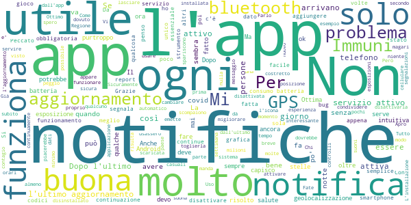
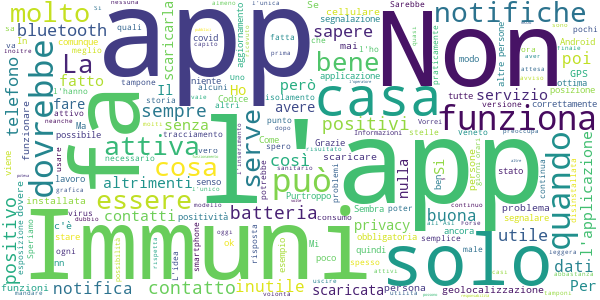
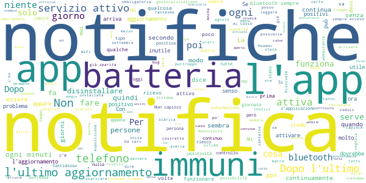
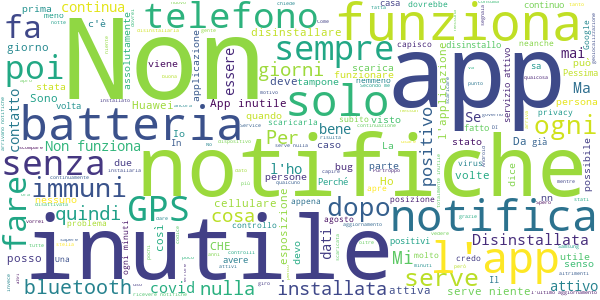

# Immuni
App version ``1.5.0``

Analyzed with [covid-apps-observer](http://github.com/covid-apps-observer) project, version ``0.1``

## App overview
| | |
|-------------------------|-------------------------| 
| **Name**&nbsp;&nbsp;&nbsp;&nbsp;&nbsp;&nbsp;&nbsp;&nbsp;&nbsp;&nbsp;&nbsp;&nbsp;&nbsp;&nbsp;&nbsp;&nbsp;&nbsp;&nbsp;&nbsp;&nbsp;&nbsp;&nbsp;&nbsp;&nbsp;&nbsp;&nbsp;&nbsp;&nbsp;&nbsp;&nbsp;&nbsp;&nbsp;&nbsp;&nbsp;&nbsp;&nbsp;&nbsp;&nbsp;&nbsp;&nbsp;  | Immuni |
| **Unique identifier** | it.ministerodellasalute.immuni |
| **Link to Google Play** | [https://play.google.com/store/apps/details?id=it.ministerodellasalute.immuni](https://play.google.com/store/apps/details?id=it.ministerodellasalute.immuni) |
| **Summary**  | App ufficiale per le notifiche di esposizione in Italia |
| **Privacy policy** | [https://www.immuni.italia.it/app-pn.html](https://www.immuni.italia.it/app-pn.html) |
| **Latest version** | 1.5.0 |
| **Last update** | 2020-09-21 14:03:25 |
| **Recent changes** | A partire da Android 11 non è più necessario tenere attiva la geolocalizzazione affinché Immuni funzioni. |
| **Installs**  | 1.000.000+ |
| **Category** | Medicina |
| **First release** | 1 giu 2020 |
| **Size**  | 28M |
| **Supported Android version**  | 6.0 e versioni successive |

### Description
> Immuni è l’app ufficiale per le notifiche di esposizione del governo italiano, sviluppata dal Commissario Straordinario per l’Emergenza COVID-19 in collaborazione con il Ministero della Salute e il Ministero per l’Innovazione Tecnologica e la Digitalizzazione. L’app è sviluppata e rilasciata nel pieno rispetto della protezione dei dati personali dell’utente e della normativa vigente, incluso il decreto-legge del 30 aprile 2020, n. 28.
 Nella lotta all’epidemia di COVID-19, l’app aiuta a notificare gli utenti potenzialmente contagiati il prima possibile, anche quando sono asintomatici. Questi utenti possono poi isolarsi per evitare di contagiare altri, con l’effetto di minimizzare la diffusione del virus e velocizzare il ritorno a una vita normale per la maggior parte della popolazione. Venendo informati tempestivamente, inoltre, gli utenti possono anche contattare il proprio medico di medicina generale, riducendo così il rischio di complicanze.
 Il sistema di notifiche di esposizione di Immuni si basa sulla tecnologia Bluetooth Low Energy, creata per essere particolarmente efficiente in termini di risparmio energetico, e non utilizza alcun tipo di dato di geolocalizzazione, inclusi quelli del GPS. L’app non raccoglie e non è in grado di ottenere alcun dato che identifichi l’utente, quali nome, cognome, data di nascita, indirizzo, numero di telefono o indirizzo email. Immuni riesce quindi a determinare che un contatto fra due utenti è avvenuto, ma non chi siano effettivamente i due utenti o dove si siano incontrati.
 Ecco una lista di alcune delle misure con cui Immuni protegge i dati degli utenti:
 • I dati raccolti sono quelli minimi, strettamente necessari per supportare e migliorare il sistema di notifiche di esposizione.
 • Il codice Bluetooth Low Energy trasmesso dall’app è generato in maniera casuale e non contiene alcuna informazione riguardo allo smartphone dell’utente, tanto meno sull’utente stesso. Inoltre, questo codice cambia svariate volte ogni ora, per tutelare ancora meglio la privacy dell’utente.
 • I dati salvati sullo smartphone sono cifrati.
 • Le connessioni tra l’app e il server sono cifrate.
 • Tutti i dati, siano essi salvati sul dispositivo o sul server, saranno cancellati non appena non saranno più necessari e in ogni caso non oltre il 31 dicembre 2020.
 • È il Ministero della Salute il soggetto che raccoglie i dati e che decide per quali scopi utilizzarli. In ogni caso, i dati verranno usati solo per contenere l’epidemia del COVID-19 e per la ricerca scientifica.
 • I dati sono salvati su server in Italia e gestiti da soggetti pubblici.

 Immuni non fa e non può fare diagnosi. Sulla base dello storico dei contatti con utenti potenzialmente contagiosi, Immuni elabora alcune raccomandazioni su come è necessario comportarsi. Ma l’app non è un dispositivo medico e non può in alcun caso sostituire un medico.
 Immuni è uno strumento importante nella lotta a questa terribile epidemia e ciascun utente ne aumenta l’efficacia complessiva. Per questo consigliamo vivamente di installare l’app, usarla correttamente e incoraggiare parenti e amici a fare lo stesso. Tuttavia, non c’è alcun obbligo di utilizzo. La decisione spetta soltanto all’individuo.

### User interface
The developers of the app provide the following screenshots in the Google play store.
| | | |
|:-------------------------:|:-------------------------:|:-------------------------:|
 |   |   |   | 
 |  

## Development team
In the following we report the main information provided by the development team in the Google play store.

| | |
|-------------------------|-------------------------|
| **Developer**  | Ministero della Salute |
| **Website**  | [https://www.immuni.italia.it/](https://www.immuni.italia.it/) |
| **Email** | cittadini@immuni.italia.it |
| **Physical address**  | - |
| **Other developed apps**  | [https://play.google.com/store/apps/developer?id=Ministero+della+Salute](https://play.google.com/store/apps/developer?id=Ministero+della+Salute) |

## Android support

| | |
|-------------------------|-------------------------|
| **Declared target Android version**  | Android10, version 10 (API level 29) |
| **Effective target Android version**  | Android10, version 10 (API level 29) |
| **Minimum supported Android version**  | Marshmallow, version 6.0 (API level 23) |
| **Maximum target Android version**  | - |

The larger the difference between the minimum and maximum supported Android versions, the better. A larger difference means a wider audience. For example, old phones have a very low Android version, so a high minimum supported Android version means that the app cannot be used by users with old phones, thus leading to accessibility problems. 

## Requested permissions

In the following we report the complete list of the permissions requested by the app. 

| **Permission** | **Protection level** | **Description** | 
|-------------------------|-------------------------|-------------------------|
 **android.permission ACCESS_NETWORK_STATE** | Normal | Allows applications to access information about networks. 
 **android.permission BLUETOOTH** | Normal | Allows applications to connect to paired bluetooth devices. 
 **android.permission FOREGROUND_SERVICE** | Normal | Allows a regular application to use Service.startForeground. 
 **android.permission INTERNET** | Normal | Allows applications to open network sockets. 
 **android.permission RECEIVE_BOOT_COMPLETED** | Normal | Allows an application to receive the Intent.ACTION_BOOT_COMPLETED that is broadcast after the system finishes booting. 
 **android.permission WAKE_LOCK** | Normal | Allows using PowerManager WakeLocks to keep processor from sleeping or screen from dimming. 

## Mentioned servers

| **Server** | **Registrant** | **Registrant country** | **Creation date** | 
|-------------------------|-------------------------|-------------------------|-------------------------|
 | google.com | Google LLC | :us: US | 1997-09-15 04:00:00 |
 | googleapis.com | Google LLC | :us: US | 2005-01-25 17:52:26 |
 | italia.it | Presidenza del Consiglio dei Ministri | :it: IT | 2004-06-03 00:00:00 |

## Security analysis 

Below we report the main security warnings raised by our execution of the [Androwarn](https://github.com/maaaaz/androwarn) security analysis tool.

**Connection interfaces exfiltration**
> - This application reads details about the currently active data network 
> - This application tries to find out if the currently active data network is metered 

**Telephony services abuse**
> - This application makes phone calls 

**Suspicious connection establishment**
> - This application opens a Socket and connects it to the remote address ' returned no addresses for  ; port is out of range' on the 'N/A' port  
> - This application opens a Socket and connects it to the remote address '' on the 'N/A' port  
> - This application opens a Socket and connects it to the remote address 'Ljava/lang/StringBuilder;->toString()Ljava/lang/String;' on the 'N/A' port  
> - This application opens a Socket and connects it to the remote address 'Ljava/net/Proxy;->type()Ljava/net/Proxy$Type;' on the 'N/A' port  
> - This application opens a Socket and connects it to the remote address 'Method sendUrgentData() is not supported.' on the 'N/A' port  
> - This application opens a Socket and connects it to the remote address 'Method setHandshakeTimeout() is not supported.' on the 'N/A' port  
> - This application opens a Socket and connects it to the remote address 'Method setOOBInline() is not supported.' on the 'N/A' port  
> - This application opens a Socket and connects it to the remote address 'Method setSoWriteTimeout() is not supported.' on the 'N/A' port  
> - This application opens a Socket and connects it to the remote address 'Socket closed' on the 'N/A' port  
> - This application opens a Socket and connects it to the remote address 'Socket is closed' on the 'N/A' port  
> - This application opens a Socket and connects it to the remote address 'Socket is closed.' on the 'N/A' port  
> - This application opens a Socket and connects it to the remote address 'Socket is not connected.' on the 'N/A' port  
> - This application opens a Socket and connects it to the remote address 'socket is closed' on the 'N/A' port  
> - This application opens a Socket and connects it to the remote address 'timeout' on the 'N/A' port  

**Code execution**
> - This application loads a native library: 'conscrypt_gmscore_jni' 
> - This application loads a native library: 'conscrypt_jni' 

## User ratings and reviews

Below we provide information about how end users are reacting to the app in terms of ratings and reviews in the Google Play store.

### Ratings

The Immuni app has been installed by more than **1000000** times. At this time, **30876** rated the app and its average score is **3.60397**. Below we show the distribution of the ratings across the usual star-based rating of Google Play

:star::star::star::star::star:: 15906

:star::star::star::star:: 3265

:star::star::star:: 2381

:star::star:: 2220

:star:: 7104

### Reviews 

#### 5-star reviews

> Condividere, scaricare 🧠♥️  :date: __2020-10-11 14:15:12__

> La renderei obbligatoria per frequentare qualsiasi esercizio pubblico  :date: __2020-10-11 14:11:40__

> Nulla da eccepire. Non manda messaggi invadenti. SCARICATELA: è importante, lasciate perdere i complottisti.  :date: __2020-10-11 14:10:21__

> La trovo molto utile per me e per i mie familiari che rispetto  :date: __2020-10-11 14:07:51__

> Ma se il bluetooth non è attivo, non funziona l'app.? Saluti  :date: __2020-10-11 13:50:27__

> Potete mettere il bollettino della propria regione  :date: __2020-10-11 13:33:22__

> Io giro ovviamente in sicurezza mascherina gel distanza sociale la mia perplessità è se dovessi incontrare un positivo la velocità nel fare il tampone il sistema dei tamponi in va migliorato  :date: __2020-10-11 13:22:08__

> Non ho rilevato differenze sostanziali nella durata della batteria (ho un OnePlus One) NON chiede info personali. Scaricatela!  :date: __2020-10-11 13:21:16__

> Questa app è molto utile per capire chi può essere contagiato e chi no, è sul cellulare che usiamo ogni giorno quindi non abbiamo più scuse .  :date: __2020-10-11 13:20:47__

> Un altro strumento contro covid19, molto utile e semplice.  :date: __2020-10-11 13:08:34__

#### 4-star reviews

> Utile, spero che la installano tutti  :date: __2020-10-11 12:58:51__

> Buona  :date: __2020-10-11 12:58:13__

> Si potrebbe avere il tema scuro ?  :date: __2020-10-11 12:55:24__

> L'utilizzo del bluetooth è un bel limite...purtroppo consuma tantissima batteria  :date: __2020-10-11 11:24:15__

> L'ho installata so che funziona perché quando salgo in macchina disturba il viva voce della macchina, in auto devo disattivarlo per il resto mi fido del suo funzionamento.  :date: __2020-10-11 09:56:42__

> Ancora meglio!!..  :date: __2020-10-11 08:06:52__

> L'idea è buona. Uniche pecche sono il fatto che la finestra di contagio sia ridotta a 14 giorni, secondo me troppo pochi per quel che si sa, e che pretenda (da quello che ho capito) un contatto di 20 minuti minimo per segnalare un possibile contagio. Troppo. Per un contagio basta molto meno.  :date: __2020-10-10 23:58:46__

> Per il momento sono solo un osservatore, l'iniziativa è, comunque, ottima.  :date: __2020-10-10 21:17:52__

> Complimenti a chi ha creato applicazione molto utile x la salute in questi periodi di Pandemia fatelo lo consiglio  :date: __2020-10-10 19:44:26__

> Scaricato per curiosità.credo possa essere utile.  :date: __2020-10-10 19:39:18__

#### 3-star reviews

> L'app è fatta bene,tutto molto facilmente comprensibile. Però chi nn può scaricare o nn ne fa uso corretto, fa risultare l'app inutile a mio avviso.poi mi chiedo: ma il positivo nn dovrebbe stare in isolamento...?? C è qualcosa che nn torna.  :date: __2020-10-11 14:16:51__

> Potrebbe essere utile se fosse obbligatoria. Viene spontanea una domanda:quelli con il covid non devono stare in quarantena? Vorrei sapere se davvero un positivo la attiva quando esce di casa... se lo beccano lo arrestano... Chi va in giro è un irresponsabile e un irresponsabile non avverte sicuramente gli altri.  :date: __2020-10-11 14:05:03__

> Boh io la scarico,si vedrà 👁️👄👁️  :date: __2020-10-11 14:02:03__

> Dovrebbe essere un aggiornamento di sistema senza possibilità di disinstallare e senza possibilità di metterci le mani per giocare a nascondino. Così non serve a nulla  :date: __2020-10-11 13:49:35__

> Ottima app, leggera ed efficiente, almeno spero,. Dovremmo scaricarla tutti. Invito tuttti a farlo ma c'è un problema e riguarda la compatibilità con alcuni cellulari, benché abbastanza di recente generazione. Mio marito non ha potuto scaricarla. Non si può costringere ad un acquisto di un cellulare compatibile solo per scaricare Immuni. Bisogna aggiornarla e correggerla, potrebbe sembrare l'occasione per un businnes. Tra le informazioni dovreste dare giuste indicazioni per chi risulta positivo  :date: __2020-10-11 12:34:11__

> I dispositivi Huawei senza play store non possono installarlo... E ce ne sono centinaia di migliaia  :date: __2020-10-11 12:25:02__

> Poco utilizzata  :date: __2020-10-11 11:57:16__

> un po' inquietante andare nei luoghi pubblici e venire monitorati  :date: __2020-10-11 11:20:11__

> Non capisco perché ho delle notifiche in giorni ed orari in cui sono sicuro di non avere avuto contatti... per esempio da solo in casa!  :date: __2020-10-11 10:29:47__

> Potete aggiungere qualcosa tipo "non sei stato esposto al virus"? giusto per capire se sta funzionando, sapere solo che è attiva non è sufficiente. Grazie  :date: __2020-10-11 10:01:32__

#### 2-star reviews

> Da ormai tanti giorni l App non si apre...continua a chiudersi nonostante i vari feedback inviati  :date: __2020-10-11 11:51:02__

> Buona l'idea ma se poi le persone contagiate non segnalano di esserlo diventa praticamente inutile, sono stato in contatto con persone che hanno covid e l'app non mi ha segnalato nulla! Probabilmente in questo periodo bisognerebbe fregarsene un po' della Privacy e che sia gli organi addetti a segnalare chi è infetto direttamente, in questo modo ci sarà meno privacy vero ma sicuramente più sicurezza!  :date: __2020-10-11 10:48:28__

> OK  :date: __2020-10-11 10:18:30__

> Non funziona o funziona male. Bisogna tenere perennemente accesi Bluetooth e info posizione e a volte non registra nulla. Poi improvvisamente ha smesso di funzionare  :date: __2020-10-11 09:17:12__

> Non è molto intuitivo, ogni tanto si sveglia e mi manda tante notifiche alla solita ora ma non capisco cosa significhi...  :date: __2020-10-11 09:01:52__

> Istallata da luglio...mai dato un segno di vita... Se non appena levo il bluetooth x cui mi dice che non può proteggermi... incredibile quanto sia fortunata...mai avvicinato nessuno con il covid. Vivo a Roma e ho girato tutta l'estate... Come me molti amici...tutti ci chiediamo ma funziona?  :date: __2020-10-11 08:13:31__

> Ottima apllicazione per paranoici, ipocondriaci, fobici, ansiosi, psicotici e altri disturbi del comportamento  :date: __2020-10-11 05:24:00__

> Non si apre  :date: __2020-10-11 02:06:09__

> Io, positiva da 10 giorni, non riesco a comunicare la mia positività perché non riesco ad entrare in contatto con il SISP della asl2 di Roma a cui mi è stato detto di riferire il referto e comunicare il codice che produce l'App. A che serve avere Immuni se poi nessuno verrà mai avvertito di aver incontrato un positivo??????  :date: __2020-10-11 01:03:48__

> Impossibile scaricare, da due giorni  :date: __2020-10-10 20:53:43__

#### 1-star reviews

> Da un paio di giorni va in crash appena la di apre  :date: __2020-10-11 13:55:47__

> L'ho disinstallata. Bluetooth sempre acceso e geolocatizzatore. Non mi sembra tanto rispettoso della privacy. Starò molto attenta e basta.  :date: __2020-10-11 13:38:37__

> Non serve a niente  :date: __2020-10-11 13:32:39__

> Dopo 2 giorno che l'avevo installato ha cominciato a interrompersi il collegamento. Disinstallato finché non lo sistemeranno  :date: __2020-10-11 13:30:40__

> Non serve a niente  :date: __2020-10-11 13:05:59__

> 1 app di 💩come alcuni politici italiani. Così dico come per l america, francia, germania, cina ect. Virus creato nel laboratorio per sterminare tantissime persone o per scopo di soldi, 40-90€ solo per un tampone. Il vaccino quanto costerà? Dopo il virus ci sarà un secondo e un terzo virus oppure una terza guerra mondiale e siamo al capolinea. Il covid 19 ha ucciso ben 1mln di gente fate un calcolo con gli stipendi e con le pensioni che non ci sono più. Siamo topi da laboratorio. Il vaccino=🤑  :date: __2020-10-11 12:28:38__

> Pessima, stamani mi arriva notifica di esposizione...peccato che all'ora indicata ero a casa a dormire e non ero uscita x almeno 24 ore..😡🤬  :date: __2020-10-11 12:15:03__

> PS. Continuo di nuovo Il Pacific Trash Vortex, noto anche come grande chiazza di immondizia del Pacifico o semplicemente isola di plastica, è un enorme accumulo di spazzatura galleggiante situato nell'Oceano Pacifico, andate su google e guardate bene. Alcuni pensano all'inquinamento altri agli sbarchi dei clandestini. Abbiamo la sea watch tedesca hanno tantissime navi, a parte di fare il traffico di essere umani, pulirebbero il pacifico.. no? Una grande mano all'ambiente. No?  :date: __2020-10-11 12:14:10__

> PS. Continuo il discorso di prima Guardiamo l' America, Francia, Germania e ancora tutti gli altri. Trump se ne sbatte dei morti perché? Meno pensionati, meno stipendi, ect. Poi ancora quei sbarchi 😂quei noob dovrebbero salvare il mondo dal virus (oggi)... Quindi un governo chiude i confini e quei noob gli mandano i clandestini tra cui alcuni sono pure infetti. Ricordate quello sbarco da 80infetti??? Ben fatto nabbi. Poi c'è Berlusconi, ma li mortacci sua poteva schiattare col virus,anche Trump  :date: __2020-10-11 11:43:30__

> Perché riaprire le regioni o la scuola? La gente che viaggia tra nord, sud, e centro. Clandestini che sbarcano ogni giorno e tra cui sono pure infetti, gente che viene dal sud o nord e infettano paesi o città, il governo è incapace di bloccare qualsiasi movimento, i TG mentono sui casi per non far allarmare la gente, 20 casi? No! 40 o 100casi in più, politici che se ne sbattono poco del virus e pensano solo alla politica. La gente è nabba e i politici ridono, più ☠️=meno pensioni e stipendi.  :date: __2020-10-11 11:32:17__

