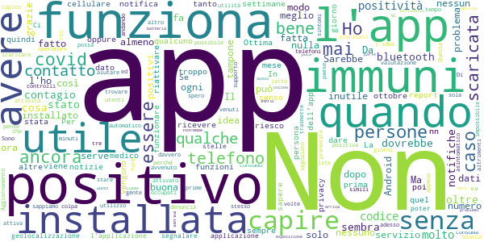
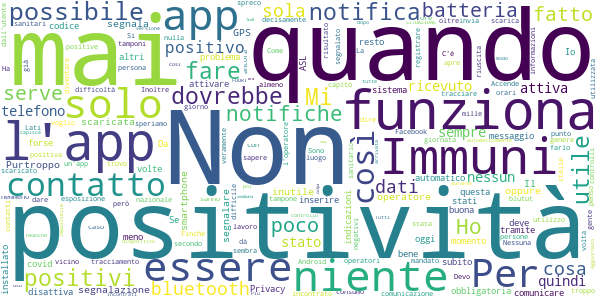

# Immuni
App version ``2.1.0``

Analyzed with [covid-apps-observer](http://github.com/covid-apps-observer) project, version ``0.1``

## App overview
| | |
|-------------------------|-------------------------| 
| **Name**&nbsp;&nbsp;&nbsp;&nbsp;&nbsp;&nbsp;&nbsp;&nbsp;&nbsp;&nbsp;&nbsp;&nbsp;&nbsp;&nbsp;&nbsp;&nbsp;&nbsp;&nbsp;&nbsp;&nbsp;&nbsp;&nbsp;&nbsp;&nbsp;&nbsp;&nbsp;&nbsp;&nbsp;&nbsp;&nbsp;&nbsp;&nbsp;&nbsp;&nbsp;&nbsp;&nbsp;&nbsp;&nbsp;&nbsp;&nbsp;  | Immuni |
| **Unique identifier** | it.ministerodellasalute.immuni |
| **Link to Google Play** | [https://play.google.com/store/apps/details?id=it.ministerodellasalute.immuni](https://play.google.com/store/apps/details?id=it.ministerodellasalute.immuni) |
| **Summary**  | App ufficiale per le notifiche di esposizione in Italia |
| **Privacy policy** | [https://www.immuni.italia.it/app-pn.html](https://www.immuni.italia.it/app-pn.html) |
| **Latest version** | 2.1.0 |
| **Last update** | 2020-10-28 14:09:43 |
| **Recent changes** | - Aggiornati i testi in tedesco - Correzione di alcuni bug  |
| **Installs**  | 5.000.000+ |
| **Category** | Medicina |
| **First release** | 1 giu 2020 |
| **Size**  | 28M |
| **Supported Android version**  | 6.0 e versioni successive |

### Description
> Immuni è l’app ufficiale per le notifiche di esposizione del governo italiano, sviluppata dal Commissario Straordinario per l’Emergenza COVID-19 in collaborazione con il Ministero della Salute e il Ministero per l’Innovazione Tecnologica e la Digitalizzazione. L’app è sviluppata e rilasciata nel pieno rispetto della protezione dei dati personali dell’utente e della normativa vigente, incluso il decreto-legge del 30 aprile 2020, n. 28.
 Nella lotta all’epidemia di COVID-19, l’app aiuta a notificare gli utenti potenzialmente contagiati il prima possibile, anche quando sono asintomatici. Questi utenti possono poi isolarsi per evitare di contagiare altri, con l’effetto di minimizzare la diffusione del virus e velocizzare il ritorno a una vita normale per la maggior parte della popolazione. Venendo informati tempestivamente, inoltre, gli utenti possono anche contattare il proprio medico di medicina generale, riducendo così il rischio di complicanze.
 Il sistema di notifiche di esposizione di Immuni si basa sulla tecnologia Bluetooth Low Energy, creata per essere particolarmente efficiente in termini di risparmio energetico, e non utilizza alcun tipo di dato di geolocalizzazione, inclusi quelli del GPS. L’app non raccoglie e non è in grado di ottenere alcun dato che identifichi l’utente, quali nome, cognome, data di nascita, indirizzo, numero di telefono o indirizzo email. Immuni riesce quindi a determinare che un contatto fra due utenti è avvenuto, ma non chi siano effettivamente i due utenti o dove si siano incontrati.
 Ecco una lista di alcune delle misure con cui Immuni protegge i dati degli utenti:
 • I dati raccolti sono quelli minimi, strettamente necessari per supportare e migliorare il sistema di notifiche di esposizione.
 • Il codice Bluetooth Low Energy trasmesso dall’app è generato in maniera casuale e non contiene alcuna informazione riguardo allo smartphone dell’utente, tanto meno sull’utente stesso. Inoltre, questo codice cambia svariate volte ogni ora, per tutelare ancora meglio la privacy dell’utente.
 • I dati salvati sullo smartphone sono cifrati.
 • Le connessioni tra l’app e il server sono cifrate.
 • Tutti i dati, siano essi salvati sul dispositivo o sul server, saranno cancellati non appena non saranno più necessari e in ogni caso non oltre il 31 dicembre 2020.
 • È il Ministero della Salute il soggetto che raccoglie i dati e che decide per quali scopi utilizzarli. In ogni caso, i dati verranno usati solo per contenere l’epidemia del COVID-19 e per la ricerca scientifica.
 • I dati sono salvati su server in Italia e gestiti da soggetti pubblici.

 Immuni non fa e non può fare diagnosi. Sulla base dello storico dei contatti con utenti potenzialmente contagiosi, Immuni elabora alcune raccomandazioni su come è necessario comportarsi. Ma l’app non è un dispositivo medico e non può in alcun caso sostituire un medico.
 Immuni è uno strumento importante nella lotta a questa terribile epidemia e ciascun utente ne aumenta l’efficacia complessiva. Per questo consigliamo vivamente di installare l’app, usarla correttamente e incoraggiare parenti e amici a fare lo stesso. Tuttavia, non c’è alcun obbligo di utilizzo. La decisione spetta soltanto all’individuo.

### User interface
The developers of the app provide the following screenshots in the Google play store.
| | | |
|:-------------------------:|:-------------------------:|:-------------------------:|
 |   |   |   | 
 |  

## Development team
In the following we report the main information provided by the development team in the Google play store.

| | |
|-------------------------|-------------------------|
| **Developer**  | Ministero della Salute |
| **Website**  | [https://www.immuni.italia.it/](https://www.immuni.italia.it/) |
| **Email** | cittadini@immuni.italia.it |
| **Physical address**  | - |
| **Other developed apps**  | [https://play.google.com/store/apps/developer?id=Ministero+della+Salute](https://play.google.com/store/apps/developer?id=Ministero+della+Salute) |

## Android support

| | |
|-------------------------|-------------------------|
| **Declared target Android version**  | Android10, version 10 (API level 29) |
| **Effective target Android version**  | Android10, version 10 (API level 29) |
| **Minimum supported Android version**  | Marshmallow, version 6.0 (API level 23) |
| **Maximum target Android version**  | - |

The larger the difference between the minimum and maximum supported Android versions, the better. A larger difference means a wider audience. For example, old phones have a very low Android version, so a high minimum supported Android version means that the app cannot be used by users with old phones, thus leading to accessibility problems. 

## Requested permissions

In the following we report the complete list of the permissions requested by the app. 

| **Permission** | **Protection level** | **Description** | 
|-------------------------|-------------------------|-------------------------|
 **android.permission ACCESS_NETWORK_STATE** | Normal | Allows applications to access information about networks. 
 **android.permission BLUETOOTH** | Normal | Allows applications to connect to paired bluetooth devices. 
 **android.permission FOREGROUND_SERVICE** | Normal | Allows a regular application to use Service.startForeground. 
 **android.permission INTERNET** | Normal | Allows applications to open network sockets. 
 **android.permission RECEIVE_BOOT_COMPLETED** | Normal | Allows an application to receive the Intent.ACTION_BOOT_COMPLETED that is broadcast after the system finishes booting. 
 **android.permission WAKE_LOCK** | Normal | Allows using PowerManager WakeLocks to keep processor from sleeping or screen from dimming. 

## Mentioned servers

| **Server** | **Registrant** | **Registrant country** | **Creation date** | 
|-------------------------|-------------------------|-------------------------|-------------------------|
 | google.com | Google LLC | :us: US | 1997-09-15 04:00:00 |
 | googleapis.com | Google LLC | :us: US | 2005-01-25 17:52:26 |
 | italia.it | Presidenza del Consiglio dei Ministri | :it: IT | 2004-06-03 00:00:00 |

## Security analysis 

Below we report the main security warnings raised by our execution of the [Androwarn](https://github.com/maaaaz/androwarn) security analysis tool.

**Connection interfaces exfiltration**
> - This application reads details about the currently active data network 
> - This application tries to find out if the currently active data network is metered 

**Telephony services abuse**
> - This application makes phone calls 

**Suspicious connection establishment**
> - This application opens a Socket and connects it to the remote address ' returned no addresses for  ; port is out of range' on the 'N/A' port  
> - This application opens a Socket and connects it to the remote address '' on the 'N/A' port  
> - This application opens a Socket and connects it to the remote address 'Ljava/lang/StringBuilder;->toString()Ljava/lang/String;' on the 'N/A' port  
> - This application opens a Socket and connects it to the remote address 'Ljava/net/Proxy;->type()Ljava/net/Proxy$Type;' on the 'N/A' port  
> - This application opens a Socket and connects it to the remote address 'Method sendUrgentData() is not supported.' on the 'N/A' port  
> - This application opens a Socket and connects it to the remote address 'Method setHandshakeTimeout() is not supported.' on the 'N/A' port  
> - This application opens a Socket and connects it to the remote address 'Method setOOBInline() is not supported.' on the 'N/A' port  
> - This application opens a Socket and connects it to the remote address 'Method setSoWriteTimeout() is not supported.' on the 'N/A' port  
> - This application opens a Socket and connects it to the remote address 'Socket closed' on the 'N/A' port  
> - This application opens a Socket and connects it to the remote address 'Socket is closed' on the 'N/A' port  
> - This application opens a Socket and connects it to the remote address 'Socket is closed.' on the 'N/A' port  
> - This application opens a Socket and connects it to the remote address 'Socket is not connected.' on the 'N/A' port  
> - This application opens a Socket and connects it to the remote address 'socket is closed' on the 'N/A' port  
> - This application opens a Socket and connects it to the remote address 'timeout' on the 'N/A' port  

**Code execution**
> - This application loads a native library: 'conscrypt_gmscore_jni' 
> - This application loads a native library: 'conscrypt_jni' 

## User ratings and reviews

Below we provide information about how end users are reacting to the app in terms of ratings and reviews in the Google Play store.

### Ratings

The Immuni app has been installed by more than **5000000** times. At this time, **38893** rated the app and its average score is **3.1011758**. Below we show the distribution of the ratings across the usual star-based rating of Google Play

:star::star::star::star::star:: 16465

:star::star::star::star:: 2801

:star::star::star:: 2753

:star::star:: 1953

:star:: 14921

### Reviews 

#### 5-star reviews

> Non da nessun fastidio e potrebbe aiutare il tracciamento...se solo ci fosse un minimo di senso civico!  :date: __2020-10-31 10:49:38__

> L'app assolve le funzionalità per cui è stata creata. Molti dei problemi scritti nelle altre recensioni esulano da una valutazione puntuale e razionale.  :date: __2020-10-31 10:02:30__

> Secondo me sarebbe da scaricare perché quando vai in mezzo ad una folla bisognerebbe averla tutti in modo che se in mezzo a quella folla se sei stato A contatto con uno infetto l'app te lo segnalerà  :date: __2020-10-31 09:54:04__

> Mamyma6  :date: __2020-10-31 09:19:55__

> Trovo che sono veramente piacevoli 📸👍☯️🙏🙏👏⚓🌹❤️🙏🏽  :date: __2020-10-31 09:19:19__

> Applicazione da installare. In questo momento storico il consumo di batteria lo lascerei in secondo piano. Cerchiamo di collaborare tutti e andare tutti nella stessa direzione.  :date: __2020-10-31 08:46:53__

> Ottimo servizio molto utile  :date: __2020-10-31 07:53:42__

> App a mio avviso fatta pure bene ma purtroppo mi accorgo che ha poco successo perchè pochi la hanno scaricata... quindi la sua efficacia ed utilità è praticamente inesistente.  :date: __2020-10-31 07:40:37__

> Ho scaricato APP, vedo solo servizio attivo. Apro tutti giorni ma non funziona.  :date: __2020-10-31 06:20:25__

> La per me stesso e per la sicurezza di tutti  :date: __2020-10-31 01:49:09__

#### 4-star reviews

> Buona  :date: __2020-10-31 03:01:32__

> Sembra funzionare. Per fortuna non ho ricevuto notifiche  :date: __2020-10-30 19:02:49__

> Spero che funzioni ancora. Non mi aggiona piu' settimalmente sui contatti con le persone  :date: __2020-10-30 18:56:38__

> lo istallato pero"non riesce ad inganciare pur provando molte volte e secondi l"operatore  :date: __2020-10-30 18:31:44__

> Funziona perfettamente, l'importante è mantenere geolocalizzazione e bluetooth sempre accesi e aprire l'app una volta al giorno. Appena risolvete il bug dell'apertura, lascio le 5 stelle.  :date: __2020-10-30 07:03:48__

> Ottima e silente. Non scarica la batteria. Tutti dovrebbero scaricarla. Per motivare le persone a farlo, si potrebbe mostrare il solo numero di persone della "comunità Immuni" con le quali ci si è connessi in un giorno e complessivamente, magari con la compilazione di grafici di periodo. Sempre nel rispetto della privacy.  :date: __2020-10-29 22:45:09__

> Buona applicazione, dovrebbe segnalare quotidianamente il numero dei codici scambiati per dare idea del suo funzionamento. Servirebbe più pubblicità informativa per diffonderla meglio o un obbligo di utilizzo in specifici ambienti.  :date: __2020-10-29 21:32:17__

> L'ho installata fin dalla sua nascita, mai dato problemi, mi spiace che i detrattori dell'app si sfoghino anche qui dove il giudizio dovrebbe essere solo di tipo tecnico. Non do per principio mai le 5 stars perché c'è sempre qualcosa da migliorare.  :date: __2020-10-29 21:22:21__

> Ok  :date: __2020-10-29 20:40:11__

> Una Iniziativa bella e necessaria ma siamo in pochi ad averla attivata, per cui non sono riuscito a provare l'efficacia.  :date: __2020-10-29 16:11:41__

#### 3-star reviews

> Ottima  :date: __2020-10-31 09:25:35__

> Ancora non lo so come funziona  :date: __2020-10-31 08:48:17__

> Questa più che una recensione è una denuncia ma non contro questa app di certo utile ma contro la società menefreghista, individualista e negazionista che non la usa ed, è una denuncia agli utenti che non si denunciano nonostante l'anonimato. Spiego il perché. Io scaricai questa app un mese fa tenendola attiva sia quando sono in casa; o quando sono fuori per varie attività consentitemi dal DPCM: eppure l'app Immuni non ha mai registrato un caso di persona positiva. Posso solo dare⭐⭐⭐❌⚧  :date: __2020-10-31 08:19:29__

> L' ho scaricata all'inizio e poi disinstallata perché non capivo il suo utilizzo adesso spero che si trova il suo senso  :date: __2020-10-31 08:07:22__

> Da quando l'ho installata (Oltre un mese fa) il telefono (Huawei P9 lite) non riesce più ad arrivare fino a sera con la piena ricarica del mattino. Ho cercato notizie sul consumo di corrente dell'app o del bluetooth e da ciò che ho letto non sembra essere colpa ne dell'una ne dell'altro ma il dato di fatto è che con la app installata e funzionante il telefono consuma davvero di più, tanto da non avere più carica appena dopo pranzo, considerando lo stesso utilizzo di sempre.  :date: __2020-10-30 22:24:52__

> Bene  :date: __2020-10-30 18:05:19__

> Discreta.  :date: __2020-10-30 17:21:05__

> Nessun operatore ha chiamato la figlia della mia compagna che è risultata positiva. In questo modo non è possibile che l'app funzioni correttamente. Nessuno ne parla più di questa app. Perché?  :date: __2020-10-30 15:50:33__

> Così come prima impressione sembra fatta meglio di altre app. Regionali simili, vedremo nel tempo la sua efficacia ed affidabilità.  :date: __2020-10-30 14:54:19__

> Non riesco a capire se l'app sta funzionando oppure no.  :date: __2020-10-30 13:38:03__

#### 2-star reviews

> Per ora, forse non per colpa sua, perché è stata snobbata o boicottata da troppi, non mi dà fiducia. Spero di riuscire a dare 5 stelle quanto prima  :date: __2020-10-31 10:51:17__

> Ha segnalato esposizione al contagio alle 6 di mattina quando dormivo con mia moglie che ha Immuni sul cell appoggiato sul comodino. Lei non è positiva e non ha segnalato positività su Immuni. Ho ricevuto altre notifiche inspiegabili come questa. C'è da chiedersi se e come funziona Immuni. Se si desidera comunicare la positività Immuni fornisce un codice da "comunicare all'operatore" con cui parlare telefonicamente, ma non è chiarito come contattare l'operatore in caso di positività.  :date: __2020-10-31 09:45:47__

> Per me ultimamente non funziona : non arrivano notifiche se non relative ad orari impossibili  :date: __2020-10-30 23:40:15__

> È a discrezione del utente inviare la positività quindi non è utile  :date: __2020-10-30 17:13:38__

> È un'app con alte potenzialità ma decisamente mal utilizzata, la ho istallata verso maggio e la ho tenuta sempre attiva però non ho ancora ricevuto nessun messaggio che mi comunica che sono stato vicino a dei posidivi che è decisamente improbabile e in oltre ho scoperto di recente di essere stato a contatto con dei positivi dalla scuola ma da immuni niente. Secindo me sarebbe da mettere obbligatoria così sì che tracci il virus, mica facendovchiudere i locali alle 18  :date: __2020-10-30 12:38:58__

> Ragazzi scusatemi ma perché l' avete inventata sta app che funzionasse solo con il blutut, così il telefono si scarica subito, e una persona non tiene accesso il blutut tutta la giornata.  :date: __2020-10-30 07:34:55__

> Nn arriva mai una notifica con segnalazione e se si apre l'app è difficile capire dove andare per controllare ciò  :date: __2020-10-29 21:17:45__

> Sul mio telefono, non si disattiva mai e non mi sembra che il consumo batteria sia aumentato più di tanto, quindi sembrerebbe fare quello che deve. Purtroppo la "volontarietà" dell'app e la scarsa diffusione a livello nazionale, la rendono al momento ben poco utile. Inoltre il sistema di segnalazione della positività tramite operatore è fallimentare. E ad oggi, non parla ancora con le sue omologhe europee. Il contact tracing fatto così non serve a nulla.  :date: __2020-10-29 21:09:01__

> Non è scaricabile su molti smartphone Versioni Android 5.0.1 e precedenti  :date: __2020-10-29 20:23:29__

> Gli operatori sanitari a seguito della comunicazione del codice non sanno che fare e come inserire la tua condizione. Purtroppo, e mi dispiace molto, è un App inutile.  :date: __2020-10-29 18:10:29__

#### 1-star reviews

> Na stronzata  :date: __2020-10-31 10:41:42__

> Una buffonata. L ho istallata con le migliori intenzioni ma non si apre, il messaggio dice che va continuamente in blocco, mai avuto alcun problema con le app nel mio telefono, solo con questa. Soldi pubblici buttati.  :date: __2020-10-31 10:30:41__

> Non serve a niente. Pessima. L'ennesima presa in giro.  :date: __2020-10-31 10:28:47__

> Nessuna vera informazione su come procedere  :date: __2020-10-31 10:08:54__

> Non va . .. perché?  :date: __2020-10-31 08:50:14__

> Sto lavorando in reparto covid e mai nessuna segnalazione  :date: __2020-10-31 08:47:36__

> È la solita app che non funziona, siamo in Italia e qui non funziona più niente!  :date: __2020-10-31 08:27:27__

> Non mi pare funzioni a dovere....  :date: __2020-10-31 08:21:20__

> Non funziona  :date: __2020-10-31 08:05:17__

> Inutile  :date: __2020-10-31 07:09:24__

