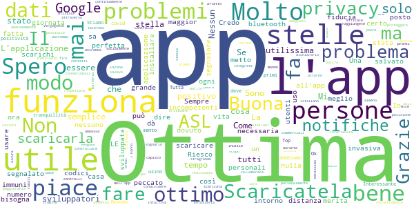
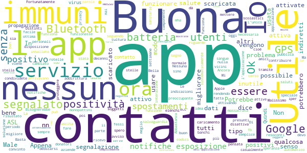
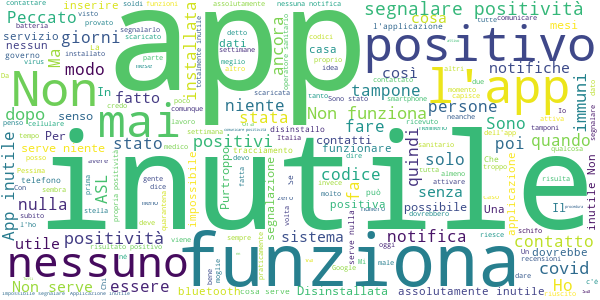

# Immuni
App version ``2.1.1``

Analyzed with [covid-apps-observer](http://github.com/covid-apps-observer) project, version ``0.1``

## App overview
| | |
|-------------------------|-------------------------| 
| **Name**&nbsp;&nbsp;&nbsp;&nbsp;&nbsp;&nbsp;&nbsp;&nbsp;&nbsp;&nbsp;&nbsp;&nbsp;&nbsp;&nbsp;&nbsp;&nbsp;&nbsp;&nbsp;&nbsp;&nbsp;&nbsp;&nbsp;&nbsp;&nbsp;&nbsp;&nbsp;&nbsp;&nbsp;&nbsp;&nbsp;&nbsp;&nbsp;&nbsp;&nbsp;&nbsp;&nbsp;&nbsp;&nbsp;&nbsp;&nbsp;  | Immuni |
| **Unique identifier** | it.ministerodellasalute.immuni |
| **Link to Google Play** | [https://play.google.com/store/apps/details?id=it.ministerodellasalute.immuni](https://play.google.com/store/apps/details?id=it.ministerodellasalute.immuni) |
| **Summary**  | App ufficiale per le notifiche di esposizione in Italia |
| **Privacy policy** | [https://www.immuni.italia.it/app-pn.html](https://www.immuni.italia.it/app-pn.html) |
| **Latest version** | 2.1.1 |
| **Last update** | 2020-11-03 13:55:44 |
| **Recent changes** | Correzione di alcuni bug |
| **Installs**  | 5.000.000+ |
| **Category** | Medicina |
| **First release** | 1 giu 2020 |
| **Size**  | 28M |
| **Supported Android version**  | 6.0 e versioni successive |

### Description
> Immuni è l’app ufficiale per le notifiche di esposizione del governo italiano, sviluppata dal Commissario Straordinario per l’Emergenza COVID-19 in collaborazione con il Ministero della Salute e il Ministero per l’Innovazione Tecnologica e la Digitalizzazione. L’app è sviluppata e rilasciata nel pieno rispetto della protezione dei dati personali dell’utente e della normativa vigente, incluso il decreto-legge del 30 aprile 2020, n. 28.
 Nella lotta all’epidemia di COVID-19, l’app aiuta a notificare gli utenti potenzialmente contagiati il prima possibile, anche quando sono asintomatici. Questi utenti possono poi isolarsi per evitare di contagiare altri, con l’effetto di minimizzare la diffusione del virus e velocizzare il ritorno a una vita normale per la maggior parte della popolazione. Venendo informati tempestivamente, inoltre, gli utenti possono anche contattare il proprio medico di medicina generale, riducendo così il rischio di complicanze.
 Il sistema di notifiche di esposizione di Immuni si basa sulla tecnologia Bluetooth Low Energy, creata per essere particolarmente efficiente in termini di risparmio energetico, e non utilizza alcun tipo di dato di geolocalizzazione, inclusi quelli del GPS. L’app non raccoglie e non è in grado di ottenere alcun dato che identifichi l’utente, quali nome, cognome, data di nascita, indirizzo, numero di telefono o indirizzo email. Immuni riesce quindi a determinare che un contatto fra due utenti è avvenuto, ma non chi siano effettivamente i due utenti o dove si siano incontrati.
 Ecco una lista di alcune delle misure con cui Immuni protegge i dati degli utenti:
 • I dati raccolti sono quelli minimi, strettamente necessari per supportare e migliorare il sistema di notifiche di esposizione.
 • Il codice Bluetooth Low Energy trasmesso dall’app è generato in maniera casuale e non contiene alcuna informazione riguardo allo smartphone dell’utente, tanto meno sull’utente stesso. Inoltre, questo codice cambia svariate volte ogni ora, per tutelare ancora meglio la privacy dell’utente.
 • I dati salvati sullo smartphone sono cifrati.
 • Le connessioni tra l’app e il server sono cifrate.
 • Tutti i dati, siano essi salvati sul dispositivo o sul server, saranno cancellati non appena non saranno più necessari e in ogni caso non oltre il 31 dicembre 2020.
 • È il Ministero della Salute il soggetto che raccoglie i dati e che decide per quali scopi utilizzarli. In ogni caso, i dati verranno usati solo per contenere l’epidemia del COVID-19 e per la ricerca scientifica.
 • I dati sono salvati su server in Italia e gestiti da soggetti pubblici.

 Immuni non fa e non può fare diagnosi. Sulla base dello storico dei contatti con utenti potenzialmente contagiosi, Immuni elabora alcune raccomandazioni su come è necessario comportarsi. Ma l’app non è un dispositivo medico e non può in alcun caso sostituire un medico.
 Immuni è uno strumento importante nella lotta a questa terribile epidemia e ciascun utente ne aumenta l’efficacia complessiva. Per questo consigliamo vivamente di installare l’app, usarla correttamente e incoraggiare parenti e amici a fare lo stesso. Tuttavia, non c’è alcun obbligo di utilizzo. La decisione spetta soltanto all’individuo.

### User interface
The developers of the app provide the following screenshots in the Google play store.
| | | |
|:-------------------------:|:-------------------------:|:-------------------------:|
 |   |   |   | 
 |  

## Development team
In the following we report the main information provided by the development team in the Google play store.

| | |
|-------------------------|-------------------------|
| **Developer**  | Ministero della Salute |
| **Website**  | [https://www.immuni.italia.it/](https://www.immuni.italia.it/) |
| **Email** | cittadini@immuni.italia.it |
| **Physical address**  | - |
| **Other developed apps**  | [https://play.google.com/store/apps/developer?id=Ministero+della+Salute](https://play.google.com/store/apps/developer?id=Ministero+della+Salute) |

## Android support

| | |
|-------------------------|-------------------------|
| **Declared target Android version**  | Android10, version 10 (API level 29) |
| **Effective target Android version**  | Android10, version 10 (API level 29) |
| **Minimum supported Android version**  | Marshmallow, version 6.0 (API level 23) |
| **Maximum target Android version**  | - |

The larger the difference between the minimum and maximum supported Android versions, the better. A larger difference means a wider audience. For example, old phones have a very low Android version, so a high minimum supported Android version means that the app cannot be used by users with old phones, thus leading to accessibility problems. 

## Requested permissions

In the following we report the complete list of the permissions requested by the app. 

| **Permission** | **Protection level** | **Description** | 
|-------------------------|-------------------------|-------------------------|
 **android.permission ACCESS_NETWORK_STATE** | Normal | Allows applications to access information about networks. 
 **android.permission BLUETOOTH** | Normal | Allows applications to connect to paired bluetooth devices. 
 **android.permission FOREGROUND_SERVICE** | Normal | Allows a regular application to use Service.startForeground. 
 **android.permission INTERNET** | Normal | Allows applications to open network sockets. 
 **android.permission RECEIVE_BOOT_COMPLETED** | Normal | Allows an application to receive the Intent.ACTION_BOOT_COMPLETED that is broadcast after the system finishes booting. 
 **android.permission WAKE_LOCK** | Normal | Allows using PowerManager WakeLocks to keep processor from sleeping or screen from dimming. 

## Mentioned servers

| **Server** | **Registrant** | **Registrant country** | **Creation date** | 
|-------------------------|-------------------------|-------------------------|-------------------------|
 | google.com | Google LLC | :us: US | 1997-09-15 04:00:00 |
 | googleapis.com | Google LLC | :us: US | 2005-01-25 17:52:26 |
 | italia.it | Presidenza del Consiglio dei Ministri | :it: IT | 2004-06-03 00:00:00 |

## Security analysis 

Below we report the main security warnings raised by our execution of the [Androwarn](https://github.com/maaaaz/androwarn) security analysis tool.

**Connection interfaces exfiltration**
> - This application reads details about the currently active data network 
> - This application tries to find out if the currently active data network is metered 

**Telephony services abuse**
> - This application makes phone calls 

**Suspicious connection establishment**
> - This application opens a Socket and connects it to the remote address ' returned no addresses for  ; port is out of range' on the 'N/A' port  
> - This application opens a Socket and connects it to the remote address '' on the 'N/A' port  
> - This application opens a Socket and connects it to the remote address 'Ljava/lang/StringBuilder;->toString()Ljava/lang/String;' on the 'N/A' port  
> - This application opens a Socket and connects it to the remote address 'Ljava/net/Proxy;->type()Ljava/net/Proxy$Type;' on the 'N/A' port  
> - This application opens a Socket and connects it to the remote address 'Method sendUrgentData() is not supported.' on the 'N/A' port  
> - This application opens a Socket and connects it to the remote address 'Method setHandshakeTimeout() is not supported.' on the 'N/A' port  
> - This application opens a Socket and connects it to the remote address 'Method setOOBInline() is not supported.' on the 'N/A' port  
> - This application opens a Socket and connects it to the remote address 'Method setSoWriteTimeout() is not supported.' on the 'N/A' port  
> - This application opens a Socket and connects it to the remote address 'Socket closed' on the 'N/A' port  
> - This application opens a Socket and connects it to the remote address 'Socket is closed' on the 'N/A' port  
> - This application opens a Socket and connects it to the remote address 'Socket is closed.' on the 'N/A' port  
> - This application opens a Socket and connects it to the remote address 'Socket is not connected.' on the 'N/A' port  
> - This application opens a Socket and connects it to the remote address 'socket is closed' on the 'N/A' port  
> - This application opens a Socket and connects it to the remote address 'timeout' on the 'N/A' port  

**Code execution**
> - This application loads a native library: 'conscrypt_gmscore_jni' 
> - This application loads a native library: 'conscrypt_jni' 

## User ratings and reviews

Below we provide information about how end users are reacting to the app in terms of ratings and reviews in the Google Play store.

### Ratings

The Immuni app has been installed by more than **5000000** times. At this time, **40100** rated the app and its average score is **2.8611383**. Below we show the distribution of the ratings across the usual star-based rating of Google Play

:star::star::star::star::star:: 14738

:star::star::star::star:: 2666

:star::star::star:: 2764

:star::star:: 2154

:star:: 17778

### Reviews 

#### 5-star reviews

> Molto utile  :date: __2020-12-20 10:35:00__

> Ottimo  :date: __2020-12-20 01:19:54__

> L'app sembra ben progettata e ricca di FAQ e spiegazioni esaustive. Non ho ancora ricevuto alcun avviso e finora non ho avuto bisogno di avvisare volontariamente alcuna positività. Nel complesso la App, al di fuori di opinioni personali "serve non serve", è ben fatta – considerando che è stata creata coi soldi degli italiani. Rispetto a tanti altri vergognosi furti precedenti, ho apprezzato.  :date: __2020-12-19 22:49:11__

> DOVETE INSTALLARLA E USARLA TUTTI! Tra GPS e bluetooth mi consuma circa il 15/20% di batteria al giorno, lavorando al pubblico ritengo che in caso di focolaio questa app fà la DIFFERENZA e come se la fà! 🛡️Prevenire è meglio che curare  :date: __2020-12-19 21:33:59__

> Utilissima per tutti!! Ci dobbiamo aiutare a vicenda,invito tutti a scaricarla Andrà tutto Bene.  :date: __2020-12-19 21:09:45__

> , il gatto che parla  :date: __2020-12-19 18:29:20__

> Spero funzioni lo avevo attivo da tempo  :date: __2020-12-19 14:24:01__

> Bravi.  :date: __2020-12-18 22:00:32__

> L'app è fatta bene, però secondo me bisogna tenerla attiva solo quando si esce di casa se no ti consuma tanta batteria .  :date: __2020-12-18 20:10:35__

> E molto utile per chisa ciai un amico/a o qualcuno positivo la app ti averte  :date: __2020-12-18 19:01:26__

#### 4-star reviews

> Ottimo l'inserimento per il tracciamento estero. Non nascondiamoci dietro la privacy.  :date: __2020-12-20 16:58:36__

> 5 stelle perché ve le meritate. È difficile stare dietro a tutte le critiche e i complottismi. UPDATE: L'app crasha all'avvio... Deduco che non stia funzionando nemmeno il sistema di tracking. Dovreste risolvere al più presto  :date: __2020-12-19 23:04:09__

> Funziona perfettamente senza essere invasiva. Bisognerebbe aggiungere una Dark mode e permettere di fare screenshot senza usare l'assistente vocale  :date: __2020-12-19 11:55:33__

> Ottimo  :date: __2020-12-18 09:42:36__

> Semplicissima da utilizzare, basta attivare Bluetooth e geolocalizzazione, per il resto funziona totalmente in background.  :date: __2020-12-16 21:15:33__

> Leggera. Facile. Intuitiva.  :date: __2020-12-14 12:29:52__

> Ora funziona tutto  :date: __2020-12-14 11:51:26__

> App sicuramente funzionante e molto utile. Ma Non mi è stata di utilità. Purtroppo non c'è la giusta educazione e formazione digitale della popolazione / cittadini. È da lì che si dovrebbe partire.  :date: __2020-12-13 14:11:00__

> Buona  :date: __2020-12-13 06:09:20__

> Fa cagare  :date: __2020-12-12 12:17:14__

#### 3-star reviews

> Non esco,non vado a fare shopping,da febbraio,solo medico e farmacia,fin ora niente covid  :date: __2020-12-20 08:14:02__

> Beh, la App di per sé non può avere una recensione né positiva né negativa, nel senso che fa il suo dovere senza infamia e senza lode. Il problema, purtroppo, è legato alla "lentezza" della tracciabilità da parte del SSN che, contattando il cittadino con ritardo rispetto alla positività (per ovvi motivi di stress del sistema), fornisce il codice di conferma con lo stesso ritardo. Ne consegue che i tempi di segnalazione della App non possono essere quelli corretti...  :date: __2020-12-19 13:17:49__

> Immuni non mi fornisce più informazioni di contatti con altri utenti dell'app. Non capisco se sta funzionando  :date: __2020-12-18 18:08:22__

> 🤝👍  :date: __2020-12-16 13:32:12__

> Non si può vedere con quanti negativi si è venuti in contatto. Ed i positivi dove si vedono? Solo tramite un alert?  :date: __2020-12-16 13:28:50__

> Inutile se non la installa nessuno  :date: __2020-12-16 11:42:39__

> Sarebbe bello se fosse più stabile. Spesso si disattiva (non è he si può controllare sempre) e spesso non si riesce ad aprire ci vogliono molti tentativi. Non è molto pratica così.... Per il resto è ok  :date: __2020-12-16 10:27:53__

> Indifferente ed Inefficace  :date: __2020-12-16 04:10:17__

> Sarebbe interessante e utile completare l'app con la possibilità di compilare l'autocertificazione online senza doverla stampare oltre che i link verso il dcpm in vigore, mappa regioni/colore.... Insomma renderla appetibile...  :date: __2020-12-15 17:52:20__

> Non saprei proprio che voto dare a questa app io l'ho installata a luglio ma stranamente non ho mai ricevuto avvisi, funziona la devo tenere??  :date: __2020-12-15 08:57:44__

#### 2-star reviews

> Bell'applicazione, bella anche la storia, l'unica cosa è che i personaggi principali si buggano nei muri e devo per forza riavviare l'applicazione, do due stelle per questo particolare per il resto è una applicazione valida  :date: __2020-12-20 13:55:43__

> Sono risultato positivo al test rapido e segnalarlo all'app, ma non riesco a contattare nessun operatore sanitario per confermare.  :date: __2020-12-19 22:25:23__

> Il concetto dell'app sarebbe pure bello, se non fosse che 9 0er9ne su 10 che incontro non ce l'hanno, e spesso pure se ce l'hanno tengono il telefono spento. Purtroppo avrebbero dovuto renderla obbligatoria e fare controlli casuali (da gente informata) per vedere se presente sui vari dispositivi.  :date: __2020-12-18 19:42:40__

> Rewards  :date: __2020-12-18 16:59:03__

> Una cretinata  :date: __2020-12-16 23:39:40__

> Si disattiva da sola e quindi non monitora costantemente..  :date: __2020-12-16 19:53:28__

> Non ha mai dato segni di vita  :date: __2020-12-16 19:23:11__

> Mi dice che è attiva ma non mi manda più i report periodici dei controlli effettuati...boh????  :date: __2020-12-16 18:19:00__

> Un'app che poteva avere davvero un potenziale, la tecnologia alla base è ottima ma tutto crolla nel punto fondamentale dell'app: la segnalazione della positività, macchinosa e con tempi biblici ( non per colpa dell'app va detto ma del sistema sanitario ). A livello visivo è ottima e le istruzioni sono chiare, peccato che per funzionalità rasenta lo 0  :date: __2020-12-15 13:01:07__

> Mai ricevuta nessuna notifica. Forse questa app funziona anche bene, ma non credo sia possibile non essere mai stato vicino a un positivo. Sarò fortunato?  :date: __2020-12-15 08:04:46__

#### 1-star reviews

> Installata subito app  :date: __2020-12-20 16:00:45__

> Purtroppo inutile, da positivo mi è stato impossibile immettere la mia segnalazione nell'app visto che gli operatori sanitari che mi hanno assistito non sapevano la procedura...  :date: __2020-12-20 15:17:25__

> Sono 20 giorni che cerco di comunicare la mia positivita' ma dice sempre, dopo innumerevoli tentativi, che il codice non e' autorizzato. Perche' ?  :date: __2020-12-20 15:01:27__

> Quest'app funziona col Bluetooth, quindi è totalmente inutile se il 99% della gente lo tiene spento durante le sue uscite!  :date: __2020-12-20 14:59:43__

> Fatta completamente male, inutilità totale. Serve molto più automatismo, più rapidità. Per non parlare della batteria che consuma..  :date: __2020-12-20 14:59:28__

> L ho disinstallato dopo mesi e mesi... Ho voluto avere fiducia ma quando nonostante fossi circondata nel quartiere da persone positive non mi ha mai segnato nulla ho tolto tutto. Di 50 positivi nelle vicinanze me ne avesse segnalato uno... È inutile! Adios  :date: __2020-12-20 14:08:39__

> Non funziona non viene usata dalle autorità sanitarie..  :date: __2020-12-20 12:26:15__

> App perfettamente inutile, continua a chiudersi e non mi fa accedere da giorni! Fra l'altro, il mio collega, risultato positivo mesi fa, non è ancora riuscito ad inserire l'informazione!  :date: __2020-12-20 11:44:27__

> Totalmente inutile in tutte le varie situazioni disinstallo e disinstallate tutti così da mettere le autorità in condizione di creare un app seria ed obbligatoria. Zero stelle zero a chi la messa in opera  :date: __2020-12-20 11:42:32__

> Non no visto niente ancors  :date: __2020-12-20 10:53:04__

