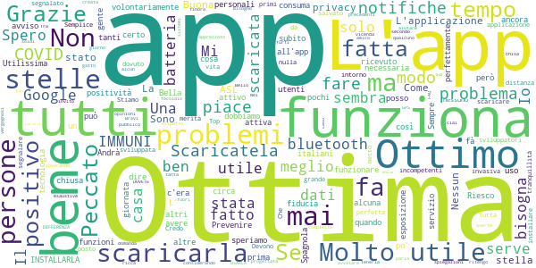

# Immuni
App version ``2.1.1``

Analyzed with [covid-apps-observer](http://github.com/covid-apps-observer) project, version ``0.1``

## App overview
| | |
|-------------------------|-------------------------| 
| **Name**&nbsp;&nbsp;&nbsp;&nbsp;&nbsp;&nbsp;&nbsp;&nbsp;&nbsp;&nbsp;&nbsp;&nbsp;&nbsp;&nbsp;&nbsp;&nbsp;&nbsp;&nbsp;&nbsp;&nbsp;&nbsp;&nbsp;&nbsp;&nbsp;&nbsp;&nbsp;&nbsp;&nbsp;&nbsp;&nbsp;&nbsp;&nbsp;&nbsp;&nbsp;&nbsp;&nbsp;&nbsp;&nbsp;&nbsp;&nbsp;  | Immuni |
| **Unique identifier** | it.ministerodellasalute.immuni |
| **Link to Google Play** | [https://play.google.com/store/apps/details?id=it.ministerodellasalute.immuni](https://play.google.com/store/apps/details?id=it.ministerodellasalute.immuni) |
| **Summary**  | App ufficiale per le notifiche di esposizione in Italia |
| **Privacy policy** | [https://www.immuni.italia.it/app-pn.html](https://www.immuni.italia.it/app-pn.html) |
| **Latest version** | 2.1.1 |
| **Last update** | 2020-11-03 13:55:44 |
| **Recent changes** | Correzione di alcuni bug |
| **Installs**  | 5.000.000+ |
| **Category** | Medicina |
| **First release** | 1 giu 2020 |
| **Size**  | 28M |
| **Supported Android version**  | 6.0 e versioni successive |

### Description
> Immuni è l’app ufficiale per le notifiche di esposizione del governo italiano, sviluppata dal Commissario Straordinario per l’Emergenza COVID-19 in collaborazione con il Ministero della Salute e il Ministero per l’Innovazione Tecnologica e la Digitalizzazione. L’app è sviluppata e rilasciata nel pieno rispetto della protezione dei dati personali dell’utente e della normativa vigente, incluso il decreto-legge del 30 aprile 2020, n. 28.
 Nella lotta all’epidemia di COVID-19, l’app aiuta a notificare gli utenti potenzialmente contagiati il prima possibile, anche quando sono asintomatici. Questi utenti possono poi isolarsi per evitare di contagiare altri, con l’effetto di minimizzare la diffusione del virus e velocizzare il ritorno a una vita normale per la maggior parte della popolazione. Venendo informati tempestivamente, inoltre, gli utenti possono anche contattare il proprio medico di medicina generale, riducendo così il rischio di complicanze.
 Il sistema di notifiche di esposizione di Immuni si basa sulla tecnologia Bluetooth Low Energy, creata per essere particolarmente efficiente in termini di risparmio energetico, e non utilizza alcun tipo di dato di geolocalizzazione, inclusi quelli del GPS. L’app non raccoglie e non è in grado di ottenere alcun dato che identifichi l’utente, quali nome, cognome, data di nascita, indirizzo, numero di telefono o indirizzo email. Immuni riesce quindi a determinare che un contatto fra due utenti è avvenuto, ma non chi siano effettivamente i due utenti o dove si siano incontrati.
 Ecco una lista di alcune delle misure con cui Immuni protegge i dati degli utenti:
 • I dati raccolti sono quelli minimi, strettamente necessari per supportare e migliorare il sistema di notifiche di esposizione.
 • Il codice Bluetooth Low Energy trasmesso dall’app è generato in maniera casuale e non contiene alcuna informazione riguardo allo smartphone dell’utente, tanto meno sull’utente stesso. Inoltre, questo codice cambia svariate volte ogni ora, per tutelare ancora meglio la privacy dell’utente.
 • I dati salvati sullo smartphone sono cifrati.
 • Le connessioni tra l’app e il server sono cifrate.
 • Tutti i dati, siano essi salvati sul dispositivo o sul server, saranno cancellati non appena non saranno più necessari e in ogni caso non oltre il 31 dicembre 2020.
 • È il Ministero della Salute il soggetto che raccoglie i dati e che decide per quali scopi utilizzarli. In ogni caso, i dati verranno usati solo per contenere l’epidemia del COVID-19 e per la ricerca scientifica.
 • I dati sono salvati su server in Italia e gestiti da soggetti pubblici.

 Immuni non fa e non può fare diagnosi. Sulla base dello storico dei contatti con utenti potenzialmente contagiosi, Immuni elabora alcune raccomandazioni su come è necessario comportarsi. Ma l’app non è un dispositivo medico e non può in alcun caso sostituire un medico.
 Immuni è uno strumento importante nella lotta a questa terribile epidemia e ciascun utente ne aumenta l’efficacia complessiva. Per questo consigliamo vivamente di installare l’app, usarla correttamente e incoraggiare parenti e amici a fare lo stesso. Tuttavia, non c’è alcun obbligo di utilizzo. La decisione spetta soltanto all’individuo.

### User interface
The developers of the app provide the following screenshots in the Google play store.
| | | |
|:-------------------------:|:-------------------------:|:-------------------------:|
 |   |   |   | 
 |  

## Development team
In the following we report the main information provided by the development team in the Google play store.

| | |
|-------------------------|-------------------------|
| **Developer**  | Ministero della Salute |
| **Website**  | [https://www.immuni.italia.it/](https://www.immuni.italia.it/) |
| **Email** | cittadini@immuni.italia.it |
| **Physical address**  | - |
| **Other developed apps**  | [https://play.google.com/store/apps/developer?id=Ministero+della+Salute](https://play.google.com/store/apps/developer?id=Ministero+della+Salute) |

## Android support

| | |
|-------------------------|-------------------------|
| **Declared target Android version**  | Android10, version 10 (API level 29) |
| **Effective target Android version**  | Android10, version 10 (API level 29) |
| **Minimum supported Android version**  | Marshmallow, version 6.0 (API level 23) |
| **Maximum target Android version**  | - |

The larger the difference between the minimum and maximum supported Android versions, the better. A larger difference means a wider audience. For example, old phones have a very low Android version, so a high minimum supported Android version means that the app cannot be used by users with old phones, thus leading to accessibility problems. 

## Requested permissions

In the following we report the complete list of the permissions requested by the app. 

| **Permission** | **Protection level** | **Description** | 
|-------------------------|-------------------------|-------------------------|
 **android.permission ACCESS_NETWORK_STATE** | Normal | Allows applications to access information about networks. 
 **android.permission BLUETOOTH** | Normal | Allows applications to connect to paired bluetooth devices. 
 **android.permission FOREGROUND_SERVICE** | Normal | Allows a regular application to use Service.startForeground. 
 **android.permission INTERNET** | Normal | Allows applications to open network sockets. 
 **android.permission RECEIVE_BOOT_COMPLETED** | Normal | Allows an application to receive the Intent.ACTION_BOOT_COMPLETED that is broadcast after the system finishes booting. 
 **android.permission WAKE_LOCK** | Normal | Allows using PowerManager WakeLocks to keep processor from sleeping or screen from dimming. 

## Mentioned servers

| **Server** | **Registrant** | **Registrant country** | **Creation date** | 
|-------------------------|-------------------------|-------------------------|-------------------------|
 | google.com | Google LLC | :us: US | 1997-09-15 04:00:00 |
 | googleapis.com | Google LLC | :us: US | 2005-01-25 17:52:26 |
 | italia.it | Presidenza del Consiglio dei Ministri | :it: IT | 2004-06-03 00:00:00 |

## Security analysis 

Below we report the main security warnings raised by our execution of the [Androwarn](https://github.com/maaaaz/androwarn) security analysis tool.

**Connection interfaces exfiltration**
> - This application reads details about the currently active data network 
> - This application tries to find out if the currently active data network is metered 

**Telephony services abuse**
> - This application makes phone calls 

**Suspicious connection establishment**
> - This application opens a Socket and connects it to the remote address ' returned no addresses for  ; port is out of range' on the 'N/A' port  
> - This application opens a Socket and connects it to the remote address '' on the 'N/A' port  
> - This application opens a Socket and connects it to the remote address 'Ljava/lang/StringBuilder;->toString()Ljava/lang/String;' on the 'N/A' port  
> - This application opens a Socket and connects it to the remote address 'Ljava/net/Proxy;->type()Ljava/net/Proxy$Type;' on the 'N/A' port  
> - This application opens a Socket and connects it to the remote address 'Method sendUrgentData() is not supported.' on the 'N/A' port  
> - This application opens a Socket and connects it to the remote address 'Method setHandshakeTimeout() is not supported.' on the 'N/A' port  
> - This application opens a Socket and connects it to the remote address 'Method setOOBInline() is not supported.' on the 'N/A' port  
> - This application opens a Socket and connects it to the remote address 'Method setSoWriteTimeout() is not supported.' on the 'N/A' port  
> - This application opens a Socket and connects it to the remote address 'Socket closed' on the 'N/A' port  
> - This application opens a Socket and connects it to the remote address 'Socket is closed' on the 'N/A' port  
> - This application opens a Socket and connects it to the remote address 'Socket is closed.' on the 'N/A' port  
> - This application opens a Socket and connects it to the remote address 'Socket is not connected.' on the 'N/A' port  
> - This application opens a Socket and connects it to the remote address 'socket is closed' on the 'N/A' port  
> - This application opens a Socket and connects it to the remote address 'timeout' on the 'N/A' port  

**Code execution**
> - This application loads a native library: 'conscrypt_gmscore_jni' 
> - This application loads a native library: 'conscrypt_jni' 

## User ratings and reviews

Below we provide information about how end users are reacting to the app in terms of ratings and reviews in the Google Play store.

### Ratings

The Immuni app has been installed by more than **5000000** times. At this time, **40100** rated the app and its average score is **2.8611383**. Below we show the distribution of the ratings across the usual star-based rating of Google Play

:star::star::star::star::star:: 14738

:star::star::star::star:: 2666

:star::star::star:: 2764

:star::star:: 2154

:star:: 17778

### Reviews 

#### 5-star reviews

> Grazie a questa app ho scoperto di essere asintomatico e ho potuto evitare di trasmettere la malattia ai miei nipotini. Facendo la cosa giusta ho salvato la vita di persone che amo, non penso esista gratificazione più grande.  :date: __2020-11-30 02:57:42__

> L'app in sé sembra fare ciò che deve fare......ma in quanti si prenderanno la briga di segnalare la propria positività......  :date: __2020-11-30 00:47:02__

> Ottima app, la consiglio a tutti, spero che la maggior parte delle persone scarichi l'app, più siamo prima vinciamo la guerra contro il covid-19.  :date: __2020-11-28 22:47:30__

> Gli do 5 per alzrgli la media poverino  :date: __2020-11-28 22:32:31__

> Aaa il  :date: __2020-11-28 22:11:58__

> Ok  :date: __2020-11-28 21:59:59__

> Mi piace  :date: __2020-11-28 16:51:42__

> Interessante  :date: __2020-11-28 16:28:25__

> Non riesco ad installare l' app " salva una vita " . Come posso fare ?  :date: __2020-11-28 12:15:48__

> Ottima e ben fatta  :date: __2020-11-28 09:43:20__

#### 4-star reviews

> Parlatene e chiedete a tutti i possessori di uno smartphone di utilizzarla!!!!  :date: __2020-11-23 09:58:45__

> Non comunica alcun comportamento, alcun rischio, alcun approfondimento sulla malattia. No news good news, si dice. Però non c'è nessun riscontro sull'uso. Speriamo sia utile?!!  :date: __2020-11-22 11:50:31__

> Ma l'applicazione immuni riconoscere se il telefono di una persona sia attivo il bluetooth  :date: __2020-11-22 00:43:33__

> Vorrei ricordare a tutti Voi che QUI state recensendo l'app e NON il Vostro medico o la Vostra Ats o il Governo. L'app è buona. Il resto sarà anche opinabile ma non è un problema che si affronta in questo store.  :date: __2020-11-21 10:21:01__

> Nn mi fa entrare nn mi funziona,e vorrei sapere perché  :date: __2020-11-20 20:39:47__

> Non mi fa niente  :date: __2020-11-20 15:10:32__

> Valida se diffusa  :date: __2020-11-19 12:40:49__

> Tutti dovrebbero scaricare questa app ,può fermare questa pandemia tanto meno attenuarsi, ecc  :date: __2020-11-19 01:30:58__

> Huawei P20 lite Android 9.1.0. L'app in background non funziona, e appena provo a riattivarla non me lo fa fare.  :date: __2020-11-19 00:55:06__

> I disattiva facilmente  :date: __2020-11-18 09:13:04__

#### 3-star reviews

> Il problema è sempre lo stesso. La app si chiude e và riaperta ogni giorno. Onestamente lo trovo un limite piuttosto grave. Per il resto la app è leggera e non invadente ma con il fatto che bisogna controllare spesso che sia attiva, non la trovo funzionale. Attenderò ancora 1 o 2 settimane e se nulla cambierà, sicuramente la disinstallerò.  :date: __2020-11-29 14:34:58__

> Io apro la app ma è sempre uguale, non succede mai niente. Chissà se è vero che sta funzionando. Boh.  :date: __2020-11-29 08:02:52__

> Riceve ottimale  :date: __2020-11-29 06:50:20__

> Io penso che nn funzioni però in caso contrario metto tre stelle se funzionasse ne adarei 5  :date: __2020-11-28 17:55:48__

> Se la facessero funzionare sarebbe buona, ma da quello che mi risulta non caricano/ scaricano i dati relativi ai contatti positivi. I dati dovrebbero venire prelevati/inviati in automatico, senza intervento manuale.(sono anonimi)  :date: __2020-11-28 08:27:53__

> L'esperienza fatta fino ad ora non a dato nessun risultato ma non perché non finzioni ma perche siamo pochi averla scaricata .  :date: __2020-11-27 23:19:38__

> Non ho capito ancora bene come funziona... appena lo avrò capito, aggiungerò la quinta Stella....nonostante che da diversi mesi ho istallato immuni non riesco ancora a capire se funziona oppure e solo una baggianata oppure sono io che sono super fortunato a non avere incontrato nessun positivo perciò tolgo ancora un'altra Stella  :date: __2020-11-26 20:45:00__

> Penso che questo test sia positivo, ma io per fortuna non conosco o non sono ancora entrata in contatto con nessun covid!  :date: __2020-11-26 15:22:48__

> La scarico e la carica della batteria vola via subito..poi dicono che non interferisce con gli smartphone  :date: __2020-11-26 15:09:40__

> Va migliorata un pochino  :date: __2020-11-26 12:43:11__

#### 2-star reviews

> Buona l'idea,ma da diverse settimane non ricevo piú notifiche dei controlli e so che il mio telefono é stato vicino ad un altro con la stessa app.Se non funziona almeno avvisateci!  :date: __2020-11-30 08:34:55__

> Ero positivo e non ho potuto registrare la mia positività. L'app sarebbe utile se ci fossero le condizioni per farla funzionare. Mi spiace.  :date: __2020-11-29 20:43:44__

> Le notifiche di contatto con positivo devono arrivare automaticamente  :date: __2020-11-28 19:45:25__

> Non mi arrivano più le notifiche periodiche  :date: __2020-11-28 19:10:23__

> App indiscutibilmente utile se tutti i fattori che la fanno funzionare sono operativi. Da diverse settimane non ricevo più le notifiche di esposizione settimanali, è calato un silenzio imbarazzante riguardo l'inserimento dati da parte di chi, non si è capito bene, doveva essere formato ed incaricato di farlo, quindi il database dei positivi ad oggi è potenzialmente ancora vuoto. Stando così le cose, l'app è assolutamente inutile, purtroppo, e la fiducia degli utenti nelle istituzioni cala.  :date: __2020-11-28 13:41:58__

> Ma se dobbiamo stare a casa a che serve immuni? A ricevere notifiche dai vicini dall'altra parte dal muro? Immuni funziona solo quando liberi di muoverci, ma solo con un sistema sanitario veloce nel notificare. Perciò: inutile.  :date: __2020-11-28 09:54:17__

> Non tanto utile  :date: __2020-11-27 23:55:04__

> Troppo tardivi  :date: __2020-11-27 18:36:59__

> Sono mesi che non ricevo più le notifiche.  :date: __2020-11-27 16:01:12__

> L'app è molto utile. Ma se ora per farla funzionare devo tenere il GPS acceso, la batteria del telefono dura mezza giornata. Riprisitinate la funzionalità col solo bluetooth a basso consumo e sarà meglio. Attualmente per me è inutilizzabile.  :date: __2020-11-27 10:44:52__

#### 1-star reviews

> Non funziona perché mentre prima ogni tanto arrivava qualche informazione ora tutto tace da mesi  :date: __2020-11-30 10:03:46__

> Non risponde nessuno per assistenza. Scaricata dopo una settimana  :date: __2020-11-30 08:33:49__

> Inutile. Avevo positivi vicino, non funziona.  :date: __2020-11-30 06:46:12__

> Come al solito, una grande buffonata italiana.  :date: __2020-11-30 03:56:29__

> Nessun operatore sanitario della asl è in grado di darti il codice che serve a segnalare la positività. Tutto inutile!  :date: __2020-11-30 02:34:46__

> VENITE SU APP ZELLO ..  :date: __2020-11-30 01:37:55__

> Scusate ma a cosa serve questa app visto che sono mesi e mesi che non invia nessuna comunicazione. Eppure diciamo che per estrema necessità mi devo recare in alcuni luoghi è dato che TV e Giornali ci invadono di informazioni negative è mai possibile che non ho mai incrociato nessun che condivide quest app. Che inutile applicazione non la disinstallo giusto per responsabilità.  :date: __2020-11-29 22:49:43__

> Un servizio è utile quando funziona .  :date: __2020-11-29 22:11:43__

> Confermo la recensione pessima  :date: __2020-11-29 20:48:52__

> Ormai al giorno d'oggi (29 novembre) è diventata inutile. Difficile da segnalare e tracciamento ai limiti del ridicolo.  :date: __2020-11-29 20:19:02__

