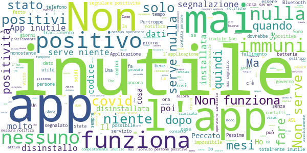

# Immuni
App version ``2.1.1``

Analyzed with [covid-apps-observer](http://github.com/covid-apps-observer) project, version ``0.1``

## App overview
| | |
|-------------------------|-------------------------| 
| **Name**&nbsp;&nbsp;&nbsp;&nbsp;&nbsp;&nbsp;&nbsp;&nbsp;&nbsp;&nbsp;&nbsp;&nbsp;&nbsp;&nbsp;&nbsp;&nbsp;&nbsp;&nbsp;&nbsp;&nbsp;&nbsp;&nbsp;&nbsp;&nbsp;&nbsp;&nbsp;&nbsp;&nbsp;&nbsp;&nbsp;&nbsp;&nbsp;&nbsp;&nbsp;&nbsp;&nbsp;&nbsp;&nbsp;&nbsp;&nbsp;  | Immuni |
| **Unique identifier** | it.ministerodellasalute.immuni |
| **Link to Google Play** | [https://play.google.com/store/apps/details?id=it.ministerodellasalute.immuni](https://play.google.com/store/apps/details?id=it.ministerodellasalute.immuni) |
| **Summary**  | App ufficiale per le notifiche di esposizione in Italia |
| **Privacy policy** | [https://www.immuni.italia.it/app-pn.html](https://www.immuni.italia.it/app-pn.html) |
| **Latest version** | 2.1.1 |
| **Last update** | 2020-11-03 13:55:44 |
| **Recent changes** | Correzione di alcuni bug |
| **Installs**  | 5.000.000+ |
| **Category** | Medicina |
| **First release** | 1 giu 2020 |
| **Size**  | 28M |
| **Supported Android version**  | 6.0 e versioni successive |

### Description
> Immuni è l’app ufficiale per le notifiche di esposizione del governo italiano, sviluppata dal Commissario Straordinario per l’Emergenza COVID-19 in collaborazione con il Ministero della Salute e il Ministero per l’Innovazione Tecnologica e la Digitalizzazione. L’app è sviluppata e rilasciata nel pieno rispetto della protezione dei dati personali dell’utente e della normativa vigente, incluso il decreto-legge del 30 aprile 2020, n. 28.
 Nella lotta all’epidemia di COVID-19, l’app aiuta a notificare gli utenti potenzialmente contagiati il prima possibile, anche quando sono asintomatici. Questi utenti possono poi isolarsi per evitare di contagiare altri, con l’effetto di minimizzare la diffusione del virus e velocizzare il ritorno a una vita normale per la maggior parte della popolazione. Venendo informati tempestivamente, inoltre, gli utenti possono anche contattare il proprio medico di medicina generale, riducendo così il rischio di complicanze.
 Il sistema di notifiche di esposizione di Immuni si basa sulla tecnologia Bluetooth Low Energy, creata per essere particolarmente efficiente in termini di risparmio energetico, e non utilizza alcun tipo di dato di geolocalizzazione, inclusi quelli del GPS. L’app non raccoglie e non è in grado di ottenere alcun dato che identifichi l’utente, quali nome, cognome, data di nascita, indirizzo, numero di telefono o indirizzo email. Immuni riesce quindi a determinare che un contatto fra due utenti è avvenuto, ma non chi siano effettivamente i due utenti o dove si siano incontrati.
 Ecco una lista di alcune delle misure con cui Immuni protegge i dati degli utenti:
 • I dati raccolti sono quelli minimi, strettamente necessari per supportare e migliorare il sistema di notifiche di esposizione.
 • Il codice Bluetooth Low Energy trasmesso dall’app è generato in maniera casuale e non contiene alcuna informazione riguardo allo smartphone dell’utente, tanto meno sull’utente stesso. Inoltre, questo codice cambia svariate volte ogni ora, per tutelare ancora meglio la privacy dell’utente.
 • I dati salvati sullo smartphone sono cifrati.
 • Le connessioni tra l’app e il server sono cifrate.
 • Tutti i dati, siano essi salvati sul dispositivo o sul server, saranno cancellati non appena non saranno più necessari e in ogni caso non oltre il 31 dicembre 2020.
 • È il Ministero della Salute il soggetto che raccoglie i dati e che decide per quali scopi utilizzarli. In ogni caso, i dati verranno usati solo per contenere l’epidemia del COVID-19 e per la ricerca scientifica.
 • I dati sono salvati su server in Italia e gestiti da soggetti pubblici.

 Immuni non fa e non può fare diagnosi. Sulla base dello storico dei contatti con utenti potenzialmente contagiosi, Immuni elabora alcune raccomandazioni su come è necessario comportarsi. Ma l’app non è un dispositivo medico e non può in alcun caso sostituire un medico.
 Immuni è uno strumento importante nella lotta a questa terribile epidemia e ciascun utente ne aumenta l’efficacia complessiva. Per questo consigliamo vivamente di installare l’app, usarla correttamente e incoraggiare parenti e amici a fare lo stesso. Tuttavia, non c’è alcun obbligo di utilizzo. La decisione spetta soltanto all’individuo.

### User interface
The developers of the app provide the following screenshots in the Google play store.
| | | |
|:-------------------------:|:-------------------------:|:-------------------------:|
 |   |   |   | 
 |  

## Development team
In the following we report the main information provided by the development team in the Google play store.

| | |
|-------------------------|-------------------------|
| **Developer**  | Ministero della Salute |
| **Website**  | [https://www.immuni.italia.it/](https://www.immuni.italia.it/) |
| **Email** | cittadini@immuni.italia.it |
| **Physical address**  | - |
| **Other developed apps**  | [https://play.google.com/store/apps/developer?id=Ministero+della+Salute](https://play.google.com/store/apps/developer?id=Ministero+della+Salute) |

## Android support

| | |
|-------------------------|-------------------------|
| **Declared target Android version**  | Android10, version 10 (API level 29) |
| **Effective target Android version**  | Android10, version 10 (API level 29) |
| **Minimum supported Android version**  | Marshmallow, version 6.0 (API level 23) |
| **Maximum target Android version**  | - |

The larger the difference between the minimum and maximum supported Android versions, the better. A larger difference means a wider audience. For example, old phones have a very low Android version, so a high minimum supported Android version means that the app cannot be used by users with old phones, thus leading to accessibility problems. 

## Requested permissions

In the following we report the complete list of the permissions requested by the app. 

| **Permission** | **Protection level** | **Description** | 
|-------------------------|-------------------------|-------------------------|
 **android.permission ACCESS_NETWORK_STATE** | Normal | Allows applications to access information about networks. 
 **android.permission BLUETOOTH** | Normal | Allows applications to connect to paired bluetooth devices. 
 **android.permission FOREGROUND_SERVICE** | Normal | Allows a regular application to use Service.startForeground. 
 **android.permission INTERNET** | Normal | Allows applications to open network sockets. 
 **android.permission RECEIVE_BOOT_COMPLETED** | Normal | Allows an application to receive the Intent.ACTION_BOOT_COMPLETED that is broadcast after the system finishes booting. 
 **android.permission WAKE_LOCK** | Normal | Allows using PowerManager WakeLocks to keep processor from sleeping or screen from dimming. 

## Mentioned servers

| **Server** | **Registrant** | **Registrant country** | **Creation date** | 
|-------------------------|-------------------------|-------------------------|-------------------------|
 | google.com | Google LLC | :us: US | 1997-09-15 04:00:00 |
 | googleapis.com | Google LLC | :us: US | 2005-01-25 17:52:26 |
 | italia.it | Presidenza del Consiglio dei Ministri | :it: IT | 2004-06-03 00:00:00 |

## Security analysis 

Below we report the main security warnings raised by our execution of the [Androwarn](https://github.com/maaaaz/androwarn) security analysis tool.

**Connection interfaces exfiltration**
> - This application reads details about the currently active data network 
> - This application tries to find out if the currently active data network is metered 

**Telephony services abuse**
> - This application makes phone calls 

**Suspicious connection establishment**
> - This application opens a Socket and connects it to the remote address ' returned no addresses for  ; port is out of range' on the 'N/A' port  
> - This application opens a Socket and connects it to the remote address '' on the 'N/A' port  
> - This application opens a Socket and connects it to the remote address 'Ljava/lang/StringBuilder;->toString()Ljava/lang/String;' on the 'N/A' port  
> - This application opens a Socket and connects it to the remote address 'Ljava/net/Proxy;->type()Ljava/net/Proxy$Type;' on the 'N/A' port  
> - This application opens a Socket and connects it to the remote address 'Method sendUrgentData() is not supported.' on the 'N/A' port  
> - This application opens a Socket and connects it to the remote address 'Method setHandshakeTimeout() is not supported.' on the 'N/A' port  
> - This application opens a Socket and connects it to the remote address 'Method setOOBInline() is not supported.' on the 'N/A' port  
> - This application opens a Socket and connects it to the remote address 'Method setSoWriteTimeout() is not supported.' on the 'N/A' port  
> - This application opens a Socket and connects it to the remote address 'Socket closed' on the 'N/A' port  
> - This application opens a Socket and connects it to the remote address 'Socket is closed' on the 'N/A' port  
> - This application opens a Socket and connects it to the remote address 'Socket is closed.' on the 'N/A' port  
> - This application opens a Socket and connects it to the remote address 'Socket is not connected.' on the 'N/A' port  
> - This application opens a Socket and connects it to the remote address 'socket is closed' on the 'N/A' port  
> - This application opens a Socket and connects it to the remote address 'timeout' on the 'N/A' port  

**Code execution**
> - This application loads a native library: 'conscrypt_gmscore_jni' 
> - This application loads a native library: 'conscrypt_jni' 

## User ratings and reviews

Below we provide information about how end users are reacting to the app in terms of ratings and reviews in the Google Play store.

### Ratings

The Immuni app has been installed by more than **5000000** times. At this time, **40100** rated the app and its average score is **2.8611383**. Below we show the distribution of the ratings across the usual star-based rating of Google Play

:star::star::star::star::star:: 14738

:star::star::star::star:: 2666

:star::star::star:: 2764

:star::star:: 2154

:star:: 17778

### Reviews 

#### 5-star reviews

> Io metto 5 stelle perché non mi dà problemi  :date: __2020-12-05 13:35:24__

> Ottima APP.  :date: __2020-12-04 15:46:10__

> Buon  :date: __2020-12-04 10:56:28__

> Eccellente  :date: __2020-12-04 01:12:02__

> Ti dà tranquillità  :date: __2020-12-03 10:36:32__

> Facile da installare .fallo anche tu.  :date: __2020-12-03 08:50:15__

> Devono scaricarla tutti questa app e le Asl devono avere i dati aggiornati in modo da prevenire i contagi e le ondate. La app è perfetta. È il contesto intorno all'app che non funziona.  :date: __2020-12-02 18:40:46__

> Nessun problema di funzionamento, perfettamente operante co Samsung A70 - Peccato che non serve a niente. La disinstallo!  :date: __2020-12-02 12:59:55__

> Buona  :date: __2020-12-02 12:12:10__

> Ok  :date: __2020-12-02 06:58:24__

#### 4-star reviews

> Funziona perfettamente senza essere invasiva. Bisognerebbe aggiungere una Dark mode.  :date: __2020-12-05 14:34:31__

> Non sono incorso ad esperienze brutte ma ritengo che se l'app fosse stata scaricata da tanti scienziati che la denigrano la prevenzione e la diffusione del virus sarebbe stata molto meno violenta.  :date: __2020-12-05 10:46:13__

> Sono stato vicino un positivo Immuni nn mi ha avvertito compagno di lavoro grazie  :date: __2020-12-04 21:57:51__

> Io sono positiva. Come faccio a sapere che davvero verrà comunicata la mia positività? Premetto che sono al terzo tampone da più di 10 giorni senza sintomi.e quindi libera di uscire  :date: __2020-12-04 20:22:11__

> Niente male, app buona.  :date: __2020-12-02 22:11:44__

> Non ho capito se effettivamente funziona bene ho dei forti dubbi  :date: __2020-12-02 16:16:32__

> Si spera che funzioni in 6 mesi di utilizzo mai segnalato nulla. Bene così!!  :date: __2020-12-01 10:52:58__

> Parlatene e chiedete a tutti i possessori di uno smartphone di utilizzarla!!!!  :date: __2020-11-23 09:58:45__

> Non comunica alcun comportamento, alcun rischio, alcun approfondimento sulla malattia. No news good news, si dice. Però non c'è nessun riscontro sull'uso. Speriamo sia utile?!!  :date: __2020-11-22 11:50:31__

> Ma l'applicazione immuni riconoscere se il telefono di una persona sia attivo il bluetooth  :date: __2020-11-22 00:43:33__

#### 3-star reviews

> Oggi 4 dicembre 2020 e' sparito l'elenco dei controlli di esposizione dalle Impostazioni Google>Notifiche di esposizione! Come mai?  :date: __2020-12-04 13:34:37__

> Negativo  :date: __2020-12-03 16:37:31__

> Non viene utilizzata adeguatamente da tutti, vanificando la finalitá stessa dell'app  :date: __2020-12-03 16:17:58__

> In Friuli e precisamente in provincia di Udine l'app non sta più funzionando. È più di un mese che non mi arrivano più le notifiche e anche il simbolo dell'applicazione, quello rosso non compare più. Mi dice attivo ma non ho più il riscontro che ho incontrato tramite bluethoot soggetti che hanno scaricato l'app  :date: __2020-12-03 08:18:40__

> Non mi dà più i resoconti settimanali. Ma è stata dismessa?? Si può avere un'informazione ufficiale?  :date: __2020-12-02 23:16:25__

> Per il supporto tre stelle e solo che occupa troppa memoria  :date: __2020-12-02 15:47:21__

> scusate, ma la premessa per i 14 anni? un ragazzo sotto i 14 non può usare l'app? dovrebbe essere per tutti senza restrinzioni di età.  :date: __2020-12-02 15:03:59__

> voi sapete come si fa per aggiornare questa app?  :date: __2020-12-02 11:41:06__

> Inutile se si disattiva il BT  :date: __2020-12-01 22:00:58__

> Ho istallato L'Ap.. immediatamente , perché ci credevo ,e perché rispetto le regole ,MA ???? I dubbi iniziali sono ancora gli stessi !!! Funziona ? O non Funziona ??  :date: __2020-12-01 19:33:12__

#### 2-star reviews

> Ho fatto 21 gg in ospedale perché contaggiato da coronavirus e nessuno mi ha messo in guardia. Potevo morire senza poter ringraziare il deficente che si è inventato immuni. Devo soltanto ringraziare il Padreterno  :date: __2020-12-05 10:51:41__

> Il Premier Conte Ha Sbagliato Un'Altra Cosa, Così Non Và  :date: __2020-12-04 21:11:18__

> Diventata inutile nel momento in cui è impossibile segnalare positività  :date: __2020-12-04 14:13:53__

> Da più di un mese non mi arriva più nessuna notifica, prima mi arrivava una volta a settimana. Che succede?  :date: __2020-12-04 09:58:53__

> Installata e disintallata varie volte su lg g5 và spesso in crash  :date: __2020-12-04 07:18:10__

> A cosa serve tenerla se in veneto nessuno si preoccupa di caricare i dati dei positivi?  :date: __2020-12-03 23:22:04__

> Da 1 mese e passa non arriva il report  :date: __2020-12-03 16:59:32__

> È una stronzata. Non ho ricevuto nessun messaggio nonostante mia figlia positiva  :date: __2020-12-03 09:19:56__

> App ministeriale:imperfetta e piena di bug. Spesso si pianta, fa fatica ad aprirsi ma soprattutto è il fatto che non possa segnalarmi la positività in autonomia, ma con l'aiuto di un operatore umano (ma pensare ad un servizio automatico di abbinamento codici, no?), con tutti i ritardi del caso, lo rende scadente. Inoltre ho molti controlli fasulli: spesso duplicati e praticamente la gran parte delle segnalazioni totali derivano da quando mia moglie rientra oppure dal vicino del piano di sotto  :date: __2020-12-02 21:10:27__

> A parte l'enorme consumo di batteria, mi trovo con migliaia di contatti in orari in cui sono in casa...a dormire!!!! Non so quanto la manterrò ancora attiva  :date: __2020-12-02 15:24:01__

#### 1-star reviews

> Io e la mia compagna siamo risultati positivi al COVID, ma nessun operatore sanitario ci ha chiesto nulla riguardo l'utilizzo dell'APP. Decisamente inutile così  :date: __2020-12-05 14:50:44__

> Non funziona. Si blocca sempre  :date: __2020-12-05 13:52:12__

> Non ha funzionato quando doveva  :date: __2020-12-05 13:35:38__

> Ottima idea: per chi non capisse come mai non funziona, l'app lavora tramite Bluetooth, non GPS. Perciò tenete il primo acceso ;) Modifica al seguito di ciò che è successo nella mia regione: l'app è stata considerata INUTILE dall'ASL stessa, che si è rifiutata di prendere i codici. Ringraziamo i posti fissi e il sistema degenerato e bucato, tanto chi se ne importa di vecchi e (come me) soggetti immunodepressi  :date: __2020-12-05 13:18:43__

> Consuma batteria ed è inutile  :date: __2020-12-05 12:06:16__

> Il voto non è all'applicazione in sé ma alla chiara problematica di segnalare la positività in tempi immediati e utili  :date: __2020-12-05 12:00:46__

> Scaricata da subito, attiva da sempre, vado per segnalare la positività e la stessa Asl mi dice che non può sbloccare perché l'app non funziona. Trovate una soluzione ad un problema segnalato da mesi. Grazie  :date: __2020-12-05 11:41:19__

> Nessuna notifica dopo essere stato a contatto con persone positive che avevano installato correttamente l'app.  :date: __2020-12-05 05:53:33__

> Ho disinstallato questa app poiché ho appurato che non serve assolutamente a nulla. Appena uscita l'avevo installata ma MAI e poi MAI ho ricevuto una notifica. Buona l'intenzione ma applicata all'italiana... ossia una cialtroneria.  :date: __2020-12-04 23:39:58__

> Ho il dubbio che non dia molto efficace  :date: __2020-12-04 22:36:43__

