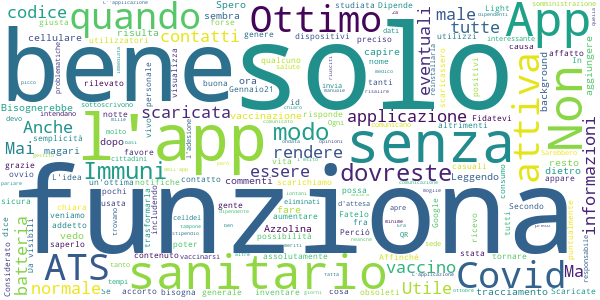

# Immuni
App version ``2.2.0``

Analyzed with [covid-apps-observer](http://github.com/covid-apps-observer) project, version ``0.1``

## App overview
| | |
|-------------------------|-------------------------| 
| **Name**&nbsp;&nbsp;&nbsp;&nbsp;&nbsp;&nbsp;&nbsp;&nbsp;&nbsp;&nbsp;&nbsp;&nbsp;&nbsp;&nbsp;&nbsp;&nbsp;&nbsp;&nbsp;&nbsp;&nbsp;&nbsp;&nbsp;&nbsp;&nbsp;&nbsp;&nbsp;&nbsp;&nbsp;&nbsp;&nbsp;&nbsp;&nbsp;&nbsp;&nbsp;&nbsp;&nbsp;&nbsp;&nbsp;&nbsp;&nbsp;  | Immuni |
| **Unique identifier** | it.ministerodellasalute.immuni |
| **Link to Google Play** | [https://play.google.com/store/apps/details?id=it.ministerodellasalute.immuni](https://play.google.com/store/apps/details?id=it.ministerodellasalute.immuni) |
| **Summary**  | App ufficiale per le notifiche di esposizione in Italia |
| **Privacy policy** | [https://www.immuni.italia.it/app-pn.html](https://www.immuni.italia.it/app-pn.html) |
| **Latest version** | 2.2.0 |
| **Last update** | 2020-12-18 18:22:33 |
| **Recent changes** | - Aggiornamento della UI - Correzione di alcuni bug |
| **Installs**  | 5.000.000+ |
| **Category** | Medicina |
| **First release** | 1 giu 2020 |
| **Size**  | 28M |
| **Supported Android version**  | 6.0 e versioni successive |

### Description
> Immuni è l’app ufficiale per le notifiche di esposizione del governo italiano, sviluppata dal Commissario Straordinario per l’Emergenza COVID-19 in collaborazione con il Ministero della Salute e il Ministero per l’Innovazione Tecnologica e la Digitalizzazione. L’app è sviluppata e rilasciata nel pieno rispetto della protezione dei dati personali dell’utente e della normativa vigente, incluso il decreto-legge del 30 aprile 2020, n. 28.
 Nella lotta all’epidemia di COVID-19, l’app aiuta a notificare gli utenti potenzialmente contagiati il prima possibile, anche quando sono asintomatici. Questi utenti possono poi isolarsi per evitare di contagiare altri, con l’effetto di minimizzare la diffusione del virus e velocizzare il ritorno a una vita normale per la maggior parte della popolazione. Venendo informati tempestivamente, inoltre, gli utenti possono anche contattare il proprio medico di medicina generale, riducendo così il rischio di complicanze.
 Il sistema di notifiche di esposizione di Immuni si basa sulla tecnologia Bluetooth Low Energy, creata per essere particolarmente efficiente in termini di risparmio energetico, e non utilizza alcun tipo di dato di geolocalizzazione, inclusi quelli del GPS. L’app non raccoglie e non è in grado di ottenere alcun dato che identifichi l’utente, quali nome, cognome, data di nascita, indirizzo, numero di telefono o indirizzo email. Immuni riesce quindi a determinare che un contatto fra due utenti è avvenuto, ma non chi siano effettivamente i due utenti o dove si siano incontrati.
 Ecco una lista di alcune delle misure con cui Immuni protegge i dati degli utenti:
 • I dati raccolti sono quelli minimi, strettamente necessari per supportare e migliorare il sistema di notifiche di esposizione.
 • Il codice Bluetooth Low Energy trasmesso dall’app è generato in maniera casuale e non contiene alcuna informazione riguardo allo smartphone dell’utente, tanto meno sull’utente stesso. Inoltre, questo codice cambia svariate volte ogni ora, per tutelare ancora meglio la privacy dell’utente.
 • I dati salvati sullo smartphone sono cifrati.
 • Le connessioni tra l’app e il server sono cifrate.
 • Tutti i dati, siano essi salvati sul dispositivo o sul server, saranno cancellati non appena non saranno più necessari e in ogni caso non oltre il 31 dicembre 2020.
 • È il Ministero della Salute il soggetto che raccoglie i dati e che decide per quali scopi utilizzarli. In ogni caso, i dati verranno usati solo per contenere l’epidemia del COVID-19 e per la ricerca scientifica.
 • I dati sono salvati su server in Italia e gestiti da soggetti pubblici.

 Immuni non fa e non può fare diagnosi. Sulla base dello storico dei contatti con utenti potenzialmente contagiosi, Immuni elabora alcune raccomandazioni su come è necessario comportarsi. Ma l’app non è un dispositivo medico e non può in alcun caso sostituire un medico.
 Immuni è uno strumento importante nella lotta a questa terribile epidemia e ciascun utente ne aumenta l’efficacia complessiva. Per questo consigliamo vivamente di installare l’app, usarla correttamente e incoraggiare parenti e amici a fare lo stesso. Tuttavia, non c’è alcun obbligo di utilizzo. La decisione spetta soltanto all’individuo.

### User interface
The developers of the app provide the following screenshots in the Google play store.
| | | |
|:-------------------------:|:-------------------------:|:-------------------------:|
 |   |   |   | 
 |  

## Development team
In the following we report the main information provided by the development team in the Google play store.

| | |
|-------------------------|-------------------------|
| **Developer**  | Ministero della Salute |
| **Website**  | [https://www.immuni.italia.it/](https://www.immuni.italia.it/) |
| **Email** | cittadini@immuni.italia.it |
| **Physical address**  | - |
| **Other developed apps**  | [https://play.google.com/store/apps/developer?id=Ministero+della+Salute](https://play.google.com/store/apps/developer?id=Ministero+della+Salute) |

## Android support

| | |
|-------------------------|-------------------------|
| **Declared target Android version**  | Android10, version 10 (API level 29) |
| **Effective target Android version**  | Android10, version 10 (API level 29) |
| **Minimum supported Android version**  | Marshmallow, version 6.0 (API level 23) |
| **Maximum target Android version**  | - |

The larger the difference between the minimum and maximum supported Android versions, the better. A larger difference means a wider audience. For example, old phones have a very low Android version, so a high minimum supported Android version means that the app cannot be used by users with old phones, thus leading to accessibility problems. 

## Requested permissions

In the following we report the complete list of the permissions requested by the app. 

| **Permission** | **Protection level** | **Description** | 
|-------------------------|-------------------------|-------------------------|
 **android.permission ACCESS_NETWORK_STATE** | Normal | Allows applications to access information about networks. 
 **android.permission BLUETOOTH** | Normal | Allows applications to connect to paired bluetooth devices. 
 **android.permission FOREGROUND_SERVICE** | Normal | Allows a regular application to use Service.startForeground. 
 **android.permission INTERNET** | Normal | Allows applications to open network sockets. 
 **android.permission RECEIVE_BOOT_COMPLETED** | Normal | Allows an application to receive the Intent.ACTION_BOOT_COMPLETED that is broadcast after the system finishes booting. 
 **android.permission WAKE_LOCK** | Normal | Allows using PowerManager WakeLocks to keep processor from sleeping or screen from dimming. 

## Mentioned servers

| **Server** | **Registrant** | **Registrant country** | **Creation date** | 
|-------------------------|-------------------------|-------------------------|-------------------------|
 | google.com | Google LLC | :us: US | 1997-09-15 04:00:00 |
 | googleapis.com | Google LLC | :us: US | 2005-01-25 17:52:26 |
 | italia.it | Presidenza del Consiglio dei Ministri | :it: IT | 2004-06-03 00:00:00 |

## Security analysis 

Below we report the main security warnings raised by our execution of the [Androwarn](https://github.com/maaaaz/androwarn) security analysis tool.

**Connection interfaces exfiltration**
> - This application reads details about the currently active data network 
> - This application tries to find out if the currently active data network is metered 

**Telephony services abuse**
> - This application makes phone calls 

**Suspicious connection establishment**
> - This application opens a Socket and connects it to the remote address ' returned no addresses for  ; port is out of range' on the 'N/A' port  
> - This application opens a Socket and connects it to the remote address '' on the 'N/A' port  
> - This application opens a Socket and connects it to the remote address 'Ljava/lang/StringBuilder;->toString()Ljava/lang/String;' on the 'N/A' port  
> - This application opens a Socket and connects it to the remote address 'Ljava/net/Proxy;->type()Ljava/net/Proxy$Type;' on the 'N/A' port  
> - This application opens a Socket and connects it to the remote address 'Method sendUrgentData() is not supported.' on the 'N/A' port  
> - This application opens a Socket and connects it to the remote address 'Method setHandshakeTimeout() is not supported.' on the 'N/A' port  
> - This application opens a Socket and connects it to the remote address 'Method setOOBInline() is not supported.' on the 'N/A' port  
> - This application opens a Socket and connects it to the remote address 'Method setSoWriteTimeout() is not supported.' on the 'N/A' port  
> - This application opens a Socket and connects it to the remote address 'Socket closed' on the 'N/A' port  
> - This application opens a Socket and connects it to the remote address 'Socket is closed' on the 'N/A' port  
> - This application opens a Socket and connects it to the remote address 'Socket is closed.' on the 'N/A' port  
> - This application opens a Socket and connects it to the remote address 'Socket is not connected.' on the 'N/A' port  
> - This application opens a Socket and connects it to the remote address 'socket is closed' on the 'N/A' port  
> - This application opens a Socket and connects it to the remote address 'timeout' on the 'N/A' port  

**Code execution**
> - This application loads a native library: 'conscrypt_gmscore_jni' 
> - This application loads a native library: 'conscrypt_jni' 

## User ratings and reviews

Below we provide information about how end users are reacting to the app in terms of ratings and reviews in the Google Play store.

### Ratings

The Immuni app has been installed by more than **5000000** times. At this time, **43553** rated the app and its average score is **2.4124434**. Below we show the distribution of the ratings across the usual star-based rating of Google Play

:star::star::star::star::star:: 11893

:star::star::star::star:: 2276

:star::star::star:: 2276

:star::star:: 2562

:star:: 24546

### Reviews 

#### 5-star reviews

> Ok  :date: __2021-01-03 13:50:49__

> Leggerissima, quasi invisibile...fa il suo dovere e si dimentica di averla.  :date: __2021-01-03 11:14:49__

> Da quando ho installato l'applicazione ap non ho avuto mai nessun avviso  :date: __2021-01-03 11:08:18__

> Va bene  :date: __2021-01-02 07:09:40__

> Molto semplice ma efficace Importantissima  :date: __2021-01-02 01:27:07__

> Fact: se sei boomer non capisci cosa sia e metti 0 stelle a prescindere ;)  :date: __2021-01-01 19:39:18__

> Ho aderito, in modo che sia una sicurezza per me e per gli altri. Lo consulto più volte al giorno.  :date: __2021-01-01 17:03:35__

> L'App è come il vaccino. Più la usiamo in tanti, Più ci proteggiamo tutti  :date: __2021-01-01 12:38:25__

> Un ottimo prodotto.  :date: __2020-12-31 21:05:23__

> Ottimo  :date: __2020-12-31 19:16:33__

#### 4-star reviews

> Bisognerebbe rendere più immediata la comunicazione del codice generato dall'app all'operatore sanitario, magari indicando anche come fare per chi magari non lo sa.  :date: __2020-12-29 15:57:31__

> Spero che vada tutto bene la vaccinazione contro il covid 19  :date: __2020-12-28 21:22:46__

> Io...Voglio la Azzolina,daTeMi Lucia AZzOLINA...  :date: __2020-12-28 13:42:30__

> Ottimo gameplay! Grafica impressionante L'unico problema è che non riesco a capire come si fa per trovare una cura all'ultimo boss,quello chiamato Corona Virus Per il resto tutto ok  :date: __2020-12-26 20:47:43__

> 22-12-2020 ora la app risulta sempre attiva. Non pesa sulla batteria o sulle prestazioni del cellulare. Precedente: Anche dopo l'ultimo aggiornamento (adesso risulta la versione v.2.1.1) su cellulare Honor ha smesso di risultare attiva in background, anche sembra funzionare (nell'elenco delle verifiche vedo date e orari recenti) Si potrebbe aggiungere una sorta di icona nella barra in alto del cel per capire quando è attiva e quando no?  :date: __2020-12-22 15:52:00__

> Saranno minimo due mesi che non arriva nessun messaggio...  :date: __2020-12-22 15:47:22__

> Scaricata, funziona ma spero di non usarla mai  :date: __2020-12-22 10:04:47__

> Leggendo i commenti vedo che tutti quelli che hanno scaricato questa App si sono presi il Covid. Mi sorge spontaneo il dubbio: ma sono commenti sinceri o il solito trash di negazionisti, terrapiattisti, sovranisti e compagnia bella. Dal tono sembra proprio di sì.  :date: __2020-12-21 07:49:49__

> Ottimo l'inserimento per il tracciamento estero. Non nascondiamoci dietro la privacy.  :date: __2020-12-20 16:58:36__

> 5 stelle perché ve le meritate. È difficile stare dietro a tutte le critiche e i complottismi. UPDATE: L'app crasha all'avvio... Deduco che non stia funzionando nemmeno il sistema di tracking. Dovreste risolvere al più presto  :date: __2020-12-19 23:04:09__

#### 3-star reviews

> Perché non utilizzare quest'app. per prenotare la vaccinazione anti covid ?  :date: __2020-12-30 12:30:26__

> Ho letto le recensioni di altre persone che hanno riscontrato non pochi problemi....peccato veramente perché sembrava un App valida di aiuto!!! Io ci speravo in questa App, peccato che non funziona come dovrebbe e forse per questo motivo non ha avuto il suo dovuto riscontro nella popolazione!  :date: __2020-12-30 12:03:46__

> Nessuno  :date: __2020-12-30 07:48:50__

> Ma funziona o no questa app? Prima ricevevo gli aggiornamenti adesso 0 comunicazioni🤔  :date: __2020-12-29 14:09:19__

> Cretini voi e al fatto che credete al Covid. Zero casi di influenza in sto periodo, ma tutti Covid. Cretini voi che credete a ste cose, quando hanno mascherata influenza, raffreddori, bronchiti, tutti malanni di stagione, con la parola COVID.  :date: __2020-12-27 20:18:48__

> Nessuna notizia mai solo fortuna?  :date: __2020-12-25 19:49:30__

> In teoria no. Ho ancora incontrato persone con covid  :date: __2020-12-25 17:11:17__

> La app merita anche 5 stelle, lo dico onestamente.. ma la gestione è un po' deficitaria, soprattutto perché (politicamente) l'hanno disincentivata in modo ignorante. Se si fosse fatto fronte comune e se fosse stato di più per far capire alle persone l'utilità, probabilmente era il miglior strumento applicabile.. app sprecata per lo più per colpa degli italioti.  :date: __2020-12-25 03:35:02__

> Non ho la minima idea di come funziona. Aspetto indicazioni, grazie  :date: __2020-12-24 17:09:18__

> Pure con l'aggiornamento più recente, la app si blocca quando si clicca sull'opzione relativa ai Paesi europei in cui è attiva l'interoperabilità su Asus ZenFone 3 Deluxe.  :date: __2020-12-24 15:39:29__

#### 2-star reviews

> Non capisco perché il ministero non mette obbligatoria l'app. Come nei paesi orientali. La Corea del Sud è stata la prima in assoluto ad usare un app del genere. All'inizio erano i secondi al mondo per contaggio. Dato che era praticamente obbligatoria, hanno individuato i contaggi ad una velocità assurda. Questa app sarebbe una delle armi più potenti per contrastare il virus  :date: __2021-01-02 20:54:25__

> Quest' app di per sé sarebbe fatta bene. Il suo utilizzo sarebbe essenziale per contrastare l'epidemia così come è stato fatto nei paesi orientali. Peccato che per il cosiddetto rispetto della privacy e della libertà di cui tutti si riempiono la bocca, questo sistema non possa tecnicamente funzionare. Bene allora, nel nome della Libertà godiamoci un'altra ondata di epidemia morti e chiusure! Alé!!!  :date: __2021-01-01 18:52:50__

> Avevo riposto tanta fiducia in questa app. Ho incontrato svariate persone poi risultate positive e nessuna segnalazione, pare strano... e poi non si capisce se funziona, non c'è modo di fare un test. Secondo me non funziona!  :date: __2021-01-01 16:39:54__

> Molto deluso, il motivo perché molta gente con cui ho parlato della mia città nn ha preso in considerazione di scaricare l'applicazione come ho fatto io, allora come facciamo a tenere sotto controllo la pandemia?  :date: __2021-01-01 10:12:04__

> Non ci ho capito un'H...  :date: __2020-12-31 22:29:44__

> Nulla  :date: __2020-12-31 15:11:12__

> Lavorando nel reparto covid, pronto soccorso covid (e non) e ambulatori... al momento nessuna segnalazione di contatto con positiviti dopo 3 mesi. Quindi per quanto mi riguarda ho avuto esposizione a più di cento pazienti covid e segnalazioni 0. Purtroppo credo che ci siano aspetti significativi e cruciali da migliorare. Spero di contribuire alla crescita della app.  :date: __2020-12-30 09:18:17__

> Ottima se funzionasse! Installata da subito, ma credo che non segnalerebbe nulla nemmeno se testata all'interno di un ospedale covid 😬😬😬  :date: __2020-12-30 00:02:22__

> L'applicazione sarebbe utile. È da rivedere il flusso di segnalazione della positività al Covid 19 perché al momento la vera falla è quella.  :date: __2020-12-29 23:18:39__

> L'app funziona.. ..ma dovrebbero aggiungere sul database tutti i positivi.. Non lo fanno..  :date: __2020-12-29 22:26:14__

#### 1-star reviews

> Purtroppo non serve a niente! Gestione pessima da parte del sistema. Io sono risultato positivo al tampone e nessuno mi ha contattato per dare i miei riferimenti e attivare il servizio di avviso ai miei contatti. Adesso la disinstallo.....mi piacerebbe sapere quanto ci è costata questa pagliacciata.  :date: __2021-01-03 09:50:07__

> Solita italianata. Basta leggere le recensioni. Questa app è la perfetta immagine dei nostri politici  :date: __2021-01-03 09:46:50__

> Come idea per il tracciamento è ottima se solo fosse più facile segnalare la positività! La Asl mi ha contattata,per attivarla, il tredicesimo giorno di isolamento, così è davvero inutile.  :date: __2021-01-03 09:26:22__

> Mia moglie è risultata positiva ha fatto la segnalazione come descritto nel app,ma dopo una settimana non e cambiato nulla né a le tantomeno a me non ha avvisato neanche una volta di essere passato vicino un positivo. Ho scaricato immuni da quando è uscita l'app credendo k potesse funzionare ma così non è stato. Disinstallo subito perché tanto non funziona.  :date: __2021-01-03 08:51:43__

> Installata appena uscita ritenendola un ottimo strumento. Ma ora, da positivo, mi rendo conto che l'apparato organizzativo dietro il suo funzionamento è, dopo mesi, ancora del tutto inadeguato. Così dopo vari tentativi, prima contattando il numero verde dell'app (risposta: il Lazio non rientra tra le 5 regioni pilota e non possono procedere loro con la segnalazione) poi tentando contattare invano la mia Asl, non sono riuscito e non trovo modo di segnalare la mia positività. Un'occasione persa.  :date: __2021-01-03 08:24:22__

> Servizio inutile  :date: __2021-01-03 08:10:49__

> Lavoro in ospedale e sono stato a contatto con numerosi pazienti e colleghi/personale risultati positivi al tampone, ma mai una segnalazione!  :date: __2021-01-03 07:26:39__

> Purtroppo è un app inutile, creata con i migliori propositi si è rivelata la solita porcheria all'italiana..soldi dei contribuenti buttati via! Magari inizierà a funzionare quando il covid sarà solo un ricordo. Che vergogna!  :date: __2021-01-03 07:20:34__

> È impossibile segnalare la propria positività  :date: __2021-01-03 03:07:15__

> Sono risultato positivo (25 ottobre), ma a sabato (31 ottobre) manco l'ombra di un contatto telefonico. *Aggiornamento al 2 dicembre: mai ricevuto alcun contatto. *Aggiornamento al 2 gennaio: ancora nulla.  :date: __2021-01-03 01:23:06__

