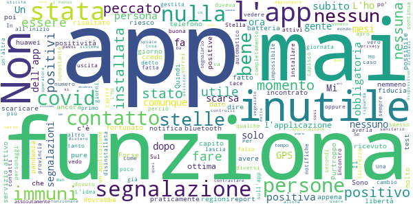

# Immuni
App version ``2.2.0``

Analyzed with [covid-apps-observer](http://github.com/covid-apps-observer) project, version ``0.1``

## App overview
| | |
|-------------------------|-------------------------| 
| **Name**&nbsp;&nbsp;&nbsp;&nbsp;&nbsp;&nbsp;&nbsp;&nbsp;&nbsp;&nbsp;&nbsp;&nbsp;&nbsp;&nbsp;&nbsp;&nbsp;&nbsp;&nbsp;&nbsp;&nbsp;&nbsp;&nbsp;&nbsp;&nbsp;&nbsp;&nbsp;&nbsp;&nbsp;&nbsp;&nbsp;&nbsp;&nbsp;&nbsp;&nbsp;&nbsp;&nbsp;&nbsp;&nbsp;&nbsp;&nbsp;  | Immuni |
| **Unique identifier** | it.ministerodellasalute.immuni |
| **Link to Google Play** | [https://play.google.com/store/apps/details?id=it.ministerodellasalute.immuni](https://play.google.com/store/apps/details?id=it.ministerodellasalute.immuni) |
| **Summary**  | App ufficiale per le notifiche di esposizione in Italia |
| **Privacy policy** | [https://www.immuni.italia.it/app-pn.html](https://www.immuni.italia.it/app-pn.html) |
| **Latest version** | 2.2.0 |
| **Last update** | 2020-12-18 18:22:33 |
| **Recent changes** | - Aggiornamento della UI - Correzione di alcuni bug |
| **Installs**  | 5.000.000+ |
| **Category** | Medicina |
| **First release** | 1 giu 2020 |
| **Size**  | 28M |
| **Supported Android version**  | 6.0 e versioni successive |

### Description
> Immuni è l’app ufficiale per le notifiche di esposizione del governo italiano, sviluppata dal Commissario Straordinario per l’Emergenza COVID-19 in collaborazione con il Ministero della Salute e il Ministero per l’Innovazione Tecnologica e la Digitalizzazione. L’app è sviluppata e rilasciata nel pieno rispetto della protezione dei dati personali dell’utente e della normativa vigente, incluso il decreto-legge del 30 aprile 2020, n. 28.
 Nella lotta all’epidemia di COVID-19, l’app aiuta a notificare gli utenti potenzialmente contagiati il prima possibile, anche quando sono asintomatici. Questi utenti possono poi isolarsi per evitare di contagiare altri, con l’effetto di minimizzare la diffusione del virus e velocizzare il ritorno a una vita normale per la maggior parte della popolazione. Venendo informati tempestivamente, inoltre, gli utenti possono anche contattare il proprio medico di medicina generale, riducendo così il rischio di complicanze.
 Il sistema di notifiche di esposizione di Immuni si basa sulla tecnologia Bluetooth Low Energy, creata per essere particolarmente efficiente in termini di risparmio energetico, e non utilizza alcun tipo di dato di geolocalizzazione, inclusi quelli del GPS. L’app non raccoglie e non è in grado di ottenere alcun dato che identifichi l’utente, quali nome, cognome, data di nascita, indirizzo, numero di telefono o indirizzo email. Immuni riesce quindi a determinare che un contatto fra due utenti è avvenuto, ma non chi siano effettivamente i due utenti o dove si siano incontrati.
 Ecco una lista di alcune delle misure con cui Immuni protegge i dati degli utenti:
 • I dati raccolti sono quelli minimi, strettamente necessari per supportare e migliorare il sistema di notifiche di esposizione.
 • Il codice Bluetooth Low Energy trasmesso dall’app è generato in maniera casuale e non contiene alcuna informazione riguardo allo smartphone dell’utente, tanto meno sull’utente stesso. Inoltre, questo codice cambia svariate volte ogni ora, per tutelare ancora meglio la privacy dell’utente.
 • I dati salvati sullo smartphone sono cifrati.
 • Le connessioni tra l’app e il server sono cifrate.
 • Tutti i dati, siano essi salvati sul dispositivo o sul server, saranno cancellati non appena non saranno più necessari e in ogni caso non oltre il 31 dicembre 2020.
 • È il Ministero della Salute il soggetto che raccoglie i dati e che decide per quali scopi utilizzarli. In ogni caso, i dati verranno usati solo per contenere l’epidemia del COVID-19 e per la ricerca scientifica.
 • I dati sono salvati su server in Italia e gestiti da soggetti pubblici.

 Immuni non fa e non può fare diagnosi. Sulla base dello storico dei contatti con utenti potenzialmente contagiosi, Immuni elabora alcune raccomandazioni su come è necessario comportarsi. Ma l’app non è un dispositivo medico e non può in alcun caso sostituire un medico.
 Immuni è uno strumento importante nella lotta a questa terribile epidemia e ciascun utente ne aumenta l’efficacia complessiva. Per questo consigliamo vivamente di installare l’app, usarla correttamente e incoraggiare parenti e amici a fare lo stesso. Tuttavia, non c’è alcun obbligo di utilizzo. La decisione spetta soltanto all’individuo.

### User interface
The developers of the app provide the following screenshots in the Google play store.
| | | |
|:-------------------------:|:-------------------------:|:-------------------------:|
 |   |   |   | 
 |  

## Development team
In the following we report the main information provided by the development team in the Google play store.

| | |
|-------------------------|-------------------------|
| **Developer**  | Ministero della Salute |
| **Website**  | [https://www.immuni.italia.it/](https://www.immuni.italia.it/) |
| **Email** | cittadini@immuni.italia.it |
| **Physical address**  | - |
| **Other developed apps**  | [https://play.google.com/store/apps/developer?id=Ministero+della+Salute](https://play.google.com/store/apps/developer?id=Ministero+della+Salute) |

## Android support

| | |
|-------------------------|-------------------------|
| **Declared target Android version**  | Android10, version 10 (API level 29) |
| **Effective target Android version**  | Android10, version 10 (API level 29) |
| **Minimum supported Android version**  | Marshmallow, version 6.0 (API level 23) |
| **Maximum target Android version**  | - |

The larger the difference between the minimum and maximum supported Android versions, the better. A larger difference means a wider audience. For example, old phones have a very low Android version, so a high minimum supported Android version means that the app cannot be used by users with old phones, thus leading to accessibility problems. 

## Requested permissions

In the following we report the complete list of the permissions requested by the app. 

| **Permission** | **Protection level** | **Description** | 
|-------------------------|-------------------------|-------------------------|
 **android.permission ACCESS_NETWORK_STATE** | Normal | Allows applications to access information about networks. 
 **android.permission BLUETOOTH** | Normal | Allows applications to connect to paired bluetooth devices. 
 **android.permission FOREGROUND_SERVICE** | Normal | Allows a regular application to use Service.startForeground. 
 **android.permission INTERNET** | Normal | Allows applications to open network sockets. 
 **android.permission RECEIVE_BOOT_COMPLETED** | Normal | Allows an application to receive the Intent.ACTION_BOOT_COMPLETED that is broadcast after the system finishes booting. 
 **android.permission WAKE_LOCK** | Normal | Allows using PowerManager WakeLocks to keep processor from sleeping or screen from dimming. 

## Mentioned servers

| **Server** | **Registrant** | **Registrant country** | **Creation date** | 
|-------------------------|-------------------------|-------------------------|-------------------------|
 | google.com | Google LLC | :us: US | 1997-09-15 04:00:00 |
 | googleapis.com | Google LLC | :us: US | 2005-01-25 17:52:26 |
 | italia.it | Presidenza del Consiglio dei Ministri | :it: IT | 2004-06-03 00:00:00 |

## Security analysis 

Below we report the main security warnings raised by our execution of the [Androwarn](https://github.com/maaaaz/androwarn) security analysis tool.

**Connection interfaces exfiltration**
> - This application reads details about the currently active data network 
> - This application tries to find out if the currently active data network is metered 

**Telephony services abuse**
> - This application makes phone calls 

**Suspicious connection establishment**
> - This application opens a Socket and connects it to the remote address ' returned no addresses for  ; port is out of range' on the 'N/A' port  
> - This application opens a Socket and connects it to the remote address '' on the 'N/A' port  
> - This application opens a Socket and connects it to the remote address 'Ljava/lang/StringBuilder;->toString()Ljava/lang/String;' on the 'N/A' port  
> - This application opens a Socket and connects it to the remote address 'Ljava/net/Proxy;->type()Ljava/net/Proxy$Type;' on the 'N/A' port  
> - This application opens a Socket and connects it to the remote address 'Method sendUrgentData() is not supported.' on the 'N/A' port  
> - This application opens a Socket and connects it to the remote address 'Method setHandshakeTimeout() is not supported.' on the 'N/A' port  
> - This application opens a Socket and connects it to the remote address 'Method setOOBInline() is not supported.' on the 'N/A' port  
> - This application opens a Socket and connects it to the remote address 'Method setSoWriteTimeout() is not supported.' on the 'N/A' port  
> - This application opens a Socket and connects it to the remote address 'Socket closed' on the 'N/A' port  
> - This application opens a Socket and connects it to the remote address 'Socket is closed' on the 'N/A' port  
> - This application opens a Socket and connects it to the remote address 'Socket is closed.' on the 'N/A' port  
> - This application opens a Socket and connects it to the remote address 'Socket is not connected.' on the 'N/A' port  
> - This application opens a Socket and connects it to the remote address 'socket is closed' on the 'N/A' port  
> - This application opens a Socket and connects it to the remote address 'timeout' on the 'N/A' port  

**Code execution**
> - This application loads a native library: 'conscrypt_gmscore_jni' 
> - This application loads a native library: 'conscrypt_jni' 

## User ratings and reviews

Below we provide information about how end users are reacting to the app in terms of ratings and reviews in the Google Play store.

### Ratings

The Immuni app has been installed by more than **5000000** times. At this time, **43553** rated the app and its average score is **2.4124434**. Below we show the distribution of the ratings across the usual star-based rating of Google Play

:star::star::star::star::star:: 11893

:star::star::star::star:: 2276

:star::star::star:: 2276

:star::star:: 2562

:star:: 24546

### Reviews 

#### 5-star reviews

> IMMUNI OTTIMA APPLICAZIONE  :date: __2021-01-16 11:44:11__

> E utile  :date: __2021-01-16 11:35:20__

> Vi do 5 stelle per pietà. Dire che fate schifo e che i nostri soldi vengono buttati in questo modo vergognoso è inutile. Vergogna. E chiedete scusa. Un'azienda privata fallirebbe dopo due giorni fosse come voi. Vergogna.  :date: __2021-01-16 10:36:17__

> Indispensabile  :date: __2021-01-16 10:26:36__

> Ha funzionato?  :date: __2021-01-15 21:36:08__

> L unione fa la forza  :date: __2021-01-15 07:23:03__

> L 'App Immuni funziona perfettamente! La consiglio proprio a tutti di installarla.  :date: __2021-01-14 23:52:33__

> Leggo tante recensioni negative, e sono d'accordo con la maggior parte delle cose dette in queste recensioni. Io vado contro corrente e metto 5 stelle, l'app funziona, è stata sviluppata con tutti i riguardi del caso e con un occhio di riguardo alla sicurezza e alla privacy. Se l'apparato che ci sta dietro non funziona, non è colpa dell'app o degli sviluppatori. Provate a pensarci prima di rovinare completamente la reputazione di un app e indirettamente dell'azienda o degli sviluppatori  :date: __2021-01-14 10:06:27__

> Ottima  :date: __2021-01-14 05:42:25__

> Dovete scaricarla se volete uscire da questa situazione  :date: __2021-01-13 10:50:21__

#### 4-star reviews

> Secondo me dovreste inventare "Immuni Light" per i dispositivi più obsoleti, in modo da aumentare la possibilità che la gente utilizzi questa applicazione. L'idea non è affatto male, funziona bene, solo che bisogna che lo scarichiamo tutti! Affinché si possa tornare alla vita normale! Perciò, per favore, a nome di tanti utilizzatori. Fatelo per una giusta causa. Scaricate l'app Immuni, è al 100% sicura! Fidatevi!  :date: __2021-01-16 03:47:11__

> In generale, appare un'ottima applicazione studiata bene nella sua semplicità. Anche per il consumo contenuto della batteria . Ma una cosa non mi è assolutamente chiara: in genere non ricevo notifiche visibili ma, mi sono accorto che puntualmente, fra le 1.30 e le 3.00 di notte mi dice che ha rilevato dei contatti.. preciso che vivo da solo.. Da Gennaio21 non mi visualizza più le id casuali..è normale? Dipende da Google, forse? Se qualcuno risponde,grazie.  :date: __2021-01-13 19:56:48__

> Funziona bene  :date: __2021-01-13 14:04:13__

> Utile se tutti la scaricassero, altrimenti ovvio che veniamo in contatto con positivi senza saperlo!  :date: __2021-01-12 08:30:56__

> Mai usata!  :date: __2021-01-09 17:31:10__

> Considerato che l'app è stata scaricata da pochi per poter essere utile, perché non trasformarla includendo tutte le informazioni da rendere al personale sanitario addetto alla somministrazione del vaccino? I cittadini che intendano vaccinarsi, trovano le informazioni sul vaccino, comunicano eventuali problematiche di salute, sottoscrivono l'adesione, l'app invia con codice QR tutti i dati al celldel responsabile sanitario in sede di vaccinazione. Sarebbero eliminati i tempi d'attesa....  :date: __2021-01-07 23:55:42__

> Non male  :date: __2021-01-07 09:06:24__

> App è molto interessante  :date: __2021-01-06 11:35:46__

> Ogni tanto non si apre e devo reinstallarla  :date: __2021-01-06 11:35:10__

> L''applicazione è ben fatta. L'applicazione, però. Solo quella! Quando mia moglie ha preso il Covid siamo riusciti a parlare con ATS solo 16 giorni dopo l'esito del tampone (comunicato dal medico). I dipendenti ATS non solo non hanno gestito il tracciamento dell'app, ma neanche le basi minime per risalire ad eventuali contatti in modo manuale. Era ottobre 2020, ancora lontani dal picco della 2a ondata. Leggendo le altre opinioni mi è chiaro come solo 1 dipendente ATS su mille meriti lo stipendio  :date: __2021-01-04 05:12:19__

#### 3-star reviews

> Sarebbe utile avere nella home la segnalazione del colore della propria regione.  :date: __2021-01-16 09:51:33__

> L'app é fatta bene, però non ha senso di esistere. Da quel che so, non tutte le regioni hanno i sistemi per segnalare i postivi. La mi regione ha i mezzi, ma se ne frega. Un mio amico é positivo e la sua Asl si é disinteressata a comunicare il codice, anche se lui ha insistito. Quindi io so di essere stato in contatto con un positivo per passaparola. Che senso ha quest'app, allora? Sto pensando di disinstallarla, così é inutile.  :date: __2021-01-10 23:22:36__

> Utile!  :date: __2021-01-10 22:21:30__

> Fa quello che deve...con tutti i limiti tecnologici del caso. Purtroppo è stata scaricata da troppe poche persone e quindi la gestione logistica che l'avrebbe fatta funzionare al meglio non è stata neanche attivata  :date: __2021-01-10 09:49:26__

> Tecnicamente inutile, - Dato che non è obbligatoria non tutti la scaricano - se risulti positivo devi personalmente chiamare l'ospedale e perché ti diano il controcodice di segnalazione positività (se ti va bene un'ora di tempo) - Im sostanza, dato che si tratta di salute pubblica: - immuni dovrebbe essere obbligatoria - quando fai il tampone dovrebbero inserire direttamente la tua positività.  :date: __2021-01-10 09:02:02__

> Mancano i download totali, non solo Google, e se il monitoraggio è avvenuto, con una percentuale certificata di utilità ai fini Covid.  :date: __2021-01-09 10:44:58__

> Non é abbastanza sviluppata  :date: __2021-01-08 21:26:44__

> L'App è fatta benissimo ma è inutile scaricarla perché tanto la ASL( a cui devi comunicare il codice una volta nota la positività) non ti chiama  :date: __2021-01-07 22:29:03__

> non fare  :date: __2021-01-03 19:57:55__

> Perché non utilizzare quest'app. per prenotare la vaccinazione anti covid ?  :date: __2020-12-30 12:30:26__

#### 2-star reviews

> le notifiche non mi arrivano più da mesi...come mai?  :date: __2021-01-16 13:42:39__

> Sul cambio delle dovrebbe essere in automatico nessuno si ricorda di cambiare la provincia in caso che sia confinante con tre province linitrofe c'è già il GPS con questo dovrebbe in automatico fare il cambio della provincia scarsa come in questo che non è poi da poco. .!!!  :date: __2021-01-15 17:35:43__

> Un gameplay pessimo vorrei dire,do comunque 2 stelle perché si vede che si sono impegnati con la grafica,i personaggi spesso si bloccano e non si riesce andare avanti dopo il lv 6 senza pagare  :date: __2021-01-15 09:33:45__

> Vorrei sapere ma li segnala i contatti?.bhoo.  :date: __2021-01-15 08:48:59__

> Forse si doveva dare un po' di più fiducia alla gente e raccogliere le segnalazioni direttamente dal singolo utente positivo. Invece il metodo di segnalazione rende totalmente inutile ed inefficace l'app. Peccato. L'ho disinstallata, tanto nemmeno gli ospedali danno indicazione di fare la segnalazione...che mentalità arretrata che ha sto paese.  :date: __2021-01-14 19:34:54__

> L'idea anche buona peccato che é impossibile segnalare la positività. Dopo varie telefonate dove nessuno era responsabile dell'inserimento del codice o sapere come fare, ho lasciato perdere. Un vero peccato perché sarebbe stata un'applicazione utile.  :date: __2021-01-14 17:10:19__

> Una protezione in più , veloce da scaricare ed installare. Aggiornamento: o è inutile o sono stato molto fortunato..  :date: __2021-01-13 21:36:04__

> App fatta bene ma a metà. Lasciare la libertà ai positivi di decidere se caricare o meno i propri codici sull'app è una scelta per quanto corretta comunque sbagliata a priori. Per come la vedo io ora come ora è completamente inutile.  :date: __2021-01-13 20:42:56__

> Non capisco perché, sul mio Xiaomi Redmi, debba essere obbligatorio, oltre (ovviamente) il bluetooth, anche la posizione GPS. GPS che, da quanto sapevo, non era necessario per il funzionamento corretto dell'app. In più, con bluetooth e GPS attivi contemporaneamente, si scarica la batteria in 2 secondi.  :date: __2021-01-12 23:38:30__

> L'ho installata il primo giorno che è uscita l'app, da li ho fatto tantissimi tamponi e quarantene per contatti covid, ho tutta la famiglia positiva e sto aspettando anche il mio risultato, apro l'app e continua a dirmi "il servizio è attivo" misà che non funziona bene eh  :date: __2021-01-11 08:38:57__

#### 1-star reviews

> L' app in sé meriterebbe anche 5 stelle poiché è sviluppata correttamente, ma poiché è dato il Ministero come suo sviluppatore, questi può anche rispondere del sistema intero intorno all'app ed essere valutato di conseguenza. Comunicazione infima quindi utenza bassissima, ASL inefficaci per il tracciamento. Tutto ciò rende una app potenzialmente utilissima in questa emergenza un mero fardello che impegna batteria e memoria sullo smartphone. Italians do it better (cit.)  :date: __2021-01-16 15:22:46__

> Aggiornamento: ora vuole il GPS che mi drena la batteria. Mi sa che la spengo finché torna al solo Bluetooth. L'app fornisce un report una volta alla settimana, ma se lo chiudo lo perdo. Vorrei poter accedere alle mie statistiche quando mi pare. Tra l'altro le informazioni non sono chiare. Io vorrei sapere, oltre a ovviamente l'esposizione al contagio: quanti immuni ho incrociato in settimana? Al giorno? Magari con un grafico. Renderebbe l'app più divertente e interessante.  :date: __2021-01-16 13:52:58__

> Penoso!!!! Tutto qui.  :date: __2021-01-16 11:53:49__

> Vergognoso. Immagino quanto si sia speso per sviluppare questa app....praticamente inutile e inutilizzata e di cui non sembra importare nulla a chi ci governa...  :date: __2021-01-16 10:09:06__

> Spero faccia bene il suo dovere.  :date: __2021-01-16 08:47:00__

> Sparite tutte le notifiche e non sono l'unica.  :date: __2021-01-16 07:09:08__

> Non ho mai avuto nessuna segnalazione di avvenuto contatto è impossibile  :date: __2021-01-16 06:55:28__

> Avevo creduto in questa app. Ma si è rivelata l'ennesimo flop dell'Informatica di Stato. Sono positivo al COVID ma a mia domanda sia all'operatore del tampone che al numero verde regionale mi è stato risposto che non sanno come segnalare la mia positività in Immuni. App progettata male e gestita peggio. Per non dire che rileva solo telefoni che siano a meno di due metri per più di 15 minuti: praticamente solo mia moglie. Disinstallata. Si sentiva proprio il bisogno di questa ennesima figuraccia.  :date: __2021-01-16 02:33:05__

> Soldi dei cittadini buttati. Prima di mettere su un'applicazione del genere bisogna assicurarsi che dietro ci sia un help desk che la gestisca (in questo caso l'inserimento positivi). Sogei e compagnia dovrebbero aggiornarsi su come si fanno le cose (ed assumere gente giovane e sveglia)  :date: __2021-01-16 01:51:27__

> Installata da subito. Tutto ad un tratto quest'estate ogni 15 gg per un paio di mesi mi arrivavano notifiche con orari sempre notturni, quindi i miei famigliari mai stati positivi. Ora il nulla.... Come mai????? Io nn la disinstallo ma è una c----a pazzesca!  :date: __2021-01-15 21:29:36__

