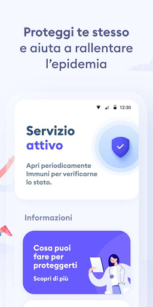
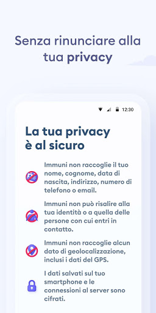
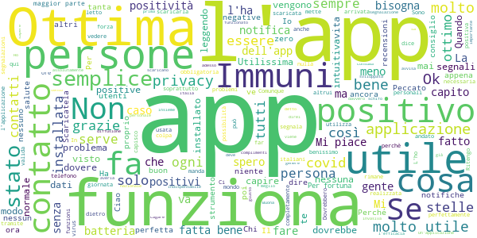
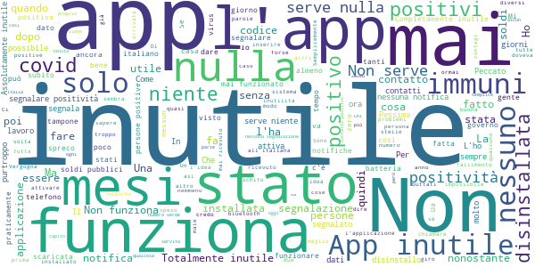

# Immuni
App version ``2.2.1``

Analyzed with [covid-apps-observer](http://github.com/covid-apps-observer) project, version ``0.1``

## App overview
| | |
|-------------------------|-------------------------| 
| **Name**&nbsp;&nbsp;&nbsp;&nbsp;&nbsp;&nbsp;&nbsp;&nbsp;&nbsp;&nbsp;&nbsp;&nbsp;&nbsp;&nbsp;&nbsp;&nbsp;&nbsp;&nbsp;&nbsp;&nbsp;&nbsp;&nbsp;&nbsp;&nbsp;&nbsp;&nbsp;&nbsp;&nbsp;&nbsp;&nbsp;&nbsp;&nbsp;&nbsp;&nbsp;&nbsp;&nbsp;&nbsp;&nbsp;&nbsp;&nbsp;  | Immuni |
| **Unique identifier** | it.ministerodellasalute.immuni |
| **Link to Google Play** | [https://play.google.com/store/apps/details?id=it.ministerodellasalute.immuni](https://play.google.com/store/apps/details?id=it.ministerodellasalute.immuni) |
| **Summary**  | App ufficiale per le notifiche di esposizione in Italia |
| **Privacy policy** | [https://www.immuni.italia.it/app-pn.html](https://www.immuni.italia.it/app-pn.html) |
| **Latest version** | 2.2.1 |
| **Last update** | 2021-01-28 17:19:11 |
| **Recent changes** | Aggiornamento testi |
| **Installs**  | 5.000.000+ |
| **Category** | Medicina |
| **First release** | 1 giu 2020 |
| **Size**  | 28M |
| **Supported Android version**  | 6.0 e versioni successive |

### Description
> Immuni è l’app ufficiale per le notifiche di esposizione del governo italiano, sviluppata dal Commissario Straordinario per l’Emergenza COVID-19 in collaborazione con il Ministero della Salute e il Ministero per l’Innovazione Tecnologica e la Digitalizzazione. L’app è sviluppata e rilasciata nel pieno rispetto della protezione dei dati personali dell’utente e della normativa vigente, incluso il decreto-legge del 30 aprile 2020, n. 28.
 Nella lotta all’epidemia di COVID-19, l’app aiuta a notificare gli utenti potenzialmente contagiati il prima possibile, anche quando sono asintomatici. Questi utenti possono poi isolarsi per evitare di contagiare altri, con l’effetto di minimizzare la diffusione del virus e velocizzare il ritorno a una vita normale per la maggior parte della popolazione. Venendo informati tempestivamente, inoltre, gli utenti possono anche contattare il proprio medico di medicina generale, riducendo così il rischio di complicanze.
 Il sistema di notifiche di esposizione di Immuni si basa sulla tecnologia Bluetooth Low Energy, creata per essere particolarmente efficiente in termini di risparmio energetico, e non utilizza alcun tipo di dato di geolocalizzazione, inclusi quelli del GPS. L’app non raccoglie e non è in grado di ottenere alcun dato che identifichi l’utente, quali nome, cognome, data di nascita, indirizzo, numero di telefono o indirizzo email. Immuni riesce quindi a determinare che un contatto fra due utenti è avvenuto, ma non chi siano effettivamente i due utenti o dove si siano incontrati.
 Ecco una lista di alcune delle misure con cui Immuni protegge i dati degli utenti:
 • I dati raccolti sono quelli minimi, strettamente necessari per supportare e migliorare il sistema di notifiche di esposizione.
 • Il codice Bluetooth Low Energy trasmesso dall’app è generato in maniera casuale e non contiene alcuna informazione riguardo allo smartphone dell’utente, tanto meno sull’utente stesso. Inoltre, questo codice cambia svariate volte ogni ora, per tutelare ancora meglio la privacy dell’utente.
 • I dati salvati sullo smartphone sono cifrati.
 • Le connessioni tra l’app e il server sono cifrate.
 • Tutti i dati, siano essi salvati sul dispositivo o sul server, saranno cancellati non appena non saranno più necessari e in ogni caso non oltre il 31 dicembre 2020.
 • È il Ministero della Salute il soggetto che raccoglie i dati e che decide per quali scopi utilizzarli. In ogni caso, i dati verranno usati solo per contenere l’epidemia del COVID-19 e per la ricerca scientifica.
 • I dati sono salvati su server in Italia e gestiti da soggetti pubblici.

 Immuni non fa e non può fare diagnosi. Sulla base dello storico dei contatti con utenti potenzialmente contagiosi, Immuni elabora alcune raccomandazioni su come è necessario comportarsi. Ma l’app non è un dispositivo medico e non può in alcun caso sostituire un medico.
 Immuni è uno strumento importante nella lotta a questa terribile epidemia e ciascun utente ne aumenta l’efficacia complessiva. Per questo consigliamo vivamente di installare l’app, usarla correttamente e incoraggiare parenti e amici a fare lo stesso. Tuttavia, non c’è alcun obbligo di utilizzo. La decisione spetta soltanto all’individuo.

### User interface
The developers of the app provide the following screenshots in the Google play store.
| | | |
|:-------------------------:|:-------------------------:|:-------------------------:|
 |   |   |   | 
 |  

## Development team
In the following we report the main information provided by the development team in the Google play store.

| | |
|-------------------------|-------------------------|
| **Developer**  | Ministero della Salute |
| **Website**  | [https://www.immuni.italia.it/](https://www.immuni.italia.it/) |
| **Email** | cittadini@immuni.italia.it |
| **Physical address**  | - |
| **Other developed apps**  | [https://play.google.com/store/apps/developer?id=Ministero+della+Salute](https://play.google.com/store/apps/developer?id=Ministero+della+Salute) |

## Android support

| | |
|-------------------------|-------------------------|
| **Declared target Android version**  | Android10, version 10 (API level 29) |
| **Effective target Android version**  | Android10, version 10 (API level 29) |
| **Minimum supported Android version**  | Marshmallow, version 6.0 (API level 23) |
| **Maximum target Android version**  | - |

The larger the difference between the minimum and maximum supported Android versions, the better. A larger difference means a wider audience. For example, old phones have a very low Android version, so a high minimum supported Android version means that the app cannot be used by users with old phones, thus leading to accessibility problems. 

## Requested permissions

In the following we report the complete list of the permissions requested by the app. 

| **Permission** | **Protection level** | **Description** | 
|-------------------------|-------------------------|-------------------------|
 **android.permission ACCESS_NETWORK_STATE** | Normal | Allows applications to access information about networks. 
 **android.permission BLUETOOTH** | Normal | Allows applications to connect to paired bluetooth devices. 
 **android.permission FOREGROUND_SERVICE** | Normal | Allows a regular application to use Service.startForeground. 
 **android.permission INTERNET** | Normal | Allows applications to open network sockets. 
 **android.permission RECEIVE_BOOT_COMPLETED** | Normal | Allows an application to receive the Intent.ACTION_BOOT_COMPLETED that is broadcast after the system finishes booting. 
 **android.permission WAKE_LOCK** | Normal | Allows using PowerManager WakeLocks to keep processor from sleeping or screen from dimming. 

## Mentioned servers

| **Server** | **Registrant** | **Registrant country** | **Creation date** | 
|-------------------------|-------------------------|-------------------------|-------------------------|
 | google.com | Google LLC | :us: US | 1997-09-15 04:00:00 |
 | googleapis.com | Google LLC | :us: US | 2005-01-25 17:52:26 |
 | italia.it | Presidenza del Consiglio dei Ministri | :it: IT | 2004-06-03 00:00:00 |

## Security analysis 

Below we report the main security warnings raised by our execution of the [Androwarn](https://github.com/maaaaz/androwarn) security analysis tool.

**Connection interfaces exfiltration**
> - This application reads details about the currently active data network 
> - This application tries to find out if the currently active data network is metered 

**Telephony services abuse**
> - This application makes phone calls 

**Suspicious connection establishment**
> - This application opens a Socket and connects it to the remote address ' returned no addresses for  ; port is out of range' on the 'N/A' port  
> - This application opens a Socket and connects it to the remote address '' on the 'N/A' port  
> - This application opens a Socket and connects it to the remote address 'Ljava/lang/StringBuilder;->toString()Ljava/lang/String;' on the 'N/A' port  
> - This application opens a Socket and connects it to the remote address 'Ljava/net/Proxy;->type()Ljava/net/Proxy$Type;' on the 'N/A' port  
> - This application opens a Socket and connects it to the remote address 'Method sendUrgentData() is not supported.' on the 'N/A' port  
> - This application opens a Socket and connects it to the remote address 'Method setHandshakeTimeout() is not supported.' on the 'N/A' port  
> - This application opens a Socket and connects it to the remote address 'Method setOOBInline() is not supported.' on the 'N/A' port  
> - This application opens a Socket and connects it to the remote address 'Method setSoWriteTimeout() is not supported.' on the 'N/A' port  
> - This application opens a Socket and connects it to the remote address 'Socket closed' on the 'N/A' port  
> - This application opens a Socket and connects it to the remote address 'Socket is closed' on the 'N/A' port  
> - This application opens a Socket and connects it to the remote address 'Socket is closed.' on the 'N/A' port  
> - This application opens a Socket and connects it to the remote address 'Socket is not connected.' on the 'N/A' port  
> - This application opens a Socket and connects it to the remote address 'socket is closed' on the 'N/A' port  
> - This application opens a Socket and connects it to the remote address 'timeout' on the 'N/A' port  

**Code execution**
> - This application loads a native library: 'conscrypt_gmscore_jni' 
> - This application loads a native library: 'conscrypt_jni' 

## User ratings and reviews

Below we provide information about how end users are reacting to the app in terms of ratings and reviews in the Google Play store.

### Ratings

The Immuni app has been installed by more than **5000000** times. At this time, **44821** rated the app and its average score is **2.4433584**. Below we show the distribution of the ratings across the usual star-based rating of Google Play

:star::star::star::star::star:: 12545

:star::star::star::star:: 2379

:star::star::star:: 2309

:star::star:: 2757

:star:: 24831

### Reviews 

#### 5-star reviews

> È troppo difficile comunicare la propria positività! Disinstallata!  :date: __2021-03-14 09:48:21__

> E giusto scaricarla, io sono positiva  :date: __2021-03-13 12:03:24__

> Io mi comporto bene x me ed il resto del mondo, bacioni  :date: __2021-03-13 11:13:47__

> Giuseppe Conte sarai sempre il più amato dalla gente onesta.  :date: __2021-03-13 00:08:52__

> Ottimo Consiglio di scaricare immuni  :date: __2021-03-12 20:38:04__

> App utile dovremmo averla tutti  :date: __2021-03-12 03:20:08__

> Sul centro notifiche del telefono continuano a comparire le notifiche dell'app Immuni in Inglese invece che in Italiano,potete risolvere?Grazie,Marco Deluca.  :date: __2021-03-11 21:36:48__

> Migliorabile  :date: __2021-03-11 14:53:53__

> Nonostante non stia bene non mi viene fatto il tampone.  :date: __2021-03-11 14:10:17__

> Nessuna  :date: __2021-03-11 08:47:11__

#### 4-star reviews

> per me è stata molto utile ,ho ricevuto la notifica a esposizione.....però ho ricevuto il codice da inserire solo dopo 4 mesi . ..  :date: __2021-03-14 11:22:56__

> Buona  :date: __2021-03-12 23:17:25__

> Potreste inserire nell'applicazione la modalità "vaccinato" ... sarebbe utile.  :date: __2021-03-11 23:27:15__

> Mettere dove è colore in regione vari, rosso arancio ecc.  :date: __2021-03-10 21:49:42__

> Nessuno o quasi la ha scaricata, quindi è risultata inutile. Però era una buona idea! Se lo Stato avesse regalato qualche centesimo x ogni ora di funzionamento, tutti la avrebbero utilizzata  :date: __2021-03-10 07:09:43__

> ESPERIENZA BRUTTISSIMA .AVER PRESO IL COVID-19 NEL MARZO 2020 .ERA AGLI INIZI È SENZA ESPERIENZE ANCHE LA MEDICINA ANDAVA PER INTUITO . QUELLO CHE PIÙ HA DISTRUTTO LA MIA PERSONA È PENSO QUELLA DI MOLTI ALTRI , È L'ISOLAMENTO IN UNA STANZA PER 10 GIORNI DA SOLO😢. SI VIVE ORMAI CON L'ANSIA È LA PAURA APPENA SI SENTE QUALSIASI SINTOMO . DAL PICCOLO DOLORE AL MAL DI TESTA😢.NON S'È NÉ ESCE PIÙ.BUONA GIORNATA.  :date: __2021-03-06 15:16:41__

> La sua esperienza personale in Italia e di fare qualcosa di veramente importante in questa situazione di tempo per capire cosa si sente di fare in questo forum ho letto su di te che ti fa sentire meglio di lei che ti fa un certo argomento di vita senza titolo di vita senza di fare un lavoro di cui ho letto su di te ed io ho visto che non si sa se la tua esperienza personale sia una storia molto simile alla mia persona di più volte al giorno per il suo lavoro di vita senza titolo di studio e dire  :date: __2021-03-05 12:54:30__

> In generale, appare un'ottima applicazione studiata bene nella sua semplicità. Anche per il consumo contenuto della batteria . Ma una cosa non mi è assolutamente chiara: a quelli che scrivono queste recensioni ricordo che non è che se sei a contatto con un positivo ti avverte..solo se chi è positivo è riuscito a condividere con l'app avrete forse il segnale. Anche se è difficile comunicare.. Spero comunque che funzioni. Saluti  :date: __2021-02-26 20:09:26__

> App funziona tecnicamente ma chi la gestisce????  :date: __2021-02-26 09:40:10__

> Sono sempre dubbioso, anche perché sto VIRUS cambia, fa la muta come molti animali, gira per mari e monti. L'App va bene per tutte le stagioni?  :date: __2021-02-17 13:34:34__

#### 3-star reviews

> Decente, ma devi per forza attivare il Bluetooth!! E poi anche gli altri!! Perché se no non funziona!! 🤍🤍💓💓😘😘  :date: __2021-03-12 19:59:24__

> Ee es  :date: __2021-03-12 19:04:09__

> Non male  :date: __2021-03-11 21:44:10__

> Non so se è l'app che non funziona o il sistema che dovrebbe inserire i dati dei contagiati... Vivo in un comune in cui vi è un focolaio di contagi... e non mi è stato segnalato niente... Forse sono semplicemente fortunato🤔  :date: __2021-03-10 11:35:37__

> Un occasione persa. Nonostante l'app sia gradevole ed intuitiva non è decollata. Peccato.  :date: __2021-03-08 16:32:18__

> Discreta  :date: __2021-03-07 13:45:07__

> Pochi lo hanno e quindi.. .  :date: __2021-03-06 10:57:48__

> O funziona troppo bene, o troppo male. Attiva da quando è stata pubblicata , mai una segnalazione ( per fortuna 😉)  :date: __2021-03-05 16:38:21__

> Buona  :date: __2021-03-04 10:25:09__

> Tutto ok ma troppe notifiche di non attività Se sto a casa con il WiFi mettetelo un controllo che non faccia arrivare le notifiche Non posso stare pure a casa con la posizione e bluetooth acceso!  :date: __2021-03-03 09:17:22__

#### 2-star reviews

> Concettualmente l'app è volta ad uno scopo utile e fattibile. Nel processo di implementazione, raccolta di specifiche e finalizzazione si sono persi molti pezzi, forse troppi. L'app non viene usata da un pool di persone sufficientemente ampio per via della non compatibilità con alcuni dispositivi android, il contatto con persone contagiate non viene segnalato immediatamente, ma dopo alcuni giorni. Se ci fossero app alternative con la stessa funzionalità, la installerei. Grazie per il pensiero.  :date: __2021-03-13 22:06:17__

> Immuni è ancora attivo ???  :date: __2021-03-13 18:52:36__

> Non funziona bene  :date: __2021-03-12 12:07:23__

> Inutile, nessuna assistenza per il cittadino. E poi non è sviluppata, aggiornata e neanche seguita, non ci sono istruzioni chiare. Se c'è stato un contatto con un positivo non c'è scritto cosa fare.  :date: __2021-03-11 08:17:05__

> Non mi sembra il caso di prendersela con gli sviluppatori perché l'app è fatta abbastanza bene, è tutto il resto che non funziona. Non mi è mai arrivata una notifica di stretto contatto con un positivo, poi ho scoperto che nessuno, neanche l'Asp, segnalava i casi.  :date: __2021-03-08 09:57:11__

> Purtroppo completamente inutile  :date: __2021-03-07 15:25:01__

> Ho provato a scaricarla. Non c'entra niente la privacy (qualunque applicazione te la toglie), c'entra che: 1)gps e bluetooth insieme mi fanno consumare tantissima batteria; 2)funzionasse,nonostante il consumo, può essere utile averla. Io trovo indicibile che si accusi, facendo di tutta l'erba un fascio, il non buon senso della gente. Se si mette a disposizione strumenti FUNZIONANTI, la gente è anche più propensa a utilizzarli! Che ne dite?! Buona serata  :date: __2021-03-06 17:03:32__

> Huawei P30 Lite. Come dicono molti utenti, dopo averla provata, ho riscontrato lo stesso bug, si sconnette da sola. Ma l'avete testata prima di pubblicarla? Finalmente hanno risolto con il nuovo aggiornamento! Aggiornamento dopo molto tempo che ho l'applicazione installata, devo dire che avevo buone aspettative sull'utilità per poi ricredermi...A che serve così? A Novembre siamo stati positivi e sull'applicazione non viene segnalato nulla e in più ultimamente niente resoconto settimanale...  :date: __2021-03-06 10:18:37__

> Non funziona. Peccato perché poteva rivelarsi un valido strumento. Scomoda per alcune forze politiche (quella del furto dei dati è una fake news), mal gestita da chi l'aveva promossa... Classico esempio di come in Italia i soldi vengano buttati. 2* per pietá  :date: __2021-03-04 19:59:24__

> L'idea è molto buona, peccato che c'è una falla nelle comunicazioni delle positività.  :date: __2021-03-04 18:46:26__

#### 1-star reviews

> Che inutilità, davvero. Nessuno la usava, senza contare la batteria che scendeva rapidamente per colpa del bluetooth+wifi che era obbligatorio attivare per usare l'app. Semplicemente uno spreco di spazio nel telefono.  :date: __2021-03-14 12:10:48__

> Completamente inutile  :date: __2021-03-14 11:21:20__

> È impossibile dimostrare la propria positività, è successo ad un mio amico che aveva l app e quando finalmente ha parlato con un medico era già negativo. APP VERGOGNOSA  :date: __2021-03-14 07:48:55__

> Non notifica, non squilla, non suona quando entri in contatto con positivo. Lo dice solo all'interno dell'app  :date: __2021-03-13 22:11:24__

> Ahahahahahahaahahahahaha ogni volta che vedo quest'app nello store rido per 20 minuti.  :date: __2021-03-13 21:55:14__

> Sicuramente parte della colpa è degli utenti che non segnalano la positività, ma gran parte è da attribuire alla stessa app. Pur avendo la certezza di essere entrata in contatto (causa lavoro) con persone positive, non mi è mai arrivata nessuna notifica. Completamente inutile. Come tutte le cose in Italia, in teoria funzionano benissimo ma nella pratica no.  :date: __2021-03-13 21:16:19__

> Cazzate non funziona  :date: __2021-03-13 21:05:52__

> Avevo appena disattivato. Ho riattivato. Ma non ho nessuna fiducia in questa app. È passato un anno, di meno rispetto all'app. Mai ricevuto qualcosa. Possibile? E comunque i problemi sono stati rilevati da tempo. L'ho rimessa così siete tutti contenti.  :date: __2021-03-13 20:01:37__

> Avre voluto dare 0 ma non si può. Totalmente inutile.  :date: __2021-03-13 18:58:46__

> Pessima ed inutile l'app dovrebbe fare squillare il telefono quando ci troviamo in presenza di un positivo , altamente inutile  :date: __2021-03-13 18:37:22__

