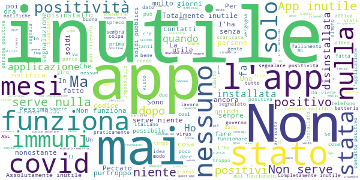

# Immuni
App version ``2.2.1``

Analyzed with [covid-apps-observer](http://github.com/covid-apps-observer) project, version ``0.1``

## App overview
| | |
|-------------------------|-------------------------| 
| **Name**&nbsp;&nbsp;&nbsp;&nbsp;&nbsp;&nbsp;&nbsp;&nbsp;&nbsp;&nbsp;&nbsp;&nbsp;&nbsp;&nbsp;&nbsp;&nbsp;&nbsp;&nbsp;&nbsp;&nbsp;&nbsp;&nbsp;&nbsp;&nbsp;&nbsp;&nbsp;&nbsp;&nbsp;&nbsp;&nbsp;&nbsp;&nbsp;&nbsp;&nbsp;&nbsp;&nbsp;&nbsp;&nbsp;&nbsp;&nbsp;  | Immuni |
| **Unique identifier** | it.ministerodellasalute.immuni |
| **Link to Google Play** | [https://play.google.com/store/apps/details?id=it.ministerodellasalute.immuni](https://play.google.com/store/apps/details?id=it.ministerodellasalute.immuni) |
| **Summary**  | App ufficiale per le notifiche di esposizione in Italia |
| **Privacy policy** | [https://www.immuni.italia.it/app-pn.html](https://www.immuni.italia.it/app-pn.html) |
| **Latest version** | 2.2.1 |
| **Last update** | 2021-01-28 17:19:11 |
| **Recent changes** | Aggiornamento testi |
| **Installs**  | 5.000.000+ |
| **Category** | Medicina |
| **First release** | 1 giu 2020 |
| **Size**  | 28M |
| **Supported Android version**  | 6.0 e versioni successive |

### Description
> Immuni è l’app ufficiale per le notifiche di esposizione del governo italiano, sviluppata dal Commissario Straordinario per l’Emergenza COVID-19 in collaborazione con il Ministero della Salute e il Ministero per l’Innovazione Tecnologica e la Digitalizzazione. L’app è sviluppata e rilasciata nel pieno rispetto della protezione dei dati personali dell’utente e della normativa vigente, incluso il decreto-legge del 30 aprile 2020, n. 28.
 Nella lotta all’epidemia di COVID-19, l’app aiuta a notificare gli utenti potenzialmente contagiati il prima possibile, anche quando sono asintomatici. Questi utenti possono poi isolarsi per evitare di contagiare altri, con l’effetto di minimizzare la diffusione del virus e velocizzare il ritorno a una vita normale per la maggior parte della popolazione. Venendo informati tempestivamente, inoltre, gli utenti possono anche contattare il proprio medico di medicina generale, riducendo così il rischio di complicanze.
 Il sistema di notifiche di esposizione di Immuni si basa sulla tecnologia Bluetooth Low Energy, creata per essere particolarmente efficiente in termini di risparmio energetico, e non utilizza alcun tipo di dato di geolocalizzazione, inclusi quelli del GPS. L’app non raccoglie e non è in grado di ottenere alcun dato che identifichi l’utente, quali nome, cognome, data di nascita, indirizzo, numero di telefono o indirizzo email. Immuni riesce quindi a determinare che un contatto fra due utenti è avvenuto, ma non chi siano effettivamente i due utenti o dove si siano incontrati.
 Ecco una lista di alcune delle misure con cui Immuni protegge i dati degli utenti:
 • I dati raccolti sono quelli minimi, strettamente necessari per supportare e migliorare il sistema di notifiche di esposizione.
 • Il codice Bluetooth Low Energy trasmesso dall’app è generato in maniera casuale e non contiene alcuna informazione riguardo allo smartphone dell’utente, tanto meno sull’utente stesso. Inoltre, questo codice cambia svariate volte ogni ora, per tutelare ancora meglio la privacy dell’utente.
 • I dati salvati sullo smartphone sono cifrati.
 • Le connessioni tra l’app e il server sono cifrate.
 • Tutti i dati, siano essi salvati sul dispositivo o sul server, saranno cancellati non appena non saranno più necessari e in ogni caso non oltre il 31 dicembre 2020.
 • È il Ministero della Salute il soggetto che raccoglie i dati e che decide per quali scopi utilizzarli. In ogni caso, i dati verranno usati solo per contenere l’epidemia del COVID-19 e per la ricerca scientifica.
 • I dati sono salvati su server in Italia e gestiti da soggetti pubblici.

 Immuni non fa e non può fare diagnosi. Sulla base dello storico dei contatti con utenti potenzialmente contagiosi, Immuni elabora alcune raccomandazioni su come è necessario comportarsi. Ma l’app non è un dispositivo medico e non può in alcun caso sostituire un medico.
 Immuni è uno strumento importante nella lotta a questa terribile epidemia e ciascun utente ne aumenta l’efficacia complessiva. Per questo consigliamo vivamente di installare l’app, usarla correttamente e incoraggiare parenti e amici a fare lo stesso. Tuttavia, non c’è alcun obbligo di utilizzo. La decisione spetta soltanto all’individuo.

### User interface
The developers of the app provide the following screenshots in the Google play store.
| | | |
|:-------------------------:|:-------------------------:|:-------------------------:|
 |   |   |   | 
 |  

## Development team
In the following we report the main information provided by the development team in the Google play store.

| | |
|-------------------------|-------------------------|
| **Developer**  | Ministero della Salute |
| **Website**  | [https://www.immuni.italia.it/](https://www.immuni.italia.it/) |
| **Email** | cittadini@immuni.italia.it |
| **Physical address**  | - |
| **Other developed apps**  | [https://play.google.com/store/apps/developer?id=Ministero+della+Salute](https://play.google.com/store/apps/developer?id=Ministero+della+Salute) |

## Android support

| | |
|-------------------------|-------------------------|
| **Declared target Android version**  | Android10, version 10 (API level 29) |
| **Effective target Android version**  | Android10, version 10 (API level 29) |
| **Minimum supported Android version**  | Marshmallow, version 6.0 (API level 23) |
| **Maximum target Android version**  | - |

The larger the difference between the minimum and maximum supported Android versions, the better. A larger difference means a wider audience. For example, old phones have a very low Android version, so a high minimum supported Android version means that the app cannot be used by users with old phones, thus leading to accessibility problems. 

## Requested permissions

In the following we report the complete list of the permissions requested by the app. 

| **Permission** | **Protection level** | **Description** | 
|-------------------------|-------------------------|-------------------------|
 **android.permission ACCESS_NETWORK_STATE** | Normal | Allows applications to access information about networks. 
 **android.permission BLUETOOTH** | Normal | Allows applications to connect to paired bluetooth devices. 
 **android.permission FOREGROUND_SERVICE** | Normal | Allows a regular application to use Service.startForeground. 
 **android.permission INTERNET** | Normal | Allows applications to open network sockets. 
 **android.permission RECEIVE_BOOT_COMPLETED** | Normal | Allows an application to receive the Intent.ACTION_BOOT_COMPLETED that is broadcast after the system finishes booting. 
 **android.permission WAKE_LOCK** | Normal | Allows using PowerManager WakeLocks to keep processor from sleeping or screen from dimming. 

## Mentioned servers

| **Server** | **Registrant** | **Registrant country** | **Creation date** | 
|-------------------------|-------------------------|-------------------------|-------------------------|
 | google.com | Google LLC | :us: US | 1997-09-15 04:00:00 |
 | googleapis.com | Google LLC | :us: US | 2005-01-25 17:52:26 |
 | italia.it | Presidenza del Consiglio dei Ministri | :it: IT | 2004-06-03 00:00:00 |

## Security analysis 

Below we report the main security warnings raised by our execution of the [Androwarn](https://github.com/maaaaz/androwarn) security analysis tool.

**Connection interfaces exfiltration**
> - This application reads details about the currently active data network 
> - This application tries to find out if the currently active data network is metered 

**Telephony services abuse**
> - This application makes phone calls 

**Suspicious connection establishment**
> - This application opens a Socket and connects it to the remote address ' returned no addresses for  ; port is out of range' on the 'N/A' port  
> - This application opens a Socket and connects it to the remote address '' on the 'N/A' port  
> - This application opens a Socket and connects it to the remote address 'Ljava/lang/StringBuilder;->toString()Ljava/lang/String;' on the 'N/A' port  
> - This application opens a Socket and connects it to the remote address 'Ljava/net/Proxy;->type()Ljava/net/Proxy$Type;' on the 'N/A' port  
> - This application opens a Socket and connects it to the remote address 'Method sendUrgentData() is not supported.' on the 'N/A' port  
> - This application opens a Socket and connects it to the remote address 'Method setHandshakeTimeout() is not supported.' on the 'N/A' port  
> - This application opens a Socket and connects it to the remote address 'Method setOOBInline() is not supported.' on the 'N/A' port  
> - This application opens a Socket and connects it to the remote address 'Method setSoWriteTimeout() is not supported.' on the 'N/A' port  
> - This application opens a Socket and connects it to the remote address 'Socket closed' on the 'N/A' port  
> - This application opens a Socket and connects it to the remote address 'Socket is closed' on the 'N/A' port  
> - This application opens a Socket and connects it to the remote address 'Socket is closed.' on the 'N/A' port  
> - This application opens a Socket and connects it to the remote address 'Socket is not connected.' on the 'N/A' port  
> - This application opens a Socket and connects it to the remote address 'socket is closed' on the 'N/A' port  
> - This application opens a Socket and connects it to the remote address 'timeout' on the 'N/A' port  

**Code execution**
> - This application loads a native library: 'conscrypt_gmscore_jni' 
> - This application loads a native library: 'conscrypt_jni' 

## User ratings and reviews

Below we provide information about how end users are reacting to the app in terms of ratings and reviews in the Google Play store.

### Ratings

The Immuni app has been installed by more than **5000000** times. At this time, **44821** rated the app and its average score is **2.4433584**. Below we show the distribution of the ratings across the usual star-based rating of Google Play

:star::star::star::star::star:: 12545

:star::star::star::star:: 2379

:star::star::star:: 2309

:star::star:: 2757

:star:: 24831

### Reviews 

#### 5-star reviews

> Complimenti  :date: __2021-04-03 14:08:09__

> App utilissima specialmente in questo periodo di covid.  :date: __2021-04-03 11:51:17__

> La metafora dell'iTALIA.  :date: __2021-04-03 10:18:22__

> Piena salute  :date: __2021-04-03 08:22:48__

> Ottima. Consigliatissima.  :date: __2021-04-02 22:33:50__

> Sus!!!😔😔😔😔🔥🥲😱😱😱😱😱😀che schifo!!😡  :date: __2021-04-02 14:58:41__

> Bellissima😍😍😍😍😍😍  :date: __2021-04-02 11:47:22__

> Mi piace molto app  :date: __2021-04-01 21:18:42__

> Simo divertendo salute bene  :date: __2021-04-01 09:12:24__

> Funziona perfettamente  :date: __2021-03-31 11:41:12__

#### 4-star reviews

> Va bene  :date: __2021-03-28 09:23:06__

> Sembra funzionare, ti guède Bluetooth e geolocalizzazione attive  :date: __2021-03-26 06:35:44__

> L'app è piccola e discreta: installarla mi sembra doveroso e sacrosanto. Peccato che i dati generati dall'app non servano a nulla, perché il tracciamento dei contagi non funziona...  :date: __2021-03-25 15:44:34__

> Jl Y ho gli t GG un La App lo o Polo O la p Lo lo ll p gg  :date: __2021-03-24 09:40:26__

> Non ti lascia convinto del funzionamento.  :date: __2021-03-23 09:11:59__

> Sono stato tra i primi a scaricarla... L'ho disinstallata qualche giorno fa! Purtroppo alla guida non c'è nessuno! Sarebbe stata veramente utile. Noi Italiani siamo unici nel farci male da soli.  :date: __2021-03-20 22:23:45__

> Idea buonissima ma paese vecchio e da boomers, dipendenti boomers ATS che non caricano i codici di chi risulta positivo....  :date: __2021-03-16 21:04:58__

> per me è stata molto utile ,ho ricevuto la notifica a esposizione.....però ho ricevuto il codice da inserire solo dopo 4 mesi . ..  :date: __2021-03-14 11:22:56__

> Buona  :date: __2021-03-12 23:17:25__

> Potreste inserire nell'applicazione la modalità "vaccinato" ... sarebbe utile.  :date: __2021-03-11 23:27:15__

#### 3-star reviews

> Ma sull'app non è possibile segnalare se una persone si è vaccinata, inserendo il codice qr della vaccinazione eseguita?  :date: __2021-04-03 11:49:51__

> Installata da quando è uscita, nel frattempo ho dovuto reinstallarla almeno una volta e cancellare i dati almeno tre volte perché si chiude con errore.  :date: __2021-04-02 12:44:50__

> App ben funzionante ma quasi inutile. Istallata appena uscita: arrivati a fine marzo non mi ha mai segnalato niente perché manca adeguata organizzazione del tracciamento e quantità di operatori (nonostante reddito di cittadinanza, disoccupati causa covid, organizzazioni di volontariato). Trattandosi di pandemia, se ne occupi la Magistratura. La tengo solo per senso del dovere, ed un po' per scaramanzia. E' quello che ci meritiamo per come votiamo.  :date: __2021-04-01 11:06:15__

> Installata appena uscita. Non ho mai ricevuto segnalazioni. Sarà perché non ho mai incontrato positivi o perché sono uno dei pochi che l'ha installata???  :date: __2021-03-31 23:23:15__

> Sei sempre aggiornato e questo è un bene  :date: __2021-03-30 17:37:02__

> Sarebbe utile aggiungere se uno ha fatto il vaccino .  :date: __2021-03-29 07:13:57__

> 3 stelle è la media tra il 5 dell'idea degli sviluppatori e l'1 dell'effettiva efficacia. Infermiere, 9 degli ultimi 13 mesi trascorsi in reparti Covid, a costante contatto con pazienti positivi, col telefono sempre acceso e Bluetooth attivo. Mai una notifica. L'unica cosa a cui non hanno pensato gli sviluppatori è che in Italia queste cose non funzionano. E pensare che l'avevo tanto pubblicizzata anch'io.  :date: __2021-03-28 05:28:30__

> La app funziona senza appesantire il dispositivo. Però non supporta il salvataggio in cloud, per cui ripristinando alle condizioni di fabbrica vengono perse le chiavi e tutti i dati di esposizione, e non si è più protetti. Io resetto il telefono regolarmente ad ogni stagione per cui mi lascia esposto a rischi per le ultime due settimane precedenti il reset... non è molto carino.  :date: __2021-03-26 21:19:43__

> Crasha all'avvio da più di due settimane, nessun aggiornamento arretrato  :date: __2021-03-25 09:37:50__

> Metto 3 stelle perché chi l'ha usata ha avuto molte difficoltà e ritardi  :date: __2021-03-20 09:44:50__

#### 2-star reviews

> Io l'ho cancellata  :date: __2021-04-03 11:39:14__

> Se non hai bluetooth accesso non funziona  :date: __2021-03-31 19:48:17__

> Scaricata ....apparentemente utile .... ma purtroppo non ha avuto il successo e riscontro dovuto e per questo motivo dopo poco è diventata totalmente inutile. Peccato per il lavoro svolto dai tecnici sviluppatori e per l'ingente somma di denaro pubblico sprecato.  :date: __2021-03-31 14:01:20__

> Non so, con tutti i positivi che ci sono a Roma, e con i numeri che dopo un anno abbiamo, o sono stato molto fortunato a non incrociare nessun positivo, o l'applicazione non funziona o è tutta una farsa 🤔  :date: __2021-03-30 23:17:45__

> Serve a qualcosa?  :date: __2021-03-30 19:49:37__

> Si disattiva a caso e non invia la notifica di richiesta di riattivazione del servizio.  :date: __2021-03-30 19:15:25__

> Incredibile, non mostrano neache il numero di download per vergogna  :date: __2021-03-30 09:02:05__

> Non sono interessato  :date: __2021-03-29 13:40:00__

> Appena Immuni è stata rilasciata io ho deciso di installarla... questa è la mia recensione: Prima di tutto, ci terrei a dare una nota positiva agli sviluppatori, proprio perché l'applicazione in sè e fatta molto bene, considerando il tempo a disposizione. Però se dovessimo valutare il lato "utilità", quello che deve fare non lo sta facendo come si pensava al momento del rilascio. Ci sono dei meccanismi nell'app Immuni che non stanno funzionando, e vari motivi per cui non stanno funzionando...  :date: __2021-03-29 13:15:55__

> 2 stelle perché non sembra invadente a livello di risorse, ma è apparentemente e completamente inutile... E fa rabbia per le tante cose dette, soldi spesi ecc..  :date: __2021-03-28 10:40:44__

#### 1-star reviews

> Ancora una volta, soldi pubblici spesi in cazzate, dai banchi a rotelle messi negli sgabuzzini alle mascherine farlocche. Peggior governo della storia D'Italia. App immuni inutile e formata da incapaci strapagati.  :date: __2021-04-04 09:57:47__

> Una delle app più inutili mai realizzate, specchio dell Italia d'altronde con i suoi sperperi di danaro  :date: __2021-04-04 01:08:31__

> Inutile e nn funzionante, soldi persi  :date: __2021-04-04 01:04:15__

> Non serve a niente  :date: __2021-04-04 00:32:44__

> praticamente l'app è stata un "flop"disinstallo immediatamente app inutile come la politica italiana  :date: __2021-04-03 22:41:36__

> È come "La corazzata Potëmkin"...  :date: __2021-04-03 21:12:29__

> App veramente pessima. Non si può segnalare la positività in nessun modo, e questo la rende totalmente inutile perché se incontri qualcuno con il coronavirus non potrai mai saperlo, visto che anche lui non sarà riuscito a segnalare niente.  :date: __2021-04-03 20:19:53__

> Pietosa come tutte le cose fatte da sprovveduti  :date: __2021-04-03 18:42:37__

> Ma c'è qualcuno che ce l'ha ancora installata? Mai funzionato. Inutile.  :date: __2021-04-03 18:25:37__

> Idea buona ma gestita in maniera vergognosa!  :date: __2021-04-03 17:12:29__

