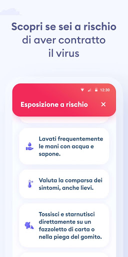
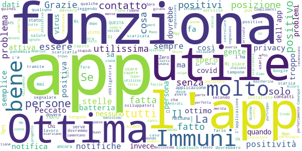

# Immuni
App version ``2.2.1``

Analyzed with [covid-apps-observer](http://github.com/covid-apps-observer) project, version ``0.1``

## App overview
| | |
|-------------------------|-------------------------| 
| **Name**&nbsp;&nbsp;&nbsp;&nbsp;&nbsp;&nbsp;&nbsp;&nbsp;&nbsp;&nbsp;&nbsp;&nbsp;&nbsp;&nbsp;&nbsp;&nbsp;&nbsp;&nbsp;&nbsp;&nbsp;&nbsp;&nbsp;&nbsp;&nbsp;&nbsp;&nbsp;&nbsp;&nbsp;&nbsp;&nbsp;&nbsp;&nbsp;&nbsp;&nbsp;&nbsp;&nbsp;&nbsp;&nbsp;&nbsp;&nbsp;  | Immuni |
| **Unique identifier** | it.ministerodellasalute.immuni |
| **Link to Google Play** | [https://play.google.com/store/apps/details?id=it.ministerodellasalute.immuni](https://play.google.com/store/apps/details?id=it.ministerodellasalute.immuni) |
| **Summary**  | App ufficiale per le notifiche di esposizione in Italia |
| **Privacy policy** | [https://www.immuni.italia.it/app-pn.html](https://www.immuni.italia.it/app-pn.html) |
| **Latest version** | 2.2.1 |
| **Last update** | 2021-01-28 17:19:11 |
| **Recent changes** | Aggiornamento testi |
| **Installs**  | 5.000.000+ |
| **Category** | Medicina |
| **First release** | 1 giu 2020 |
| **Size**  | 28M |
| **Supported Android version**  | 6.0 e versioni successive |

### Description
> Immuni è l’app ufficiale per le notifiche di esposizione del governo italiano, sviluppata dal Commissario Straordinario per l’Emergenza COVID-19 in collaborazione con il Ministero della Salute e il Ministero per l’Innovazione Tecnologica e la Digitalizzazione. L’app è sviluppata e rilasciata nel pieno rispetto della protezione dei dati personali dell’utente e della normativa vigente, incluso il decreto-legge del 30 aprile 2020, n. 28.
 Nella lotta all’epidemia di COVID-19, l’app aiuta a notificare gli utenti potenzialmente contagiati il prima possibile, anche quando sono asintomatici. Questi utenti possono poi isolarsi per evitare di contagiare altri, con l’effetto di minimizzare la diffusione del virus e velocizzare il ritorno a una vita normale per la maggior parte della popolazione. Venendo informati tempestivamente, inoltre, gli utenti possono anche contattare il proprio medico di medicina generale, riducendo così il rischio di complicanze.
 Il sistema di notifiche di esposizione di Immuni si basa sulla tecnologia Bluetooth Low Energy, creata per essere particolarmente efficiente in termini di risparmio energetico, e non utilizza alcun tipo di dato di geolocalizzazione, inclusi quelli del GPS. L’app non raccoglie e non è in grado di ottenere alcun dato che identifichi l’utente, quali nome, cognome, data di nascita, indirizzo, numero di telefono o indirizzo email. Immuni riesce quindi a determinare che un contatto fra due utenti è avvenuto, ma non chi siano effettivamente i due utenti o dove si siano incontrati.
 Ecco una lista di alcune delle misure con cui Immuni protegge i dati degli utenti:
 • I dati raccolti sono quelli minimi, strettamente necessari per supportare e migliorare il sistema di notifiche di esposizione.
 • Il codice Bluetooth Low Energy trasmesso dall’app è generato in maniera casuale e non contiene alcuna informazione riguardo allo smartphone dell’utente, tanto meno sull’utente stesso. Inoltre, questo codice cambia svariate volte ogni ora, per tutelare ancora meglio la privacy dell’utente.
 • I dati salvati sullo smartphone sono cifrati.
 • Le connessioni tra l’app e il server sono cifrate.
 • Tutti i dati, siano essi salvati sul dispositivo o sul server, saranno cancellati non appena non saranno più necessari e in ogni caso non oltre il 31 dicembre 2020.
 • È il Ministero della Salute il soggetto che raccoglie i dati e che decide per quali scopi utilizzarli. In ogni caso, i dati verranno usati solo per contenere l’epidemia del COVID-19 e per la ricerca scientifica.
 • I dati sono salvati su server in Italia e gestiti da soggetti pubblici.

 Immuni non fa e non può fare diagnosi. Sulla base dello storico dei contatti con utenti potenzialmente contagiosi, Immuni elabora alcune raccomandazioni su come è necessario comportarsi. Ma l’app non è un dispositivo medico e non può in alcun caso sostituire un medico.
 Immuni è uno strumento importante nella lotta a questa terribile epidemia e ciascun utente ne aumenta l’efficacia complessiva. Per questo consigliamo vivamente di installare l’app, usarla correttamente e incoraggiare parenti e amici a fare lo stesso. Tuttavia, non c’è alcun obbligo di utilizzo. La decisione spetta soltanto all’individuo.

### User interface
The developers of the app provide the following screenshots in the Google play store.
| | | |
|:-------------------------:|:-------------------------:|:-------------------------:|
 |   |   |   | 
 |  

## Development team
In the following we report the main information provided by the development team in the Google play store.

| | |
|-------------------------|-------------------------|
| **Developer**  | Ministero della Salute |
| **Website**  | [https://www.immuni.italia.it/](https://www.immuni.italia.it/) |
| **Email** | cittadini@immuni.italia.it |
| **Physical address**  | - |
| **Other developed apps**  | [https://play.google.com/store/apps/developer?id=Ministero+della+Salute](https://play.google.com/store/apps/developer?id=Ministero+della+Salute) |

## Android support

| | |
|-------------------------|-------------------------|
| **Declared target Android version**  | Android10, version 10 (API level 29) |
| **Effective target Android version**  | Android10, version 10 (API level 29) |
| **Minimum supported Android version**  | Marshmallow, version 6.0 (API level 23) |
| **Maximum target Android version**  | - |

The larger the difference between the minimum and maximum supported Android versions, the better. A larger difference means a wider audience. For example, old phones have a very low Android version, so a high minimum supported Android version means that the app cannot be used by users with old phones, thus leading to accessibility problems. 

## Requested permissions

In the following we report the complete list of the permissions requested by the app. 

| **Permission** | **Protection level** | **Description** | 
|-------------------------|-------------------------|-------------------------|
 **android.permission ACCESS_NETWORK_STATE** | Normal | Allows applications to access information about networks. 
 **android.permission BLUETOOTH** | Normal | Allows applications to connect to paired bluetooth devices. 
 **android.permission FOREGROUND_SERVICE** | Normal | Allows a regular application to use Service.startForeground. 
 **android.permission INTERNET** | Normal | Allows applications to open network sockets. 
 **android.permission RECEIVE_BOOT_COMPLETED** | Normal | Allows an application to receive the Intent.ACTION_BOOT_COMPLETED that is broadcast after the system finishes booting. 
 **android.permission WAKE_LOCK** | Normal | Allows using PowerManager WakeLocks to keep processor from sleeping or screen from dimming. 

## Mentioned servers

| **Server** | **Registrant** | **Registrant country** | **Creation date** | 
|-------------------------|-------------------------|-------------------------|-------------------------|
 | google.com | Google LLC | :us: US | 1997-09-15 04:00:00 |
 | googleapis.com | Google LLC | :us: US | 2005-01-25 17:52:26 |
 | italia.it | Presidenza del Consiglio dei Ministri | :it: IT | 2004-06-03 00:00:00 |

## Security analysis 

Below we report the main security warnings raised by our execution of the [Androwarn](https://github.com/maaaaz/androwarn) security analysis tool.

**Connection interfaces exfiltration**
> - This application reads details about the currently active data network 
> - This application tries to find out if the currently active data network is metered 

**Telephony services abuse**
> - This application makes phone calls 

**Suspicious connection establishment**
> - This application opens a Socket and connects it to the remote address ' returned no addresses for  ; port is out of range' on the 'N/A' port  
> - This application opens a Socket and connects it to the remote address '' on the 'N/A' port  
> - This application opens a Socket and connects it to the remote address 'Ljava/lang/StringBuilder;->toString()Ljava/lang/String;' on the 'N/A' port  
> - This application opens a Socket and connects it to the remote address 'Ljava/net/Proxy;->type()Ljava/net/Proxy$Type;' on the 'N/A' port  
> - This application opens a Socket and connects it to the remote address 'Method sendUrgentData() is not supported.' on the 'N/A' port  
> - This application opens a Socket and connects it to the remote address 'Method setHandshakeTimeout() is not supported.' on the 'N/A' port  
> - This application opens a Socket and connects it to the remote address 'Method setOOBInline() is not supported.' on the 'N/A' port  
> - This application opens a Socket and connects it to the remote address 'Method setSoWriteTimeout() is not supported.' on the 'N/A' port  
> - This application opens a Socket and connects it to the remote address 'Socket closed' on the 'N/A' port  
> - This application opens a Socket and connects it to the remote address 'Socket is closed' on the 'N/A' port  
> - This application opens a Socket and connects it to the remote address 'Socket is closed.' on the 'N/A' port  
> - This application opens a Socket and connects it to the remote address 'Socket is not connected.' on the 'N/A' port  
> - This application opens a Socket and connects it to the remote address 'socket is closed' on the 'N/A' port  
> - This application opens a Socket and connects it to the remote address 'timeout' on the 'N/A' port  

**Code execution**
> - This application loads a native library: 'conscrypt_gmscore_jni' 
> - This application loads a native library: 'conscrypt_jni' 

## User ratings and reviews

Below we provide information about how end users are reacting to the app in terms of ratings and reviews in the Google Play store.

### Ratings

The Immuni app has been installed by more than **5000000** times. At this time, **44821** rated the app and its average score is **2.4433584**. Below we show the distribution of the ratings across the usual star-based rating of Google Play

:star::star::star::star::star:: 12545

:star::star::star::star:: 2379

:star::star::star:: 2309

:star::star:: 2757

:star:: 24831

### Reviews 

#### 5-star reviews

> Per fortuna ancora non l'ho appurato ... se funziona !!!  :date: __2021-02-13 15:49:33__

> 🙂  :date: __2021-02-13 12:05:01__

> Buona  :date: __2021-02-13 08:59:47__

> Ok  :date: __2021-02-12 12:12:40__

> Mi piace la formazione di questa applicazione, E la trovo utile sia per me che per la mia famiglia.  :date: __2021-02-12 08:54:19__

> Facile e, direi anche utile  :date: __2021-02-12 07:15:08__

> Ottima app veramente semplice e intuitiva  :date: __2021-02-11 21:57:10__

> Ottima idea grazie  :date: __2021-02-11 18:03:50__

> Applicazione fatta davvero molto bene. Leggendo i commenti mi chiedo cosa ci si aspettava da un'applicazione del genere, ed anche della disinformazione che è girata su questo progetto: serve solo a capire se gli utenti con cui siamo stati esposti nelle vicinanze sono risultati positivi o meno a Covid19. Il costo di questa app è stato zero per lo Stato visto che è gratuita, ma non proprio zero per l'azienda che l'ha realizzata di fretta e furia, ottenendo un buon lavoro. Il grosso dei problemi nasce con l'integrazione col SSN che si è dimostrata restia nell'utilizzo ed applicazione del'app. Resta tutt'ora un'app valida, ma l'efficacia è tale se molti la scaricano. Inoltre non ci si deve aspettare una qualche sorta di news da Immuni: manda notifiche riepilogative ogni settimana/mese, ed in caso di positività ve lo comunica in-app oppure tramite notifica. Ogni tanto apritela per vedere se ci sono novità  :date: __2021-02-11 15:30:38__

> Mi piace  :date: __2021-02-10 19:51:19__

#### 4-star reviews

> quando si potrà certificare anche la vaccinazione?  :date: __2021-02-13 00:15:57__

> App assolutamente non invasiva. Sarebbe utile avere maggiori informazioni riguardo al numero di utenti che stanno usando l'applicazione (magari divisi anche per zona), numero di casi rilevati tramite l'app (magari anche nell'ultimo anno, nell'ultimo nese, nell'ultima settimana) ecc.  :date: __2021-02-12 14:18:14__

> Basta usare anche in macchina sempre ed ovunque la Mascherina , 2 rispetare sempre le distanze , lavarsi le mani anche per 50 volte al giorno , le unnguie sono fonte di battere , la gente non ci crede fin che non lo vedono di persona : Grazie a voi che ci aggiornate su tutto , davvero un lavoro di cuadra bravi !  :date: __2021-02-11 00:39:21__

> Come si fa a segnalare un caso positivo vicino?  :date: __2021-02-09 22:03:55__

> Questa App mi consente di avere una difesa in più. Il rammarico è che molte persone non l'hanno scaricata per superficialità.  :date: __2021-02-08 17:36:12__

> Non male, spero che funzioni come dice.  :date: __2021-02-07 12:29:53__

> Perfetta lavora in background e fa il suo dovere sarebbe comodo se però metteste una specie di localizzazione GPS che quando esci di casa ti attiva tutto quello che c'è da attivare e quando rientri disattiva tutto.  :date: __2021-02-03 08:05:20__

> Non c'è ne uno positivo  :date: __2021-02-02 19:29:43__

> Ottima applicazione  :date: __2021-02-01 17:52:06__

> L'applicazione sarebbe utilissima se fisse installata da tanti. Richiede il GPS attivo anche se non lo utilizza.  :date: __2021-02-01 15:59:39__

#### 3-star reviews

> Prima appena aprivo immuni,mi diceva attivo adesso non più  :date: __2021-02-09 14:25:31__

> E utile ma non capisco bene come funziona  :date: __2021-02-08 13:43:45__

> App che all'inizio non sembrava aver problemi di stabilità, scaricata fin dai primi giorni in cui era stata resa disponibile. Ma ultimamente sono costanti i messaggi di sistema che notificano che l'app ha anomalie e va terminata, o notifiche in cui si riporta un uso anomalo della batteria.  :date: __2021-02-07 20:31:17__

> Per aumentare la popolarità gli sviluppatori dovrebbero implementare funzioni utili come: 1. Contenere il sunto dei dati sulla pandemia giorno per giorno con cronologia e grafici. 2. Permettere l'inserimento delle patologie croniche da tenere in considerazione nel caso di terapia intensiva  :date: __2021-02-07 00:23:43__

> Ha un effetto psicologico sulla persona che l ha scaricata , sicuramente sarebbe di maggior effetto se gran parte della popolazione la scaricasse, altrimenti se in modesta percentuale vedo pochi benefici. Al giorno 6 febbraio 2021 non ho nessun segnale che proviene da questa applicazione, devo esserne contento, immagino, ma ahimé mi sembra che la utilità sia pressoché zero. O forse non ne ho ancora capito il funzionamento.  :date: __2021-02-06 17:08:31__

> Edit: ho installato l'app quasi quando è uscita e sono un po' deluso perché praticamente non è servita a niente. Penso che da una parte l'abbiano scaricata troppe poche persone (bellissimi quelli che si lamentavano della privacy dopo aver letto fake news sui SOCIAL) e dall'altra non funzioni perché gli operatori sanitari non sanno come comportarsi per segnalare un caso sull'app. Ormai immuni è stata dimenticata da tutti. Peccato perché in realtà era progettata abbastanza bene.  :date: __2021-02-06 11:27:39__

> Purtrtoppo essendo in pochi ad averla scaricata temo chennon funziona come dovrebbe  :date: __2021-02-05 13:26:55__

> per ora tre stelle, lavoro come operatore sanitario anticovid per cui entro spesso a contatto con molte persone durante la mia giornata lavorativa, spero possa aiutarmi in qualche modo. alzerò o abbesserò la recensione a fine settimana prossima  :date: __2021-02-05 02:39:32__

> Potrebbe essere valida. OK🙂  :date: __2021-02-03 18:34:42__

> Da quando ho istallato immuni (+ di 3 mesi) non ho mai ricevuto le notifiche settimanali che altri mi dicono ricevere regolarmente. Fa niente! Però, si potrebbe utilizzare questa app per il piano vaccinale? Convocazione e relativo certificato di avvenuta vaccinazione da poter esibire al bisogno (come fanno in Israele)?  :date: __2021-02-02 14:02:42__

#### 2-star reviews

> Nutro dei dubbi che sto aspettando vengano chiariti dagli sviluppatori.  :date: __2021-02-13 10:56:13__

> Un flop totale  :date: __2021-02-12 14:46:42__

> Avrei messo volentieri 5 stelle se non fosse per il fatto che per segnalare la tua positività è necessario parlare con un operatore sanitario. Avrebbero potuto fare in modo che bastasse inserire un identificativo del referto o qualcosa del genere, perché io sono stato positivo e non ho MAI parlato con un operatore sanitario, e anche volendo non ho mai avuto la possibilità di segnalare la mia positività su immuni, immagino che moltissimi abbiano avuto il mio stesso problema.  :date: __2021-02-12 02:06:19__

> L app sarebbe buona se tutti la scaricassero e i positivi si registrassero.Purtoppo non è così e quindi è inutile  :date: __2021-02-11 10:06:23__

> L'app di per se è leggera e poco invasiva... forse troppo poco. Dopo chiamata al call center per sapere se è attiva in veneto, mi è stato detto che è attiva, ma nel caso risultassi positivo, dovrei essere io a comunicare al call center il codice che (forse) mi ha dato l'operatore sanitario. In pratica all'utente viene richiesto un doppio sforzo: Installare l'app, comunicare al call center la sua positività. TROPPO. ANCHE PER UN CITTADINO MODELLO. Una persona che ha scoperto di essere positiva ha ben altro a cui pensare!!! Quindi 4 stelle per l'app, 1 (spenta) per la gestione all'italiana. Bastava un semplice servizio di data entry (anonimo perchè i dati sono anonimi) per ulss e il tracciamento era fatto  :date: __2021-02-10 22:17:26__

> Non è che il modo d' uso di questa app sia molto chiaro...Serve a poco, a molto poco. / Non serve quasi a niente.  :date: __2021-02-09 15:24:51__

> Occupa solo spazio.  :date: __2021-02-09 13:32:29__

> Aggiornamento 02/2021: mia moglie positiva, abbiamo chiesto all'ASL se potevamo comunicare il codice, risposta " NON SAPPIAMO CHE FARCI"..... . . . . Dovete installarla. (Punto)  :date: __2021-02-08 22:25:18__

> Pessima non funziona  :date: __2021-02-08 19:50:38__

> Istallata appena uscita, ancora non ho trovato un motivo valido per averlo fatto.  :date: __2021-02-07 00:28:06__

#### 1-star reviews

> MUTANDE BLU SBORRO CON I MIEI FRA, L'HAI INFILATO LÍ O L'HAI MESSO LÀ, NON DENUDARTI IN CITTÀ, VRUUUM VRUM, QUESTE SLIP É UNA SUPER MUTAND. Lasciate like per il continuo 🆘  :date: __2021-02-13 16:22:02__

> AssOLUTAMENTE INUTILE VISTO CHE SONO STATA IN CONTATTO CON I MIEI VCINI DI CASA TUTTI POSITIVI  :date: __2021-02-13 15:56:51__

> App veramente inutile. Sono stato a stretto contatto con più persone positive che avevano pure loro l'app, ma non mi è arrivata nessuna notifica. Macchinoso segnalare che una persona è positiva.. Le cose o si fanno bene o non si fanno affatto. Spreco di soldi per lo stato e è spreco di tempo per le persone. Direi vergognosa!!!!!!  :date: __2021-02-13 13:55:29__

> Come vedere se entri in contatto con persone positive e co vedere il messaggio da viso grazie  :date: __2021-02-13 06:22:07__

> Al di sotto del limite del ridicolo.  :date: __2021-02-13 02:08:52__

> Sono stata a contatto con più persone positive, anch'esse avevano Immuni, hanno provato a segnalarlo ma senza risultato e io non ho mai ricevuto alcuna notifica. Idea buona ma app totalmente inutile.  :date: __2021-02-12 21:55:29__

> Troppo inutile, non serve a nulla.  :date: __2021-02-12 21:07:13__

> che cavolata  :date: __2021-02-12 19:34:06__

> pessima, purtroppo.  :date: __2021-02-12 18:14:50__

> Eh web vvb  :date: __2021-02-12 17:43:00__

