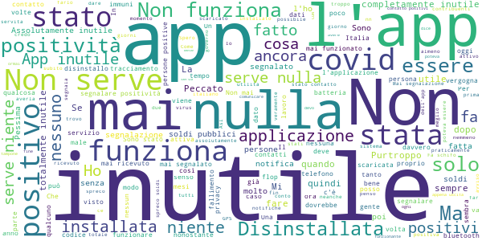

# Immuni
App version ``2.4.0``

Analyzed with [covid-apps-observer](http://github.com/covid-apps-observer) project, version ``0.1``

## App overview
| | |
|-------------------------|-------------------------| 
| **Name**&nbsp;&nbsp;&nbsp;&nbsp;&nbsp;&nbsp;&nbsp;&nbsp;&nbsp;&nbsp;&nbsp;&nbsp;&nbsp;&nbsp;&nbsp;&nbsp;&nbsp;&nbsp;&nbsp;&nbsp;&nbsp;&nbsp;&nbsp;&nbsp;&nbsp;&nbsp;&nbsp;&nbsp;&nbsp;&nbsp;&nbsp;&nbsp;&nbsp;&nbsp;&nbsp;&nbsp;&nbsp;&nbsp;&nbsp;&nbsp;  | Immuni |
| **Unique identifier** | it.ministerodellasalute.immuni |
| **Link to Google Play** | [https://play.google.com/store/apps/details?id=it.ministerodellasalute.immuni](https://play.google.com/store/apps/details?id=it.ministerodellasalute.immuni) |
| **Summary**  | App ufficiale per le notifiche di esposizione in Italia |
| **Privacy policy** | [https://www.immuni.italia.it/app-pn.html](https://www.immuni.italia.it/app-pn.html) |
| **Latest version** | 2.4.0 |
| **Last update** | 2021-04-07 10:02:12 |
| **Recent changes** | - Nuova funzionalità per segnalare la positività in autonomia per l&#39;utente e per verificare e caricare le informazioni. - Aggiornate FAQ sulla segnalazione di positività, UI e testi. |
| **Installs**  | 5.000.000+ |
| **Category** | Medicina |
| **First release** | 1 giu 2020 |
| **Size**  | 29M |
| **Supported Android version**  | 6.0 e versioni successive |

### Description
> Immuni è l’app ufficiale per le notifiche di esposizione del governo italiano, sviluppata dal Commissario Straordinario per l’Emergenza COVID-19 in collaborazione con il Ministero della Salute e il Ministero per l’Innovazione Tecnologica e la Digitalizzazione. L’app è sviluppata e rilasciata nel pieno rispetto della protezione dei dati personali dell’utente e della normativa vigente, incluso il decreto-legge del 30 aprile 2020, n. 28.
 Nella lotta all’epidemia di COVID-19, l’app aiuta a notificare gli utenti potenzialmente contagiati il prima possibile, anche quando sono asintomatici. Questi utenti possono poi isolarsi per evitare di contagiare altri, con l’effetto di minimizzare la diffusione del virus e velocizzare il ritorno a una vita normale per la maggior parte della popolazione. Venendo informati tempestivamente, inoltre, gli utenti possono anche contattare il proprio medico di medicina generale, riducendo così il rischio di complicanze.
 Il sistema di notifiche di esposizione di Immuni si basa sulla tecnologia Bluetooth Low Energy, creata per essere particolarmente efficiente in termini di risparmio energetico, e non utilizza alcun tipo di dato di geolocalizzazione, inclusi quelli del GPS. L’app non raccoglie e non è in grado di ottenere alcun dato che identifichi l’utente, quali nome, cognome, data di nascita, indirizzo, numero di telefono o indirizzo email. Immuni riesce quindi a determinare che un contatto fra due utenti è avvenuto, ma non chi siano effettivamente i due utenti o dove si siano incontrati.
 Ecco una lista di alcune delle misure con cui Immuni protegge i dati degli utenti:
 • I dati raccolti sono quelli minimi, strettamente necessari per supportare e migliorare il sistema di notifiche di esposizione.
 • Il codice Bluetooth Low Energy trasmesso dall’app è generato in maniera casuale e non contiene alcuna informazione riguardo allo smartphone dell’utente, tanto meno sull’utente stesso. Inoltre, questo codice cambia svariate volte ogni ora, per tutelare ancora meglio la privacy dell’utente.
 • I dati salvati sullo smartphone sono cifrati.
 • Le connessioni tra l’app e il server sono cifrate.
 • Tutti i dati, siano essi salvati sul dispositivo o sul server, saranno cancellati non appena non saranno più necessari e in ogni caso non oltre il 31 dicembre 2021.
 • È il Ministero della Salute il soggetto che raccoglie i dati e che decide per quali scopi utilizzarli. In ogni caso, i dati verranno usati solo per contenere l’epidemia del COVID-19 e per la ricerca scientifica.
 • I dati sono salvati su server in Italia e gestiti da soggetti pubblici.

 Immuni non fa e non può fare diagnosi. Sulla base dello storico dei contatti con utenti potenzialmente contagiosi, Immuni elabora alcune raccomandazioni su come è necessario comportarsi. Ma l’app non è un dispositivo medico e non può in alcun caso sostituire un medico.
 Immuni è uno strumento importante nella lotta a questa terribile epidemia e ciascun utente ne aumenta l’efficacia complessiva. Per questo consigliamo vivamente di installare l’app, usarla correttamente e incoraggiare parenti e amici a fare lo stesso. Tuttavia, non c’è alcun obbligo di utilizzo. La decisione spetta soltanto all’individuo.

### User interface
The developers of the app provide the following screenshots in the Google play store.
| | | |
|:-------------------------:|:-------------------------:|:-------------------------:|
 |   |   |   | 
 |  

## Development team
In the following we report the main information provided by the development team in the Google play store.

| | |
|-------------------------|-------------------------|
| **Developer**  | Ministero della Salute |
| **Website**  | [https://www.immuni.italia.it/](https://www.immuni.italia.it/) |
| **Email** | cittadini@immuni.italia.it |
| **Physical address**  | - |
| **Other developed apps**  | [https://play.google.com/store/apps/developer?id=Ministero+della+Salute](https://play.google.com/store/apps/developer?id=Ministero+della+Salute) |

## Android support

| | |
|-------------------------|-------------------------|
| **Declared target Android version**  | Android10, version 10 (API level 29) |
| **Effective target Android version**  | Android10, version 10 (API level 29) |
| **Minimum supported Android version**  | Marshmallow, version 6.0 (API level 23) |
| **Maximum target Android version**  | - |

The larger the difference between the minimum and maximum supported Android versions, the better. A larger difference means a wider audience. For example, old phones have a very low Android version, so a high minimum supported Android version means that the app cannot be used by users with old phones, thus leading to accessibility problems. 

## Requested permissions

In the following we report the complete list of the permissions requested by the app. 

| **Permission** | **Protection level** | **Description** | 
|-------------------------|-------------------------|-------------------------|
 **android.permission ACCESS_NETWORK_STATE** | Normal | Allows applications to access information about networks. 
 **android.permission BLUETOOTH** | Normal | Allows applications to connect to paired bluetooth devices. 
 **android.permission FOREGROUND_SERVICE** | Normal | Allows a regular application to use Service.startForeground. 
 **android.permission INTERNET** | Normal | Allows applications to open network sockets. 
 **android.permission RECEIVE_BOOT_COMPLETED** | Normal | Allows an application to receive the Intent.ACTION_BOOT_COMPLETED that is broadcast after the system finishes booting. 
 **android.permission WAKE_LOCK** | Normal | Allows using PowerManager WakeLocks to keep processor from sleeping or screen from dimming. 

## Mentioned servers

| **Server** | **Registrant** | **Registrant country** | **Creation date** | 
|-------------------------|-------------------------|-------------------------|-------------------------|
 | google.com | Google LLC | :us: US | 1997-09-15 04:00:00 |
 | googleapis.com | Google LLC | :us: US | 2005-01-25 17:52:26 |
 | italia.it | Presidenza del Consiglio dei Ministri | :it: IT | 2004-06-03 00:00:00 |

## Security analysis 

Below we report the main security warnings raised by our execution of the [Androwarn](https://github.com/maaaaz/androwarn) security analysis tool.

**Connection interfaces exfiltration**
> - This application reads details about the currently active data network 
> - This application tries to find out if the currently active data network is metered 

**Telephony services abuse**
> - This application makes phone calls 

**Suspicious connection establishment**
> - This application opens a Socket and connects it to the remote address ' returned no addresses for  ; port is out of range' on the 'N/A' port  
> - This application opens a Socket and connects it to the remote address '' on the 'N/A' port  
> - This application opens a Socket and connects it to the remote address 'Ljava/lang/StringBuilder;->toString()Ljava/lang/String;' on the 'N/A' port  
> - This application opens a Socket and connects it to the remote address 'Ljava/net/Proxy;->type()Ljava/net/Proxy$Type;' on the 'N/A' port  
> - This application opens a Socket and connects it to the remote address 'Method sendUrgentData() is not supported.' on the 'N/A' port  
> - This application opens a Socket and connects it to the remote address 'Method setHandshakeTimeout() is not supported.' on the 'N/A' port  
> - This application opens a Socket and connects it to the remote address 'Method setOOBInline() is not supported.' on the 'N/A' port  
> - This application opens a Socket and connects it to the remote address 'Method setSoWriteTimeout() is not supported.' on the 'N/A' port  
> - This application opens a Socket and connects it to the remote address 'Socket closed' on the 'N/A' port  
> - This application opens a Socket and connects it to the remote address 'Socket is closed' on the 'N/A' port  
> - This application opens a Socket and connects it to the remote address 'Socket is closed.' on the 'N/A' port  
> - This application opens a Socket and connects it to the remote address 'Socket is not connected.' on the 'N/A' port  
> - This application opens a Socket and connects it to the remote address 'socket is closed' on the 'N/A' port  
> - This application opens a Socket and connects it to the remote address 'timeout' on the 'N/A' port  

**Code execution**
> - This application loads a native library: 'conscrypt_gmscore_jni' 
> - This application loads a native library: 'conscrypt_jni' 

## User ratings and reviews

Below we provide information about how end users are reacting to the app in terms of ratings and reviews in the Google Play store.

### Ratings

The Immuni app has been installed by more than **5000000** times. At this time, **47128** rated the app and its average score is **2.3650591**. Below we show the distribution of the ratings across the usual star-based rating of Google Play

:star::star::star::star::star:: 12540

:star::star::star::star:: 2262

:star::star::star:: 2252

:star::star:: 2880

:star:: 27194

### Reviews 

#### 5-star reviews

> Davvero Figo, il gioco è progettato molto bene, i boss sono ben bilanciati e credo che alla fine si arrivi anche senza pagare. Riguardo alla parte "tutorial", diciamo che non è molto chiaro, per circa 3 mesi ho cercato di uscire di casa ma non è andata molto bene dato che i boss più famigerati, i così detti "caramba" mi hanno ucciso e ho dovuto ricominciare tutto da capo... Per il resto il farming è piacevole, game play scorrevole. Tutto sommato un buon gioco ma migliorabile sotto alcuni punti  :date: __2021-05-29 19:10:53__

> Mm x.Illy Ss oxho nn gucon oo k kkk  :date: __2021-05-29 15:41:01__

> Molti non lo sanno ma, questa app funziona al 100%, e ti salva la vita, quindi smettetela di lamentarvi e ringraziate il cielo che esiste questa app. Grazie.  :date: __2021-05-28 20:26:48__

> Molto bello nel app immuni quando dovrebbe uscire il grenn pass  :date: __2021-05-28 18:16:07__

> Oggi 28 maggio zozipreszo il comune di caraprlle calvisio si effettueranno i vaccini anti covid. Il virus oramai sta morendo lentamente .Alle ore 15:00 ora legale italiana tutti i giovani saranno vaccinati .Io sono vaccinata essendo jna oss ,sevonfo ricjiamo 3 marzo 2021.Ora an he Leila ha la sua dose di vaccino per essetr immune al virus . Ci xono boluti mesi di lavoro ma, ho vinto ancora . Siamo entrambe immuni alle vostre controversie , che volano ,palloncino eolio libero .FINE  :date: __2021-05-28 15:37:46__

> Ok  :date: __2021-05-28 00:52:34__

> Serve per protergerci  :date: __2021-05-27 17:03:18__

> Funziona! Dopo il risultato del mio tampone ha segnalato alla mia collega che era stata in contatto con un positivo. Lei era già stata avvertita da me, non so cosa avrebbe dovuto fare se l 'incontro non fosse a lei noto... Comunque funziona!  :date: __2021-05-27 07:57:50__

> Eccellente  :date: __2021-05-26 22:43:57__

> Un ottima idea  :date: __2021-05-26 22:09:38__

#### 4-star reviews

> Inutile purtroppo però bella idea  :date: __2021-05-29 14:36:29__

> Certi dicono che non segna la positività, ma è ovvio! Se quella persona non ha quell app è palese che non segna  :date: __2021-05-28 18:18:11__

> Nobile scopo. Non sempre quando disconnetti il Bluetooth mi chiede se voglio riattivarla e non capisco il perché.  :date: __2021-05-26 21:28:46__

> La trovo utile  :date: __2021-05-24 08:33:39__

> L'app in sé non è malvagia ma le direttive d'uso date dal governo la hanno resa sostanzialmente inutile. La disinstallo, ma la valutazione resta positiva  :date: __2021-05-22 17:31:57__

> L'ho sempre tenuta attiva e quindi penso sia stata efficace, anche se non ho mai ricevuto avvisi di alcun tipo. Chiedo agli sviluppatori: perché non si può integrare l'avvenuta vaccinazione? Sarebbe un bel risparmio di tempo e di soldi.  :date: __2021-05-20 07:33:44__

> Se veramente funziona come descritto e molto utile.Spero contenga dati sempre aggiornati altrimenti nn serve.  :date: __2021-05-14 05:28:53__

> Bella idea ma peccato non la usi nessuno, comprese le istituzioni  :date: __2021-05-12 20:43:58__

> Può essere utile ma soli se usata correttamente  :date: __2021-05-11 14:35:28__

> Più che altro è se riesce a rintracciare il primo contatto che può non essere avvenuto in famiglia  :date: __2021-05-08 13:27:42__

#### 3-star reviews

> Perché non inserire il Covid pass Europeo in questa applicazione, in modo da incentivare la sua installazione ed utilizzo? Grazie  :date: __2021-05-25 17:52:02__

> Non funziona non si notifica  :date: __2021-05-25 16:46:46__

> Si potrebbero inserire i dati sulle proprie vaccinazioni von un promemoria per eventuali richiami  :date: __2021-05-20 07:49:31__

> L'ho scaricata da subito. Non capisco se serve a qualcosa o meno, ma fiducioso la tengo sul telefono, in attesa di un riscontro.. che forse è meglio non ricevere mai  :date: __2021-05-18 09:40:31__

> Sono uno sviluppatore, conosco come funzionano le app e questa è imprecisa, esistono un sacco di SDK che potevate usare per migliorarla, da un lato è troppo deotimizzata e dal altro è troppo complesso per alcuni utenti segnalare la positività e questo è inaccettabile. Se usata così app inutile Però grafica ottima ⭐⭐⭐  :date: __2021-05-18 08:42:12__

> Mi sono Vaccinato con prima e seconda dose  :date: __2021-05-15 16:46:04__

> Perché non aggiungere uno spazio per mettere il certificato verde??  :date: __2021-05-15 08:47:09__

> Ho dei serri dubbi app funzioni  :date: __2021-05-13 18:32:30__

> Questa app NON MI È SERVITA A NULLA! E dire che lavorando in Sanità l'ho sponsorizzata senza dubbi! (Non ho avuto Covid e sono vaccinata da gennaio 21) Lascio la prima recensione qui sotto. Ma forse devo essere screenata (=aver fatto un tampone) x essere avvisata di un possibile contagio??? E, quindi, aver comunicato il mio codice (che mi da l'applicazione) ??? A chi operatore sanitario??? ... Cioè che devo fare??? Non è chiara non è semplice!!!  :date: __2021-05-11 10:19:11__

> Gameplay ripetitivo e ci sono poche attività da svolgere, 4/10 Storia completamente assente, fornisce solo un po' di contesto sulla situazione, 2/10 La grafica non è nulla di speciale, ma buona, 7/10  :date: __2021-05-09 20:03:34__

#### 2-star reviews

> Devo essere disonesto con voi quest app non mi è piaciuta molto, volevo giocare ad un gioco sul calcio appena entro però non c'è nulla che mi fa entrare in una partita. Voglio giocare forza ragasi siuummm  :date: __2021-05-28 12:03:23__

> Utilizzata da pochi, non serve a nulla  :date: __2021-05-24 06:46:00__

> Più che l'app vorrei recensire il servizio. Siamo d'accordo che per diversi mesi i numeri non hanno consentito il tracciamento, ahimè. Ma ora siamo sotto i 5.000 nuovi casi al giorno a livello nazionale, e sotto i 50 casi per 100.000 abitanti a settimana in diverse regioni... Vogliamo ricominciare a fare questo benedetto tracciamento, o no? Grazie!  :date: __2021-05-18 17:59:01__

> secondo me non funziona quindi la tolgo  :date: __2021-05-15 14:42:18__

> Ho avuto il covid 19 o coronavirus ma questa app. Non mi ha avvisato. Perche?  :date: __2021-05-08 15:16:29__

> Sarà perché poco diffusa ma la trovo inutile. Sono stato in ambienti con persone positive senza alcuna segnalazione.  :date: __2021-05-02 21:07:05__

> Ottima idea ma purtroppo nella realtà si è rivelata un flop...  :date: __2021-05-02 07:14:11__

> Purtroppo si disattiva autonomamente, e per lunghi mesi non ha avuto la notifica di inattività. Aldilà della tecnologia con cui vengono tracciati i contatti, se sia più o meno sicura dal punto di vista della privacy, per quanto mi riguarda l'unica cosa importante è che sia attiva sempre e che contribuisca al monitoraggio dei contatti con persone contagiate. Si è rivelata assolutamente inadeguata.  :date: __2021-05-01 14:06:47__

> Non fa vedere niente dice che funziona ma non si capice come.  :date: __2021-05-01 09:32:52__

> Mai avvisato sempre installata?  :date: __2021-04-30 22:31:05__

#### 1-star reviews

> Servizio continuamente in manutenzione. Segnalazione positività praticamente impossibile da effetturare.  :date: __2021-05-30 09:45:57__

> Ancora si deve capire l'efficacia  :date: __2021-05-30 08:02:17__

> Fa schifo come il governo italiano  :date: __2021-05-30 02:10:42__

> Fa schifo come il governo italiano  :date: __2021-05-30 02:04:07__

> Purtroppo non funziona ho preso il covid a novembre 2020 e nessuno mi ha chiesto se avevo l'app quindi disinstallata. Buon intento ma inutile visto che se ti ammali non puoi segnarlarlo in autonomia visto che serve un codice da inserire.  :date: __2021-05-30 00:10:05__

> App inutile. Ennesimo spreco di soldi dei contribuenti per un vizio politico oramai insanabile; Quello di controllare la vita altrui. Però fatto all'italiana dove la politica mangia sulle spalle di chi lavora veramente, ve la potete tenere. Mi controllo da solo, non ho bisogno di voi. Tanto i soldi pubblici per fare sta stronzata oramai ve li siete già mangiati. Adios!  :date: __2021-05-29 19:07:48__

> La peggiore e inutile applicazione mai vista.  :date: __2021-05-29 18:43:13__

> Non serve a nulla  :date: __2021-05-29 17:36:55__

> È una settimana che neppure si apre. Ho mandato una mail all'assistenza e mi dicono cosa fare quando è aperta!!! Ma se non si apre??? 🤦‍♂️  :date: __2021-05-29 17:06:48__

> Un successone senza immuni non si può vivere, app studiata per i COV-ID-OTI doc  :date: __2021-05-29 13:44:07__

