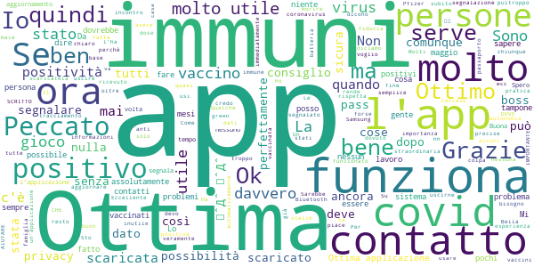

# Immuni
App version ``2.4.0``

Analyzed with [covid-apps-observer](http://github.com/covid-apps-observer) project, version ``0.1``

## App overview
| | |
|-------------------------|-------------------------| 
| **Name**                                          | Immuni |
| **Unique identifier** | it.ministerodellasalute.immuni |
| **Link to Google Play** | [https://play.google.com/store/apps/details?id=it.ministerodellasalute.immuni](https://play.google.com/store/apps/details?id=it.ministerodellasalute.immuni) |
| **Summary**  | App ufficiale per le notifiche di esposizione in Italia |
| **Privacy policy** | [https://www.immuni.italia.it/app-pn.html](https://www.immuni.italia.it/app-pn.html) |
| **Latest version** | 2.4.0 |
| **Last update** | 2021-04-07 10:02:12 |
| **Recent changes** | - Nuova funzionalità per segnalare la positività in autonomia per l&#39;utente e per verificare e caricare le informazioni. - Aggiornate FAQ sulla segnalazione di positività, UI e testi. |
| **Installs**  | 5.000.000+ |
| **Category** | Medicina |
| **First release** | 1 giu 2020 |
| **Size**  | 29M |
| **Supported Android version**  | 6.0 e versioni successive |

### Description
> Immuni è l’app ufficiale per le notifiche di esposizione del governo italiano, sviluppata dal Commissario Straordinario per l’Emergenza COVID-19 in collaborazione con il Ministero della Salute e il Ministero per l’Innovazione Tecnologica e la Digitalizzazione. L’app è sviluppata e rilasciata nel pieno rispetto della protezione dei dati personali dell’utente e della normativa vigente, incluso il decreto-legge del 30 aprile 2020, n. 28.
 Nella lotta all’epidemia di COVID-19, l’app aiuta a notificare gli utenti potenzialmente contagiati il prima possibile, anche quando sono asintomatici. Questi utenti possono poi isolarsi per evitare di contagiare altri, con l’effetto di minimizzare la diffusione del virus e velocizzare il ritorno a una vita normale per la maggior parte della popolazione. Venendo informati tempestivamente, inoltre, gli utenti possono anche contattare il proprio medico di medicina generale, riducendo così il rischio di complicanze.
 Il sistema di notifiche di esposizione di Immuni si basa sulla tecnologia Bluetooth Low Energy, creata per essere particolarmente efficiente in termini di risparmio energetico, e non utilizza alcun tipo di dato di geolocalizzazione, inclusi quelli del GPS. L’app non raccoglie e non è in grado di ottenere alcun dato che identifichi l’utente, quali nome, cognome, data di nascita, indirizzo, numero di telefono o indirizzo email. Immuni riesce quindi a determinare che un contatto fra due utenti è avvenuto, ma non chi siano effettivamente i due utenti o dove si siano incontrati.
 Ecco una lista di alcune delle misure con cui Immuni protegge i dati degli utenti:
 • I dati raccolti sono quelli minimi, strettamente necessari per supportare e migliorare il sistema di notifiche di esposizione.
 • Il codice Bluetooth Low Energy trasmesso dall’app è generato in maniera casuale e non contiene alcuna informazione riguardo allo smartphone dell’utente, tanto meno sull’utente stesso. Inoltre, questo codice cambia svariate volte ogni ora, per tutelare ancora meglio la privacy dell’utente.
 • I dati salvati sullo smartphone sono cifrati.
 • Le connessioni tra l’app e il server sono cifrate.
 • Tutti i dati, siano essi salvati sul dispositivo o sul server, saranno cancellati non appena non saranno più necessari e in ogni caso non oltre il 31 dicembre 2021.
 • È il Ministero della Salute il soggetto che raccoglie i dati e che decide per quali scopi utilizzarli. In ogni caso, i dati verranno usati solo per contenere l’epidemia del COVID-19 e per la ricerca scientifica.
 • I dati sono salvati su server in Italia e gestiti da soggetti pubblici.

 Immuni non fa e non può fare diagnosi. Sulla base dello storico dei contatti con utenti potenzialmente contagiosi, Immuni elabora alcune raccomandazioni su come è necessario comportarsi. Ma l’app non è un dispositivo medico e non può in alcun caso sostituire un medico.
 Immuni è uno strumento importante nella lotta a questa terribile epidemia e ciascun utente ne aumenta l’efficacia complessiva. Per questo consigliamo vivamente di installare l’app, usarla correttamente e incoraggiare parenti e amici a fare lo stesso. Tuttavia, non c’è alcun obbligo di utilizzo. La decisione spetta soltanto all’individuo.

### User interface
The developers of the app provide the following screenshots in the Google play store.
| | | |
|:-------------------------:|:-------------------------:|:-------------------------:|
 |   |   |   | 
 |  

## Development team
In the following we report the main information provided by the development team in the Google play store.

| | |
|-------------------------|-------------------------|
| **Developer**  | Ministero della Salute |
| **Website**  | [https://www.immuni.italia.it/](https://www.immuni.italia.it/) |
| **Email** | cittadini@immuni.italia.it |
| **Physical address**  | - |
| **Other developed apps**  | [https://play.google.com/store/apps/developer?id=Ministero+della+Salute](https://play.google.com/store/apps/developer?id=Ministero+della+Salute) |

## Android support

| | |
|-------------------------|-------------------------|
| **Declared target Android version**  | Android10, version 10 (API level 29) |
| **Effective target Android version**  | Android10, version 10 (API level 29) |
| **Minimum supported Android version**  | Marshmallow, version 6.0 (API level 23) |
| **Maximum target Android version**  | - |

The larger the difference between the minimum and maximum supported Android versions, the better. A larger difference means a wider audience. For example, old phones have a very low Android version, so a high minimum supported Android version means that the app cannot be used by users with old phones, thus leading to accessibility problems. 

## Requested permissions

In the following we report the complete list of the permissions requested by the app. 

| **Permission** | **Protection level** | **Description** | 
|-------------------------|-------------------------|-------------------------|
 **android.permission ACCESS_NETWORK_STATE** | Normal | Allows applications to access information about networks. 
 **android.permission BLUETOOTH** | Normal | Allows applications to connect to paired bluetooth devices. 
 **android.permission FOREGROUND_SERVICE** | Normal | Allows a regular application to use Service.startForeground. 
 **android.permission INTERNET** | Normal | Allows applications to open network sockets. 
 **android.permission RECEIVE_BOOT_COMPLETED** | Normal | Allows an application to receive the Intent.ACTION_BOOT_COMPLETED that is broadcast after the system finishes booting. 
 **android.permission WAKE_LOCK** | Normal | Allows using PowerManager WakeLocks to keep processor from sleeping or screen from dimming. 

## Mentioned servers

| **Server** | **Registrant** | **Registrant country** | **Creation date** | 
|-------------------------|-------------------------|-------------------------|-------------------------|
 | google.com | Google LLC | :us: US | 1997-09-15 04:00:00 |
 | googleapis.com | Google LLC | :us: US | 2005-01-25 17:52:26 |
 | italia.it | Presidenza del Consiglio dei Ministri | :it: IT | 2004-06-03 00:00:00 |

## Security analysis 

Below we report the main security warnings raised by our execution of the [Androwarn](https://github.com/maaaaz/androwarn) security analysis tool.

**Connection interfaces exfiltration**
> - This application reads details about the currently active data network 
> - This application tries to find out if the currently active data network is metered 

**Telephony services abuse**
> - This application makes phone calls 

**Suspicious connection establishment**
> - This application opens a Socket and connects it to the remote address ' returned no addresses for  ; port is out of range' on the 'N/A' port  
> - This application opens a Socket and connects it to the remote address '' on the 'N/A' port  
> - This application opens a Socket and connects it to the remote address 'Ljava/lang/StringBuilder;->toString()Ljava/lang/String;' on the 'N/A' port  
> - This application opens a Socket and connects it to the remote address 'Ljava/net/Proxy;->type()Ljava/net/Proxy$Type;' on the 'N/A' port  
> - This application opens a Socket and connects it to the remote address 'Method sendUrgentData() is not supported.' on the 'N/A' port  
> - This application opens a Socket and connects it to the remote address 'Method setHandshakeTimeout() is not supported.' on the 'N/A' port  
> - This application opens a Socket and connects it to the remote address 'Method setOOBInline() is not supported.' on the 'N/A' port  
> - This application opens a Socket and connects it to the remote address 'Method setSoWriteTimeout() is not supported.' on the 'N/A' port  
> - This application opens a Socket and connects it to the remote address 'Socket closed' on the 'N/A' port  
> - This application opens a Socket and connects it to the remote address 'Socket is closed' on the 'N/A' port  
> - This application opens a Socket and connects it to the remote address 'Socket is closed.' on the 'N/A' port  
> - This application opens a Socket and connects it to the remote address 'Socket is not connected.' on the 'N/A' port  
> - This application opens a Socket and connects it to the remote address 'socket is closed' on the 'N/A' port  
> - This application opens a Socket and connects it to the remote address 'timeout' on the 'N/A' port  

**Code execution**
> - This application loads a native library: 'conscrypt_gmscore_jni' 
> - This application loads a native library: 'conscrypt_jni' 

## User ratings and reviews

Below we provide information about how end users are reacting to the app in terms of ratings and reviews in the Google Play store.

### Ratings

The Immuni app has been installed by more than **5000000** times. At this time, **47128** rated the app and its average score is **2.3650591**. Below we show the distribution of the ratings across the usual star-based rating of Google Play

:star::star::star::star::star:: 12540

:star::star::star::star:: 2262

:star::star::star:: 2252

:star::star:: 2880

:star:: 27194

### Reviews 

#### 5-star reviews

> Ed è bellissimo questo gioco di parole  :date: __2021-05-12 17:30:41__

> Sono ricoverata con covid 19 io dal 4 maggio a Carmagnola e mio marito dal 3 maggio a Chieri abbiamo il casco ma ben curati e molto fiduciosi.  :date: __2021-05-12 11:15:24__

> Ottimi informazioni  :date: __2021-05-11 13:49:06__

> Ottimo  :date: __2021-05-10 19:51:21__

> Bella  :date: __2021-05-10 13:38:13__

> Per me è utile  :date: __2021-05-09 14:27:41__

> Ha funzionato perfettamente. Ho inviato un autonomia il codice del mio tampone positivo autorizzando la diffusione della mia chiave anonima ai contatti avuti negli ultimi 14 giorni. Peccato che la gente non la usi.  :date: __2021-05-09 04:29:22__

> Utile  :date: __2021-05-08 19:22:52__

> Se funziona tutto correttamente va bene altrimenti sono soldi spesi maleFate le cose più semplici e non farraginose  :date: __2021-05-07 12:26:31__

> Ok funziona bene (io sono immune, perché Vaccinato)  :date: __2021-05-05 20:26:26__

#### 4-star reviews

> Bella idea ma peccato non la usi nessuno, comprese le istituzioni  :date: __2021-05-12 20:43:58__

> Può essere utile ma soli se usata correttamente  :date: __2021-05-11 14:35:28__

> Più che altro è se riesce a rintracciare il primo contatto che può non essere avvenuto in famiglia  :date: __2021-05-08 13:27:42__

> Autodidatta novità sempre e!  :date: __2021-05-07 11:57:32__

> Il Portogallo è un Paese europeo...  :date: __2021-05-05 10:54:23__

> Peccato che non sia stata scaricata dalla massa.😪  :date: __2021-05-04 18:32:08__

> Enricobonito  :date: __2021-05-03 20:26:26__

> L avessero scaricata tutti sarebbe stato meglio  :date: __2021-04-30 17:24:40__

> Mammozzetti con le spalle troppo grosse.  :date: __2021-04-30 07:56:36__

> Funziona?  :date: __2021-04-29 18:24:48__

#### 3-star reviews

> Questa app NON MI È SERVITA A NULLA! E dire che lavorando in Sanità l'ho sponsorizzata senza dubbi! (Non ho avuto Covid e sono vaccinata da gennaio 21) Lascio la prima recensione qui sotto. Ma forse devo essere screenata (=aver fatto un tampone) x essere avvisata di un possibile contagio??? E, quindi, aver comunicato il mio codice (che mi da l'applicazione) ??? A chi operatore sanitario??? ... Cioè che devo fare??? Non è chiara non è semplice!!!  :date: __2021-05-11 10:19:11__

> Gameplay ripetitivo e ci sono poche attività da svolgere, 4/10 Storia completamente assente, fornisce solo un po' di contesto sulla situazione, 2/10 La grafica non è nulla di speciale, ma buona, 7/10  :date: __2021-05-09 20:03:34__

> Funziona solo in alcuni paesi europei.  :date: __2021-05-08 18:18:36__

> Si Blocca molto spesso  :date: __2021-05-07 15:04:01__

> App in se semplice e non pesante, purtroppo totalmente inutile vista la scarsa diffusione.  :date: __2021-05-04 10:09:56__

> Sono stato uno dei primi a utilizzare'App da quando é uscita e sono un operatore sanitario che ho avuto contatti con contagiati e sono anche entrato in reparti Covid ospedalieri e non ho mai ricecevuto una segnalazione  :date: __2021-05-01 12:49:03__

> Non è possibile che migliorare il municipio al livello 9 impieghi così tanto sul serio miglioratelo senza contare l'elisir nero o migliorate o disinstallo Clash  :date: __2021-04-28 13:47:05__

> Volevo sapere se sarà implementata la funzione di avvenuta vaccinazione Grazie  :date: __2021-04-28 11:09:21__

> Spero sia più utile ora che è stato semplificato il meccanismo di segnalazione positività  :date: __2021-04-25 16:55:30__

> Buona  :date: __2021-04-25 12:40:58__

#### 2-star reviews

> Ho avuto il covid 19 o coronavirus ma questa app. Non mi ha avvisato. Perche?  :date: __2021-05-08 15:16:29__

> Sarà perché poco diffusa ma la trovo inutile. Sono stato in ambienti con persone positive senza alcuna segnalazione.  :date: __2021-05-02 21:07:05__

> Ottima idea ma purtroppo nella realtà si è rivelata un flop...  :date: __2021-05-02 07:14:11__

> Purtroppo si disattiva autonomamente, e per lunghi mesi non ha avuto la notifica di inattività. Aldilà della tecnologia con cui vengono tracciati i contatti, se sia più o meno sicura dal punto di vista della privacy, per quanto mi riguarda l'unica cosa importante è che sia attiva sempre e che contribuisca al monitoraggio dei contatti con persone contagiate. Si è rivelata assolutamente inadeguata.  :date: __2021-05-01 14:06:47__

> Non fa vedere niente dice che funziona ma non si capice come.  :date: __2021-05-01 09:32:52__

> Mai avvisato sempre installata?  :date: __2021-04-30 22:31:05__

> Dico subito che questa app (dato che la sua efficacia è legata ad una sua ampia diffusione) doveva nascere con uno strumento facile-facile da implementare: un bottone con la scritta "condividi". Agg. (un anno dopo) Vivo il lombardia e giro parecchio. Con tutti i casi che ci sono qui questa app avrebbe dovuto squillare e lanciare allarmi tutto il giorno tutti i giorni e invece mai una singola segnalazione. Non potevate investire questi soldi per farvi mettere una piscina im giardino?  :date: __2021-04-30 08:17:46__

> L'app in sé e per sé funziona, ma visto che non è stata mai gestita al meglio delle sue grandi potenzialità, sono costretto a disinstallarla  :date: __2021-04-28 23:47:27__

> Lo sempre accesa ma non mi ha segnalato mai niente  :date: __2021-04-28 19:46:17__

> Scarica fin dai primi giorni, purtroppo è quasi inutile e dopo quasi un' anno la disinstallo, bisognava impostarlo e spiegarla meglio.  :date: __2021-04-27 11:15:14__

#### 1-star reviews

> Una cavoltata Number One  :date: __2021-05-13 14:56:19__

> Ahah  :date: __2021-05-13 13:22:01__

> È totalmente inutile, considerando la presso che nulla adesione da parte della popolazione.  :date: __2021-05-13 10:49:29__

> Una grandissima presa per il culo, non serve proprio a niente e non ci credo più a sta stronzata del COVID, tamponi tutti programmati, andate a cagare.  :date: __2021-05-13 08:04:28__

> Mai avuto alcuna segnalazione di contatto  :date: __2021-05-13 07:49:02__

> Davvero ancora esiste questa app? Bell esempio di qualità italiana  :date: __2021-05-13 00:25:42__

> Le solite schifezze all'italiana... Già di per sé per come è stata strutturata non serve a niente... Nel frattempo se vuoi segnalare positività devi fare un enorme trafila sempre se non ricevi qualche errore dall'app come è successo a me per segnalare positività di un familiare, nella migliore delle ipotesi devi chiamare un qualcuno che non ti risponderà mai... Dimenticavo a qualcosa serve, a consumare batteria 🔋🔋🔋  :date: __2021-05-13 00:00:02__

> Non serve a niente  :date: __2021-05-12 22:05:45__

> Inutile...nessun tracciamento! Quando ho avuto il covid non ho avuto modo di segnalare un bel niente!  :date: __2021-05-12 21:41:46__

> Non funziona ancora! Ad oggi, 10 gennaio 2021, non ha ancora dato segni di vita E continua a non funzionare.  :date: __2021-05-12 20:34:32__

