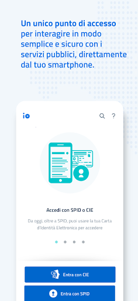
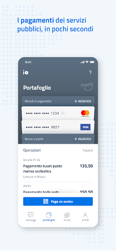

# IO, l'app dei servizi pubblici
App version ``1.10.0.5``

Analyzed with [covid-apps-observer](http://github.com/covid-apps-observer) project, version ``0.1``

## App overview
| | |
|-------------------------|-------------------------| 
| **Name**&nbsp;&nbsp;&nbsp;&nbsp;&nbsp;&nbsp;&nbsp;&nbsp;&nbsp;&nbsp;&nbsp;&nbsp;&nbsp;&nbsp;&nbsp;&nbsp;&nbsp;&nbsp;&nbsp;&nbsp;&nbsp;&nbsp;&nbsp;&nbsp;&nbsp;&nbsp;&nbsp;&nbsp;&nbsp;&nbsp;&nbsp;&nbsp;&nbsp;&nbsp;&nbsp;&nbsp;&nbsp;&nbsp;&nbsp;&nbsp;  | IO, l'app dei servizi pubblici |
| **Unique identifier** | it.pagopa.io.app |
| **Link to Google Play** | [https://play.google.com/store/apps/details?id=it.pagopa.io.app](https://play.google.com/store/apps/details?id=it.pagopa.io.app) |
| **Summary**  | Tutti i servizi della Pubblica Amministrazione a portata di mano. |
| **Privacy policy** | [http://www.governo.it/privacy-policy](http://www.governo.it/privacy-policy) |
| **Latest version** | 1.10.0.5 |
| **Last update** | 2020-12-02 14:11:34 |
| **Recent changes** | - ora vengono mostrati i metodi di pagamento supportati in arrivo - ora viene mostrato un carosello nella sezione portafoglio che mostra i bonus disponibili - ora quando si aggiunge una carta di credito il campo titolare è precompilato con nome e cognome del cittadino ed è editabile - UI migliorata |
| **Installs**  | 1.000.000+ |
| **Category** | Comunicazione |
| **First release** | 16 apr 2020 |
| **Size**  | 19M |
| **Supported Android version**  | 4.4 e versioni successive |

### Description
> IO permette di interagire facilmente e in modo sicuro con diverse Pubbliche Amministrazioni italiane, locali o nazionali, raccogliendo tutti i loro servizi, comunicazioni e pagamenti e in un'unica app. 
 In particolare tramite IO potrai:  
 - ricevere messaggi e comunicazioni rilevanti dagli enti pubblici, locali o nazionali;
 - ricordare e gestire le tue scadenze verso la Pubblica Amministrazione, aggiungendo i promemoria direttamente nel tuo calendario personale;
 - ricevere avvisi di pagamento, con la possibilità di pagare servizi e tributi dall’app in pochi secondi (direttamente dal messaggio o tramite scansione QR dell’avviso cartaceo);
 - tenere traccia dei tuoi pagamenti verso la Pubblica Amministrazione, grazie allo storico delle operazioni svolte.
 Per iniziare a utilizzare IO, devi registrarti con le tue credenziali SPID o, in alternativa, con la tua Carta d’Identità Elettronica (CIE). In seguito alla prima registrazione, potrai accedere più facilmente digitando il PIN scelto da te o tramite riconoscimento biometrico (impronta digitale o riconoscimento del volto), mantenendo un'autenticazione sicura. 
 IO è un progetto che cresce giorno dopo giorno, anche grazie ai feedback dei cittadini: se nell'utilizzarla vedi qualcosa che non funziona o che pensi possa essere migliorato, puoi segnalarlo attraverso gli appositi strumenti presenti in app. 
 Molte nuove funzionalità verranno rilasciate nei prossimi mesi: segui la roadmap di progetto sul sito io.italia.it

### User interface
The developers of the app provide the following screenshots in the Google play store.
| | | |
|:-------------------------:|:-------------------------:|:-------------------------:|
 |   |   |   | 
 |   |   |   | 

## Development team
In the following we report the main information provided by the development team in the Google play store.

| | |
|-------------------------|-------------------------|
| **Developer**  | PagoPA S.p.A. |
| **Website**  | [https://io.italia.it](https://io.italia.it) |
| **Email** | android-account@pagopa.it |
| **Physical address**  | - |
| **Other developed apps**  | [https://play.google.com/store/apps/developer?id=PagoPA+S.p.A.](https://play.google.com/store/apps/developer?id=PagoPA+S.p.A.) |

## Android support

| | |
|-------------------------|-------------------------|
| **Declared target Android version**  | Android10, version 10 (API level 29) |
| **Effective target Android version**  | Android10, version 10 (API level 29) |
| **Minimum supported Android version**  | KitKat, version 4.4 - 4.4.4 (API level 19) |
| **Maximum target Android version**  | - |

The larger the difference between the minimum and maximum supported Android versions, the better. A larger difference means a wider audience. For example, old phones have a very low Android version, so a high minimum supported Android version means that the app cannot be used by users with old phones, thus leading to accessibility problems. 

## Requested permissions

In the following we report the complete list of the permissions requested by the app. 

| **Permission** | **Protection level** | **Description** | 
|-------------------------|-------------------------|-------------------------|
 **android.permission ACCESS_NETWORK_STATE** | Normal | Allows applications to access information about networks. 
 **android.permission ACCESS_WIFI_STATE** | Normal | Allows applications to access information about Wi-Fi networks. 
 **android.permission CAMERA** | :warning:**Dangerous** | Required to be able to access the camera device. 
 **android.permission FOREGROUND_SERVICE** | Normal | Allows a regular application to use Service.startForeground. 
 **android.permission INTERNET** | Normal | Allows applications to open network sockets. 
 **android.permission MODIFY_AUDIO_SETTINGS** | Normal | Allows an application to modify global audio settings. 
 **android.permission NFC** | Normal | Allows applications to perform I/O operations over NFC. 
 **android.permission READ_APP_BADGE** | - | - 
 **android.permission READ_CALENDAR** | :warning:**Dangerous** | Allows an application to read the user's calendar data. 
 **android.permission READ_EXTERNAL_STORAGE** | :warning:**Dangerous** | Allows an application to read from external storage. 
 **android.permission RECEIVE_BOOT_COMPLETED** | Normal | Allows an application to receive the Intent.ACTION_BOOT_COMPLETED that is broadcast after the system finishes booting. 
 **android.permission USE_FINGERPRINT** | Normal | This constant was deprecated in API level 28. Applications should request USE_BIOMETRIC instead 
 **android.permission VIBRATE** | Normal | Allows access to the vibrator. 
 **android.permission WAKE_LOCK** | Normal | Allows using PowerManager WakeLocks to keep processor from sleeping or screen from dimming. 
 **android.permission WRITE_CALENDAR** | :warning:**Dangerous** | Allows an application to write the user's calendar data. 
 **android.permission WRITE_EXTERNAL_STORAGE** | :warning:**Dangerous** | Allows an application to write to external storage. 
 **com.anddoes.launcher.permission UPDATE_COUNT** | - | - 
 **com.google.android.c2dm.permission RECEIVE** | - | - 
 **com.google.android.finsky.permission BIND_GET_INSTALL_REFERRER_SERVICE** | - | - 
 **com.htc.launcher.permission READ_SETTINGS** | - | - 
 **com.htc.launcher.permission UPDATE_SHORTCUT** | - | - 
 **com.huawei.android.launcher.permission CHANGE_BADGE** | - | - 
 **com.huawei.android.launcher.permission READ_SETTINGS** | - | - 
 **com.huawei.android.launcher.permission WRITE_SETTINGS** | - | - 
 **com.majeur.launcher.permission UPDATE_BADGE** | - | - 
 **com.oppo.launcher.permission READ_SETTINGS** | - | - 
 **com.oppo.launcher.permission WRITE_SETTINGS** | - | - 
 **com.sec.android.provider.badge.permission READ** | - | - 
 **com.sec.android.provider.badge.permission WRITE** | - | - 
 **com.sonyericsson.home.permission BROADCAST_BADGE** | - | - 
 **com.sonymobile.home.permission PROVIDER_INSERT_BADGE** | - | - 
 **me.everything.badger.permission BADGE_COUNT_READ** | - | - 
 **me.everything.badger.permission BADGE_COUNT_WRITE** | - | - 

## Mentioned servers

| **Server** | **Registrant** | **Registrant country** | **Creation date** | 
|-------------------------|-------------------------|-------------------------|-------------------------|
 | apache.org | The Apache Software Foundation | :us: US | 1995-04-11 04:00:00 |
 | xml.org | OASIS Open | :us: US | 1997-02-03 05:00:00 |
 | w3.org | W3C | :us: US | 1994-07-06 04:00:00 |
 | purl.org | Internet Archive | :us: US | 1996-01-01 05:00:00 |
 | adobe.com | Adobe Inc. | :us: US | 1986-11-17 05:00:00 |
 | android.com | Google LLC | :us: US | 1997-06-23 04:00:00 |
 | googlesyndication.com | Google LLC | :us: US | 2003-01-21 06:17:24 |
 | google.com | Google LLC | :us: US | 1997-09-15 04:00:00 |
 | iptc.org | Whois Privacy Service | :us: US | 1995-12-27 05:00:00 |
 | useplus.org | PLUS COALITION | :us: US | 2003-11-18 19:31:25 |
 | npes.org | NPES | :us: US | 1996-01-30 05:00:00 |
 | aiim.org | Association for Information and Image Management International | :us: US | 1995-10-18 04:00:00 |
 | app-measurement.com | Google LLC | :us: US | 2015-06-19 20:13:31 |
 | instabug.com | - | :us: US | 2000-05-16 23:13:25 |
 | facebook.com | Facebook, Inc. | :us: US | 1997-03-29 05:00:00 |
 | pinterest.com | DNStination Inc. | :us: US | 2009-11-26 19:21:23 |
 | twitter.com | Twitter, Inc. | :us: US | 2000-01-21 16:28:17 |
 | drewnoakes.com | REDACTED FOR PRIVACY | GB | 2002-04-04 10:00:05 |
 | googleapis.com | Google LLC | :us: US | 2005-01-25 17:52:26 |
 | mixpanel.com | WhoisGuard, Inc. | PA | 2007-03-13 02:23:00 |
 | googleadservices.com | Google LLC | :us: US | 2003-06-19 16:34:53 |
 | maven.org | Whois Privacy Service | :us: US | 2001-06-30 10:38:24 |

## Security analysis 

Below we report the main security warnings raised by our execution of the [Androwarn](https://github.com/maaaaz/androwarn) security analysis tool.

**Telephony identifiers leakage**
> - This application reads the device phone type value 
> - This application reads the numeric name (MCC+MNC) of current registered operator 
> - This application reads the operator name 
> - This application reads the phone number string for line 1, for example, the MSISDN for a GSM phone 

**Location lookup**
> - This application reads location information from all available providers (WiFi, GPS etc.) 

**Connection interfaces exfiltration**
> - This application reads details about the currently active data network 
> - This application tries to find out if the currently active data network is metered 

**Audio video eavesdropping**
> - This application records audio from the 'CAMCORDER' source  
> - This application records audio from the 'MIC' source  
> - This application captures video from the 'CAMERA' source 
> - This application captures video from the 'SURFACE' source 

**Suspicious connection establishment**
> - This application opens a Socket and connects it to the remote address '' on the 'N/A' port  
> - This application opens a Socket and connects it to the remote address 'Ljava/lang/StringBuilder;->toString()Ljava/lang/String;' on the ': connect, resolve' port  
> - This application opens a Socket and connects it to the remote address 'Ljava/lang/StringBuilder;->toString()Ljava/lang/String;' on the 'N/A' port  
> - This application opens a Socket and connects it to the remote address 'Ljava/net/Proxy;->type()Ljava/net/Proxy$Type;' on the 'N/A' port  
> - This application opens a Socket and connects it to the remote address 'timeout' on the 'N/A' port  

**Pim data leakage**
> - This application accesses the downloads folder 
> - This application accesses data stored in the clipboard 

**Code execution**
> - This application loads a native library 
> - This application loads a native library: 'Ljava/util/Iterator;->next()Ljava/lang/Object;' 
> - This application loads a native library: 'constant' 
> - This application loads a native library: 'tool-checker' 
> - This application executes a UNIX command 
> - This application executes a UNIX command containing this argument: '' 
> - This application executes a UNIX command containing this argument: 'Ljava/io/File;->isFile()Z' 
> - This application executes a UNIX command containing this argument: 'getprop' 
> - This application executes a UNIX command containing this argument: 'mount' 

## User ratings and reviews

Below we provide information about how end users are reacting to the app in terms of ratings and reviews in the Google Play store.

### Ratings

The IO, l'app dei servizi pubblici app has been installed by more than **1000000** times. At this time, **7251** rated the app and its average score is **1.9814241**. Below we show the distribution of the ratings across the usual star-based rating of Google Play

:star::star::star::star::star:: 1040

:star::star::star::star:: 516

:star::star::star:: 419

:star::star:: 568

:star:: 4708

### Reviews 

#### 5-star reviews

> Tutte le funzioni dichiarate come utilizzabili a me risultano esserlo, senza rallentamenti o simili. Nei giorni scorsi, basta leggere i tweet ufficiali, si sono verificati alcuni rallentamenti dovuti all'implementazione di nuove funzionalità e solo su quei servizi. Per me, che seguo l'iniziativa fin dagli albori, resta una grande iniziativa con un importante obbiettivo. Invito tutti a leggere la roadmap pubblica.  :date: __2020-12-05 14:52:19__

> In attesa di tutte le funzionalità possibili  :date: __2020-12-05 14:42:05__

> Ottima chiara e semplice da usare.  :date: __2020-12-05 14:37:15__

> Tutto ok!  :date: __2020-12-05 14:22:36__

> Fantastica  :date: __2020-12-05 14:07:10__

> Pessima  :date: __2020-12-05 13:57:36__

> Ottimo per pagare finalmente il bollo auto rimanendo a casa  :date: __2020-12-05 13:06:27__

> Provato ad aggiungere 4 carte di tipologia diversa senza alcun esito positivo. Scritto in chat per ricevere assistenza, da 3 giorni nessuno risponde.  :date: __2020-12-05 12:50:23__

> Scaricata mesi fa, se la usate ora sicuramente noterete dei lag, si sta collegando tutta italia ai soliti server non pronti a ricevere milioni di accessi L app funziona molto bene, ora serve solo un po' di pazienza Utile per molti servizi, tra cui pagamento dei pagopa per tasse universitarie, pagamento bollo auto ecc... appena sarà attivo il cashback sarà ancor più utile Consigliata, non fatevi spaventare dalle recensioni di chi si lamenta e basta  :date: __2020-12-05 12:13:27__

> Molto migliorata con gli ultimi aggiornamenti  :date: __2020-12-05 12:12:38__

#### 4-star reviews

> Molto utile vediamo più avanti  :date: __2020-12-05 14:33:30__

> Sta migliorando... Intanto suggerisco di permettere di dare un "nome" personalizzato alle forme di pagamento. Registrandone diverse non sempre ci si ricorda dal dal codice qual'è la bancaria, la prepagata o la postepay  :date: __2020-12-05 14:21:32__

> Mi sembra buona e leggera  :date: __2020-12-05 13:52:07__

> Mi sono iscritto in un attimo perché avevo già lo spid. La carta è stata subito riconosciuta, ma sono consapevole di essere stato molto, ma molto fortunato. Ho provato ad installare la stessa app ad amici e conoscenti, ad ognuno di loro c'era un problema o sul codice pin della CIE o sulle credenziali spid. Ecco il motivo delle 4 stelle, bene , ma non benissimo  :date: __2020-12-05 13:48:12__

> Aspettiamo upgrade per cashback.  :date: __2020-12-05 12:51:35__

> Nessun problema, installazione rapida, carte comprese, l unica pecca, servizi a livello locale miseri spero in un eventuale implementazione.  :date: __2020-12-05 12:46:06__

> L'app é lenta. Bisogna solo migliorarla. L'idea é buona  :date: __2020-12-05 12:43:49__

> Nessun problema per registrarsi, velocissimo con spid, ora in attesa di funzione cashback.... Una cosa pubblica che pare funzionare.  :date: __2020-12-05 12:24:43__

> non riesco a capire se il versamento di 0,02 è stato effettuato o meno.  :date: __2020-12-05 11:29:49__

> Niente male questa app, poco servizi ancora attivi ma con un buon potenziale. Speriamo non diventi un'altro strumento dello stato inutile Apprezzo la facilità e la chiarezza di utilizzo  :date: __2020-12-05 09:47:36__

#### 3-star reviews

> Problemi di accesso sia con Spid che con Cie  :date: __2020-12-05 14:36:34__

> L'applicazione è ottima solo che sono uscita per poi rientrarci ed è da 5 ore che non mi fa accedere, mi richiede spid metto le credenziali e poi mi dice che devo installare IO quando è già installata. Spero risolviate tutto, forse è solo un problema di intesa utilizzo di questa app in questi giorni.  :date: __2020-12-05 14:32:08__

> Consideriamola una versione sperimentale e speriamo che migliori. L'idea è buona. Per ora la trovo piuttosto lenta (forse si appoggia a server sottodimensionati ?) e scarna di servizi e contenuti che spero si vadano ad aggiungere in futuro. Spero poi che ci sia una riduzione delle notifiche a regime.  :date: __2020-12-05 13:48:01__

> Può e deve migliorare!  :date: __2020-12-05 12:54:34__

> @Patrizia:"Devi averie una fortuna sfacciata, io tutta stamattina che ci provo e dopo 10 di carica diventa solo una pagina bianca e cosi rimane.Dopo mezz'ora di attesa inizio di nuovo ma sempre la stessa cosa.Se scrivi dove abiti ti porto il mio cellulare magari con la tua fortuna.....riesco ad entrare. Dopo averti nominato ho riprovato e miracolosamente sono entrato!!!! Non mi scarica solo i servizi spero che lo farà in seguito. Ora metto 3 stelle  :date: __2020-12-05 12:05:23__

> Oggi finalmente sono riuscito a registrare la mia Postepay. Nei giorni scorsi mi dava sempre errore. Ancora è molto lento al primo accesso e ad accedere al menù portafoglio.  :date: __2020-12-05 11:45:05__

> Se devo scrivere la mia esperienza non darei nemmeno una stella, non funziona facendo accesso con SPID anche solo a rimandare all'accesso di quest'ultimo ci vuole del tempo per poi ritornare all app che va in crash per il troppo tempo di elaborazione. Non so se solo questione di app visto che è beta perché leggendo le recensioni altri sono riusciti nel loro intento, o entrano in gioco altre variabili. Cmq un inizio ma si deve fare in fretta per un buon servizio gli spunti da altri ci sono forza  :date: __2020-12-05 11:43:30__

> Non capisco perché per poter partecipare al programma cash back sono richiesti oltre al Pan anche la data scadenza e il cvv che sono dati da utizzare quando si fanno pagamenti. Non sarebbe sufficiente il PAN per monitorare le transazioni fatte sui pos dei negozi?  :date: __2020-12-05 11:34:34__

> Quando la apro viene una pagina azzurra con scritto inizializzazione e no si muove piu  :date: __2020-12-05 11:03:54__

> Da ieri non riesco piu a entrare ci mette molto a caricare la pagina e una volta entrato non riesco a visualizzare le carte gia caricate che fino a ieri visualizzavo tranquillamente.  :date: __2020-12-05 10:44:35__

#### 2-star reviews

> È di una lentezza imbarazzante e si blocca in continuazione. Speriamo che nella versione definitiva funzioni meglio. Ma ho paura che sarà la solita app della pubblica amministrazione, lenta, complicata e inutile. Spero di sbagliarmi. Questo commento vuole essere una critica costruttiva per fare meglio è non continuare ad essere i soliti italiani pasta, pizza e mandolino... Mentre tutto il mondo va avanti. Buona l'idea ora realizziamola bene.  :date: __2020-12-05 14:47:49__

> Inserendo il metodo di pagamento la carta di credito senza problemi, il bancomat mi dice che è impossibile ad inserire nonostante dal app della banca autorizzazione concessa.  :date: __2020-12-05 14:45:30__

> Mi chiedo perché le app pubbliche siano lente ... 10 minuti per fare un login a dir poco imbarazzante, provo ad aggiungere il metodo di pagamento e sul più bello compare "sessione scaduta" e pensare che ho accettato dopo 10 secondi... Spero che migliori nel tempo essendo beta  :date: __2020-12-05 14:44:02__

> Non riesco ad accedere all'app.  :date: __2020-12-05 14:40:25__

> Non riesco ad accedere all'app.  :date: __2020-12-05 14:39:10__

> Le modalità d'accesso sono semplici ma instabili! È auspicabile a breve il superamento di questa fase beta con un prodotto affidabile.  :date: __2020-12-05 14:35:44__

> La prima impressione è negativa. La procedura di ingresso via SPID, necessaria ai fini di una corretta identificazione, diventa difficile per via dell'interazione della App con quella del provider SPID (nel mio caso Poste). Il primo tentativo è andato a buon fine. Poi non sono più riuscito ad entrare. Sarebbe consigliabile anche una versione web, con le credenziali Spid emesse via lettura di QR code (esattamente come si fa per entrare nel sito Inps). Molte grazie per l'attenzione.  :date: __2020-12-05 14:25:56__

> Normalmente andava bene, anche se nel mio caso non includeva alcun servizio utile e nel completare il flusso UX mi sembra poco chiaro. Da quando si è detto che dovrebbe essere usata per il cashback di stato, sono iniziati i problemi: caricamento lento (quando carica...) e malfunzionamenti vari. Sarà un caso, ma per attivare il cashback di stato su satispay (sì, è già possibile farlo), sono bastati due tocchi. Solita inefficienza del pubblico rispetto al privato?!?  :date: __2020-12-05 14:02:48__

> Quando arriva sto aggiornamento!  :date: __2020-12-05 13:44:15__

> È già la seconda volta che la installo....peovo a entrare con spid...santa cosa.. ma gira gira.... il caricamento ma nulla! Pff...cvd  :date: __2020-12-05 13:42:41__

#### 1-star reviews

> app penosa...tipico prodotto informatico italiano. quasi impossibile accedere con CIE, richiede NFC (!!!) per riconoscerla. allucinante. Al millesimo tentativo e dopo minuti di attesa mi sono loggato e sono stato reindirizzato ad una pagina bianca da cui si puo' solo uscire dall app. una vergogna totale. una stella perche' non ci sono le stelle negative  :date: __2020-12-05 14:50:16__

> Al momento è praticamente indecente...  :date: __2020-12-05 14:49:57__

> Installata su Samsug Note8 ..sono 2 giorni che mi dice di attendere dopo avere inserito il Pin della CIE ....  :date: __2020-12-05 14:49:49__

> Non mi fa entrare con SPID di Poste Italiane. Mi lascia in caricamento e non entro mai, quindi non posso usufruire del servizio. Assolutamente, pessima APP  :date: __2020-12-05 14:47:53__

> Ennesima dimostrazione della completa mancanza di competenze dell'amministrazione pubblica in ambito informatico. Consiglio alle istituzioni di darecin outsorcing tale ambito ad aziende private capaci. Ad ogni accesso devono essere inserite le credenziali, e da tre giorni non riesco più ad accedere per inserire i dati della carta di credito Esempio di perfetta illogicita' tributaria il fatto che tra i mezzi di pagamento non sia previsto il bancomat. Siamo ai tempi del Commodore  :date: __2020-12-05 14:45:16__

> Per caritá Non ho parole  :date: __2020-12-05 14:45:07__

> E da tre o quattro giorni che sto provando a scaricare App.... Ma gira a vuoto....  :date: __2020-12-05 14:45:01__

> Il giorno dopo aver fatto l'accesso ho provato ad avviarla. Sono 25 minuti che è in fase di inizializzazione ...  :date: __2020-12-05 14:44:59__

> Non funziona.  :date: __2020-12-05 14:43:38__

> Attesa infinita Dopo averla scaricata e avviata, mi richiede di avviare la procedura di riconoscimento tramite Spid. Avvio la procedura e resto un tempo infinito ad aspettare che si apra una pagina per digitare le mie credenziali Spid. La stessa procedura di riconoscimento Spide acceso su altre piattaforme (Poste, Inps...) non è così lenta  :date: __2020-12-05 14:43:25__

