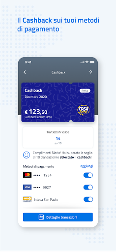

# IO, l'app dei servizi pubblici
App version ``1.20.0.2``

Analyzed with [covid-apps-observer](http://github.com/covid-apps-observer) project, version ``0.1``

## App overview
| | |
|-------------------------|-------------------------| 
| **Name**&nbsp;&nbsp;&nbsp;&nbsp;&nbsp;&nbsp;&nbsp;&nbsp;&nbsp;&nbsp;&nbsp;&nbsp;&nbsp;&nbsp;&nbsp;&nbsp;&nbsp;&nbsp;&nbsp;&nbsp;&nbsp;&nbsp;&nbsp;&nbsp;&nbsp;&nbsp;&nbsp;&nbsp;&nbsp;&nbsp;&nbsp;&nbsp;&nbsp;&nbsp;&nbsp;&nbsp;&nbsp;&nbsp;&nbsp;&nbsp;  | IO, l'app dei servizi pubblici |
| **Unique identifier** | it.pagopa.io.app |
| **Link to Google Play** | [https://play.google.com/store/apps/details?id=it.pagopa.io.app](https://play.google.com/store/apps/details?id=it.pagopa.io.app) |
| **Summary**  | Tutti i servizi della Pubblica Amministrazione a portata di mano. |
| **Privacy policy** | [https://io.italia.it/app-content/tos_privacy.html](https://io.italia.it/app-content/tos_privacy.html) |
| **Latest version** | 1.20.0.2 |
| **Last update** | 2021-02-08 09:31:12 |
| **Recent changes** | La versione più recente risolve vari problemi tecnici e migliora le prestazioni dell&#39;app. |
| **Installs**  | 5.000.000+ |
| **Category** | Comunicazione |
| **First release** | 16 apr 2020 |
| **Size**  | 19M |
| **Supported Android version**  | 4.4 e versioni successive |

### Description
> IO permette di interagire facilmente e in modo sicuro con diverse Pubbliche Amministrazioni italiane, locali o nazionali, raccogliendo tutti i loro servizi, comunicazioni e pagamenti e in un'unica app. 
 In particolare tramite IO potrai:  
 - ricevere messaggi e comunicazioni rilevanti dagli enti pubblici, locali o nazionali;
 - ricordare e gestire le tue scadenze verso la Pubblica Amministrazione, aggiungendo i promemoria direttamente nel tuo calendario personale;
 - ricevere avvisi di pagamento, con la possibilità di pagare servizi e tributi dall’app in pochi secondi (direttamente dal messaggio o tramite scansione QR dell’avviso cartaceo);
 - tenere traccia dei tuoi pagamenti verso la Pubblica Amministrazione, grazie allo storico delle operazioni svolte.
 Per iniziare a utilizzare IO, devi registrarti con le tue credenziali SPID o, in alternativa, con la tua Carta d’Identità Elettronica (CIE). In seguito alla prima registrazione, potrai accedere più facilmente digitando il PIN scelto da te o tramite riconoscimento biometrico (impronta digitale o riconoscimento del volto), mantenendo un'autenticazione sicura. 
 IO è un progetto che cresce giorno dopo giorno, anche grazie ai feedback dei cittadini: se nell'utilizzarla vedi qualcosa che non funziona o che pensi possa essere migliorato, puoi segnalarlo attraverso gli appositi strumenti presenti in app. 
 Molte nuove funzionalità verranno rilasciate nei prossimi mesi: segui la roadmap di progetto sul sito io.italia.it

### User interface
The developers of the app provide the following screenshots in the Google play store.
| | | |
|:-------------------------:|:-------------------------:|:-------------------------:|
 |   |   |   | 
 |   |   |   | 
 |  

## Development team
In the following we report the main information provided by the development team in the Google play store.

| | |
|-------------------------|-------------------------|
| **Developer**  | PagoPA S.p.A. |
| **Website**  | [https://io.italia.it](https://io.italia.it) |
| **Email** | android-account@pagopa.it |
| **Physical address**  | - |
| **Other developed apps**  | [https://play.google.com/store/apps/developer?id=PagoPA+S.p.A.](https://play.google.com/store/apps/developer?id=PagoPA+S.p.A.) |

## Android support

| | |
|-------------------------|-------------------------|
| **Declared target Android version**  | Android10, version 10 (API level 29) |
| **Effective target Android version**  | Android10, version 10 (API level 29) |
| **Minimum supported Android version**  | KitKat, version 4.4 - 4.4.4 (API level 19) |
| **Maximum target Android version**  | - |

The larger the difference between the minimum and maximum supported Android versions, the better. A larger difference means a wider audience. For example, old phones have a very low Android version, so a high minimum supported Android version means that the app cannot be used by users with old phones, thus leading to accessibility problems. 

## Requested permissions

In the following we report the complete list of the permissions requested by the app. 

| **Permission** | **Protection level** | **Description** | 
|-------------------------|-------------------------|-------------------------|
 **android.permission ACCESS_NETWORK_STATE** | Normal | Allows applications to access information about networks. 
 **android.permission ACCESS_WIFI_STATE** | Normal | Allows applications to access information about Wi-Fi networks. 
 **android.permission CAMERA** | :warning:**Dangerous** | Required to be able to access the camera device. 
 **android.permission FOREGROUND_SERVICE** | Normal | Allows a regular application to use Service.startForeground. 
 **android.permission INTERNET** | Normal | Allows applications to open network sockets. 
 **android.permission MODIFY_AUDIO_SETTINGS** | Normal | Allows an application to modify global audio settings. 
 **android.permission NFC** | Normal | Allows applications to perform I/O operations over NFC. 
 **android.permission READ_APP_BADGE** | - | - 
 **android.permission READ_CALENDAR** | :warning:**Dangerous** | Allows an application to read the user's calendar data. 
 **android.permission READ_EXTERNAL_STORAGE** | :warning:**Dangerous** | Allows an application to read from external storage. 
 **android.permission RECEIVE_BOOT_COMPLETED** | Normal | Allows an application to receive the Intent.ACTION_BOOT_COMPLETED that is broadcast after the system finishes booting. 
 **android.permission USE_FINGERPRINT** | Normal | This constant was deprecated in API level 28. Applications should request USE_BIOMETRIC instead 
 **android.permission VIBRATE** | Normal | Allows access to the vibrator. 
 **android.permission WAKE_LOCK** | Normal | Allows using PowerManager WakeLocks to keep processor from sleeping or screen from dimming. 
 **android.permission WRITE_CALENDAR** | :warning:**Dangerous** | Allows an application to write the user's calendar data. 
 **android.permission WRITE_EXTERNAL_STORAGE** | :warning:**Dangerous** | Allows an application to write to external storage. 
 **com.anddoes.launcher.permission UPDATE_COUNT** | - | - 
 **com.google.android.c2dm.permission RECEIVE** | - | - 
 **com.google.android.finsky.permission BIND_GET_INSTALL_REFERRER_SERVICE** | - | - 
 **com.htc.launcher.permission READ_SETTINGS** | - | - 
 **com.htc.launcher.permission UPDATE_SHORTCUT** | - | - 
 **com.huawei.android.launcher.permission CHANGE_BADGE** | - | - 
 **com.huawei.android.launcher.permission READ_SETTINGS** | - | - 
 **com.huawei.android.launcher.permission WRITE_SETTINGS** | - | - 
 **com.majeur.launcher.permission UPDATE_BADGE** | - | - 
 **com.oppo.launcher.permission READ_SETTINGS** | - | - 
 **com.oppo.launcher.permission WRITE_SETTINGS** | - | - 
 **com.sec.android.provider.badge.permission READ** | - | - 
 **com.sec.android.provider.badge.permission WRITE** | - | - 
 **com.sonyericsson.home.permission BROADCAST_BADGE** | - | - 
 **com.sonymobile.home.permission PROVIDER_INSERT_BADGE** | - | - 
 **me.everything.badger.permission BADGE_COUNT_READ** | - | - 
 **me.everything.badger.permission BADGE_COUNT_WRITE** | - | - 

## Mentioned servers

| **Server** | **Registrant** | **Registrant country** | **Creation date** | 
|-------------------------|-------------------------|-------------------------|-------------------------|
 | apache.org | The Apache Software Foundation | :us: US | 1995-04-11 04:00:00 |
 | xml.org | OASIS Open | :us: US | 1997-02-03 05:00:00 |
 | w3.org | W3C | :us: US | 1994-07-06 04:00:00 |
 | purl.org | Internet Archive | :us: US | 1996-01-01 05:00:00 |
 | adobe.com | Adobe Inc. | :us: US | 1986-11-17 05:00:00 |
 | android.com | Google LLC | :us: US | 1997-06-23 04:00:00 |
 | googlesyndication.com | Google LLC | :us: US | 2003-01-21 06:17:24 |
 | google.com | Google LLC | :us: US | 1997-09-15 04:00:00 |
 | iptc.org | Whois Privacy Service | :us: US | 1995-12-27 05:00:00 |
 | useplus.org | PLUS COALITION | :us: US | 2003-11-18 19:31:25 |
 | npes.org | NPES | :us: US | 1996-01-30 05:00:00 |
 | aiim.org | Association for Information and Image Management International | :us: US | 1995-10-18 04:00:00 |
 | app-measurement.com | Google LLC | :us: US | 2015-06-19 20:13:31 |
 | instabug.com | - | :us: US | 2000-05-16 23:13:25 |
 | facebook.com | Facebook, Inc. | :us: US | 1997-03-29 05:00:00 |
 | pinterest.com | DNStination Inc. | :us: US | 2009-11-26 19:21:23 |
 | twitter.com | Twitter, Inc. | :us: US | 2000-01-21 16:28:17 |
 | drewnoakes.com | REDACTED FOR PRIVACY | GB | 2002-04-04 10:00:05 |
 | googleapis.com | Google LLC | :us: US | 2005-01-25 17:52:26 |
 | mixpanel.com | WhoisGuard, Inc. | PA | 2007-03-13 02:23:00 |
 | googleadservices.com | Google LLC | :us: US | 2003-06-19 16:34:53 |
 | maven.org | Whois Privacy Service | :us: US | 2001-06-30 10:38:24 |

## Security analysis 

Below we report the main security warnings raised by our execution of the [Androwarn](https://github.com/maaaaz/androwarn) security analysis tool.

**Telephony identifiers leakage**
> - This application reads the MCC+MNC of the provider of the SIM 
> - This application reads the device phone type value 
> - This application reads the numeric name (MCC+MNC) of current registered operator 
> - This application reads the operator name 
> - This application reads the phone number string for line 1, for example, the MSISDN for a GSM phone 

**Location lookup**
> - This application reads location information from all available providers (WiFi, GPS etc.) 

**Connection interfaces exfiltration**
> - This application reads details about the currently active data network 
> - This application tries to find out if the currently active data network is metered 

**Audio video eavesdropping**
> - This application records audio from the 'CAMCORDER' source  
> - This application records audio from the 'MIC' source  
> - This application captures video from the 'CAMERA' source 
> - This application captures video from the 'SURFACE' source 

**Suspicious connection establishment**
> - This application opens a Socket and connects it to the remote address '' on the 'N/A' port  
> - This application opens a Socket and connects it to the remote address 'Ljava/lang/StringBuilder;->toString()Ljava/lang/String;' on the ': connect, resolve' port  
> - This application opens a Socket and connects it to the remote address 'Ljava/lang/StringBuilder;->toString()Ljava/lang/String;' on the 'N/A' port  
> - This application opens a Socket and connects it to the remote address 'Ljava/net/Proxy;->type()Ljava/net/Proxy$Type;' on the 'N/A' port  
> - This application opens a Socket and connects it to the remote address 'timeout' on the 'N/A' port  

**Pim data leakage**
> - This application accesses the downloads folder 
> - This application accesses data stored in the clipboard 

**Code execution**
> - This application loads a native library 
> - This application loads a native library: 'Ljava/util/Iterator;->next()Ljava/lang/Object;' 
> - This application loads a native library: 'constant' 
> - This application loads a native library: 'tool-checker' 
> - This application executes a UNIX command 
> - This application executes a UNIX command containing this argument: '' 
> - This application executes a UNIX command containing this argument: 'Ljava/io/File;->isFile()Z' 
> - This application executes a UNIX command containing this argument: 'getprop' 
> - This application executes a UNIX command containing this argument: 'mount' 

## User ratings and reviews

Below we provide information about how end users are reacting to the app in terms of ratings and reviews in the Google Play store.

### Ratings

The IO, l'app dei servizi pubblici app has been installed by more than **5000000** times. At this time, **40129** rated the app and its average score is **2.8927865**. Below we show the distribution of the ratings across the usual star-based rating of Google Play

:star::star::star::star::star:: 11549

:star::star::star::star:: 5809

:star::star::star:: 4391

:star::star:: 3549

:star:: 14831

### Reviews 

#### 5-star reviews

> miliore  :date: __2021-02-13 18:36:20__

> Mi piace  :date: __2021-02-13 18:14:18__

> L'app funziona bene. Tutte le transazioni vengono conteggiate regolarmente!  :date: __2021-02-13 17:27:17__

> come molti altri utenti faccio presente che dal 2febbraio non vengono registrate le mie transazioni fatte co pagobancomat che prima venivano regolarmente registrate. Sono ben 11 quelle che sul mio C/C della Banca MPS sono state registrate regolarmente.Quando verra data una sicura e corretta risposta ad utenti che anche dagli Spot televisivi vengono sollecitati ad aderire al sistema Cashback che comporta anche un impegno di tempo per gli utenti  :date: __2021-02-13 16:57:07__

> Io posso dire che sono soddisfatta di questa app. I pagamenti per il momento sono apparsi tutti con il rimborso che avrò se raggiungero' il numero previsto quindi bene!!  :date: __2021-02-13 16:41:08__

> Wow  :date: __2021-02-13 15:08:00__

> Ottima app.,puntuale e precisa, vedo tutti gli acquisti, il giorno dopo averli effettuati e la percentuale di sconto, quindi il rimborso che riceverò in marzo.Non ho dubbi che verrà accreditato sul mio conto, vista la precisione delle transazioni.Dopo qualche giorno di incertezza ora funziona sempre!!Spero che si possa scaricare anche sul pc per sincronizzare la app e verificare anche senza telefono tutti i servizi.Mi piacerebbe che tutte le amministrazioni comunali fossero collegate per verificare anche i pagamenti di imu e tari ecc.Per ora vedo solo poche città di mio interesse.Sarebbe opportuno e molto comodo ricevere avvisi di pagamento su IO.  :date: __2021-02-13 11:30:11__

> Funziona bene  :date: __2021-02-13 11:28:25__

> Al momento l'app funziona correttamente, tutte le transizioni sono state registrate, anche quelle più lente come il circuito Maestro (10 giorni). Mi piacerebbe che nei prossimi aggiornamenti ci fosse l'integrazione con la lotteria scontrini. Tel. MI 9T pro con Android 10.  :date: __2021-02-13 10:47:17__

> App Buona  :date: __2021-02-12 23:18:14__

#### 4-star reviews

> Ottima, ma qualcosa ancora da migliorare...  :date: __2021-02-13 15:44:26__

> A me funziona tutto regolarmente. Non registra i pagamenti Maestro ma lo dice nelle istruzioni. Mi aveva registrato due volte alcuni pagamenti ma poi me li ha stornati.  :date: __2021-02-13 14:26:26__

> Non dà risposte adeguate ai quesiti inviati, manca un callcenter. Non si vede la classifica, dopo due mesi di transizioni.  :date: __2021-02-12 10:48:40__

> 👍  :date: __2021-02-11 21:14:16__

> La mia esperienza fin'ora è positiva, ma vorrei fosse data la possibilità all'utente di sapere quante transazioni mancano per entrare a far parte della classifica (cosa che è possibile con l'app di Postepay).  :date: __2021-02-11 17:49:19__

> Nel complesso esperienza positiva  :date: __2021-02-11 09:14:13__

> Ho da poco avuto nuova carta, ha lo stesso numero di quella precedente ma nuova scadenza e da 1 mese però non me la trova più come bancomat come mai?  :date: __2021-02-11 09:06:06__

> Non ho mai rilevato nessun malfunzionamento applicativo e trovo che il progetto di integrazione con la PA sia molto interessante. Purtroppo le transazioni perse, sia di basso che alto importo, continuano ad esserci anche dove si acquista in modo ricorrente con lo stesso bancomat e dove il gestore ha un solo lettore POS. Aggiungo che la latenza di aggiornamento delle transazioni rende quasi impossibile una verifica efficace, non si possono aspettare giorni per vedere l'effetto di un pagamento.  :date: __2021-02-11 08:44:56__

> Ieri velocissima ma non aggiornata, oggi aggiornata ma lentissima, alcune funzioni inutilizzabili.  :date: __2021-02-11 07:34:47__

> Fallimento lastricato di buone intenzioni  :date: __2021-02-10 22:58:47__

#### 3-star reviews

> Acquisti con MasterCard gia approvata Cash. Back. Ho fatto acquisti H.&M il 03 Febbraio Non mi è stato ancora accreditato Cash. Back... Chiedo il motivo. Grazie  :date: __2021-02-13 13:18:13__

> Anche io non mi trovo delle transizioni e poi se devo andare a vedere sull app io le spese se ci sono tutte passando naturalmente dall app poste mi trovo quasi al completo le autorizzazzioni e non so come cancellarle  :date: __2021-02-13 11:44:49__

> Dopo i numerosi problemi iniziali, meglio!  :date: __2021-02-13 09:50:20__

> Discreta  :date: __2021-02-12 21:06:17__

> FUNZIONA!!!! RIFATTO il login e recuperato tutto 👍👍👍 OCCHIO AGLI AGGIORNAMENTI OCCHIO Fino a stamattina funzionava tutto..... Dopo un aggiornamento non si riesce più ad entrare.....richiede di nuovo le credenziali SPID . Quindi tutto il cashbak acculato è stato azzerato. UNA BELL FREGATURA SE AD OGNI AGGIORNAMENTO SI RICOMINCIA DA CAPO!!!  :date: __2021-02-12 14:17:08__

> Buonasera, nn riesco a visualizzare i certificati di proprietà. Nella schermata principale mi dice sempre di attivare il cash back. Se reinstallo l'app perdo le transazioni? Avrei bisogno di una mano. Grazie Ci vuole molto per risolvere il problema? Avrei una certa urgenza. Vorrei evitare di fare una denuncia per smarrimento visto la comodità di questa app se funzionasse....  :date: __2021-02-12 14:13:16__

> Quando arriva Google pay come metodo di pagamento per il cash back?  :date: __2021-02-12 13:23:50__

> Spesso si blocca  :date: __2021-02-12 09:34:16__

> Su 23 movimenti me ne sono state contabilizzate solo 19, premetto che, la mia banca le ha tutte correttamente contabilizzate. Come mai?  :date: __2021-02-11 21:09:35__

> O fatto 38 su 50 o gia 150€ ma io sono l italiano per bene ho famiglia e quando faccio la spesa o compro penso hai miei bambini . Non adare a fare 3€ ai benzinai o 2€ con false transazioni con finte compere non ho un negozio . Quindi per me italiano non potrà mai funzionare o servirmi ........  :date: __2021-02-11 21:03:34__

#### 2-star reviews

> Non mi sono state accreditate molte transazioni del 6 febbraio.  :date: __2021-02-13 18:27:57__

> Vorrei sapere perché non posso aggiungere la carta conad che dovrebbe essere attivata dal 31 gennaio  :date: __2021-02-13 17:40:07__

> Ho avuto un problema con il cashback. Ho fatto un acquisto di 100 euro e la negoziante mi ha chiesto "Un codice Per il cashback altrimenti non posso segnare l'acquisto con il cashback". Non sapendo che codice dare non ho dato nessun codice e la negoziante mi ha detto che in assenza del codice nn avrei visto sull app la transazione. Io ho fatto altri acquisti in settimana e nn mi era mai capitato. Era una panzana oppure cosa intendeva? Segnalo che al momento tale acquisto nn risulta su app Io.  :date: __2021-02-13 16:04:19__

> Il 6 febbraio ho eseguito 4 transazioni con pagobancomat ma me hanno registrate solo 2.  :date: __2021-02-12 21:03:59__

> Dopo 2 mesi non sono ancora accettati Apple Pay e Google Pay Ma quanto caz*o ci vuole  :date: __2021-02-12 14:49:33__

> Dal 10 di Gennaio 2021 non aggiorna i pagamenti, assistenza inesistente con risposte inutili preconfezionate. Rivaluto il funzionamento dell'App....dopo il 20 gennaio mi hanno ricaricato tutte le transazioni bancomat. L'assistenza è da rivalutare, ma rispondere a milioni di domande costerebbe tanto.... Il circuito Pagobancomat Credem Maestro non mi carica nessun pagamento da inizio febbraio....  :date: __2021-02-12 14:00:35__

> Dati non aggiornati spesso in blocco  :date: __2021-02-12 06:36:59__

> Dallo scorso 30 gennaio non registra più i pagamenti effettuati  :date: __2021-02-11 23:50:44__

> Dal 15 gennaio non mi registra più nessun movimento di pagamenti. Contattato gestore dice che dovrei fornirgli gli scontrini per verificare con esercenti. Il problema è che sono sempre gli stessi negozi dove faccio spesa e se funzionava prima non vedo perché non debba funzionare ora... E poi ma stiamo scherzando che devo tenere gli scontrini.... C'è sul resoconto bancario e tanto mi basta, fatevelo bastare anche voi.... Se entro fine mese non entrano gli altri movimenti mi cancello...  :date: __2021-02-11 17:14:02__

> Il logout ogni 30 giorni è irritante, rientrare con lo spid sullo stesso telefono è una bella scocciatura. Ho il telefono criptato con password e c'è il pin all'apertura dell'applicazione; in un caso ipotetico se per assurdo qualcuno mi rubasse il telefono e indovinasse il pin che potrebbe fare? Mi paga il bollo auto a mia insaputa?  :date: __2021-02-11 15:48:20__

#### 1-star reviews

> Pessimo servizio. Le transazioni? 50 entro giugno?? In due mesi me ne ha registrate solo 7 su almeno venti! Eppure pago sempre negli stessi negozi...scaricata per curiosità, ma come tutte le app e i servizi al cittadino, sono inutili. Era meglio l' Impero Romano.  :date: __2021-02-13 18:17:14__

> Bella idea, ma tutta da realizzare. Per ora è un 'vorrei ma non posso'. L'assistenza sul cashback è pessima: laprima risposta è sempre un copiaincolla automatico per presunte troppe richieste. Insistendo la seconda risposta è sempre un copia incolla, ma fatto da un operatore che nel non risponderti, ti chiude la segnalazione costringendomi ad aprirne una nuova e ricominciare. Veramente inutile oltre che spreco di stipendi pubblici  :date: __2021-02-13 16:50:34__

> Migliore rispetto a prima quando l'avevo installata e disinstallata 3 volte. L'avevo promossa a 3 stelle e oggi l'ho retrocessa. Dice che è più di 30 giorni che non la uso (l'ho usata ieri) e naturalmente mi chiede lo spid (poste italiane) che, tanto per cambiare, non vuole riconoscermi. Perché queste app pubbliche non le facciamo fare a chi fa quelle private che funzionano bene?  :date: __2021-02-13 16:19:57__

> BUG, BUG, BUG  :date: __2021-02-13 16:11:31__

> Complicata,poco intuitiva,non succede quello che la navigazione suggerisce. Non c'è assistenza. Un disastro  :date: __2021-02-13 15:42:56__

> Ero pronto ad aumentare le stelle da 2 a 3 ma mi vedo costretto a diminuirle perché, pur attivando la app tutti i giorni, ogni tanto mi dice " non hai attivato la app per 30 GIORNI e adesso devi entrare con Spid".  :date: __2021-02-13 15:15:44__

> Non va bene cosi, se non risolvete subito, mi tocca disinstallare l'app, non è possibile che non risultano moltissime transazioni. Vera Delusione  :date: __2021-02-13 12:55:29__

> Naturalmente non funziona: a quasi un mese dell'installazione e una dozzina di operazioni contabilizzate dalla banca l'app non ne rileva neanche una... stupido io ad aver pensato che qualcosa prodotto dalla publica amministrazione potesse funzionare.  :date: __2021-02-13 12:42:37__

> Pessima,mancano tante transazioni del 6 febbraio e da come leggo a tante altre persone e nessuno riesce a dirti come mai ma solo che devo presentare la.ricevuta pos....non basta l'estratto conto della banca...ITALIA CASHLESS....  :date: __2021-02-13 11:59:52__

> Mai avuto risposte alle varie richieste, sempre motivi di inteso traffico o risposte automatiche  :date: __2021-02-13 11:49:36__

