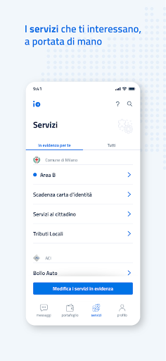

# IO, l'app dei servizi pubblici
App version ``1.21.0.5``

Analyzed with [covid-apps-observer](http://github.com/covid-apps-observer) project, version ``0.1``

## App overview
| | |
|-------------------------|-------------------------| 
| **Name**&nbsp;&nbsp;&nbsp;&nbsp;&nbsp;&nbsp;&nbsp;&nbsp;&nbsp;&nbsp;&nbsp;&nbsp;&nbsp;&nbsp;&nbsp;&nbsp;&nbsp;&nbsp;&nbsp;&nbsp;&nbsp;&nbsp;&nbsp;&nbsp;&nbsp;&nbsp;&nbsp;&nbsp;&nbsp;&nbsp;&nbsp;&nbsp;&nbsp;&nbsp;&nbsp;&nbsp;&nbsp;&nbsp;&nbsp;&nbsp;  | IO, l'app dei servizi pubblici |
| **Unique identifier** | it.pagopa.io.app |
| **Link to Google Play** | [https://play.google.com/store/apps/details?id=it.pagopa.io.app](https://play.google.com/store/apps/details?id=it.pagopa.io.app) |
| **Summary**  | Tutti i servizi della Pubblica Amministrazione a portata di mano. |
| **Privacy policy** | [https://io.italia.it/app-content/tos_privacy.html](https://io.italia.it/app-content/tos_privacy.html) |
| **Latest version** | 1.21.0.5 |
| **Last update** | 2021-02-17 09:54:15 |
| **Recent changes** | La versione più recente risolve vari problemi tecnici e migliora le prestazioni dell&#39;app. |
| **Installs**  | 5.000.000+ |
| **Category** | Comunicazione |
| **First release** | 16 apr 2020 |
| **Size**  | 19M |
| **Supported Android version**  | 4.4 e versioni successive |

### Description
> IO permette di interagire facilmente e in modo sicuro con diverse Pubbliche Amministrazioni italiane, locali o nazionali, raccogliendo tutti i loro servizi, comunicazioni e pagamenti e in un'unica app. 
 In particolare tramite IO potrai:  
 - ricevere messaggi e comunicazioni rilevanti dagli enti pubblici, locali o nazionali;
 - ricordare e gestire le tue scadenze verso la Pubblica Amministrazione, aggiungendo i promemoria direttamente nel tuo calendario personale;
 - ricevere avvisi di pagamento, con la possibilità di pagare servizi e tributi dall’app in pochi secondi (direttamente dal messaggio o tramite scansione QR dell’avviso cartaceo);
 - tenere traccia dei tuoi pagamenti verso la Pubblica Amministrazione, grazie allo storico delle operazioni svolte.
 Per iniziare a utilizzare IO, devi registrarti con le tue credenziali SPID o, in alternativa, con la tua Carta d’Identità Elettronica (CIE). In seguito alla prima registrazione, potrai accedere più facilmente digitando il PIN scelto da te o tramite riconoscimento biometrico (impronta digitale o riconoscimento del volto), mantenendo un'autenticazione sicura. 
 IO è un progetto che cresce giorno dopo giorno, anche grazie ai feedback dei cittadini: se nell'utilizzarla vedi qualcosa che non funziona o che pensi possa essere migliorato, puoi segnalarlo attraverso gli appositi strumenti presenti in app. 
 Molte nuove funzionalità verranno rilasciate nei prossimi mesi: segui la roadmap di progetto sul sito io.italia.it

### User interface
The developers of the app provide the following screenshots in the Google play store.
| | | |
|:-------------------------:|:-------------------------:|:-------------------------:|
 |   |   |   | 
 |   |   |   | 
 |  

## Development team
In the following we report the main information provided by the development team in the Google play store.

| | |
|-------------------------|-------------------------|
| **Developer**  | PagoPA S.p.A. |
| **Website**  | [https://io.italia.it](https://io.italia.it) |
| **Email** | android-account@pagopa.it |
| **Physical address**  | - |
| **Other developed apps**  | [https://play.google.com/store/apps/developer?id=PagoPA+S.p.A.](https://play.google.com/store/apps/developer?id=PagoPA+S.p.A.) |

## Android support

| | |
|-------------------------|-------------------------|
| **Declared target Android version**  | Android10, version 10 (API level 29) |
| **Effective target Android version**  | Android10, version 10 (API level 29) |
| **Minimum supported Android version**  | KitKat, version 4.4 - 4.4.4 (API level 19) |
| **Maximum target Android version**  | - |

The larger the difference between the minimum and maximum supported Android versions, the better. A larger difference means a wider audience. For example, old phones have a very low Android version, so a high minimum supported Android version means that the app cannot be used by users with old phones, thus leading to accessibility problems. 

## Requested permissions

In the following we report the complete list of the permissions requested by the app. 

| **Permission** | **Protection level** | **Description** | 
|-------------------------|-------------------------|-------------------------|
 **android.permission ACCESS_NETWORK_STATE** | Normal | Allows applications to access information about networks. 
 **android.permission ACCESS_WIFI_STATE** | Normal | Allows applications to access information about Wi-Fi networks. 
 **android.permission CAMERA** | :warning:**Dangerous** | Required to be able to access the camera device. 
 **android.permission FOREGROUND_SERVICE** | Normal | Allows a regular application to use Service.startForeground. 
 **android.permission INTERNET** | Normal | Allows applications to open network sockets. 
 **android.permission MODIFY_AUDIO_SETTINGS** | Normal | Allows an application to modify global audio settings. 
 **android.permission NFC** | Normal | Allows applications to perform I/O operations over NFC. 
 **android.permission READ_APP_BADGE** | - | - 
 **android.permission READ_CALENDAR** | :warning:**Dangerous** | Allows an application to read the user's calendar data. 
 **android.permission READ_EXTERNAL_STORAGE** | :warning:**Dangerous** | Allows an application to read from external storage. 
 **android.permission RECEIVE_BOOT_COMPLETED** | Normal | Allows an application to receive the Intent.ACTION_BOOT_COMPLETED that is broadcast after the system finishes booting. 
 **android.permission USE_FINGERPRINT** | Normal | This constant was deprecated in API level 28. Applications should request USE_BIOMETRIC instead 
 **android.permission VIBRATE** | Normal | Allows access to the vibrator. 
 **android.permission WAKE_LOCK** | Normal | Allows using PowerManager WakeLocks to keep processor from sleeping or screen from dimming. 
 **android.permission WRITE_CALENDAR** | :warning:**Dangerous** | Allows an application to write the user's calendar data. 
 **android.permission WRITE_EXTERNAL_STORAGE** | :warning:**Dangerous** | Allows an application to write to external storage. 
 **com.anddoes.launcher.permission UPDATE_COUNT** | - | - 
 **com.google.android.c2dm.permission RECEIVE** | - | - 
 **com.google.android.finsky.permission BIND_GET_INSTALL_REFERRER_SERVICE** | - | - 
 **com.htc.launcher.permission READ_SETTINGS** | - | - 
 **com.htc.launcher.permission UPDATE_SHORTCUT** | - | - 
 **com.huawei.android.launcher.permission CHANGE_BADGE** | - | - 
 **com.huawei.android.launcher.permission READ_SETTINGS** | - | - 
 **com.huawei.android.launcher.permission WRITE_SETTINGS** | - | - 
 **com.majeur.launcher.permission UPDATE_BADGE** | - | - 
 **com.oppo.launcher.permission READ_SETTINGS** | - | - 
 **com.oppo.launcher.permission WRITE_SETTINGS** | - | - 
 **com.sec.android.provider.badge.permission READ** | - | - 
 **com.sec.android.provider.badge.permission WRITE** | - | - 
 **com.sonyericsson.home.permission BROADCAST_BADGE** | - | - 
 **com.sonymobile.home.permission PROVIDER_INSERT_BADGE** | - | - 
 **me.everything.badger.permission BADGE_COUNT_READ** | - | - 
 **me.everything.badger.permission BADGE_COUNT_WRITE** | - | - 

## Mentioned servers

| **Server** | **Registrant** | **Registrant country** | **Creation date** | 
|-------------------------|-------------------------|-------------------------|-------------------------|
 | apache.org | The Apache Software Foundation | :us: US | 1995-04-11 04:00:00 |
 | xml.org | OASIS Open | :us: US | 1997-02-03 05:00:00 |
 | w3.org | W3C | :us: US | 1994-07-06 04:00:00 |
 | purl.org | Internet Archive | :us: US | 1996-01-01 05:00:00 |
 | adobe.com | Adobe Inc. | :us: US | 1986-11-17 05:00:00 |
 | android.com | Google LLC | :us: US | 1997-06-23 04:00:00 |
 | googlesyndication.com | Google LLC | :us: US | 2003-01-21 06:17:24 |
 | google.com | Google LLC | :us: US | 1997-09-15 04:00:00 |
 | iptc.org | Whois Privacy Service | :us: US | 1995-12-27 05:00:00 |
 | useplus.org | PLUS COALITION | :us: US | 2003-11-18 19:31:25 |
 | npes.org | NPES | :us: US | 1996-01-30 05:00:00 |
 | aiim.org | Association for Information and Image Management International | :us: US | 1995-10-18 04:00:00 |
 | app-measurement.com | Google LLC | :us: US | 2015-06-19 20:13:31 |
 | instabug.com | - | :us: US | 2000-05-16 23:13:25 |
 | facebook.com | Facebook, Inc. | :us: US | 1997-03-29 05:00:00 |
 | pinterest.com | DNStination Inc. | :us: US | 2009-11-26 19:21:23 |
 | twitter.com | Twitter, Inc. | :us: US | 2000-01-21 16:28:17 |
 | drewnoakes.com | REDACTED FOR PRIVACY | GB | 2002-04-04 10:00:05 |
 | googleapis.com | Google LLC | :us: US | 2005-01-25 17:52:26 |
 | mixpanel.com | WhoisGuard, Inc. | PA | 2007-03-13 02:23:00 |
 | googleadservices.com | Google LLC | :us: US | 2003-06-19 16:34:53 |
 | maven.org | Whois Privacy Service | :us: US | 2001-06-30 10:38:24 |

## Security analysis 

Below we report the main security warnings raised by our execution of the [Androwarn](https://github.com/maaaaz/androwarn) security analysis tool.

**Telephony identifiers leakage**
> - This application reads the MCC+MNC of the provider of the SIM 
> - This application reads the device phone type value 
> - This application reads the numeric name (MCC+MNC) of current registered operator 
> - This application reads the operator name 
> - This application reads the phone number string for line 1, for example, the MSISDN for a GSM phone 

**Location lookup**
> - This application reads location information from all available providers (WiFi, GPS etc.) 

**Connection interfaces exfiltration**
> - This application reads details about the currently active data network 
> - This application tries to find out if the currently active data network is metered 

**Audio video eavesdropping**
> - This application records audio from the 'CAMCORDER' source  
> - This application records audio from the 'MIC' source  
> - This application captures video from the 'CAMERA' source 
> - This application captures video from the 'SURFACE' source 

**Suspicious connection establishment**
> - This application opens a Socket and connects it to the remote address '' on the 'N/A' port  
> - This application opens a Socket and connects it to the remote address 'Ljava/lang/StringBuilder;->toString()Ljava/lang/String;' on the ': connect, resolve' port  
> - This application opens a Socket and connects it to the remote address 'Ljava/lang/StringBuilder;->toString()Ljava/lang/String;' on the 'N/A' port  
> - This application opens a Socket and connects it to the remote address 'Ljava/net/Proxy;->type()Ljava/net/Proxy$Type;' on the 'N/A' port  
> - This application opens a Socket and connects it to the remote address 'timeout' on the 'N/A' port  

**Pim data leakage**
> - This application accesses the downloads folder 
> - This application accesses data stored in the clipboard 

**Code execution**
> - This application loads a native library 
> - This application loads a native library: 'Ljava/util/Iterator;->next()Ljava/lang/Object;' 
> - This application loads a native library: 'constant' 
> - This application loads a native library: 'tool-checker' 
> - This application executes a UNIX command 
> - This application executes a UNIX command containing this argument: '' 
> - This application executes a UNIX command containing this argument: 'Ljava/io/File;->isFile()Z' 
> - This application executes a UNIX command containing this argument: 'getprop' 
> - This application executes a UNIX command containing this argument: 'mount' 

## User ratings and reviews

Below we provide information about how end users are reacting to the app in terms of ratings and reviews in the Google Play store.

### Ratings

The IO, l'app dei servizi pubblici app has been installed by more than **5000000** times. At this time, **40682** rated the app and its average score is **2.9072165**. Below we show the distribution of the ratings across the usual star-based rating of Google Play

:star::star::star::star::star:: 11893

:star::star::star::star:: 5961

:star::star::star:: 4274

:star::star:: 3585

:star:: 14969

### Reviews 

#### 5-star reviews

> Facile e completo  :date: __2021-02-27 09:17:49__

> Ottima  :date: __2021-02-26 20:52:40__

> Non riesco a vedere le mie transazioni  :date: __2021-02-26 19:23:15__

> Ben fatta e interpretativa facile  :date: __2021-02-26 18:04:42__

> Ottima app con buone prospettive per il futuro di diventare punto di riferimento per i pagamenti online alle PA  :date: __2021-02-26 18:02:44__

> Ottima.. Ogni pagamento nel termine di 3 giorni viene caricato nel portafoglio cashback  :date: __2021-02-26 14:55:36__

> Buona  :date: __2021-02-26 13:06:58__

> 26-02-21 metto la 5 stella,risolto problema circuito MAESTRO,ricevuto accredito del cashbank di Natale.-20-01-21 rimetto le 4 stelle problema risolto con circuito pagobancomat tutte le operazioni presenti l'altra stella quando abilitano il circuito. MAESTRO-01-01-2021 confermo le 5 stelle anche per il cashback nessun problema caricato la carta il 9 dicembre le transazioni regolarmente caricate entro le 72 ore,attendo la possibilità di caricare il circuito maestro senza cvv.--  :date: __2021-02-26 10:45:50__

> Bellissimo  :date: __2021-02-26 09:38:07__

> Sta andando alla grande.... Se qualche volta c'è un ammanco di transazioni il favoloso personale dell'assistenza provvede a sistemare i vari bugs! A quando vi verrà assegnato la realizzazione del software dell'Inps???? che per ora è veramente penoso??  :date: __2021-02-26 06:46:05__

#### 4-star reviews

> A parte qualche problema iniziale, ho trovato l'APP molto utile e funzionale. Spero che presto venga implementata con nuovi servizi!  :date: __2021-02-26 20:09:17__

> Tutto ok . Molto bene 👏  :date: __2021-02-26 19:51:34__

> Dopo iniziale rodaggio, ora funziona alla grande.  :date: __2021-02-26 17:11:18__

> Migliorabile ......  :date: __2021-02-26 12:42:57__

> 4 stelle perché ho avuto difficoltà a registrare la Postepay i primi giorni. poi Ringraziando il Signore l'ho attivata dall'app Postepay che lo permetteva.Per il resto l'accredito è arrivato il 25 febbraio e non ho avuto altri problemi.👍  :date: __2021-02-26 12:18:28__

> ilh9 9  :date: __2021-02-26 09:17:21__

> Per me è valida,un po' lento l'aggiornamento degli acquisti.  :date: __2021-02-25 22:09:58__

> Non funziona. Doveva essere provata per tempo. Vergogna. Correzione: DOPO LA METÀ DI DICEMBRE HA FUNZIONATO. C'È QUALCOSA DA MIGLIORARE MA IL CB FUNZIONA.  :date: __2021-02-25 18:52:38__

> App funziona alla perfezione non do 5 stelle per il semplice fatto.. io bollette e bonifici le eseguo tramite app bancoposta, una cosa x me molto grave mi leva tra i 7/10 movimenti al mese con importo grosso dove ricavo un buon 10%... se riuscite a risolvere questa cosa darò 5 stelle.  :date: __2021-02-25 15:58:19__

> Ottima app. funziona bene. quattro stelle non per l'applicazione ma per i "furbetti" del cashback. Microtransazioni? Basta proporre la classifica per "MEDIA ARITMETICA DELLE TRANSAZIONI ESCLUDENDO TRANSAZIONI INFERIORI A 2€" e non la classifica per "maggior numero transazioni". Se faccio 100 transazioni da 40€ sarò avanti a chi ne fa 500 da 2€ perché io avrò movimentato di media 40€, il furbetto solo 2. Le transazioni inferiori a 2€ sono comunque valide al fine del cashback da 150€. ProbRISOLTO.  :date: __2021-02-25 10:43:26__

#### 3-star reviews

> Oggi sono arrivati i soldi. Come promesso aumento le stelle.  :date: __2021-02-26 13:25:35__

> Non funziona benissimo, manca un contatto telefonico, abbastanza laborioso.  :date: __2021-02-25 19:44:51__

> L'app è (quasi) buona Ma porca miseria ce la facciamo ad aggiungere metodi tipo GooglePay o ApplePay??  :date: __2021-02-25 15:56:57__

> A volte richiede l'inserimento delle psw, segnalando che non viene usata da più di 30 giorni, invece l'ho usata solo qualche giorno prima.  :date: __2021-02-25 11:32:25__

> Dopo le difficoltà iniziali, ora tutto ok per il cashback. Speriamo bene per tutto. Per ora 10 e anche lode.  :date: __2021-02-25 08:05:01__

> Ho ricevuto il rimborso di dicembre come da scadenza, ma non mi sono stati registrati alcuni acquisti e non so come posso fare una verifica per richiederli  :date: __2021-02-24 19:21:56__

> App da migliorare  :date: __2021-02-24 12:36:46__

> Buonasera, nn riesco a visualizzare i certificati di proprietà. Nella schermata principale mi dice sempre di attivare il cash back. Se reinstallo l'app perdo le transazioni? Avrei bisogno di una mano. Grazie Ci vuole molto per risolvere il problema? Avrei una certa urgenza. Vorrei evitare di fare una denuncia per smarrimento visto la comodità di questa app se funzionasse....  :date: __2021-02-24 12:19:35__

> Ad oggi ancora la maggior parte delle app di pagamento da cellulare non sono utilizzabili per il cashback  :date: __2021-02-24 09:22:21__

> Comincia a funzionare abbastanza bene  :date: __2021-02-24 05:41:01__

#### 2-star reviews

> Non legge tutte le carte  :date: __2021-02-27 05:30:48__

> Quando sarà possibile usare Google play Apple pay Samsung pay ?  :date: __2021-02-26 12:03:13__

> Trovo francamente una GRAVE mancanza l'impossibilità di associare servizi come GPay o Apple Pay, ancora dopo tre mesi. Inaccettabile!  :date: __2021-02-25 21:01:56__

> Fa schifo  :date: __2021-02-25 19:10:22__

> Potreste anche integrare le carte del circuto Maestro.. anche Google play, Apple pay e servizi digitali non sarebbe male..  :date: __2021-02-25 17:43:05__

> Sul Cashback Bastava un blocco a tempo sulla carta, non me ne frega un × se è un limite alle tue libertà, in quel negozio puoi fare max 2 operazioni al giorno la terza non la conto, e sei fai lo × passando prodotti ogni minuto ti butto fuori dal Cashback così hai finito di fare il ×, vorrei averci a che fare io con uno di questi personaggi.......5 minuti e gli passa la paura fine delle trasmissioni, invece siamo sempre li a lisciare il pelo in nome di libertà e privacy che non esistono più da te  :date: __2021-02-25 16:30:04__

> Sarebbe bello che attraverso l'app si possa fare le ricariche telefoniche con il Cheshback  :date: __2021-02-24 18:31:15__

> App, potenzialmente utile, su 30 transazioni ne risultano 13, non mi fa inserire il circuito maestro del bancomat, ma solo il pago bancomat. Ormai la tengo ma serve a poco i questi modo  :date: __2021-02-24 09:55:46__

> Mancano transazioni del 15 febbraio.  :date: __2021-02-23 23:25:38__

> ...quindi almeno una volta al mese il sistema decide di bloccarsi e non segnare più i pagamenti. Mi era successo a gennaio, è accaduto di nuovo per le transazioni dal 19 febbraio (tuttora non visualizzate benché contabilizzate dalla mia banca). Di questo passo potete anche chiudere tutto, perché sinceramente non ne vale la pena...  :date: __2021-02-23 22:08:27__

#### 1-star reviews

> Penoso che non funzioni ancora con Google pay tra l'altro più sicure in termini covid perché non si tocca più i tasti del pos  :date: __2021-02-27 09:47:02__

> Classifica.. è necessario che ci sia un minimo di spesa di 5 €. esiste un controllo tra reddito e spese?  :date: __2021-02-27 07:15:03__

> Pessimo!!! Macchinoso, poco efficiente e dopo 30 gg. bisogna ricominciare a immettere PW ecc.... cosa fatta all'italiana!!!!! VERGOGNA!  :date: __2021-02-27 01:08:33__

> contabilizza più o meno una transazione ogni 10 pagamenti.  :date: __2021-02-26 22:03:58__

> Non tiene traccia di tante transazioni, più volte ho contattato l'assistenza, ma non c'è niente da fare.......  :date: __2021-02-26 20:58:44__

> Per entrare perdi 20minuti con 30 mega di banda di download. Provato con due telefoni. Penso abbiate un IBM 386 del.1990 come server per gestire il servizio.  :date: __2021-02-26 20:36:44__

> Le solite porcherie dei sw di stato. Bestemmie a ruota libera. su Motorola edge nuovo va subito in crash, non esiste servizio di helpdesk.  :date: __2021-02-26 19:17:42__

> Negativa. Diverse transazioni tra cui quelle del carburante non entrano nella app.  :date: __2021-02-26 17:19:09__

> Impossibile.comunicare per risolvere un problema. Continua a rispondere un messaggio.precompilato. Da.2.giorni.  :date: __2021-02-26 16:18:12__

> Oggi non si entra. Infocert/Spid autorizza, ma IO non recepisce.  :date: __2021-02-26 16:04:47__

