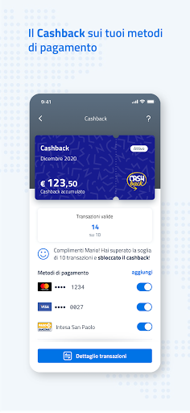

# IO, l'app dei servizi pubblici
App version ``1.23.0.6``

Analyzed with [covid-apps-observer](http://github.com/covid-apps-observer) project, version ``0.1``

## App overview
| | |
|-------------------------|-------------------------| 
| **Name**&nbsp;&nbsp;&nbsp;&nbsp;&nbsp;&nbsp;&nbsp;&nbsp;&nbsp;&nbsp;&nbsp;&nbsp;&nbsp;&nbsp;&nbsp;&nbsp;&nbsp;&nbsp;&nbsp;&nbsp;&nbsp;&nbsp;&nbsp;&nbsp;&nbsp;&nbsp;&nbsp;&nbsp;&nbsp;&nbsp;&nbsp;&nbsp;&nbsp;&nbsp;&nbsp;&nbsp;&nbsp;&nbsp;&nbsp;&nbsp;  | IO, l'app dei servizi pubblici |
| **Unique identifier** | it.pagopa.io.app |
| **Link to Google Play** | [https://play.google.com/store/apps/details?id=it.pagopa.io.app](https://play.google.com/store/apps/details?id=it.pagopa.io.app) |
| **Summary**  | Tutti i servizi della Pubblica Amministrazione a portata di mano. |
| **Privacy policy** | [https://io.italia.it/app-content/tos_privacy.html](https://io.italia.it/app-content/tos_privacy.html) |
| **Latest version** | 1.23.0.6 |
| **Last update** | 2021-03-23 10:03:04 |
| **Recent changes** | • Da oggi puoi aggiungere le carte di pagamento dei supermercati aderenti all’iniziativa • Se la tua banca è supportata, ora puoi aggiungere la tua carta anche se è non abilitata ai pagamenti online |
| **Installs**  | 5.000.000+ |
| **Category** | Comunicazione |
| **First release** | 16 apr 2020 |
| **Size**  | 19M |
| **Supported Android version**  | 4.4 e versioni successive |

### Description
> IO permette di interagire facilmente e in modo sicuro con diverse Pubbliche Amministrazioni italiane, locali o nazionali, raccogliendo tutti i loro servizi, comunicazioni e pagamenti e in un'unica app. 
 In particolare tramite IO potrai:  
 - ricevere messaggi e comunicazioni rilevanti dagli enti pubblici, locali o nazionali;
 - ricordare e gestire le tue scadenze verso la Pubblica Amministrazione, aggiungendo i promemoria direttamente nel tuo calendario personale;
 - ricevere avvisi di pagamento, con la possibilità di pagare servizi e tributi dall’app in pochi secondi (direttamente dal messaggio o tramite scansione QR dell’avviso cartaceo);
 - tenere traccia dei tuoi pagamenti verso la Pubblica Amministrazione, grazie allo storico delle operazioni svolte.
 Per iniziare a utilizzare IO, devi registrarti con le tue credenziali SPID o, in alternativa, con la tua Carta d’Identità Elettronica (CIE). In seguito alla prima registrazione, potrai accedere più facilmente digitando il PIN scelto da te o tramite riconoscimento biometrico (impronta digitale o riconoscimento del volto), mantenendo un'autenticazione sicura. 
 IO è un progetto che cresce giorno dopo giorno, anche grazie ai feedback dei cittadini: se nell'utilizzarla vedi qualcosa che non funziona o che pensi possa essere migliorato, puoi segnalarlo attraverso gli appositi strumenti presenti in app. 
 Molte nuove funzionalità verranno rilasciate nei prossimi mesi: segui la roadmap di progetto sul sito io.italia.it

### User interface
The developers of the app provide the following screenshots in the Google play store.
| | | |
|:-------------------------:|:-------------------------:|:-------------------------:|
 |   |   |   | 
 |   |   |   | 
 |  

## Development team
In the following we report the main information provided by the development team in the Google play store.

| | |
|-------------------------|-------------------------|
| **Developer**  | PagoPA S.p.A. |
| **Website**  | [https://io.italia.it](https://io.italia.it) |
| **Email** | android-account@pagopa.it |
| **Physical address**  | - |
| **Other developed apps**  | [https://play.google.com/store/apps/developer?id=PagoPA+S.p.A.](https://play.google.com/store/apps/developer?id=PagoPA+S.p.A.) |

## Android support

| | |
|-------------------------|-------------------------|
| **Declared target Android version**  | Android10, version 10 (API level 29) |
| **Effective target Android version**  | Android10, version 10 (API level 29) |
| **Minimum supported Android version**  | KitKat, version 4.4 - 4.4.4 (API level 19) |
| **Maximum target Android version**  | - |

The larger the difference between the minimum and maximum supported Android versions, the better. A larger difference means a wider audience. For example, old phones have a very low Android version, so a high minimum supported Android version means that the app cannot be used by users with old phones, thus leading to accessibility problems. 

## Requested permissions

In the following we report the complete list of the permissions requested by the app. 

| **Permission** | **Protection level** | **Description** | 
|-------------------------|-------------------------|-------------------------|
 **android.permission ACCESS_NETWORK_STATE** | Normal | Allows applications to access information about networks. 
 **android.permission ACCESS_WIFI_STATE** | Normal | Allows applications to access information about Wi-Fi networks. 
 **android.permission CAMERA** | :warning:**Dangerous** | Required to be able to access the camera device. 
 **android.permission FOREGROUND_SERVICE** | Normal | Allows a regular application to use Service.startForeground. 
 **android.permission INTERNET** | Normal | Allows applications to open network sockets. 
 **android.permission MODIFY_AUDIO_SETTINGS** | Normal | Allows an application to modify global audio settings. 
 **android.permission NFC** | Normal | Allows applications to perform I/O operations over NFC. 
 **android.permission READ_APP_BADGE** | - | - 
 **android.permission READ_CALENDAR** | :warning:**Dangerous** | Allows an application to read the user's calendar data. 
 **android.permission READ_EXTERNAL_STORAGE** | :warning:**Dangerous** | Allows an application to read from external storage. 
 **android.permission RECEIVE_BOOT_COMPLETED** | Normal | Allows an application to receive the Intent.ACTION_BOOT_COMPLETED that is broadcast after the system finishes booting. 
 **android.permission USE_FINGERPRINT** | Normal | This constant was deprecated in API level 28. Applications should request USE_BIOMETRIC instead 
 **android.permission VIBRATE** | Normal | Allows access to the vibrator. 
 **android.permission WAKE_LOCK** | Normal | Allows using PowerManager WakeLocks to keep processor from sleeping or screen from dimming. 
 **android.permission WRITE_CALENDAR** | :warning:**Dangerous** | Allows an application to write the user's calendar data. 
 **android.permission WRITE_EXTERNAL_STORAGE** | :warning:**Dangerous** | Allows an application to write to external storage. 
 **com.anddoes.launcher.permission UPDATE_COUNT** | - | - 
 **com.google.android.c2dm.permission RECEIVE** | - | - 
 **com.google.android.finsky.permission BIND_GET_INSTALL_REFERRER_SERVICE** | - | - 
 **com.htc.launcher.permission READ_SETTINGS** | - | - 
 **com.htc.launcher.permission UPDATE_SHORTCUT** | - | - 
 **com.huawei.android.launcher.permission CHANGE_BADGE** | - | - 
 **com.huawei.android.launcher.permission READ_SETTINGS** | - | - 
 **com.huawei.android.launcher.permission WRITE_SETTINGS** | - | - 
 **com.majeur.launcher.permission UPDATE_BADGE** | - | - 
 **com.oppo.launcher.permission READ_SETTINGS** | - | - 
 **com.oppo.launcher.permission WRITE_SETTINGS** | - | - 
 **com.sec.android.provider.badge.permission READ** | - | - 
 **com.sec.android.provider.badge.permission WRITE** | - | - 
 **com.sonyericsson.home.permission BROADCAST_BADGE** | - | - 
 **com.sonymobile.home.permission PROVIDER_INSERT_BADGE** | - | - 
 **me.everything.badger.permission BADGE_COUNT_READ** | - | - 
 **me.everything.badger.permission BADGE_COUNT_WRITE** | - | - 

## Mentioned servers

| **Server** | **Registrant** | **Registrant country** | **Creation date** | 
|-------------------------|-------------------------|-------------------------|-------------------------|
 | apache.org | The Apache Software Foundation | :us: US | 1995-04-11 04:00:00 |
 | xml.org | OASIS Open | :us: US | 1997-02-03 05:00:00 |
 | w3.org | W3C | :us: US | 1994-07-06 04:00:00 |
 | purl.org | Internet Archive | :us: US | 1996-01-01 05:00:00 |
 | adobe.com | Adobe Inc. | :us: US | 1986-11-17 05:00:00 |
 | android.com | Google LLC | :us: US | 1997-06-23 04:00:00 |
 | googlesyndication.com | Google LLC | :us: US | 2003-01-21 06:17:24 |
 | google.com | Google LLC | :us: US | 1997-09-15 04:00:00 |
 | iptc.org | Whois Privacy Service | :us: US | 1995-12-27 05:00:00 |
 | useplus.org | PLUS COALITION | :us: US | 2003-11-18 19:31:25 |
 | npes.org | NPES | :us: US | 1996-01-30 05:00:00 |
 | aiim.org | Association for Information and Image Management International | :us: US | 1995-10-18 04:00:00 |
 | app-measurement.com | Google LLC | :us: US | 2015-06-19 20:13:31 |
 | instabug.com | - | :us: US | 2000-05-16 23:13:25 |
 | facebook.com | Facebook, Inc. | :us: US | 1997-03-29 05:00:00 |
 | pinterest.com | DNStination Inc. | :us: US | 2009-11-26 19:21:23 |
 | twitter.com | Twitter, Inc. | :us: US | 2000-01-21 16:28:17 |
 | drewnoakes.com | REDACTED FOR PRIVACY | GB | 2002-04-04 10:00:05 |
 | googleapis.com | Google LLC | :us: US | 2005-01-25 17:52:26 |
 | mixpanel.com | - | - | 2007-03-13 02:23:00 |
 | googleadservices.com | Google LLC | :us: US | 2003-06-19 16:34:53 |
 | maven.org | Whois Privacy Service | :us: US | 2001-06-30 10:38:24 |

## Security analysis 

Below we report the main security warnings raised by our execution of the [Androwarn](https://github.com/maaaaz/androwarn) security analysis tool.

**Telephony identifiers leakage**
> - This application reads the MCC+MNC of the provider of the SIM 
> - This application reads the device phone type value 
> - This application reads the numeric name (MCC+MNC) of current registered operator 
> - This application reads the operator name 
> - This application reads the phone number string for line 1, for example, the MSISDN for a GSM phone 

**Location lookup**
> - This application reads location information from all available providers (WiFi, GPS etc.) 

**Connection interfaces exfiltration**
> - This application reads details about the currently active data network 
> - This application tries to find out if the currently active data network is metered 

**Audio video eavesdropping**
> - This application records audio from the 'CAMCORDER' source  
> - This application records audio from the 'MIC' source  
> - This application captures video from the 'CAMERA' source 
> - This application captures video from the 'SURFACE' source 

**Suspicious connection establishment**
> - This application opens a Socket and connects it to the remote address '' on the 'N/A' port  
> - This application opens a Socket and connects it to the remote address 'Ljava/lang/StringBuilder;->toString()Ljava/lang/String;' on the ': connect, resolve' port  
> - This application opens a Socket and connects it to the remote address 'Ljava/lang/StringBuilder;->toString()Ljava/lang/String;' on the 'N/A' port  
> - This application opens a Socket and connects it to the remote address 'Ljava/net/Proxy;->type()Ljava/net/Proxy$Type;' on the 'N/A' port  
> - This application opens a Socket and connects it to the remote address 'timeout' on the 'N/A' port  

**Pim data leakage**
> - This application accesses the downloads folder 
> - This application accesses data stored in the clipboard 

**Code execution**
> - This application loads a native library 
> - This application loads a native library: 'Ljava/util/Iterator;->next()Ljava/lang/Object;' 
> - This application loads a native library: 'constant' 
> - This application loads a native library: 'tool-checker' 
> - This application executes a UNIX command 
> - This application executes a UNIX command containing this argument: '' 
> - This application executes a UNIX command containing this argument: 'Ljava/io/File;->isFile()Z' 
> - This application executes a UNIX command containing this argument: 'getprop' 
> - This application executes a UNIX command containing this argument: 'mount' 

## User ratings and reviews

Below we provide information about how end users are reacting to the app in terms of ratings and reviews in the Google Play store.

### Ratings

The IO, l'app dei servizi pubblici app has been installed by more than **5000000** times. At this time, **52871** rated the app and its average score is **4.1971354**. Below we show the distribution of the ratings across the usual star-based rating of Google Play

:star::star::star::star::star:: 28832

:star::star::star::star:: 13990

:star::star::star:: 5069

:star::star:: 1603

:star:: 3377

### Reviews 

#### 5-star reviews

> Da l'ultimo aggiornamento la modalità scura è scomparsa. Come posso ripristinarla? Grazie  :date: __2021-04-12 12:57:54__

> Ottima app  :date: __2021-04-12 09:19:13__

> Sarebbe buona se non si dovesse sempre cambiare l a psword  :date: __2021-04-12 06:30:07__

> Funziona bene  :date: __2021-04-11 19:25:57__

> Perfetto  :date: __2021-04-11 15:21:50__

> Ok  :date: __2021-04-11 14:55:37__

> Perché non riesco a vedere le operazioni che ho fatto?  :date: __2021-04-10 22:15:35__

> Impossibile caricare metodi pagamento. Consiglio cambiare svilippatori (anche per i siti inps e ade che sono macchinosi e poco intuitivi) Aggiornamento aprile 2021 problemi risolti.  :date: __2021-04-10 19:12:35__

> Puoi fare tutto semplicissimo e veloce  :date: __2021-04-10 18:04:27__

> Va bene  :date: __2021-04-10 16:15:21__

#### 4-star reviews

> L'App è buona ma dal 31 di marzo non mi carica più le mie transizioni, c'è qualcun che sa dirmi perchè succede questo e a chi posso chiedere informazioni?. Grazie  :date: __2021-04-12 14:58:35__

> Devo dire che è migliorata molto rispetto all'inizio. Servirebbe che nelle FAQ venissero ampliate e aggiornate ulteriormente affinché tutte le segnalazioni che gli utenti fanno vengano utilizzate da altri per rispondere ai quesiti di ognuno.  :date: __2021-04-11 21:46:16__

> Ok  :date: __2021-04-11 18:50:14__

> Ottima  :date: __2021-04-08 14:23:40__

> Buonada peovare  :date: __2021-04-07 20:47:49__

> come aggiornare i dati della mia carta di identità scaduta sull APP? grazie  :date: __2021-04-07 16:27:59__

> È un ottima applicazione. E potrebbe diventare ECCELLENTE. MA NON RIESCO A CAPIRE PERCHÉ NON SI AGGIORNA PIÙ SPESSO, E LE TRANSAZIONI SONO GIÀ CONTABILIZZATE. IO AD ESEMPIO SONO FERMO A 133 DAL 1 APRILE. MAHHHHH  :date: __2021-04-07 13:16:46__

> Salve Ho attivato il cashback con le app di poste sulle mie carte. Volevo sapere se posso attivare anche l'app IO, non vorrei perdere le transazioni accumulate. Grazie cordiali saluti. Qualcuno mi risponde?  :date: __2021-04-07 08:39:46__

> App buona. Fa quello che occorre ed è sicura. Da avere sul telefono  :date: __2021-04-06 08:46:32__

> Anche a voi non appare il bonus vacanze?  :date: __2021-04-05 20:07:33__

#### 3-star reviews

> Date un n di telefono x comunicare con voi o una mail. A me il cash back si è bloccato x cui acquisti fatti dal 23 marzo in poi ad oggi, non mi vengono conteggiati e nn appaiono come incremento nonostante continuo a farli sia con bancomat che con maestro e sull estratto conto della banca ci sn. La carta è sia bancomat che maestro, praticamente è la stessa non funziona? . Mi aiutate ha risolvere l arcano. Ho tutti i movimenti e scontrini conservati posso inviarvi e dove?. In originale? Antonio  :date: __2021-04-12 14:58:37__

> Da 6 aprile le mie transazioni non sono state più aggiunte. Anche se sono sempre uguali alle prime. Stesi venditori stesso pagamento.  :date: __2021-04-12 10:47:41__

> Buongiorno, volevo sapere come mai non vengono più visualizzate le operazioni, sono fermo al 1 di aprile ma continuo a pagare con bancomat, quindi penso che sia un problema di aggiornamento del app. Spero che al più presto possibile venga risolto.  :date: __2021-04-12 10:37:30__

> Dopo 1 anno dal pagamento del bollo auto ancora risulta da pagare  :date: __2021-04-12 10:23:03__

> Ha funzionato a dovere fino al 3 aprile, le transazioni sono ferme a quella data, anche se ne ho fatte altre nei soliti punti di vendita .  :date: __2021-04-12 09:29:22__

> La app è interessante e funziona bene. Peccato per la scarsa partecipazione dei comuni e quindi dei servizi. Potrebbe offrire molto di più.  :date: __2021-04-11 15:41:58__

> Non ci siamo proprio  :date: __2021-04-10 20:16:27__

> Sembra sia tutto a posto ma non funziona e non capisco dove sia il pri  :date: __2021-04-10 07:42:05__

> Il Login tramite SPID va rivisto. Invece di mail e password sarebbe utile una notifica via app e stop. Ma forse è colpa dell'app Poste ID che non propone questa modalità. Per il resto bella idea, ma ancora troppo poco usata dalla PA  :date: __2021-04-09 18:41:07__

> State introducendo tutti i metodi di pagamento tranne Google pay e Samsung pay  :date: __2021-04-09 15:43:29__

#### 2-star reviews

> Sono mesi che la uso e non ho mai avuto problemi...ma è dal 4 Aprile che non si aggiornano più i pagamenti e non si riesce a contattare nessuno perché sono sempre" tutti occupati". Si può comunicare solo con messaggi e la risposta automatica è sempre la stessa..." Siamo spiacenti ma gli operatori al momento sono tutti occupati"... Che amarezza  :date: __2021-04-12 15:06:16__

> Come segnalano anche altri utenti, è dai primi di aprile che non vengono più registrate transazioni, le quali sono già state rendicontate dalla banca e che sono state effettuate in negozi "abituali", quindi luoghi testati e operazioni registrate in passato con successo. Se fai una segnalazione, ricevi la risposta di rito che ti dice in sostanza che non dipende da loro il tempo di trasmissione...  :date: __2021-04-12 14:09:53__

> Buongiorno, da alcuni giorni non vengono più conteggiate le transazioni effettuate. Tutto è fermo da una settimana, quindi da più di 3giorni. Le carte utilizzate sono sempre le stesse e nei medesimi negozi.  Per cortesia potete verificare e ripristinare il funzionamento? Ringrazio in anticipo per il vs gentile supporto.  :date: __2021-04-12 13:09:20__

> Pessima caricano le operazioni dopo 15 giorni è impossibile tenere un rendiconto delle operazioni dopo cosi tanti giorni e se segnali ti dicono che l'esercente non è associato ma lo stesso esercente magari ad amici ha funzionato.  :date: __2021-04-12 11:25:33__

> Con il mio nuovo telefono Oppo A72 non riconosce la CIE tramite nfc. Sul vecchio telefono Huawei P9 funziona. Ho testato il telefono con altre app senza aver nessun probema  :date: __2021-04-12 11:25:19__

> Dal 31 marzo l'applicazione non aggiorna le spese che ho sostenuto pagando con la carta penso sia ora di un aggiornamento.  :date: __2021-04-12 10:31:00__

> Dov'è GPay ed Apple Pay? Stiamo ancora ad aspettare!  :date: __2021-04-12 07:57:55__

> Dal 1 aprile 2021 non aggiorna e contabilizza le transazioni...  :date: __2021-04-11 23:00:47__

> Passo da 5 a 2 stelle....stranamente dal 5 aprile tutte le transazioni non vengono registrate.Di tutti gli acquisti fatti sabato 3 aprile ne è stato registrato solo uno.Inviato decine di segnalazioni,nessuna risposta concreta.Se risolvono ripasso a 5 stelle.  :date: __2021-04-11 19:51:38__

> Non mi aggiorna più i pagamenti sono fermi al 3 aprile .  :date: __2021-04-11 18:24:45__

#### 1-star reviews

> Dal 01 aprile non registra più le mie operazioni. Ho letto le recensioni più recenti e mi rendo conto che il problema è generalizzato e diffuso. Ho mandato una segnalazione ma non spero molto in una risposta esaustiva.  :date: __2021-04-12 15:07:03__

> Ogni volta che devo entrare con spid mi dice che la password è errata , ma la password è giusta .  :date: __2021-04-12 15:06:58__

> Dopo circa tre mesi di funzionamento più o meno regolare, cominciano i problemi: interi giorni di transazioni perse! Assistenza nulla e totalmente latitante, sto provando a scrivere da giorni. Il solito appalto di stato vinto da incapaci con tangenti, bustarelle e raccomandazioni  :date: __2021-04-12 14:54:30__

> dal primo aprile non si aggiornano più le transazioni, l'assistenza risulta impegnata e non prende in carico i ticket... utente abbandonato a se stesso....  :date: __2021-04-12 14:19:22__

> Non vanno piu le transazioni  :date: __2021-04-12 14:06:04__

> Andava tutto bene poi dal 20 Marzo ha cominciato a saltare alcune transazioni ed ora è dal 6 Aprile che non contabilizza più niente.  :date: __2021-04-12 13:26:15__

> Per cortesia qualcuno può spiegarmi come avviare una nuova conversazione col centro assistenza sulla app?? Ogni volta vengo automaticamente indirizzato ad una vecchia "conversazione " e puntualmente mi arriva un messaggio automatico "questa conversazione è stata chiusa si prega di aprirne una nuova" . Perché dovete far venire il nervoso al sistema rabbioso?  :date: __2021-04-12 13:03:04__

> Dal 4 aprile ad oggi tutte le transazioni bloccate. Assistenza pessima. Per favore aggiornate le transazioni  :date: __2021-04-12 12:56:00__

> Purtroppo non mi carica alcuni scontrini. Inviando richiesta di supporto risponde un messaggio sempre uguale, quindi non si ha possibilitá di risolvere il problema. Da sabato poi sono tutti occupati gli operatori. Assistenza inutile. Do 1 stella perche 0 non si può.  :date: __2021-04-12 12:38:39__

> Da un po' non aggiorna le transazioni e se scrivi x segnalarlo ti scrivono subito segnalazione chiusa o mancano transazioni regolari se va avanti così le transazioni non si sbloccano e loro non pagano vorrei più correttezza  :date: __2021-04-12 12:29:48__

