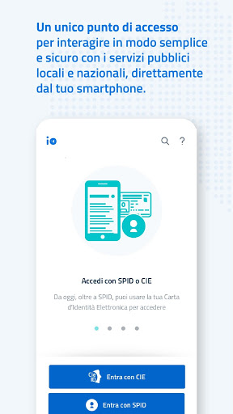
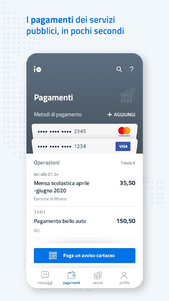
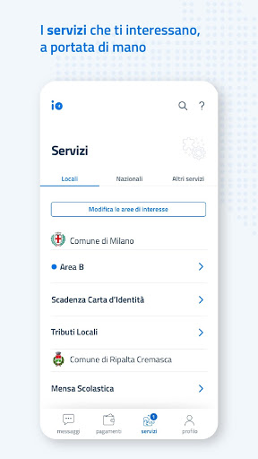

# IO, l'app dei servizi pubblici
App version ``1.8.0.6``

Analyzed with [covid-apps-observer](http://github.com/covid-apps-observer) project, version ``0.1``

## App overview
| | |
|-------------------------|-------------------------| 
| **Name**&nbsp;&nbsp;&nbsp;&nbsp;&nbsp;&nbsp;&nbsp;&nbsp;&nbsp;&nbsp;&nbsp;&nbsp;&nbsp;&nbsp;&nbsp;&nbsp;&nbsp;&nbsp;&nbsp;&nbsp;&nbsp;&nbsp;&nbsp;&nbsp;&nbsp;&nbsp;&nbsp;&nbsp;&nbsp;&nbsp;&nbsp;&nbsp;&nbsp;&nbsp;&nbsp;&nbsp;&nbsp;&nbsp;&nbsp;&nbsp;  | IO, l'app dei servizi pubblici |
| **Unique identifier** | it.pagopa.io.app |
| **Link to Google Play** | [https://play.google.com/store/apps/details?id=it.pagopa.io.app](https://play.google.com/store/apps/details?id=it.pagopa.io.app) |
| **Summary**  | Tutti i servizi della Pubblica Amministrazione a portata di mano. |
| **Privacy policy** | [http://www.governo.it/privacy-policy](http://www.governo.it/privacy-policy) |
| **Latest version** | 1.8.0.6 |
| **Last update** | 2020-10-26 11:49:46 |
| **Recent changes** | - miglioramento delle performance - fix di bug minori |
| **Installs**  | 1.000.000+ |
| **Category** | Comunicazione |
| **First release** | 16 apr 2020 |
| **Size**  | 18M |
| **Supported Android version**  | 4.4 e versioni successive |

### Description
> IO permette di interagire facilmente e in modo sicuro con diverse Pubbliche Amministrazioni italiane, locali o nazionali, raccogliendo tutti i loro servizi, comunicazioni e pagamenti e in un'unica app. 
 In particolare tramite IO potrai:  
 - ricevere messaggi e comunicazioni rilevanti dagli enti pubblici, locali o nazionali;
 - ricordare e gestire le tue scadenze verso la Pubblica Amministrazione, aggiungendo i promemoria direttamente nel tuo calendario personale;
 - ricevere avvisi di pagamento, con la possibilità di pagare servizi e tributi dall’app in pochi secondi (direttamente dal messaggio o tramite scansione QR dell’avviso cartaceo);
 - tenere traccia dei tuoi pagamenti verso la Pubblica Amministrazione, grazie allo storico delle operazioni svolte.
 Per iniziare a utilizzare IO, devi registrarti con le tue credenziali SPID o, in alternativa, con la tua Carta d’Identità Elettronica (CIE). In seguito alla prima registrazione, potrai accedere più facilmente digitando il PIN scelto da te o tramite riconoscimento biometrico (impronta digitale o riconoscimento del volto), mantenendo un'autenticazione sicura. 
 IO è un progetto che cresce giorno dopo giorno, anche grazie ai feedback dei cittadini: se nell'utilizzarla vedi qualcosa che non funziona o che pensi possa essere migliorato, puoi segnalarlo attraverso gli appositi strumenti presenti in app. 
 Molte nuove funzionalità verranno rilasciate nei prossimi mesi: segui la roadmap di progetto sul sito io.italia.it

### User interface
The developers of the app provide the following screenshots in the Google play store.
| | | |
|:-------------------------:|:-------------------------:|:-------------------------:|
 |   |   |   | 
 |   |   |   | 

## Development team
In the following we report the main information provided by the development team in the Google play store.

| | |
|-------------------------|-------------------------|
| **Developer**  | PagoPA S.p.A. |
| **Website**  | [https://io.italia.it](https://io.italia.it) |
| **Email** | android-account@pagopa.it |
| **Physical address**  | - |
| **Other developed apps**  | [https://play.google.com/store/apps/developer?id=PagoPA+S.p.A.](https://play.google.com/store/apps/developer?id=PagoPA+S.p.A.) |

## Android support

| | |
|-------------------------|-------------------------|
| **Declared target Android version**  | Android10, version 10 (API level 29) |
| **Effective target Android version**  | Android10, version 10 (API level 29) |
| **Minimum supported Android version**  | KitKat, version 4.4 - 4.4.4 (API level 19) |
| **Maximum target Android version**  | - |

The larger the difference between the minimum and maximum supported Android versions, the better. A larger difference means a wider audience. For example, old phones have a very low Android version, so a high minimum supported Android version means that the app cannot be used by users with old phones, thus leading to accessibility problems. 

## Requested permissions

In the following we report the complete list of the permissions requested by the app. 

| **Permission** | **Protection level** | **Description** | 
|-------------------------|-------------------------|-------------------------|
 **android.permission ACCESS_NETWORK_STATE** | Normal | Allows applications to access information about networks. 
 **android.permission ACCESS_WIFI_STATE** | Normal | Allows applications to access information about Wi-Fi networks. 
 **android.permission CAMERA** | :warning:**Dangerous** | Required to be able to access the camera device. 
 **android.permission FOREGROUND_SERVICE** | Normal | Allows a regular application to use Service.startForeground. 
 **android.permission INTERNET** | Normal | Allows applications to open network sockets. 
 **android.permission MODIFY_AUDIO_SETTINGS** | Normal | Allows an application to modify global audio settings. 
 **android.permission NFC** | Normal | Allows applications to perform I/O operations over NFC. 
 **android.permission READ_APP_BADGE** | - | - 
 **android.permission READ_CALENDAR** | :warning:**Dangerous** | Allows an application to read the user's calendar data. 
 **android.permission READ_EXTERNAL_STORAGE** | :warning:**Dangerous** | Allows an application to read from external storage. 
 **android.permission RECEIVE_BOOT_COMPLETED** | Normal | Allows an application to receive the Intent.ACTION_BOOT_COMPLETED that is broadcast after the system finishes booting. 
 **android.permission USE_FINGERPRINT** | Normal | This constant was deprecated in API level 28. Applications should request USE_BIOMETRIC instead 
 **android.permission VIBRATE** | Normal | Allows access to the vibrator. 
 **android.permission WAKE_LOCK** | Normal | Allows using PowerManager WakeLocks to keep processor from sleeping or screen from dimming. 
 **android.permission WRITE_CALENDAR** | :warning:**Dangerous** | Allows an application to write the user's calendar data. 
 **android.permission WRITE_EXTERNAL_STORAGE** | :warning:**Dangerous** | Allows an application to write to external storage. 
 **com.anddoes.launcher.permission UPDATE_COUNT** | - | - 
 **com.google.android.c2dm.permission RECEIVE** | - | - 
 **com.google.android.finsky.permission BIND_GET_INSTALL_REFERRER_SERVICE** | - | - 
 **com.htc.launcher.permission READ_SETTINGS** | - | - 
 **com.htc.launcher.permission UPDATE_SHORTCUT** | - | - 
 **com.huawei.android.launcher.permission CHANGE_BADGE** | - | - 
 **com.huawei.android.launcher.permission READ_SETTINGS** | - | - 
 **com.huawei.android.launcher.permission WRITE_SETTINGS** | - | - 
 **com.majeur.launcher.permission UPDATE_BADGE** | - | - 
 **com.oppo.launcher.permission READ_SETTINGS** | - | - 
 **com.oppo.launcher.permission WRITE_SETTINGS** | - | - 
 **com.sec.android.provider.badge.permission READ** | - | - 
 **com.sec.android.provider.badge.permission WRITE** | - | - 
 **com.sonyericsson.home.permission BROADCAST_BADGE** | - | - 
 **com.sonymobile.home.permission PROVIDER_INSERT_BADGE** | - | - 
 **me.everything.badger.permission BADGE_COUNT_READ** | - | - 
 **me.everything.badger.permission BADGE_COUNT_WRITE** | - | - 

## Mentioned servers

| **Server** | **Registrant** | **Registrant country** | **Creation date** | 
|-------------------------|-------------------------|-------------------------|-------------------------|
 | apache.org | The Apache Software Foundation | :us: US | 1995-04-11 04:00:00 |
 | xml.org | OASIS Open | :us: US | 1997-02-03 05:00:00 |
 | w3.org | W3C | :us: US | 1994-07-06 04:00:00 |
 | purl.org | Internet Archive | :us: US | 1996-01-01 05:00:00 |
 | adobe.com | Adobe Inc. | :us: US | 1986-11-17 05:00:00 |
 | android.com | Google LLC | :us: US | 1997-06-23 04:00:00 |
 | googlesyndication.com | Google LLC | :us: US | 2003-01-21 06:17:24 |
 | google.com | Google LLC | :us: US | 1997-09-15 04:00:00 |
 | iptc.org | Whois Privacy Service | :us: US | 1995-12-27 05:00:00 |
 | useplus.org | PLUS COALITION | :us: US | 2003-11-18 19:31:25 |
 | npes.org | NPES | :us: US | 1996-01-30 05:00:00 |
 | aiim.org | Association for Information and Image Management International | :us: US | 1995-10-18 04:00:00 |
 | app-measurement.com | Google LLC | :us: US | 2015-06-19 20:13:31 |
 | instabug.com | - | :us: US | 2000-05-16 23:13:25 |
 | facebook.com | Facebook, Inc. | :us: US | 1997-03-29 05:00:00 |
 | pinterest.com | DNStination Inc. | :us: US | 2009-11-26 19:21:23 |
 | twitter.com | Twitter, Inc. | :us: US | 2000-01-21 16:28:17 |
 | drewnoakes.com | REDACTED FOR PRIVACY | GB | 2002-04-04 10:00:05 |
 | googleapis.com | Google LLC | :us: US | 2005-01-25 17:52:26 |
 | mixpanel.com | WhoisGuard, Inc. | PA | 2007-03-13 02:23:00 |
 | googleadservices.com | Google LLC | :us: US | 2003-06-19 16:34:53 |
 | maven.org | Whois Privacy Service | :us: US | 2001-06-30 10:38:24 |

## Security analysis 

Below we report the main security warnings raised by our execution of the [Androwarn](https://github.com/maaaaz/androwarn) security analysis tool.

**Telephony identifiers leakage**
> - This application reads the device phone type value 
> - This application reads the numeric name (MCC+MNC) of current registered operator 
> - This application reads the operator name 
> - This application reads the phone number string for line 1, for example, the MSISDN for a GSM phone 

**Location lookup**
> - This application reads location information from all available providers (WiFi, GPS etc.) 

**Connection interfaces exfiltration**
> - This application reads details about the currently active data network 
> - This application tries to find out if the currently active data network is metered 

**Audio video eavesdropping**
> - This application records audio from the 'CAMCORDER' source  
> - This application records audio from the 'MIC' source  
> - This application captures video from the 'CAMERA' source 
> - This application captures video from the 'SURFACE' source 

**Suspicious connection establishment**
> - This application opens a Socket and connects it to the remote address '' on the 'N/A' port  
> - This application opens a Socket and connects it to the remote address 'Ljava/lang/StringBuilder;->toString()Ljava/lang/String;' on the ': connect, resolve' port  
> - This application opens a Socket and connects it to the remote address 'Ljava/lang/StringBuilder;->toString()Ljava/lang/String;' on the 'N/A' port  
> - This application opens a Socket and connects it to the remote address 'Ljava/net/Proxy;->type()Ljava/net/Proxy$Type;' on the 'N/A' port  
> - This application opens a Socket and connects it to the remote address 'timeout' on the 'N/A' port  

**Pim data leakage**
> - This application accesses the downloads folder 
> - This application accesses data stored in the clipboard 

**Code execution**
> - This application loads a native library 
> - This application loads a native library: 'Ljava/util/Iterator;->next()Ljava/lang/Object;' 
> - This application loads a native library: 'constant' 
> - This application loads a native library: 'tool-checker' 
> - This application executes a UNIX command 
> - This application executes a UNIX command containing this argument: '' 
> - This application executes a UNIX command containing this argument: 'Ljava/io/File;->isFile()Z' 
> - This application executes a UNIX command containing this argument: 'getprop' 
> - This application executes a UNIX command containing this argument: 'mount' 

## User ratings and reviews

Below we provide information about how end users are reacting to the app in terms of ratings and reviews in the Google Play store.

### Ratings

The IO, l'app dei servizi pubblici app has been installed by more than **1000000** times. At this time, **4542** rated the app and its average score is **3.3050108**. Below we show the distribution of the ratings across the usual star-based rating of Google Play

:star::star::star::star::star:: 1802

:star::star::star::star:: 643

:star::star::star:: 514

:star::star:: 306

:star:: 1277

### Reviews 

#### 5-star reviews

> Io molto utile per il bonus e tanto altro  :date: __2020-11-15 21:11:35__

> Funziona bene. Se il comune è supportato i servizi possono essere numerosi e vale la pena averla.  :date: __2020-11-15 10:50:11__

> Molto ben fatta. In realtà non l'ho ancora utilizzata. Ho solo registrato una carta di pagamento in previsione del bonus di dicembre di 300 euro per chi fa almeno 10 acquisti in un negozio fisico. Vediamo.... 😊😊😊  :date: __2020-11-14 18:56:43__

> Funzionale e per quanto riguarda ISEE e bonus vacanze vi sono voluti 3 minuti  :date: __2020-11-14 14:32:34__

> ben fatta, da accelerare lo sviluppo di servizi  :date: __2020-11-14 09:53:07__

> Grazie all'applicazione ho tramite onlaine ricevuto il bonus di 500 euro , da casa senza bisogno di girare per uffici.  :date: __2020-11-13 19:06:27__

> Ok  :date: __2020-11-13 16:49:27__

> Eccellente  :date: __2020-11-13 08:15:37__

> App.utilissima!!!!  :date: __2020-11-12 13:45:49__

> Ottima  :date: __2020-11-09 21:47:10__

#### 4-star reviews

> I metodi di pagamento vanno aggiunti PRIMA di provare a pagare, altrimenti dà errore. L'app è fatta bene, peccato che ancora non ci siano tutti i Comuni. Comodi i reminder. Sicuramente la strada giusta per snellire la PA. Ci si potessero richiedere anche accessi civici e compagnia, sarebbe cosa graditissima.  :date: __2020-11-11 13:15:33__

> L'app è ben fatta e si vede che c'è uno studio dietro. Un suggerimento per la prossima release: prevedere la possibilità di dare un nome alle carte. Ho diverse carte Mastercard e senza non è semplice capire quale è stata emessa da un istituto, quale da un altro perché il design è lo stesso per tutte.  :date: __2020-11-06 21:05:17__

> La registrazione è stata molto veloce. Non riesco a capire come inserire l'iban.  :date: __2020-11-06 11:46:57__

> Scaricata, installata senza problema. Eseguito login con credenziali SPID delle poste, senza riscontrare problemi.  :date: __2020-11-02 09:30:33__

> Funziona tutto. Peccato non ci siano tutti i comuni. Altro passo verso la digitalizzazione. Forza, dai.  :date: __2020-11-01 23:01:46__

> Aggiungete il tema scuro e avrete 5 stelle  :date: __2020-11-01 01:13:04__

> Volevo registrarmi e registrare le mie carte per usufruire del cashback che partirà il primo di dicembre 2020, ma non c'è modo di inserire il mio IBAN sul quale voglio ricevere il cashback. Oltretutto l'app non riporta assolutamente alcun messaggio o FAQ su questa funzione cashback e nemmeno ti aiuta e guida a fare le giuste impostazioni. Attendo con ansia spiegazioni in merito da chiunque sappia qualcosa.  :date: __2020-10-31 00:14:19__

> 💪💪💪👏👏👏  :date: __2020-10-29 20:00:00__

> Utile per i pagamenti. Metterò 5 stelle quando renderanno disponibili tutte le modalità di pagamento.  :date: __2020-10-29 13:38:31__

> Per ora bene. Vediamo con i prossimi aggiornamenti  :date: __2020-10-28 23:23:00__

#### 3-star reviews

> Attenzione: non rilascia una ricevuta tipo PDF stampabile ma il contact center mi dice che MI DEVO STAMPARE LO SCREENSHOT a riprova del pagamento. Persino le poste ti danno una ricevuta.  :date: __2020-11-15 19:18:27__

> non mi fa aggiungete la carta di poste italiane...come mai??  :date: __2020-11-15 19:10:18__

> Dove si inserisce il codice IBAN ai fini del rimborso cashback?  :date: __2020-11-11 10:54:33__

> Aplicazione va bene ma ñon mi fa entrare da un po di giorni non so perché  :date: __2020-11-06 11:41:14__

> Non si avvia più. Rimane bloccata sulla schermata blu che si vede appena si avvia. Era un'app molto interessante.  :date: __2020-11-06 08:22:21__

> Modifico la mia precedente da una stella. Non riuscivo ad entrare con PosteID. È bastato resettare la password di PosteID e adesso funziona. Magari avvisate che può essere una soluzione...  :date: __2020-10-30 18:23:47__

> Positiva  :date: __2020-10-30 18:10:15__

> Buona  :date: __2020-10-30 10:00:50__

> Va migliorata e resa più intuibile agli utenti  :date: __2020-10-29 10:46:04__

> Suggerirei la possibilità di poter salvare le ricevute di pagamento in un formato esportabile, ad esempio pdf. Attualmente, manca questa opzione.  :date: __2020-10-29 06:20:13__

#### 2-star reviews

> Non mi fa registrare la carta per pagare dando errore  :date: __2020-11-15 16:17:30__

> fatto correttamente SPID PosteID la prima volta tutto bene quando sono andato sull'app IO con user e passw si e'aperto immediatamente IO ora rifacendo il tutto con user e passw giusti non si apre più IO mi dice " blocco temporaneo del profilo su Opzioni" di PosteID controllato il tutto che e' nella normalità non riesco più ad entrare in app IO cosa posso fare? grazie  :date: __2020-11-15 14:11:32__

> Di facile intuizione ma al momento non permette di utilizzare pagamenti diversi dalle carte credito/debito le quali sono risultate di facile registrazione. Purtroppo ad oggi non è possibile inserire l'iban (requisito fondamentale) per usufruire del bonus cash back in partenza a dicembre. Spero in un aggiornamento entro fine mese.  :date: __2020-11-13 21:56:18__

> In vista dell'operazione cashback inserite le schede opportune, compreso l'IBAN. Inoltre calcolate che al momento si può inserire solo la carta di credito... Fate poi in modo che con il tasto back del telefono si torni alla home, senza scorrere tutte le pagine a ritroso!  :date: __2020-11-09 19:27:37__

> Pagamento bollo auto fallito per più di una volta.....altri metodi di pagamento in arrivo.... ma quando!!!! Per il resto non male ma.....  :date: __2020-11-08 18:15:30__

> Lenta ed inaffidabile  :date: __2020-11-06 17:22:01__

> Non c'è l'integrazione al cashback; per interrompere le notifiche dei comuni di tutta Italia devo togliere la spunta uno ad uno ( impossibile).  :date: __2020-11-06 06:47:48__

> Non riesco ad accedere. Utilizzo l'app poste id come spid per entrare , il problema è che quando inserisco le credenziali , poi mi richiede l'autorizzazione sull app delle poste che ho sempre sullo stesso cellulare , una volta autorizzato , quando rivado sull' app IO , ricomincia la procedura di autorizzazione daccapo .  :date: __2020-11-04 19:09:12__

> L'ho scaricata ma non riesco ad autenticarmi tramite Spid di Poste (PosteId). Sul sito delle poste ho verificato la mail e la password sono corrette (Infatti sull'applicazione dell'INPS funziona tutto) La eseguo da un Huawei p10  :date: __2020-11-04 13:05:17__

> accesso con spid poste con problemi  :date: __2020-11-03 18:05:37__

#### 1-star reviews

> Scaricata oggi: 15/11/2020 NON RIESCO AD ENTRARE IN NESSUN MODO. Rifiuta credenziali SPID (Le stesse credenziali consentono l'accesso, ad esempio, a: crs.regione.lombardia.it/sanità)  :date: __2020-11-15 19:00:31__

> Impossibile accedere con spid  :date: __2020-11-15 17:43:42__

> Accesso con Spid non consentito. Inserisco il codice e quando rientro sull'app mi dice "errore". Solito servizio pubblico...qualità bassa.  :date: __2020-11-15 13:50:40__

> Non mi fa entrare con le mie credenziali spid. Su altri siti entro senza problemi.  :date: __2020-11-15 10:13:56__

> Non mi fa entrare  :date: __2020-11-14 20:02:55__

> L'App.non funziona. Messo l'ID e la password non mi da l'accesso. Un mio parere? Fa schifo.  :date: __2020-11-14 15:33:13__

> Non riconosce lo spid di posteitaliane che sia sul sito inps che rdc funziona benissimo  :date: __2020-11-14 15:29:46__

> Na palla, sta sempre a chiedere l'identificazione con l'app delle poste  :date: __2020-11-14 08:23:26__

> Non riesco ad entrare con spid PosteID  :date: __2020-11-13 21:44:36__

> L app non registra i pagamenti,non solo quelli con il bancomat ma anche quelli con carta.Ho mandato messaggio per richiedere informazioni in merito .Nessuna risposta esauriente.......continua a non registrare transazioni.  :date: __2020-11-13 13:01:36__

