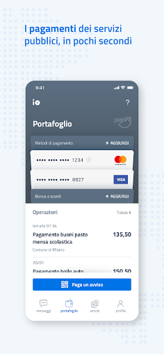

# IO, l'app dei servizi pubblici
App version ``1.9.0.4``

Analyzed with [covid-apps-observer](http://github.com/covid-apps-observer) project, version ``0.1``

## App overview
| | |
|-------------------------|-------------------------| 
| **Name**&nbsp;&nbsp;&nbsp;&nbsp;&nbsp;&nbsp;&nbsp;&nbsp;&nbsp;&nbsp;&nbsp;&nbsp;&nbsp;&nbsp;&nbsp;&nbsp;&nbsp;&nbsp;&nbsp;&nbsp;&nbsp;&nbsp;&nbsp;&nbsp;&nbsp;&nbsp;&nbsp;&nbsp;&nbsp;&nbsp;&nbsp;&nbsp;&nbsp;&nbsp;&nbsp;&nbsp;&nbsp;&nbsp;&nbsp;&nbsp;  | IO, l'app dei servizi pubblici |
| **Unique identifier** | it.pagopa.io.app |
| **Link to Google Play** | [https://play.google.com/store/apps/details?id=it.pagopa.io.app](https://play.google.com/store/apps/details?id=it.pagopa.io.app) |
| **Summary**  | Tutti i servizi della Pubblica Amministrazione a portata di mano. |
| **Privacy policy** | [http://www.governo.it/privacy-policy](http://www.governo.it/privacy-policy) |
| **Latest version** | 1.9.0.4 |
| **Last update** | 2020-11-18 17:21:13 |
| **Recent changes** | - ora è possibile richiedere assistenza in merito all&#39;onboarding di una carta di credito - digitando il PAN della carta di credito, in fase di inserimento, viene riconosciuto il brand e mostrata l’icona relativa - renaming della sezione “pagamenti” in “portafoglio” - aggiornato il fac-simile dell&#39;avviso di pagamento- migliorata la rappresentazione dei messaggi con pagamento e scadenza - rimosso il campo “importo” dal form per l’inserimento manuale di un pagamento |
| **Installs**  | 1.000.000+ |
| **Category** | Comunicazione |
| **First release** | 16 apr 2020 |
| **Size**  | 19M |
| **Supported Android version**  | 4.4 e versioni successive |

### Description
> IO permette di interagire facilmente e in modo sicuro con diverse Pubbliche Amministrazioni italiane, locali o nazionali, raccogliendo tutti i loro servizi, comunicazioni e pagamenti e in un'unica app. 
 In particolare tramite IO potrai:  
 - ricevere messaggi e comunicazioni rilevanti dagli enti pubblici, locali o nazionali;
 - ricordare e gestire le tue scadenze verso la Pubblica Amministrazione, aggiungendo i promemoria direttamente nel tuo calendario personale;
 - ricevere avvisi di pagamento, con la possibilità di pagare servizi e tributi dall’app in pochi secondi (direttamente dal messaggio o tramite scansione QR dell’avviso cartaceo);
 - tenere traccia dei tuoi pagamenti verso la Pubblica Amministrazione, grazie allo storico delle operazioni svolte.
 Per iniziare a utilizzare IO, devi registrarti con le tue credenziali SPID o, in alternativa, con la tua Carta d’Identità Elettronica (CIE). In seguito alla prima registrazione, potrai accedere più facilmente digitando il PIN scelto da te o tramite riconoscimento biometrico (impronta digitale o riconoscimento del volto), mantenendo un'autenticazione sicura. 
 IO è un progetto che cresce giorno dopo giorno, anche grazie ai feedback dei cittadini: se nell'utilizzarla vedi qualcosa che non funziona o che pensi possa essere migliorato, puoi segnalarlo attraverso gli appositi strumenti presenti in app. 
 Molte nuove funzionalità verranno rilasciate nei prossimi mesi: segui la roadmap di progetto sul sito io.italia.it

### User interface
The developers of the app provide the following screenshots in the Google play store.
| | | |
|:-------------------------:|:-------------------------:|:-------------------------:|
 |   |   |   | 
 |   |   |   | 

## Development team
In the following we report the main information provided by the development team in the Google play store.

| | |
|-------------------------|-------------------------|
| **Developer**  | PagoPA S.p.A. |
| **Website**  | [https://io.italia.it](https://io.italia.it) |
| **Email** | android-account@pagopa.it |
| **Physical address**  | - |
| **Other developed apps**  | [https://play.google.com/store/apps/developer?id=PagoPA+S.p.A.](https://play.google.com/store/apps/developer?id=PagoPA+S.p.A.) |

## Android support

| | |
|-------------------------|-------------------------|
| **Declared target Android version**  | Android10, version 10 (API level 29) |
| **Effective target Android version**  | Android10, version 10 (API level 29) |
| **Minimum supported Android version**  | KitKat, version 4.4 - 4.4.4 (API level 19) |
| **Maximum target Android version**  | - |

The larger the difference between the minimum and maximum supported Android versions, the better. A larger difference means a wider audience. For example, old phones have a very low Android version, so a high minimum supported Android version means that the app cannot be used by users with old phones, thus leading to accessibility problems. 

## Requested permissions

In the following we report the complete list of the permissions requested by the app. 

| **Permission** | **Protection level** | **Description** | 
|-------------------------|-------------------------|-------------------------|
 **android.permission ACCESS_NETWORK_STATE** | Normal | Allows applications to access information about networks. 
 **android.permission ACCESS_WIFI_STATE** | Normal | Allows applications to access information about Wi-Fi networks. 
 **android.permission CAMERA** | :warning:**Dangerous** | Required to be able to access the camera device. 
 **android.permission FOREGROUND_SERVICE** | Normal | Allows a regular application to use Service.startForeground. 
 **android.permission INTERNET** | Normal | Allows applications to open network sockets. 
 **android.permission MODIFY_AUDIO_SETTINGS** | Normal | Allows an application to modify global audio settings. 
 **android.permission NFC** | Normal | Allows applications to perform I/O operations over NFC. 
 **android.permission READ_APP_BADGE** | - | - 
 **android.permission READ_CALENDAR** | :warning:**Dangerous** | Allows an application to read the user's calendar data. 
 **android.permission READ_EXTERNAL_STORAGE** | :warning:**Dangerous** | Allows an application to read from external storage. 
 **android.permission RECEIVE_BOOT_COMPLETED** | Normal | Allows an application to receive the Intent.ACTION_BOOT_COMPLETED that is broadcast after the system finishes booting. 
 **android.permission USE_FINGERPRINT** | Normal | This constant was deprecated in API level 28. Applications should request USE_BIOMETRIC instead 
 **android.permission VIBRATE** | Normal | Allows access to the vibrator. 
 **android.permission WAKE_LOCK** | Normal | Allows using PowerManager WakeLocks to keep processor from sleeping or screen from dimming. 
 **android.permission WRITE_CALENDAR** | :warning:**Dangerous** | Allows an application to write the user's calendar data. 
 **android.permission WRITE_EXTERNAL_STORAGE** | :warning:**Dangerous** | Allows an application to write to external storage. 
 **com.anddoes.launcher.permission UPDATE_COUNT** | - | - 
 **com.google.android.c2dm.permission RECEIVE** | - | - 
 **com.google.android.finsky.permission BIND_GET_INSTALL_REFERRER_SERVICE** | - | - 
 **com.htc.launcher.permission READ_SETTINGS** | - | - 
 **com.htc.launcher.permission UPDATE_SHORTCUT** | - | - 
 **com.huawei.android.launcher.permission CHANGE_BADGE** | - | - 
 **com.huawei.android.launcher.permission READ_SETTINGS** | - | - 
 **com.huawei.android.launcher.permission WRITE_SETTINGS** | - | - 
 **com.majeur.launcher.permission UPDATE_BADGE** | - | - 
 **com.oppo.launcher.permission READ_SETTINGS** | - | - 
 **com.oppo.launcher.permission WRITE_SETTINGS** | - | - 
 **com.sec.android.provider.badge.permission READ** | - | - 
 **com.sec.android.provider.badge.permission WRITE** | - | - 
 **com.sonyericsson.home.permission BROADCAST_BADGE** | - | - 
 **com.sonymobile.home.permission PROVIDER_INSERT_BADGE** | - | - 
 **me.everything.badger.permission BADGE_COUNT_READ** | - | - 
 **me.everything.badger.permission BADGE_COUNT_WRITE** | - | - 

## Mentioned servers

| **Server** | **Registrant** | **Registrant country** | **Creation date** | 
|-------------------------|-------------------------|-------------------------|-------------------------|
 | apache.org | The Apache Software Foundation | :us: US | 1995-04-11 04:00:00 |
 | xml.org | OASIS Open | :us: US | 1997-02-03 05:00:00 |
 | w3.org | W3C | :us: US | 1994-07-06 04:00:00 |
 | purl.org | Internet Archive | :us: US | 1996-01-01 05:00:00 |
 | adobe.com | Adobe Inc. | :us: US | 1986-11-17 05:00:00 |
 | android.com | Google LLC | :us: US | 1997-06-23 04:00:00 |
 | googlesyndication.com | Google LLC | :us: US | 2003-01-21 06:17:24 |
 | google.com | Google LLC | :us: US | 1997-09-15 04:00:00 |
 | iptc.org | Whois Privacy Service | :us: US | 1995-12-27 05:00:00 |
 | useplus.org | PLUS COALITION | :us: US | 2003-11-18 19:31:25 |
 | npes.org | NPES | :us: US | 1996-01-30 05:00:00 |
 | aiim.org | Association for Information and Image Management International | :us: US | 1995-10-18 04:00:00 |
 | app-measurement.com | Google LLC | :us: US | 2015-06-19 20:13:31 |
 | instabug.com | - | :us: US | 2000-05-16 23:13:25 |
 | facebook.com | Facebook, Inc. | :us: US | 1997-03-29 05:00:00 |
 | pinterest.com | DNStination Inc. | :us: US | 2009-11-26 19:21:23 |
 | twitter.com | Twitter, Inc. | :us: US | 2000-01-21 16:28:17 |
 | drewnoakes.com | REDACTED FOR PRIVACY | GB | 2002-04-04 10:00:05 |
 | googleapis.com | Google LLC | :us: US | 2005-01-25 17:52:26 |
 | mixpanel.com | WhoisGuard, Inc. | PA | 2007-03-13 02:23:00 |
 | googleadservices.com | Google LLC | :us: US | 2003-06-19 16:34:53 |
 | maven.org | Whois Privacy Service | :us: US | 2001-06-30 10:38:24 |

## Security analysis 

Below we report the main security warnings raised by our execution of the [Androwarn](https://github.com/maaaaz/androwarn) security analysis tool.

**Telephony identifiers leakage**
> - This application reads the device phone type value 
> - This application reads the numeric name (MCC+MNC) of current registered operator 
> - This application reads the operator name 
> - This application reads the phone number string for line 1, for example, the MSISDN for a GSM phone 

**Location lookup**
> - This application reads location information from all available providers (WiFi, GPS etc.) 

**Connection interfaces exfiltration**
> - This application reads details about the currently active data network 
> - This application tries to find out if the currently active data network is metered 

**Audio video eavesdropping**
> - This application records audio from the 'CAMCORDER' source  
> - This application records audio from the 'MIC' source  
> - This application captures video from the 'CAMERA' source 
> - This application captures video from the 'SURFACE' source 

**Suspicious connection establishment**
> - This application opens a Socket and connects it to the remote address '' on the 'N/A' port  
> - This application opens a Socket and connects it to the remote address 'Ljava/lang/StringBuilder;->toString()Ljava/lang/String;' on the ': connect, resolve' port  
> - This application opens a Socket and connects it to the remote address 'Ljava/lang/StringBuilder;->toString()Ljava/lang/String;' on the 'N/A' port  
> - This application opens a Socket and connects it to the remote address 'Ljava/net/Proxy;->type()Ljava/net/Proxy$Type;' on the 'N/A' port  
> - This application opens a Socket and connects it to the remote address 'timeout' on the 'N/A' port  

**Pim data leakage**
> - This application accesses the downloads folder 
> - This application accesses data stored in the clipboard 

**Code execution**
> - This application loads a native library 
> - This application loads a native library: 'Ljava/util/Iterator;->next()Ljava/lang/Object;' 
> - This application loads a native library: 'constant' 
> - This application loads a native library: 'tool-checker' 
> - This application executes a UNIX command 
> - This application executes a UNIX command containing this argument: '' 
> - This application executes a UNIX command containing this argument: 'Ljava/io/File;->isFile()Z' 
> - This application executes a UNIX command containing this argument: 'getprop' 
> - This application executes a UNIX command containing this argument: 'mount' 

## User ratings and reviews

Below we provide information about how end users are reacting to the app in terms of ratings and reviews in the Google Play store.

### Ratings

The IO, l'app dei servizi pubblici app has been installed by more than **1000000** times. At this time, **4618** rated the app and its average score is **3.1858037**. Below we show the distribution of the ratings across the usual star-based rating of Google Play

:star::star::star::star::star:: 1736

:star::star::star::star:: 578

:star::star::star:: 520

:star::star:: 376

:star:: 1408

### Reviews 

#### 5-star reviews

> L'app funziona molto bene, veloce e intuitiva. Ps. Perché la scadenza per l'utilizzo del bonus vacanze già ottenuto è ancora fissata al 31.12.2020 e non al 30.06.2021?  :date: __2020-11-22 21:15:24__

> 5 stelle di incoraggiamento per le potenzialità del progetto. L'app funziona bene ma i servizi integrati sono ancora pochi anche se in continuo aggiornamento  :date: __2020-11-22 20:14:12__

> Ok  :date: __2020-11-22 13:07:12__

> Per ora ottima  :date: __2020-11-20 11:52:27__

> Ancora tutta da scoprire ma prevedo che sara' positiva  :date: __2020-11-19 22:29:27__

> Molto funzionale  :date: __2020-11-19 20:17:32__

> 🔝  :date: __2020-11-19 18:37:38__

> Complimenti agli sviluppatori, finalmente un'app di cui essere fieri!  :date: __2020-11-19 16:55:05__

> Ottima applicazione 🔝🔝🔝💯💯💯  :date: __2020-11-18 15:20:42__

> Non. Ricordo. Il. Mio. Bonus  :date: __2020-11-18 12:54:52__

#### 4-star reviews

> Perche' se non si utilizza per un periodo di 30 giorni, per accedere bisogna reinserire le credenziali di SPID ?. Troppo macchinoso.  :date: __2020-11-21 15:52:45__

> Ho inserito nell'app due carte di credito mie. Il bancomat non è tra le carte di debito inseribili. Inserirete anche questa tipologia di carte di debito? Inserirete anche le carte Postamat del circuito Bancoposta? E' possibile inserire nella mia app anche carte di un familiare titolare? Cordiali Saluti  :date: __2020-11-21 01:07:56__

> Facile molto induttivo complimenti  :date: __2020-11-19 11:27:04__

> Purtroppo ad oggi non è possibile inserire l'iban (requisito fondamentale) per usufruire del bonus cash back in partenza a dicembre. Spero in un aggiornamento entro fine mese. Grazie  :date: __2020-11-17 16:40:50__

> I metodi di pagamento vanno aggiunti PRIMA di provare a pagare, altrimenti dà errore. L'app è fatta bene, peccato che ancora non ci siano tutti i Comuni. Comodi i reminder. Sicuramente la strada giusta per snellire la PA. Ci si potessero richiedere anche accessi civici e compagnia, sarebbe cosa graditissima.  :date: __2020-11-11 13:15:33__

> L'app è ben fatta e si vede che c'è uno studio dietro. Un suggerimento per la prossima release: prevedere la possibilità di dare un nome alle carte. Ho diverse carte Mastercard e senza non è semplice capire quale è stata emessa da un istituto, quale da un altro perché il design è lo stesso per tutte.  :date: __2020-11-06 21:05:17__

> La registrazione è stata molto veloce. Non riesco a capire come inserire l'iban.  :date: __2020-11-06 11:46:57__

> Scaricata, installata senza problema. Eseguito login con credenziali SPID delle poste, senza riscontrare problemi.  :date: __2020-11-02 09:30:33__

> Funziona tutto. Peccato non ci siano tutti i comuni. Altro passo verso la digitalizzazione. Forza, dai.  :date: __2020-11-01 23:01:46__

> Aggiungete il tema scuro e avrete 5 stelle  :date: __2020-11-01 01:13:04__

#### 3-star reviews

> app ancora troppo riduttiva. usare l estensione yaml x file zippati non agevola l uso dei dispositivi mobili.  :date: __2020-11-22 22:50:17__

> Aggiungete l'opzione per rinominare le carte aggiunte  :date: __2020-11-21 22:43:38__

> La carta Postamat degli utenti banco posta dove va inserita?  :date: __2020-11-21 18:25:45__

> Non accetta le carte fa problemi.  :date: __2020-11-21 11:25:42__

> L'installazione e l'attivazione non hanno dato problemi. Neanche la richiesta del bonus vacanze, che in pochi secondi era già stato creato. Confido che questa APP diventi un po' più utile di quanto finora è, perché al di là delle promesse si vede ancora proprio poco...  :date: __2020-11-20 22:02:40__

> Vorrei comunicare a quella "persona" eufemisticamente parlando, incaricata di elencare le variazioni e nuove funzionalità in questa App, e che ha dimenticato l'uso dell'italiano, che "onboarding" in questo caso è più correttamente sostuibile con "inserimento". Usare solo parole italiane quando presenti nel nostro vocabolario le garantisco che, diversamente da quanto forse lei crede, la farebbe sembrare più intelligente della realtà  :date: __2020-11-20 20:05:42__

> Buongiorno chi mi può aiutare non riesco più a visualizzare il login. Mi dice di effettuare un nuovo login. Non riesco a visualizzare. Come posso fare? DISINSTALLATO E ISTALLATO PIU VOLTE.  :date: __2020-11-20 15:12:29__

> Ci sono ancora pochi servizi, ma pe ril bonus vacanze ha funzionato benissimo. Si poteva sfruttare per il bonus mobilità avendo già tutti i dati inseriti senza fare un'altra piattaforma dedicata  :date: __2020-11-19 18:20:06__

> Novità sui pagamenti con il bancomat?  :date: __2020-11-19 13:45:12__

> Da molte settimane mi è impossibile ottenere l'autorizzazione all'accesso da parte di PosteID. Datemi un consiglio, grazie  :date: __2020-11-18 14:54:31__

#### 2-star reviews

> Buona sulla carta, piena zeppa di bugs: non permette inserimento dell'Iban per cashback e, sopratutto, le aggiunte delle carte funzionano quando vogliono: alcune sì, altre no...  :date: __2020-11-23 00:14:42__

> Forse è ancora presto. Non capisco come fornire iban  :date: __2020-11-22 21:56:39__

> L'ho scaricata ma mi pare che non funzioni  :date: __2020-11-22 16:36:30__

> Cambio immd. le stelle appena si risolve il problema dei pagamenti . Effettuatonl prima dell aggiornamento app. Pagamento tari prima rata .. non visualizzabile se il pagamento é andato a buon fine o se andrà a buon fine visto che il prelievo non é stato defalcato. Forse l aggiornamento sull app e lato banca avverrà in un secondo momento . Aggiornamento fatto come consigliato ancora nessun esito positivo . Nn vorrei incorrere a un ritardo di pagamento o a riprovare operazione e pagamento doppio  :date: __2020-11-21 17:20:22__

> Ho scaricato l'App fiducioso per i suoi promessi utili impieghi. Benché in possesso di uno SPID,emesso dalle Poste e più volte utilizzato in altri contesti, uso che certifica la sua validità, non riesco ad entrare nell'App IO. Ho chiesto in giro e qualcuno ha ipotizzato che la stessa App non funzione se l'Utilizzatore ha un Telefonino ANDROID. E' vero questo? Se lo fosse sarebbe altamente discriminatorio, Se non lo è quale è la possibile causa dei miei inutili tentativi di entrare in IO? Saro' grato se Qualcuno mi farà sapere qualcosa in proposito.  :date: __2020-11-20 16:48:27__

> Mi sono registrata per potere accedere al Bonus di Natale che ancora non compare.. Spero di essere avvisata quando sarà atrivo e come funzionerà..  :date: __2020-11-20 12:19:44__

> App quasi inutile come tutte quelle di questo genere. Sono presenti pochissimi servizi e comuni. L'unica cosa che sono riuscito a fare è il bonus vacanza.. e siamo in lockdown 😂  :date: __2020-11-19 12:34:36__

> Salve, non riesco a memorizzare le carte di debito (bancomat) perché nella registrazione richiede il codice di sicurezza come per le carte di credito, che il bancomat non ha. Qualcuno sa come risolvere? Grazie.  :date: __2020-11-17 17:42:24__

> Mi sono registrato con CIE senza problemi, è semplice e intuitiva. Purtroppo non vedo la funzione cashback che é quella che mi interessava di più. Visto che mi sono registrato ho attivato il bonus vacanze ma dice che posso usarlo fino al 31 dicembre 2020 e non al 30 giugno 2021 come avevo letto.. Forse deve aggiornarsi. Vedremo. Inoltre fra i servizi comunali purtroppo il mio comune non c'é. Addirittura non c é proprio la Toscana.. Vedremo in futuro  :date: __2020-11-17 16:10:35__

> Sì, bella... Ma magari andrebbe aggiornata, visto che sembra bloccata a quest'estate. Mi dite cosa ce ne facciamo del bonus vacanze in Lockdown?  :date: __2020-11-17 13:23:53__

#### 1-star reviews

> Ho scaricato l'applicazione ma non riesco ad accedere a nessun servizio. Premesso che ho scaricato lo Spid attraverso il sito delle poste. Se per favore migliorate il servizio, sarebbe cosa buona e giusta.  :date: __2020-11-23 09:11:52__

> Nonostante abbia usato lo SPID svariate volte in altri siti, a sto giro non mi fa accedere bloccandomi le credenziali. Io davvero non ho parole.  :date: __2020-11-23 08:07:07__

> Col nuovo aggiornamento non riesco ad accedere xché ad ogni lettera della password inserita l'app va in crash  :date: __2020-11-23 07:28:22__

> Scaricata per utilizzarla col piano cashback ma non si capisce cosa si debba fare. Nemmeno nominato.  :date: __2020-11-22 23:07:56__

> Non è semplice  :date: __2020-11-22 20:37:13__

> Sezione pagamenti inaccessibile: vorrei riuscire ad inserire un metodo di pagamento, dopo 1 minuto e più aspettando il caricamento, mi esce sempre "non è stato possibile caricare i metodi di pagamento, riprova per piacere", ho riprovato 7-8 volte, niente da fare, sempre lo stesso; suggerisce di andare nel menù in alto a destra, dove effettivamente c'è la sezione relativa a problemi inserimento metodo di pagamento...si...e ti dice di ritornare nella sezione precedente e riprovare. è uno scherzo?  :date: __2020-11-22 20:07:04__

> Ho scaricato l'app ma non riesco ad effettuare l'autenticazione tramite spid delle Poste. Mi nega l'autorizzazione. Non riesco a capirne il motivo.  :date: __2020-11-22 19:30:11__

> Si sta facendo un gran parlare del programma cashBack e di un super cashBack che dovrebbe partire il 1° dicembre attraverso l'app IO., ma sull'app non compare ancora nulla. L'ennesima fake news  :date: __2020-11-22 19:21:01__

> Ho pagato il bollo 2 mesi fa,porta ancora da pagare (scaduto), l app e scaduta  :date: __2020-11-22 18:05:55__

> Ho appena installato l'app ma non mi fa entrare con spid infocert id...???  :date: __2020-11-22 17:10:52__

