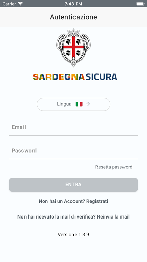
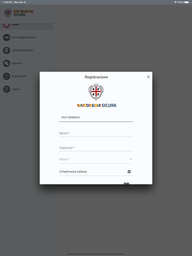
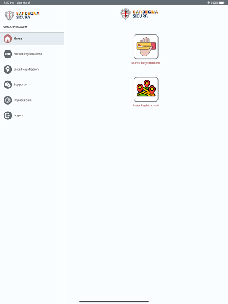
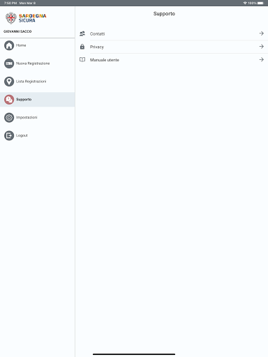

# Sardegna Sicura
App version ``1.4.3``

Analyzed with [covid-apps-observer](http://github.com/covid-apps-observer) project, version ``0.1``

## App overview
| | |
|-------------------------|-------------------------| 
| **Name**&nbsp;&nbsp;&nbsp;&nbsp;&nbsp;&nbsp;&nbsp;&nbsp;&nbsp;&nbsp;&nbsp;&nbsp;&nbsp;&nbsp;&nbsp;&nbsp;&nbsp;&nbsp;&nbsp;&nbsp;&nbsp;&nbsp;&nbsp;&nbsp;&nbsp;&nbsp;&nbsp;&nbsp;&nbsp;&nbsp;&nbsp;&nbsp;&nbsp;&nbsp;&nbsp;&nbsp;&nbsp;&nbsp;&nbsp;&nbsp;  | Sardegna Sicura |
| **Unique identifier** | it.regione.sardegna.autorizzazionicovid19 |
| **Link to Google Play** | [https://play.google.com/store/apps/details?id=it.regione.sardegna.autorizzazionicovid19](https://play.google.com/store/apps/details?id=it.regione.sardegna.autorizzazionicovid19) |
| **Summary**  | Applicazione della Regione Sardegna per registrare i propri soggiorni nell&#39;isola |
| **Privacy policy** | [https://sus.regione.sardegna.it/sus/footer/privacy](https://sus.regione.sardegna.it/sus/footer/privacy) |
| **Latest version** | 1.4.3 |
| **Last update** | 2021-05-05 18:28:06 |
| **Recent changes** | Fix bug minori |
| **Installs**  | 100.000+ |
| **Category** | Strumenti |
| **First release** | 28 mar 2020 |
| **Size**  | 9,6M |
| **Supported Android version**  | 5.1 e versioni successive |

### Description
> Sardegna Sicura è l'app rilasciata dalla Regione Autonoma della Sardegna e pensata affinché il cittadino possa procedere alla registrazione dell'imbarco per la Sardegna nell'ambito dell’emergenza COVID-19 e dell'ordinanza del Presidente della Regione N.5 del 05/03/2021.

### User interface
The developers of the app provide the following screenshots in the Google play store.
| | | |
|:-------------------------:|:-------------------------:|:-------------------------:|
 |   |   |   | 
 |   |   |   | 
 |   |   |   | 
 |   |   |   | 
 |   |   |   | 
 |   |  

## Development team
In the following we report the main information provided by the development team in the Google play store.

| | |
|-------------------------|-------------------------|
| **Developer**  | Regione Sardegna |
| **Website**  | [https://sus.regione.sardegna.it](https://sus.regione.sardegna.it) |
| **Email** | urp.emergenza@regione.sardegna.it |
| **Physical address**  | [Regione Sardegna - Via Posada n.1 - 09122 Cagliari](https://www.google.com/maps/search/Regione%20Sardegna%20-%20Via%20Posada%20n.1%20-%2009122%20Cagliari) (Google Maps) |
| **Other developed apps**  | [https://play.google.com/store/apps/developer?id=Regione+Sardegna](https://play.google.com/store/apps/developer?id=Regione+Sardegna) |

## Android support

| | |
|-------------------------|-------------------------|
| **Declared target Android version**  | Android10, version 10 (API level 29) |
| **Effective target Android version**  | Android10, version 10 (API level 29) |
| **Minimum supported Android version**  | Lollipop, version 5.1 (API level 22) |
| **Maximum target Android version**  | - |

The larger the difference between the minimum and maximum supported Android versions, the better. A larger difference means a wider audience. For example, old phones have a very low Android version, so a high minimum supported Android version means that the app cannot be used by users with old phones, thus leading to accessibility problems. 

## Requested permissions

In the following we report the complete list of the permissions requested by the app. 

| **Permission** | **Protection level** | **Description** | 
|-------------------------|-------------------------|-------------------------|
 **android.hardware location** | - | - 
 **android.permission ACCESS_COARSE_LOCATION** | :warning:**Dangerous** | Allows an app to access approximate location. 
 **android.permission ACCESS_FINE_LOCATION** | :warning:**Dangerous** | Allows an app to access precise location. 
 **android.permission ACCESS_LOCATION_EXTRA_COMMANDS** | Normal | Allows an application to access extra location provider commands. 
 **android.permission ACCESS_NETWORK_STATE** | Normal | Allows applications to access information about networks. 
 **android.permission AUTHENTICATE_ACCOUNTS** | - | - 
 **android.permission BLUETOOTH** | Normal | Allows applications to connect to paired bluetooth devices. 
 **android.permission CALL_PHONE** | :warning:**Dangerous** | Allows an application to initiate a phone call without going through the Dialer user interface for the user to confirm the call. 
 **android.permission INTERNET** | Normal | Allows applications to open network sockets. 
 **android.permission READ_APP_BADGE** | - | - 
 **android.permission READ_EXTERNAL_STORAGE** | :warning:**Dangerous** | Allows an application to read from external storage. 
 **android.permission READ_SYNC_SETTINGS** | Normal | Allows applications to read the sync settings. 
 **android.permission RECEIVE_BOOT_COMPLETED** | Normal | Allows an application to receive the Intent.ACTION_BOOT_COMPLETED that is broadcast after the system finishes booting. 
 **android.permission WAKE_LOCK** | Normal | Allows using PowerManager WakeLocks to keep processor from sleeping or screen from dimming. 
 **android.permission WRITE_EXTERNAL_STORAGE** | :warning:**Dangerous** | Allows an application to write to external storage. 
 **android.permission WRITE_SYNC_SETTINGS** | Normal | Allows applications to write the sync settings. 
 **com.anddoes.launcher.permission UPDATE_COUNT** | - | - 
 **com.google.android.c2dm.permission RECEIVE** | - | - 
 **com.google.android.finsky.permission BIND_GET_INSTALL_REFERRER_SERVICE** | - | - 
 **com.google.android.gms.permission ACTIVITY_RECOGNITION** | - | - 
 **com.htc.launcher.permission READ_SETTINGS** | - | - 
 **com.htc.launcher.permission UPDATE_SHORTCUT** | - | - 
 **com.huawei.android.launcher.permission CHANGE_BADGE** | - | - 
 **com.huawei.android.launcher.permission READ_SETTINGS** | - | - 
 **com.huawei.android.launcher.permission WRITE_SETTINGS** | - | - 
 **com.majeur.launcher.permission UPDATE_BADGE** | - | - 
 **com.oppo.launcher.permission READ_SETTINGS** | - | - 
 **com.oppo.launcher.permission WRITE_SETTINGS** | - | - 
 **com.sec.android.provider.badge.permission READ** | - | - 
 **com.sec.android.provider.badge.permission WRITE** | - | - 
 **com.sonyericsson.home.permission BROADCAST_BADGE** | - | - 
 **com.sonymobile.home.permission PROVIDER_INSERT_BADGE** | - | - 
 **me.everything.badger.permission BADGE_COUNT_READ** | - | - 
 **me.everything.badger.permission BADGE_COUNT_WRITE** | - | - 

## Mentioned servers

| **Server** | **Registrant** | **Registrant country** | **Creation date** | 
|-------------------------|-------------------------|-------------------------|-------------------------|
 | googlesyndication.com | Google LLC | :us: US | 2003-01-21 06:17:24 |
 | google.com | Google LLC | :us: US | 1997-09-15 04:00:00 |
 | facebook.com | Facebook, Inc. | :us: US | 1997-03-29 05:00:00 |
 | google-analytics.com | Google LLC | :us: US | 2005-07-18 19:24:32 |
 | app-measurement.com | Google LLC | :us: US | 2015-06-19 20:13:31 |
 | xml.org | OASIS Open | :us: US | 1997-02-03 05:00:00 |
 | googleapis.com | Google LLC | :us: US | 2005-01-25 17:52:26 |
 | googleadservices.com | Google LLC | :us: US | 2003-06-19 16:34:53 |
 | googleapis.com | Google LLC | :us: US | 2005-01-25 17:52:26 |
 | crashlytics.com | Google LLC | :us: US | 2011-01-21 15:30:40 |
 | gstatic.com | Google LLC | :us: US | 2008-02-11 15:31:25 |

## Security analysis 

Below we report the main security warnings raised by our execution of the [Androwarn](https://github.com/maaaaz/androwarn) security analysis tool.

**Telephony identifiers leakage**
> - This application reads the device phone type value 
> - This application reads the numeric name (MCC+MNC) of current registered operator 
> - This application reads the operator name 

**Connection interfaces exfiltration**
> - This application reads details about the currently active data network 
> - This application tries to find out if the currently active data network is metered 

**Telephony services abuse**
> - This application makes phone calls 

**Suspicious connection establishment**
> - This application opens a Socket and connects it to the remote address '' on the 'N/A' port  
> - This application opens a Socket and connects it to the remote address 'Ljava/lang/StringBuilder;->toString()Ljava/lang/String;' on the ': connect, resolve' port  
> - This application opens a Socket and connects it to the remote address 'Ljava/lang/StringBuilder;->toString()Ljava/lang/String;' on the 'N/A' port  
> - This application opens a Socket and connects it to the remote address 'Ljava/net/Proxy;->type()Ljava/net/Proxy$Type;' on the 'N/A' port  
> - This application opens a Socket and connects it to the remote address 'timeout' on the 'N/A' port  

**Code execution**
> - This application loads a native library: 'crashlytics' 
> - This application loads a native library: 'tool-checker' 
> - This application executes a UNIX command 
> - This application executes a UNIX command containing this argument: 'getprop' 
> - This application executes a UNIX command containing this argument: 'mount' 

## User ratings and reviews

Below we provide information about how end users are reacting to the app in terms of ratings and reviews in the Google Play store.

### Ratings

The Sardegna Sicura app has been installed by more than **100000** times. At this time, **868** rated the app and its average score is **2.85**. Below we show the distribution of the ratings across the usual star-based rating of Google Play

:star::star::star::star::star:: 313

:star::star::star::star:: 52

:star::star::star:: 60

:star::star:: 78

:star:: 365

### Reviews 

#### 5-star reviews

> COBRA 11  :date: __2021-05-06 14:43:22__

> Ok  :date: __2021-05-02 22:18:05__

> Ottimo  :date: __2021-04-30 18:45:48__

> ancora niente xche sono da poco registrato  :date: __2021-03-29 22:35:03__

> App indispensabile per accedere in Sardegna, l'ho usata ed è molto veloce, consigliata a tutti  :date: __2021-03-20 09:43:59__

> La.trovonun po' difficile da gestire  :date: __2021-03-20 00:30:41__

> Sa Sardinnya deppi essi segura  :date: __2021-03-19 15:02:53__

> Ben fatta! E speriamo che tra un pò non serva più....  :date: __2021-03-18 20:31:38__

> Io la ho installata ed utilizzata e funziona benissimo  :date: __2021-03-18 09:26:44__

> Ottima  :date: __2021-03-09 10:09:31__

#### 4-star reviews

> Concreta  :date: __2021-03-24 14:26:54__

> Oggi dopo vari tentativi falliti, sono registrata Purtroppo per il formulario compilato più volte trova sempre difetti inesistenti!Parto domani mattina presto Malpensa-Alghero Risiedo a Lugano. Svizzera ho il treno delle ore 06,00 senza formulario con codice ,sono due giorni che provo in continuazione anche dal sito indicato dalla regione sardegna niente ho spedito diverse email nessuna risposta. Incomprensibile .La causa era un mio errore nella compilazione.!Grazie per la risposta  :date: __2020-09-21 16:26:56__

> Buona, mi sono sentito in sicurezza.  :date: __2020-09-08 09:38:48__

> EDIT: ok, grazie del chiarimento, metto 4 stelle. (Non ne metto 5 perché non sono fornite delle informazioni importanti nella descrizione dell'app e non le ho nemmeno trovate su internet. Ho dovuto contattarvi 1 volta tramite email e 2 tramite recensione per avere una risposta, grazie comunque per il vostro tempo.)  :date: __2020-08-20 10:23:50__

> Non è possibile modificare una dichiarazione già inserita se si fanno errori di compilazione  :date: __2020-08-15 17:18:57__

> L'app funziona abbastanza bene, a differenza degli aeroporti e da quanto riportato da altri utenti , al porto di Livorno richiedono obbligatoriamente il QR code di autorizzazione. Su Galaxy note 8 funziona bene, non riesco ad avviare l'applicazione su xaomi note 9.  :date: __2020-08-06 15:08:49__

> Utile  :date: __2020-08-06 09:50:47__

> Buona  :date: __2020-08-02 10:05:46__

> Sono rientrata mercoledì sera da Torino, scaricato app,compilata in tutti i campi obbligatori, arrivate mail di conferma e codice CQ ma nessuno a controllato ne all'aeroporto di Torino e meno che mai a Cagliari, una signora accanto a me non ha nemmeno effettuato la registrazione!tutto ciò e un po deludente!e parliamo di sicurezza? Mah🤔🤔  :date: __2020-08-01 13:48:13__

> Non tiene la password  :date: __2020-07-30 08:29:48__

#### 3-star reviews

> per venire giù in Sardegna verso fine agosto primi di settembre servirà ancora scaricare l'applicazione!?  :date: __2021-05-13 19:07:00__

> L'app non da la possibilità di modificare una richiesta già effettuata sui dati di arrivo o partenza che possono essere variati per ragioni diverse (tipo volo annullato e data spostata...) o di poter cancellare la richiesta per inoltrarne un'altra ex novo. Sicuramente da migliorare.  :date: __2021-03-19 12:36:51__

> Buongiorno, ma quest'app serve ancora per viaggiare?  :date: __2021-02-23 07:09:48__

> Allora bisogna presentarlo all imbarco si o no, serve ancora o no, non risponde ai sensi del dcpm ecc ecc, ci vuole ancora o no, chiarezza no dubbi.  :date: __2020-11-28 12:16:19__

> Buongiorno, vorrei capire se questa app sia ancora in uso. L'ho utilizzata ad Agosto senza problemi, ma ora non si apre più.  :date: __2020-11-16 12:32:33__

> Sinceramente non ho capito a cosa serve. Sono rientrata il 15 ottobre a Cagliari. App attiva, con il codice da mostrare, scesa dall'aereo, nessun controllo, neanche la temperatura, cosa che invece viene fatta regolarmente negli altri aeroporti.  :date: __2020-10-16 20:15:31__

> Come già segnalato non permette la cancellazione di spostamenti inseriti e poi non effettuati, in caso di tracciamento, questo creerebbe problemi. Per il resto mi auguro sia utile anche se fin'ora nessuno ha mai verificato la compilazione in aeroporto.  :date: __2020-09-18 10:41:11__

> Salve, viaggio con mia moglie e figlia di 13 anni, devono scaricare anche loro l'applicazione per comunicare ciò che chiedete per il soggiorno? Per ora 3 perché sn riuscito ad usarla  :date: __2020-09-12 19:10:10__

> Ridicola la traduzione in sardo, io sono sardo DOCG ma non capisco alcuni termini per altri la traduzione è ridicola. Perché usare la email per autenticarsi, meglio il numero di telefono.  :date: __2020-08-23 23:29:49__

> Nella compilazione dei dati per potersi registrare e usare la app si è costretti a inserire i dati relativi alla residenza in Sardegna nonostante il box per la residenza in Sardegna non sia stato spuntato. È bastato inserire "--“ in ogni campo per i dati dei residenti in Sardegna per poter proseguire. Non esiste la possibilità per stranieri e/o residenti all'estero di dichiararlo esplicitamente. Anche in questo caso è bastato scrivere il nome del paese estero alla voce "provincia". Etc...  :date: __2020-08-17 12:40:16__

#### 2-star reviews

> Non c'è la possibilità di modificare i dati appena inseriti e occorre rifare registrazione arrivo  :date: __2021-05-16 15:48:22__

> Ciao, parlo da pendolare e quindi devo compilare tale dichiarazione ogni volta, sarebbe utile: LOGIN con impronta digitale o memorizzazione password ( ad oggi ancora non memorizza la Poter richiamare una registrazione precedente e cambiare solo le date ( pensate ad uno che fa spesso lo stesso viaggio)  :date: __2021-04-14 09:42:37__

> Non siete riusciti a trovare il modo di procedere ai controlli in entrata x combattere il covid 19. Mi dispiace x i Sardi che devono subire questa mancanza. Sinceri saluti da un Sardo che ha tanta nostalgia della Sardegna.  :date: __2021-03-23 20:54:01__

> Non riesco a registrarmi, cosa faccio?  :date: __2021-03-15 18:17:46__

> Devo rientrare oggi e non mi lascia andare avanti per completare la registrazione  :date: __2021-03-13 07:37:07__

> Non riesco ad accedere agli spostamenti non capisco perche.  :date: __2020-11-13 17:35:04__

> Poco precisa  :date: __2020-10-09 14:13:47__

> Inserisco i dati email e password mi dice errato come devo fare e assurdo  :date: __2020-09-07 16:22:43__

> Non si apre più, nonostante mi ero già registrato mi fate sapere come fare ?  :date: __2020-09-02 18:35:42__

> Scaricato l'applicazione,ma continua a caricare (buffering) e purtroppo non posso accedere perché non posso inserire le credenziali.  :date: __2020-08-28 12:19:09__

#### 1-star reviews

> Ho inserito tutti i dati correttamente, ma dopo il salvataggio LE DATE SONO STATE CAMBIATE!!! Sono sicurissimo di averle inserite correttamente. Mai vista una cosa così.  :date: __2021-05-29 21:04:25__

> Se Solinas vuole affossare la principale fonte di reddito della Sardegna ci sta riuscendo! App inutile assurda coi certificati vaccinali alla mano. Un casino nei porti. Il download che nn parte mai mai Tanta burocrazia e tecnologia da terzo mondo.  :date: __2021-05-28 19:23:11__

> Non funziona su Sony Xperia xz1 compact, lo scorso anno funzionava.  :date: __2021-05-26 14:54:17__

> Buongiorno, ho inserito la data di arrivo nel portale ( 29-05-21) ma una volta inserita la sposta al giorno successivo, ho effettuato diversi tentativi ( 3 tentativi quindi dubito fortemente di aver commesso errori 3 volte di seguito), ho provato a chiamare il numero verde, inviato email all'urp.emergenza, non ho ricevuto alcun tipo di aiuto. Non accetto risposte quali "provi ad inserire i dati corretti" , sono SICURA di aver fatto tutto giusto  :date: __2021-05-26 13:24:17__

> Buongiorno,siamo alla quarta richiesta di risoluzione del problema ma ancora non avete capito la situazione,come faccio a riprovare con la registrazione se da cellulare l'applicazione non si apre nemmeno?inoltre ho già scritto alla mail che mi avete indicato senza avere nessuna risposta  :date: __2021-05-24 14:12:00__

> Una pagliacciata. Quando lo avrete compreso sarà già troppo tardi.  :date: __2021-05-22 22:58:19__

> Funziona da fare pena  :date: __2021-05-22 21:54:42__

> Male troppo complicata  :date: __2021-05-22 17:31:21__

> Ho scaricato e disinstallato l'app diverse volte ma niente non funziona ,cosa posso fare ?  :date: __2021-05-22 07:39:04__

> Ho necessità di resettare la password, ma non mi arriva l'email per completare la procedura. Una app inutile al pari di queste inutili misure anticovid che non servono a limitare i contagi, ma solo a complicare la vita alle persone  :date: __2021-05-21 05:34:48__

